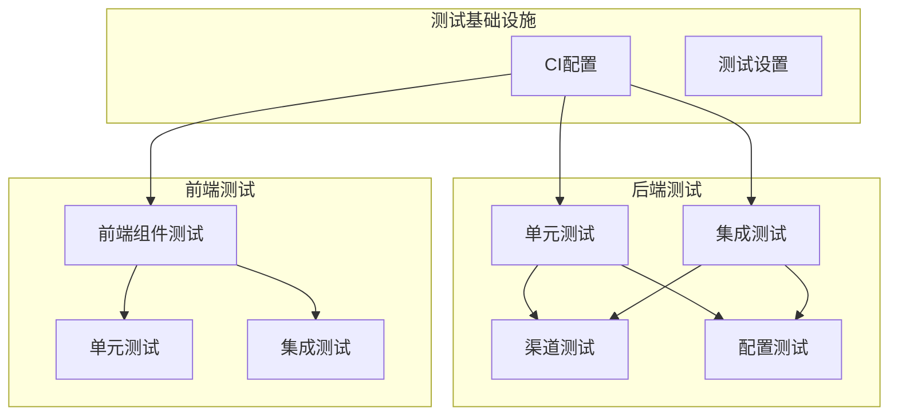
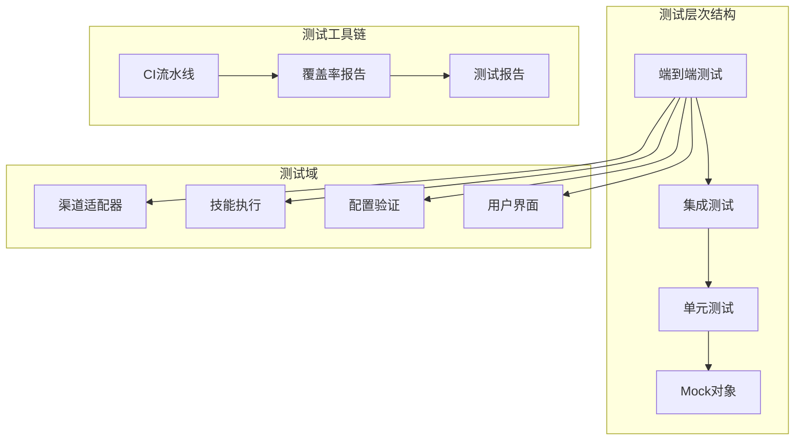
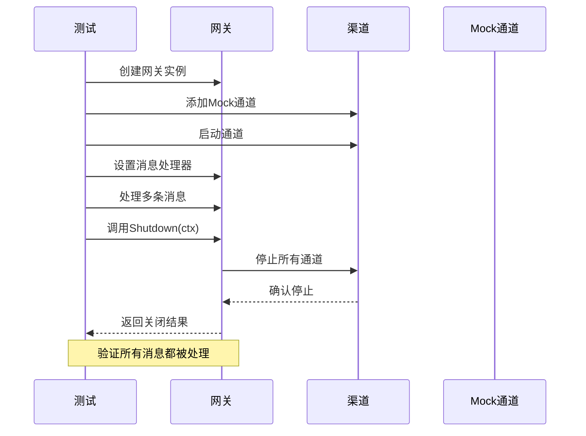
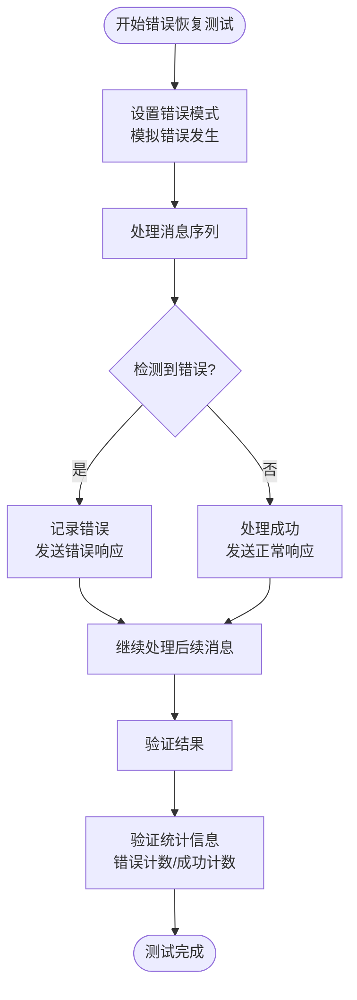
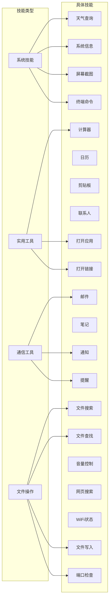
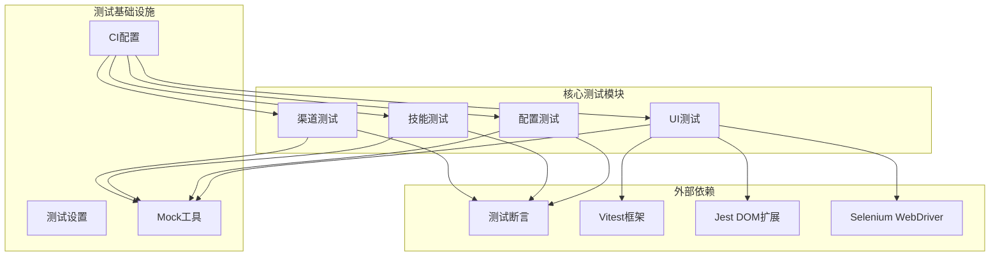

# 扩展测试策略

<cite>
**本文档引用的文件**
- [.github/workflows/ci.yml](file://.github/workflows/ci.yml)
- [internal/tests/integration_test.go](file://internal/tests/integration_test.go)
- [internal/tests/portcheck_test.go](file://internal/tests/portcheck_test.go)
- [internal/adapters/channels/gateway_graceful_shutdown_test.go](file://internal/adapters/channels/gateway_graceful_shutdown_test.go)
- [internal/adapters/channels/gateway_error_recovery_test.go](file://internal/adapters/channels/gateway_error_recovery_test.go)
- [internal/adapters/channels/mock_channel.go](file://internal/adapters/channels/mock_channel.go)
- [internal/adapters/channels/test_utils.go](file://internal/adapters/channels/test_utils.go)
- [internal/usecase/skills/skill_mgr_integration_test.go](file://internal/usecase/skills/skill_mgr_integration_test.go)
- [internal/config/config_test.go](file://internal/config/config_test.go)
- [dashboard/src/test/setup.ts](file://dashboard/src/test/setup.ts)
- [dashboard/src/components/skills/SkillCard.test.tsx](file://dashboard/src/components/skills/SkillCard.test.tsx)
- [dashboard/src/components/channels/ChannelCard.test.tsx](file://dashboard/src/components/channels/ChannelCard.test.tsx)
- [dashboard/package.json](file://dashboard/package.json)
- [go.mod](file://go.mod)
</cite>

## 目录
1. [简介](#简介)
2. [项目结构](#项目结构)
3. [核心组件](#核心组件)
4. [架构概览](#架构概览)
5. [详细组件分析](#详细组件分析)
6. [依赖关系分析](#依赖关系分析)
7. [性能考虑](#性能考虑)
8. [故障排除指南](#故障排除指南)
9. [结论](#结论)
10. [附录](#附录)

## 简介

MindX 扩展开发测试策略文档旨在为 MindX 生态系统的扩展功能提供全面的测试方法和最佳实践。本项目采用多层次测试策略，涵盖单元测试、集成测试和端到端测试，确保扩展功能的质量和稳定性。

MindX 是一个智能体扩展平台，支持多种渠道适配器、技能执行和配置验证。测试策略重点关注以下方面：

- **渠道适配器测试**：验证不同通信渠道的稳定性和可靠性
- **技能执行测试**：确保技能的正确执行和响应
- **配置验证测试**：保证系统配置的完整性和有效性
- **性能和压力测试**：评估系统在高负载下的表现
- **自动化测试流水线**：实现持续集成和持续部署

## 项目结构

项目采用模块化的组织结构，测试相关文件分布在多个目录中：

**图表来源**
- [.github/workflows/ci.yml](file://.github/workflows/ci.yml#L1-L49)
- [internal/tests/integration_test.go](file://internal/tests/integration_test.go#L1-L259)

**章节来源**
- [.github/workflows/ci.yml](file://.github/workflows/ci.yml#L1-L49)
- [go.mod](file://go.mod#L1-L113)

## 核心组件

### 测试框架和工具

项目使用了多种测试框架和技术栈：

| 组件 | 工具 | 版本 | 用途 |
|------|------|------|------|
| Go后端测试 | testify | ^1.11.1 | 断言和测试套件 |
| 前端测试 | vitest | ^3.2.4 | 单元测试框架 |
| 前端测试 | @testing-library/react | ^16.3.2 | 组件测试 |
| 前端测试 | jest-dom | ^6.9.1 | DOM断言 |
| CI/CD | GitHub Actions | v4 | 自动化测试 |

### 测试环境配置

测试环境通过以下方式配置：

- **工作空间设置**：使用 `.test` 目录作为测试工作空间
- **配置路径**：通过环境变量 `CONFIG_PATH` 指定配置文件位置
- **日志配置**：集成测试使用 `/tmp` 目录存储测试日志
- **国际化支持**：测试前初始化 i18n 功能

**章节来源**
- [.github/workflows/ci.yml](file://.github/workflows/ci.yml#L22-L30)
- [internal/tests/integration_test.go](file://internal/tests/integration_test.go#L44-L65)

## 架构概览

测试架构采用分层设计，从底层的单元测试到顶层的端到端测试：

**图表来源**
- [internal/tests/integration_test.go](file://internal/tests/integration_test.go#L1-L259)
- [internal/adapters/channels/gateway_graceful_shutdown_test.go](file://internal/adapters/channels/gateway_graceful_shutdown_test.go#L1-L268)

## 详细组件分析

### 渠道适配器测试

渠道适配器测试专注于验证不同通信渠道的稳定性和可靠性，包括优雅关闭、错误恢复和并发处理能力。

#### 优雅关闭测试

优雅关闭测试验证系统在关闭过程中的行为，确保所有消息得到正确处理：

**图表来源**
- [internal/adapters/channels/gateway_graceful_shutdown_test.go](file://internal/adapters/channels/gateway_graceful_shutdown_test.go#L16-L46)

#### 错误恢复测试

错误恢复测试验证系统在面对错误时的恢复能力和稳定性：

**图表来源**
- [internal/adapters/channels/gateway_error_recovery_test.go](file://internal/adapters/channels/gateway_error_recovery_test.go#L13-L49)

**章节来源**
- [internal/adapters/channels/gateway_graceful_shutdown_test.go](file://internal/adapters/channels/gateway_graceful_shutdown_test.go#L1-L268)
- [internal/adapters/channels/gateway_error_recovery_test.go](file://internal/adapters/channels/gateway_error_recovery_test.go#L1-L238)

### 技能执行测试

技能执行测试验证 MindX 的核心功能——技能的发现、匹配和执行能力。

#### 集成测试套件

技能管理器集成测试套件提供了全面的技能执行验证：

| 测试类别 | 测试方法 | 验证内容 |
|----------|----------|----------|
| 技能发现 | `TestGetSkills()` | 验证技能列表获取 |
| 关键词搜索 | `TestSearchSkills_WithKeywords()` | 验证技能搜索和排序 |
| 技能执行 | `TestExecuteByName_NotFound()` | 验证技能执行和错误处理 |
| 启用/禁用 | `TestEnableDisable()` | 验证技能状态管理 |
| 并发访问 | `TestConcurrentAccess()` | 验证并发安全性 |

#### 技能测试场景

系统包含 25 个预定义的技能测试场景，覆盖各种常用功能：

**图表来源**
- [internal/tests/integration_test.go](file://internal/tests/integration_test.go#L104-L126)

**章节来源**
- [internal/tests/integration_test.go](file://internal/tests/integration_test.go#L1-L259)
- [internal/usecase/skills/skill_mgr_integration_test.go](file://internal/usecase/skills/skill_mgr_integration_test.go#L1-L378)

### 配置验证测试

配置验证测试确保系统配置的完整性和有效性，包括服务器配置、渠道配置和模型配置。

#### 配置加载测试

配置测试验证不同配置场景下的系统行为：

| 测试场景 | 验证内容 | 预期结果 |
|----------|----------|----------|
| 成功加载 | 有效配置文件 | 配置正确加载 |
| 缺失文件 | 不存在的配置文件 | 返回错误 |
| 初始化失败 | 无配置文件 | 返回错误 |

**章节来源**
- [internal/config/config_test.go](file://internal/config/config_test.go#L1-L56)

### 前端组件测试

前端测试使用现代测试工具链，确保用户界面组件的正确性和用户体验。

#### 组件测试策略

| 组件类型 | 测试重点 | 使用的技术 |
|----------|----------|------------|
| 技能卡片 | 渲染、交互、状态显示 | Vitest + Testing Library |
| 渠道卡片 | 状态管理、按钮行为 | Vitest + Testing Library |
| 表单组件 | 输入验证、事件处理 | Vitest + Testing Library |
| 导航组件 | 路由切换、状态保持 | Vitest + Testing Library |

**章节来源**
- [dashboard/src/components/skills/SkillCard.test.tsx](file://dashboard/src/components/skills/SkillCard.test.tsx#L1-L84)
- [dashboard/src/components/channels/ChannelCard.test.tsx](file://dashboard/src/components/channels/ChannelCard.test.tsx#L1-L66)

## 依赖关系分析

测试系统的依赖关系体现了清晰的分层架构：

**图表来源**
- [go.mod](file://go.mod#L22-L28)
- [dashboard/package.json](file://dashboard/package.json#L38-L56)

**章节来源**
- [go.mod](file://go.mod#L1-L113)
- [dashboard/package.json](file://dashboard/package.json#L1-L58)

## 性能考虑

### 测试性能优化

项目采用了多种性能优化策略：

- **短测试跳过**：使用 `testing.Short()` 跳过长时间运行的集成测试
- **并发测试**：利用 Go 的并发特性进行并行测试执行
- **Mock优化**：使用 Mock 对象减少外部依赖的影响
- **资源管理**：合理管理测试资源，避免内存泄漏

### 性能测试建议

虽然当前项目主要关注功能测试，但可以扩展以下性能测试：

1. **响应时间测试**：测量技能执行的平均响应时间
2. **并发性能测试**：验证系统在高并发场景下的表现
3. **内存使用测试**：监控长时间运行的内存使用情况
4. **数据库性能测试**：验证数据持久化的性能

## 故障排除指南

### 常见测试问题

| 问题类型 | 症状 | 解决方案 |
|----------|------|----------|
| 测试超时 | 集成测试长时间运行 | 检查外部依赖服务状态 |
| Mock失败 | Mock对象行为异常 | 验证Mock配置和初始化 |
| 并发冲突 | 数据竞争错误 | 使用同步机制保护共享状态 |
| 资源泄漏 | 内存使用持续增长 | 确保正确清理测试资源 |

### 调试技巧

1. **日志分析**：检查 `/tmp` 目录下的测试日志文件
2. **断点调试**：使用 IDE 设置断点进行调试
3. **逐步执行**：将复杂测试分解为简单步骤
4. **隔离问题**：单独运行有问题的测试用例

**章节来源**
- [internal/tests/integration_test.go](file://internal/tests/integration_test.go#L73-L88)

## 结论

MindX 扩展开发测试策略建立了全面的测试体系，涵盖了从底层单元测试到顶层端到端测试的各个层面。通过合理的测试分层、完善的测试工具链和严格的测试流程，确保了扩展功能的质量和稳定性。

### 主要成就

- **多层次测试覆盖**：从单元测试到端到端测试的完整覆盖
- **现代化测试工具**：采用最新的测试技术和框架
- **自动化测试流水线**：实现了持续集成和持续部署
- **全面的测试场景**：覆盖了各种使用场景和边界条件

### 未来改进方向

1. **增强性能测试**：扩展性能和压力测试能力
2. **提高测试覆盖率**：目标达到 90% 以上的代码覆盖率
3. **测试数据管理**：建立更完善的测试数据管理系统
4. **测试报告优化**：提供更详细的测试结果分析

## 附录

### 测试配置参考

#### CI/CD 配置要点

- **Go版本**：使用 Go 1.25.1
- **Node版本**：使用 Node.js 20
- **测试执行**：自动执行所有测试用例
- **工作空间**：使用 `.test` 目录作为测试工作空间

#### 测试数据准备

- **技能测试数据**：包含 25 个预定义的技能场景
- **渠道测试数据**：支持多种渠道类型的测试
- **配置测试数据**：包含各种配置场景的测试用例
- **前端测试数据**：模拟用户交互的各种场景