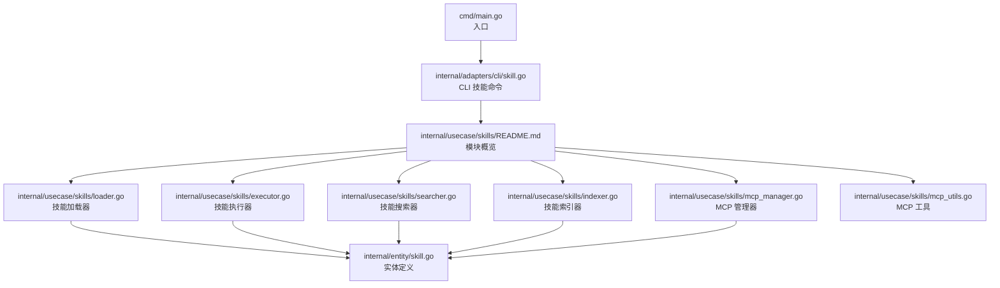
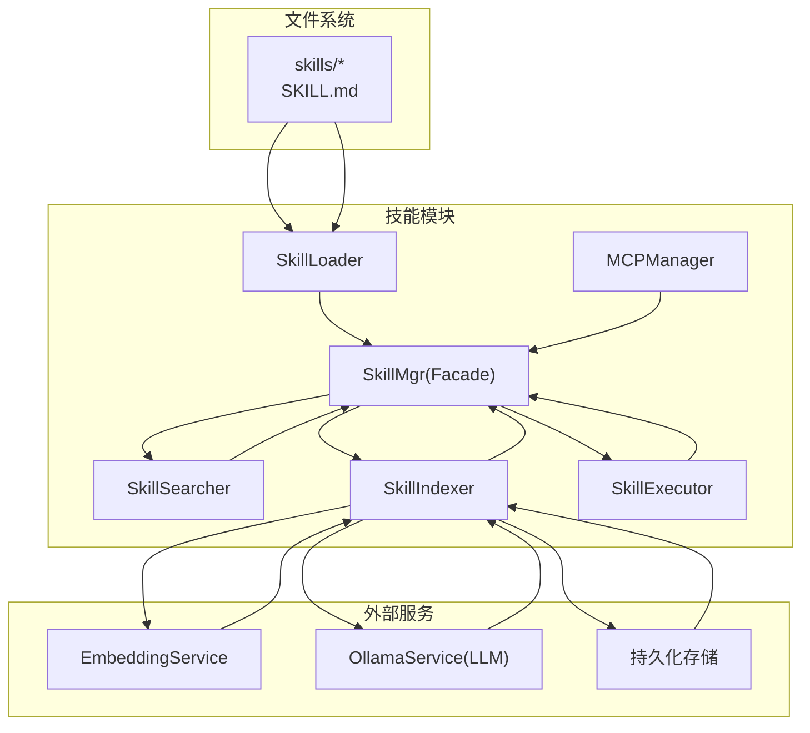
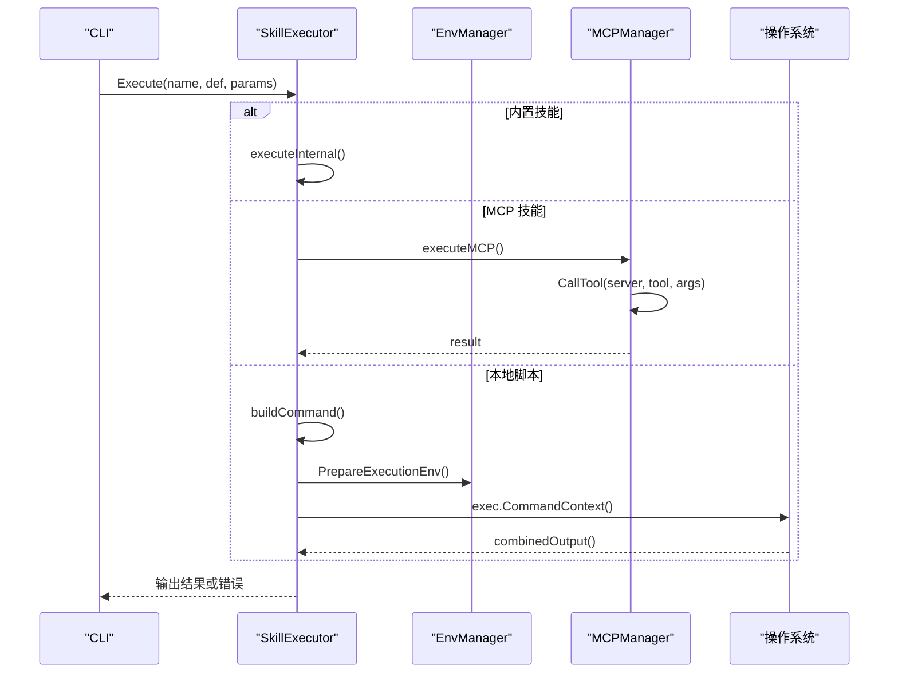
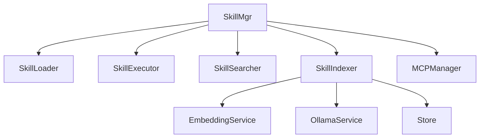

# 技能开发指南

<cite>
**本文引用的文件**
- [cmd/main.go](file://cmd/main.go)
- [internal/usecase/skills/README.md](file://internal/usecase/skills/README.md)
- [internal/usecase/skills/SKILL_DEVELOPMENT.md](file://internal/usecase/skills/SKILL_DEVELOPMENT.md)
- [internal/usecase/skills/loader.go](file://internal/usecase/skills/loader.go)
- [internal/usecase/skills/executor.go](file://internal/usecase/skills/executor.go)
- [internal/usecase/skills/searcher.go](file://internal/usecase/skills/searcher.go)
- [internal/usecase/skills/indexer.go](file://internal/usecase/skills/indexer.go)
- [internal/usecase/skills/mcp_manager.go](file://internal/usecase/skills/mcp_manager.go)
- [internal/usecase/skills/mcp_utils.go](file://internal/usecase/skills/mcp_utils.go)
- [internal/adapters/cli/skill.go](file://internal/adapters/cli/skill.go)
- [internal/entity/skill.go](file://internal/entity/skill.go)
- [config/mcp_servers.json.template](file://config/mcp_servers.json.template)
- [skills/calculator/SKILL.md](file://skills/calculator/SKILL.md)
- [skills/web_search/SKILL.md](file://skills/web_search/SKILL.md)
</cite>

## 目录
1. [简介](#简介)
2. [项目结构](#项目结构)
3. [核心组件](#核心组件)
4. [架构总览](#架构总览)
5. [详细组件分析](#详细组件分析)
6. [依赖关系分析](#依赖关系分析)
7. [性能考量](#性能考量)
8. [故障排查指南](#故障排查指南)
9. [结论](#结论)
10. [附录](#附录)

## 简介
本指南面向第三方开发者，系统讲解 MindX 技能系统的架构设计与开发规范，涵盖以下主题：
- 技能定义格式（SKILL.md）与元数据字段
- 执行器接口与三种执行路径（内置、本地脚本、MCP）
- 搜索与索引机制（向量化与关键词混合）
- CLI 技能开发流程（脚本编写规范、参数传递、输出格式）
- MCP 技能开发方法（协议实现、工具描述与调用）
- 开发示例、测试方法、调试技巧与部署流程
- 技能搜索与向量化存储的应用

## 项目结构
MindX 技能系统位于 internal/usecase/skills 子模块，围绕“加载-执行-搜索-索引”闭环组织，CLI 入口通过 cmd/main.go 启动，适配器层在 internal/adapters/cli 下提供命令行交互。

图表来源
- [cmd/main.go](file://cmd/main.go#L1-L21)
- [internal/usecase/skills/README.md](file://internal/usecase/skills/README.md#L1-L168)
- [internal/adapters/cli/skill.go](file://internal/adapters/cli/skill.go#L1-L327)
- [internal/usecase/skills/loader.go](file://internal/usecase/skills/loader.go#L1-L249)
- [internal/usecase/skills/executor.go](file://internal/usecase/skills/executor.go#L1-L402)
- [internal/usecase/skills/searcher.go](file://internal/usecase/skills/searcher.go#L1-L307)
- [internal/usecase/skills/indexer.go](file://internal/usecase/skills/indexer.go#L1-L547)
- [internal/usecase/skills/mcp_manager.go](file://internal/usecase/skills/mcp_manager.go#L1-L292)
- [internal/usecase/skills/mcp_utils.go](file://internal/usecase/skills/mcp_utils.go#L1-L132)
- [internal/entity/skill.go](file://internal/entity/skill.go#L1-L83)

章节来源
- [cmd/main.go](file://cmd/main.go#L1-L21)
- [internal/usecase/skills/README.md](file://internal/usecase/skills/README.md#L1-L168)

## 核心组件
- 技能加载器（SkillLoader）：扫描 skills 目录，解析 SKILL.md，校验依赖，构建技能与信息映射。
- 技能执行器（SkillExecutor）：根据技能类型（内置/本地/MCP）执行命令或调用工具，统计执行指标。
- 技能搜索器（SkillSearcher）：支持向量相似度与关键词匹配的混合搜索。
- 技能索引器（SkillIndexer）：提取关键词、生成向量、持久化索引，支持后台异步重建。
- MCP 管理器（MCPManager）：连接 MCP 服务器，列举工具，调用工具，维护状态。
- 实体定义（entity.SkillDef/Info）：标准化技能元数据、参数、统计与向量字段。

章节来源
- [internal/usecase/skills/README.md](file://internal/usecase/skills/README.md#L48-L168)
- [internal/entity/skill.go](file://internal/entity/skill.go#L1-L83)

## 架构总览
MindX 技能系统采用 Facade 模式，SkillMgr 作为统一入口协调各子组件；数据流从文件系统加载 SKILL.md，经索引器生成向量索引，搜索器结合向量与关键词匹配，最终由执行器按类型执行。

图表来源
- [internal/usecase/skills/README.md](file://internal/usecase/skills/README.md#L9-L46)
- [internal/usecase/skills/indexer.go](file://internal/usecase/skills/indexer.go#L32-L73)

## 详细组件分析

### 技能定义格式（SKILL.md）
- 结构：YAML Frontmatter + Markdown 文档
- 必填字段：name、description、version、category、tags、enabled、command/或 metadata.mcp
- 执行配置：command、timeout
- 参数定义：parameters（type、description、required）
- 依赖声明：requires（bins、env）
- 安装方法：install（kind、package/formula、label、os）
- MCP 标记：metadata.mcp（server、tool）

章节来源
- [internal/usecase/skills/SKILL_DEVELOPMENT.md](file://internal/usecase/skills/SKILL_DEVELOPMENT.md#L18-L142)
- [internal/usecase/skills/SKILL_DEVELOPMENT.md](file://internal/usecase/skills/SKILL_DEVELOPMENT.md#L365-L434)
- [internal/entity/skill.go](file://internal/entity/skill.go#L5-L25)

### CLI 技能开发流程
- 目录结构：SKILL.md + 脚本 + 可选 lib/references
- 输入：标准输入（stdin）接收 JSON 参数
- 输出：标准输出（stdout）返回 JSON 结果；错误输出至 stderr，并使用非零退出码
- 超时：脚本执行受 timeout 控制
- 跨平台：通过 os 字段声明支持系统；脚本内做环境检查
- 安全：敏感信息使用环境变量；在 requires.env 中声明
- 测试：本地 echo + 脚本验证输出格式；验证 YAML frontmatter

章节来源
- [internal/usecase/skills/SKILL_DEVELOPMENT.md](file://internal/usecase/skills/SKILL_DEVELOPMENT.md#L201-L354)

### MCP 技能开发方法
- 标记方式：在 SKILL.md 的 metadata.mcp 中声明 server 与 tool
- 协议实现：MCPManager 支持 stdio 与 SSE 两种传输；自动发现工具并缓存
- 工具调用：SkillExecutor.executeMCP 通过 MCPManager.CallTool 调用
- 工具描述：MCPToolToSkillDef 将 MCP Tool 的 JSON Schema 转换为 SkillDef 参数定义
- 配置模板：config/mcp_servers.json.template 提供 MCP 服务器配置入口

章节来源
- [internal/usecase/skills/mcp_manager.go](file://internal/usecase/skills/mcp_manager.go#L49-L141)
- [internal/usecase/skills/mcp_manager.go](file://internal/usecase/skills/mcp_manager.go#L169-L204)
- [internal/usecase/skills/mcp_utils.go](file://internal/usecase/skills/mcp_utils.go#L56-L97)
- [config/mcp_servers.json.template](file://config/mcp_servers.json.template#L1-L4)

### 执行器接口与执行路径
- 内置技能：SkillExecutor.executeInternal，通过内部函数直接执行
- 本地脚本：SkillExecutor.executeExternal，构建命令、准备环境、传递参数、捕获输出
- MCP 技能：SkillExecutor.executeMCP，基于 MCPManager 调用远端工具
- 统一入口：SkillExecutor.Execute 根据技能类型路由到对应执行路径
- 统计记录：UpdateStats 持续更新成功/失败次数、平均耗时与最近运行时间

图表来源
- [internal/usecase/skills/executor.go](file://internal/usecase/skills/executor.go#L57-L195)
- [internal/usecase/skills/executor.go](file://internal/usecase/skills/executor.go#L105-L136)
- [internal/usecase/skills/executor.go](file://internal/usecase/skills/executor.go#L138-L195)

章节来源
- [internal/usecase/skills/executor.go](file://internal/usecase/skills/executor.go#L19-L42)
- [internal/usecase/skills/executor.go](file://internal/usecase/skills/executor.go#L57-L195)

### 搜索与索引机制
- 搜索器：优先使用向量相似度（cosine similarity），若无向量或失败则回退关键词匹配
- 索引器：使用 LLM 从技能描述中抽取关键词，再对关键词生成向量，持久化存储
- 异步重建：后台工作线程消费任务队列，支持重启后恢复队列
- 数据结构：SkillInfo 含向量字段；SkillIndexer 维护技能名到向量矩阵的映射

图表来源
- [internal/usecase/skills/searcher.go](file://internal/usecase/skills/searcher.go#L42-L62)
- [internal/usecase/skills/searcher.go](file://internal/usecase/skills/searcher.go#L72-L188)
- [internal/usecase/skills/indexer.go](file://internal/usecase/skills/indexer.go#L116-L176)
- [internal/usecase/skills/indexer.go](file://internal/usecase/skills/indexer.go#L343-L393)

章节来源
- [internal/usecase/skills/searcher.go](file://internal/usecase/skills/searcher.go#L15-L32)
- [internal/usecase/skills/indexer.go](file://internal/usecase/skills/indexer.go#L32-L73)

### CLI 技能开发示例
- 计算器技能：演示了基本的 SKILL.md 字段与参数定义
- 网页搜索技能：展示了 is_internal、参数与输出格式示例

章节来源
- [skills/calculator/SKILL.md](file://skills/calculator/SKILL.md#L1-L37)
- [skills/web_search/SKILL.md](file://skills/web_search/SKILL.md#L1-L67)

## 依赖关系分析
- 组件耦合：SkillMgr 作为门面协调各子组件；Loader/Executor/Searcher/Indexer/MCPManager 通过接口协作
- 外部依赖：EmbeddingService、OllamaService、持久化存储
- 关键依赖链：Loader -> Indexer -> Searcher -> Executor；MCPManager 与 Loader 协同注册 MCP 技能

图表来源
- [internal/usecase/skills/README.md](file://internal/usecase/skills/README.md#L33-L45)

章节来源
- [internal/usecase/skills/README.md](file://internal/usecase/skills/README.md#L48-L168)

## 性能考量
- 索引预计算：后台异步重建，避免阻塞主线程；支持重启恢复队列
- 向量检索：使用余弦相似度，阈值过滤与排序提升召回质量
- 执行超时：本地脚本与 MCP 调用均设置超时，防止长时间阻塞
- 统计与监控：持续记录执行耗时与成功率，便于性能优化

## 故障排查指南
- 依赖缺失：通过 CheckDependencies 检查 bins/env；CLI 列表中会显示缺失项
- 脚本执行失败：查看 combinedOutput 输出；确保 stderr 输出错误信息并返回非零退出码
- MCP 连接问题：检查 mcp_servers.json.template 配置；关注连接状态与工具发现日志
- 索引异常：确认 EmbeddingService 与 OllamaService 可用；查看向量生成与持久化日志

章节来源
- [internal/usecase/skills/loader.go](file://internal/usecase/skills/loader.go#L186-L204)
- [internal/adapters/cli/skill.go](file://internal/adapters/cli/skill.go#L24-L76)
- [internal/usecase/skills/mcp_manager.go](file://internal/usecase/skills/mcp_manager.go#L49-L141)
- [internal/usecase/skills/indexer.go](file://internal/usecase/skills/indexer.go#L343-L393)

## 结论
MindX 技能系统通过标准化的 SKILL.md 定义、灵活的执行路径与强大的搜索/索引能力，为开发者提供了统一、可扩展的技能开发框架。无论是本地脚本还是 MCP 工具，均可无缝接入同一套生命周期管理与用户体验。

## 附录

### CLI 技能命令参考
- 列出技能：mindx skill list [--category]
- 运行技能：mindx skill run <name> [--key value...]
- 校验技能：mindx skill validate <name>
- 启用/禁用：mindx skill enable/disable <name>
- 重载技能：mindx skill reload

章节来源
- [internal/adapters/cli/skill.go](file://internal/adapters/cli/skill.go#L18-L253)

### MCP 配置模板
- mcp_servers.json.template 提供 MCP 服务器配置入口，支持 stdio 与 SSE 传输

章节来源
- [config/mcp_servers.json.template](file://config/mcp_servers.json.template#L1-L4)