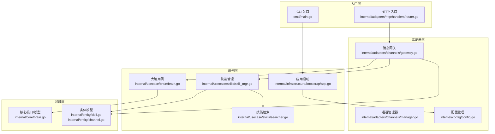
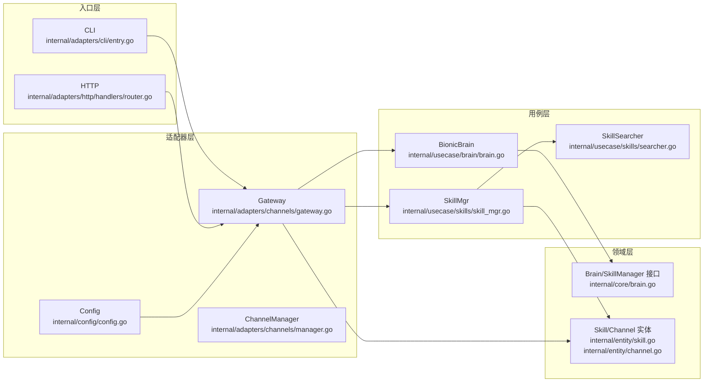
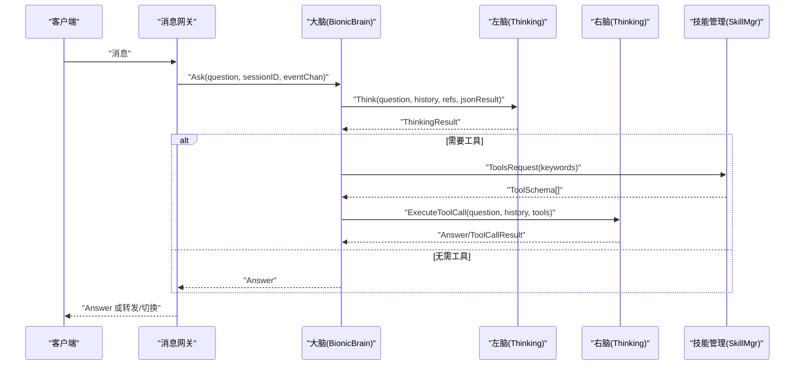
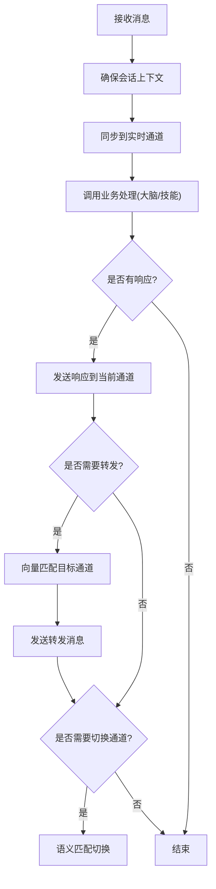
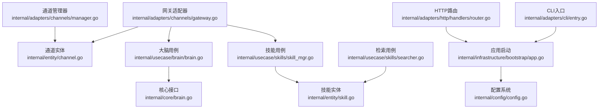

# 新功能开发

<cite>
**本文档引用的文件**
- [cmd/main.go](file://cmd/main.go)
- [internal/infrastructure/bootstrap/app.go](file://internal/infrastructure/bootstrap/app.go)
- [internal/adapters/http/handlers/router.go](file://internal/adapters/http/handlers/router.go)
- [internal/adapters/channels/gateway.go](file://internal/adapters/channels/gateway.go)
- [internal/adapters/channels/manager.go](file://internal/adapters/channels/manager.go)
- [internal/core/brain.go](file://internal/core/brain.go)
- [internal/usecase/brain/brain.go](file://internal/usecase/brain/brain.go)
- [internal/usecase/brain/context_preparer.go](file://internal/usecase/brain/context_preparer.go)
- [internal/usecase/skills/skill_mgr.go](file://internal/usecase/skills/skill_mgr.go)
- [internal/usecase/skills/searcher.go](file://internal/usecase/skills/searcher.go)
- [internal/entity/skill.go](file://internal/entity/skill.go)
- [internal/entity/channel.go](file://internal/entity/channel.go)
- [internal/config/config.go](file://internal/config/config.go)
- [internal/adapters/cli/entry.go](file://internal/adapters/cli/entry.go)
</cite>

## 目录
1. [简介](#简介)
2. [项目结构](#项目结构)
3. [核心组件](#核心组件)
4. [架构总览](#架构总览)
5. [详细组件分析](#详细组件分析)
6. [依赖关系分析](#依赖关系分析)
7. [性能考虑](#性能考虑)
8. [故障排查指南](#故障排查指南)
9. [结论](#结论)
10. [附录](#附录)

## 简介
本文件面向在 MindX 现有架构上开发新功能模块的工程师，系统阐述如何基于分层架构（领域层、用例层、适配器层）扩展新功能，包括：
- 核心模块设计原则与职责边界
- 用例层实现方法与流程编排
- 适配器层扩展机制与集成方式
- 领域模型定义、业务逻辑实现与接口规范
- 从需求分析到代码实现的完整开发流程
- 具体开发示例与最佳实践（错误处理、性能优化、测试策略）

## 项目结构
MindX 采用清晰的分层架构：
- 入口层：命令行入口与 HTTP 服务入口
- 适配器层：HTTP 接口、CLI、渠道通道（微信、飞书、Webhook 等）
- 用例层：大脑思考、技能管理、能力管理、会话管理、定时任务等业务用例
- 领域层：核心接口与实体模型
- 基础设施层：日志、持久化、嵌入向量化、模型服务等

图表来源
- [cmd/main.go](file://cmd/main.go#L1-L21)
- [internal/adapters/http/handlers/router.go](file://internal/adapters/http/handlers/router.go#L1-L150)
- [internal/adapters/channels/gateway.go](file://internal/adapters/channels/gateway.go#L1-L510)
- [internal/adapters/channels/manager.go](file://internal/adapters/channels/manager.go#L1-L230)
- [internal/infrastructure/bootstrap/app.go](file://internal/infrastructure/bootstrap/app.go#L1-L468)
- [internal/usecase/brain/brain.go](file://internal/usecase/brain/brain.go#L1-L674)
- [internal/usecase/skills/skill_mgr.go](file://internal/usecase/skills/skill_mgr.go#L1-L558)
- [internal/usecase/skills/searcher.go](file://internal/usecase/skills/searcher.go#L1-L307)
- [internal/core/brain.go](file://internal/core/brain.go#L1-L205)
- [internal/entity/skill.go](file://internal/entity/skill.go#L1-L83)
- [internal/entity/channel.go](file://internal/entity/channel.go#L1-L203)
- [internal/config/config.go](file://internal/config/config.go#L1-L294)

章节来源
- [cmd/main.go](file://cmd/main.go#L1-L21)
- [internal/infrastructure/bootstrap/app.go](file://internal/infrastructure/bootstrap/app.go#L1-L468)
- [internal/adapters/http/handlers/router.go](file://internal/adapters/http/handlers/router.go#L1-L150)
- [internal/adapters/channels/gateway.go](file://internal/adapters/channels/gateway.go#L1-L510)
- [internal/adapters/channels/manager.go](file://internal/adapters/channels/manager.go#L1-L230)
- [internal/core/brain.go](file://internal/core/brain.go#L1-L205)
- [internal/usecase/brain/brain.go](file://internal/usecase/brain/brain.go#L1-L674)
- [internal/usecase/skills/skill_mgr.go](file://internal/usecase/skills/skill_mgr.go#L1-L558)
- [internal/usecase/skills/searcher.go](file://internal/usecase/skills/searcher.go#L1-L307)
- [internal/entity/skill.go](file://internal/entity/skill.go#L1-L83)
- [internal/entity/channel.go](file://internal/entity/channel.go#L1-L203)
- [internal/config/config.go](file://internal/config/config.go#L1-L294)

## 核心组件
- 大脑（Brain）：负责思考、意图识别、工具调用与能力激活，贯穿左脑（本地小模型）、右脑（工具选择）、主意识（远程大模型）与记忆系统的协作。
- 技能管理（SkillMgr）：负责技能加载、索引、检索、执行与 MCP 工具注册，支撑工具调用链路。
- 消息网关（Gateway）：统一接入各类渠道消息，协调转发、切换与实时事件同步。
- 通道管理器（ChannelManager）：生命周期管理（启动/停止/查询），支持配置驱动创建。
- 配置系统（Config）：集中管理 server、channels、capabilities、models 等配置，支持热加载与保存。

章节来源
- [internal/core/brain.go](file://internal/core/brain.go#L1-L205)
- [internal/usecase/brain/brain.go](file://internal/usecase/brain/brain.go#L1-L674)
- [internal/usecase/skills/skill_mgr.go](file://internal/usecase/skills/skill_mgr.go#L1-L558)
- [internal/adapters/channels/gateway.go](file://internal/adapters/channels/gateway.go#L1-L510)
- [internal/adapters/channels/manager.go](file://internal/adapters/channels/manager.go#L1-L230)
- [internal/config/config.go](file://internal/config/config.go#L1-L294)

## 架构总览
MindX 的分层架构遵循“依赖倒置”原则：
- 用例层依赖领域接口，不直接依赖具体实现
- 适配器层实现领域接口，对接外部系统
- 入口层（CLI/HTTP）通过适配器层与用例层交互

图表来源
- [internal/adapters/cli/entry.go](file://internal/adapters/cli/entry.go#L1-L123)
- [internal/adapters/http/handlers/router.go](file://internal/adapters/http/handlers/router.go#L1-L150)
- [internal/adapters/channels/gateway.go](file://internal/adapters/channels/gateway.go#L1-L510)
- [internal/adapters/channels/manager.go](file://internal/adapters/channels/manager.go#L1-L230)
- [internal/usecase/brain/brain.go](file://internal/usecase/brain/brain.go#L1-L674)
- [internal/usecase/skills/skill_mgr.go](file://internal/usecase/skills/skill_mgr.go#L1-L558)
- [internal/usecase/skills/searcher.go](file://internal/usecase/skills/searcher.go#L1-L307)
- [internal/core/brain.go](file://internal/core/brain.go#L1-L205)
- [internal/entity/skill.go](file://internal/entity/skill.go#L1-L83)
- [internal/entity/channel.go](file://internal/entity/channel.go#L1-L203)
- [internal/config/config.go](file://internal/config/config.go#L1-L294)

## 详细组件分析

### 大脑模块（Brain）
- 设计要点
  - 左脑：本地小模型，负责基础思考与意图识别
  - 右脑：工具选择与调用，基于关键词检索工具并生成调用 Schema
  - 主意识：远程大模型或能力实例，用于复杂场景与兜底
  - 记忆与历史：通过 ContextPreparer 组织参考信息与历史对话
- 关键接口
  - Thinking 接口：Think、ThinkWithTools、ReturnFuncResult、SetEventChan、GetSystemPrompt
  - Brain 结构：封装左右脑、意识、记忆获取、思考回调
- 流程
  - 解析能力前缀 → 准备上下文 → 左脑思考 → 右脑工具匹配与调用 → 主意识兜底 → 构建响应

图表来源
- [internal/usecase/brain/brain.go](file://internal/usecase/brain/brain.go#L133-L237)
- [internal/usecase/brain/context_preparer.go](file://internal/usecase/brain/context_preparer.go#L25-L52)
- [internal/usecase/skills/skill_mgr.go](file://internal/usecase/skills/skill_mgr.go#L189-L230)

章节来源
- [internal/core/brain.go](file://internal/core/brain.go#L70-L140)
- [internal/usecase/brain/brain.go](file://internal/usecase/brain/brain.go#L133-L237)
- [internal/usecase/brain/context_preparer.go](file://internal/usecase/brain/context_preparer.go#L25-L52)

### 技能管理模块（SkillMgr）
- 设计要点
  - 组件化：加载器、执行器、检索器、索引器、转换器、安装器、环境管理器、MCP 管理器
  - 向量检索：基于嵌入服务与向量索引，支持关键词与语义混合检索
  - MCP 工具：动态注册与索引，支持运行时增删改
- 关键接口
  - Execute/ExecuteByName/ExecuteFunc：执行技能或工具
  - SearchSkills：按关键词检索技能
  - Enable/Disable：启停技能
  - InitMCPServers/AddMCPServer/RemoveMCPServer：MCP 生命周期管理

```mermaid
classDiagram
class SkillMgr {
+LoadSkills()
+GetSkills()
+GetSkillInfo(name)
+Enable(name)
+Disable(name)
+Execute(skill, params)
+ExecuteByName(name, params)
+ExecuteFunc(function)
+SearchSkills(keywords)
+ReIndex()
+InitMCPServers(ctx, cfg)
+AddMCPServer(ctx, name, entry)
+RemoveMCPServer(name)
}
class SkillSearcher {
+SetData(skills, infos, vectors)
+Search(keywords)
}
class SkillLoader
class SkillExecutor
class SkillIndexer
class SkillConverter
class Installer
class EnvManager
class MCPManager
SkillMgr --> SkillLoader : "依赖"
SkillMgr --> SkillExecutor : "依赖"
SkillMgr --> SkillSearcher : "依赖"
SkillMgr --> SkillIndexer : "依赖"
SkillMgr --> SkillConverter : "依赖"
SkillMgr --> Installer : "依赖"
SkillMgr --> EnvManager : "依赖"
SkillMgr --> MCPManager : "依赖"
```

图表来源
- [internal/usecase/skills/skill_mgr.go](file://internal/usecase/skills/skill_mgr.go#L20-L85)
- [internal/usecase/skills/searcher.go](file://internal/usecase/skills/searcher.go#L15-L41)

章节来源
- [internal/usecase/skills/skill_mgr.go](file://internal/usecase/skills/skill_mgr.go#L1-L558)
- [internal/usecase/skills/searcher.go](file://internal/usecase/skills/searcher.go#L1-L307)
- [internal/entity/skill.go](file://internal/entity/skill.go#L1-L83)

### 渠道与消息网关（Gateway/ChannelManager）
- 设计要点
  - Gateway 负责消息路由、转发、切换、实时事件同步
  - ChannelManager 负责 Channel 生命周期与并发安全
  - 支持配置驱动创建 Channel，便于扩展新渠道
- 关键流程
  - 接收消息 → 确保会话上下文 → 同步到实时通道 → 调用业务处理 → 发送响应/转发/切换

图表来源
- [internal/adapters/channels/gateway.go](file://internal/adapters/channels/gateway.go#L74-L272)
- [internal/adapters/channels/manager.go](file://internal/adapters/channels/manager.go#L123-L147)

章节来源
- [internal/adapters/channels/gateway.go](file://internal/adapters/channels/gateway.go#L1-L510)
- [internal/adapters/channels/manager.go](file://internal/adapters/channels/manager.go#L1-L230)
- [internal/entity/channel.go](file://internal/entity/channel.go#L1-L203)

### 配置与启动（Bootstrap/App）
- 设计要点
  - 启动阶段加载配置、初始化嵌入服务、会话管理、记忆系统、技能与能力管理、定时任务调度
  - 注册内置技能、初始化 MCP 服务器、创建消息网关与 HTTP 路由
  - 提供优雅关闭流程，保证资源释放与消息处理完成
- 关键流程
  - 加载配置 → 初始化各子系统 → 注册内置技能 → 启动消息网关 → 注册 HTTP 路由 → 启动 Web 服务

章节来源
- [internal/infrastructure/bootstrap/app.go](file://internal/infrastructure/bootstrap/app.go#L66-L434)
- [internal/config/config.go](file://internal/config/config.go#L13-L37)

## 依赖关系分析
- 用例层依赖领域接口，避免耦合具体实现
- 适配器层通过依赖注入与工厂模式扩展新组件
- 配置系统贯穿启动流程，提供集中化配置管理

图表来源
- [internal/core/brain.go](file://internal/core/brain.go#L1-L205)
- [internal/entity/skill.go](file://internal/entity/skill.go#L1-L83)
- [internal/entity/channel.go](file://internal/entity/channel.go#L1-L203)
- [internal/usecase/brain/brain.go](file://internal/usecase/brain/brain.go#L1-L674)
- [internal/usecase/skills/skill_mgr.go](file://internal/usecase/skills/skill_mgr.go#L1-L558)
- [internal/usecase/skills/searcher.go](file://internal/usecase/skills/searcher.go#L1-L307)
- [internal/adapters/channels/gateway.go](file://internal/adapters/channels/gateway.go#L1-L510)
- [internal/adapters/channels/manager.go](file://internal/adapters/channels/manager.go#L1-L230)
- [internal/adapters/http/handlers/router.go](file://internal/adapters/http/handlers/router.go#L1-L150)
- [internal/adapters/cli/entry.go](file://internal/adapters/cli/entry.go#L1-L123)
- [internal/infrastructure/bootstrap/app.go](file://internal/infrastructure/bootstrap/app.go#L1-L468)
- [internal/config/config.go](file://internal/config/config.go#L1-L294)

章节来源
- [internal/core/brain.go](file://internal/core/brain.go#L1-L205)
- [internal/entity/skill.go](file://internal/entity/skill.go#L1-L83)
- [internal/entity/channel.go](file://internal/entity/channel.go#L1-L203)
- [internal/usecase/brain/brain.go](file://internal/usecase/brain/brain.go#L1-L674)
- [internal/usecase/skills/skill_mgr.go](file://internal/usecase/skills/skill_mgr.go#L1-L558)
- [internal/usecase/skills/searcher.go](file://internal/usecase/skills/searcher.go#L1-L307)
- [internal/adapters/channels/gateway.go](file://internal/adapters/channels/gateway.go#L1-L510)
- [internal/adapters/channels/manager.go](file://internal/adapters/channels/manager.go#L1-L230)
- [internal/adapters/http/handlers/router.go](file://internal/adapters/http/handlers/router.go#L1-L150)
- [internal/adapters/cli/entry.go](file://internal/adapters/cli/entry.go#L1-L123)
- [internal/infrastructure/bootstrap/app.go](file://internal/infrastructure/bootstrap/app.go#L1-L468)
- [internal/config/config.go](file://internal/config/config.go#L1-L294)

## 性能考虑
- 向量检索与缓存
  - 使用嵌入服务生成关键词向量，结合 cosine 相似度排序，减少无效工具匹配
  - 预计算通道向量，降低转发/切换时的实时计算开销
- 异步与并发
  - 技能索引与 MCP 初始化采用异步与并发，避免阻塞启动
  - ChannelManager 并发创建与启动 Channel，提高初始化吞吐
- 超时与降级
  - 大脑思考设置超时，右脑工具调用失败时回退到左脑或主意识
  - MCP 连接失败按类型重试，避免不可恢复错误反复重试
- 日志与监控
  - 分级日志与事件通道，便于定位性能瓶颈与异常路径

[本节为通用指导，无需列出章节来源]

## 故障排查指南
- 配置加载失败
  - 检查配置文件是否存在与格式正确；若缺失，系统会自动复制模板
- 技能执行失败
  - 查看技能缺失依赖（二进制/环境变量）与安装方法；确认安装成功
  - 检查技能向量索引状态，必要时触发 ReIndex
- 渠道转发/切换异常
  - 确认目标 Channel 存在且运行中；检查嵌入服务可用性
  - 查看网关错误日志与转发失败提示
- MCP 服务器初始化失败
  - 区分超时与协议错误；对超时类错误进行有限次重试
- 优雅关闭
  - 等待活跃消息处理完成；如超时则强制退出并记录剩余消息数

章节来源
- [internal/config/config.go](file://internal/config/config.go#L39-L82)
- [internal/usecase/skills/skill_mgr.go](file://internal/usecase/skills/skill_mgr.go#L185-L324)
- [internal/adapters/channels/gateway.go](file://internal/adapters/channels/gateway.go#L455-L495)
- [internal/adapters/channels/gateway.go](file://internal/adapters/channels/gateway.go#L418-L453)

## 结论
MindX 的分层架构清晰、职责明确，便于在不破坏既有稳定性的前提下扩展新功能。开发新功能应遵循：
- 在领域层定义稳定的接口与实体
- 在用例层组织业务流程与编排
- 在适配器层实现外部集成与扩展
- 重视错误处理、性能优化与测试策略

[本节为总结性内容，无需列出章节来源]

## 附录

### 开发流程（从需求到实现）
- 需求分析
  - 明确领域边界与业务目标，抽象领域模型与接口
- 用例设计
  - 设计思考流程（左脑/右脑/主意识）、工具调用与能力激活
  - 设计技能与检索策略（关键词/向量）
- 适配器扩展
  - 新增渠道适配器或 HTTP 接口，注册到路由与网关
- 配置与启动
  - 更新配置文件，确保启动流程正确加载新组件
- 测试与验证
  - 单元测试、集成测试与端到端测试，覆盖正常与异常路径
- 部署与监控
  - 观察日志与指标，持续优化性能与稳定性

[本节为流程性内容，无需列出章节来源]

### 开发示例（步骤指引）
- 创建新的核心组件（领域层）
  - 在领域层新增接口与实体，保持最小必要字段与方法
  - 示例参考：技能实体与工具 Schema 的定义
- 创建新的用例处理器（用例层）
  - 在用例层实现业务逻辑，依赖领域接口
  - 示例参考：大脑思考流程与技能检索器
- 扩展适配器（适配器层）
  - 新增 HTTP 路由或渠道适配器，注册到网关
  - 示例参考：HTTP 路由注册与消息网关处理流程
- 集成与测试
  - 在启动流程中注入新组件，编写单元与集成测试
  - 示例参考：应用启动流程与配置加载

章节来源
- [internal/entity/skill.go](file://internal/entity/skill.go#L1-L83)
- [internal/usecase/brain/brain.go](file://internal/usecase/brain/brain.go#L133-L237)
- [internal/usecase/skills/searcher.go](file://internal/usecase/skills/searcher.go#L42-L62)
- [internal/adapters/http/handlers/router.go](file://internal/adapters/http/handlers/router.go#L18-L149)
- [internal/adapters/channels/gateway.go](file://internal/adapters/channels/gateway.go#L74-L272)
- [internal/infrastructure/bootstrap/app.go](file://internal/infrastructure/bootstrap/app.go#L316-L330)

### 最佳实践
- 错误处理
  - 明确错误类型与包装策略，区分业务错误与系统错误
  - 提供友好的错误提示与降级路径
- 性能优化
  - 向量检索与预计算；并发与异步；超时与重试策略
- 测试策略
  - 单元测试覆盖关键算法与边界条件
  - 集成测试覆盖端到端流程与异常路径
  - 压力测试与资源使用监控

[本节为通用指导，无需列出章节来源]