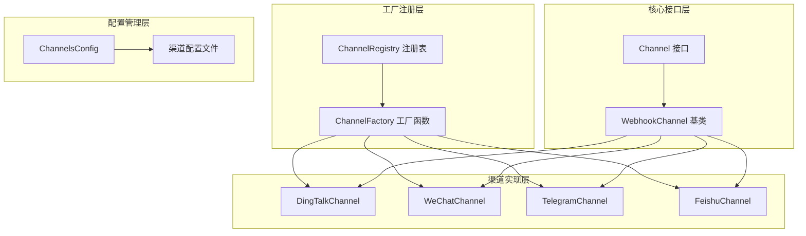
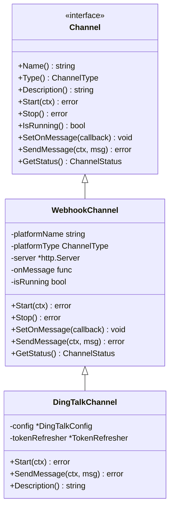
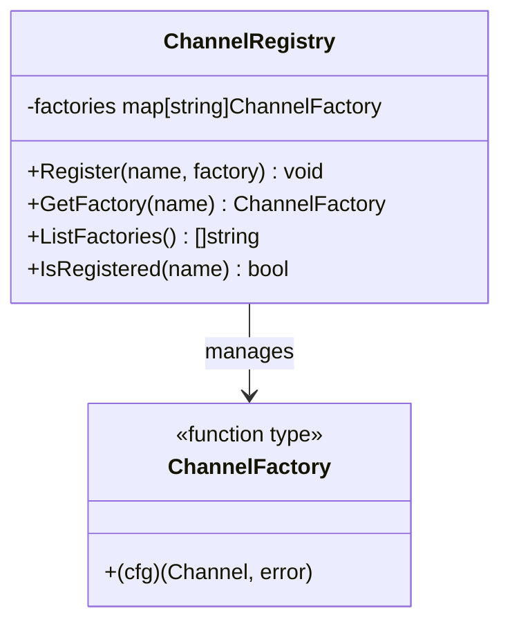
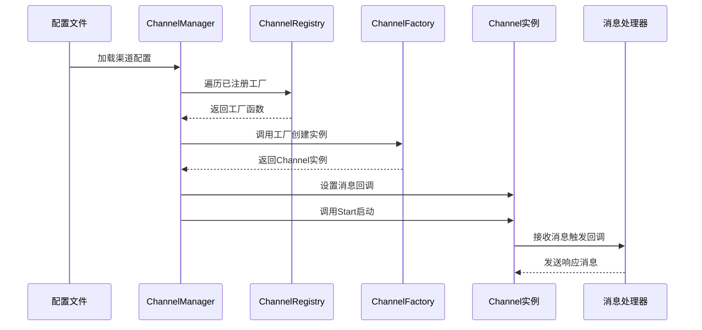
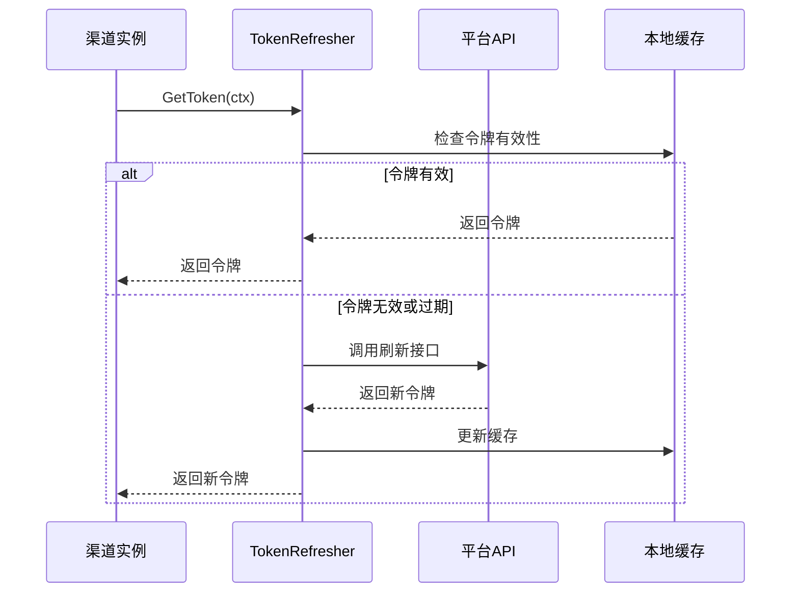
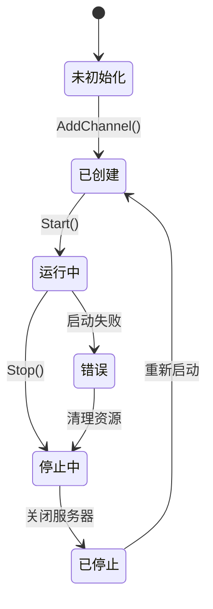
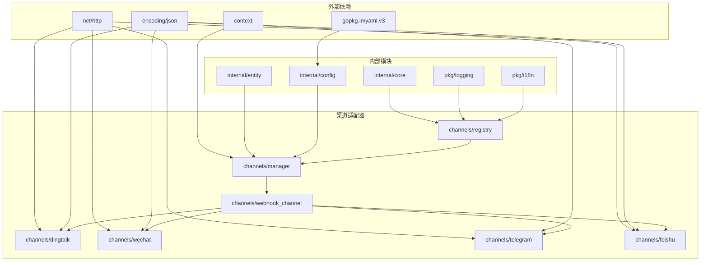

# 渠道适配器开发

<cite>
**本文档引用的文件**
- [internal/adapters/channels/registry.go](file://internal/adapters/channels/registry.go)
- [internal/adapters/channels/manager.go](file://internal/adapters/channels/manager.go)
- [internal/core/channel.go](file://internal/core/channel.go)
- [internal/adapters/channels/webhook_channel.go](file://internal/adapters/channels/webhook_channel.go)
- [internal/adapters/channels/dingtalk.go](file://internal/adapters/channels/dingtalk.go)
- [internal/adapters/channels/wechat.go](file://internal/adapters/channels/wechat.go)
- [internal/adapters/channels/telegramchannel.go](file://internal/adapters/channels/telegramchannel.go)
- [internal/adapters/channels/feishu.go](file://internal/adapters/channels/feishu.go)
- [internal/adapters/channels/token_refresher.go](file://internal/adapters/channels/token_refresher.go)
- [internal/config/channels.go](file://internal/config/channels.go)
- [config/channels.yml](file://config/channels.yml)
- [internal/config/feishu.go](file://internal/config/feishu.go)
- [internal/config/wechat.go](file://internal/config/wechat.go)
- [internal/config/dingtalk.go](file://internal/config/dingtalk.go)
- [internal/config/telegram.go](file://internal/config/telegram.go)
</cite>

## 目录
1. [简介](#简介)
2. [项目结构](#项目结构)
3. [核心组件](#核心组件)
4. [架构概览](#架构概览)
5. [详细组件分析](#详细组件分析)
6. [依赖关系分析](#依赖关系分析)
7. [性能考虑](#性能考虑)
8. [故障排除指南](#故障排除指南)
9. [结论](#结论)
10. [附录](#附录)

## 简介

MindX 渠道适配器系统是一个高度模块化、可扩展的消息通道抽象层，支持多种即时通讯平台（如钉钉、微信、Telegram、飞书等）。该系统采用工厂模式和注册表机制，实现了配置驱动的渠道创建和生命周期管理。

本系统的核心设计理念是通过统一的 Channel 接口抽象不同平台的差异，同时提供灵活的工厂函数注册机制，使得新增渠道适配器变得简单而标准化。

## 项目结构



**图表来源**
- [internal/core/channel.go](file://internal/core/channel.go#L10-L40)
- [internal/adapters/channels/registry.go](file://internal/adapters/channels/registry.go#L16-L38)
- [internal/adapters/channels/webhook_channel.go](file://internal/adapters/channels/webhook_channel.go#L29-L47)

**章节来源**
- [internal/adapters/channels/registry.go](file://internal/adapters/channels/registry.go#L1-L142)
- [internal/adapters/channels/manager.go](file://internal/adapters/channels/manager.go#L1-L230)
- [internal/core/channel.go](file://internal/core/channel.go#L1-L45)

## 核心组件

### Channel 接口规范

Channel 接口定义了所有渠道适配器必须实现的标准方法：



**图表来源**
- [internal/core/channel.go](file://internal/core/channel.go#L10-L40)
- [internal/adapters/channels/webhook_channel.go](file://internal/adapters/channels/webhook_channel.go#L29-L47)
- [internal/adapters/channels/dingtalk.go](file://internal/adapters/channels/dingtalk.go#L40-L68)

### ChannelRegistry 注册表

ChannelRegistry 是整个适配器系统的核心注册中心，负责管理所有渠道工厂函数：



**图表来源**
- [internal/adapters/channels/registry.go](file://internal/adapters/channels/registry.go#L14-L38)

**章节来源**
- [internal/adapters/channels/registry.go](file://internal/adapters/channels/registry.go#L1-L142)

## 架构概览



**图表来源**
- [internal/adapters/channels/manager.go](file://internal/adapters/channels/manager.go#L149-L229)
- [internal/adapters/channels/registry.go](file://internal/adapters/channels/registry.go#L25-L38)

## 详细组件分析

### WebhookChannel 基类

WebhookChannel 提供了基于 HTTP Webhook 的通用实现框架，支持多种即时通讯平台：

```mermaid
classDiagram
class WebhookChannel {
-platformName string
-platformType ChannelType
-config interface{}
-server *http.Server
-webhookPath string
-onMessage func
-mu sync.RWMutex
-isRunning bool
-startTime time.Time
-totalMsg int64
-lastMsgTime time.Time
-status *ChannelStatus
-logger Logger
-parser WebhookParser
-lifecycleCtx context.Context
+Start(ctx) error
+Stop() error
+SetOnMessage(callback) void
+SendMessage(ctx, msg) error
+GetStatus() ChannelStatus
+StartWithHandler(ctx, port, handler) error
+dispatchWebhook(w, r) void
+handleWebhook(w, r) void
+parseWebhookMessage(body, r) IncomingMessage
}
class WebhookParser {
<<interface>>
+ParseWebhook(body, r) IncomingMessage
+HandleVerification(w, r) bool
}
WebhookChannel --> WebhookParser : uses
```

**图表来源**
- [internal/adapters/channels/webhook_channel.go](file://internal/adapters/channels/webhook_channel.go#L29-L47)
- [internal/adapters/channels/webhook_channel.go](file://internal/adapters/channels/webhook_channel.go#L22-L27)

**章节来源**
- [internal/adapters/channels/webhook_channel.go](file://internal/adapters/channels/webhook_channel.go#L1-L306)

### 渠道工厂模式实现

每个具体渠道都通过 init() 函数自动注册其工厂函数：

```mermaid
flowchart TD
A[渠道包加载] --> B[init() 函数执行]
B --> C[Register() 调用]
C --> D[ChannelRegistry.factories[name] = factory]
D --> E[等待外部调用]
E --> F[GetFactory(name) 获取工厂]
F --> G[factory(config) 创建实例]
G --> H[返回 Channel 实例]
```

**图表来源**
- [internal/adapters/channels/dingtalk.go](file://internal/adapters/channels/dingtalk.go#L25-L38)
- [internal/adapters/channels/wechat.go](file://internal/adapters/channels/wechat.go#L24-L37)
- [internal/adapters/channels/telegramchannel.go](file://internal/adapters/channels/telegramchannel.go#L19-L30)

**章节来源**
- [internal/adapters/channels/dingtalk.go](file://internal/adapters/channels/dingtalk.go#L1-L431)
- [internal/adapters/channels/wechat.go](file://internal/adapters/channels/wechat.go#L1-L369)
- [internal/adapters/channels/telegramchannel.go](file://internal/adapters/channels/telegramchannel.go#L1-L334)
- [internal/adapters/channels/feishu.go](file://internal/adapters/channels/feishu.go#L1-L415)

### Token 刷新机制

对于需要访问令牌的渠道，系统提供了统一的 TokenRefresher 组件：



**图表来源**
- [internal/adapters/channels/token_refresher.go](file://internal/adapters/channels/token_refresher.go#L29-L57)

**章节来源**
- [internal/adapters/channels/token_refresher.go](file://internal/adapters/channels/token_refresher.go#L1-L58)

### ChannelManager 生命周期管理

ChannelManager 负责所有渠道实例的生命周期管理：



**图表来源**
- [internal/adapters/channels/manager.go](file://internal/adapters/channels/manager.go#L123-L147)

**章节来源**
- [internal/adapters/channels/manager.go](file://internal/adapters/channels/manager.go#L1-L230)

## 依赖关系分析



**图表来源**
- [internal/adapters/channels/registry.go](file://internal/adapters/channels/registry.go#L3-L7)
- [internal/adapters/channels/manager.go](file://internal/adapters/channels/manager.go#L3-L13)

**章节来源**
- [internal/adapters/channels/registry.go](file://internal/adapters/channels/registry.go#L1-L142)
- [internal/adapters/channels/manager.go](file://internal/adapters/channels/manager.go#L1-L230)

## 性能考虑

### 并发处理
- 使用 RWMutex 确保读写操作的线程安全
- 异步启动 HTTP 服务器，避免阻塞主流程
- 并行创建多个渠道实例，提高初始化效率

### 资源管理
- 实现优雅关闭机制，确保资源正确释放
- 使用 context 控制生命周期，支持取消操作
- 实现连接池和超时控制，避免资源泄露

### 缓存策略
- TokenRefresher 实现本地令牌缓存
- Channel 状态信息缓存，减少重复计算
- 配置变更监听，支持热更新

## 故障排除指南

### 常见问题及解决方案

**渠道无法启动**
1. 检查端口占用情况
2. 验证配置文件格式正确性
3. 确认网络连通性和防火墙设置

**消息接收异常**
1. 检查 Webhook URL 配置
2. 验证签名验证逻辑
3. 查看日志中的错误信息

**令牌刷新失败**
1. 检查平台 API 密钥配置
2. 验证网络连接状态
3. 查看令牌过期时间设置

**章节来源**
- [internal/adapters/channels/webhook_channel.go](file://internal/adapters/channels/webhook_channel.go#L152-L200)
- [internal/adapters/channels/token_refresher.go](file://internal/adapters/channels/token_refresher.go#L29-L57)

## 结论

MindX 渠道适配器系统通过精心设计的架构，成功实现了以下目标：

1. **高度模块化**：每个渠道都是独立的模块，便于维护和扩展
2. **配置驱动**：通过配置文件实现无代码修改的渠道管理
3. **统一接口**：Channel 接口抽象了所有平台差异
4. **工厂模式**：自动化的工厂函数注册机制
5. **生命周期管理**：完善的启动、停止和监控机制

该系统为开发者提供了一个强大而灵活的框架，可以快速集成新的即时通讯平台，同时保持系统的稳定性和可维护性。

## 附录

### 开发新渠道适配器步骤

1. **创建配置结构**
   ```go
   type MyChannelConfig struct {
       Port int `mapstructure:"port" json:"port" yaml:"port"`
       Path string `mapstructure:"path" json:"path" yaml:"path"`
       // 其他配置字段
   }
   ```

2. **实现 Channel 接口**
   ```go
   func NewMyChannel(cfg *MyChannelConfig) *MyChannel {
       // 实现 Channel 接口方法
   }
   ```

3. **注册工厂函数**
   ```go
   func init() {
       Register("mychannel", func(cfg map[string]interface{}) (core.Channel, error) {
           return NewMyChannel(&MyChannelConfig{
               Port: getIntFromConfig(cfg, "port", 8080),
               Path: getStringFromConfigWithDefault(cfg, "path", "/mychannel/webhook"),
               // 其他配置映射
           }), nil
       })
   }
   ```

4. **添加配置项**
   在配置文件中添加新的渠道配置项

### 配置文件示例

```yaml
channels:
    mychannel:
        enabled: false
        name: 我的渠道
        icon: mychannel
        config:
            port: 8080
            path: /mychannel/webhook
            # 其他配置项
```

**章节来源**
- [config/channels.yml](file://config/channels.yml#L1-L96)
- [internal/config/channels.go](file://internal/config/channels.go#L11-L21)