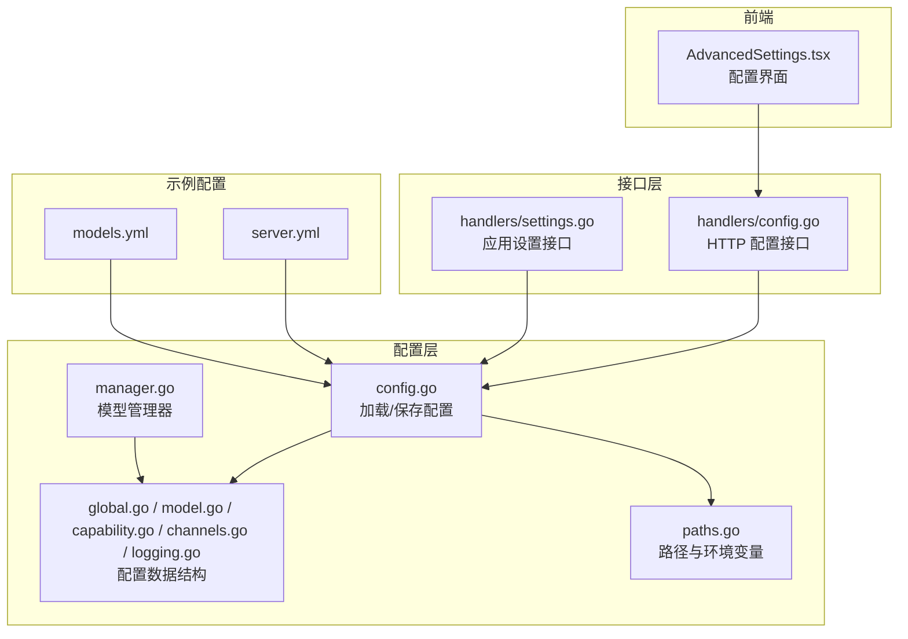
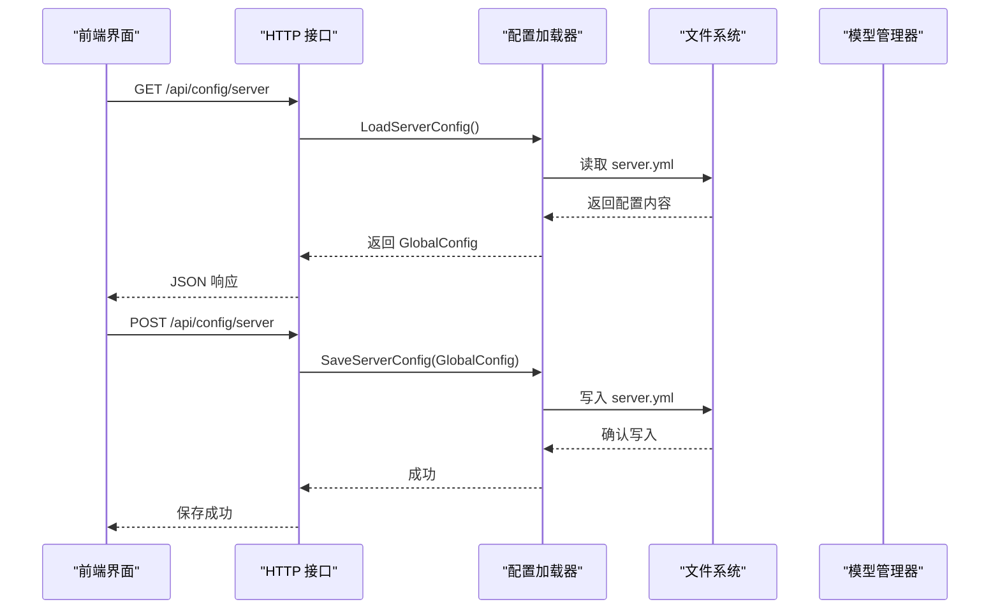
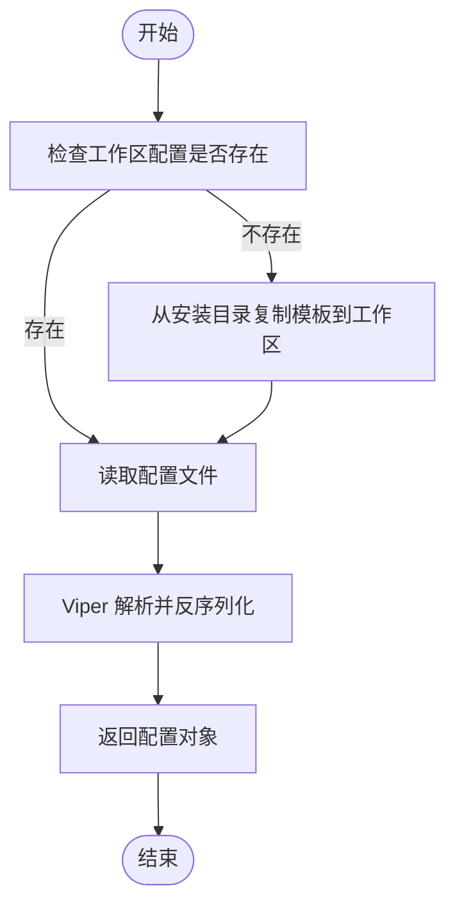
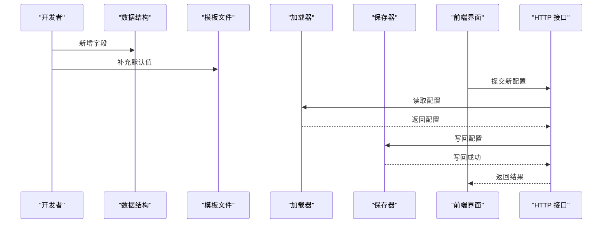
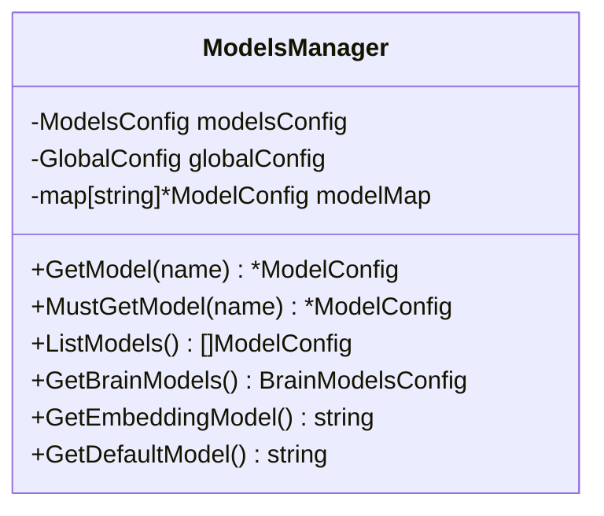
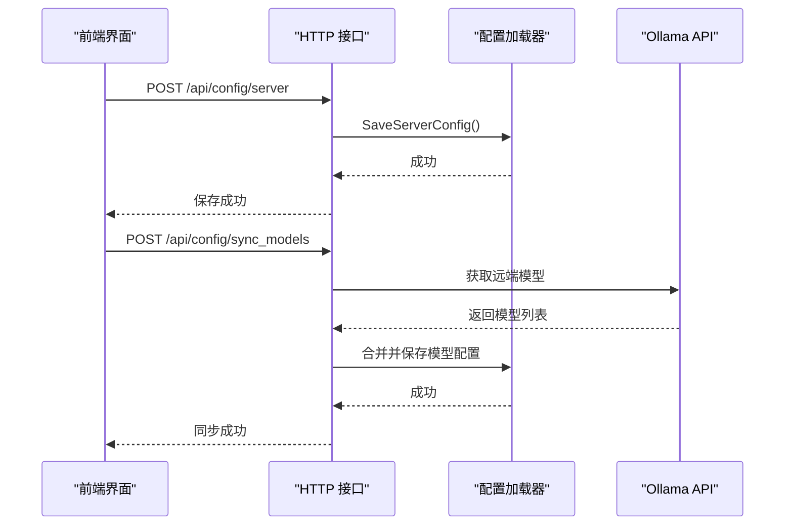
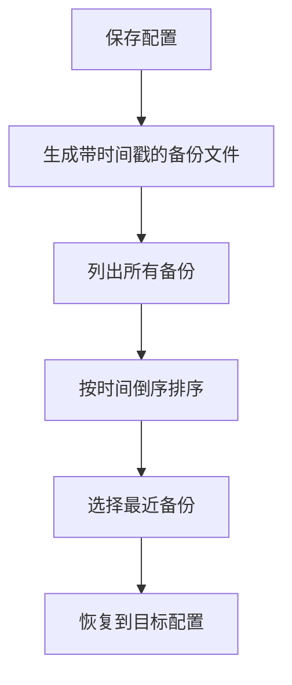
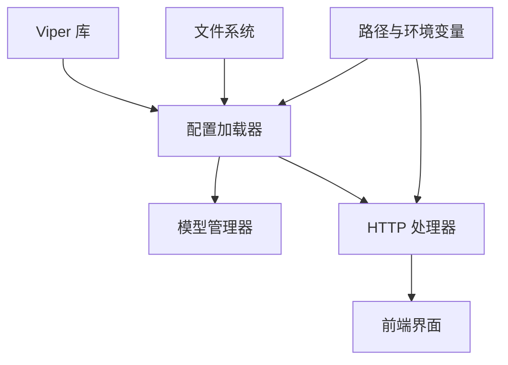

# 配置系统扩展

<cite>
**本文引用的文件**
- [internal/config/config.go](file://internal/config/config.go)
- [internal/config/manager.go](file://internal/config/manager.go)
- [internal/config/global.go](file://internal/config/global.go)
- [internal/config/channels.go](file://internal/config/channels.go)
- [internal/config/model.go](file://internal/config/model.go)
- [internal/config/capability.go](file://internal/config/capability.go)
- [internal/config/logging.go](file://internal/config/logging.go)
- [internal/config/paths.go](file://internal/config/paths.go)
- [internal/config/config_test.go](file://internal/config/config_test.go)
- [internal/adapters/http/handlers/config.go](file://internal/adapters/http/handlers/config.go)
- [internal/adapters/http/handlers/settings.go](file://internal/adapters/http/handlers/settings.go)
- [internal/usecase/training/config_updater.go](file://internal/usecase/training/config_updater.go)
- [config/server.yml](file://config/server.yml)
- [config/models.yml](file://config/models.yml)
- [dashboard/src/components/AdvancedSettings.tsx](file://dashboard/src/components/AdvancedSettings.tsx)
</cite>

## 目录
1. [简介](#简介)
2. [项目结构](#项目结构)
3. [核心组件](#核心组件)
4. [架构总览](#架构总览)
5. [详细组件分析](#详细组件分析)
6. [依赖关系分析](#依赖关系分析)
7. [性能考量](#性能考量)
8. [故障排除指南](#故障排除指南)
9. [结论](#结论)
10. [附录](#附录)

## 简介
本文件面向 MindX 配置系统的扩展与维护，系统基于 Go 语言实现，采用 Viper 进行配置文件解析与写回，结合 HTTP 接口提供运行时配置读取与保存能力。配置文件以 YAML 为主，部分场景支持 JSON；系统通过工作区与安装目录分离的方式，确保用户工作区可覆盖安装默认配置。本文档涵盖配置文件结构、动态加载与持久化、热更新策略、扩展新配置项的方法、配置合并与优先级、环境变量支持、安全与性能优化、备份与恢复机制以及常见问题排查。

## 项目结构
MindX 的配置系统主要位于 internal/config 目录，配合 HTTP 处理器与前端界面共同完成配置的读取、编辑与保存。关键目录与文件如下：
- 配置加载与持久化：internal/config/config.go
- 模型管理器：internal/config/manager.go
- 配置数据结构：internal/config/global.go、internal/config/model.go、internal/config/capability.go、internal/config/channels.go、internal/config/logging.go
- 路径与环境变量：internal/config/paths.go
- HTTP 接口：internal/adapters/http/handlers/config.go、internal/adapters/http/handlers/settings.go
- 前端配置界面：dashboard/src/components/AdvancedSettings.tsx
- 示例配置文件：config/server.yml、config/models.yml
- 测试：internal/config/config_test.go
- 备份与恢复：internal/usecase/training/config_updater.go



图表来源
- [internal/config/config.go](file://internal/config/config.go#L1-L294)
- [internal/config/manager.go](file://internal/config/manager.go#L1-L82)
- [internal/config/global.go](file://internal/config/global.go#L1-L42)
- [internal/config/model.go](file://internal/config/model.go#L1-L29)
- [internal/config/capability.go](file://internal/config/capability.go#L1-L29)
- [internal/config/channels.go](file://internal/config/channels.go#L1-L149)
- [internal/config/logging.go](file://internal/config/logging.go#L1-L45)
- [internal/config/paths.go](file://internal/config/paths.go#L1-L285)
- [internal/adapters/http/handlers/config.go](file://internal/adapters/http/handlers/config.go#L1-L256)
- [internal/adapters/http/handlers/settings.go](file://internal/adapters/http/handlers/settings.go#L1-L61)
- [config/server.yml](file://config/server.yml#L1-L21)
- [config/models.yml](file://config/models.yml#L1-L92)

章节来源
- [internal/config/config.go](file://internal/config/config.go#L1-L294)
- [internal/config/paths.go](file://internal/config/paths.go#L1-L285)

## 核心组件
- 配置加载与保存：封装了 server.yml、channels.yml、capabilities.yml、models.yml 的读取与写回逻辑，支持模板自动复制与错误包装。
- 模型管理器：集中管理模型配置，提供按名称查询、默认模型与大脑模型映射等能力。
- 配置数据结构：定义了全局服务器配置、模型配置、能力配置、通道配置、日志配置等结构体及字段。
- 路径与环境变量：统一管理安装路径、工作区路径、配置文件路径、数据与日志路径等，支持 MINDX_PATH 与 MINDX_WORKSPACE 环境变量。
- HTTP 接口：提供配置读取、保存、通用配置更新、Ollama 模型同步等接口。
- 前端界面：提供图形化配置界面，调用 HTTP 接口进行配置变更。
- 备份与恢复：训练模块中的配置更新器支持备份与恢复。

章节来源
- [internal/config/config.go](file://internal/config/config.go#L13-L37)
- [internal/config/manager.go](file://internal/config/manager.go#L13-L82)
- [internal/config/global.go](file://internal/config/global.go#L3-L42)
- [internal/config/model.go](file://internal/config/model.go#L3-L29)
- [internal/config/capability.go](file://internal/config/capability.go#L3-L29)
- [internal/config/channels.go](file://internal/config/channels.go#L11-L149)
- [internal/config/logging.go](file://internal/config/logging.go#L14-L45)
- [internal/config/paths.go](file://internal/config/paths.go#L60-L106)
- [internal/adapters/http/handlers/config.go](file://internal/adapters/http/handlers/config.go#L19-L182)
- [internal/adapters/http/handlers/settings.go](file://internal/adapters/http/handlers/settings.go#L13-L61)
- [internal/usecase/training/config_updater.go](file://internal/usecase/training/config_updater.go#L57-L125)

## 架构总览
配置系统采用“配置文件 + 数据结构 + 管理器 + HTTP 接口 + 前端”的分层架构。启动时通过 InitVippers 初始化各配置，运行时通过 HTTP 接口读取与保存配置，前端界面负责交互与提交。



图表来源
- [internal/adapters/http/handlers/config.go](file://internal/adapters/http/handlers/config.go#L19-L43)
- [internal/config/config.go](file://internal/config/config.go#L39-L82)
- [internal/config/config.go](file://internal/config/config.go#L215-L231)

章节来源
- [internal/adapters/http/handlers/config.go](file://internal/adapters/http/handlers/config.go#L1-L256)
- [internal/config/config.go](file://internal/config/config.go#L1-L294)

## 详细组件分析

### 配置文件结构与数据模型
- 全局服务器配置（GlobalConfig）：包含版本、主机、端口、WebSocket 端口、Ollama 地址、令牌预算、大脑左右半球模型、嵌入模型、默认模型、内存与向量存储配置、WebSocket 安全配置等。
- 模型配置（ModelsConfig/ModelConfig）：模型列表及其基础 URL、API Key、温度、最大 tokens 等。
- 能力配置（CapabilityConfig/Capability）：能力列表、默认能力、回退策略、系统提示词、工具集、模态等。
- 通道配置（ChannelsConfig/Channel）：启用通道列表、通道详情（启用状态、名称、图标、配置字典）。
- 日志配置（LoggingConfig/SystemLogConfig/ConversationLogConfig）：系统日志级别、输出路径、滚动策略、对话日志开关与输出路径。

```mermaid
classDiagram
class GlobalConfig {
+string Version
+string Host
+int Port
+int WsPort
+string OllamaURL
+TokenBudgetConfig TokenBudget
+BrainHalfConfig Subconscious
+BrainHalfConfig Consciousness
+string EmbeddingModel
+string DefaultModel
+MemoryConfig Memory
+VectorStoreConfig VectorStore
+WebSocketConfig WebSocket
}
class ModelsConfig {
+[]ModelConfig Models
}
class ModelConfig {
+string Name
+string Description
+string Domain
+string BaseURL
+string APIKey
+float Temperature
+int MaxTokens
}
class CapabilityConfig {
+[]Capability Capabilities
+string DefaultCapability
+bool FallbackToLocal
+string Description
}
class Capability {
+string Name
+string Title
+string Icon
+string Description
+string Model
+string BaseURL
+string APIKey
+string SystemPrompt
+[]string Tools
+float Temperature
+int MaxTokens
+[]string Modality
+bool Enabled
+[]float Vector
}
class ChannelsConfig {
+[]string EnabledChannels
+map[string]Channel Channels
}
class Channel {
+bool Enabled
+string Name
+string Icon
+map[string]interface{} Config
}
class LoggingConfig {
+SystemLogConfig SystemLogConfig
+ConversationLogConfig ConversationLogConfig
}
GlobalConfig --> ModelsConfig : "引用"
ModelsConfig --> ModelConfig : "包含"
CapabilityConfig --> Capability : "包含"
ChannelsConfig --> Channel : "包含"
LoggingConfig --> SystemLogConfig
LoggingConfig --> ConversationLogConfig
```

图表来源
- [internal/config/global.go](file://internal/config/global.go#L3-L42)
- [internal/config/model.go](file://internal/config/model.go#L3-L29)
- [internal/config/capability.go](file://internal/config/capability.go#L3-L29)
- [internal/config/channels.go](file://internal/config/channels.go#L11-L21)
- [internal/config/logging.go](file://internal/config/logging.go#L14-L45)

章节来源
- [internal/config/global.go](file://internal/config/global.go#L1-L42)
- [internal/config/model.go](file://internal/config/model.go#L1-L29)
- [internal/config/capability.go](file://internal/config/capability.go#L1-L29)
- [internal/config/channels.go](file://internal/config/channels.go#L1-L149)
- [internal/config/logging.go](file://internal/config/logging.go#L1-L45)

### 动态加载与热更新
- 动态加载：通过 LoadServerConfig/LoadChannelsConfig/LoadCapabilitiesConfig/LoadModelsConfig 分别读取对应配置文件；若工作区不存在则从安装目录复制模板至工作区后重试。
- 写回持久化：SaveServerConfig/SaveChannelsConfig/SaveCapabilitiesConfig/SaveModelsConfig 使用 Viper 写回配置文件。
- 热更新：当前实现为“写回即生效”，未见专门的“热更新”监听或广播机制；建议在业务层对关键配置变更进行缓存刷新或重启服务。



图表来源
- [internal/config/config.go](file://internal/config/config.go#L39-L82)
- [internal/config/config.go](file://internal/config/config.go#L84-L122)
- [internal/config/config.go](file://internal/config/config.go#L124-L162)
- [internal/config/config.go](file://internal/config/config.go#L164-L203)

章节来源
- [internal/config/config.go](file://internal/config/config.go#L13-L37)
- [internal/config/config.go](file://internal/config/config.go#L205-L272)

### 配置合并、优先级与环境变量
- 优先级（从高到低）：工作区配置 > 安装目录模板（首次生成） > 默认值（代码内定义）。
- 环境变量：支持 MINDX_PATH（安装路径）与 MINDX_WORKSPACE（工作区路径），用于决定配置文件位置与数据目录。
- 合并策略：Viper 在读取配置时会按上述顺序合并键值，最终以工作区配置为准。

章节来源
- [internal/config/paths.go](file://internal/config/paths.go#L60-L106)
- [internal/config/config.go](file://internal/config/config.go#L39-L82)
- [internal/config/config.go](file://internal/config/config.go#L84-L122)
- [internal/config/config.go](file://internal/config/config.go#L124-L162)
- [internal/config/config.go](file://internal/config/config.go#L164-L203)

### 添加新配置项的完整流程
以下以“新增一个通用配置项”为例，展示从定义到系统集成的全过程：

1. 定义数据结构
   - 在相应配置文件的数据结构中添加字段，如在 GlobalConfig 或 ModelsConfig 中增加新字段。
   - 参考路径：[internal/config/global.go](file://internal/config/global.go#L3-L17)、[internal/config/model.go](file://internal/config/model.go#L3-L5)

2. 编写默认模板
   - 在安装目录的模板文件中添加该字段的默认值，以便首次运行时复制到工作区。
   - 参考路径：[internal/config/config.go](file://internal/config/config.go#L71-L81)、[internal/config/config.go](file://internal/config/config.go#L111-L121)、[internal/config/config.go](file://internal/config/config.go#L151-L161)、[internal/config/config.go](file://internal/config/config.go#L191-L198)

3. 加载与保存
   - 在 LoadServerConfig/LoadModelsConfig 等函数中读取新字段；在 SaveServerConfig/SaveModelsConfig 等函数中写回新字段。
   - 参考路径：[internal/config/config.go](file://internal/config/config.go#L39-L82)、[internal/config/config.go](file://internal/config/config.go#L164-L203)、[internal/config/config.go](file://internal/config/config.go#L215-L231)、[internal/config/config.go](file://internal/config/config.go#L233-L250)

4. HTTP 接口集成
   - 在 HTTP 处理器中暴露读取与保存新配置的接口，前端通过接口提交配置。
   - 参考路径：[internal/adapters/http/handlers/config.go](file://internal/adapters/http/handlers/config.go#L19-L43)、[internal/adapters/http/handlers/config.go](file://internal/adapters/http/handlers/config.go#L45-L69)

5. 前端界面集成
   - 在前端组件中渲染新配置项并提交到后端。
   - 参考路径：[dashboard/src/components/AdvancedSettings.tsx](file://dashboard/src/components/AdvancedSettings.tsx#L157-L190)

6. 验证与测试
   - 编写单元测试验证加载与保存行为。
   - 参考路径：[internal/config/config_test.go](file://internal/config/config_test.go#L12-L55)



图表来源
- [internal/config/global.go](file://internal/config/global.go#L3-L17)
- [internal/config/model.go](file://internal/config/model.go#L3-L5)
- [internal/config/config.go](file://internal/config/config.go#L71-L81)
- [internal/config/config.go](file://internal/config/config.go#L164-L203)
- [internal/config/config.go](file://internal/config/config.go#L215-L231)
- [internal/adapters/http/handlers/config.go](file://internal/adapters/http/handlers/config.go#L19-L69)
- [dashboard/src/components/AdvancedSettings.tsx](file://dashboard/src/components/AdvancedSettings.tsx#L157-L190)

章节来源
- [internal/config/global.go](file://internal/config/global.go#L1-L42)
- [internal/config/model.go](file://internal/config/model.go#L1-L29)
- [internal/config/config.go](file://internal/config/config.go#L1-L294)
- [internal/adapters/http/handlers/config.go](file://internal/adapters/http/handlers/config.go#L1-L256)
- [dashboard/src/components/AdvancedSettings.tsx](file://dashboard/src/components/AdvancedSettings.tsx#L157-L190)
- [internal/config/config_test.go](file://internal/config/config_test.go#L1-L56)

### 配置管理器工作原理
- 模型管理器负责将 ModelsConfig 转换为内存映射，提供按名称查找、列出模型、获取大脑模型映射、默认模型与嵌入模型等方法。
- 通过 SetModelsManager 与 GetModelsManager 提供全局单例访问，避免重复初始化。



图表来源
- [internal/config/manager.go](file://internal/config/manager.go#L13-L82)

章节来源
- [internal/config/manager.go](file://internal/config/manager.go#L1-L82)

### HTTP 接口与前端集成
- HTTP 接口提供：
  - 读取/保存服务器配置
  - 读取/保存模型配置
  - 读取/保存能力配置
  - 通用配置（工作区与服务器地址/端口）读取/保存
  - Ollama 模型同步（拉取远端模型并合并到本地配置）
- 前端界面通过 /api/config/* 接口与后端交互，实现可视化配置与保存。



图表来源
- [internal/adapters/http/handlers/config.go](file://internal/adapters/http/handlers/config.go#L19-L43)
- [internal/adapters/http/handlers/config.go](file://internal/adapters/http/handlers/config.go#L157-L182)
- [internal/adapters/http/handlers/config.go](file://internal/adapters/http/handlers/config.go#L184-L213)
- [internal/adapters/http/handlers/config.go](file://internal/adapters/http/handlers/config.go#L215-L255)

章节来源
- [internal/adapters/http/handlers/config.go](file://internal/adapters/http/handlers/config.go#L1-L256)
- [dashboard/src/components/AdvancedSettings.tsx](file://dashboard/src/components/AdvancedSettings.tsx#L157-L190)

### 配置安全性考虑
- 敏感信息（如 API Key）建议通过环境变量注入并在配置中占位，避免直接写入配置文件。
- 文件权限：写回配置时使用安全权限写入，避免被其他用户读取。
- WebSocket 安全：通过配置中的 token 与允许的源列表限制访问。
- 日志安全：系统日志与对话日志的输出路径与滚动策略需谨慎配置，避免敏感信息泄露。

章节来源
- [internal/config/global.go](file://internal/config/global.go#L19-L24)
- [internal/config/logging.go](file://internal/config/logging.go#L14-L45)

### 配置持久化存储与备份恢复
- 持久化存储：配置文件写回由 SaveServerConfig/SaveChannelsConfig/SaveCapabilitiesConfig/SaveModelsConfig 实现。
- 备份与恢复：训练模块的配置更新器支持按时间戳命名的备份文件扫描、排序与选择最近备份，实现恢复能力。



图表来源
- [internal/config/config.go](file://internal/config/config.go#L215-L272)
- [internal/usecase/training/config_updater.go](file://internal/usecase/training/config_updater.go#L57-L125)

章节来源
- [internal/config/config.go](file://internal/config/config.go#L205-L272)
- [internal/usecase/training/config_updater.go](file://internal/usecase/training/config_updater.go#L57-L125)

## 依赖关系分析
配置系统内部组件之间的依赖关系如下：
- 配置加载器依赖 Viper 与文件系统，负责读取与写回配置。
- 模型管理器依赖全局配置与模型配置，提供模型查询与映射。
- HTTP 处理器依赖配置加载器与 Viper，提供 REST 接口。
- 前端界面依赖 HTTP 接口，负责配置展示与提交。
- 路径与环境变量为整个系统提供统一的路径解析与环境变量支持。



图表来源
- [internal/config/config.go](file://internal/config/config.go#L3-L11)
- [internal/config/manager.go](file://internal/config/manager.go#L13-L82)
- [internal/adapters/http/handlers/config.go](file://internal/adapters/http/handlers/config.go#L1-L11)
- [internal/config/paths.go](file://internal/config/paths.go#L1-L285)

章节来源
- [internal/config/config.go](file://internal/config/config.go#L1-L294)
- [internal/config/manager.go](file://internal/config/manager.go#L1-L82)
- [internal/adapters/http/handlers/config.go](file://internal/adapters/http/handlers/config.go#L1-L256)
- [internal/config/paths.go](file://internal/config/paths.go#L1-L285)

## 性能考量
- 配置读取：Viper 解析 YAML/JSON 时建议保持配置文件简洁，避免过深嵌套与超大数组。
- 写回频率：频繁写回可能影响 I/O，建议批量修改后再保存。
- 模型管理：模型映射为 O(n) 查找，建议控制模型数量或引入更高效的数据结构。
- 并发安全：当前未见显式锁保护，若多协程并发访问配置，建议在上层加锁或使用只读副本。

## 故障排除指南
- 配置文件缺失：当工作区不存在配置文件且安装目录无模板时，加载会失败。请确认模板文件存在或手动创建配置文件。
- 权限问题：写回配置需要写权限，请检查工作区配置目录权限。
- 环境变量未设置：若未设置 MINDX_PATH 或 MINDX_WORKSPACE，系统将尝试使用可执行文件所在目录或用户家目录作为默认路径。
- HTTP 接口错误：检查请求体格式与必填字段，确保 JSON 结构与后端期望一致。
- 测试验证：可通过单元测试验证加载与保存行为，定位问题范围。

章节来源
- [internal/config/config_test.go](file://internal/config/config_test.go#L12-L55)
- [internal/config/config.go](file://internal/config/config.go#L39-L82)
- [internal/config/config.go](file://internal/config/config.go#L84-L122)
- [internal/config/config.go](file://internal/config/config.go#L124-L162)
- [internal/config/config.go](file://internal/config/config.go#L164-L203)

## 结论
MindX 配置系统通过清晰的分层设计与 Viper 的强大能力，实现了配置文件的动态加载、持久化与基本的热更新能力。通过统一的路径与环境变量管理，系统能够在不同部署环境下灵活适配。扩展新配置项的关键在于完善数据结构、模板与保存逻辑，并在 HTTP 接口与前端界面中完成集成。建议在生产环境中加强安全与性能方面的措施，并完善监控与备份恢复机制。

## 附录
- 示例配置文件参考：
  - 服务器配置：[config/server.yml](file://config/server.yml#L1-L21)
  - 模型配置：[config/models.yml](file://config/models.yml#L1-L92)
- 关键实现参考：
  - 配置加载与保存：[internal/config/config.go](file://internal/config/config.go#L13-L37)
  - 模型管理器：[internal/config/manager.go](file://internal/config/manager.go#L13-L82)
  - HTTP 接口：[internal/adapters/http/handlers/config.go](file://internal/adapters/http/handlers/config.go#L19-L182)
  - 前端界面：[dashboard/src/components/AdvancedSettings.tsx](file://dashboard/src/components/AdvancedSettings.tsx#L157-L190)