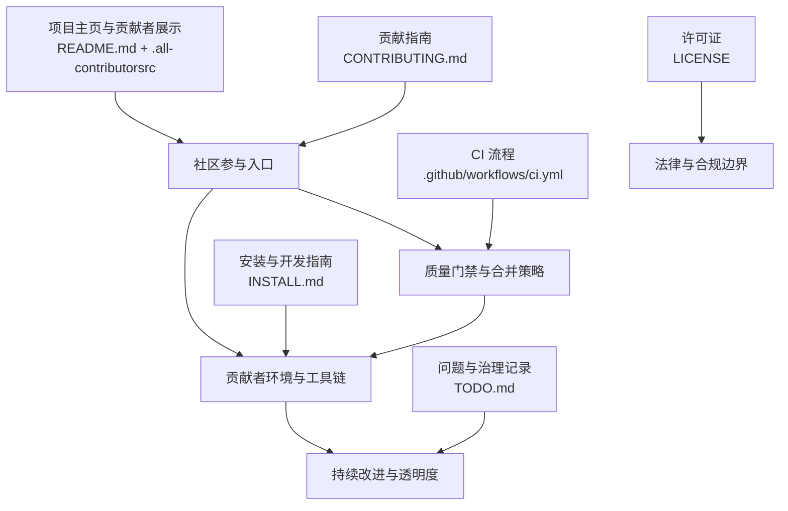
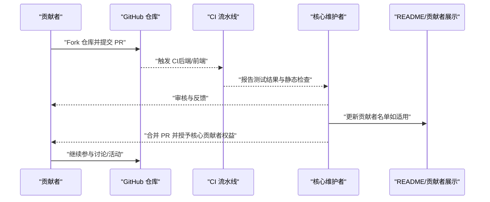
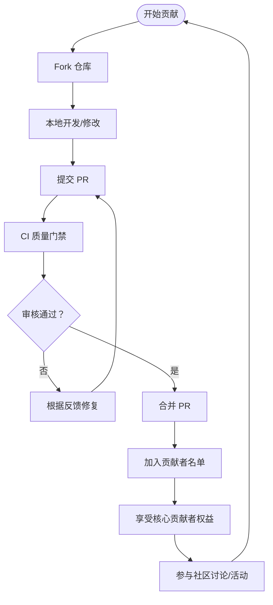
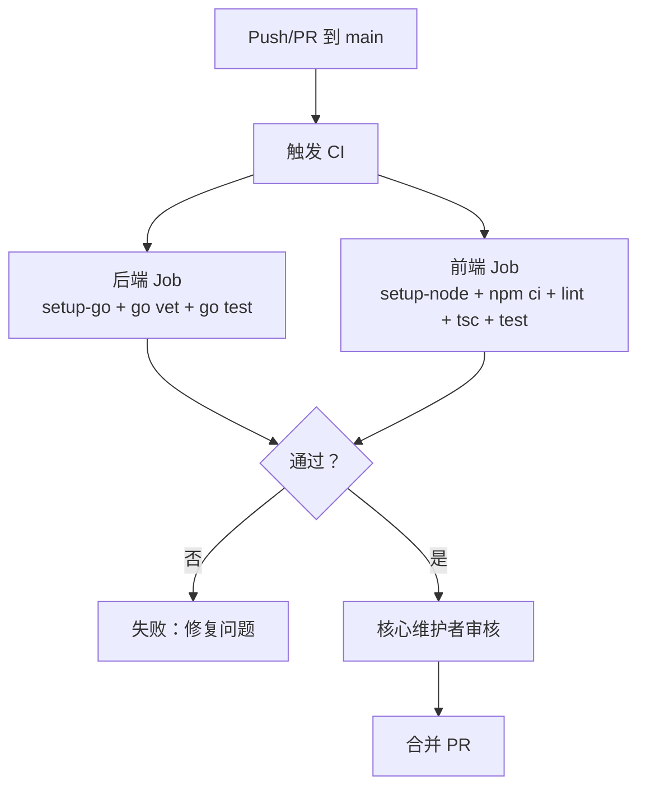
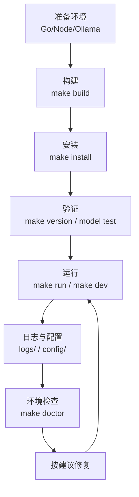
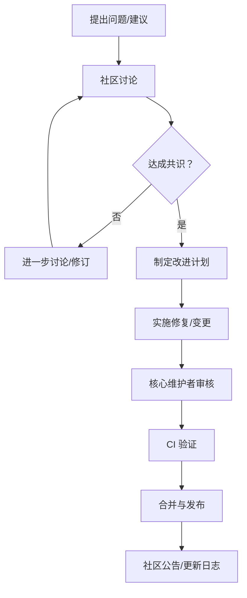
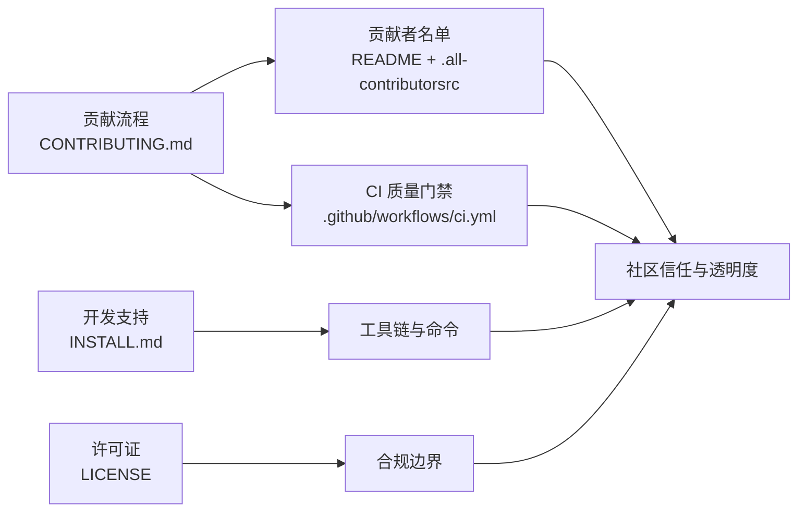

# 社区参与

<cite>
**本文引用的文件**
- [CONTRIBUTING.md](file://CONTRIBUTING.md)
- [README.md](file://README.md)
- [.all-contributorsrc](file://.all-contributorsrc)
- [.github/workflows/ci.yml](file://.github/workflows/ci.yml)
- [INSTALL.md](file://INSTALL.md)
- [LICENSE](file://LICENSE)
- [TODO.md](file://TODO.md)
</cite>

## 目录
1. [简介](#简介)
2. [项目结构](#项目结构)
3. [核心组件](#核心组件)
4. [架构总览](#架构总览)
5. [详细组件分析](#详细组件分析)
6. [依赖分析](#依赖分析)
7. [性能考虑](#性能考虑)
8. [故障排除指南](#故障排除指南)
9. [结论](#结论)
10. [附录](#附录)

## 简介
本指南面向希望参与 MindX 社区的贡献者与用户，系统讲解如何参与社区讨论与贡献、如何使用 GitHub Issues 与讨论区、如何参与社区活动；同时阐述贡献者认证与激励机制（贡献者名单、贡献统计与奖励政策）、项目治理结构与决策流程（核心团队职责、决策机制与版本发布流程）、社区资源与支持渠道（文档维护、问题解答与技术支持）、项目路线图与未来规划，以及社区行为准则与沟通礼仪，帮助贡献者高效融入并推动项目发展。

## 项目结构
MindX 仓库包含后端、前端仪表盘、技能生态、训练与测试、CI/CD、许可证与安装部署等模块。社区参与相关的关键入口包括：
- 贡献指南：CONTRIBUTING.md
- 项目主页与贡献者展示：README.md 与 .all-contributorsrc
- CI 流水线：.github/workflows/ci.yml
- 安装与开发：INSTALL.md
- 许可证：LICENSE
- 问题追踪与治理：TODO.md

图表来源
- [CONTRIBUTING.md](file://CONTRIBUTING.md#L1-L4)
- [README.md](file://README.md#L171-L177)
- [.github/workflows/ci.yml](file://.github/workflows/ci.yml#L1-L49)
- [INSTALL.md](file://INSTALL.md#L1-L50)
- [LICENSE](file://LICENSE#L1-L22)
- [TODO.md](file://TODO.md#L1-L30)

章节来源
- [CONTRIBUTING.md](file://CONTRIBUTING.md#L1-L4)
- [README.md](file://README.md#L171-L177)
- [.github/workflows/ci.yml](file://.github/workflows/ci.yml#L1-L49)
- [INSTALL.md](file://INSTALL.md#L1-L50)
- [LICENSE](file://LICENSE#L1-L22)
- [TODO.md](file://TODO.md#L1-L30)

## 核心组件
- 贡献流程与激励
  - 贡献指南明确“Fork + 提交 PR + 审核通过后加入核心贡献者”的路径。
  - README 展示“成为前 100 核心贡献者”的权益与入口。
- 贡献者认证与统计
  - README 使用 all-contributors 规范展示贡献者列表。
  - .all-contributorsrc 定义贡献类型与贡献者数据结构。
- CI 与质量门禁
  - GitHub Actions 在 PR 与 main 分支触发后端与前端流水线，执行静态检查、构建与测试。
- 安装与开发支持
  - INSTALL.md 提供系统要求、Makefile 命令、CLI 使用、配置说明与故障排查。
- 许可与合规
  - LICENSE 采用 MIT 许可证，明确使用、修改与分发的权利与义务。
- 治理与改进记录
  - TODO.md 记录测试稳定性问题与修复进展，体现持续改进与透明度。

章节来源
- [CONTRIBUTING.md](file://CONTRIBUTING.md#L1-L4)
- [README.md](file://README.md#L171-L177)
- [.all-contributorsrc](file://.all-contributorsrc#L1-L44)
- [.github/workflows/ci.yml](file://.github/workflows/ci.yml#L1-L49)
- [INSTALL.md](file://INSTALL.md#L1-L50)
- [LICENSE](file://LICENSE#L1-L22)
- [TODO.md](file://TODO.md#L1-L30)

## 架构总览
下图展示了社区参与的关键流程：贡献者通过 Fork 与 PR 参与，CI 质量门禁拦截问题，贡献者进入贡献者名单并获得激励，同时通过安装与开发指南完善环境，最终形成持续改进的闭环。

图表来源
- [CONTRIBUTING.md](file://CONTRIBUTING.md#L1-L4)
- [.github/workflows/ci.yml](file://.github/workflows/ci.yml#L1-L49)
- [README.md](file://README.md#L171-L177)
- [.all-contributorsrc](file://.all-contributorsrc#L1-L44)

## 详细组件分析

### 贡献流程与激励机制
- 贡献入口
  - 贡献者通过 Fork 仓库、提交 PR（文档纠错、功能建议、代码修复均可）参与。
  - 审核通过后，可加入“前 100 核心贡献者”阵营，享受专属身份标识、优先体验与一对一支持等权益。
- 贡献者名单与统计
  - README 使用 all-contributors 规范展示贡献者头像与贡献类型。
  - .all-contributorsrc 定义贡献者数据结构与贡献类型（如文档、代码等）。
- 奖励政策
  - README 明确核心贡献者的权益与入口，具体奖励细则可在社区公告或治理文档中补充。

图表来源
- [CONTRIBUTING.md](file://CONTRIBUTING.md#L1-L4)
- [README.md](file://README.md#L171-L177)
- [.all-contributorsrc](file://.all-contributorsrc#L1-L44)

章节来源
- [CONTRIBUTING.md](file://CONTRIBUTING.md#L1-L4)
- [README.md](file://README.md#L171-L177)
- [.all-contributorsrc](file://.all-contributorsrc#L1-L44)

### CI 与质量门禁
- 触发条件
  - 在 main 分支推送或针对 main 分支发起 PR 时触发。
- 后端检查
  - 设置 Go 环境，执行 go vet 静态检查，准备测试工作区，运行 go test。
- 前端检查
  - 在 dashboard 目录设置 Node.js 环境，执行 npm ci、lint、类型检查与测试。
- 合并策略
  - PR 需通过 CI 检查并通过核心维护者审核后方可合并。

图表来源
- [.github/workflows/ci.yml](file://.github/workflows/ci.yml#L1-L49)

章节来源
- [.github/workflows/ci.yml](file://.github/workflows/ci.yml#L1-L49)

### 安装与开发支持
- 系统要求与依赖
  - Go、Node.js、Ollama 等，不同平台提供安装指引。
- Makefile 与 CLI
  - 提供构建、安装、运行、测试、清理、更新、诊断等命令。
- 配置与日志
  - 配置文件位于工作目录 config/，日志位于 logs/，便于定位问题。
- 故障排查
  - 提供常见问题与修复建议，如端口占用、权限、模型连接失败、静态文件缺失等。

图表来源
- [INSTALL.md](file://INSTALL.md#L1-L50)
- [INSTALL.md](file://INSTALL.md#L218-L258)
- [INSTALL.md](file://INSTALL.md#L360-L436)

章节来源
- [INSTALL.md](file://INSTALL.md#L1-L50)
- [INSTALL.md](file://INSTALL.md#L218-L258)
- [INSTALL.md](file://INSTALL.md#L360-L436)

### 许可与合规
- 许可证
  - 采用 MIT 许可证，允许自由使用、修改与分发，需保留版权与许可声明。
- 合规边界
  - 项目声明仅为个人辅助工具，使用需遵守法律法规，不得用于违法违规场景。

章节来源
- [LICENSE](file://LICENSE#L1-L22)
- [README.md](file://README.md#L179-L183)

### 治理与改进记录
- 治理结构
  - 核心维护者负责审核 PR、推动 CI 与质量门禁、维护贡献者名单与社区规则。
- 决策流程
  - PR 需通过 CI 与核心维护者审核；重大变更可通过社区讨论与投票机制（具体规则可在社区公告中补充）。
- 版本发布流程
  - 通过 CI 验证后合并至 main，结合安装与发布文档进行版本发布（具体流程可在社区公告中补充）。
- 持续改进
  - TODO.md 记录测试稳定性问题与修复进展，体现持续改进与透明度。

图表来源
- [TODO.md](file://TODO.md#L1-L30)

章节来源
- [TODO.md](file://TODO.md#L1-L30)

### 社区资源与支持渠道
- 文档维护
  - README 与 INSTALL.md 提供项目介绍、安装与开发指南；CONTRIBUTING.md 提供贡献流程。
- 问题解答
  - INSTALL.md 提供常见问题与修复建议；CI 流水线减少回归风险。
- 技术支持
  - Makefile 与 CLI 命令简化开发与运维；日志与配置目录便于定位问题。
- 社区活动
  - README 展示核心贡献者权益，鼓励贡献者参与路线规划与产品进化。

章节来源
- [README.md](file://README.md#L171-L177)
- [INSTALL.md](file://INSTALL.md#L476-L490)
- [.github/workflows/ci.yml](file://.github/workflows/ci.yml#L1-L49)

### 行为准则与沟通礼仪
- 基本原则
  - 尊重与包容：尊重不同观点与背景，营造开放协作氛围。
  - 建设性反馈：提供具体、可操作的建议与帮助。
  - 遵守法律与伦理：遵守法律法规，不传播违法违规内容。
- 沟通规范
  - 在 Issues/PR 描述中清晰表达问题与需求，提供必要上下文与复现步骤。
  - 在讨论中保持礼貌与专业，避免人身攻击与情绪化表达。
- 贡献礼仪
  - 遵循贡献指南，提交高质量 PR；及时响应审核反馈。

（本节为通用指导，不直接分析具体文件）

## 依赖分析
- 贡献流程依赖 CI 质量门禁与核心维护者审核。
- 贡献者统计依赖 README 与 all-contributors 规范。
- 开发支持依赖 Makefile、CLI 与配置/日志目录。
- 合规与许可依赖 LICENSE 文件。

图表来源
- [CONTRIBUTING.md](file://CONTRIBUTING.md#L1-L4)
- [.github/workflows/ci.yml](file://.github/workflows/ci.yml#L1-L49)
- [README.md](file://README.md#L171-L177)
- [.all-contributorsrc](file://.all-contributorsrc#L1-L44)
- [INSTALL.md](file://INSTALL.md#L1-L50)
- [LICENSE](file://LICENSE#L1-L22)

章节来源
- [CONTRIBUTING.md](file://CONTRIBUTING.md#L1-L4)
- [.github/workflows/ci.yml](file://.github/workflows/ci.yml#L1-L49)
- [README.md](file://README.md#L171-L177)
- [.all-contributorsrc](file://.all-contributorsrc#L1-L44)
- [INSTALL.md](file://INSTALL.md#L1-L50)
- [LICENSE](file://LICENSE#L1-L22)

## 性能考虑
- CI 性能
  - 合理拆分后端与前端任务，利用缓存（setup-go、setup-node）减少重复安装时间。
- 贡献效率
  - 使用 INSTALL.md 的 doctor 命令提前发现环境问题，减少调试时间。
- 社区协作
  - 通过清晰的行为准则与沟通礼仪，降低摩擦，提升协作效率。

（本节提供一般性建议，不直接分析具体文件）

## 故障排除指南
- 环境检查
  - 使用 make doctor 检查系统依赖、Ollama 模型、安装状态、工作区状态、权限与端口。
- 常见问题
  - 端口被占用：修改 server.yml 中的端口配置。
  - 权限问题：确保工作目录具有读写权限。
  - 模型连接失败：检查 API 密钥、网络与 base_url。
  - 静态文件缺失：确认已执行构建或使用开发模式。
- 日志定位
  - 系统日志与对话日志分别位于工作目录的 logs/ 子目录。

章节来源
- [INSTALL.md](file://INSTALL.md#L360-L436)

## 结论
MindX 社区通过清晰的贡献流程、完善的 CI 质量门禁、透明的贡献者统计与激励机制，以及详尽的安装与开发支持，为贡献者提供了高效参与的路径。建议贡献者遵循行为准则与沟通礼仪，积极参与讨论与活动，共同推动项目的发展与繁荣。

## 附录
- 贡献者名单与贡献统计
  - README 展示贡献者头像与贡献类型；.all-contributorsrc 定义贡献者数据结构。
- 许可与合规
  - LICENSE 采用 MIT 许可证，明确使用、修改与分发的权利与义务。
- 治理与改进
  - TODO.md 记录测试稳定性问题与修复进展，体现持续改进与透明度。

章节来源
- [README.md](file://README.md#L184-L215)
- [.all-contributorsrc](file://.all-contributorsrc#L1-L44)
- [LICENSE](file://LICENSE#L1-L22)
- [TODO.md](file://TODO.md#L1-L30)