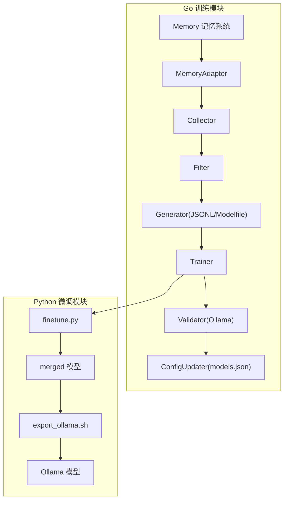
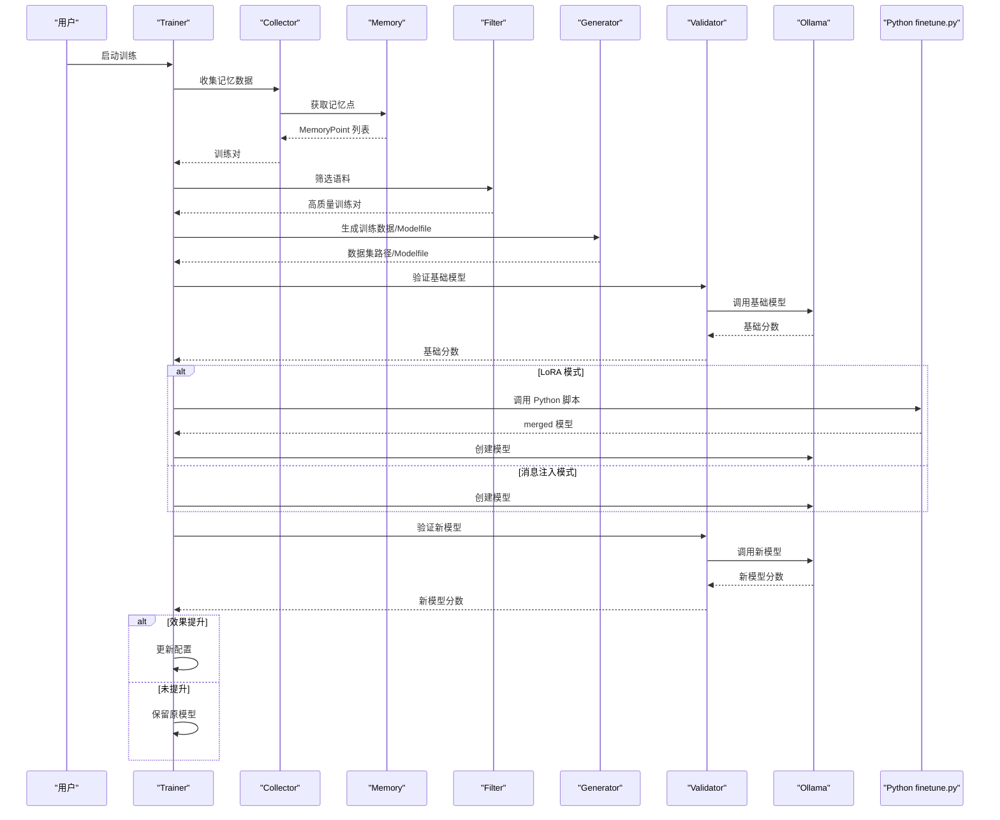
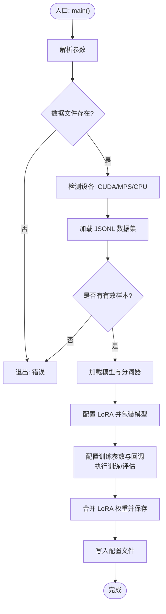
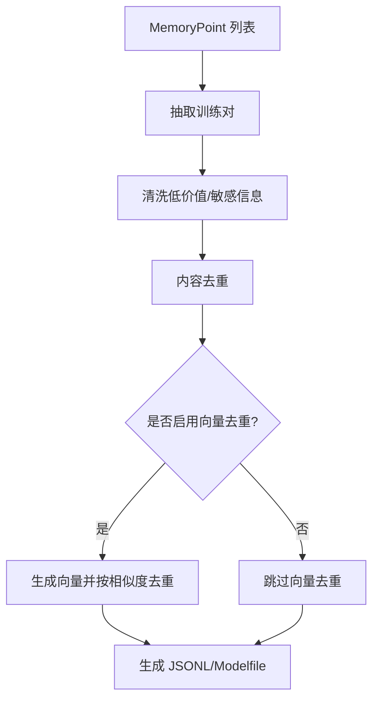
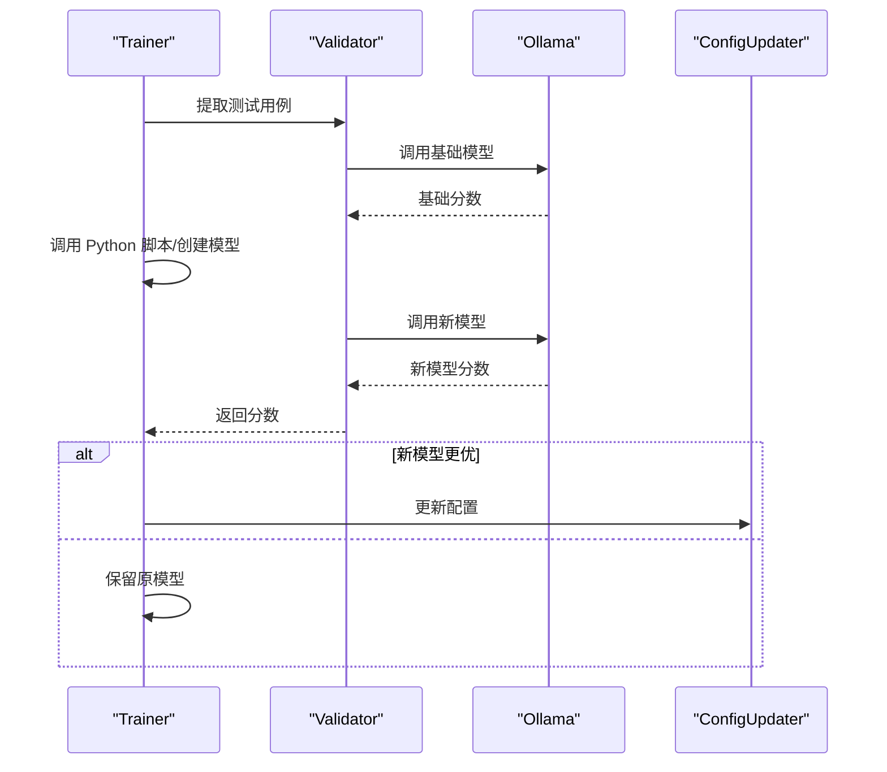
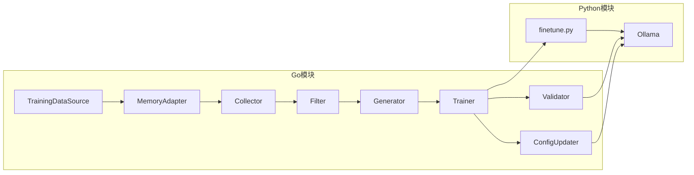

# 训练系统

<cite>
**本文引用的文件**
- [training/finetune.py](file://training/finetune.py)
- [training/README.md](file://training/README.md)
- [scripts/train_lora.py](file://scripts/train_lora.py)
- [training/requirements.txt](file://training/requirements.txt)
- [training/run.sh](file://training/run.sh)
- [training/setup.sh](file://training/setup.sh)
- [training/export_ollama.sh](file://training/export_ollama.sh)
- [internal/usecase/training/README.md](file://internal/usecase/training/README.md)
- [internal/usecase/training/trainer.go](file://internal/usecase/training/trainer.go)
- [internal/usecase/training/adapter.go](file://internal/usecase/training/adapter.go)
- [internal/usecase/training/collector.go](file://internal/usecase/training/collector.go)
- [internal/usecase/training/filter.go](file://internal/usecase/training/filter.go)
- [internal/usecase/training/generator.go](file://internal/usecase/training/generator.go)
- [internal/usecase/training/validator.go](file://internal/usecase/training/validator.go)
- [internal/usecase/training/interface.go](file://internal/usecase/training/interface.go)
- [config/models.yml](file://config/models.yml)
</cite>

## 目录
1. [简介](#简介)
2. [项目结构](#项目结构)
3. [核心组件](#核心组件)
4. [架构总览](#架构总览)
5. [详细组件分析](#详细组件分析)
6. [依赖分析](#依赖分析)
7. [性能考虑](#性能考虑)
8. [故障排查指南](#故障排查指南)
9. [结论](#结论)
10. [附录](#附录)

## 简介
本文件面向 MindX 训练系统，聚焦 LoRA 微调实现与应用。文档涵盖：
- LoRA 微调原理与应用场景
- 训练脚本工作流程（数据预处理、模型加载、训练参数配置、训练过程监控）
- finetune.py 的功能与使用方法（训练配置、损失函数与优化器设置）
- 训练环境搭建与依赖管理（Python 环境、GPU 加速、内存优化）
- 训练效果评估与模型验证方法
- 常见问题与性能调优建议

## 项目结构
MindX 训练系统由 Go 训练模块与 Python 微调脚本两部分组成，形成“数据采集-数据生成-模型训练-模型验证-配置更新”的闭环。

图表来源
- [internal/usecase/training/README.md](file://internal/usecase/training/README.md#L7-L37)
- [training/README.md](file://training/README.md#L1-L173)

章节来源
- [internal/usecase/training/README.md](file://internal/usecase/training/README.md#L1-L401)
- [training/README.md](file://training/README.md#L1-L173)

## 核心组件
- 数据源与适配层：MemoryAdapter 将 Memory 模块适配为 TrainingDataSource 接口，实现增量收集与训练时间记录。
- 数据采集与抽取：Collector 从 Memory 点中提取对话对，支持多格式解析。
- 数据清洗与去重：Filter 清洗低价值与敏感信息，执行内容去重与向量相似度去重。
- 数据生成：Generator 生成 JSONL 训练集与 Modelfile，支持消息注入模式。
- 训练编排：Trainer 负责健康检查、数据生成、调用 Python 脚本、导出与创建 Ollama 模型、效果验证与配置更新。
- 模型验证：Validator 通过 Ollama API 生成响应并计算相似度，作为效果评估指标。
- LoRA 微调：finetune.py 基于 Transformers/PEFT/TRL 实现 SFT 训练，支持 CPU/GPU 设备选择与 GGUF 导出。

章节来源
- [internal/usecase/training/adapter.go](file://internal/usecase/training/adapter.go#L1-L72)
- [internal/usecase/training/collector.go](file://internal/usecase/training/collector.go#L1-L218)
- [internal/usecase/training/filter.go](file://internal/usecase/training/filter.go#L1-L312)
- [internal/usecase/training/generator.go](file://internal/usecase/training/generator.go#L1-L178)
- [internal/usecase/training/trainer.go](file://internal/usecase/training/trainer.go#L1-L430)
- [internal/usecase/training/validator.go](file://internal/usecase/training/validator.go#L1-L239)
- [training/finetune.py](file://training/finetune.py#L1-L289)

## 架构总览
训练系统采用“消息注入模式”和“LoRA 微调模式”双轨并行：
- 消息注入模式：通过 Modelfile 的 MESSAGE 指令注入历史，快速生效但非永久。
- LoRA 微调模式：调用 Python 脚本进行权重更新，效果持久，适合深度个性化。

图表来源
- [internal/usecase/training/README.md](file://internal/usecase/training/README.md#L173-L220)
- [internal/usecase/training/trainer.go](file://internal/usecase/training/trainer.go#L93-L248)
- [training/finetune.py](file://training/finetune.py#L233-L289)

章节来源
- [internal/usecase/training/README.md](file://internal/usecase/training/README.md#L145-L220)
- [internal/usecase/training/trainer.go](file://internal/usecase/training/trainer.go#L93-L248)

## 详细组件分析

### finetune.py：LoRA 微调脚本
- 功能概述
  - 支持 CPU/GPU 训练，自动检测设备并选择量化配置
  - 加载基础模型与分词器，设置 pad_token
  - 配置 LoRA 参数（秩、alpha、dropout、目标模块），打印可训练参数数量
  - 使用 SFTTrainer 执行指令跟随训练，支持早停回调与验证集评估
  - 训练完成后合并 LoRA 权重并保存，支持 GGUF 导出提示
- 关键流程
  - 参数解析与校验
  - JSONL 数据加载与文本格式化
  - 模型与分词器初始化（CPU/4-bit 量化）
  - LoRA 配置与模型包装
  - 训练参数与回调配置
  - 训练与评估（可选）
  - 模型导出与配置记录
- 训练配置要点
  - 批次大小、学习率、轮数、序列长度、LoRA 秩
  - 优化器：adamw_torch；梯度累积；梯度检查点
  - 学习率调度器类型可选；早停耐心轮数可调
- 损失函数与优化器
  - 使用 SFTTrainer 的默认损失（语言建模损失）
  - 优化器：adamw_torch；权重衰减、warmup、bf16/fp16 控制
- 使用方法
  - 通过命令行参数传入数据、输出目录、基础模型、训练轮数等
  - 支持直接运行 Python 脚本或通过 run.sh 调用

图表来源
- [training/finetune.py](file://training/finetune.py#L233-L289)

章节来源
- [training/finetune.py](file://training/finetune.py#L1-L289)
- [training/run.sh](file://training/run.sh#L1-L55)
- [training/export_ollama.sh](file://training/export_ollama.sh#L1-L109)

### 训练环境搭建与依赖管理
- Python 环境
  - 使用 setup.sh 创建并激活虚拟环境，安装 requirements.txt 中的依赖
  - 依赖包括：PyTorch、Transformers、PEFT、Datasets、TRL、BitsAndBytes、SentencePiece、safetensors、llama-cpp-python 等
- GPU 加速与内存优化
  - 自动检测 CUDA/MPS/CPU 设备
  - GPU 下启用 4-bit 量化配置（NF4、双量化、float16 计算精度）
  - CPU 训练建议：批次大小=1、序列长度≤512、LoRA 秩≤8
- GGUF 导出
  - finetune.py 支持导出提示（需 llama.cpp 工具）
  - export_ollama.sh 提供 Python/llama.cpp 两种转换路径，并生成 Modelfile

章节来源
- [training/requirements.txt](file://training/requirements.txt#L1-L14)
- [training/setup.sh](file://training/setup.sh#L1-L56)
- [training/finetune.py](file://training/finetune.py#L92-L127)
- [training/export_ollama.sh](file://training/export_ollama.sh#L30-L109)

### 训练数据与预处理
- 数据来源：Memory 记忆系统，通过 Collector 增量收集并抽取训练对
- 数据格式：JSONL，每行包含 prompt 与 completion 字段
- 预处理流程：
  - 清洗低价值与敏感信息
  - 内容去重（prompt+completion 组合作键）
  - 可选向量去重（基于余弦相似度阈值）
  - 生成 JSONL 训练集与 Modelfile（消息注入模式）

图表来源
- [internal/usecase/training/collector.go](file://internal/usecase/training/collector.go#L106-L146)
- [internal/usecase/training/filter.go](file://internal/usecase/training/filter.go#L24-L192)
- [internal/usecase/training/generator.go](file://internal/usecase/training/generator.go#L30-L137)

章节来源
- [internal/usecase/training/collector.go](file://internal/usecase/training/collector.go#L1-L218)
- [internal/usecase/training/filter.go](file://internal/usecase/training/filter.go#L1-L312)
- [internal/usecase/training/generator.go](file://internal/usecase/training/generator.go#L1-L178)

### 训练过程监控与评估
- 训练监控
  - 日志输出训练轮数、批次大小、学习率、数据量等关键信息
  - 训练参数中设置日志步长、保存步长、保存上限
- 模型验证
  - Validator 通过 Ollama API 生成响应，计算与期望答案的相似度
  - 支持向量相似度与字符串重叠相似度两种策略
  - 以准确率（相似度阈值）与平均相似度作为评估指标
- 配置更新
  - 若新模型分数优于基础模型，则更新 models.json 中左脑模型配置

图表来源
- [internal/usecase/training/trainer.go](file://internal/usecase/training/trainer.go#L93-L248)
- [internal/usecase/training/validator.go](file://internal/usecase/training/validator.go#L43-L150)

章节来源
- [internal/usecase/training/trainer.go](file://internal/usecase/training/trainer.go#L93-L248)
- [internal/usecase/training/validator.go](file://internal/usecase/training/validator.go#L1-L239)
- [config/models.yml](file://config/models.yml#L1-L92)

### LoRA 微调实现细节
- LoRA 配置
  - 任务类型：因果语言模型
  - 秩 r、alpha=2*r、dropout=0.05
  - 目标模块：q_proj/k_proj/v_proj/o_proj
  - 偏置：none
- 训练细节
  - 使用 SFTTrainer 进行指令跟随训练
  - 支持早停回调（可配置耐心轮数）
  - 训练参数：梯度累积、warmup、权重衰减、优化器 adamw_torch
- 导出与部署
  - 合并 LoRA 权重并保存为安全序列化格式
  - 提示 GGUF 导出步骤（需 llama.cpp 或 llama-cpp-python）

章节来源
- [training/finetune.py](file://training/finetune.py#L130-L144)
- [training/finetune.py](file://training/finetune.py#L147-L210)
- [training/finetune.py](file://training/finetune.py#L213-L231)

### 其他微调脚本：scripts/train_lora.py
- 该脚本通过 llama.cpp 的 finetune 子命令进行 LoRA 微调，适用于 GGUF 模型与 CPU 场景
- 支持参数：基础模型、训练数据、输出路径、轮数、批次大小、学习率、线程数、上下文大小
- 提供数据格式验证与断点续训支持
- 注意：当前未实现 LoRA 权重合并到 GGUF 的功能，需手动或扩展实现

章节来源
- [scripts/train_lora.py](file://scripts/train_lora.py#L1-L263)

## 依赖分析
- Go 训练模块内部依赖
  - MemoryAdapter 依赖 MemoryProvider 接口，实现 TrainingDataSource
  - Trainer 依赖 Collector、Filter、Generator、Validator、ConfigUpdater
  - Validator 依赖 Ollama API 与 EmbeddingService（可选）
- Python 微调模块依赖
  - Transformers、PEFT、Datasets、TRL、BitsAndBytes、llama-cpp-python 等
- 外部系统
  - Ollama 服务用于模型创建与推理
  - EmbeddingService 用于相似度计算（可选）

图表来源
- [internal/usecase/training/interface.go](file://internal/usecase/training/interface.go#L8-L36)
- [internal/usecase/training/trainer.go](file://internal/usecase/training/trainer.go#L25-L77)
- [training/finetune.py](file://training/finetune.py#L1-L289)

章节来源
- [internal/usecase/training/interface.go](file://internal/usecase/training/interface.go#L1-L36)
- [internal/usecase/training/trainer.go](file://internal/usecase/training/trainer.go#L1-L120)
- [training/requirements.txt](file://training/requirements.txt#L1-L14)

## 性能考虑
- 训练速度
  - CPU 训练速度显著低于 GPU，建议在空闲时段执行
  - LoRA 秩越小、序列长度越短、批次越大，收敛越快
- 显存与内存
  - GPU 下启用 4-bit 量化可显著降低显存占用
  - CPU 训练建议：批次=1、max_length≤512、r≤8
- 训练稳定性
  - 合理设置 warmup_ratio、weight_decay、gradient_accumulation_steps
  - 使用 EarlyStopping 防止过拟合
- 评估效率
  - Validator 限制测试用例数量，避免长时间等待
  - 可根据需要调整相似度阈值与超时时间

## 故障排查指南
- 环境问题
  - 虚拟环境未创建：执行 setup.sh 初始化
  - 依赖缺失：确认 requirements.txt 已安装
  - Ollama 未运行：检查端口与健康状态
- 数据问题
  - JSONL 格式错误：使用 scripts/train_lora.py 的验证功能
  - 训练数据不足：增加 Memory 交互频率或降低 min-corpus
- 训练问题
  - GPU 不可用：自动降级到 CPU；若需 GPU，请确保驱动与 CUDA 正常
  - 内存不足：降低批次大小、序列长度或 LoRA 秩
  - 训练无进展：检查学习率、warmup、优化器设置
- 导出问题
  - GGUF 转换失败：确认 llama.cpp 或 llama-cpp-python 已安装
  - Modelfile 缺失：检查 export_ollama.sh 输出路径

章节来源
- [training/setup.sh](file://training/setup.sh#L1-L56)
- [training/run.sh](file://training/run.sh#L15-L31)
- [training/export_ollama.sh](file://training/export_ollama.sh#L30-L44)
- [internal/usecase/training/trainer.go](file://internal/usecase/training/trainer.go#L79-L91)

## 结论
MindX 训练系统通过 Go 与 Python 的协同，实现了从记忆数据到个性化模型的完整流水线。LoRA 微调模式提供了持久化的个性化能力，结合严格的验证与配置更新机制，确保模型改进可追踪、可回滚。通过合理的参数配置与资源规划，可在 CPU/GPU 环境中高效完成训练任务。

## 附录
- 常用命令
  - 环境初始化：./setup.sh
  - 运行微调：./run.sh <数据文件> <输出目录> <基础模型> <轮数>
  - 导出模型：./export_ollama.sh <merged目录> <模型名>
- 参数参考
  - finetune.py：--data/--output/--model/--epochs/--batch-size/--learning-rate/--max-length/--lora-r/--lr-scheduler/--early-stopping-patience/--export-gguf/--gguf-output
  - scripts/train_lora.py：--model/--data/--output/--epochs/--batch-size/--learning-rate/--threads/--ctx-size/--validate-only

章节来源
- [training/README.md](file://training/README.md#L18-L68)
- [training/finetune.py](file://training/finetune.py#L27-L65)
- [scripts/train_lora.py](file://scripts/train_lora.py#L143-L216)