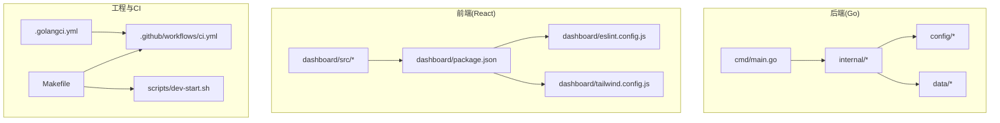
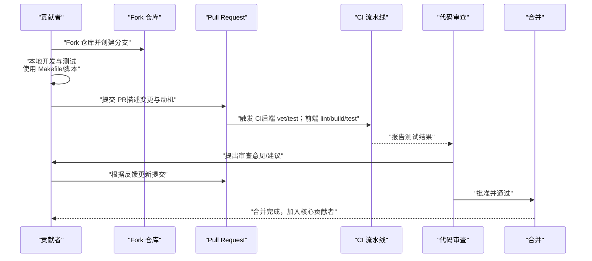
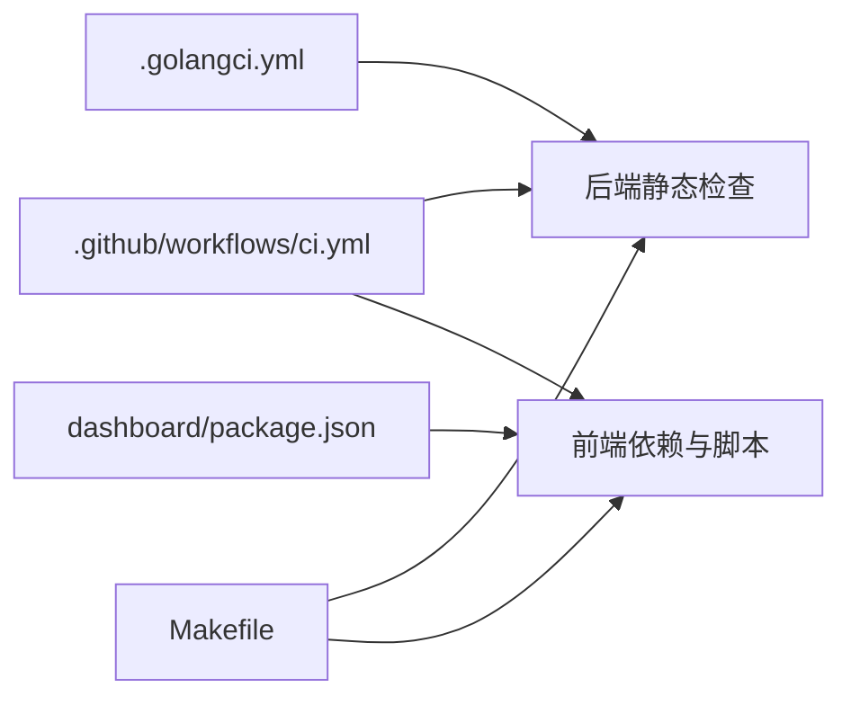

# 贡献指南

<cite>
**本文引用的文件**
- [CONTRIBUTING.md](file://CONTRIBUTING.md)
- [README.md](file://README.md)
- [.github/workflows/ci.yml](file://.github/workflows/ci.yml)
- [.golangci.yml](file://.golangci.yml)
- [dashboard/eslint.config.js](file://dashboard/eslint.config.js)
- [Makefile](file://Makefile)
- [scripts/dev-start.sh](file://scripts/dev-start.sh)
- [internal/usecase/skills/SKILL_DEVELOPMENT.md](file://internal/usecase/skills/SKILL_DEVELOPMENT.md)
- [INSTALL.md](file://INSTALL.md)
- [dashboard/package.json](file://dashboard/package.json)
- [dashboard/tailwind.config.js](file://dashboard/tailwind.config.js)
- [TODO.md](file://TODO.md)
</cite>

## 目录
1. [简介](#简介)
2. [项目结构](#项目结构)
3. [核心组件](#核心组件)
4. [架构总览](#架构总览)
5. [详细组件分析](#详细组件分析)
6. [依赖分析](#依赖分析)
7. [性能考量](#性能考量)
8. [故障排查指南](#故障排查指南)
9. [结论](#结论)
10. [附录](#附录)

## 简介
本指南面向希望参与 MindX 项目的贡献者，覆盖从 Fork 仓库到提交 Pull Request 的完整流程；涵盖代码与文档贡献规范、代码审查流程与标准、社区参与规则与行为准则、贡献者权益与核心贡献者评选标准，并提供常见贡献场景的操作示例与最佳实践。

MindX 是一款轻量级、具备思考能力且可自主进化的 AI 个人助理，采用仿生大脑架构，支持本地大模型推理与 MCP 技能生态扩展。项目提供完善的开发与测试工具链，CI 流水线覆盖后端与前端，确保质量与一致性。

## 项目结构
MindX 采用前后端分离与多模块组织方式：
- 后端：Go 语言实现，核心逻辑位于 internal/ 目录，包含适配器、用例、基础设施、实体与工具等分层。
- 前端：React/Vite/Tailwind 构建的仪表盘，位于 dashboard/ 目录。
- 工程工具：Makefile 提供统一构建、安装、运行、测试、清理等命令；scripts/ 提供开发与环境检查脚本。
- 配置与规范：.golangci.yml、dashboard/eslint.config.js 等定义静态检查与前端代码规范。
- CI：.github/workflows/ci.yml 定义 GitHub Actions 流水线，对后端进行 vet/test，对前端进行 lint/build/test。

图表来源
- [Makefile](file://Makefile#L1-L299)
- [scripts/dev-start.sh](file://scripts/dev-start.sh#L1-L285)
- [.github/workflows/ci.yml](file://.github/workflows/ci.yml#L1-L49)
- [.golangci.yml](file://.golangci.yml#L1-L7)
- [dashboard/eslint.config.js](file://dashboard/eslint.config.js#L1-L29)
- [dashboard/package.json](file://dashboard/package.json#L1-L58)
- [dashboard/tailwind.config.js](file://dashboard/tailwind.config.js#L1-L36)

章节来源
- [Makefile](file://Makefile#L1-L299)
- [scripts/dev-start.sh](file://scripts/dev-start.sh#L1-L285)
- [.github/workflows/ci.yml](file://.github/workflows/ci.yml#L1-L49)
- [.golangci.yml](file://.golangci.yml#L1-L7)
- [dashboard/eslint.config.js](file://dashboard/eslint.config.js#L1-L29)
- [dashboard/package.json](file://dashboard/package.json#L1-L58)
- [dashboard/tailwind.config.js](file://dashboard/tailwind.config.js#L1-L36)

## 核心组件
- 贡献流程与权益
  - Fork 仓库、提交 PR（文档纠错、功能建议、代码修复均可）、审核通过后加入核心贡献者名单。
  - 首个 PR 即可获得核心贡献者资格，享受专属身份标识、优先体验与技术支持等权益。
- 开发与测试工具
  - Makefile 提供 build/install/dev/test/clean 等统一命令，简化开发与发布流程。
  - scripts/dev-start.sh 支持一键启动后端与前端开发环境，自动处理端口占用与进程清理。
  - CI 流水线在 push/pull_request 到 main 分支时触发，分别对后端与前端执行 vet/test、lint/build/test。
- 代码规范与静态检查
  - 后端：启用 go vet、errcheck、staticcheck、unused 等 linter。
  - 前端：ESLint TypeScript 规则，React Hooks 与刷新策略配置，TypeScript 编译检查。
- 文档与技能开发
  - 内置技能开发指南，涵盖 SKILL.md 元数据、参数定义、安装方法、MCP 技能标记等。
  - 安装与部署指南，覆盖系统要求、构建安装、开发模式、CLI 命令、配置说明与故障排查。

章节来源
- [CONTRIBUTING.md](file://CONTRIBUTING.md#L1-L4)
- [README.md](file://README.md#L171-L176)
- [Makefile](file://Makefile#L1-L299)
- [scripts/dev-start.sh](file://scripts/dev-start.sh#L1-L285)
- [.github/workflows/ci.yml](file://.github/workflows/ci.yml#L1-L49)
- [.golangci.yml](file://.golangci.yml#L1-L7)
- [dashboard/eslint.config.js](file://dashboard/eslint.config.js#L1-L29)
- [internal/usecase/skills/SKILL_DEVELOPMENT.md](file://internal/usecase/skills/SKILL_DEVELOPMENT.md#L1-L452)
- [INSTALL.md](file://INSTALL.md#L1-L491)

## 架构总览
下图展示了贡献者从本地开发到 CI 验证的整体流程，以及后端与前端的关键职责分工。

图表来源
- [CONTRIBUTING.md](file://CONTRIBUTING.md#L1-L4)
- [.github/workflows/ci.yml](file://.github/workflows/ci.yml#L1-L49)
- [Makefile](file://Makefile#L1-L299)
- [scripts/dev-start.sh](file://scripts/dev-start.sh#L1-L285)

## 详细组件分析

### 贡献流程与 PR 提交流程
- Fork 仓库与分支策略
  - Fork 项目到个人账户，创建特性分支进行开发。
  - 分支命名建议：feature/xxx、fix/xxx、docs/xxx、refactor/xxx，清晰表达变更意图。
- 提交与 PR 描述
  - 提交信息建议包含类型与简要说明，例如 feat: 新增某功能、fix: 修复某问题、docs: 更新文档等。
  - PR 描述应包含变更动机、具体改动点、测试验证情况与风险说明。
- CI 与审查
  - CI 将自动运行后端 vet/test 与前端 lint/build/test。
  - 审查要点：代码质量、测试覆盖率、文档更新、兼容性与安全性。
  - 合并条件：CI 通过、至少一名维护者批准、无阻塞异议。
- 权益与核心贡献者
  - 首个 PR（文档优化/功能修复/建议均可）通过后，加入核心贡献者名单，享有专属标识与优先支持。

章节来源
- [CONTRIBUTING.md](file://CONTRIBUTING.md#L1-L4)
- [.github/workflows/ci.yml](file://.github/workflows/ci.yml#L1-L49)
- [README.md](file://README.md#L171-L176)

### 代码贡献规范

#### 后端（Go）
- 静态检查
  - 启用 go vet、errcheck、staticcheck、unused 等 linter，确保代码质量与潜在问题发现。
- 代码风格
  - 使用 go fmt 进行格式化；遵循 Go 官方风格指南。
- 提交与测试
  - 使用 make test 运行测试，确保测试通过且工作区隔离在 .test 目录。
- 并发与稳定性
  - 关注竞态条件与资源清理，参考 TODO.md 中关于测试状态污染与原子计数的修复经验。

章节来源
- [.golangci.yml](file://.golangci.yml#L1-L7)
- [Makefile](file://Makefile#L63-L70)
- [TODO.md](file://TODO.md#L1-L30)

#### 前端（React/TypeScript）
- ESLint 规范
  - 使用 TypeScript ESLint、React Hooks、React Refresh 等规则，确保类型安全与 React 最佳实践。
- 构建与测试
  - 使用 npm scripts 进行开发、构建、lint 与测试；Vitest 提供单元测试运行。
- 样式与主题
  - Tailwind CSS 配置集中管理颜色与主题扩展，保证视觉一致性。

章节来源
- [dashboard/eslint.config.js](file://dashboard/eslint.config.js#L1-L29)
- [dashboard/package.json](file://dashboard/package.json#L1-L58)
- [dashboard/tailwind.config.js](file://dashboard/tailwind.config.js#L1-L36)

#### 分支命名与提交信息规范（建议）
- 分支命名
  - feature/xxx：新增功能
  - fix/xxx：缺陷修复
  - docs/xxx：文档更新
  - refactor/xxx：重构
  - chore/xxx：构建、依赖等杂项
- 提交信息
  - type(scope): subject
  - 示例：feat(core): 新增内存清理策略；fix(adapter): 修复通道注册竞态；docs: 修正安装说明

章节来源
- [Makefile](file://Makefile#L1-L299)
- [scripts/dev-start.sh](file://scripts/dev-start.sh#L1-L285)

### 代码审查流程与标准
- 审查流程
  - 提交 PR 后，CI 自动运行；审查者关注代码质量、测试与文档更新。
- 审查要点
  - 正确性：逻辑正确、边界处理、错误处理。
  - 可维护性：命名清晰、模块内聚、接口简洁。
  - 性能与安全：避免阻塞操作、资源泄漏与敏感信息硬编码。
  - 兼容性：跨平台与向后兼容性。
- 反馈处理
  - 针对性回复与补充测试；必要时进行二次审查。
- 合并条件
  - CI 通过、至少一名维护者批准、无阻塞异议。

章节来源
- [.github/workflows/ci.yml](file://.github/workflows/ci.yml#L1-L49)
- [README.md](file://README.md#L171-L176)

### 文档贡献方式
- 文档纠错
  - 通过 PR 修正错别字、语法错误、过时信息与不一致表述。
- 功能说明完善
  - 补充缺失的使用示例、参数说明、配置项与故障排查。
- 技能文档
  - 遵循 SKILL_DEVELOPMENT.md 的元数据与格式规范，确保 description、tags、category、参数与安装方法完整准确。

章节来源
- [internal/usecase/skills/SKILL_DEVELOPMENT.md](file://internal/usecase/skills/SKILL_DEVELOPMENT.md#L1-L452)
- [INSTALL.md](file://INSTALL.md#L1-L491)

### 社区参与规则与行为准则
- 尊重与包容：维护友好、开放的社区氛围。
- 建设性反馈：以事实与数据为基础，避免人身攻击。
- 遵守法律与伦理：不传播违法不良信息，尊重隐私与版权。
- 透明沟通：在 Issue/PR 中清晰表达需求与建议，及时响应审查意见。

（本节为通用社区准则说明，不直接分析具体文件）

### 贡献者权益与核心贡献者评选标准
- 权益
  - 专属身份标识（README/官网展示）、优先体验新功能与技术支持、参与产品路线规划。
- 评选标准
  - 首个 PR 通过即入选核心贡献者，不限于代码贡献，文档优化与建议亦可。

章节来源
- [README.md](file://README.md#L171-L176)
- [CONTRIBUTING.md](file://CONTRIBUTING.md#L1-L4)

### 常见贡献场景与最佳实践

#### 场景一：修复后端竞态或测试不稳定
- 现象
  - 测试在全量运行时偶发失败，存在状态污染与并发计数竞争。
- 处理
  - 参考 TODO.md 的修复思路：确保测试前清理状态、使用原子计数、避免全局共享状态。
- 验证
  - 使用 make test 与 CI 流水线双重验证。

章节来源
- [TODO.md](file://TODO.md#L1-L30)
- [Makefile](file://Makefile#L63-L70)
- [.github/workflows/ci.yml](file://.github/workflows/ci.yml#L1-L49)

#### 场景二：新增前端组件或样式
- 规范
  - 遵循 ESLint 与 TypeScript 规则；Tailwind 配置集中管理颜色与主题。
- 流程
  - 在 dashboard/ 目录下开发，使用 npm run dev 进行热重载；通过 npm run test 与 npm run lint 验证。
- 合并
  - 确保 CI 前端流水线通过，审查关注可访问性与跨浏览器兼容性。

章节来源
- [dashboard/eslint.config.js](file://dashboard/eslint.config.js#L1-L29)
- [dashboard/package.json](file://dashboard/package.json#L1-L58)
- [dashboard/tailwind.config.js](file://dashboard/tailwind.config.js#L1-L36)
- [.github/workflows/ci.yml](file://.github/workflows/ci.yml#L31-L49)

#### 场景三：开发与发布内置技能
- 规范
  - 遵循 SKILL_DEVELOPMENT.md 的元数据与脚本规范，确保 YAML frontmatter 完整、参数描述清晰、错误处理完备。
- 测试
  - 在 skills/ 目录下本地验证，使用 mindx skill validate 与 mindx skill run 进行测试。
- 发布
  - 通过 PR 提交，附带测试结果与跨平台兼容性说明。

章节来源
- [internal/usecase/skills/SKILL_DEVELOPMENT.md](file://internal/usecase/skills/SKILL_DEVELOPMENT.md#L1-L452)
- [INSTALL.md](file://INSTALL.md#L290-L304)

#### 场景四：本地开发与调试
- 启动
  - 使用 make dev 或 scripts/dev-start.sh 启动后端与前端开发环境，自动处理端口占用与进程清理。
- 验证
  - 通过 make doctor 检查系统依赖、端口与权限；使用 make test 与 CI 流水线验证。
- 更新
  - 使用 make update 一键拉取、构建与安装，保留用户工作区数据。

章节来源
- [Makefile](file://Makefile#L47-L92)
- [scripts/dev-start.sh](file://scripts/dev-start.sh#L1-L285)
- [INSTALL.md](file://INSTALL.md#L360-L405)

## 依赖分析
- 后端依赖
  - Go 语言生态：标准库与第三方库；静态检查由 golangci-lint 驱动。
- 前端依赖
  - React、TypeScript、Tailwind CSS、ESLint、Vitest 等；通过 package.json 管理。
- CI 依赖
  - GitHub Actions、Go/Node.js 环境、Ollama（模型推理依赖）。

图表来源
- [.golangci.yml](file://.golangci.yml#L1-L7)
- [dashboard/package.json](file://dashboard/package.json#L1-L58)
- [.github/workflows/ci.yml](file://.github/workflows/ci.yml#L1-L49)
- [Makefile](file://Makefile#L1-L299)

章节来源
- [.golangci.yml](file://.golangci.yml#L1-L7)
- [dashboard/package.json](file://dashboard/package.json#L1-L58)
- [.github/workflows/ci.yml](file://.github/workflows/ci.yml#L1-L49)
- [Makefile](file://Makefile#L1-L299)

## 性能考量
- 后端
  - 使用并发与原子计数减少竞态；避免阻塞操作与长耗时任务；合理设置超时与资源上限。
- 前端
  - 组件拆分与懒加载；Tailwind 样式按需引入；ESLint 规则避免冗余与性能隐患。
- CI
  - 并行化后端 vet/test 与前端 lint/build/test，缩短反馈周期。

（本节为通用性能指导，不直接分析具体文件）

## 故障排查指南
- 环境检查
  - 使用 make doctor 检查系统依赖、Ollama 模型、安装状态、工作区权限与端口占用。
- 常见问题
  - 端口被占用：调整 server.yml 中的端口配置。
  - 权限问题：确保工作目录具有读写权限。
  - 模型连接失败：检查 API 密钥、网络与 base_url。
- 日志定位
  - 系统日志：$MINDX_WORKSPACE/logs/system.log
  - 对话日志：$MINDX_WORKSPACE/logs/YYYY/MM/DD/

章节来源
- [INSTALL.md](file://INSTALL.md#L360-L436)

## 结论
MindX 项目欢迎各类贡献，从文档纠错到功能修复与建议，首个 PR 即可成为核心贡献者。贡献者可通过 Fork 与 PR 参与，遵循统一的代码与文档规范，配合 CI 与审查流程，共同推动项目高质量发展。建议在提交前充分阅读相关文档与规范，确保变更清晰、测试完备、审查顺畅。

（本节为总结性内容，不直接分析具体文件）

## 附录

### 常用命令速查
- 构建与安装
  - make build、make install、make update、make uninstall
- 运行与开发
  - make dev、make run、make run-dashboard、make run-kernel
- 测试与检查
  - make test、make doctor、make fmt、make lint、make deps
- CLI 常用
  - mindx dashboard、mindx tui、mindx kernel、mindx model、mindx train、mindx skill

章节来源
- [Makefile](file://Makefile#L1-L299)
- [INSTALL.md](file://INSTALL.md#L218-L304)