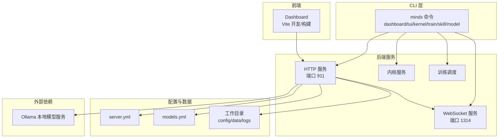
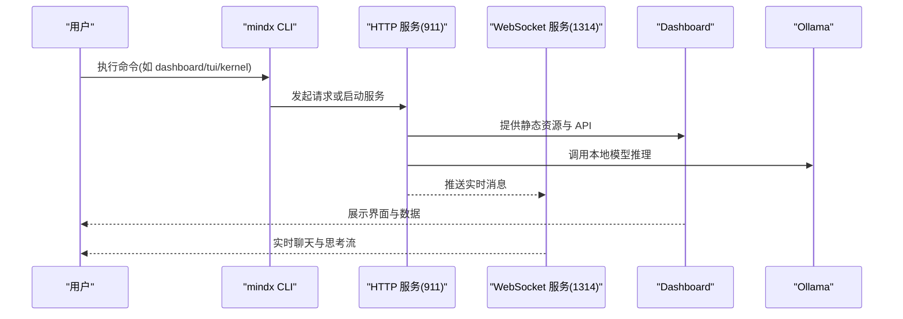
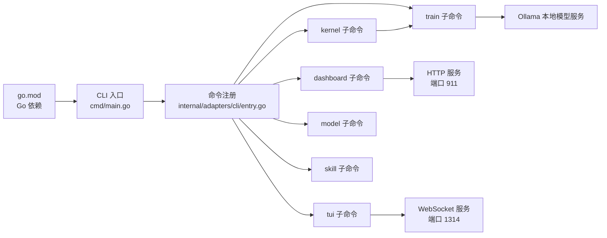

# 快速开始

<cite>
**本文引用的文件**
- [README.md](file://README.md)
- [INSTALL.md](file://INSTALL.md)
- [Makefile](file://Makefile)
- [go.mod](file://go.mod)
- [cmd/main.go](file://cmd/main.go)
- [internal/adapters/cli/entry.go](file://internal/adapters/cli/entry.go)
- [internal/adapters/cli/dashboard.go](file://internal/adapters/cli/dashboard.go)
- [internal/adapters/cli/tui.go](file://internal/adapters/cli/tui.go)
- [scripts/install.sh](file://scripts/install.sh)
- [scripts/dev-start.sh](file://scripts/dev-start.sh)
- [scripts/doctor.sh](file://scripts/doctor.sh)
- [scripts/ollama.sh](file://scripts/ollama.sh)
- [scripts/uninstall.sh](file://scripts/uninstall.sh)
- [config/server.yml](file://config/server.yml)
- [config/models.yml](file://config/models.yml)
- [dashboard/package.json](file://dashboard/package.json)
</cite>

## 目录
1. [简介](#简介)
2. [项目结构](#项目结构)
3. [核心组件](#核心组件)
4. [架构总览](#架构总览)
5. [详细组件分析](#详细组件分析)
6. [依赖关系分析](#依赖关系分析)
7. [性能考虑](#性能考虑)
8. [故障排除指南](#故障排除指南)
9. [结论](#结论)
10. [附录](#附录)

## 简介
本指南面向首次接触 MindX 的用户，帮助你在最短时间内完成系统要求检查、环境准备、安装与启动，并掌握 Web 界面与 TUI 终端界面的使用方法。MindX 是一款具备思考、记忆、执行与进化能力的本地化 AI 助手，支持多种操作系统与平台，提供预编译包与源码编译两种安装方式。

## 项目结构
MindX 采用前后端分离与统一 CLI 的组织方式：
- 后端：Go 语言实现，提供 HTTP 服务、WebSocket 推送、内核服务与训练调度等能力
- 前端：React/Vite 构建的 Dashboard，提供可视化配置与监控
- CLI：统一入口，支持 dashboard、tui、kernel、model、train、skill 等子命令
- 配置：server.yml、models.yml 等集中管理服务与模型参数
- 脚本：Makefile、install.sh、doctor.sh 等辅助构建、安装与诊断

图表来源
- [Makefile](file://Makefile#L166-L191)
- [internal/adapters/cli/entry.go](file://internal/adapters/cli/entry.go#L17-L122)
- [internal/adapters/cli/dashboard.go](file://internal/adapters/cli/dashboard.go#L13-L38)
- [internal/adapters/cli/tui.go](file://internal/adapters/cli/tui.go#L17-L36)
- [config/server.yml](file://config/server.yml#L1-L21)
- [config/models.yml](file://config/models.yml#L1-L92)

章节来源
- [README.md](file://README.md#L64-L143)
- [INSTALL.md](file://INSTALL.md#L55-L78)

## 核心组件
- CLI 入口与命令体系
  - mindx dashboard：打开 Web 界面
  - mindx tui：启动终端聊天界面
  - mindx kernel：内核服务管理
  - mindx train：训练调度
  - mindx model：模型兼容性测试
  - mindx skill：技能管理
- 后端服务
  - HTTP 服务：提供 API 与静态资源
  - WebSocket 服务：实时消息推送
  - 内核服务：常驻守护，负责训练与后台任务
- 前端 Dashboard：可视化配置与监控
- 配置与数据
  - server.yml：端口、向量存储类型、Token 预算、模型映射
  - models.yml：模型列表与参数
  - 工作目录：config、data、logs

章节来源
- [internal/adapters/cli/entry.go](file://internal/adapters/cli/entry.go#L17-L122)
- [internal/adapters/cli/dashboard.go](file://internal/adapters/cli/dashboard.go#L13-L38)
- [internal/adapters/cli/tui.go](file://internal/adapters/cli/tui.go#L17-L36)
- [config/server.yml](file://config/server.yml#L1-L21)
- [config/models.yml](file://config/models.yml#L1-L92)

## 架构总览
下图展示了从 CLI 到后端服务、再到前端与外部模型服务的整体交互：

图表来源
- [internal/adapters/cli/entry.go](file://internal/adapters/cli/entry.go#L17-L122)
- [internal/adapters/cli/dashboard.go](file://internal/adapters/cli/dashboard.go#L13-L38)
- [internal/adapters/cli/tui.go](file://internal/adapters/cli/tui.go#L428-L480)
- [config/server.yml](file://config/server.yml#L1-L21)

## 详细组件分析

### 系统要求与环境准备
- 操作系统：macOS / Linux / Windows
- 内存：建议 8GB 以上
- 硬盘空间：建议 20GB 以上
- 网络：首次安装需下载模型，后续可离线使用
- 依赖软件：Go 1.21+、Node.js 18+（仅构建 Dashboard）、Ollama（本地模型推理）

章节来源
- [README.md](file://README.md#L66-L71)
- [INSTALL.md](file://INSTALL.md#L3-L8)
- [go.mod](file://go.mod#L3)

### Ollama 本地模型服务安装与验证
- 安装方式（按平台）
  - macOS（Homebrew）：brew install ollama
  - Linux：curl -fsSL https://ollama.com/install.sh | sh
- 启动服务：ollama serve
- 验证安装：ollama list（空列表也表示安装成功）
- 模型拉取（示例）：ollama pull qwen3:0.6b 与 quentinz/bge-small-zh-v1.5

章节来源
- [README.md](file://README.md#L72-L91)
- [scripts/ollama.sh](file://scripts/ollama.sh#L1-L27)

### 两种安装方式

#### 方式一：预编译包安装（推荐）
- 下载对应系统发布的压缩包（GitHub Releases / Gitee Releases）
- 解压并安装：
  - macOS/Linux：解压后进入目录，执行 ./install.sh
  - Windows：解压后运行安装脚本
- 安装脚本会：
  - 创建安装目录与符号链接
  - 初始化工作目录（config/data/logs）
  - 复制技能与静态资源
  - 创建系统服务（launchd 或 systemd）
  - 生成工作目录 .env 文件

章节来源
- [README.md](file://README.md#L93-L124)
- [scripts/install.sh](file://scripts/install.sh#L1-L324)

#### 方式二：从源码编译安装
- 克隆仓库并进入目录
- 安装依赖：Go 1.21+、Node.js 18+
- 构建与安装：
  - make build（构建前端+后端）
  - make install（交互式选择工作目录）
- 可选：make doctor 检查环境

章节来源
- [README.md](file://README.md#L126-L138)
- [INSTALL.md](file://INSTALL.md#L18-L51)
- [scripts/doctor.sh](file://scripts/doctor.sh#L36-L67)

### 启动步骤

#### 后端服务启动
- 使用 Makefile（推荐）：make run（启动 Dashboard）
- 或直接使用 CLI：mindx dashboard
- 开发模式：make dev（后端+前端热重载）

章节来源
- [INSTALL.md](file://INSTALL.md#L38-L45)
- [Makefile](file://Makefile#L44-L51)
- [internal/adapters/cli/dashboard.go](file://internal/adapters/cli/dashboard.go#L13-L38)

#### Web 界面访问
- 默认访问地址：http://localhost:911
- 若系统未自动打开浏览器，可手动访问
- 开发模式前端地址：http://localhost:5173

章节来源
- [config/server.yml](file://config/server.yml#L3-L4)
- [internal/adapters/cli/dashboard.go](file://internal/adapters/cli/dashboard.go#L17-L18)
- [scripts/dev-start.sh](file://scripts/dev-start.sh#L112-L143)

#### TUI 终端界面使用
- 启动：mindx tui
- 参数：
  - -p/--port：WebSocket 端口，默认 1314
  - -s/--session：指定会话 ID
- 交互：
  - Enter 发送消息
  - Ctrl+C 或 Esc 退出
  - 上/下键浏览输入历史

章节来源
- [internal/adapters/cli/tui.go](file://internal/adapters/cli/tui.go#L17-L36)
- [internal/adapters/cli/tui.go](file://internal/adapters/cli/tui.go#L428-L480)

### 目录结构与配置说明
- 安装目录（默认 /usr/local/mindx）：
  - bin/mindx：可执行文件
  - static：Dashboard 静态资源
  - skills：内置技能
  - config：配置模板
- 工作目录（默认 ~/.mindx）：
  - config：server.yml、models.yml、capabilities.yml、channels.yml
  - data：memory、sessions、vectors、training
  - logs：系统日志

章节来源
- [INSTALL.md](file://INSTALL.md#L55-L78)
- [config/server.yml](file://config/server.yml#L1-L21)
- [config/models.yml](file://config/models.yml#L1-L92)

### 开发与扩展
- 开发模式：make dev（后端+前端热重载）
- 技能开发：兼容 OpenClaw 生态，支持任意编程语言 CLI 开发
- 更多功能：参见官方文档

章节来源
- [README.md](file://README.md#L140-L143)
- [INSTALL.md](file://INSTALL.md#L193-L214)

## 依赖关系分析

图表来源
- [go.mod](file://go.mod#L1-L113)
- [cmd/main.go](file://cmd/main.go#L1-L21)
- [internal/adapters/cli/entry.go](file://internal/adapters/cli/entry.go#L17-L122)
- [config/server.yml](file://config/server.yml#L3-L4)

章节来源
- [go.mod](file://go.mod#L1-L113)
- [cmd/main.go](file://cmd/main.go#L1-L21)

## 性能考虑
- 本地模型推理：建议使用 qwen3:0.6b 作为默认模型，兼顾速度与效果
- 端口占用：默认端口 911 与 1314，若被占用请调整配置或释放端口
- 硬盘与内存：建议 20GB 空间与 8GB 内存起步，根据技能与数据规模适当增加
- 向量索引：Badger 作为向量存储，注意磁盘空间与 I/O 性能

章节来源
- [config/server.yml](file://config/server.yml#L6-L19)
- [INSTALL.md](file://INSTALL.md#L413-L427)

## 故障排除指南

### 环境检查与诊断
- 使用 make doctor 检查：
  - 系统依赖（Go、Node.js、Ollama）
  - Ollama 模型（qwen3:0.6b、qwen3:1.7b、quentinz/bge-small-zh-v1.5）
  - 安装状态（PATH、安装目录、静态资源）
  - 工作区状态（配置、数据目录、权限）
  - 端口占用（911、1314）

章节来源
- [scripts/doctor.sh](file://scripts/doctor.sh#L30-L328)

### 常见问题与解决
- Ollama 未安装或未启动
  - 确认已安装并启动服务，验证：ollama list
- 端口被占用
  - 默认端口 911、1314；可在 server.yml 中修改
- 权限问题
  - 确保工作目录可写；Linux/macOS 可使用 chmod -R 755
- Dashboard 静态文件缺失
  - 确保已构建前端；开发模式使用 make dev
- 卸载 MindX
  - 使用 make uninstall 或脚本 uninstall.sh

章节来源
- [README.md](file://README.md#L145-L158)
- [INSTALL.md](file://INSTALL.md#L409-L437)
- [scripts/uninstall.sh](file://scripts/uninstall.sh#L1-L263)

### 环境准备自动化脚本
- ollama.sh：自动安装 Ollama 并拉取常用模型
- doctor.sh：一键环境诊断
- dev-start.sh：开发模式一键启动后端与前端

章节来源
- [scripts/ollama.sh](file://scripts/ollama.sh#L1-L27)
- [scripts/doctor.sh](file://scripts/doctor.sh#L1-L328)
- [scripts/dev-start.sh](file://scripts/dev-start.sh#L1-L285)

## 结论
通过本快速开始指南，你可以：
- 明确系统要求与环境准备
- 选择预编译包或源码编译两种安装方式
- 成功启动后端服务并访问 Web 界面
- 使用 TUI 终端进行实时聊天
- 在遇到问题时利用 doctor 脚本与常见问题清单快速定位与解决

## 附录

### CLI 命令参考（摘要）
- mindx dashboard：打开 Web 界面
- mindx tui [-p 端口] [-s 会话ID]：启动 TUI
- mindx kernel start/stop/restart/status：内核服务管理
- mindx train [--run-once]：训练调度
- mindx model test [模型名]：模型兼容性测试
- mindx skill list/enable/disable/reload：技能管理

章节来源
- [internal/adapters/cli/entry.go](file://internal/adapters/cli/entry.go#L93-L122)
- [INSTALL.md](file://INSTALL.md#L261-L304)

### 配置文件说明（摘要）
- server.yml：主机、端口、向量存储类型、Token 预算、模型映射
- models.yml：模型列表与参数（温度、最大 Token 等）

章节来源
- [config/server.yml](file://config/server.yml#L1-L21)
- [config/models.yml](file://config/models.yml#L1-L92)