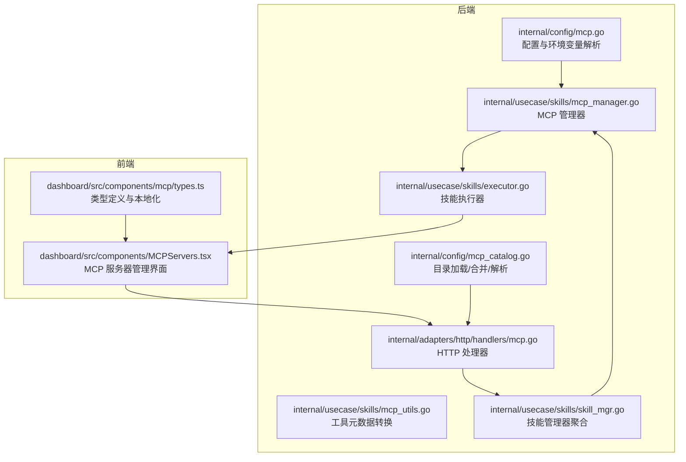
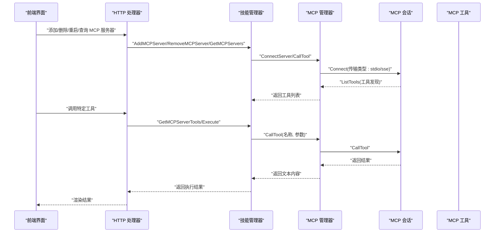
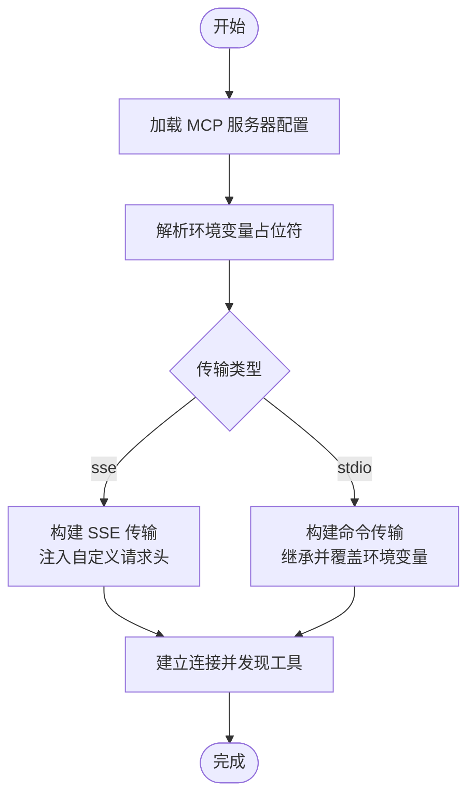
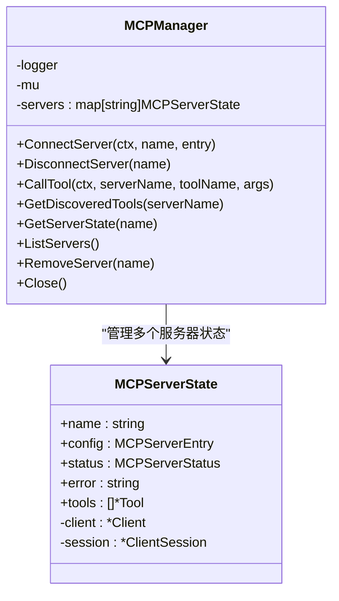
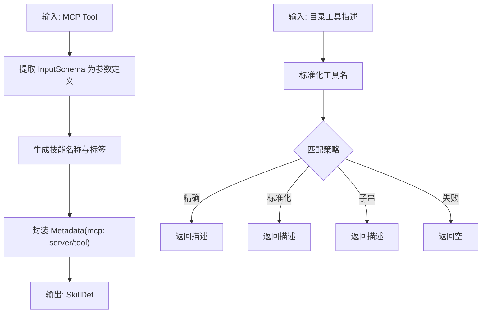
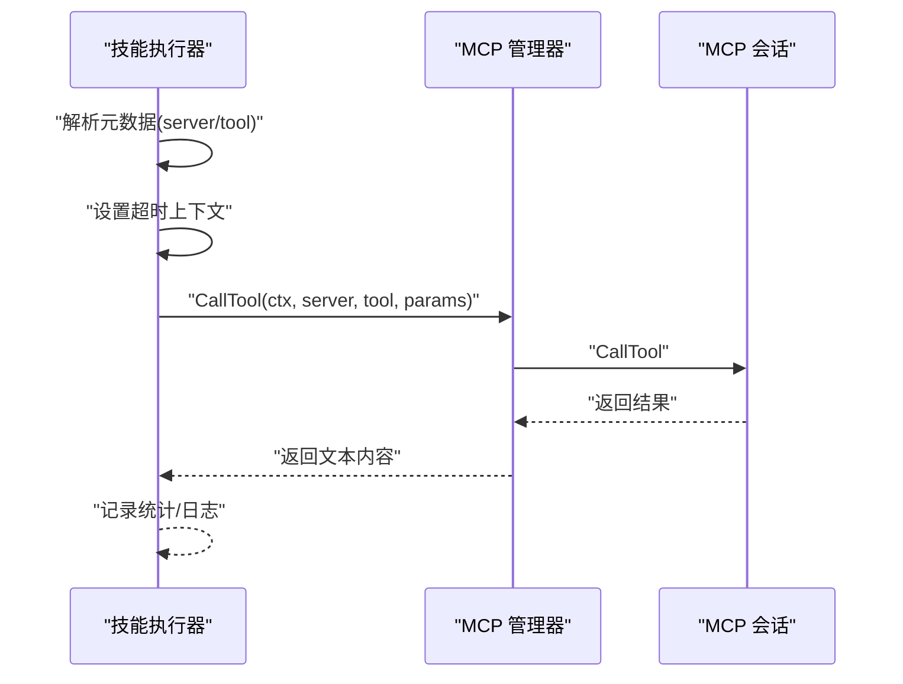
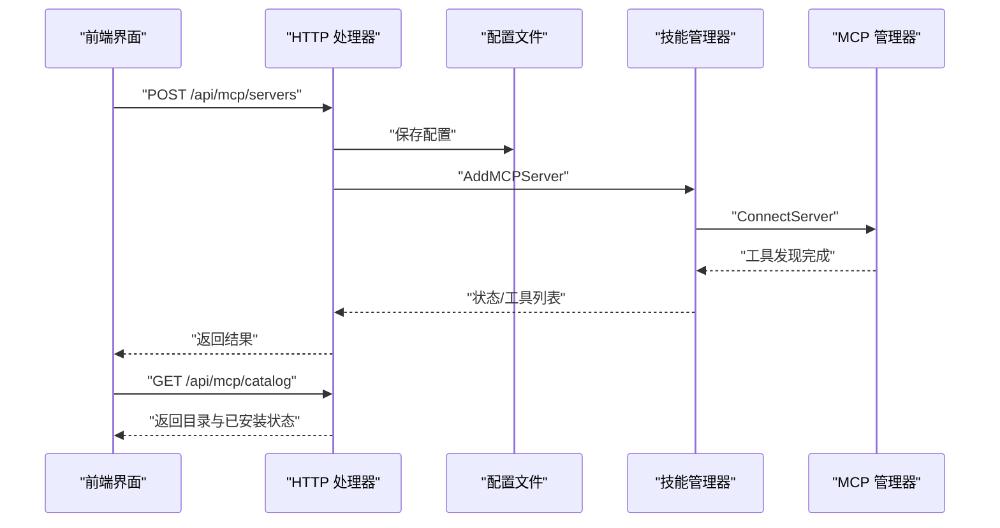
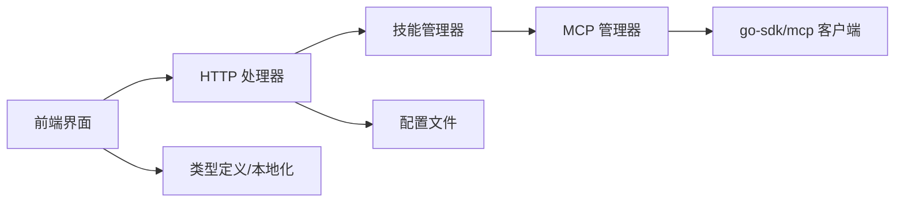

# MCP 协议概述

<cite>
**本文档引用的文件**
- [cmd/main.go](file://cmd/main.go)
- [internal/config/mcp.go](file://internal/config/mcp.go)
- [internal/config/mcp_catalog.go](file://internal/config/mcp_catalog.go)
- [internal/usecase/skills/mcp_manager.go](file://internal/usecase/skills/mcp_manager.go)
- [internal/usecase/skills/mcp_utils.go](file://internal/usecase/skills/mcp_utils.go)
- [internal/usecase/skills/skill_mgr.go](file://internal/usecase/skills/skill_mgr.go)
- [internal/usecase/skills/executor.go](file://internal/usecase/skills/executor.go)
- [internal/adapters/http/handlers/mcp.go](file://internal/adapters/http/handlers/mcp.go)
- [dashboard/src/components/MCPServers.tsx](file://dashboard/src/components/MCPServers.tsx)
- [dashboard/src/components/mcp/types.ts](file://dashboard/src/components/mcp/types.ts)
- [config/mcp_servers.json.template](file://config/mcp_servers.json.template)
- [internal/usecase/skills/SKILL_DEVELOPMENT.md](file://internal/usecase/skills/SKILL_DEVELOPMENT.md)
</cite>

## 目录
1. [简介](#简介)
2. [项目结构](#项目结构)
3. [核心组件](#核心组件)
4. [架构总览](#架构总览)
5. [详细组件分析](#详细组件分析)
6. [依赖关系分析](#依赖关系分析)
7. [性能考虑](#性能考虑)
8. [故障排除指南](#故障排除指南)
9. [结论](#结论)
10. [附录](#附录)

## 简介
本文件面向开发者与技术读者，系统性阐述 MindX 中 MCP（Model Context Protocol）协议的实现与使用方法。MCP 协议旨在为模型与外部工具之间提供标准化、可发现、可调用的交互通道。在 MindX 中，MCP 通过“服务器-工具”两层抽象实现：服务器负责承载工具集合，工具通过 JSON Schema 描述输入参数；MindX 将这些工具统一纳入技能体系，实现与本地脚本技能一致的生命周期与执行体验。

- 设计目标
  - 标准化：遵循 MCP 协议规范，统一工具发现与调用语义
  - 可扩展：支持本地子进程（stdio）与远程 HTTP SSE 两种传输
  - 一体化：MCP 工具与本地技能在前端与后端保持一致的体验
  - 可管理：提供目录化安装、配置持久化、状态监控与错误追踪

- 在 AI 工具集成中的作用
  - 将外部服务（如文件系统、数据库、第三方 API）以“工具”的形式暴露给模型
  - 通过目录化配置与模板变量，实现即插即用与跨环境部署
  - 将工具调用结果以统一格式返回，便于模型进行下一步推理与决策

**章节来源**
- [README.md](file://README.md#L1-L200)

## 项目结构
围绕 MCP 的实现，MindX 在后端按“配置-用例-适配器”分层组织，在前端提供可视化管理界面。关键目录与文件如下：
- 后端
  - 配置层：MCP 服务器配置与目录解析
  - 用例层：MCP 管理器、工具元数据转换、技能执行器
  - 适配器层：HTTP 接口，提供服务器增删改查、目录安装、工具列表查询
- 前端
  - MCP 服务器管理页面，支持 SSE 与 stdio 两种模式的表单配置与工具查看
  - 类型定义与本地化工具函数

**图表来源**
- [internal/config/mcp.go](file://internal/config/mcp.go#L1-L106)
- [internal/config/mcp_catalog.go](file://internal/config/mcp_catalog.go#L1-L252)
- [internal/usecase/skills/mcp_manager.go](file://internal/usecase/skills/mcp_manager.go#L1-L292)
- [internal/usecase/skills/mcp_utils.go](file://internal/usecase/skills/mcp_utils.go#L1-L132)
- [internal/usecase/skills/skill_mgr.go](file://internal/usecase/skills/skill_mgr.go#L1-L200)
- [internal/adapters/http/handlers/mcp.go](file://internal/adapters/http/handlers/mcp.go#L1-L248)
- [dashboard/src/components/MCPServers.tsx](file://dashboard/src/components/MCPServers.tsx#L1-L200)
- [dashboard/src/components/mcp/types.ts](file://dashboard/src/components/mcp/types.ts#L1-L47)

**章节来源**
- [cmd/main.go](file://cmd/main.go#L1-L21)
- [internal/config/mcp.go](file://internal/config/mcp.go#L1-L106)
- [internal/config/mcp_catalog.go](file://internal/config/mcp_catalog.go#L1-L252)
- [internal/usecase/skills/mcp_manager.go](file://internal/usecase/skills/mcp_manager.go#L1-L292)
- [internal/usecase/skills/mcp_utils.go](file://internal/usecase/skills/mcp_utils.go#L1-L132)
- [internal/usecase/skills/skill_mgr.go](file://internal/usecase/skills/skill_mgr.go#L1-L200)
- [internal/adapters/http/handlers/mcp.go](file://internal/adapters/http/handlers/mcp.go#L1-L248)
- [dashboard/src/components/MCPServers.tsx](file://dashboard/src/components/MCPServers.tsx#L1-L200)
- [dashboard/src/components/mcp/types.ts](file://dashboard/src/components/mcp/types.ts#L1-L47)

## 核心组件
- MCP 服务器配置与环境变量解析
  - 支持两种传输类型：stdio（本地子进程）与 sse（远程 HTTP SSE）
  - 提供配置文件的加载、保存与环境变量占位符解析
- MCP 管理器
  - 负责建立连接、工具发现、工具调用与状态管理
  - 支持 SSE 传输的自定义请求头注入
- 目录与安装
  - 内置目录与远程目录合并策略
  - 通过模板变量解析生成可直接使用的服务器配置
- 技能执行器
  - 将 MCP 工具转换为统一的技能定义，参与搜索、索引与执行
  - 执行时设置超时，记录统计与日志
- HTTP 接口
  - 提供服务器增删改查、目录安装、工具列表查询等接口
- 前端管理界面
  - 支持 SSE 与 stdio 表单配置，查看工具列表，一键安装目录项

**章节来源**
- [internal/config/mcp.go](file://internal/config/mcp.go#L1-L106)
- [internal/config/mcp_catalog.go](file://internal/config/mcp_catalog.go#L1-L252)
- [internal/usecase/skills/mcp_manager.go](file://internal/usecase/skills/mcp_manager.go#L1-L292)
- [internal/usecase/skills/mcp_utils.go](file://internal/usecase/skills/mcp_utils.go#L1-L132)
- [internal/adapters/http/handlers/mcp.go](file://internal/adapters/http/handlers/mcp.go#L1-L248)
- [dashboard/src/components/MCPServers.tsx](file://dashboard/src/components/MCPServers.tsx#L1-L200)

## 架构总览
下图展示了 MCP 在 MindX 中的端到端流程：前端发起请求，HTTP 层调用技能管理器，技能管理器委托 MCP 管理器完成连接与工具调用，并将结果返回前端。

**图表来源**
- [internal/adapters/http/handlers/mcp.go](file://internal/adapters/http/handlers/mcp.go#L1-L248)
- [internal/usecase/skills/skill_mgr.go](file://internal/usecase/skills/skill_mgr.go#L1-L200)
- [internal/usecase/skills/mcp_manager.go](file://internal/usecase/skills/mcp_manager.go#L1-L292)
- [internal/usecase/skills/executor.go](file://internal/usecase/skills/executor.go#L105-L143)

## 详细组件分析

### MCP 服务器配置与目录
- 配置结构
  - 支持字段：type（stdio/sse）、command/args/env（stdio）、url/headers（sse）、enabled
  - 默认类型为 stdio，便于向后兼容
- 环境变量解析
  - 支持 ${VAR} 占位符，优先使用本地上下文，再回退到系统环境
- 目录解析
  - 内置目录与远程目录合并，远程条目覆盖同 ID 的内置条目
  - 通过模板变量替换生成最终的 MCPServerEntry

**图表来源**
- [internal/config/mcp.go](file://internal/config/mcp.go#L39-L106)
- [internal/config/mcp_catalog.go](file://internal/config/mcp_catalog.go#L92-L161)
- [internal/usecase/skills/mcp_manager.go](file://internal/usecase/skills/mcp_manager.go#L49-L141)

**章节来源**
- [internal/config/mcp.go](file://internal/config/mcp.go#L1-L106)
- [internal/config/mcp_catalog.go](file://internal/config/mcp_catalog.go#L1-L252)
- [config/mcp_servers.json.template](file://config/mcp_servers.json.template#L1-L4)

### MCP 管理器与连接管理
- 连接建立
  - SSE：指定 endpoint，可选注入 headers；支持从 env 中解析占位符
  - stdio：继承父进程环境，叠加用户配置；工作目录设为用户家目录
- 工具发现与调用
  - 连接成功后调用 ListTools 获取工具列表
  - 调用工具时进行状态校验，失败时更新状态并记录错误
- 状态管理
  - 状态枚举：connected/disconnected/error
  - 并发安全：读写锁保护服务器状态映射

**图表来源**
- [internal/usecase/skills/mcp_manager.go](file://internal/usecase/skills/mcp_manager.go#L1-L292)

**章节来源**
- [internal/usecase/skills/mcp_manager.go](file://internal/usecase/skills/mcp_manager.go#L1-L292)

### 工具元数据与技能转换
- 元数据识别
  - 通过技能定义中的 metadata.mcp.server 与 metadata.mcp.tool 识别 MCP 技能
- 工具转技能
  - 将 MCP Tool 的输入 JSON Schema 转换为参数定义
  - 自动生成技能名称、标签（含 server 名），并携带 mcp 元数据
- 工具描述匹配
  - 目录中提供工具描述，用于与实际工具名进行标准化匹配与回填

**图表来源**
- [internal/usecase/skills/mcp_utils.go](file://internal/usecase/skills/mcp_utils.go#L56-L132)
- [internal/config/mcp_catalog.go](file://internal/config/mcp_catalog.go#L178-L251)

**章节来源**
- [internal/usecase/skills/mcp_utils.go](file://internal/usecase/skills/mcp_utils.go#L1-L132)
- [internal/config/mcp_catalog.go](file://internal/config/mcp_catalog.go#L1-L252)

### 技能执行器与超时控制
- 执行流程
  - 从技能定义提取 MCP 元数据（server/tool）
  - 设置超时上下文，默认 30 秒，可由技能定义覆盖
  - 调用 MCP 管理器执行工具，记录统计与日志
- 错误处理
  - 管理器返回错误时，统一记录并返回
  - 成功时返回文本内容

**图表来源**
- [internal/usecase/skills/executor.go](file://internal/usecase/skills/executor.go#L105-L143)
- [internal/usecase/skills/mcp_manager.go](file://internal/usecase/skills/mcp_manager.go#L169-L204)

**章节来源**
- [internal/usecase/skills/executor.go](file://internal/usecase/skills/executor.go#L105-L143)
- [internal/usecase/skills/mcp_manager.go](file://internal/usecase/skills/mcp_manager.go#L169-L204)

### HTTP 接口与前端集成
- HTTP 接口
  - 列出服务器、添加服务器（校验必填字段）、删除服务器、重启服务器
  - 查询服务器工具列表、从目录安装、获取目录与已安装状态
  - 配置持久化：添加/删除服务器时同步写入配置文件
- 前端界面
  - 支持 SSE 与 stdio 两种模式的表单
  - 工具列表展示与展开查看
  - 目录安装：选择目录项并填写模板变量，异步连接服务器

**图表来源**
- [internal/adapters/http/handlers/mcp.go](file://internal/adapters/http/handlers/mcp.go#L25-L248)
- [internal/config/mcp.go](file://internal/config/mcp.go#L66-L80)
- [dashboard/src/components/MCPServers.tsx](file://dashboard/src/components/MCPServers.tsx#L94-L200)

**章节来源**
- [internal/adapters/http/handlers/mcp.go](file://internal/adapters/http/handlers/mcp.go#L1-L248)
- [dashboard/src/components/MCPServers.tsx](file://dashboard/src/components/MCPServers.tsx#L1-L200)
- [dashboard/src/components/mcp/types.ts](file://dashboard/src/components/mcp/types.ts#L1-L47)

## 依赖关系分析
- 组件耦合
  - MCP 管理器独立于具体传输类型，通过 Transport 接口解耦
  - 技能管理器聚合 MCP 管理器，形成统一入口
  - HTTP 处理器仅负责请求解析与持久化，业务逻辑下沉至用例层
- 外部依赖
  - 使用 go-sdk/mcp 客户端库进行连接与工具调用
  - 前端使用 KV 编辑器与本地化工具函数

**图表来源**
- [internal/adapters/http/handlers/mcp.go](file://internal/adapters/http/handlers/mcp.go#L1-L248)
- [internal/usecase/skills/skill_mgr.go](file://internal/usecase/skills/skill_mgr.go#L1-L200)
- [internal/usecase/skills/mcp_manager.go](file://internal/usecase/skills/mcp_manager.go#L1-L292)
- [dashboard/src/components/mcp/types.ts](file://dashboard/src/components/mcp/types.ts#L1-L47)

**章节来源**
- [internal/adapters/http/handlers/mcp.go](file://internal/adapters/http/handlers/mcp.go#L1-L248)
- [internal/usecase/skills/skill_mgr.go](file://internal/usecase/skills/skill_mgr.go#L1-L200)
- [internal/usecase/skills/mcp_manager.go](file://internal/usecase/skills/mcp_manager.go#L1-L292)

## 性能考虑
- 连接与传输
  - stdio：子进程启动与环境变量拼接存在开销，建议复用已连接会话，避免频繁重启
  - SSE：网络延迟与认证头注入增加额外往返，建议缓存已解析的 headers
- 工具调用
  - 设置合理超时，避免阻塞主线程；对高频工具可引入本地缓存
- 并发与状态
  - 使用读写锁保护服务器状态映射，减少锁竞争
- 前端体验
  - 目录安装采用异步连接，保证接口响应不被阻塞

[本节为通用指导，不直接分析具体文件]

## 故障排除指南
- 连接失败
  - 检查传输类型与必填字段：SSE 需要 url，stdio 需要 command
  - 校验环境变量占位符是否正确解析
- 工具不可用
  - 确认服务器已连接且状态为 connected
  - 重新触发工具发现或重启服务器
- 执行错误
  - 查看日志中的错误信息与状态字段
  - 检查工具参数是否符合 JSON Schema

**章节来源**
- [internal/adapters/http/handlers/mcp.go](file://internal/adapters/http/handlers/mcp.go#L57-L89)
- [internal/usecase/skills/mcp_manager.go](file://internal/usecase/skills/mcp_manager.go#L106-L141)
- [internal/usecase/skills/executor.go](file://internal/usecase/skills/executor.go#L105-L143)

## 结论
MindX 通过 MCP 协议实现了与外部工具的标准化集成，既保持了与本地技能一致的使用体验，又提供了灵活的传输方式与强大的目录化安装能力。MCP 管理器承担连接、发现与调用职责，技能执行器将其无缝接入整体技能体系，HTTP 与前端界面则提供直观的运维与管理能力。该实现为 AI 工具生态的扩展与集成提供了清晰、可维护的框架。

[本节为总结性内容，不直接分析具体文件]

## 附录

### 基本使用示例（步骤说明）
- 添加 SSE 服务器
  - 在前端选择“SSE”，填写 url 与 headers（可使用 ${VAR} 占位符）
  - 点击“添加”，配置将持久化并异步连接
- 添加 stdio 服务器
  - 在前端选择“stdio”，填写 command 与 args（每行一个参数）
  - 可选设置 env，点击“添加”
- 从目录安装
  - 打开目录页，选择条目并填写模板变量
  - 点击“安装”，系统将立即持久化配置并异步连接
- 查看工具
  - 在服务器卡片中点击“查看工具”，展开工具列表
- 调用工具
  - 在技能面板中选择对应的 MCP 技能，传入参数后执行

**章节来源**
- [dashboard/src/components/MCPServers.tsx](file://dashboard/src/components/MCPServers.tsx#L120-L200)
- [internal/adapters/http/handlers/mcp.go](file://internal/adapters/http/handlers/mcp.go#L183-L247)
- [internal/config/mcp_catalog.go](file://internal/config/mcp_catalog.go#L119-L161)

### 最佳实践
- 传输选择
  - 本地工具优先使用 stdio，便于调试与权限控制
  - 远程工具使用 SSE，结合 headers 实现鉴权
- 配置管理
  - 使用模板变量集中管理敏感信息（如 API Key），避免硬编码
  - 定期检查服务器状态与工具列表，及时清理失效条目
- 技能设计
  - 为 MCP 工具提供清晰的描述与参数说明，便于搜索与使用
  - 合理设置超时与错误处理，提升用户体验

**章节来源**
- [internal/config/mcp.go](file://internal/config/mcp.go#L82-L106)
- [internal/config/mcp_catalog.go](file://internal/config/mcp_catalog.go#L119-L161)
- [internal/usecase/skills/executor.go](file://internal/usecase/skills/executor.go#L117-L122)

### MCP 技能开发要点
- 通过 metadata.mcp 标记技能来源（server/tool）
- 输入参数遵循 JSON Schema，便于自动补全与校验
- 与普通技能一致的生命周期与执行体验

**章节来源**
- [internal/usecase/skills/mcp_utils.go](file://internal/usecase/skills/mcp_utils.go#L16-L54)
- [internal/usecase/skills/SKILL_DEVELOPMENT.md](file://internal/usecase/skills/SKILL_DEVELOPMENT.md#L365-L416)