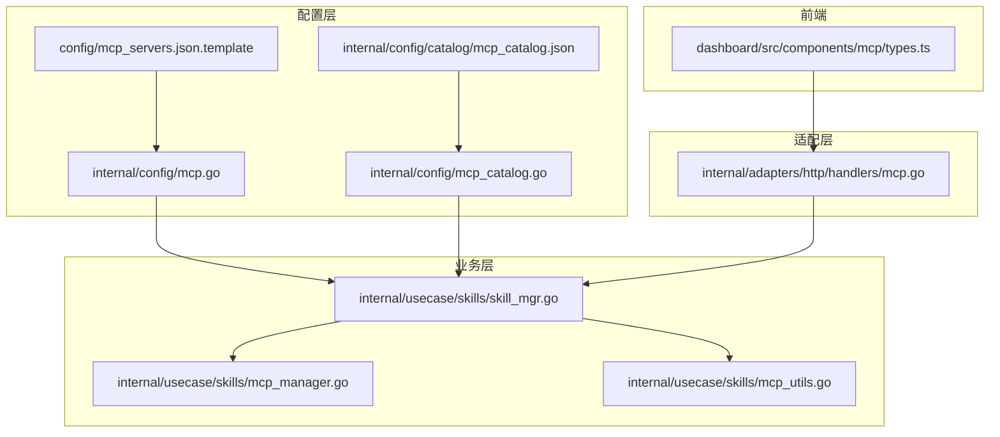
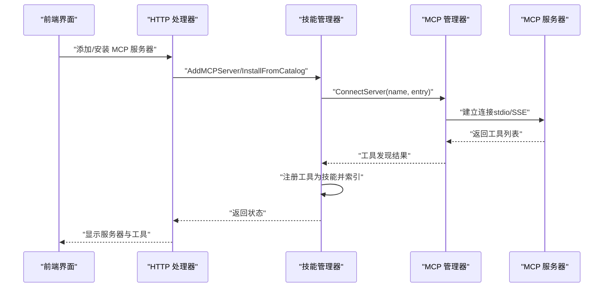
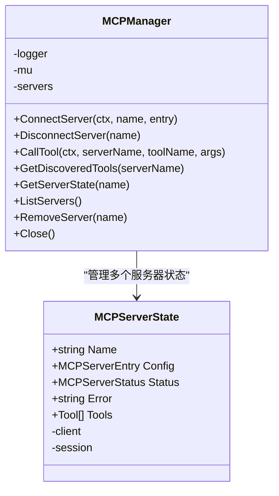
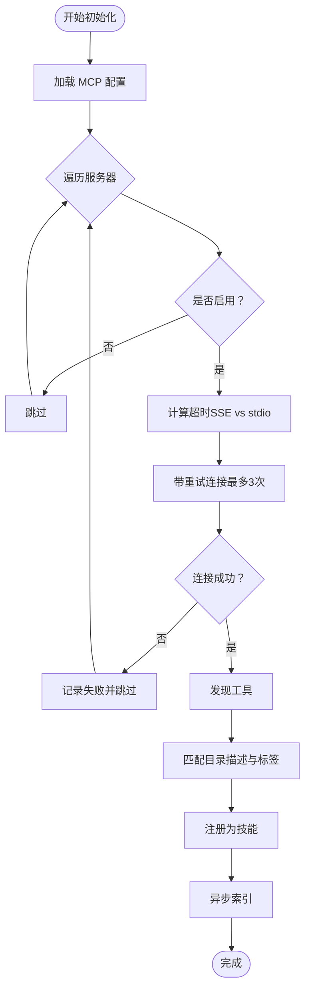
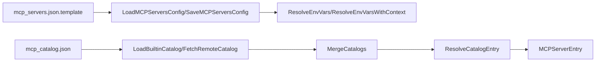
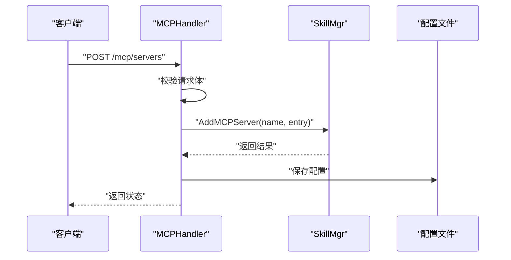
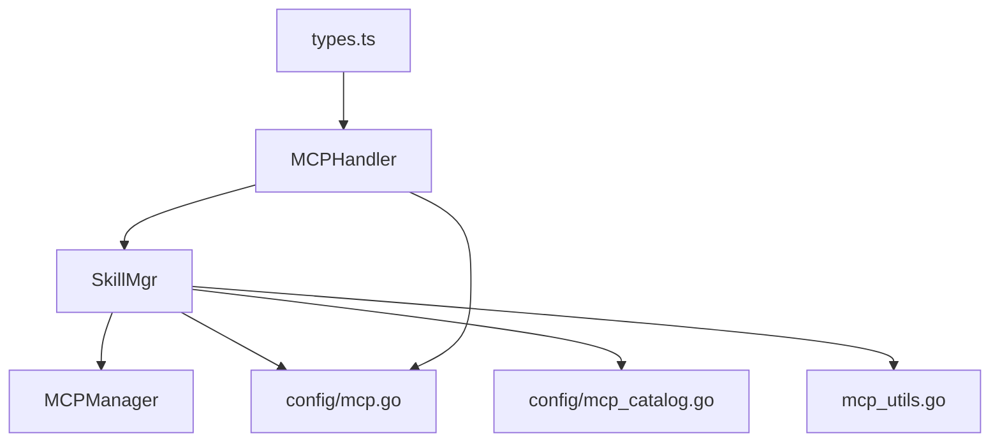

# MCP 协议集成

<cite>
**本文引用的文件**
- [internal/config/mcp.go](file://internal/config/mcp.go)
- [internal/config/mcp_catalog.go](file://internal/config/mcp_catalog.go)
- [config/mcp_servers.json.template](file://config/mcp_servers.json.template)
- [internal/usecase/skills/mcp_manager.go](file://internal/usecase/skills/mcp_manager.go)
- [internal/usecase/skills/mcp_utils.go](file://internal/usecase/skills/mcp_utils.go)
- [internal/usecase/skills/skill_mgr.go](file://internal/usecase/skills/skill_mgr.go)
- [internal/adapters/http/handlers/mcp.go](file://internal/adapters/http/handlers/mcp.go)
- [dashboard/src/components/mcp/types.ts](file://dashboard/src/components/mcp/types.ts)
- [internal/config/catalog/mcp_catalog.json](file://internal/config/catalog/mcp_catalog.json)
</cite>

## 目录
1. [简介](#简介)
2. [项目结构](#项目结构)
3. [核心组件](#核心组件)
4. [架构总览](#架构总览)
5. [详细组件分析](#详细组件分析)
6. [依赖分析](#依赖分析)
7. [性能考虑](#性能考虑)
8. [故障排除指南](#故障排除指南)
9. [结论](#结论)
10. [附录](#附录)

## 简介
本文件面向 MindX 的 MCP（Model Context Protocol）协议集成，系统性阐述 MCP 管理器的设计与实现、服务器连接与重连策略、工具发现与注册、与内置技能的融合、以及开发与部署指南。文档同时提供使用示例与最佳实践，帮助开发者扩展 MindX 的外部工具集成功能。

## 项目结构
围绕 MCP 的核心代码分布在以下模块：
- 配置层：负责 MCP 服务器配置的加载、保存与环境变量解析
- 业务层：MCP 管理器负责连接、工具发现、调用执行与状态管理
- 适配层：HTTP 处理器提供 MCP 服务器的增删改查、目录安装等接口
- 前端类型：定义 MCP 目录项与变量的数据结构
- 目录与模板：内置 MCP 服务器目录与配置模板

**图表来源**
- [internal/config/mcp.go](file://internal/config/mcp.go#L1-L106)
- [internal/config/mcp_catalog.go](file://internal/config/mcp_catalog.go#L1-L252)
- [config/mcp_servers.json.template](file://config/mcp_servers.json.template#L1-L4)
- [internal/config/catalog/mcp_catalog.json](file://internal/config/catalog/mcp_catalog.json#L1-L755)
- [internal/usecase/skills/mcp_manager.go](file://internal/usecase/skills/mcp_manager.go#L1-L292)
- [internal/usecase/skills/mcp_utils.go](file://internal/usecase/skills/mcp_utils.go#L1-L132)
- [internal/usecase/skills/skill_mgr.go](file://internal/usecase/skills/skill_mgr.go#L1-L558)
- [internal/adapters/http/handlers/mcp.go](file://internal/adapters/http/handlers/mcp.go#L1-L248)
- [dashboard/src/components/mcp/types.ts](file://dashboard/src/components/mcp/types.ts#L1-L47)

**章节来源**
- [internal/config/mcp.go](file://internal/config/mcp.go#L1-L106)
- [internal/config/mcp_catalog.go](file://internal/config/mcp_catalog.go#L1-L252)
- [config/mcp_servers.json.template](file://config/mcp_servers.json.template#L1-L4)
- [internal/config/catalog/mcp_catalog.json](file://internal/config/catalog/mcp_catalog.json#L1-L755)
- [internal/usecase/skills/mcp_manager.go](file://internal/usecase/skills/mcp_manager.go#L1-L292)
- [internal/usecase/skills/mcp_utils.go](file://internal/usecase/skills/mcp_utils.go#L1-L132)
- [internal/usecase/skills/skill_mgr.go](file://internal/usecase/skills/skill_mgr.go#L1-L558)
- [internal/adapters/http/handlers/mcp.go](file://internal/adapters/http/handlers/mcp.go#L1-L248)
- [dashboard/src/components/mcp/types.ts](file://dashboard/src/components/mcp/types.ts#L1-L47)

## 核心组件
- MCP 管理器（MCPManager）：负责连接 MCP 服务器（支持 stdio 与 SSE）、工具发现、工具调用、状态维护与资源清理
- 技能管理器（SkillMgr）：协调 MCP 管理器与技能系统，完成工具注册、索引与检索
- 配置与目录（config/mcp.go、mcp_catalog.go、mcp_catalog.json、mcp_servers.json.template）：提供服务器配置、环境变量解析、目录合并与工具描述匹配
- HTTP 处理器（handlers/mcp.go）：提供 MCP 服务器的增删改查、目录安装、工具列表查询等接口
- 前端类型（types.ts）：定义 MCP 目录项与变量的数据结构，便于 UI 展示与交互

**章节来源**
- [internal/usecase/skills/mcp_manager.go](file://internal/usecase/skills/mcp_manager.go#L1-L292)
- [internal/usecase/skills/skill_mgr.go](file://internal/usecase/skills/skill_mgr.go#L1-L558)
- [internal/config/mcp.go](file://internal/config/mcp.go#L1-L106)
- [internal/config/mcp_catalog.go](file://internal/config/mcp_catalog.go#L1-L252)
- [internal/config/catalog/mcp_catalog.json](file://internal/config/catalog/mcp_catalog.json#L1-L755)
- [config/mcp_servers.json.template](file://config/mcp_servers.json.template#L1-L4)
- [internal/adapters/http/handlers/mcp.go](file://internal/adapters/http/handlers/mcp.go#L1-L248)
- [dashboard/src/components/mcp/types.ts](file://dashboard/src/components/mcp/types.ts#L1-L47)

## 架构总览
MindX 的 MCP 集成采用“配置驱动 + 业务编排 + 适配层暴露”的分层架构。SkillMgr 作为中枢，负责加载配置、初始化 MCP 服务器、注册工具、构建索引，并与前端通过 HTTP 接口交互。

**图表来源**
- [internal/adapters/http/handlers/mcp.go](file://internal/adapters/http/handlers/mcp.go#L33-L90)
- [internal/usecase/skills/skill_mgr.go](file://internal/usecase/skills/skill_mgr.go#L508-L514)
- [internal/usecase/skills/mcp_manager.go](file://internal/usecase/skills/mcp_manager.go#L49-L141)

**章节来源**
- [internal/adapters/http/handlers/mcp.go](file://internal/adapters/http/handlers/mcp.go#L1-L248)
- [internal/usecase/skills/skill_mgr.go](file://internal/usecase/skills/skill_mgr.go#L373-L558)
- [internal/usecase/skills/mcp_manager.go](file://internal/usecase/skills/mcp_manager.go#L1-L292)

## 详细组件分析

### MCP 管理器（MCPManager）
职责与行为：
- 连接管理：支持 stdio（子进程）与 SSE（HTTP SSE）两种传输方式；SSE 支持自定义 HTTP 头部（用于认证）
- 工具发现：连接成功后调用 ListTools 获取工具清单，并缓存到状态中
- 工具调用：封装 CallTool，统一错误处理与状态更新
- 状态管理：维护连接状态、错误信息与工具列表；提供查询与清理接口
- 资源清理：支持断开连接、移除服务器与全局关闭

**图表来源**
- [internal/usecase/skills/mcp_manager.go](file://internal/usecase/skills/mcp_manager.go#L36-L292)

**章节来源**
- [internal/usecase/skills/mcp_manager.go](file://internal/usecase/skills/mcp_manager.go#L1-L292)

### 技能管理器（SkillMgr）与 MCP 集成
职责与行为：
- 初始化：并发初始化配置中的 MCP 服务器，按传输类型设置不同超时
- 重连策略：对超时类错误进行最多三次重试，间隔递增；对协议错误等不可恢复错误直接放弃
- 工具注册：将 MCP 工具转换为 MindX 技能定义，注入目录标签与本地化描述，注册到技能系统
- 索引与检索：将新增 MCP 技能送入索引队列，生成向量以支持语义检索
- 运行时管理：支持添加、移除、重启 MCP 服务器，保持技能系统与索引同步

**图表来源**
- [internal/usecase/skills/skill_mgr.go](file://internal/usecase/skills/skill_mgr.go#L373-L506)

**章节来源**
- [internal/usecase/skills/skill_mgr.go](file://internal/usecase/skills/skill_mgr.go#L373-L558)

### 配置与目录（config/mcp.go、mcp_catalog.go、mcp_catalog.json、mcp_servers.json.template）
- 服务器配置结构：支持 stdio 与 SSE 两类，包含命令、参数、环境变量、工作目录、URL、Headers 等
- 环境变量解析：支持 ${VAR} 占位符，优先从本地上下文解析，否则回退到系统环境
- 目录加载与合并：内置目录与远程目录合并，远程条目覆盖同 ID 的内置条目
- 目录变量解析：将目录中的变量（含密钥）解析为最终的 MCPServerEntry
- 工具描述匹配：提供多种匹配策略（精确、标准化、分词包含），用于本地化描述覆盖

**图表来源**
- [config/mcp_servers.json.template](file://config/mcp_servers.json.template#L1-L4)
- [internal/config/mcp.go](file://internal/config/mcp.go#L41-L105)
- [internal/config/mcp_catalog.go](file://internal/config/mcp_catalog.go#L58-L161)
- [internal/config/catalog/mcp_catalog.json](file://internal/config/catalog/mcp_catalog.json#L1-L755)

**章节来源**
- [internal/config/mcp.go](file://internal/config/mcp.go#L1-L106)
- [internal/config/mcp_catalog.go](file://internal/config/mcp_catalog.go#L1-L252)
- [config/mcp_servers.json.template](file://config/mcp_servers.json.template#L1-L4)
- [internal/config/catalog/mcp_catalog.json](file://internal/config/catalog/mcp_catalog.json#L1-L755)

### HTTP 处理器（handlers/mcp.go）
职责与行为：
- 列表：返回所有 MCP 服务器状态
- 添加：校验请求体，持久化到配置文件，异步连接并注册工具
- 删除：从内存与配置中移除服务器
- 重启：注销旧工具，重新连接并注册
- 工具列表：返回某服务器的工具清单
- 目录：返回内置目录与已安装状态
- 从目录安装：校验变量，解析为 MCPServerEntry，持久化并异步连接

**图表来源**
- [internal/adapters/http/handlers/mcp.go](file://internal/adapters/http/handlers/mcp.go#L33-L90)

**章节来源**
- [internal/adapters/http/handlers/mcp.go](file://internal/adapters/http/handlers/mcp.go#L1-L248)

### 前端类型（types.ts）
- 定义目录项（CatalogEntry）、变量（CatalogVariable）、工具（CatalogTool）等结构
- 提供本地化函数，按当前语言选择展示文本

**章节来源**
- [dashboard/src/components/mcp/types.ts](file://dashboard/src/components/mcp/types.ts#L1-L47)

## 依赖分析
- MCP 管理器依赖 go-sdk 的 mcp 客户端，负责连接与工具调用
- 技能管理器依赖 MCP 管理器、配置模块、目录模块与索引模块
- HTTP 处理器依赖技能管理器与配置模块
- 前端类型与处理器配合，用于目录展示与安装

**图表来源**
- [internal/usecase/skills/skill_mgr.go](file://internal/usecase/skills/skill_mgr.go#L1-L558)
- [internal/usecase/skills/mcp_manager.go](file://internal/usecase/skills/mcp_manager.go#L1-L292)
- [internal/config/mcp.go](file://internal/config/mcp.go#L1-L106)
- [internal/config/mcp_catalog.go](file://internal/config/mcp_catalog.go#L1-L252)
- [internal/adapters/http/handlers/mcp.go](file://internal/adapters/http/handlers/mcp.go#L1-L248)
- [dashboard/src/components/mcp/types.ts](file://dashboard/src/components/mcp/types.ts#L1-L47)

**章节来源**
- [internal/usecase/skills/skill_mgr.go](file://internal/usecase/skills/skill_mgr.go#L1-L558)
- [internal/usecase/skills/mcp_manager.go](file://internal/usecase/skills/mcp_manager.go#L1-L292)
- [internal/adapters/http/handlers/mcp.go](file://internal/adapters/http/handlers/mcp.go#L1-L248)

## 性能考虑
- 连接超时：SSE 默认较短超时，stdio 因冷启动耗时较长采用较长超时，避免早期失败导致频繁重试
- 并发初始化：配置中的多个服务器并发初始化，缩短整体启动时间
- 异步索引：MCP 工具注册后异步进入索引队列，不阻塞连接流程
- 重试策略：仅对超时/临时网络错误重试，避免对不可恢复错误浪费资源

[本节为通用建议，无需特定文件引用]

## 故障排除指南
常见问题与定位要点：
- 连接超时：检查服务器启动时间（stdio 冷启动较慢）、网络连通性与 SSE 认证头
- 进程崩溃：stdio 子进程启动后立即退出，属于不可重试错误，需检查命令、参数与环境变量
- 协议不兼容：Method Not Allowed 等错误，通常为服务器版本不兼容，需升级或更换服务器
- 工具未注册：确认工具发现成功、目录描述匹配与标签注入是否正确
- 配置未持久化：确认配置文件保存成功，且重启后仍可加载

**章节来源**
- [internal/usecase/skills/skill_mgr.go](file://internal/usecase/skills/skill_mgr.go#L404-L468)
- [internal/usecase/skills/mcp_manager.go](file://internal/usecase/skills/mcp_manager.go#L49-L141)
- [internal/adapters/http/handlers/mcp.go](file://internal/adapters/http/handlers/mcp.go#L138-L160)

## 结论
MindX 的 MCP 集成通过清晰的分层设计实现了“配置驱动 + 自动发现 + 异步索引”的闭环：配置层提供灵活的服务器定义与目录能力，业务层完成连接、工具注册与状态管理，适配层对外暴露易用的接口，前端类型确保良好的用户体验。该架构具备良好的扩展性与稳定性，适合持续接入更多 MCP 服务器与工具。

[本节为总结，无需特定文件引用]

## 附录

### MCP 服务器配置方法
- 配置文件位置：位于工作区配置目录下的 mcp_servers.json
- 支持的传输类型：
  - stdio：通过命令与参数启动本地子进程，支持环境变量覆盖与工作目录设置
  - SSE：通过 HTTP SSE 连接远端服务器，支持自定义头部（常用于认证）
- 关键字段：
  - type：传输类型（stdio/sse）
  - command/args/env/dir：stdio 场景的进程与环境
  - url/headers：SSE 场景的端点与头部
  - enabled：是否启用

**章节来源**
- [internal/config/mcp.go](file://internal/config/mcp.go#L13-L29)
- [internal/config/mcp.go](file://internal/config/mcp.go#L41-L80)
- [config/mcp_servers.json.template](file://config/mcp_servers.json.template#L1-L4)

### MCP 工具注册与索引
- 工具发现：连接成功后调用 ListTools 获取工具清单
- 描述与标签：从目录中匹配中文描述与标签，增强检索效果
- 技能定义：将工具转换为 MindX 技能定义，注入元数据（server、tool）
- 索引：异步生成向量索引，支持语义检索

**章节来源**
- [internal/usecase/skills/mcp_manager.go](file://internal/usecase/skills/mcp_manager.go#L120-L137)
- [internal/usecase/skills/mcp_utils.go](file://internal/usecase/skills/mcp_utils.go#L56-L97)
- [internal/usecase/skills/skill_mgr.go](file://internal/usecase/skills/skill_mgr.go#L470-L506)

### MCP 服务器开发与部署指南
- 工具描述：在目录中提供工具名称与描述，支持多语言
- 参数定义：通过 InputSchema 自动生成技能参数定义
- 错误处理：区分可重试与不可重试错误，合理设置超时与重试策略
- 认证方式：SSE 使用自定义头部，stdio 使用环境变量

**章节来源**
- [internal/config/mcp_catalog.go](file://internal/config/mcp_catalog.go#L119-L161)
- [internal/usecase/skills/mcp_manager.go](file://internal/usecase/skills/mcp_manager.go#L72-L104)
- [internal/usecase/skills/mcp_utils.go](file://internal/usecase/skills/mcp_utils.go#L99-L131)

### 使用示例与最佳实践
- 通过目录一键安装：提供变量（如 API Key），自动解析为 MCPServerEntry 并异步连接
- 运行时管理：支持添加、删除、重启服务器，保持技能系统与索引同步
- 最佳实践：
  - 为 SSE 服务器配置稳定的认证头
  - 为 stdio 服务器预留足够超时时间
  - 对关键服务器启用自动重试与健康监控
  - 使用目录标签与本地化描述提升检索质量

**章节来源**
- [internal/adapters/http/handlers/mcp.go](file://internal/adapters/http/handlers/mcp.go#L183-L247)
- [internal/usecase/skills/skill_mgr.go](file://internal/usecase/skills/skill_mgr.go#L373-L402)