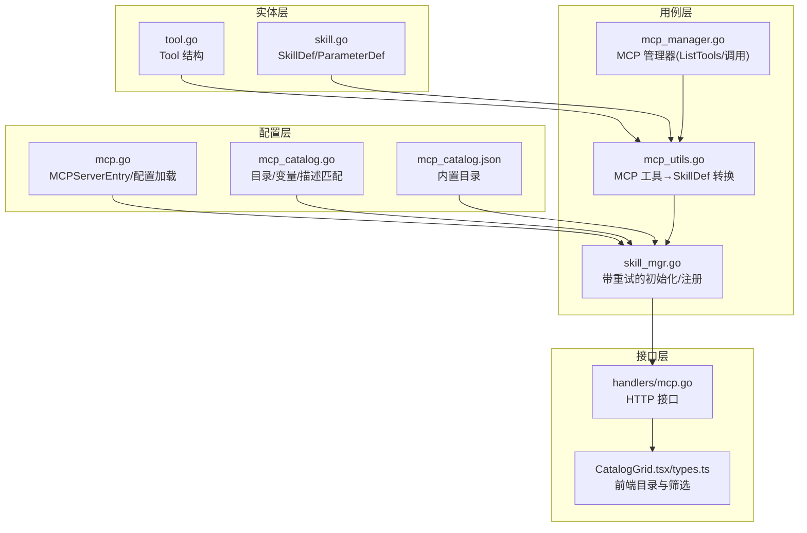
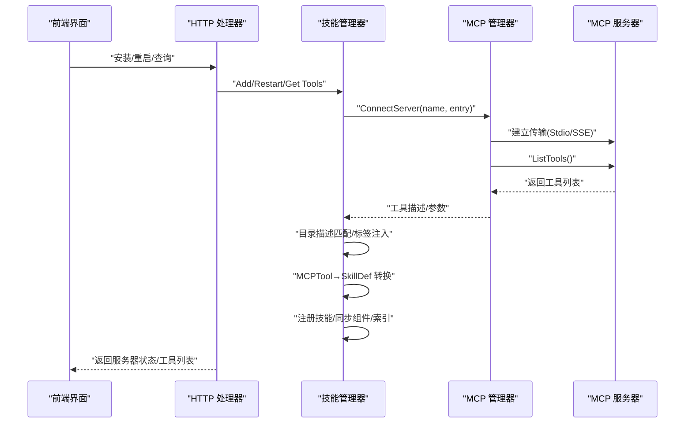
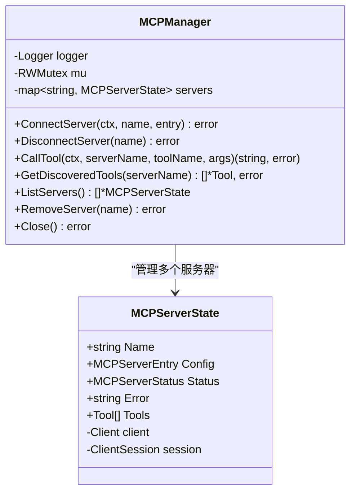
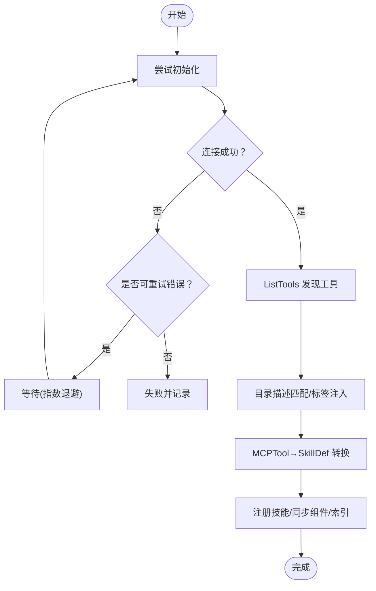
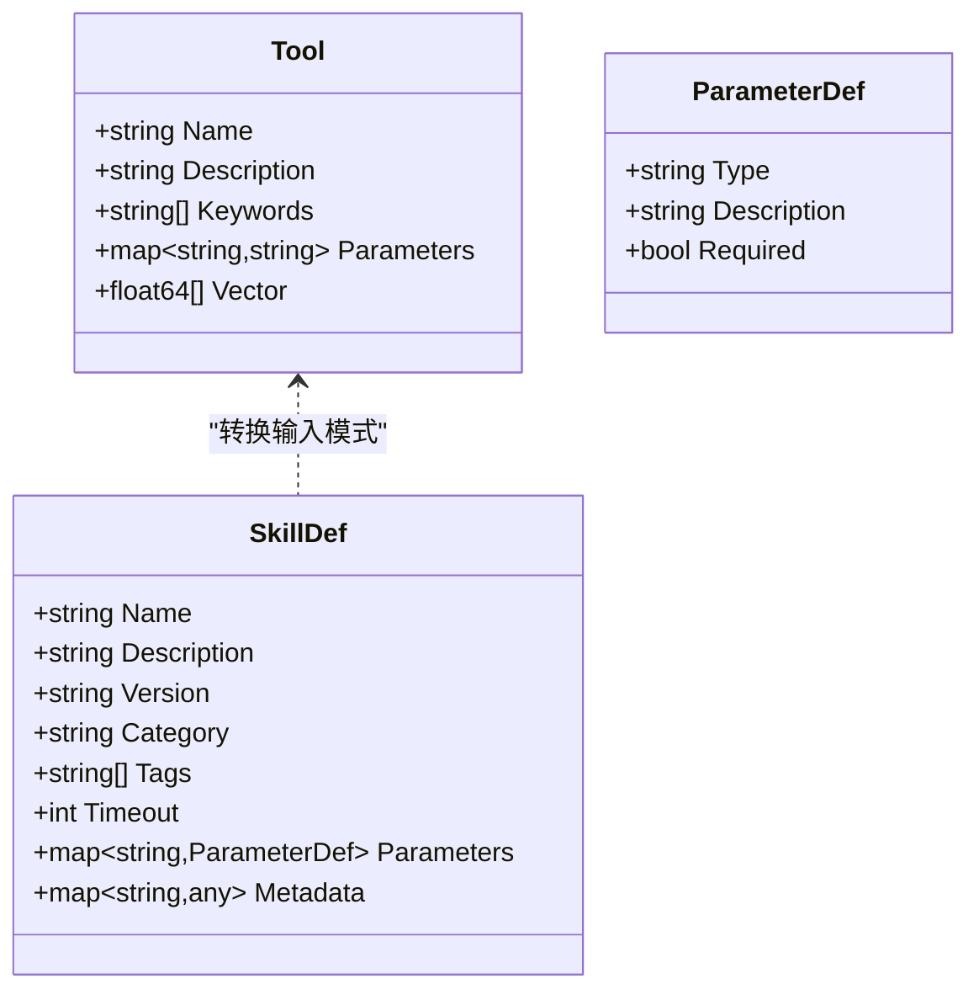
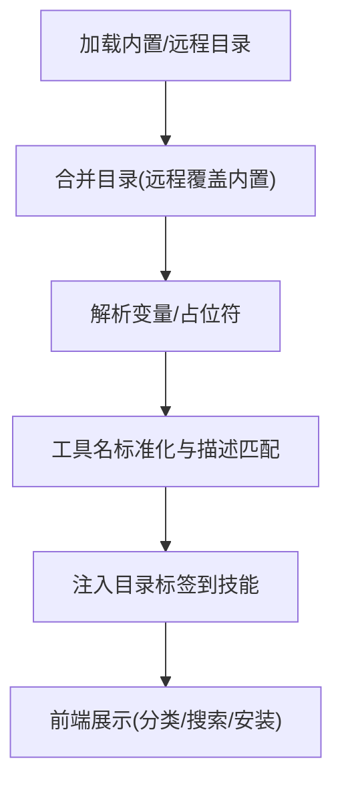
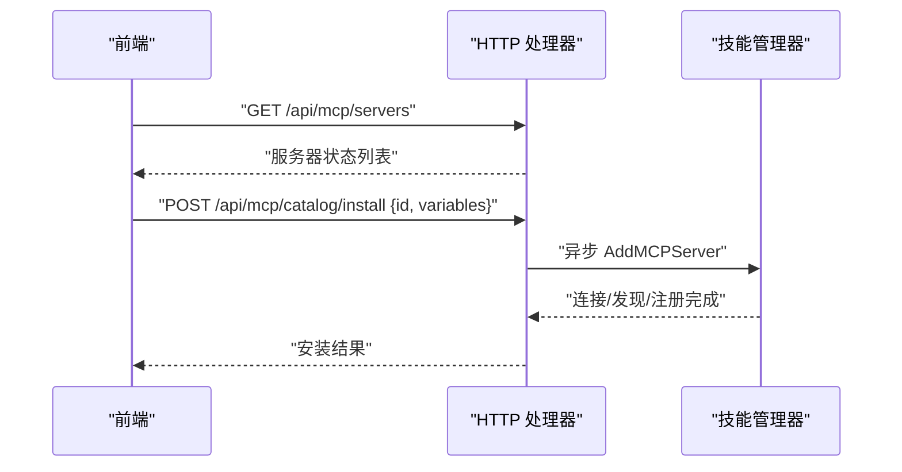
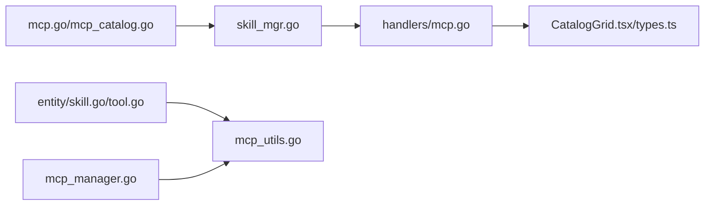

# MCP 工具发现

<cite>
**本文引用的文件**
- [internal/config/mcp.go](file://internal/config/mcp.go)
- [internal/config/mcp_catalog.go](file://internal/config/mcp_catalog.go)
- [internal/config/catalog/mcp_catalog.json](file://internal/config/catalog/mcp_catalog.json)
- [internal/entity/tool.go](file://internal/entity/tool.go)
- [internal/entity/skill.go](file://internal/entity/skill.go)
- [internal/usecase/skills/mcp_manager.go](file://internal/usecase/skills/mcp_manager.go)
- [internal/usecase/skills/mcp_utils.go](file://internal/usecase/skills/mcp_utils.go)
- [internal/usecase/skills/skill_mgr.go](file://internal/usecase/skills/skill_mgr.go)
- [internal/adapters/http/handlers/mcp.go](file://internal/adapters/http/handlers/mcp.go)
- [dashboard/src/components/mcp/CatalogGrid.tsx](file://dashboard/src/components/mcp/CatalogGrid.tsx)
- [dashboard/src/components/mcp/types.ts](file://dashboard/src/components/mcp/types.ts)
</cite>

## 目录
1. [简介](#简介)
2. [项目结构](#项目结构)
3. [核心组件](#核心组件)
4. [架构总览](#架构总览)
5. [详细组件分析](#详细组件分析)
6. [依赖分析](#依赖分析)
7. [性能考虑](#性能考虑)
8. [故障排除指南](#故障排除指南)
9. [结论](#结论)
10. [附录](#附录)

## 简介
本文件系统性阐述 MindX 中的 MCP（Model Context Protocol）工具发现机制，涵盖以下关键点：
- ListTools API 调用与工具描述解析流程
- 工具元数据结构（名称、参数、描述、返回类型等）
- 工具分类与过滤机制（目录、标签、前端筛选）
- 错误处理与重试策略
- 调试方法与故障排除

## 项目结构
围绕 MCP 工具发现的关键代码分布在如下层次：
- 配置层：MCP 服务器配置、目录与变量解析
- 实体层：工具与技能的数据模型
- 用例层：MCP 管理器、技能管理器、工具转换与索引
- 接口层：HTTP 处理器、前端组件

**图表来源**
- [internal/config/mcp.go](file://internal/config/mcp.go#L13-L80)
- [internal/config/mcp_catalog.go](file://internal/config/mcp_catalog.go#L16-L161)
- [internal/config/catalog/mcp_catalog.json](file://internal/config/catalog/mcp_catalog.json#L1-L755)
- [internal/entity/tool.go](file://internal/entity/tool.go#L4-L10)
- [internal/entity/skill.go](file://internal/entity/skill.go#L6-L49)
- [internal/usecase/skills/mcp_manager.go](file://internal/usecase/skills/mcp_manager.go#L25-L141)
- [internal/usecase/skills/mcp_utils.go](file://internal/usecase/skills/mcp_utils.go#L11-L97)
- [internal/usecase/skills/skill_mgr.go](file://internal/usecase/skills/skill_mgr.go#L404-L506)
- [internal/adapters/http/handlers/mcp.go](file://internal/adapters/http/handlers/mcp.go#L25-L181)
- [dashboard/src/components/mcp/CatalogGrid.tsx](file://dashboard/src/components/mcp/CatalogGrid.tsx#L12-L149)
- [dashboard/src/components/mcp/types.ts](file://dashboard/src/components/mcp/types.ts#L3-L46)

**章节来源**
- [internal/config/mcp.go](file://internal/config/mcp.go#L13-L80)
- [internal/config/mcp_catalog.go](file://internal/config/mcp_catalog.go#L16-L161)
- [internal/config/catalog/mcp_catalog.json](file://internal/config/catalog/mcp_catalog.json#L1-L755)
- [internal/entity/tool.go](file://internal/entity/tool.go#L4-L10)
- [internal/entity/skill.go](file://internal/entity/skill.go#L6-L49)
- [internal/usecase/skills/mcp_manager.go](file://internal/usecase/skills/mcp_manager.go#L25-L141)
- [internal/usecase/skills/mcp_utils.go](file://internal/usecase/skills/mcp_utils.go#L11-L97)
- [internal/usecase/skills/skill_mgr.go](file://internal/usecase/skills/skill_mgr.go#L404-L506)
- [internal/adapters/http/handlers/mcp.go](file://internal/adapters/http/handlers/mcp.go#L25-L181)
- [dashboard/src/components/mcp/CatalogGrid.tsx](file://dashboard/src/components/mcp/CatalogGrid.tsx#L12-L149)
- [dashboard/src/components/mcp/types.ts](file://dashboard/src/components/mcp/types.ts#L3-L46)

## 核心组件
- MCP 服务器配置与环境变量解析：支持 stdio（本地子进程）与 SSE（远端 HTTP SSE）两种传输方式，并解析 ${VAR} 占位符。
- MCP 管理器：负责连接、ListTools 发现、工具调用、状态维护。
- 技能管理器：封装带重试的初始化流程，将 MCP 工具注册为内部技能，同步组件并进行索引。
- 工具转换器：将 MCP 工具的输入模式（JSON Schema）解析为内部参数定义。
- 目录与描述匹配：从内置目录读取工具描述与标签，用于覆盖英文描述与增强检索。

**章节来源**
- [internal/config/mcp.go](file://internal/config/mcp.go#L13-L80)
- [internal/usecase/skills/mcp_manager.go](file://internal/usecase/skills/mcp_manager.go#L25-L141)
- [internal/usecase/skills/skill_mgr.go](file://internal/usecase/skills/skill_mgr.go#L404-L506)
- [internal/usecase/skills/mcp_utils.go](file://internal/usecase/skills/mcp_utils.go#L11-L97)
- [internal/config/mcp_catalog.go](file://internal/config/mcp_catalog.go#L16-L161)

## 架构总览
MCP 工具发现的端到端流程如下：

**图表来源**
- [internal/adapters/http/handlers/mcp.go](file://internal/adapters/http/handlers/mcp.go#L25-L181)
- [internal/usecase/skills/skill_mgr.go](file://internal/usecase/skills/skill_mgr.go#L404-L506)
- [internal/usecase/skills/mcp_manager.go](file://internal/usecase/skills/mcp_manager.go#L49-L141)

## 详细组件分析

### MCP 管理器（MCPManager）
职责与行为：
- 连接 MCP 服务器：支持 stdio 与 SSE 两种传输；SSE 支持自定义 headers 注入；stdio 支持命令、参数、环境变量继承与覆盖。
- 工具发现：调用 ListTools API，记录工具名称、描述与输入模式（JSON Schema）。
- 工具调用：封装 CallTool，统一错误处理与状态更新。
- 状态管理：维护连接状态、错误信息与已发现工具列表。

**图表来源**
- [internal/usecase/skills/mcp_manager.go](file://internal/usecase/skills/mcp_manager.go#L25-L141)

**章节来源**
- [internal/usecase/skills/mcp_manager.go](file://internal/usecase/skills/mcp_manager.go#L25-L141)

### 技能管理器（SkillMgr）与重试策略
- 带重试初始化：对超时类错误（如 deadline exceeded、i/o timeout、connection refused）进行最多 N 次指数退避重试。
- 不可重试错误：EOF、Method Not Allowed 等视为不可恢复，直接放弃。
- 初始化流程：连接→发现工具→目录描述匹配→标签注入→转换为 SkillDef→注册→同步组件→索引。

**图表来源**
- [internal/usecase/skills/skill_mgr.go](file://internal/usecase/skills/skill_mgr.go#L404-L468)
- [internal/usecase/skills/skill_mgr.go](file://internal/usecase/skills/skill_mgr.go#L470-L506)

**章节来源**
- [internal/usecase/skills/skill_mgr.go](file://internal/usecase/skills/skill_mgr.go#L404-L468)
- [internal/usecase/skills/skill_mgr.go](file://internal/usecase/skills/skill_mgr.go#L470-L506)

### 工具转换与元数据结构
- MCP 工具到内部技能的转换：
  - 从 InputSchema（JSON Schema）提取参数定义（类型、描述、是否必需）。
  - 生成技能名称、类别、标签（含“mcp”与服务器标识）。
  - 写入元数据，包含 server 与 tool 名称。
- 工具元数据结构：
  - 名称、描述、关键词、参数定义、向量（可选）。
- 技能元数据结构：
  - 名称、描述、版本、类别、标签、超时、命令、参数、输出格式、元数据等。

**图表来源**
- [internal/entity/tool.go](file://internal/entity/tool.go#L4-L10)
- [internal/entity/skill.go](file://internal/entity/skill.go#L6-L49)
- [internal/usecase/skills/mcp_utils.go](file://internal/usecase/skills/mcp_utils.go#L58-L97)

**章节来源**
- [internal/usecase/skills/mcp_utils.go](file://internal/usecase/skills/mcp_utils.go#L56-L97)
- [internal/entity/tool.go](file://internal/entity/tool.go#L4-L10)
- [internal/entity/skill.go](file://internal/entity/skill.go#L6-L49)

### 目录与描述匹配、分类与过滤
- 目录来源：内置目录（JSON）与可选远程目录合并，支持变量解析与占位符替换。
- 描述匹配：优先精确匹配，其次标准化（连字符与下划线差异），最后分词包含匹配。
- 标签注入：将目录中的标签合并到技能 tags，提升检索与分类效果。
- 前端过滤：按类别、关键词搜索、安装状态进行筛选与展示。

**图表来源**
- [internal/config/mcp_catalog.go](file://internal/config/mcp_catalog.go#L58-L117)
- [internal/config/mcp_catalog.go](file://internal/config/mcp_catalog.go#L119-L161)
- [internal/config/mcp_catalog.go](file://internal/config/mcp_catalog.go#L185-L251)
- [dashboard/src/components/mcp/CatalogGrid.tsx](file://dashboard/src/components/mcp/CatalogGrid.tsx#L12-L149)

**章节来源**
- [internal/config/mcp_catalog.go](file://internal/config/mcp_catalog.go#L58-L117)
- [internal/config/mcp_catalog.go](file://internal/config/mcp_catalog.go#L119-L161)
- [internal/config/mcp_catalog.go](file://internal/config/mcp_catalog.go#L185-L251)
- [dashboard/src/components/mcp/CatalogGrid.tsx](file://dashboard/src/components/mcp/CatalogGrid.tsx#L12-L149)

### HTTP 接口与前端交互
- HTTP 接口：
  - 添加/删除/重启 MCP 服务器
  - 获取服务器列表与工具列表
  - 从目录一键安装（支持变量输入）
- 前端组件：
  - 目录网格展示、分类筛选、关键词搜索、安装对话框与卸载操作。

**图表来源**
- [internal/adapters/http/handlers/mcp.go](file://internal/adapters/http/handlers/mcp.go#L25-L181)
- [internal/usecase/skills/skill_mgr.go](file://internal/usecase/skills/skill_mgr.go#L508-L514)

**章节来源**
- [internal/adapters/http/handlers/mcp.go](file://internal/adapters/http/handlers/mcp.go#L25-L181)
- [dashboard/src/components/mcp/CatalogGrid.tsx](file://dashboard/src/components/mcp/CatalogGrid.tsx#L12-L149)
- [dashboard/src/components/mcp/types.ts](file://dashboard/src/components/mcp/types.ts#L3-L46)

## 依赖分析
- 配置层依赖：
  - mcp.go 提供服务器配置结构与环境变量解析
  - mcp_catalog.go 提供目录加载、变量解析、描述匹配与标签获取
- 用例层依赖：
  - mcp_manager.go 依赖 go-sdk 的 mcp.Client 与 ClientSession
  - skill_mgr.go 依赖 mcp_manager.go 与目录工具
  - mcp_utils.go 依赖 entity.SkillDef 与参数提取逻辑
- 接口层依赖：
  - handlers/mcp.go 依赖 skill_mgr.go
  - 前端 CatalogGrid.tsx/types.ts 依赖目录类型与本地化函数

**图表来源**
- [internal/config/mcp.go](file://internal/config/mcp.go#L13-L80)
- [internal/config/mcp_catalog.go](file://internal/config/mcp_catalog.go#L16-L161)
- [internal/entity/skill.go](file://internal/entity/skill.go#L6-L49)
- [internal/entity/tool.go](file://internal/entity/tool.go#L4-L10)
- [internal/usecase/skills/mcp_utils.go](file://internal/usecase/skills/mcp_utils.go#L56-L97)
- [internal/usecase/skills/mcp_manager.go](file://internal/usecase/skills/mcp_manager.go#L25-L141)
- [internal/usecase/skills/skill_mgr.go](file://internal/usecase/skills/skill_mgr.go#L404-L506)
- [internal/adapters/http/handlers/mcp.go](file://internal/adapters/http/handlers/mcp.go#L25-L181)
- [dashboard/src/components/mcp/CatalogGrid.tsx](file://dashboard/src/components/mcp/CatalogGrid.tsx#L12-L149)
- [dashboard/src/components/mcp/types.ts](file://dashboard/src/components/mcp/types.ts#L3-L46)

**章节来源**
- [internal/config/mcp.go](file://internal/config/mcp.go#L13-L80)
- [internal/config/mcp_catalog.go](file://internal/config/mcp_catalog.go#L16-L161)
- [internal/entity/skill.go](file://internal/entity/skill.go#L6-L49)
- [internal/entity/tool.go](file://internal/entity/tool.go#L4-L10)
- [internal/usecase/skills/mcp_utils.go](file://internal/usecase/skills/mcp_utils.go#L56-L97)
- [internal/usecase/skills/mcp_manager.go](file://internal/usecase/skills/mcp_manager.go#L25-L141)
- [internal/usecase/skills/skill_mgr.go](file://internal/usecase/skills/skill_mgr.go#L404-L506)
- [internal/adapters/http/handlers/mcp.go](file://internal/adapters/http/handlers/mcp.go#L25-L181)
- [dashboard/src/components/mcp/CatalogGrid.tsx](file://dashboard/src/components/mcp/CatalogGrid.tsx#L12-L149)
- [dashboard/src/components/mcp/types.ts](file://dashboard/src/components/mcp/types.ts#L3-L46)

## 性能考虑
- 连接超时与重试：
  - stdio（npx 冷启动）采用较长超时与指数退避重试，避免频繁失败导致的资源浪费。
  - 仅对超时类错误重试，避免对不可恢复错误重复尝试。
- 工具发现与注册：
  - 发现完成后立即注册并同步组件，减少后续检索延迟。
  - 对 MCP 工具进行向量化索引（若具备 embedding/llama），提升检索效率。
- SSE 传输：
  - 自定义 headers 注入，避免每次请求重复构建客户端，降低开销。

[本节为通用性能建议，无需特定文件来源]

## 故障排除指南
常见问题与定位步骤：
- 连接失败
  - 检查服务器类型与必要字段：stdio 需要命令，SSE 需要 URL。
  - 确认环境变量解析：${VAR} 是否被正确替换。
  - 观察重试日志：是否为超时类错误，是否达到最大重试次数。
- 工具发现失败
  - 确认 MCP 服务器正常运行，ListTools 返回非空。
  - 检查目录描述匹配：是否存在对应 server 的工具描述。
- 工具调用失败
  - 检查工具名称拼写与大小写（标准化规则见描述匹配）。
  - 确认参数类型与必需字段，避免 JSON Schema 校验失败。
- 前端安装异常
  - 检查目录变量是否填写完整，必填项是否有默认值。
  - 查看 HTTP 响应错误信息与日志。

**章节来源**
- [internal/adapters/http/handlers/mcp.go](file://internal/adapters/http/handlers/mcp.go#L33-L90)
- [internal/config/mcp.go](file://internal/config/mcp.go#L82-L105)
- [internal/usecase/skills/skill_mgr.go](file://internal/usecase/skills/skill_mgr.go#L404-L468)
- [internal/usecase/skills/mcp_manager.go](file://internal/usecase/skills/mcp_manager.go#L120-L141)
- [internal/config/mcp_catalog.go](file://internal/config/mcp_catalog.go#L185-L251)

## 结论
MindX 的 MCP 工具发现机制通过清晰的分层设计实现了从服务器配置、连接发现、描述匹配、技能注册到前端展示的完整闭环。其重试策略与错误分类确保了稳定性，而目录驱动的描述与标签增强了工具的可理解性与可检索性。整体架构便于扩展新的 MCP 服务器与工具，同时为用户提供了直观的安装与管理体验。

[本节为总结性内容，无需特定文件来源]

## 附录

### ListTools API 调用与工具描述解析要点
- 调用时机：连接成功后立即执行 ListTools。
- 输入模式解析：从 JSON Schema 的 properties 与 required 字段提取参数定义。
- 描述覆盖：优先使用目录中的本地化描述，提升中文检索质量。
- 标签注入：将目录标签合并到技能 tags，增强分类与检索。

**章节来源**
- [internal/usecase/skills/mcp_manager.go](file://internal/usecase/skills/mcp_manager.go#L120-L141)
- [internal/usecase/skills/mcp_utils.go](file://internal/usecase/skills/mcp_utils.go#L56-L97)
- [internal/config/mcp_catalog.go](file://internal/config/mcp_catalog.go#L185-L251)

### 工具元数据与参数定义
- 工具元数据字段：名称、描述、关键词、参数映射、向量。
- 技能元数据字段：名称、描述、版本、类别、标签、超时、命令、参数、输出格式、元数据。
- 参数定义字段：类型、描述、是否必需。

**章节来源**
- [internal/entity/tool.go](file://internal/entity/tool.go#L4-L10)
- [internal/entity/skill.go](file://internal/entity/skill.go#L6-L49)
- [internal/usecase/skills/mcp_utils.go](file://internal/usecase/skills/mcp_utils.go#L99-L131)

### 工具分类与过滤机制
- 目录分类：category 字段用于前端分类按钮。
- 标签过滤：tags 与 keywords 用于关键词搜索。
- 前端筛选：支持按类别、关键词、安装状态过滤。

**章节来源**
- [internal/config/catalog/mcp_catalog.json](file://internal/config/catalog/mcp_catalog.json#L1-L755)
- [dashboard/src/components/mcp/CatalogGrid.tsx](file://dashboard/src/components/mcp/CatalogGrid.tsx#L12-L149)
- [dashboard/src/components/mcp/types.ts](file://dashboard/src/components/mcp/types.ts#L17-L36)

### 错误处理与重试策略
- 可重试错误：上下文超时、I/O 超时、连接拒绝。
- 不可重试错误：EOF、协议不兼容等。
- 重试策略：最多 N 次，指数退避等待，超过次数记录并跳过。

**章节来源**
- [internal/usecase/skills/skill_mgr.go](file://internal/usecase/skills/skill_mgr.go#L404-L468)
- [internal/usecase/skills/skill_mgr.go](file://internal/usecase/skills/skill_mgr.go#L470-L506)