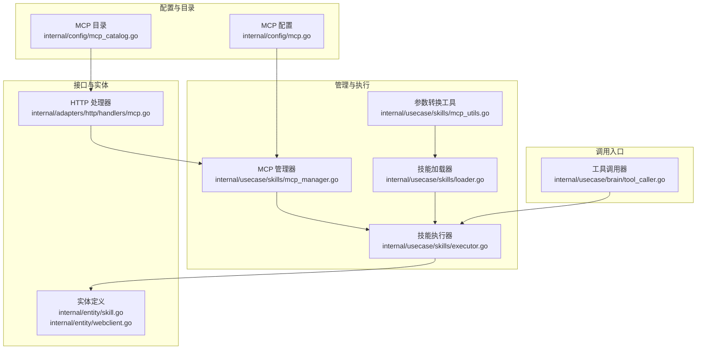
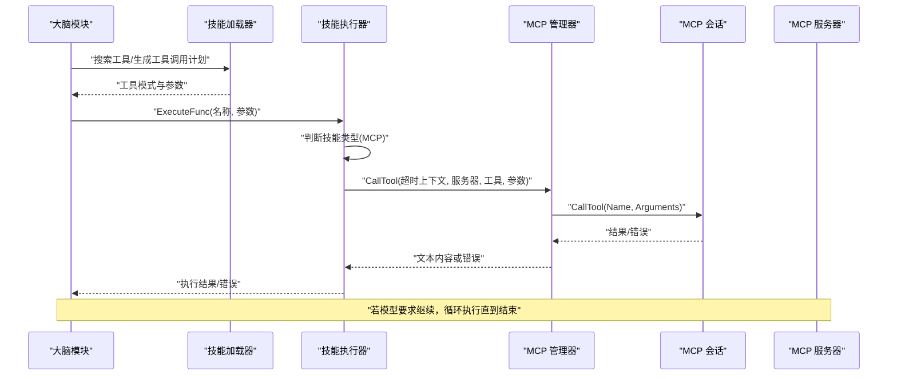
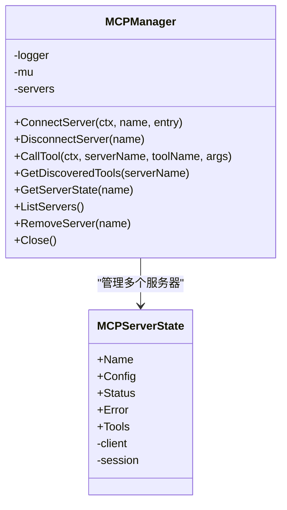
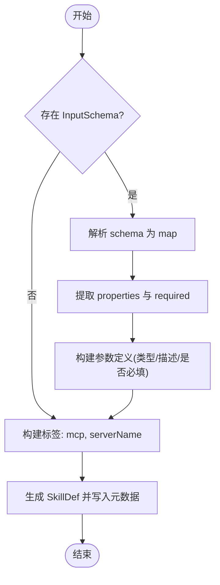
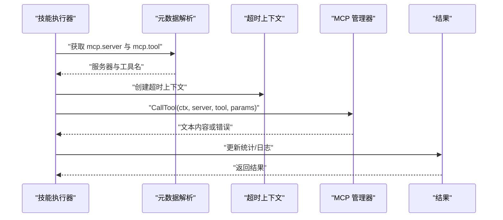
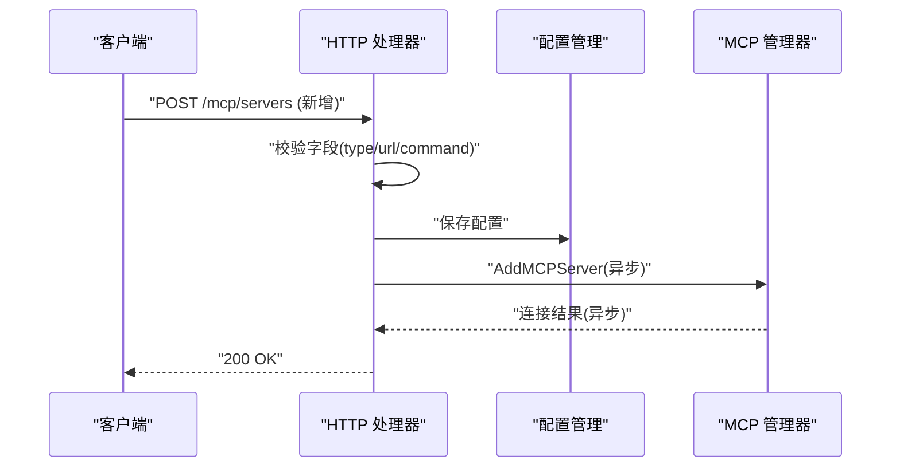
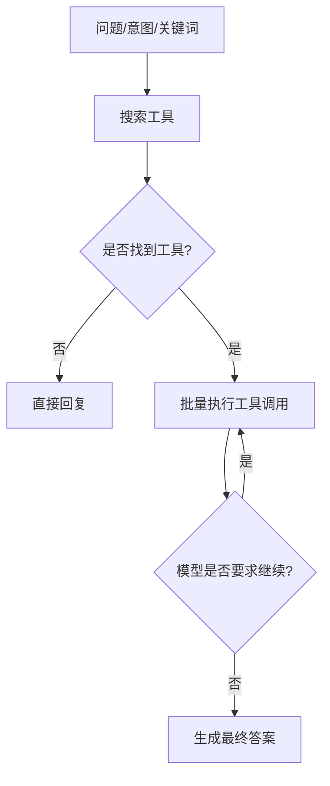
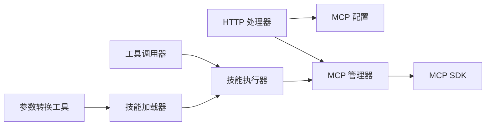

# MCP 工具调用

<cite>
**本文引用的文件**
- [mcp_manager.go](file://internal/usecase/skills/mcp_manager.go)
- [mcp_utils.go](file://internal/usecase/skills/mcp_utils.go)
- [executor.go](file://internal/usecase/skills/executor.go)
- [loader.go](file://internal/usecase/skills/loader.go)
- [mcp.go](file://internal/adapters/http/handlers/mcp.go)
- [mcp.go](file://internal/config/mcp.go)
- [mcp_catalog.go](file://internal/config/mcp_catalog.go)
- [tool_caller.go](file://internal/usecase/brain/tool_caller.go)
- [tool_execution_test.go](file://internal/usecase/brain/tool_execution_test.go)
- [integration_test.go](file://internal/tests/integration_test.go)
- [skill.go](file://internal/entity/skill.go)
- [webclient.go](file://internal/entity/webclient.go)
</cite>

## 目录
1. [简介](#简介)
2. [项目结构](#项目结构)
3. [核心组件](#核心组件)
4. [架构总览](#架构总览)
5. [详细组件分析](#详细组件分析)
6. [依赖关系分析](#依赖关系分析)
7. [性能考量](#性能考量)
8. [故障排查指南](#故障排查指南)
9. [结论](#结论)
10. [附录](#附录)

## 简介
本文件面向 MCP（Model Context Protocol）工具调用机制，系统化梳理从“工具发现、参数验证、工具查找、调用执行、结果处理”到“并发限制与队列管理”的完整流程，并给出参数转换、性能优化与错误恢复策略。文档同时提供调用示例与常见问题解决方案，帮助开发者快速理解与落地。

## 项目结构
围绕 MCP 工具调用的关键模块分布如下：
- 配置与目录：MCP 服务器配置、目录解析与变量替换
- 管理与执行：MCP 连接管理、工具调用、参数转换
- 调用入口：大脑模块的工具选择与批量执行
- HTTP 接口：MCP 服务器的增删改查与目录安装
- 测试与集成：端到端工具调用与执行链路验证

**图表来源**
- [mcp.go](file://internal/config/mcp.go#L1-L106)
- [mcp_catalog.go](file://internal/config/mcp_catalog.go#L1-L252)
- [mcp_manager.go](file://internal/usecase/skills/mcp_manager.go#L1-L292)
- [mcp_utils.go](file://internal/usecase/skills/mcp_utils.go#L1-L132)
- [executor.go](file://internal/usecase/skills/executor.go#L1-L402)
- [loader.go](file://internal/usecase/skills/loader.go#L1-L249)
- [tool_caller.go](file://internal/usecase/brain/tool_caller.go#L58-L165)
- [mcp.go](file://internal/adapters/http/handlers/mcp.go#L1-L248)
- [skill.go](file://internal/entity/skill.go#L1-L83)
- [webclient.go](file://internal/entity/webclient.go#L1-L39)

**章节来源**
- [mcp.go](file://internal/config/mcp.go#L1-L106)
- [mcp_catalog.go](file://internal/config/mcp_catalog.go#L1-L252)
- [mcp_manager.go](file://internal/usecase/skills/mcp_manager.go#L1-L292)
- [mcp_utils.go](file://internal/usecase/skills/mcp_utils.go#L1-L132)
- [executor.go](file://internal/usecase/skills/executor.go#L1-L402)
- [loader.go](file://internal/usecase/skills/loader.go#L1-L249)
- [tool_caller.go](file://internal/usecase/brain/tool_caller.go#L58-L165)
- [mcp.go](file://internal/adapters/http/handlers/mcp.go#L1-L248)
- [skill.go](file://internal/entity/skill.go#L1-L83)
- [webclient.go](file://internal/entity/webclient.go#L1-L39)

## 核心组件
- MCP 管理器：负责连接/断开 MCP 服务器、列举工具、调用工具、状态管理与错误标记
- 参数转换工具：将 MCP Tool 的 InputSchema 转换为 MindX 的 SkillDef 参数定义
- 技能执行器：根据技能类型（内置/外部/MCP）执行；对 MCP 技能设置超时并调用管理器
- 技能加载器：注册/注销 MCP 工具为技能，维护技能信息与运行状态
- HTTP 处理器：提供 MCP 服务器的增删改查、目录安装、工具列表查询等接口
- 调用入口：大脑模块根据模型输出的工具调用计划进行批量执行与继续调用

**章节来源**
- [mcp_manager.go](file://internal/usecase/skills/mcp_manager.go#L17-L47)
- [mcp_utils.go](file://internal/usecase/skills/mcp_utils.go#L11-L54)
- [executor.go](file://internal/usecase/skills/executor.go#L19-L42)
- [loader.go](file://internal/usecase/skills/loader.go#L206-L248)
- [mcp.go](file://internal/adapters/http/handlers/mcp.go#L13-L23)
- [tool_caller.go](file://internal/usecase/brain/tool_caller.go#L58-L165)

## 架构总览
MCP 工具调用的端到端流程如下：

**图表来源**
- [tool_caller.go](file://internal/usecase/brain/tool_caller.go#L58-L165)
- [executor.go](file://internal/usecase/skills/executor.go#L105-L136)
- [mcp_manager.go](file://internal/usecase/skills/mcp_manager.go#L169-L204)

## 详细组件分析

### MCP 管理器（连接、工具发现与调用）
- 连接管理
  - 支持 stdio 与 SSE 两种传输方式
  - stdio：继承父进程环境，合并用户配置的环境变量，工作目录设为用户主目录
  - SSE：支持自定义 HTTP 头部，用于认证
  - 连接后自动列举工具并记录工具名列表
- 工具调用
  - 严格校验服务器存在且已连接
  - 调用时将参数透传给 MCP 会话
  - 若发生错误，更新状态为错误并记录错误信息
  - 结果为错误时，提取文本内容并返回错误
- 状态与生命周期
  - 提供状态查询、服务器列表、移除与关闭
  - 断开连接时清理会话、客户端与工具列表

**图表来源**
- [mcp_manager.go](file://internal/usecase/skills/mcp_manager.go#L17-L47)
- [mcp_manager.go](file://internal/usecase/skills/mcp_manager.go#L25-L34)

**章节来源**
- [mcp_manager.go](file://internal/usecase/skills/mcp_manager.go#L49-L141)
- [mcp_manager.go](file://internal/usecase/skills/mcp_manager.go#L169-L204)
- [mcp_manager.go](file://internal/usecase/skills/mcp_manager.go#L217-L278)

### 参数转换与工具查找
- 参数转换
  - 将 MCP Tool 的 InputSchema 转换为 MindX 的参数定义
  - 支持 schema 为 map 或 json.RawMessage 的情况
  - 默认类型为 string，required 字段来自 required 数组
- 工具查找
  - 通过技能元数据中的 mcp.server 与 mcp.tool 字段定位目标 MCP 服务器与工具
  - 技能加载器将 MCP 工具注册为“mcp”格式的技能，便于统一调度

**图表来源**
- [mcp_utils.go](file://internal/usecase/skills/mcp_utils.go#L56-L97)
- [mcp_utils.go](file://internal/usecase/skills/mcp_utils.go#L99-L131)

**章节来源**
- [mcp_utils.go](file://internal/usecase/skills/mcp_utils.go#L16-L54)
- [mcp_utils.go](file://internal/usecase/skills/mcp_utils.go#L56-L97)
- [loader.go](file://internal/usecase/skills/loader.go#L206-L231)

### 调用执行与结果处理
- 执行路径
  - 内置技能：直接调用内部函数
  - 外部技能：构建命令、准备环境、序列化参数并通过 stdin 传入
  - MCP 技能：解析元数据、设置超时上下文、调用 MCP 管理器
- 结果处理
  - 成功：记录统计、日志输出
  - 失败：区分错误码与 JSON 输出，必要时按成功处理
- 统计与持久化
  - 更新成功/失败次数、执行时间序列、平均耗时与最后运行时间
  - 可从存储加载统计并回放

**图表来源**
- [executor.go](file://internal/usecase/skills/executor.go#L105-L136)
- [mcp_utils.go](file://internal/usecase/skills/mcp_utils.go#L33-L54)

**章节来源**
- [executor.go](file://internal/usecase/skills/executor.go#L57-L136)
- [executor.go](file://internal/usecase/skills/executor.go#L138-L195)
- [executor.go](file://internal/usecase/skills/executor.go#L266-L322)

### HTTP 接口与目录管理
- 服务器管理
  - 新增/删除/重启服务器
  - 校验 SSE/stdio 必填字段
  - 持久化到配置文件
- 目录安装
  - 从内置目录加载，支持变量解析与默认值填充
  - 异步连接服务器，避免阻塞 HTTP 响应
- 工具查询
  - 返回服务器工具列表及其输入模式

**图表来源**
- [mcp.go](file://internal/adapters/http/handlers/mcp.go#L33-L90)
- [mcp.go](file://internal/adapters/http/handlers/mcp.go#L184-L247)
- [mcp.go](file://internal/config/mcp.go#L39-L80)

**章节来源**
- [mcp.go](file://internal/adapters/http/handlers/mcp.go#L25-L136)
- [mcp.go](file://internal/adapters/http/handlers/mcp.go#L162-L247)
- [mcp.go](file://internal/config/mcp.go#L13-L80)

### 调用入口与批量执行
- 工具选择
  - 根据关键词搜索工具，生成工具模式与参数
- 批量执行
  - 循环执行工具调用，支持模型要求继续调用
  - 达到最大调用次数时停止
- 端到端验证
  - 集成测试与工具执行测试验证工具调用链路

**图表来源**
- [tool_caller.go](file://internal/usecase/brain/tool_caller.go#L58-L165)
- [tool_execution_test.go](file://internal/usecase/brain/tool_execution_test.go#L138-L174)

**章节来源**
- [tool_caller.go](file://internal/usecase/brain/tool_caller.go#L58-L165)
- [tool_execution_test.go](file://internal/usecase/brain/tool_execution_test.go#L138-L174)
- [integration_test.go](file://internal/tests/integration_test.go#L180-L215)

## 依赖关系分析
- 组件耦合
  - MCP 管理器与技能执行器通过接口解耦，执行器仅依赖元数据解析与超时控制
  - HTTP 处理器与配置模块交互，实现服务器配置的持久化与目录安装
- 外部依赖
  - 使用 MCP SDK 进行连接与工具调用
  - 使用 Gin 作为 HTTP 框架
- 潜在风险
  - SSE 认证头注入需谨慎，避免泄露敏感信息
  - stdio 子进程环境变量合并需注意覆盖顺序

**图表来源**
- [mcp.go](file://internal/adapters/http/handlers/mcp.go#L1-L248)
- [mcp.go](file://internal/config/mcp.go#L1-L106)
- [mcp_manager.go](file://internal/usecase/skills/mcp_manager.go#L1-L292)
- [executor.go](file://internal/usecase/skills/executor.go#L1-L402)
- [loader.go](file://internal/usecase/skills/loader.go#L1-L249)
- [mcp_utils.go](file://internal/usecase/skills/mcp_utils.go#L1-L132)
- [tool_caller.go](file://internal/usecase/brain/tool_caller.go#L58-L165)

**章节来源**
- [mcp.go](file://internal/adapters/http/handlers/mcp.go#L1-L248)
- [mcp_manager.go](file://internal/usecase/skills/mcp_manager.go#L1-L292)
- [executor.go](file://internal/usecase/skills/executor.go#L1-L402)
- [loader.go](file://internal/usecase/skills/loader.go#L1-L249)
- [mcp_utils.go](file://internal/usecase/skills/mcp_utils.go#L1-L132)
- [tool_caller.go](file://internal/usecase/brain/tool_caller.go#L58-L165)

## 性能考量
- 超时控制
  - MCP 技能默认超时 30 秒，可通过技能定义覆盖
  - 执行器在每次调用前创建带超时的上下文，避免阻塞
- 并发与队列
  - 当前实现未显式引入并发队列；工具调用以批量顺序执行为主
  - 可通过外部限流或熔断器（如电路 breaker）在上层控制并发
- 日志与可观测性
  - 执行器记录每次调用的耗时、成功/失败状态，便于性能分析
  - Web 客户端事件类型可用于前端实时反馈

**章节来源**
- [executor.go](file://internal/usecase/skills/executor.go#L117-L122)
- [executor.go](file://internal/usecase/skills/executor.go#L266-L322)
- [webclient.go](file://internal/entity/webclient.go#L21-L38)

## 故障排查指南
- 连接失败
  - 检查服务器类型与必填字段（SSE 需 url，stdio 需 command）
  - 确认环境变量解析与工作目录设置
- 工具不可用
  - 确认服务器已连接且状态为 connected
  - 使用工具列表接口核对工具名
- 调用错误
  - 若 MCP 返回错误，管理器会记录错误并标记状态
  - 执行器会区分错误码与 JSON 输出，必要时按成功处理
- 参数问题
  - 确认参数类型与必填项符合 InputSchema
  - 对于外部技能，确认 stdin 序列化参数正确

**章节来源**
- [mcp.go](file://internal/adapters/http/handlers/mcp.go#L57-L69)
- [mcp_manager.go](file://internal/usecase/skills/mcp_manager.go#L170-L204)
- [executor.go](file://internal/usecase/skills/executor.go#L127-L131)
- [mcp_utils.go](file://internal/usecase/skills/mcp_utils.go#L99-L131)

## 结论
MCP 工具调用机制通过“配置驱动 + 管理器 + 执行器 + 目录”的组合，实现了从服务器连接、工具发现、参数转换到调用执行与结果处理的闭环。当前实现强调稳定性与可观测性，后续可在并发控制、队列管理与熔断策略方面进一步增强。

## 附录

### 调用示例（步骤说明）
- 新增 MCP 服务器（SSE）
  - 使用 HTTP 接口新增服务器，填写 type=url/headers/env 等字段
  - 服务器配置持久化后异步连接
- 安装目录工具
  - 从目录加载并解析变量，保存配置后异步连接
- 执行工具
  - 大脑模块根据关键词搜索工具并生成调用计划
  - 执行器按顺序调用，支持模型要求继续调用

**章节来源**
- [mcp.go](file://internal/adapters/http/handlers/mcp.go#L33-L90)
- [mcp.go](file://internal/adapters/http/handlers/mcp.go#L184-L247)
- [tool_caller.go](file://internal/usecase/brain/tool_caller.go#L58-L165)