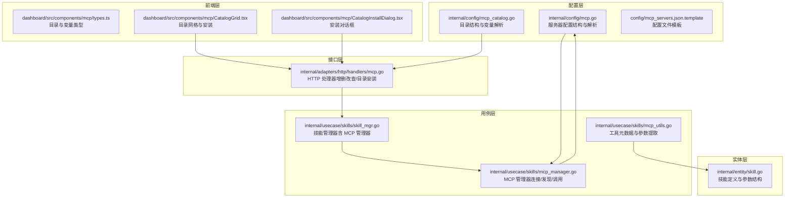
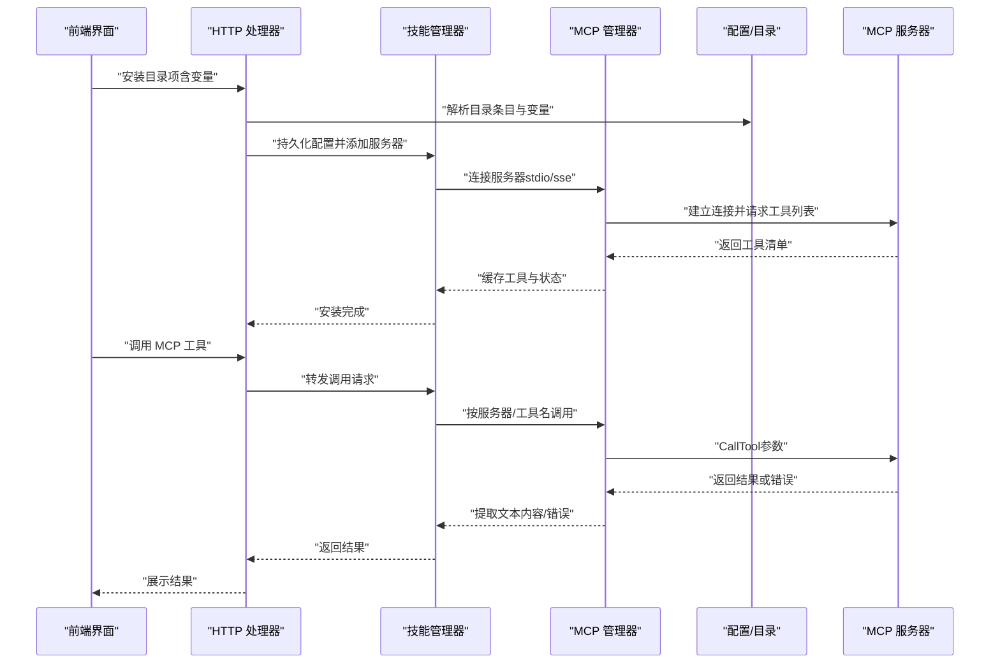
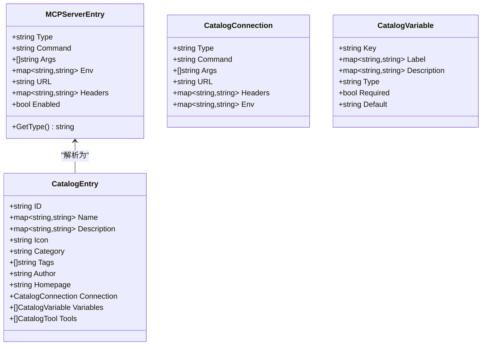
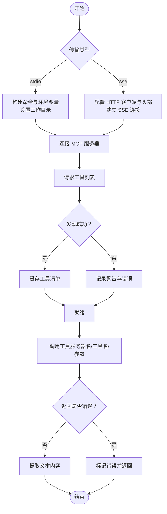
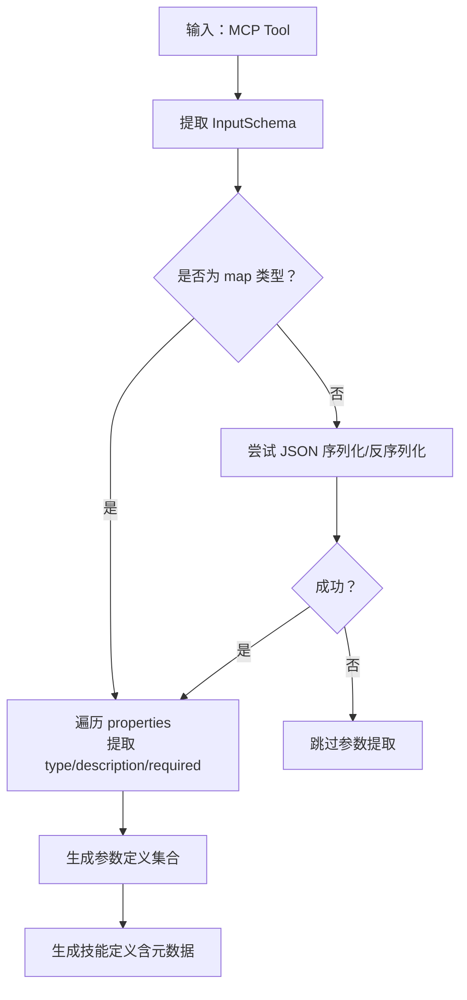
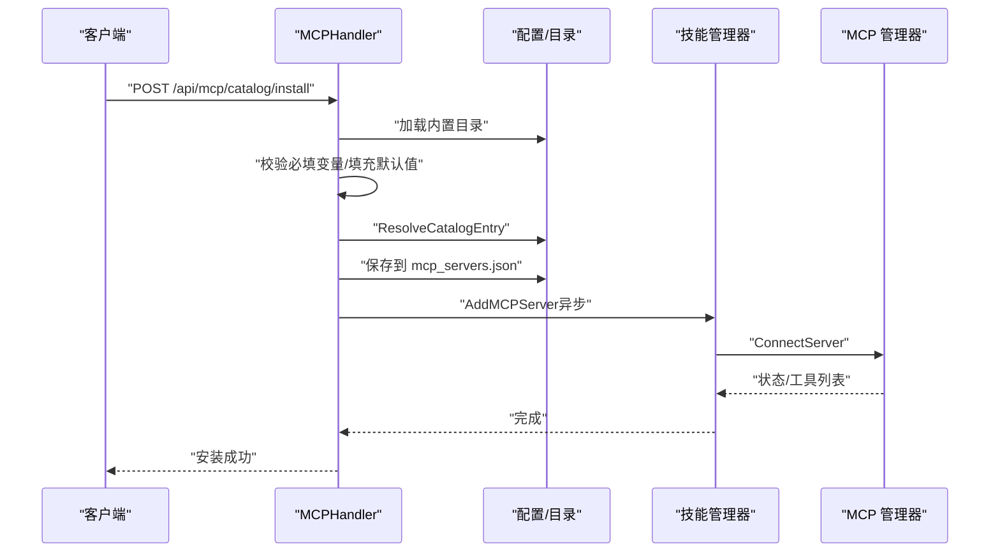
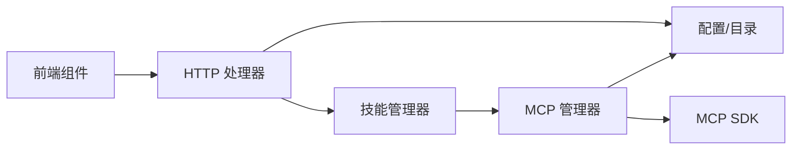

# MCP 工具集成

<cite>
**本文引用的文件**
- [internal/config/mcp.go](file://internal/config/mcp.go)
- [internal/config/mcp_catalog.go](file://internal/config/mcp_catalog.go)
- [internal/usecase/skills/mcp_manager.go](file://internal/usecase/skills/mcp_manager.go)
- [internal/usecase/skills/mcp_utils.go](file://internal/usecase/skills/mcp_utils.go)
- [internal/usecase/skills/skill_mgr.go](file://internal/usecase/skills/skill_mgr.go)
- [internal/adapters/http/handlers/mcp.go](file://internal/adapters/http/handlers/mcp.go)
- [dashboard/src/components/mcp/types.ts](file://dashboard/src/components/mcp/types.ts)
- [dashboard/src/components/mcp/CatalogGrid.tsx](file://dashboard/src/components/mcp/CatalogGrid.tsx)
- [dashboard/src/components/mcp/CatalogInstallDialog.tsx](file://dashboard/src/components/mcp/CatalogInstallDialog.tsx)
- [internal/entity/skill.go](file://internal/entity/skill.go)
- [config/mcp_servers.json.template](file://config/mcp_servers.json.template)
- [README.md](file://README.md)
</cite>

## 目录
1. [简介](#简介)
2. [项目结构](#项目结构)
3. [核心组件](#核心组件)
4. [架构总览](#架构总览)
5. [组件详解](#组件详解)
6. [依赖关系分析](#依赖关系分析)
7. [性能考量](#性能考量)
8. [故障排查指南](#故障排查指南)
9. [结论](#结论)
10. [附录](#附录)

## 简介
本文件面向 MCP（Model Context Protocol）工具在 MindX 技能系统中的集成与使用，涵盖以下主题：
- MCP 工具的发现、注册与调用机制
- 工具参数定义与校验（类型、必填、默认值）
- 工具调用执行流程（参数转换、结果处理、错误传播）
- MCP 工具与内置技能的差异与适用场景
- MCP 工具开发与集成最佳实践（设计原则、性能优化、调试技巧）

MindX 通过 MCP 协议支持本地或远程工具服务器，将外部能力无缝纳入技能系统，并与内置技能共享同一执行与检索框架。

**章节来源**
- [README.md](file://README.md#L48-L52)

## 项目结构
围绕 MCP 工具集成的关键目录与文件如下：
- 配置层：MCP 服务器配置、目录（Catalog）与变量解析
- 用例层：MCP 管理器（连接、工具发现、调用）、工具元数据与参数提取
- 接口层：HTTP 处理器（增删改查、目录安装、工具列表）
- 前端层：MCP 目录展示、安装对话框、变量收集
- 实体层：技能定义与参数结构

**图表来源**
- [internal/config/mcp.go](file://internal/config/mcp.go#L13-L29)
- [internal/config/mcp_catalog.go](file://internal/config/mcp_catalog.go#L21-L56)
- [internal/usecase/skills/mcp_manager.go](file://internal/usecase/skills/mcp_manager.go#L36-L47)
- [internal/usecase/skills/mcp_utils.go](file://internal/usecase/skills/mcp_utils.go#L11-L14)
- [internal/usecase/skills/skill_mgr.go](file://internal/usecase/skills/skill_mgr.go#L20-L34)
- [internal/adapters/http/handlers/mcp.go](file://internal/adapters/http/handlers/mcp.go#L13-L23)
- [dashboard/src/components/mcp/types.ts](file://dashboard/src/components/mcp/types.ts#L3-L36)
- [dashboard/src/components/mcp/CatalogGrid.tsx](file://dashboard/src/components/mcp/CatalogGrid.tsx#L12-L149)
- [dashboard/src/components/mcp/CatalogInstallDialog.tsx](file://dashboard/src/components/mcp/CatalogInstallDialog.tsx#L11-L62)
- [internal/entity/skill.go](file://internal/entity/skill.go#L5-L25)

**章节来源**
- [internal/config/mcp.go](file://internal/config/mcp.go#L1-L106)
- [internal/config/mcp_catalog.go](file://internal/config/mcp_catalog.go#L1-L252)
- [internal/usecase/skills/mcp_manager.go](file://internal/usecase/skills/mcp_manager.go#L1-L292)
- [internal/usecase/skills/mcp_utils.go](file://internal/usecase/skills/mcp_utils.go#L1-L132)
- [internal/usecase/skills/skill_mgr.go](file://internal/usecase/skills/skill_mgr.go#L1-L200)
- [internal/adapters/http/handlers/mcp.go](file://internal/adapters/http/handlers/mcp.go#L1-L248)
- [dashboard/src/components/mcp/types.ts](file://dashboard/src/components/mcp/types.ts#L1-L47)
- [dashboard/src/components/mcp/CatalogGrid.tsx](file://dashboard/src/components/mcp/CatalogGrid.tsx#L1-L150)
- [dashboard/src/components/mcp/CatalogInstallDialog.tsx](file://dashboard/src/components/mcp/CatalogInstallDialog.tsx#L1-L63)
- [internal/entity/skill.go](file://internal/entity/skill.go#L1-L83)
- [config/mcp_servers.json.template](file://config/mcp_servers.json.template#L1-L4)

## 核心组件
- MCP 服务器配置与解析：定义服务器类型（本地 stdio 或远程 SSE）、命令行参数、环境变量、HTTP 头部等；支持环境变量占位符解析。
- MCP 目录（Catalog）：内置目录条目包含连接信息、变量定义、工具清单；支持远程目录合并与变量替换。
- MCP 管理器：负责连接 MCP 服务器、发现工具、调用工具、维护状态与错误信息。
- MCP 工具元数据与参数提取：将 MCP Tool 的输入模式（JSON Schema）转换为 MindX 技能定义，自动识别参数类型、必填项与描述。
- 技能管理器：整合 MCP 管理器，统一管理内置与 MCP 技能，参与检索与执行。
- HTTP 处理器：提供 MCP 服务器的增删改查、目录安装、工具列表查询等 API。
- 前端组件：目录网格展示、变量收集与安装流程。

**章节来源**
- [internal/config/mcp.go](file://internal/config/mcp.go#L13-L106)
- [internal/config/mcp_catalog.go](file://internal/config/mcp_catalog.go#L21-L161)
- [internal/usecase/skills/mcp_manager.go](file://internal/usecase/skills/mcp_manager.go#L17-L292)
- [internal/usecase/skills/mcp_utils.go](file://internal/usecase/skills/mcp_utils.go#L11-L132)
- [internal/usecase/skills/skill_mgr.go](file://internal/usecase/skills/skill_mgr.go#L20-L84)
- [internal/adapters/http/handlers/mcp.go](file://internal/adapters/http/handlers/mcp.go#L13-L248)
- [dashboard/src/components/mcp/types.ts](file://dashboard/src/components/mcp/types.ts#L3-L36)
- [dashboard/src/components/mcp/CatalogGrid.tsx](file://dashboard/src/components/mcp/CatalogGrid.tsx#L12-L149)
- [dashboard/src/components/mcp/CatalogInstallDialog.tsx](file://dashboard/src/components/mcp/CatalogInstallDialog.tsx#L11-L62)

## 架构总览
下图展示了 MCP 工具从“目录安装”到“工具调用”的整体流程，以及各组件之间的交互关系。

**图表来源**
- [internal/adapters/http/handlers/mcp.go](file://internal/adapters/http/handlers/mcp.go#L183-L247)
- [internal/usecase/skills/skill_mgr.go](file://internal/usecase/skills/skill_mgr.go#L40-L62)
- [internal/usecase/skills/mcp_manager.go](file://internal/usecase/skills/mcp_manager.go#L49-L141)
- [internal/config/mcp_catalog.go](file://internal/config/mcp_catalog.go#L119-L161)

## 组件详解

### MCP 服务器配置与目录
- 服务器配置结构支持两种传输方式：
  - stdio：本地子进程，支持命令、参数、环境变量覆盖与工作目录设置
  - sse：远程 HTTP SSE，支持 URL 与自定义头部，头部中的环境变量占位符可被解析
- 目录条目包含连接信息、变量定义（键、标签、描述、类型、是否必填、默认值）、工具清单与分类信息
- 变量解析：支持 ${VAR} 占位符，优先使用用户提供的变量，否则回退到系统环境变量

**图表来源**
- [internal/config/mcp.go](file://internal/config/mcp.go#L17-L29)
- [internal/config/mcp_catalog.go](file://internal/config/mcp_catalog.go#L21-L56)
- [internal/config/mcp_catalog.go](file://internal/config/mcp_catalog.go#L119-L161)

**章节来源**
- [internal/config/mcp.go](file://internal/config/mcp.go#L17-L106)
- [internal/config/mcp_catalog.go](file://internal/config/mcp_catalog.go#L21-L161)

### MCP 管理器：连接、发现与调用
- 连接服务器：根据类型选择 stdio 或 SSE 传输；SSE 支持自定义 HTTP 客户端与头部注入；stdio 支持继承并覆盖环境变量、设置工作目录
- 工具发现：连接成功后调用 ListTools 获取工具清单，记录工具名称与描述
- 工具调用：按服务器名与工具名调用，将参数透传给 MCP 服务器；对返回内容进行错误判断与文本提取
- 状态管理：维护连接状态、错误信息与工具列表；提供查询与清理接口

**图表来源**
- [internal/usecase/skills/mcp_manager.go](file://internal/usecase/skills/mcp_manager.go#L49-L141)
- [internal/usecase/skills/mcp_manager.go](file://internal/usecase/skills/mcp_manager.go#L169-L204)

**章节来源**
- [internal/usecase/skills/mcp_manager.go](file://internal/usecase/skills/mcp_manager.go#L17-L292)

### MCP 工具元数据与参数提取
- 元数据识别：通过技能定义中的 metadata 字段识别 MCP 技能，包含 server 与 tool
- 参数提取：从 MCP Tool 的输入模式（JSON Schema）中提取参数类型、描述与必填信息；若输入模式为非 map 类型，尝试序列化后再解析
- 技能定义生成：将 MCP 工具转换为 MindX 技能定义，设置名称、描述、标签、超时、参数与元数据

**图表来源**
- [internal/usecase/skills/mcp_utils.go](file://internal/usecase/skills/mcp_utils.go#L56-L97)
- [internal/usecase/skills/mcp_utils.go](file://internal/usecase/skills/mcp_utils.go#L99-L131)

**章节来源**
- [internal/usecase/skills/mcp_utils.go](file://internal/usecase/skills/mcp_utils.go#L11-L132)
- [internal/entity/skill.go](file://internal/entity/skill.go#L44-L49)

### 技能管理器与 MCP 集成
- 技能管理器持有 MCP 管理器实例，初始化时注入到执行器中，使执行器能够调用 MCP 工具
- 技能同步：在加载技能与索引时，同步组件状态，确保 MCP 工具与内置技能在同一检索与执行体系中

**章节来源**
- [internal/usecase/skills/skill_mgr.go](file://internal/usecase/skills/skill_mgr.go#L40-L62)
- [internal/usecase/skills/skill_mgr.go](file://internal/usecase/skills/skill_mgr.go#L87-L98)

### HTTP 处理器：服务器管理与目录安装
- 服务器管理：新增、删除、重启服务器；校验必填字段（SSE 需 URL，stdio 需 command）
- 目录安装：从内置目录中查找条目，校验必填变量（使用默认值填充），解析为 MCPServerEntry 并持久化；异步尝试连接
- 工具查询：返回指定服务器的工具清单（名称、描述、输入模式）

**图表来源**
- [internal/adapters/http/handlers/mcp.go](file://internal/adapters/http/handlers/mcp.go#L183-L247)
- [internal/config/mcp_catalog.go](file://internal/config/mcp_catalog.go#L119-L161)

**章节来源**
- [internal/adapters/http/handlers/mcp.go](file://internal/adapters/http/handlers/mcp.go#L33-L136)
- [internal/adapters/http/handlers/mcp.go](file://internal/adapters/http/handlers/mcp.go#L162-L247)
- [internal/config/mcp_catalog.go](file://internal/config/mcp_catalog.go#L119-L161)

### 前端组件：目录与安装
- 目录网格：支持按名称、描述、标签搜索与按分类筛选；点击安装触发安装流程
- 安装对话框：渲染目录项变量（类型、是否必填、默认值），收集用户输入后发起安装请求
- 未安装项：显示安装按钮；已安装项：显示卸载按钮

**章节来源**
- [dashboard/src/components/mcp/CatalogGrid.tsx](file://dashboard/src/components/mcp/CatalogGrid.tsx#L12-L149)
- [dashboard/src/components/mcp/CatalogInstallDialog.tsx](file://dashboard/src/components/mcp/CatalogInstallDialog.tsx#L11-L62)
- [dashboard/src/components/mcp/types.ts](file://dashboard/src/components/mcp/types.ts#L3-L36)

## 依赖关系分析
- MCP 管理器依赖配置层（MCPServerEntry、环境变量解析）与 MCP SDK
- 技能管理器依赖 MCP 管理器，以便在执行阶段调用 MCP 工具
- HTTP 处理器依赖技能管理器与配置层（目录解析）
- 前端组件依赖 HTTP 处理器与类型定义

**图表来源**
- [internal/usecase/skills/mcp_manager.go](file://internal/usecase/skills/mcp_manager.go#L14)
- [internal/usecase/skills/skill_mgr.go](file://internal/usecase/skills/skill_mgr.go#L33)
- [internal/adapters/http/handlers/mcp.go](file://internal/adapters/http/handlers/mcp.go#L5-L11)

**章节来源**
- [internal/usecase/skills/mcp_manager.go](file://internal/usecase/skills/mcp_manager.go#L1-L292)
- [internal/usecase/skills/skill_mgr.go](file://internal/usecase/skills/skill_mgr.go#L1-L200)
- [internal/adapters/http/handlers/mcp.go](file://internal/adapters/http/handlers/mcp.go#L1-L248)

## 性能考量
- 连接与发现：SSE 连接与工具发现发生在服务器连接阶段，建议合理设置超时与重试策略，避免阻塞主线程
- 参数提取：JSON Schema 解析为 O(n) 操作，通常开销较小；注意避免重复解析大型模式
- 结果处理：仅提取文本内容，减少不必要的数据转换；错误路径及时标记状态，防止后续无效调用
- 并发与锁：MCP 管理器内部使用读写锁保护服务器状态，避免竞态条件
- 前端安装：安装请求采用异步连接，避免阻塞 UI 响应

[本节为通用性能建议，不直接分析具体文件]

## 故障排查指南
- 连接失败
  - 检查服务器类型与必填字段（SSE 需 URL，stdio 需 command）
  - 校验环境变量与工作目录设置是否正确
  - 查看日志中的错误信息与状态标记
- 工具调用失败
  - 确认服务器已连接且状态为已连接
  - 检查参数是否符合工具输入模式（类型、必填、范围）
  - 关注返回的错误内容并定位到具体工具
- 目录安装失败
  - 校验必填变量是否提供或默认值是否有效
  - 确认目录条目 ID 存在且解析成功
  - 检查配置持久化是否成功

**章节来源**
- [internal/adapters/http/handlers/mcp.go](file://internal/adapters/http/handlers/mcp.go#L57-L69)
- [internal/usecase/skills/mcp_manager.go](file://internal/usecase/skills/mcp_manager.go#L106-L114)
- [internal/usecase/skills/mcp_manager.go](file://internal/usecase/skills/mcp_manager.go#L190-L197)

## 结论
MindX 通过 MCP 协议实现了对外部工具能力的统一接入，具备以下优势：
- 与内置技能共享同一执行与检索框架，实现“本地/外部技能无感切换”
- 支持目录化安装与变量管理，简化工具部署与配置
- 提供完善的参数提取与元数据映射，便于在技能系统中统一管理

在选择 MCP 工具与内置技能时，建议：
- 对于需要外部系统能力（如第三方 API、本地 CLI 工具）的任务，优先使用 MCP 工具
- 对于通用、高频、低延迟的本地能力，优先使用内置技能
- 对于复杂参数与严格输入约束的场景，利用 MCP 输入模式与参数提取提升一致性与可维护性

[本节为总结性内容，不直接分析具体文件]

## 附录

### MCP 工具参数定义与验证要点
- 参数类型：从 JSON Schema 的属性类型推导，默认字符串类型
- 必填项：依据 required 列表判定
- 默认值：目录变量支持默认值，安装时可自动填充
- 输入校验：HTTP 层对必填字段进行校验；MCP 层由工具自身校验参数有效性

**章节来源**
- [internal/usecase/skills/mcp_utils.go](file://internal/usecase/skills/mcp_utils.go#L99-L131)
- [internal/config/mcp_catalog.go](file://internal/config/mcp_catalog.go#L44-L51)
- [internal/adapters/http/handlers/mcp.go](file://internal/adapters/http/handlers/mcp.go#L57-L69)

### MCP 工具调用执行流程（步骤化）
- 参数准备：前端收集变量与参数，后端解析为 MCPServerEntry 与调用参数
- 连接与发现：连接服务器并获取工具清单
- 工具调用：按服务器名与工具名调用，传递参数
- 结果处理：提取文本内容；若返回错误，记录错误并传播
- 状态维护：更新服务器状态与错误信息

**章节来源**
- [internal/adapters/http/handlers/mcp.go](file://internal/adapters/http/handlers/mcp.go#L183-L247)
- [internal/usecase/skills/mcp_manager.go](file://internal/usecase/skills/mcp_manager.go#L169-L204)

### MCP 工具与内置技能对比
- MCP 工具
  - 来源：外部 MCP 服务器，支持本地 CLI 或远程 SSE
  - 参数：来自工具输入模式（JSON Schema），自动映射为技能定义
  - 优点：生态丰富、能力边界可扩展、统一协议
- 内置技能
  - 来源：项目内置脚本与逻辑
  - 参数：在技能定义中显式声明
  - 优点：低延迟、易调试、与系统耦合度高

**章节来源**
- [README.md](file://README.md#L48-L52)
- [internal/entity/skill.go](file://internal/entity/skill.go#L44-L49)

### MCP 工具开发与集成最佳实践
- 设计原则
  - 明确定义输入模式（JSON Schema），确保参数类型与必填项清晰
  - 提供良好的错误信息与输出格式，便于上层统一处理
- 性能优化
  - 合理设置超时与重试；避免在工具中执行长时间阻塞操作
  - 减少不必要的数据转换，优先返回结构化文本
- 调试技巧
  - 使用前端目录安装功能，逐步验证变量与连接
  - 关注日志中的状态变化与错误信息，定位问题根因
  - 在本地 stdio 模式下进行快速迭代，再迁移到 SSE

[本节为通用实践建议，不直接分析具体文件]