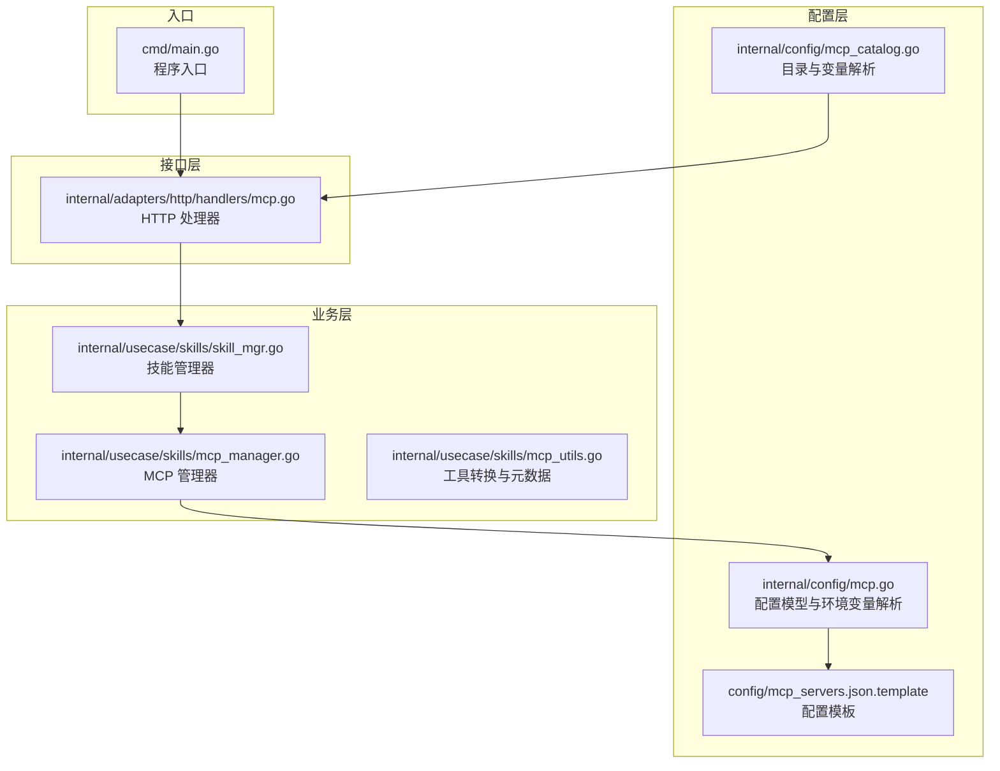
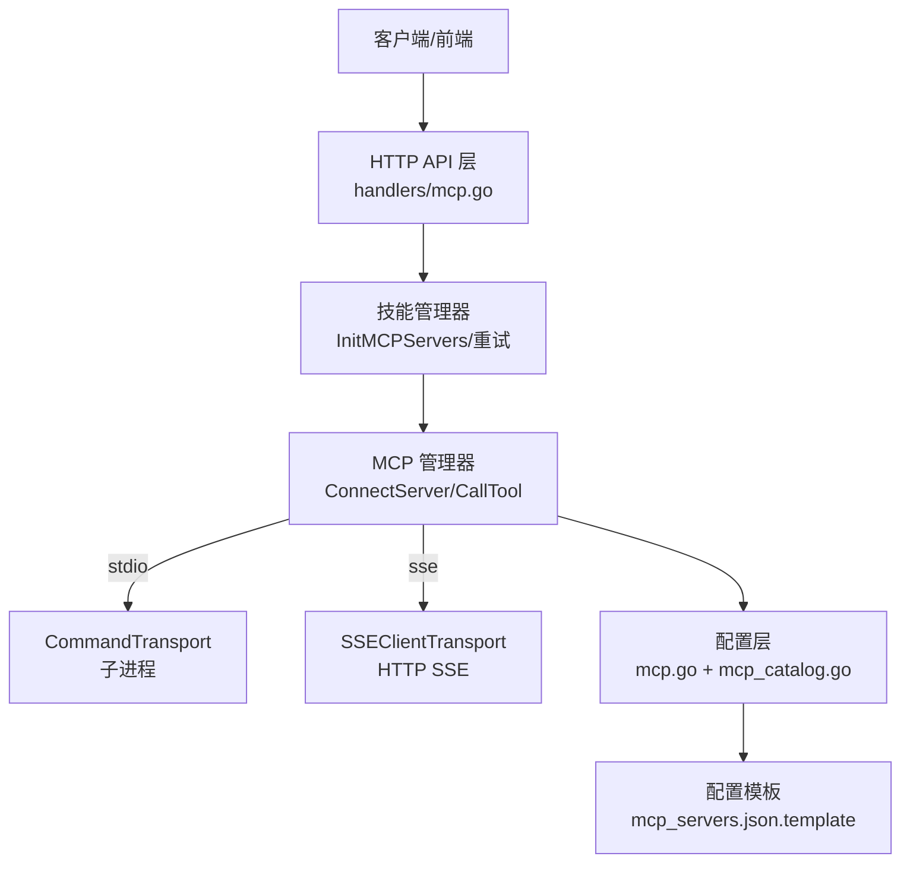
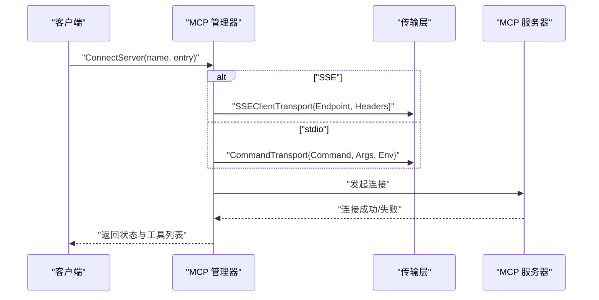
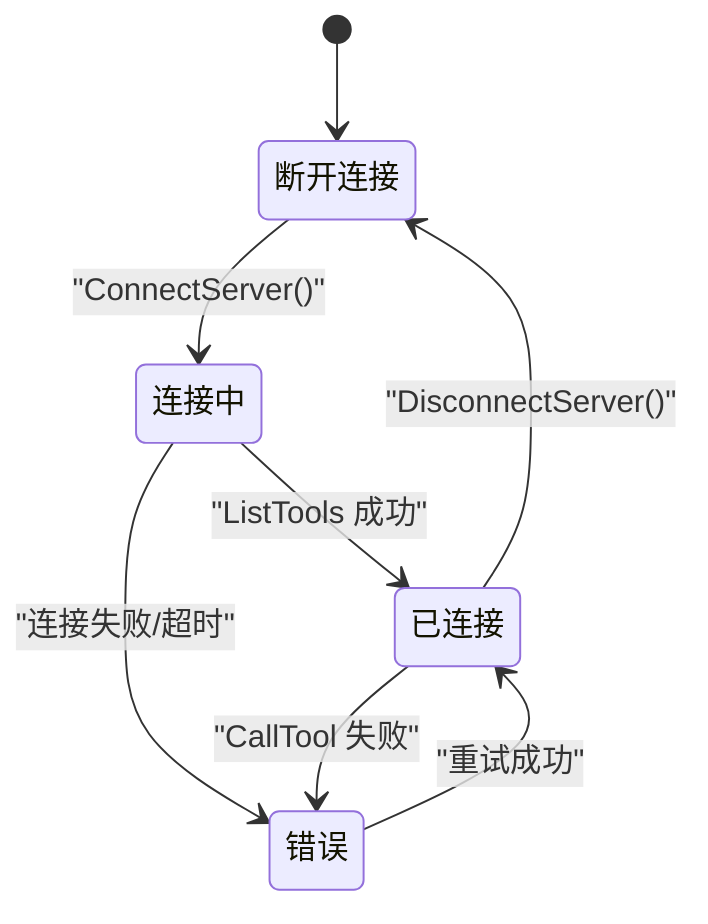
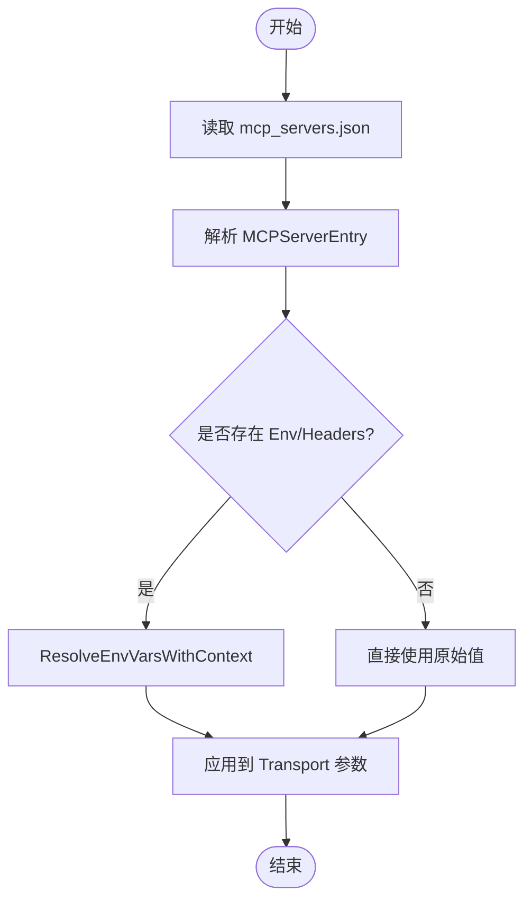
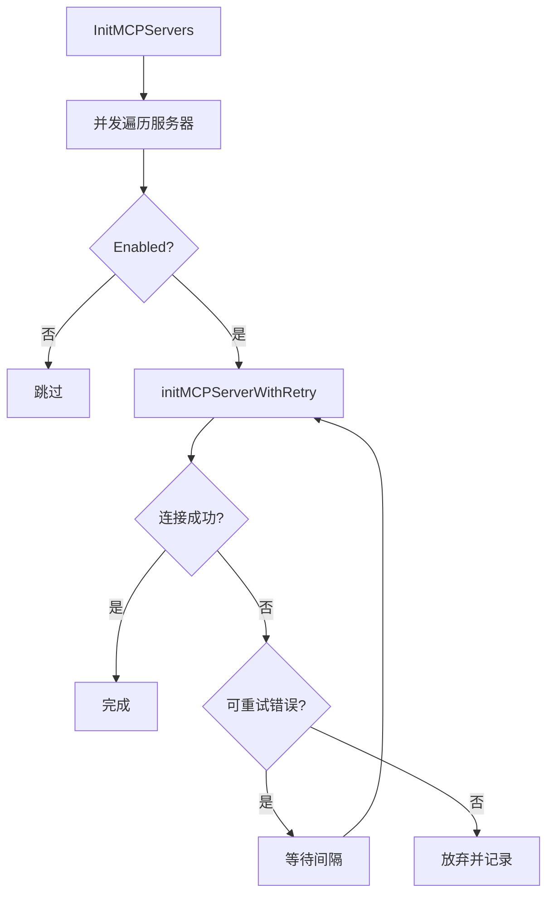
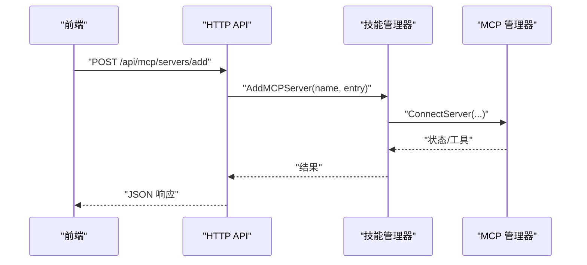

# MCP 服务器管理

<cite>
**本文档引用的文件**
- [cmd/main.go](file://cmd/main.go)
- [internal/config/mcp.go](file://internal/config/mcp.go)
- [internal/config/mcp_catalog.go](file://internal/config/mcp_catalog.go)
- [internal/usecase/skills/mcp_manager.go](file://internal/usecase/skills/mcp_manager.go)
- [internal/usecase/skills/skill_mgr.go](file://internal/usecase/skills/skill_mgr.go)
- [internal/usecase/skills/mcp_utils.go](file://internal/usecase/skills/mcp_utils.go)
- [internal/adapters/http/handlers/mcp.go](file://internal/adapters/http/handlers/mcp.go)
- [config/mcp_servers.json.template](file://config/mcp_servers.json.template)
- [config/server.yml](file://config/server.yml)
- [config/test_server.yml](file://config/test_server.yml)
</cite>

## 目录
1. [简介](#简介)
2. [项目结构](#项目结构)
3. [核心组件](#核心组件)
4. [架构总览](#架构总览)
5. [详细组件分析](#详细组件分析)
6. [依赖关系分析](#依赖关系分析)
7. [性能考虑](#性能考虑)
8. [故障排查指南](#故障排查指南)
9. [结论](#结论)
10. [附录](#附录)

## 简介
本文件面向 MCP（Model Context Protocol）服务器管理，系统性阐述以下内容：
- 连接机制：stdio 与 SSE 两种传输方式的实现原理与适用场景
- 服务器状态管理：连接状态、断开连接、错误处理与状态监控
- 配置解析与环境变量替换：配置文件格式、变量占位符解析与上下文替换
- 生命周期管理：连接建立、状态监控、重试策略与资源清理
- 配置示例与最佳实践：安全配置、性能优化与运维建议

## 项目结构
围绕 MCP 服务器管理的关键代码分布在以下层次：
- 配置层：负责 MCP 服务器配置的加载、保存与环境变量解析
- 业务层：负责 MCP 服务器的连接、工具发现、调用与状态管理
- 接口层：提供 HTTP API，支持添加、删除、重启、查看服务器与工具
- 前端层：提供 MCP 服务器管理界面（通过 HTTP API 驱动）

**图表来源**
- [cmd/main.go](file://cmd/main.go#L1-L21)
- [internal/config/mcp.go](file://internal/config/mcp.go#L1-L106)
- [internal/config/mcp_catalog.go](file://internal/config/mcp_catalog.go#L1-L252)
- [internal/usecase/skills/mcp_manager.go](file://internal/usecase/skills/mcp_manager.go#L1-L292)
- [internal/usecase/skills/skill_mgr.go](file://internal/usecase/skills/skill_mgr.go#L1-L558)
- [internal/usecase/skills/mcp_utils.go](file://internal/usecase/skills/mcp_utils.go#L1-L132)
- [internal/adapters/http/handlers/mcp.go](file://internal/adapters/http/handlers/mcp.go#L1-L248)
- [config/mcp_servers.json.template](file://config/mcp_servers.json.template#L1-L4)

**章节来源**
- [cmd/main.go](file://cmd/main.go#L1-L21)
- [internal/config/mcp.go](file://internal/config/mcp.go#L1-L106)
- [internal/config/mcp_catalog.go](file://internal/config/mcp_catalog.go#L1-L252)
- [internal/usecase/skills/mcp_manager.go](file://internal/usecase/skills/mcp_manager.go#L1-L292)
- [internal/usecase/skills/skill_mgr.go](file://internal/usecase/skills/skill_mgr.go#L1-L558)
- [internal/usecase/skills/mcp_utils.go](file://internal/usecase/skills/mcp_utils.go#L1-L132)
- [internal/adapters/http/handlers/mcp.go](file://internal/adapters/http/handlers/mcp.go#L1-L248)
- [config/mcp_servers.json.template](file://config/mcp_servers.json.template#L1-L4)

## 核心组件
- 配置模型与环境变量解析
  - MCPServersConfig/MCPServerEntry：定义 MCP 服务器配置结构，支持 stdio 与 SSE 两类传输
  - 环境变量解析：支持 ${VAR} 占位符，优先从本地上下文，再从系统环境解析
- MCP 管理器
  - 连接：根据传输类型选择 SSEClientTransport 或 CommandTransport
  - 工具发现：连接成功后调用 ListTools 获取工具列表
  - 调用：CallTool 执行工具，错误时自动更新状态
  - 状态：connected/disconnected/error 三态管理
- 技能管理器
  - 并发初始化：InitMCPServers 并发连接多个服务器，每个服务器独立超时
  - 重试策略：针对超时/临时网络错误进行有限次重试
- HTTP 处理器
  - 提供添加、删除、重启、列出服务器与工具的 API
  - 支持从目录一键安装并异步连接

**章节来源**
- [internal/config/mcp.go](file://internal/config/mcp.go#L13-L105)
- [internal/usecase/skills/mcp_manager.go](file://internal/usecase/skills/mcp_manager.go#L17-L141)
- [internal/usecase/skills/skill_mgr.go](file://internal/usecase/skills/skill_mgr.go#L373-L468)
- [internal/adapters/http/handlers/mcp.go](file://internal/adapters/http/handlers/mcp.go#L25-L136)

## 架构总览
MCP 服务器管理采用分层架构，配置层提供数据模型与解析能力，业务层负责连接与状态管理，接口层暴露 HTTP API。

**图表来源**
- [internal/adapters/http/handlers/mcp.go](file://internal/adapters/http/handlers/mcp.go#L1-L248)
- [internal/usecase/skills/skill_mgr.go](file://internal/usecase/skills/skill_mgr.go#L373-L468)
- [internal/usecase/skills/mcp_manager.go](file://internal/usecase/skills/mcp_manager.go#L49-L141)
- [internal/config/mcp.go](file://internal/config/mcp.go#L1-L106)
- [internal/config/mcp_catalog.go](file://internal/config/mcp_catalog.go#L1-L252)
- [config/mcp_servers.json.template](file://config/mcp_servers.json.template#L1-L4)

## 详细组件分析

### 连接机制：stdio 与 SSE
- stdio 传输
  - 使用 CommandTransport，通过子进程启动外部 MCP 服务器
  - 继承当前进程环境变量，再叠加用户配置的 Env；工作目录设置为用户 HOME
  - 适用于本地或容器内运行的 MCP 服务器
- SSE 传输
  - 使用 SSEClientTransport，基于 HTTP SSE 连接远端 MCP 服务器
  - Headers 支持环境变量占位符解析，解析上下文优先使用 entry.Env
  - 适用于云上或跨主机部署的 MCP 服务器

**图表来源**
- [internal/usecase/skills/mcp_manager.go](file://internal/usecase/skills/mcp_manager.go#L71-L141)
- [internal/config/mcp.go](file://internal/config/mcp.go#L17-L29)

**章节来源**
- [internal/usecase/skills/mcp_manager.go](file://internal/usecase/skills/mcp_manager.go#L71-L141)
- [internal/config/mcp.go](file://internal/config/mcp.go#L17-L29)

### 服务器状态管理
- 状态枚举：connected/disconnected/error
- 连接成功后执行 ListTools 获取工具列表，记录到状态对象
- 调用工具失败时自动更新状态为 error，并记录错误信息
- 断开连接时清理 session/client，状态重置为 disconnected

**图表来源**
- [internal/usecase/skills/mcp_manager.go](file://internal/usecase/skills/mcp_manager.go#L17-L141)

**章节来源**
- [internal/usecase/skills/mcp_manager.go](file://internal/usecase/skills/mcp_manager.go#L17-L141)

### 配置解析与环境变量替换
- 配置文件格式
  - mcp_servers.json：顶层键为 mcpServers，值为服务器名称到 MCPServerEntry 的映射
  - 支持 Enabled 字段控制启用状态
- 环境变量解析
  - 支持 ${VAR_NAME} 占位符
  - ResolveEnvVarsWithContext：优先从 localEnv，再从 os.Getenv 解析
  - SSE 场景下，Headers 的占位符解析使用 entry.Env 作为本地上下文
- 目录解析
  - CatalogEntry → MCPServerEntry：解析 URL/Args/Env/Headers 中的变量占位符
  - 支持变量类型（如 secret）与默认值处理

**图表来源**
- [internal/config/mcp.go](file://internal/config/mcp.go#L41-L105)
- [internal/config/mcp_catalog.go](file://internal/config/mcp_catalog.go#L119-L161)

**章节来源**
- [internal/config/mcp.go](file://internal/config/mcp.go#L41-L105)
- [internal/config/mcp_catalog.go](file://internal/config/mcp_catalog.go#L119-L161)

### 生命周期管理：连接建立、状态监控与资源清理
- 并发初始化
  - InitMCPServers 对每个服务器并发启动连接流程
  - stdio 与 SSE 使用不同超时时间（SSE 30s，stdio 120s）
- 重试策略
  - 仅对“超时/临时网络错误”进行有限次重试
  - 不可重试错误（如协议不兼容、进程崩溃）直接放弃
- 资源清理
  - DisconnectServer/RemoveServer：关闭 session、清理状态
  - Close：关闭所有服务器连接并清空状态表

**图表来源**
- [internal/usecase/skills/skill_mgr.go](file://internal/usecase/skills/skill_mgr.go#L373-L468)

**章节来源**
- [internal/usecase/skills/skill_mgr.go](file://internal/usecase/skills/skill_mgr.go#L373-L468)

### HTTP API 与前端交互
- API 能力
  - 列出服务器、添加服务器、删除服务器、重启服务器、获取工具列表
  - 从目录一键安装并异步连接
- 前端交互
  - 支持切换 SSE/stdio 类型，动态校验必填字段
  - 显示服务器状态、工具列表与安装状态

**图表来源**
- [internal/adapters/http/handlers/mcp.go](file://internal/adapters/http/handlers/mcp.go#L33-L112)
- [internal/usecase/skills/skill_mgr.go](file://internal/usecase/skills/skill_mgr.go#L373-L468)

**章节来源**
- [internal/adapters/http/handlers/mcp.go](file://internal/adapters/http/handlers/mcp.go#L25-L136)

### MCP 工具到技能的转换
- 将 MCP 工具的输入模式（JSON Schema）转换为 MindX 技能定义
- 自动提取参数类型、描述与必填信息
- 生成技能元数据（包含 server 与 tool 名称）

**章节来源**
- [internal/usecase/skills/mcp_utils.go](file://internal/usecase/skills/mcp_utils.go#L56-L97)

## 依赖关系分析
- 组件耦合
  - HTTP 处理器依赖技能管理器；技能管理器依赖 MCP 管理器
  - MCP 管理器依赖配置层（环境变量解析、目录解析）
- 外部依赖
  - 使用 modelcontextprotocol/go-sdk/mcp 作为 MCP 客户端 SDK
  - 使用 Gin 作为 HTTP 框架

**图表来源**
- [internal/adapters/http/handlers/mcp.go](file://internal/adapters/http/handlers/mcp.go#L1-L248)
- [internal/usecase/skills/skill_mgr.go](file://internal/usecase/skills/skill_mgr.go#L1-L558)
- [internal/usecase/skills/mcp_manager.go](file://internal/usecase/skills/mcp_manager.go#L1-L292)
- [internal/config/mcp.go](file://internal/config/mcp.go#L1-L106)
- [internal/config/mcp_catalog.go](file://internal/config/mcp_catalog.go#L1-L252)

**章节来源**
- [internal/adapters/http/handlers/mcp.go](file://internal/adapters/http/handlers/mcp.go#L1-L248)
- [internal/usecase/skills/skill_mgr.go](file://internal/usecase/skills/skill_mgr.go#L1-L558)
- [internal/usecase/skills/mcp_manager.go](file://internal/usecase/skills/mcp_manager.go#L1-L292)
- [internal/config/mcp.go](file://internal/config/mcp.go#L1-L106)
- [internal/config/mcp_catalog.go](file://internal/config/mcp_catalog.go#L1-L252)

## 性能考虑
- 连接超时
  - SSE：30 秒；stdio：120 秒（考虑 npx 冷启动）
- 并发初始化
  - 多服务器并发连接，缩短整体启动时间
- 重试策略
  - 仅对超时/临时网络错误重试，避免无效重试
- 工作目录
  - stdio 传输将工作目录设为用户 HOME，减少路径相关问题

**章节来源**
- [internal/usecase/skills/skill_mgr.go](file://internal/usecase/skills/skill_mgr.go#L395-L402)
- [internal/usecase/skills/mcp_manager.go](file://internal/usecase/skills/mcp_manager.go#L99-L103)

## 故障排查指南
- 常见错误类型与处理
  - 超时/连接拒绝：可重试（限次数与间隔）
  - EOF/协议不兼容：不可重试，需检查服务器版本与协议
- 日志与状态
  - 连接失败/工具发现失败均有日志记录
  - CallTool 失败会更新状态为 error 并记录错误
- 建议排查步骤
  - 检查配置文件格式与变量占位符是否正确解析
  - SSE：确认 URL 可达、Headers 正确、认证有效
  - stdio：确认命令可执行、环境变量与工作目录正确

**章节来源**
- [internal/usecase/skills/skill_mgr.go](file://internal/usecase/skills/skill_mgr.go#L451-L468)
- [internal/usecase/skills/mcp_manager.go](file://internal/usecase/skills/mcp_manager.go#L106-L137)

## 结论
本项目提供了完整的 MCP 服务器管理能力，涵盖配置解析、连接机制、状态管理、生命周期与重试策略。通过 SSE 与 stdio 两种传输方式满足本地与远程部署需求，配合 HTTP API 与前端界面实现便捷的运维管理。

## 附录

### 配置示例与最佳实践
- 配置文件模板
  - mcp_servers.json.template：提供空配置模板，键为 mcpServers
- 示例配置要点
  - SSE：设置 url 与 headers；必要时使用 ${VAR} 占位符
  - stdio：设置 command、args、env；注意工作目录与权限
- 最佳实践
  - 安全：敏感信息使用 secret 类型变量，避免硬编码；SSE 使用 HTTPS 与安全认证头
  - 性能：合理设置超时与重试；多服务器并发初始化
  - 可靠性：区分可重试与不可重试错误；定期监控服务器状态

**章节来源**
- [config/mcp_servers.json.template](file://config/mcp_servers.json.template#L1-L4)
- [internal/config/mcp_catalog.go](file://internal/config/mcp_catalog.go#L44-L51)
- [internal/config/mcp.go](file://internal/config/mcp.go#L84-L105)