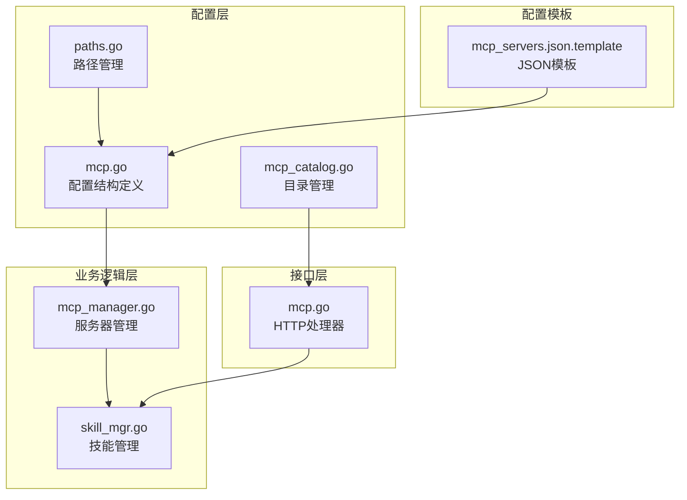
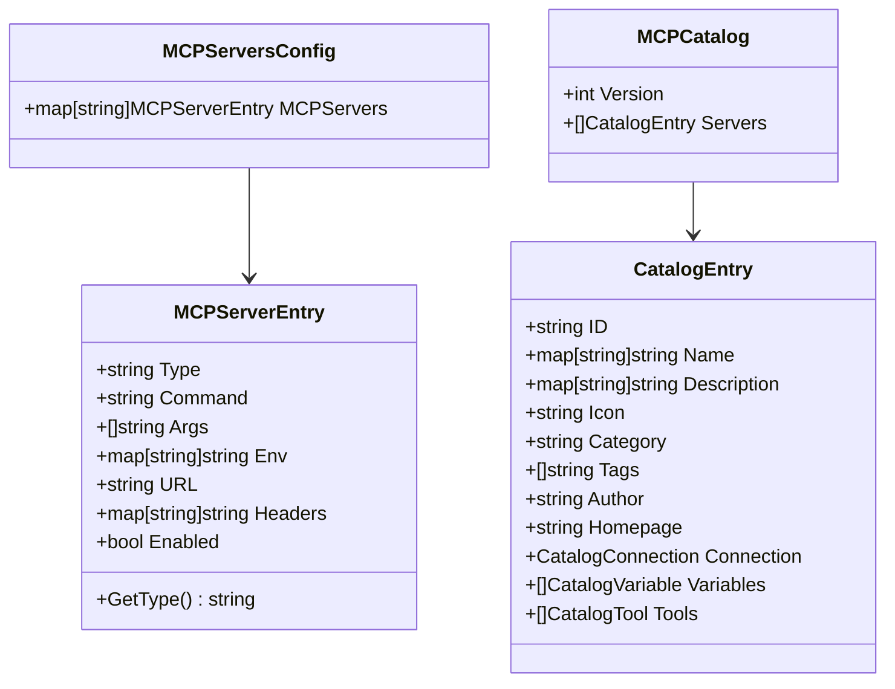
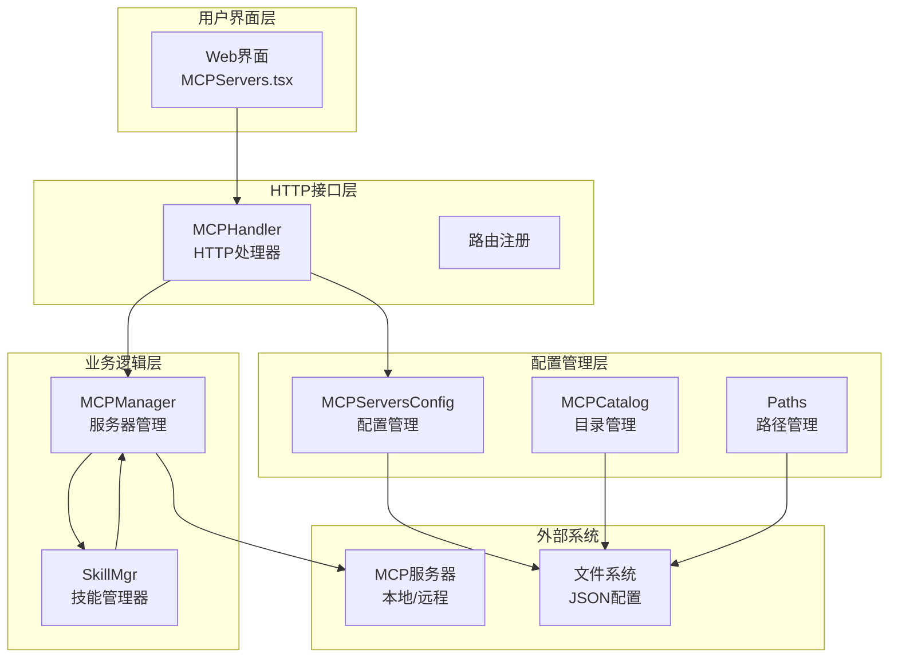
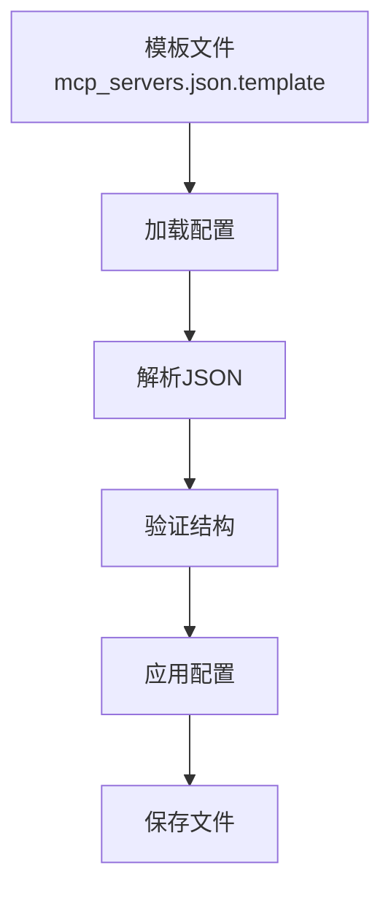
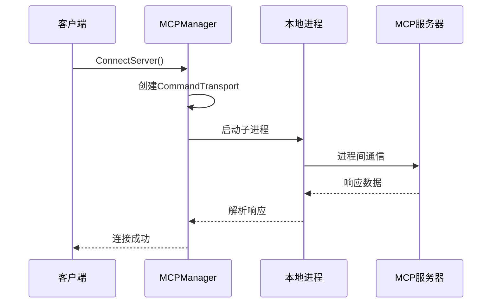
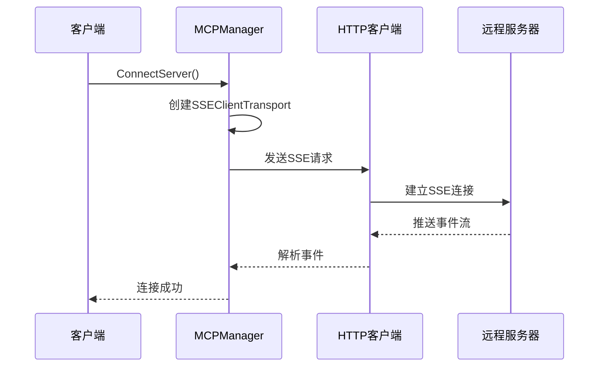
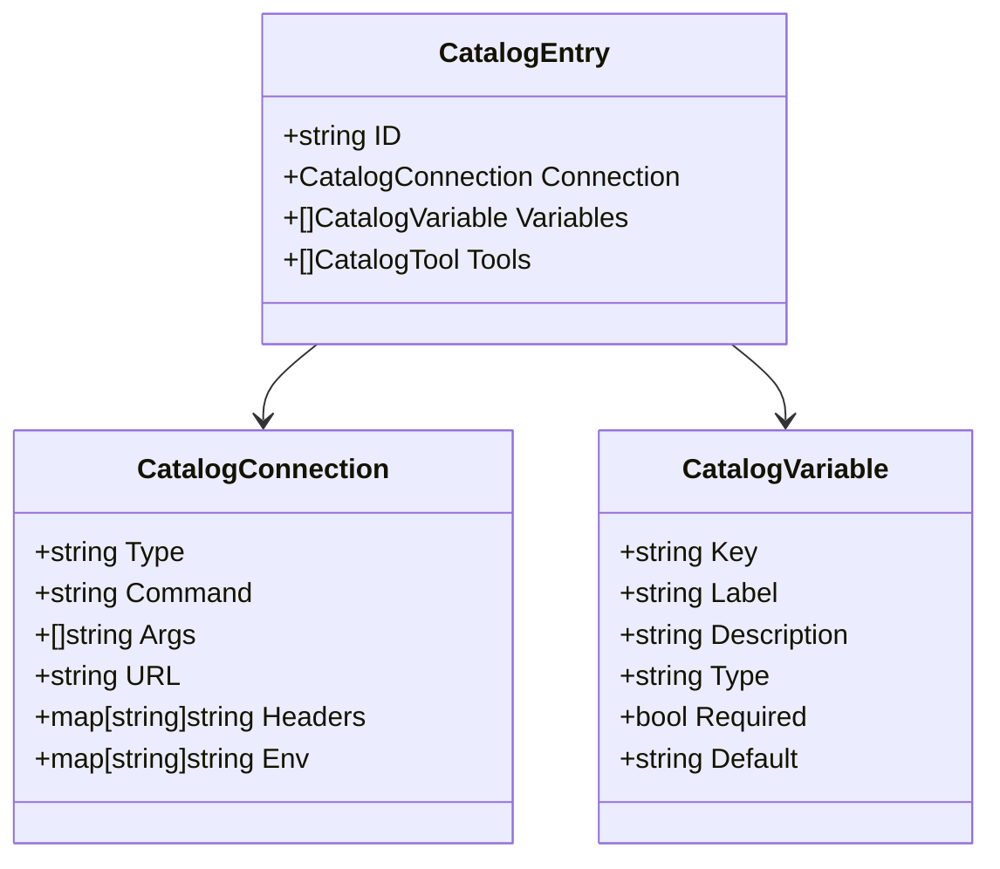
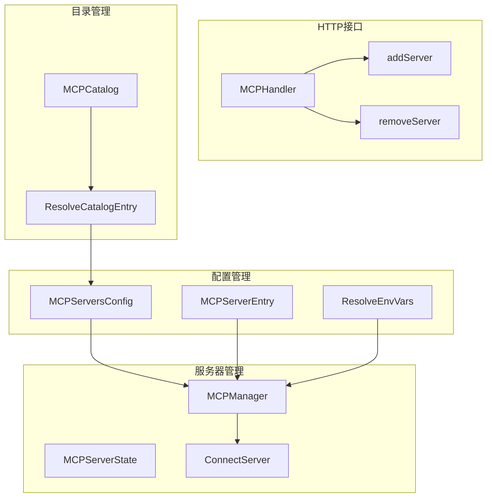
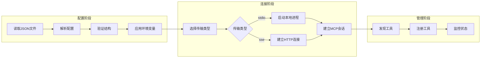
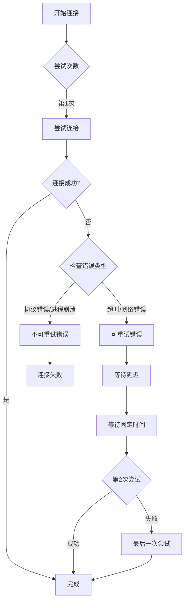

# MCP 配置管理

<cite>
**本文档引用的文件**
- [internal/config/mcp.go](file://internal/config/mcp.go)
- [internal/config/mcp_catalog.go](file://internal/config/mcp_catalog.go)
- [internal/config/paths.go](file://internal/config/paths.go)
- [internal/usecase/skills/mcp_manager.go](file://internal/usecase/skills/mcp_manager.go)
- [internal/usecase/skills/skill_mgr.go](file://internal/usecase/skills/skill_mgr.go)
- [internal/adapters/http/handlers/mcp.go](file://internal/adapters/http/handlers/mcp.go)
- [config/mcp_servers.json.template](file://config/mcp_servers.json.template)
- [internal/config/mcp_catalog_test.go](file://internal/config/mcp_catalog_test.go)
- [internal/config/config_test.go](file://internal/config/config_test.go)
- [internal/config/config.go](file://internal/config/config.go)
</cite>

## 目录
1. [简介](#简介)
2. [项目结构](#项目结构)
3. [核心组件](#核心组件)
4. [架构概览](#架构概览)
5. [详细组件分析](#详细组件分析)
6. [依赖关系分析](#依赖关系分析)
7. [性能考虑](#性能考虑)
8. [故障排除指南](#故障排除指南)
9. [结论](#结论)
10. [附录](#附录)

## 简介

MCP（Model Context Protocol）配置管理系统是 MindX 智能体平台的核心组件之一，负责管理 MCP 服务器的配置、连接和生命周期。该系统支持两种传输类型：本地进程通信（stdio）和远程 HTTP SSE（Server-Sent Events），提供了完整的配置管理、环境变量解析、目录集成和动态加载功能。

本系统通过 JSON 配置文件存储 MCP 服务器信息，支持运行时动态添加、移除和重启 MCP 服务器，同时提供了强大的环境变量占位符替换机制，确保配置的安全性和灵活性。

## 项目结构

MCP 配置管理系统的文件组织遵循清晰的分层架构：



**图表来源**
- [internal/config/mcp.go](file://internal/config/mcp.go#L1-L106)
- [internal/usecase/skills/mcp_manager.go](file://internal/usecase/skills/mcp_manager.go#L1-L292)
- [internal/adapters/http/handlers/mcp.go](file://internal/adapters/http/handlers/mcp.go#L1-L248)

**章节来源**
- [internal/config/mcp.go](file://internal/config/mcp.go#L1-L106)
- [internal/config/mcp_catalog.go](file://internal/config/mcp_catalog.go#L1-L252)
- [internal/config/paths.go](file://internal/config/paths.go#L1-L285)

## 核心组件

### 配置数据结构

系统的核心数据结构包括 MCP 服务器配置和目录条目定义：



**图表来源**
- [internal/config/mcp.go](file://internal/config/mcp.go#L13-L29)
- [internal/config/mcp_catalog.go](file://internal/config/mcp_catalog.go#L16-L56)

### 环境变量解析机制

系统实现了两级环境变量解析机制：

1. **全局解析**：`ResolveEnvVars()` - 从系统环境变量中解析占位符
2. **上下文解析**：`ResolveEnvVarsWithContext()` - 支持本地变量上下文的优先解析

**章节来源**
- [internal/config/mcp.go](file://internal/config/mcp.go#L82-L105)

## 架构概览

MCP 配置管理采用分层架构设计，确保各层职责清晰分离：



**图表来源**
- [internal/adapters/http/handlers/mcp.go](file://internal/adapters/http/handlers/mcp.go#L13-L23)
- [internal/usecase/skills/mcp_manager.go](file://internal/usecase/skills/mcp_manager.go#L36-L47)
- [internal/config/mcp.go](file://internal/config/mcp.go#L41-L80)

## 详细组件分析

### 配置文件管理

#### JSON 配置格式

系统使用 JSON 格式存储 MCP 服务器配置，支持以下字段：

| 字段名 | 类型 | 必需 | 描述 |
|--------|------|------|------|
| mcpServers | object | 是 | 服务器配置对象 |
| mcpServers[].type | string | 否 | 传输类型（stdio/sse） |
| mcpServers[].command | string | 否 | 命令行（stdio模式） |
| mcpServers[].args | array | 否 | 命令行参数数组 |
| mcpServers[].env | object | 否 | 环境变量映射 |
| mcpServers[].url | string | 否 | URL地址（sse模式） |
| mcpServers[].headers | object | 否 | HTTP头部映射 |
| mcpServers[].enabled | boolean | 是 | 是否启用 |

#### 配置文件模板

系统提供标准的 JSON 模板文件，确保配置格式的一致性：



**图表来源**
- [config/mcp_servers.json.template](file://config/mcp_servers.json.template#L1-L4)

**章节来源**
- [config/mcp_servers.json.template](file://config/mcp_servers.json.template#L1-L4)
- [internal/config/mcp.go](file://internal/config/mcp.go#L41-L80)

### 传输类型支持

系统支持两种 MCP 服务器传输类型：

#### Stdio 传输（本地进程）

Stdio 传输通过本地子进程与 MCP 服务器通信：



**图表来源**
- [internal/usecase/skills/mcp_manager.go](file://internal/usecase/skills/mcp_manager.go#L89-L104)

#### SSE 传输（远程HTTP）

SSE 传输通过 HTTP SSE 与远程 MCP 服务器通信：



**图表来源**
- [internal/usecase/skills/mcp_manager.go](file://internal/usecase/skills/mcp_manager.go#L74-L88)

**章节来源**
- [internal/usecase/skills/mcp_manager.go](file://internal/usecase/skills/mcp_manager.go#L49-L141)

### 环境变量处理

系统提供了灵活的环境变量处理机制：

```mermaid
flowchart TD
Input[输入配置] --> Pattern[正则匹配<br/>${VAR_NAME}]
Pattern --> Context{是否有本地上下文}
Context --> |是| Local[优先使用本地变量]
Context --> |否| Global[使用系统环境变量]
Local --> Replace[替换占位符]
Global --> Replace
Replace --> Output[输出解析后的配置]
```

**图表来源**
- [internal/config/mcp.go](file://internal/config/mcp.go#L82-L105)

**章节来源**
- [internal/config/mcp.go](file://internal/config/mcp.go#L84-L105)

### 目录集成系统

系统集成了 MCP 服务器目录功能，支持一键安装和管理：



**图表来源**
- [internal/config/mcp_catalog.go](file://internal/config/mcp_catalog.go#L21-L56)

**章节来源**
- [internal/config/mcp_catalog.go](file://internal/config/mcp_catalog.go#L58-L161)

### HTTP API 接口

系统提供了完整的 HTTP API 来管理 MCP 服务器：

| 端点 | 方法 | 功能 | 请求体 | 响应 |
|------|------|------|--------|------|
| /mcp/servers | GET | 列出所有服务器 | 无 | 服务器列表 |
| /mcp/servers | POST | 添加新服务器 | 服务器配置 | 成功/错误 |
| /mcp/servers/:name | DELETE | 删除服务器 | 无 | 成功/错误 |
| /mcp/servers/:name/restart | POST | 重启服务器 | 无 | 成功/错误 |
| /mcp/servers/:name/tools | GET | 获取工具列表 | 无 | 工具信息 |
| /mcp/catalog | GET | 获取目录列表 | 无 | 目录信息 |
| /mcp/catalog/install | POST | 从目录安装 | 目录ID和变量 | 安装结果 |

**章节来源**
- [internal/adapters/http/handlers/mcp.go](file://internal/adapters/http/handlers/mcp.go#L25-L136)

## 依赖关系分析

### 组件依赖图



**图表来源**
- [internal/config/mcp.go](file://internal/config/mcp.go#L13-L29)
- [internal/usecase/skills/mcp_manager.go](file://internal/usecase/skills/mcp_manager.go#L25-L40)
- [internal/adapters/http/handlers/mcp.go](file://internal/adapters/http/handlers/mcp.go#L13-L23)

### 数据流分析

系统的关键数据流包括配置加载、服务器连接和状态管理：



**图表来源**
- [internal/config/mcp.go](file://internal/config/mcp.go#L41-L64)
- [internal/usecase/skills/mcp_manager.go](file://internal/usecase/skills/mcp_manager.go#L49-L141)

**章节来源**
- [internal/config/mcp.go](file://internal/config/mcp.go#L41-L80)
- [internal/usecase/skills/mcp_manager.go](file://internal/usecase/skills/mcp_manager.go#L49-L141)

## 性能考虑

### 连接超时策略

系统针对不同传输类型设置了合理的超时时间：

- **SSE 传输**：30秒超时，适用于快速响应的远程服务
- **Stdio 传输**：120秒超时，考虑到 npm 包下载和启动的延迟

### 重试机制

系统实现了智能的重试机制，仅对可恢复的错误进行重试：



**图表来源**
- [internal/usecase/skills/skill_mgr.go](file://internal/usecase/skills/skill_mgr.go#L404-L449)

**章节来源**
- [internal/usecase/skills/skill_mgr.go](file://internal/usecase/skills/skill_mgr.go#L395-L468)

## 故障排除指南

### 常见配置错误

1. **配置文件格式错误**
   - 检查 JSON 语法正确性
   - 验证必需字段完整性
   - 确认文件编码为 UTF-8

2. **环境变量解析失败**
   - 检查占位符格式 `${VAR_NAME}`
   - 验证环境变量是否存在
   - 确认变量名大小写匹配

3. **传输连接问题**
   - Stdio：检查命令路径和权限
   - SSE：验证 URL 可访问性和认证头

### 调试建议

1. **启用详细日志**
   - 检查系统日志文件
   - 监控服务器状态变化
   - 记录连接尝试详情

2. **验证配置有效性**
   - 使用配置验证函数
   - 测试环境变量解析
   - 验证文件权限设置

**章节来源**
- [internal/config/mcp.go](file://internal/config/mcp.go#L56-L63)
- [internal/usecase/skills/mcp_manager.go](file://internal/usecase/skills/mcp_manager.go#L106-L114)

## 结论

MCP 配置管理系统提供了完整的 MCP 服务器生命周期管理功能，具有以下特点：

1. **灵活的配置管理**：支持 JSON 配置文件和运行时动态管理
2. **多传输类型支持**：同时支持本地进程和远程 HTTP SSE 传输
3. **强大的环境变量处理**：提供两级解析机制确保配置灵活性
4. **完善的目录集成**：支持一键安装和版本管理
5. **智能重试机制**：针对不同类型错误实施差异化处理策略

该系统为 MindX 平台的 MCP 服务器管理提供了坚实的技术基础，支持复杂场景下的配置管理和动态运维需求。

## 附录

### 配置示例

#### 基本 JSON 配置示例

```json
{
  "mcpServers": {
    "my-server": {
      "type": "stdio",
      "command": "node",
      "args": ["/path/to/server.js"],
      "env": {
        "API_KEY": "${API_KEY}",
        "DEBUG": "true"
      },
      "enabled": true
    }
  }
}
```

#### SSE 服务器配置示例

```json
{
  "mcpServers": {
    "remote-server": {
      "type": "sse",
      "url": "https://api.example.com/mcp",
      "headers": {
        "Authorization": "Bearer ${BEARER_TOKEN}",
        "Content-Type": "application/json"
      },
      "enabled": true
    }
  }
}
```

### 最佳实践

1. **安全配置**
   - 使用环境变量存储敏感信息
   - 避免在配置文件中硬编码密钥
   - 定期轮换认证凭据

2. **多服务器管理**
   - 为不同环境使用独立的配置文件
   - 实施服务器分组和标签管理
   - 建立监控和告警机制

3. **性能优化**
   - 合理设置连接超时时间
   - 实施连接池和资源复用
   - 监控服务器健康状态

4. **故障恢复**
   - 配置自动重试机制
   - 建立备份和恢复策略
   - 实施优雅降级方案