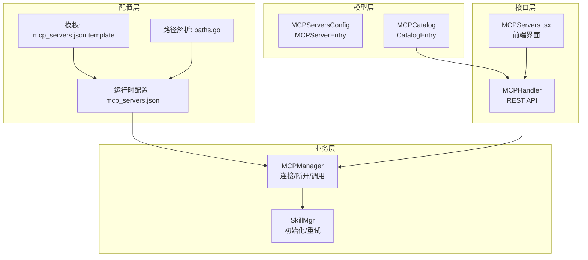
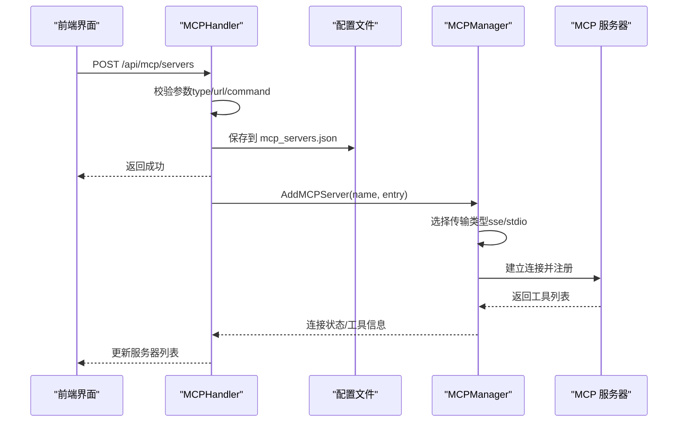
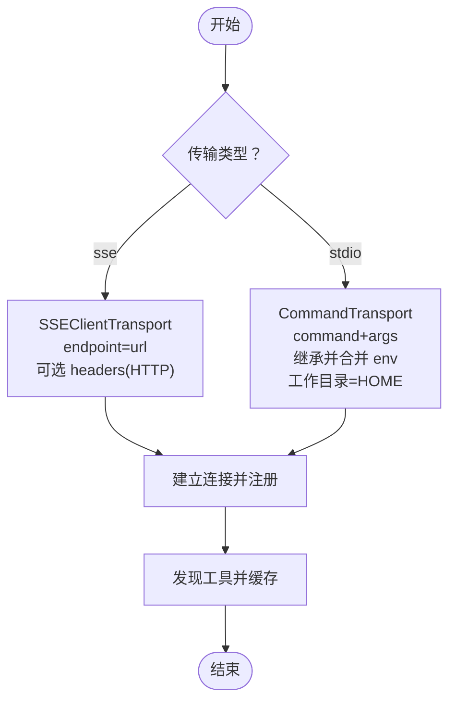
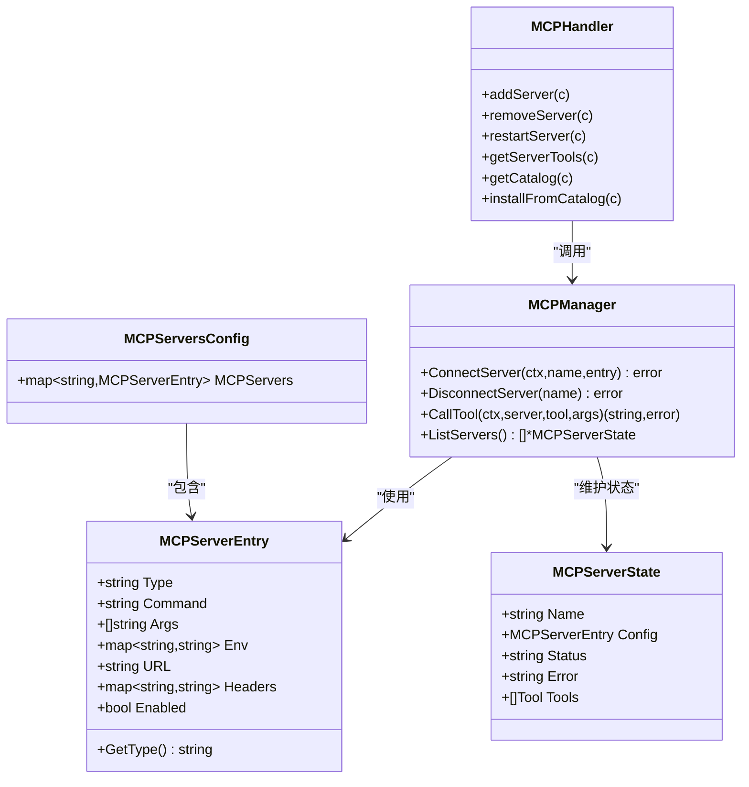

# MCP 服务器配置

<cite>
**本文引用的文件**
- [config/mcp_servers.json.template](file://config/mcp_servers.json.template)
- [internal/config/mcp.go](file://internal/config/mcp.go)
- [internal/config/mcp_catalog.go](file://internal/config/mcp_catalog.go)
- [internal/config/paths.go](file://internal/config/paths.go)
- [internal/usecase/skills/mcp_manager.go](file://internal/usecase/skills/mcp_manager.go)
- [internal/adapters/http/handlers/mcp.go](file://internal/adapters/http/handlers/mcp.go)
- [dashboard/src/components/MCPServers.tsx](file://dashboard/src/components/MCPServers.tsx)
- [internal/config/catalog/mcp_catalog.json](file://internal/config/catalog/mcp_catalog.json)
- [internal/usecase/skills/skill_mgr.go](file://internal/usecase/skills/skill_mgr.go)
</cite>

## 目录
1. [简介](#简介)
2. [项目结构](#项目结构)
3. [核心组件](#核心组件)
4. [架构总览](#架构总览)
5. [详细组件分析](#详细组件分析)
6. [依赖关系分析](#依赖关系分析)
7. [性能考虑](#性能考虑)
8. [故障排除指南](#故障排除指南)
9. [结论](#结论)
10. [附录](#附录)

## 简介
本文件面向 MCP（Model Context Protocol）服务器的配置与管理，涵盖以下方面：
- 配置格式与参数说明：服务器名称、URL 或命令配置、传输类型选择、环境变量设置
- SSE 与 stdio 两种传输方式的配置差异与适用场景
- 认证配置：HTTP 头部设置与环境变量替换机制
- MCP 服务器目录配置与工具描述文件的管理方式
- 完整配置示例与常见问题解决方案

## 项目结构
MCP 服务器配置涉及后端配置模型、前端 UI、HTTP 接口与目录管理等多个层面：
- 配置模型与解析：后端定义 MCP 服务器配置结构与解析逻辑
- 传输实现：根据配置选择 SSE 或 stdio 传输
- 目录与变量：内置目录与变量解析，支持一键安装
- HTTP 接口：提供添加、删除、重启、查看工具等接口
- 前端界面：可视化配置与安装 MCP 服务器

图表来源
- [config/mcp_servers.json.template](file://config/mcp_servers.json.template#L1-L4)
- [internal/config/mcp.go](file://internal/config/mcp.go#L13-L30)
- [internal/config/mcp_catalog.go](file://internal/config/mcp_catalog.go#L16-L57)
- [internal/config/paths.go](file://internal/config/paths.go#L100-L106)
- [internal/usecase/skills/mcp_manager.go](file://internal/usecase/skills/mcp_manager.go#L25-L40)
- [internal/adapters/http/handlers/mcp.go](file://internal/adapters/http/handlers/mcp.go#L13-L23)
- [dashboard/src/components/MCPServers.tsx](file://dashboard/src/components/MCPServers.tsx#L62-L82)

章节来源
- [config/mcp_servers.json.template](file://config/mcp_servers.json.template#L1-L4)
- [internal/config/mcp.go](file://internal/config/mcp.go#L13-L30)
- [internal/config/mcp_catalog.go](file://internal/config/mcp_catalog.go#L16-L57)
- [internal/config/paths.go](file://internal/config/paths.go#L100-L106)
- [internal/usecase/skills/mcp_manager.go](file://internal/usecase/skills/mcp_manager.go#L25-L40)
- [internal/adapters/http/handlers/mcp.go](file://internal/adapters/http/handlers/mcp.go#L13-L23)
- [dashboard/src/components/MCPServers.tsx](file://dashboard/src/components/MCPServers.tsx#L62-L82)

## 核心组件
- 配置模型
  - MCPServersConfig：顶层容器，包含 mcpServers 映射
  - MCPServerEntry：单个 MCP 服务器配置项，支持 type、command/args/env（stdio）或 url/headers（sse），以及通用的 enabled 字段
- 传输实现
  - SSE：通过 mcp.SSEClientTransport 连接远端 endpoint，支持 HTTP 客户端注入 headers
  - stdio：通过 mcp.CommandTransport 启动本地子进程，继承并合并环境变量，工作目录设为用户 HOME
- 目录与变量
  - 内置目录 MCPCatalog 提供服务器模板与变量定义
  - 变量解析 ResolveCatalogEntry 支持 ${VAR} 占位符替换
- HTTP 接口
  - 添加/删除/重启/查看工具/目录安装等 REST 接口
- 前端界面
  - 可视化切换 SSE/stdio，KV 编辑器，一键安装目录项

章节来源
- [internal/config/mcp.go](file://internal/config/mcp.go#L13-L30)
- [internal/usecase/skills/mcp_manager.go](file://internal/usecase/skills/mcp_manager.go#L49-L141)
- [internal/config/mcp_catalog.go](file://internal/config/mcp_catalog.go#L16-L57)
- [internal/adapters/http/handlers/mcp.go](file://internal/adapters/http/handlers/mcp.go#L33-L90)
- [dashboard/src/components/MCPServers.tsx](file://dashboard/src/components/MCPServers.tsx#L309-L366)

## 架构总览
MCP 服务器配置的端到端流程如下：
- 用户通过前端界面或 API 添加服务器
- 后端校验参数并持久化到 mcp_servers.json
- 后端根据配置选择传输类型并建立连接
- 成功后发现工具并缓存状态
- 前端展示服务器状态、工具列表与操作按钮

图表来源
- [internal/adapters/http/handlers/mcp.go](file://internal/adapters/http/handlers/mcp.go#L33-L90)
- [internal/config/mcp.go](file://internal/config/mcp.go#L66-L80)
- [internal/usecase/skills/mcp_manager.go](file://internal/usecase/skills/mcp_manager.go#L49-L141)

## 详细组件分析

### 配置模型与文件格式
- 配置文件位置与命名
  - 运行时配置文件：工作区 config 目录下的 mcp_servers.json
  - 模板文件：安装目录 config 目录下的 mcp_servers.json.template
- 数据结构
  - MCPServersConfig：包含 mcpServers 映射
  - MCPServerEntry：
    - type：传输类型，缺省为 "stdio"
    - stdio 字段：command、args[]、env（键值对）
    - sse 字段：url、headers（键值对）
    - enabled：布尔开关
- 路径解析
  - GetWorkspaceConfigPath 决定配置文件所在目录

章节来源
- [config/mcp_servers.json.template](file://config/mcp_servers.json.template#L1-L4)
- [internal/config/mcp.go](file://internal/config/mcp.go#L13-L30)
- [internal/config/paths.go](file://internal/config/paths.go#L100-L106)

### 传输类型选择与实现差异
- SSE（服务器端事件）
  - 适用场景：远程 MCP 服务器，便于集中管理与认证
  - 实现要点：通过 mcp.SSEClientTransport 指定 endpoint；若配置 headers，则使用 headerRoundTripper 注入认证头
- stdio（标准输入输出）
  - 适用场景：本地子进程，适合快速开发与调试
  - 实现要点：通过 mcp.CommandTransport 启动命令与参数；继承当前进程环境并合并 env；工作目录设为用户 HOME

图表来源
- [internal/usecase/skills/mcp_manager.go](file://internal/usecase/skills/mcp_manager.go#L71-L104)

章节来源
- [internal/usecase/skills/mcp_manager.go](file://internal/usecase/skills/mcp_manager.go#L49-L141)

### 认证配置与环境变量替换机制
- SSE 认证
  - 通过 headers 设置 HTTP 头部（如 Authorization）
  - 支持 ${VAR} 占位符，优先使用 entry.Env 作为本地上下文解析，再回退到系统环境
- stdio 环境变量
  - 继承当前进程环境变量，再叠加 entry.Env 中的键值
  - 支持 ${VAR} 占位符解析
- 目录变量解析
  - ResolveCatalogEntry 将目录中的变量占位符替换为用户提供的值
  - 支持 secret 类型变量存储于 env，其他字段按需替换

章节来源
- [internal/usecase/skills/mcp_manager.go](file://internal/usecase/skills/mcp_manager.go#L78-L87)
- [internal/config/mcp.go](file://internal/config/mcp.go#L82-L105)
- [internal/config/mcp_catalog.go](file://internal/config/mcp_catalog.go#L119-L161)

### MCP 服务器目录与工具描述管理
- 内置目录
  - MCPCatalog：包含多个 CatalogEntry，每个条目定义服务器模板、变量、工具描述
  - 支持从远程 URL 拉取目录并合并
- 工具描述匹配
  - GetCatalogToolDescriptions 与 MatchCatalogToolDescription 提供工具描述的标准化匹配
- 一键安装
  - installFromCatalog 校验必填变量，解析为 MCPServerEntry，持久化并异步连接

章节来源
- [internal/config/mcp_catalog.go](file://internal/config/mcp_catalog.go#L16-L57)
- [internal/config/mcp_catalog.go](file://internal/config/mcp_catalog.go#L119-L161)
- [internal/config/mcp_catalog.go](file://internal/config/mcp_catalog.go#L185-L251)
- [internal/adapters/http/handlers/mcp.go](file://internal/adapters/http/handlers/mcp.go#L183-L247)

### HTTP 接口与前端交互
- 接口能力
  - 列表、添加、删除、重启、查看工具、目录与安装
- 参数校验
  - SSE 必须提供 url；stdio 必须提供 command
- 前端界面
  - 可视化切换传输类型，KV 编辑器支持环境变量与头部编辑
  - 支持从目录一键安装并自动连接

章节来源
- [internal/adapters/http/handlers/mcp.go](file://internal/adapters/http/handlers/mcp.go#L25-L136)
- [dashboard/src/components/MCPServers.tsx](file://dashboard/src/components/MCPServers.tsx#L309-L366)

## 依赖关系分析

图表来源
- [internal/config/mcp.go](file://internal/config/mcp.go#L13-L30)
- [internal/usecase/skills/mcp_manager.go](file://internal/usecase/skills/mcp_manager.go#L25-L40)
- [internal/adapters/http/handlers/mcp.go](file://internal/adapters/http/handlers/mcp.go#L13-L23)

章节来源
- [internal/config/mcp.go](file://internal/config/mcp.go#L13-L30)
- [internal/usecase/skills/mcp_manager.go](file://internal/usecase/skills/mcp_manager.go#L25-L40)
- [internal/adapters/http/handlers/mcp.go](file://internal/adapters/http/handlers/mcp.go#L13-L23)

## 性能考虑
- 连接超时策略
  - SSE：默认 30 秒
  - stdio（npx 冷启动）：默认 120 秒
- 重试机制
  - 对超时、临时网络错误进行有限次重试，避免对不可恢复错误重复尝试
- 并发与资源
  - 连接建立采用异步安装，避免阻塞 HTTP 响应
  - 断开连接时释放会话与客户端资源

章节来源
- [internal/usecase/skills/skill_mgr.go](file://internal/usecase/skills/skill_mgr.go#L395-L468)
- [internal/usecase/skills/mcp_manager.go](file://internal/usecase/skills/mcp_manager.go#L261-L278)

## 故障排除指南
- 常见问题与定位
  - SSE 连接失败：检查 url 是否可达、认证头是否正确、headers 中的 ${VAR} 是否被正确解析
  - stdio 启动失败：检查 command 是否存在、args 是否正确、env 中的 ${VAR} 是否解析为有效值
  - 工具发现失败：确认 MCP 服务器已正确注册并返回工具列表
- 日志与状态
  - 后端记录连接失败、工具发现失败的日志，前端显示服务器状态与错误信息
- 重试与超时
  - 若为超时或临时网络错误，系统会自动重试；EOF 或协议不兼容等不可重试错误不会重试

章节来源
- [internal/usecase/skills/mcp_manager.go](file://internal/usecase/skills/mcp_manager.go#L106-L137)
- [internal/usecase/skills/skill_mgr.go](file://internal/usecase/skills/skill_mgr.go#L404-L468)

## 结论
MCP 服务器配置体系以清晰的数据模型为基础，结合 SSE 与 stdio 两种传输方式满足不同部署场景，配合目录与变量解析实现“一键安装”。通过严格的参数校验、环境变量替换与重试机制，系统在易用性与稳定性之间取得平衡。建议在生产环境中优先使用 SSE 并完善认证与监控，在开发阶段可使用 stdio 快速迭代。

## 附录

### 配置参数说明
- 服务器名称（name）
  - 用于标识与区分多个 MCP 服务器实例
- 传输类型（type）
  - "sse" 或 "stdio"，缺省为 "stdio"
- SSE 配置
  - url：MCP 服务器 SSE endpoint
  - headers：HTTP 头部（如 Authorization），支持 ${VAR} 占位符
- stdio 配置
  - command：启动命令（如 npx）
  - args：命令参数数组
  - env：环境变量（键值对），支持 ${VAR} 占位符
- 通用配置
  - enabled：是否启用该服务器

章节来源
- [internal/config/mcp.go](file://internal/config/mcp.go#L17-L29)
- [internal/adapters/http/handlers/mcp.go](file://internal/adapters/http/handlers/mcp.go#L34-L46)

### 传输方式对比与适用场景
- SSE
  - 优点：集中管理、易于认证、跨主机部署
  - 适用：生产环境、远程 MCP 服务器
- stdio
  - 优点：本地开发便捷、无需网络
  - 适用：本地调试、快速原型

章节来源
- [internal/usecase/skills/mcp_manager.go](file://internal/usecase/skills/mcp_manager.go#L71-L104)

### 目录与工具描述
- 目录条目包含：
  - connection：type、command、args、url、headers、env
  - variables：变量定义（key、label、description、type、required、default）
  - tools：工具描述（name、description）
- 工具描述匹配策略：
  - 精确匹配 → 标准化匹配（-/_ 差异）→ 子串匹配

章节来源
- [internal/config/mcp_catalog.go](file://internal/config/mcp_catalog.go#L21-L57)
- [internal/config/mcp_catalog.go](file://internal/config/mcp_catalog.go#L185-L251)

### 前端配置界面要点
- 可视化切换 SSE/stdio
- KV 编辑器支持 env 与 headers
- 一键安装目录项并自动连接

章节来源
- [dashboard/src/components/MCPServers.tsx](file://dashboard/src/components/MCPServers.tsx#L309-L366)