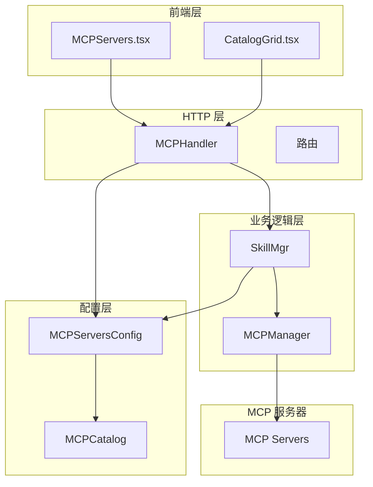
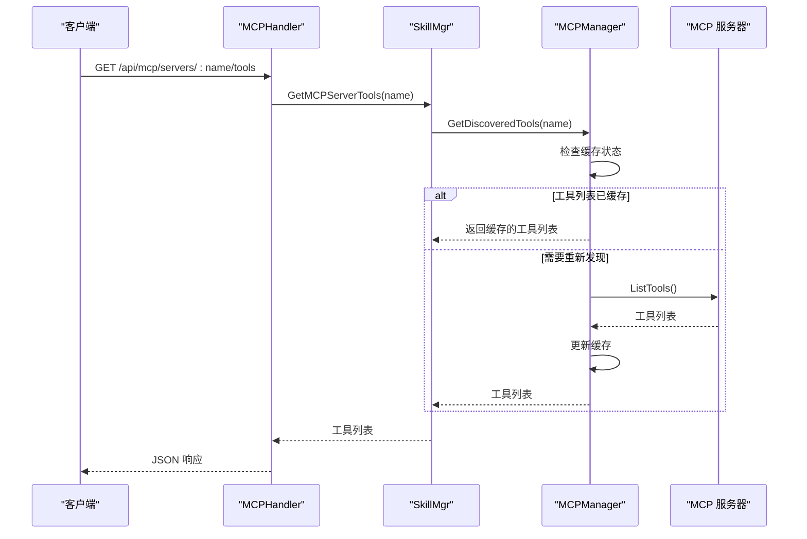
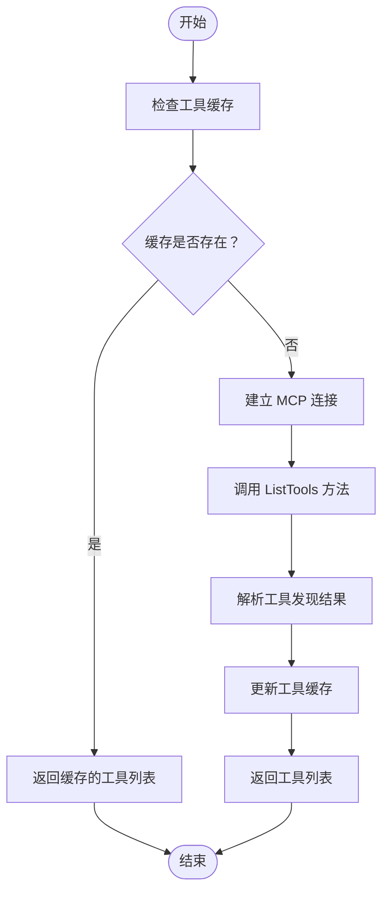
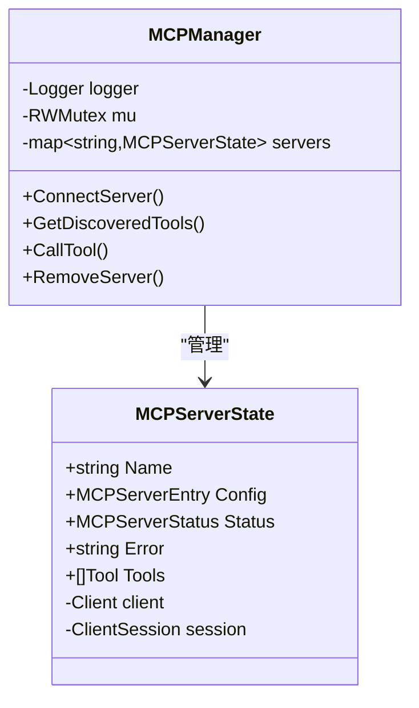
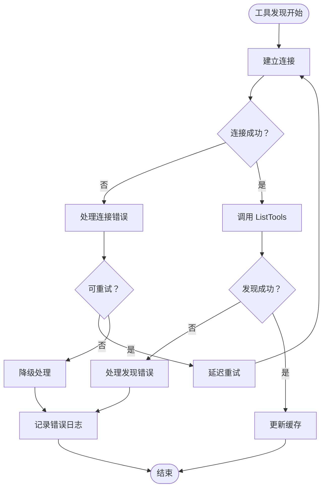
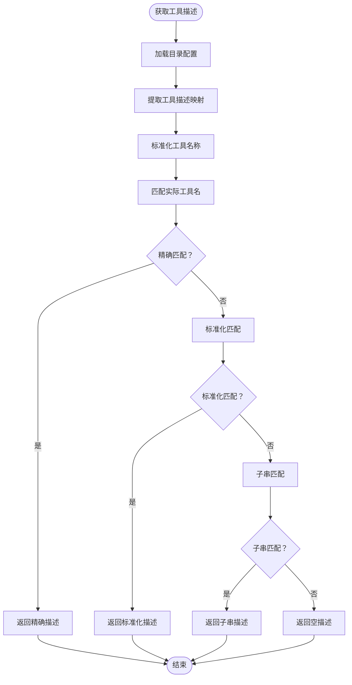
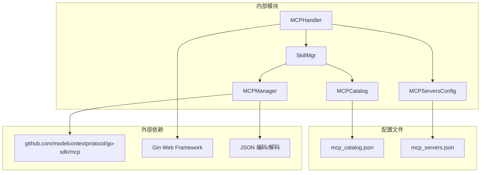

# MCP 工具发现机制

<cite>
**本文档引用的文件**
- [mcp_manager.go](file://internal/usecase/skills/mcp_manager.go)
- [mcp_utils.go](file://internal/usecase/skills/mcp_utils.go)
- [skill_mgr.go](file://internal/usecase/skills/skill_mgr.go)
- [mcp.go](file://internal/adapters/http/handlers/mcp.go)
- [mcp.go](file://internal/config/mcp.go)
- [mcp_catalog.go](file://internal/config/mcp_catalog.go)
- [mcp_catalog.json](file://internal/config/catalog/mcp_catalog.json)
- [MCPServers.tsx](file://dashboard/src/components/MCPServers.tsx)
- [CatalogGrid.tsx](file://dashboard/src/components/mcp/CatalogGrid.tsx)
- [mcp_utils_test.go](file://internal/usecase/skills/mcp_utils_test.go)
- [mcp_index_test.go](file://internal/usecase/skills/mcp_index_test.go)
</cite>

## 目录
1. [简介](#简介)
2. [项目结构](#项目结构)
3. [核心组件](#核心组件)
4. [架构概览](#架构概览)
5. [详细组件分析](#详细组件分析)
6. [依赖分析](#依赖分析)
7. [性能考虑](#性能考虑)
8. [故障排除指南](#故障排除指南)
9. [结论](#结论)
10. [附录](#附录)

## 简介

MCP（Model Context Protocol）工具发现机制是 MindX 平台的核心功能之一，它允许系统自动发现和集成第三方 MCP 服务器提供的工具。该机制通过标准的 MCP 协议与外部服务器通信，动态获取工具列表，并将其转换为平台内部的技能定义，从而扩展系统的功能边界。

本机制支持两种传输方式：本地进程传输（stdio）和远程 HTTP SSE 传输，能够自动处理工具发现、参数提取、描述翻译和缓存管理等复杂逻辑。

## 项目结构

MCP 工具发现机制涉及多个层次的组件：



**图表来源**
- [MCPServers.tsx](file://dashboard/src/components/MCPServers.tsx#L62-L146)
- [mcp.go](file://internal/adapters/http/handlers/mcp.go#L13-L24)
- [skill_mgr.go](file://internal/usecase/skills/skill_mgr.go#L470-L558)

**章节来源**
- [MCPServers.tsx](file://dashboard/src/components/MCPServers.tsx#L1-L146)
- [mcp.go](file://internal/adapters/http/handlers/mcp.go#L1-L248)

## 核心组件

### MCP 管理器 (MCPManager)

MCPManager 是工具发现机制的核心组件，负责与 MCP 服务器建立连接、执行工具发现、管理连接状态和工具调用。

关键特性：
- 支持 stdio 和 SSE 两种传输方式
- 自动工具发现和缓存
- 连接状态管理和错误处理
- 工具调用和结果处理

### 技能管理器 (SkillMgr)

SkillMgr 负责将 MCP 工具转换为平台内部的技能定义，并管理这些技能的生命周期。

主要职责：
- 将 MCP 工具转换为 SkillDef
- 管理技能注册和注销
- 处理工具描述翻译
- 管理技能索引

### HTTP 处理器 (MCPHandler)

提供 RESTful API 接口，供前端和外部系统调用 MCP 功能。

支持的操作：
- 添加和移除 MCP 服务器
- 获取服务器状态和工具列表
- 从目录安装 MCP 服务器
- 管理服务器配置

**章节来源**
- [mcp_manager.go](file://internal/usecase/skills/mcp_manager.go#L36-L47)
- [skill_mgr.go](file://internal/usecase/skills/skill_mgr.go#L470-L558)
- [mcp.go](file://internal/adapters/http/handlers/mcp.go#L13-L24)

## 架构概览

MCP 工具发现机制采用分层架构设计，确保了良好的可维护性和扩展性：



**图表来源**
- [mcp.go](file://internal/adapters/http/handlers/mcp.go#L114-L136)
- [skill_mgr.go](file://internal/usecase/skills/skill_mgr.go#L554-L557)
- [mcp_manager.go](file://internal/usecase/skills/mcp_manager.go#L217-L227)

## 详细组件分析

### ListTools 方法调用过程

ListTools 方法的调用过程体现了完整的工具发现流程：



**图表来源**
- [mcp_manager.go](file://internal/usecase/skills/mcp_manager.go#L120-L141)

关键步骤说明：
1. **连接建立**：根据配置选择传输方式（stdio 或 SSE）
2. **工具发现**：调用 MCP 协议的 ListTools 方法
3. **结果解析**：提取工具名称、描述和参数信息
4. **缓存更新**：将发现的工具信息存储在内存缓存中

**章节来源**
- [mcp_manager.go](file://internal/usecase/skills/mcp_manager.go#L49-L141)

### 工具缓存机制

MCP 工具发现机制实现了高效的缓存策略：



**图表来源**
- [mcp_manager.go](file://internal/usecase/skills/mcp_manager.go#L25-L47)

缓存特点：
- **内存缓存**：工具列表存储在内存中，避免重复发现
- **状态跟踪**：维护每个服务器的连接状态和错误信息
- **线程安全**：使用读写锁确保并发访问的安全性
- **自动清理**：断开连接时自动清理缓存

**章节来源**
- [mcp_manager.go](file://internal/usecase/skills/mcp_manager.go#L36-L47)

### 工具描述信息结构

MCP 工具描述信息采用标准化的数据结构：

```mermaid
erDiagram
MCP_TOOL {
string name PK
string description
json input_schema
string server_name
string tool_name
}
SKILL_DEF {
string name PK
string description
string category
[]string tags
bool enabled
int timeout
map~string,ParameterDef~ parameters
map~string,any~ metadata
}
PARAMETER_DEF {
string type
string description
bool required
}
MCP_TOOL ||--|| SKILL_DEF : "转换"
SKILL_DEF ||--o{ PARAMETER_DEF : "包含"
```

**图表来源**
- [mcp_utils.go](file://internal/usecase/skills/mcp_utils.go#L56-L97)
- [mcp_utils.go](file://internal/usecase/skills/mcp_utils.go#L44-L54)

工具描述字段含义：
- **名称**：唯一标识符，格式为 `mcp_{server}_{tool}`
- **描述**：工具功能的自然语言描述
- **分类**：固定为 "mcp"
- **标签**：用于搜索和过滤的关键字
- **参数**：从 JSON Schema 中提取的输入参数定义
- **元数据**：包含服务器和工具名称的映射信息

**章节来源**
- [mcp_utils.go](file://internal/usecase/skills/mcp_utils.go#L56-L97)

### 工具发现失败处理策略

系统实现了多层次的错误处理机制：



**图表来源**
- [mcp_manager.go](file://internal/usecase/skills/mcp_manager.go#L106-L141)
- [skill_mgr.go](file://internal/usecase/skills/skill_mgr.go#L451-L468)

错误处理策略：
- **连接错误**：区分可重试和不可重试错误
- **发现错误**：记录详细错误信息但不影响系统运行
- **状态更新**：自动更新服务器状态和错误信息
- **日志记录**：提供完整的错误追踪信息

**章节来源**
- [mcp_manager.go](file://internal/usecase/skills/mcp_manager.go#L106-L141)
- [skill_mgr.go](file://internal/usecase/skills/skill_mgr.go#L451-L468)

### 工具描述翻译机制

系统支持多语言工具描述的自动翻译和匹配：



**图表来源**
- [mcp_catalog.go](file://internal/config/mcp_catalog.go#L185-L251)

翻译机制特点：
- **多语言支持**：支持中文、英文等多种语言
- **智能匹配**：支持精确匹配、标准化匹配和子串匹配
- **名称规范化**：统一处理连字符和下划线差异
- **模糊匹配**：支持词片段包含匹配

**章节来源**
- [mcp_catalog.go](file://internal/config/mcp_catalog.go#L185-L251)

## 依赖分析

MCP 工具发现机制的依赖关系如下：



**图表来源**
- [mcp_manager.go](file://internal/usecase/skills/mcp_manager.go#L14)
- [mcp.go](file://internal/adapters/http/handlers/mcp.go#L10)
- [mcp_catalog.go](file://internal/config/mcp_catalog.go#L13)

**章节来源**
- [mcp_manager.go](file://internal/usecase/skills/mcp_manager.go#L1-L15)
- [mcp.go](file://internal/adapters/http/handlers/mcp.go#L1-L11)

## 性能考虑

MCP 工具发现机制在设计时充分考虑了性能优化：

### 缓存策略
- **内存缓存**：工具列表存储在内存中，避免重复网络请求
- **懒加载**：仅在首次访问时进行工具发现
- **失效机制**：支持手动刷新和自动失效检测

### 并发处理
- **读写锁**：使用 RWMutex 确保高并发场景下的数据一致性
- **非阻塞操作**：工具发现和调用操作都是异步的
- **连接池**：复用 MCP 客户端连接

### 错误恢复
- **指数退避**：重试机制采用指数退避算法
- **超时控制**：合理的超时设置避免长时间阻塞
- **资源清理**：自动清理无效连接和错误状态

## 故障排除指南

### 常见问题诊断

#### 连接问题
1. **检查 MCP 服务器状态**
   - 使用 `/api/mcp/servers` 端点查看服务器状态
   - 检查服务器配置是否正确

2. **验证网络连接**
   - 对于 SSE 服务器，检查 URL 和认证头
   - 对于 stdio 服务器，检查命令和参数

#### 工具发现失败
1. **查看错误日志**
   - 检查系统日志中的详细错误信息
   - 关注连接超时和协议不兼容错误

2. **验证 MCP 协议**
   - 确认 MCP 服务器支持 ListTools 方法
   - 检查服务器版本兼容性

#### 缓存问题
1. **强制刷新缓存**
   - 重启 MCP 服务器
   - 清除内存缓存后重新发现

2. **检查配置文件**
   - 验证 `mcp_servers.json` 配置
   - 确认目录配置文件完整性

**章节来源**
- [mcp_manager.go](file://internal/usecase/skills/mcp_manager.go#L106-L141)
- [mcp.go](file://internal/adapters/http/handlers/mcp.go#L114-L136)

### 调试方法

#### 前端调试
1. **浏览器开发者工具**
   - 查看网络面板中的 API 调用
   - 检查响应状态和数据格式

2. **控制台日志**
   - 监控工具列表加载状态
   - 查看错误提示信息

#### 后端调试
1. **日志分析**
   - 查看 MCP 连接日志
   - 监控工具发现过程

2. **配置验证**
   - 检查 MCP 服务器配置
   - 验证目录配置文件

**章节来源**
- [MCPServers.tsx](file://dashboard/src/components/MCPServers.tsx#L120-L135)
- [mcp.go](file://internal/adapters/http/handlers/mcp.go#L114-L136)

## 结论

MCP 工具发现机制通过标准化的架构设计和完善的错误处理策略，为 MindX 平台提供了强大而灵活的工具扩展能力。该机制不仅支持多种传输方式和协议，还具备智能缓存、多语言翻译和自动重试等高级特性。

通过本文档的详细分析，开发者可以深入理解 MCP 工具发现的工作原理，掌握正确的使用方法和调试技巧，为构建更加智能化的应用程序奠定坚实基础。

## 附录

### 使用示例

#### 添加 MCP 服务器
```javascript
// 通过 API 添加服务器
fetch('/api/mcp/servers', {
  method: 'POST',
  headers: {'Content-Type': 'application/json'},
  body: JSON.stringify({
    name: 'my-server',
    type: 'stdio',
    command: 'npx',
    args: ['@modelcontextprotocol/server-everything'],
    enabled: true
  })
})
```

#### 获取工具列表
```javascript
// 获取特定服务器的工具
fetch('/api/mcp/servers/my-server/tools')
  .then(response => response.json())
  .then(data => console.log(data.tools))
```

#### 从目录安装
```javascript
// 从内置目录安装服务器
fetch('/api/mcp/catalog/install', {
  method: 'POST',
  headers: {'Content-Type': 'application/json'},
  body: JSON.stringify({
    id: 'everything',
    variables: {}
  })
})
```

### 最佳实践

1. **配置管理**
   - 使用配置文件管理 MCP 服务器设置
   - 定期备份和验证配置文件

2. **监控和日志**
   - 建立完善的日志监控体系
   - 设置告警机制处理异常情况

3. **性能优化**
   - 合理设置缓存策略
   - 优化工具发现频率

4. **安全性**
   - 保护敏感配置信息
   - 实施访问控制和认证机制