# MCP 工具调用执行

<cite>
**本文档引用的文件**
- [internal/usecase/skills/executor.go](file://internal/usecase/skills/executor.go)
- [internal/usecase/skills/mcp_manager.go](file://internal/usecase/skills/mcp_manager.go)
- [internal/usecase/skills/mcp_utils.go](file://internal/usecase/skills/mcp_utils.go)
- [internal/usecase/skills/mcp_utils_test.go](file://internal/usecase/skills/mcp_utils_test.go)
- [internal/usecase/skills/mcp_index_test.go](file://internal/usecase/skills/mcp_index_test.go)
- [internal/usecase/brain/tool_caller.go](file://internal/usecase/brain/tool_caller.go)
- [internal/config/mcp.go](file://internal/config/mcp.go)
- [internal/entity/skill.go](file://internal/entity/skill.go)
- [internal/entity/tool.go](file://internal/entity/tool.go)
- [dashboard/src/components/skills/types.ts](file://dashboard/src/components/skills/types.ts)
</cite>

## 目录
1. [简介](#简介)
2. [项目结构](#项目结构)
3. [核心组件](#核心组件)
4. [架构概览](#架构概览)
5. [详细组件分析](#详细组件分析)
6. [依赖关系分析](#依赖关系分析)
7. [性能考虑](#性能考虑)
8. [故障排除指南](#故障排除指南)
9. [结论](#结论)

## 简介

本文档深入解析 MindX 项目中的 MCP（Model Context Protocol）工具调用执行机制。重点涵盖 CallTool 方法的实现细节，包括参数验证、会话检查和工具调用过程。详细说明工具调用的参数传递机制，包括参数格式、类型转换和验证规则。阐述结果处理流程，包括返回值提取、错误判断和内容解析。解释异常处理策略，包括连接断开检测、状态更新和错误传播。提供工具调用的完整示例，包括成功调用和错误处理的最佳实践。说明工具调用的性能考虑和优化建议。

## 项目结构

MindX 项目采用分层架构设计，MCP 工具调用功能主要分布在以下模块：

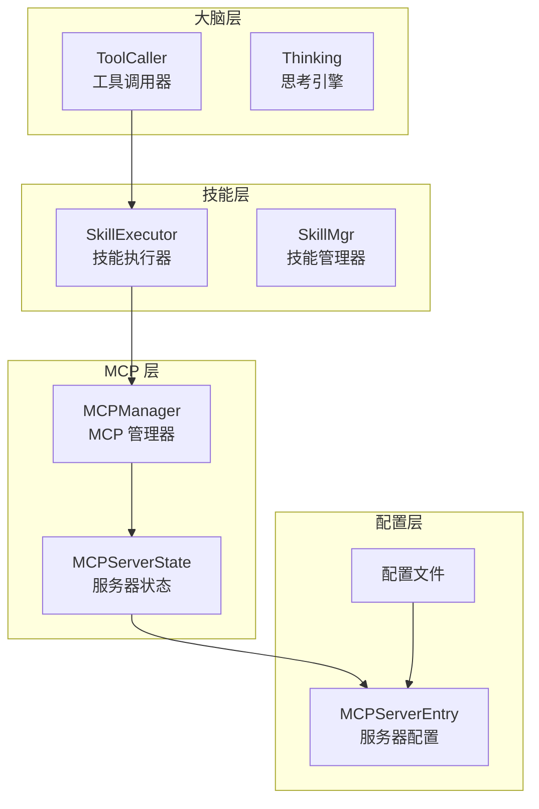

**图表来源**
- [internal/usecase/brain/tool_caller.go](file://internal/usecase/brain/tool_caller.go#L15-L25)
- [internal/usecase/skills/executor.go](file://internal/usecase/skills/executor.go#L19-L42)
- [internal/usecase/skills/mcp_manager.go](file://internal/usecase/skills/mcp_manager.go#L36-L47)
- [internal/config/mcp.go](file://internal/config/mcp.go#L17-L29)

**章节来源**
- [internal/usecase/brain/tool_caller.go](file://internal/usecase/brain/tool_caller.go#L1-L209)
- [internal/usecase/skills/executor.go](file://internal/usecase/skills/executor.go#L1-L402)
- [internal/usecase/skills/mcp_manager.go](file://internal/usecase/skills/mcp_manager.go#L1-L292)
- [internal/config/mcp.go](file://internal/config/mcp.go#L1-L106)

## 核心组件

### MCP 管理器 (MCPManager)

MCPManager 是整个 MCP 功能的核心组件，负责管理 MCP 服务器连接和工具调用。

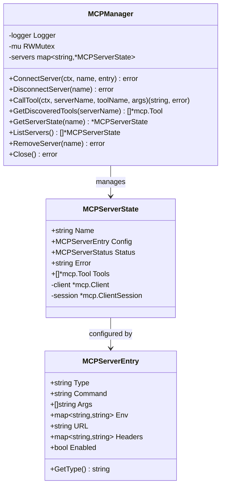

**图表来源**
- [internal/usecase/skills/mcp_manager.go](file://internal/usecase/skills/mcp_manager.go#L36-L47)
- [internal/usecase/skills/mcp_manager.go](file://internal/usecase/skills/mcp_manager.go#L25-L34)
- [internal/config/mcp.go](file://internal/config/mcp.go#L17-L29)

### 技能执行器 (SkillExecutor)

SkillExecutor 负责统一管理不同类型技能的执行，包括 MCP 工具、内部技能和外部命令。

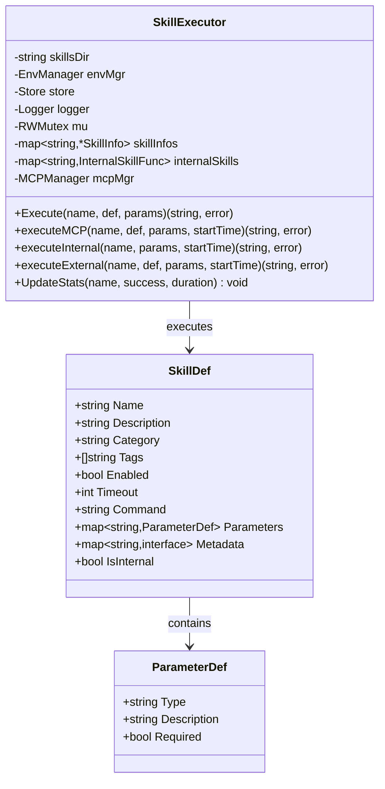

**图表来源**
- [internal/usecase/skills/executor.go](file://internal/usecase/skills/executor.go#L19-L42)
- [internal/entity/skill.go](file://internal/entity/skill.go#L6-L25)
- [internal/entity/skill.go](file://internal/entity/skill.go#L44-L49)

**章节来源**
- [internal/usecase/skills/executor.go](file://internal/usecase/skills/executor.go#L19-L42)
- [internal/usecase/skills/mcp_manager.go](file://internal/usecase/skills/mcp_manager.go#L36-L47)
- [internal/entity/skill.go](file://internal/entity/skill.go#L1-L83)

## 架构概览

MCP 工具调用的整体架构遵循分层设计原则，从上层的工具调用到下层的具体实现都有清晰的职责划分。

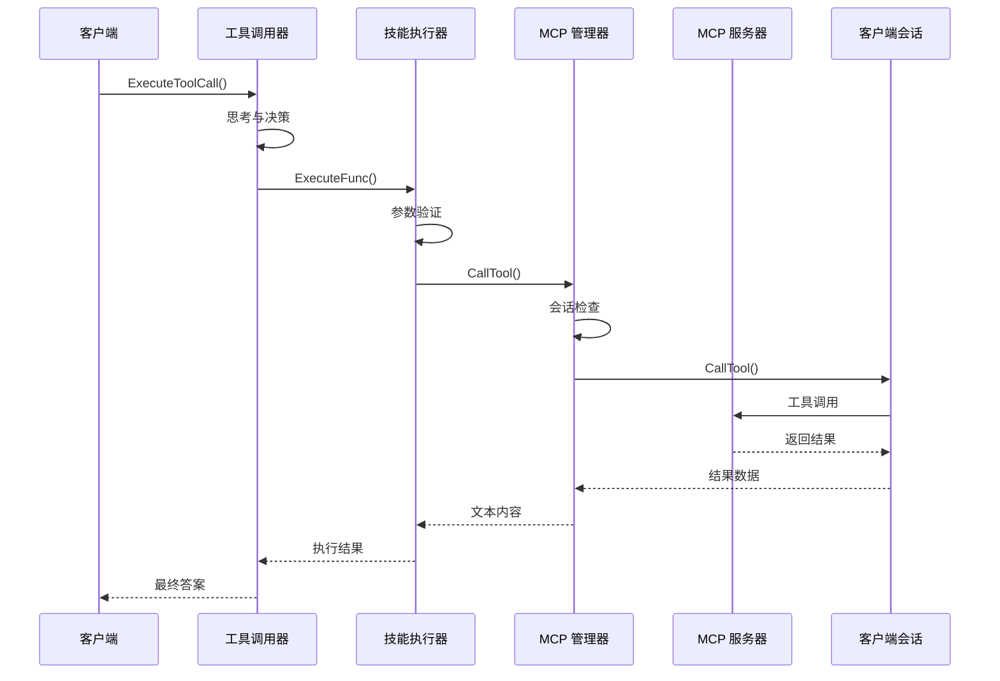

**图表来源**
- [internal/usecase/brain/tool_caller.go](file://internal/usecase/brain/tool_caller.go#L27-L139)
- [internal/usecase/skills/executor.go](file://internal/usecase/skills/executor.go#L57-L79)
- [internal/usecase/skills/mcp_manager.go](file://internal/usecase/skills/mcp_manager.go#L169-L204)

## 详细组件分析

### CallTool 方法实现详解

CallTool 方法是 MCP 工具调用的核心入口，实现了完整的参数验证、会话检查和工具调用流程。

#### 参数验证机制

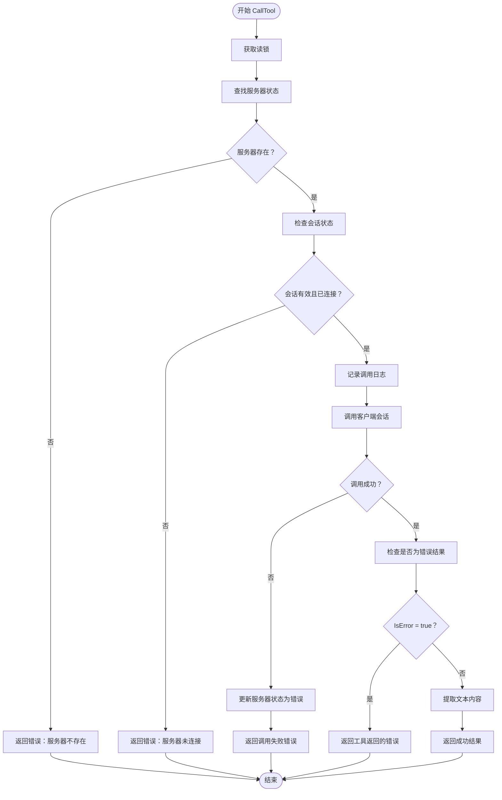

**图表来源**
- [internal/usecase/skills/mcp_manager.go](file://internal/usecase/skills/mcp_manager.go#L170-L204)

#### 会话检查流程

会话检查是确保 MCP 服务器连接有效性的重要步骤：

1. **服务器存在性检查**：验证目标服务器是否已注册
2. **会话状态验证**：确认客户端会话对象存在
3. **连接状态确认**：确保服务器状态为 "connected"

#### 结果处理机制

结果处理包含三个关键步骤：

1. **错误状态检查**：通过 `result.IsError` 判断工具执行是否成功
2. **内容提取**：使用 `extractTextContent` 函数从 `[]mcp.Content` 中提取纯文本
3. **返回值封装**：将提取的文本内容作为字符串返回

**章节来源**
- [internal/usecase/skills/mcp_manager.go](file://internal/usecase/skills/mcp_manager.go#L170-L204)
- [internal/usecase/skills/mcp_manager.go](file://internal/usecase/skills/mcp_manager.go#L206-L215)

### 参数传递机制

MCP 工具调用的参数传递遵循严格的格式规范和类型转换规则。

#### 参数格式规范

工具调用参数以 `map[string]any` 形式传递，支持以下数据类型：
- 基本类型：string、integer、number、boolean
- 复合类型：object、array
- 空值：null

#### 类型转换规则

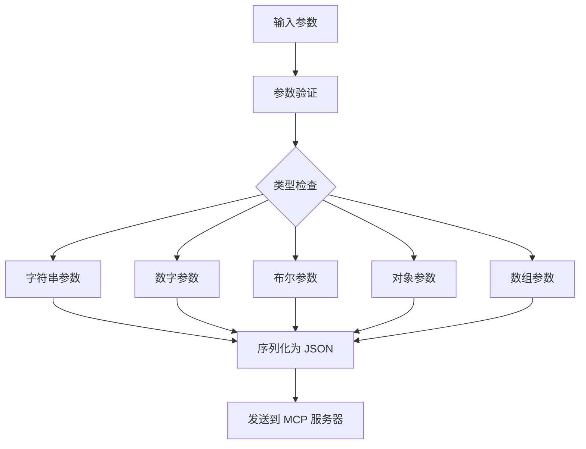

**图表来源**
- [internal/usecase/skills/executor.go](file://internal/usecase/skills/executor.go#L117-L124)
- [internal/usecase/skills/mcp_manager.go](file://internal/usecase/skills/mcp_manager.go#L186-L189)

#### 参数验证规则

1. **必需参数检查**：根据工具定义的 `Required` 字段验证必填参数
2. **类型匹配验证**：确保参数类型与定义的 `Type` 字段一致
3. **范围限制检查**：对数值类型进行范围验证
4. **格式规范验证**：对特殊格式（如日期、邮箱）进行格式检查

**章节来源**
- [internal/usecase/skills/mcp_utils.go](file://internal/usecase/skills/mcp_utils.go#L99-L131)
- [internal/entity/skill.go](file://internal/entity/skill.go#L44-L49)

### 异常处理策略

MCP 工具调用实现了多层次的异常处理机制，确保系统的稳定性和可靠性。

#### 连接断开检测

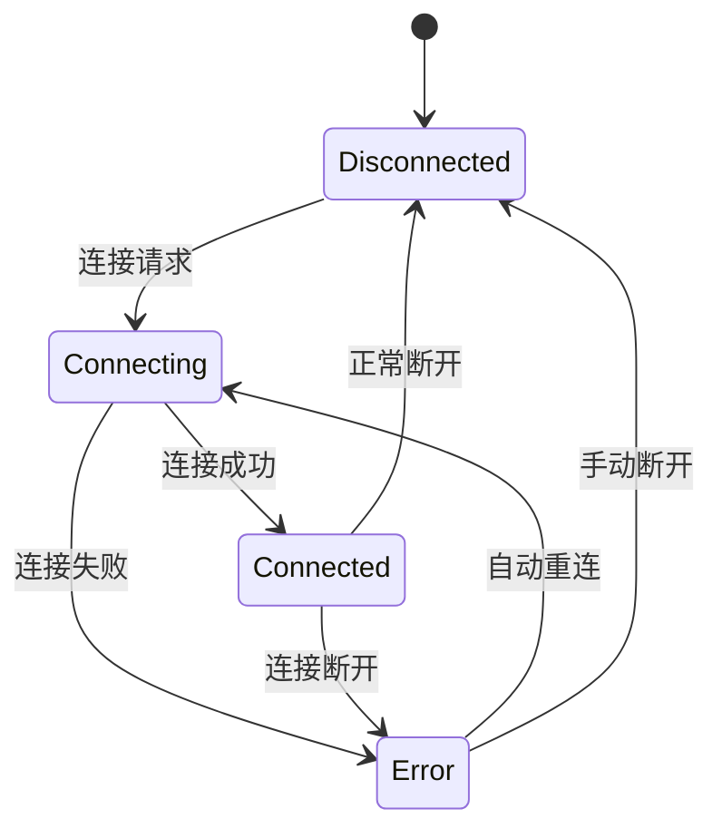

**图表来源**
- [internal/usecase/skills/mcp_manager.go](file://internal/usecase/skills/mcp_manager.go#L19-L23)

#### 状态更新机制

当检测到连接异常时，系统会自动更新服务器状态：
1. **状态标记**：将服务器状态设置为 "error"
2. **错误记录**：保存具体的错误信息
3. **资源清理**：释放相关资源和连接
4. **通知机制**：向监控系统发送状态变更通知

#### 错误传播策略

错误处理遵循"就近处理、向上报告"的原则：
- **本地处理**：在调用点进行必要的错误恢复
- **状态更新**：更新相关组件的状态信息
- **日志记录**：详细记录错误信息和上下文
- **错误包装**：使用 `fmt.Errorf` 包装原始错误，添加上下文信息

**章节来源**
- [internal/usecase/skills/mcp_manager.go](file://internal/usecase/skills/mcp_manager.go#L190-L196)

### 成功调用示例

以下是一个完整的成功调用流程示例：

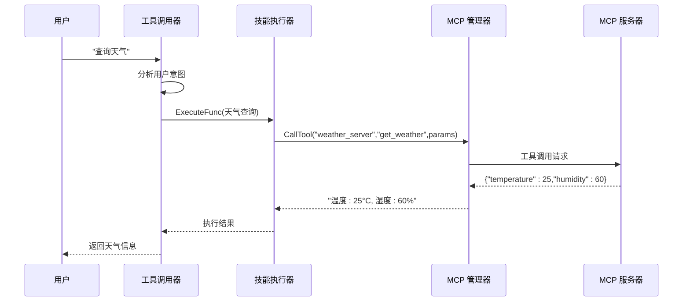

**图表来源**
- [internal/usecase/brain/tool_caller.go](file://internal/usecase/brain/tool_caller.go#L86-L107)
- [internal/usecase/skills/executor.go](file://internal/usecase/skills/executor.go#L124-L135)

### 错误处理最佳实践

#### 常见错误类型及处理

1. **服务器未找到**：检查服务器配置和连接状态
2. **连接超时**：增加超时时间或检查网络状况
3. **工具参数错误**：验证参数格式和类型
4. **工具执行失败**：查看工具返回的错误信息

#### 错误恢复策略

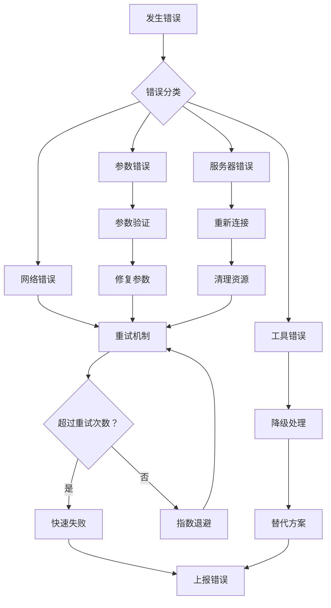

**图表来源**
- [internal/usecase/skills/mcp_manager.go](file://internal/usecase/skills/mcp_manager.go#L451-L468)

**章节来源**
- [internal/usecase/skills/mcp_manager.go](file://internal/usecase/skills/mcp_manager.go#L451-L468)

## 依赖关系分析

MCP 工具调用功能涉及多个组件之间的复杂依赖关系，形成了一个完整的生态系统。

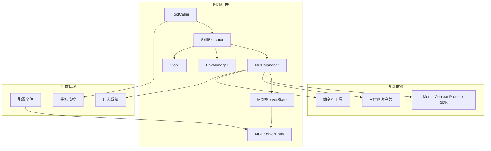

**图表来源**
- [internal/usecase/brain/tool_caller.go](file://internal/usecase/brain/tool_caller.go#L15-L25)
- [internal/usecase/skills/executor.go](file://internal/usecase/skills/executor.go#L19-L42)
- [internal/usecase/skills/mcp_manager.go](file://internal/usecase/skills/mcp_manager.go#L36-L47)

### 组件耦合度分析

| 组件 | 内聚性 | 耦合度 | 主要职责 |
|------|--------|--------|----------|
| ToolCaller | 高 | 中等 | 工具调用协调 |
| SkillExecutor | 高 | 低 | 技能执行管理 |
| MCPManager | 高 | 低 | MCP 服务器管理 |
| MCPServerState | 高 | 低 | 服务器状态维护 |
| MCPServerEntry | 高 | 低 | 服务器配置管理 |

### 外部依赖管理

系统对外部依赖的管理采用以下策略：
1. **版本锁定**：固定使用的 SDK 版本
2. **接口抽象**：通过接口隔离具体实现
3. **错误处理**：统一处理外部依赖错误
4. **资源管理**：确保外部资源正确释放

**章节来源**
- [internal/usecase/skills/mcp_manager.go](file://internal/usecase/skills/mcp_manager.go#L1-L292)
- [internal/config/mcp.go](file://internal/config/mcp.go#L1-L106)

## 性能考虑

### 连接池优化

MCP 服务器连接采用连接池管理策略，通过以下机制提升性能：

1. **连接复用**：避免频繁建立和销毁连接
2. **超时控制**：设置合理的连接超时时间
3. **健康检查**：定期检查连接状态
4. **资源回收**：及时释放无效连接

### 缓存策略

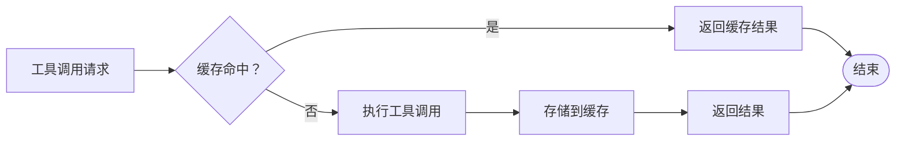

**图表来源**
- [internal/usecase/skills/executor.go](file://internal/usecase/skills/executor.go#L266-L300)

### 并发处理

系统采用并发处理机制提升工具调用效率：
1. **goroutine 池**：限制同时执行的工具数量
2. **信号量控制**：防止资源过度占用
3. **超时机制**：避免长时间阻塞
4. **错误隔离**：单个工具失败不影响整体性能

### 监控指标

系统收集以下关键性能指标：
- 工具调用成功率
- 平均响应时间
- 连接池利用率
- 错误率统计
- 资源使用情况

**章节来源**
- [internal/usecase/skills/executor.go](file://internal/usecase/skills/executor.go#L266-L300)
- [internal/usecase/skills/executor.go](file://internal/usecase/skills/executor.go#L302-L373)

## 故障排除指南

### 常见问题诊断

#### 服务器连接问题

| 问题症状 | 可能原因 | 解决方案 |
|----------|----------|----------|
| 连接超时 | 网络延迟或服务器负载过高 | 增加超时时间，检查网络状况 |
| 连接拒绝 | 服务器未启动或端口错误 | 确认服务器状态，检查配置 |
| 认证失败 | 凭据错误或过期 | 更新认证信息，检查权限 |
| 协议不兼容 | 版本不匹配 | 升级客户端或服务器版本 |

#### 工具调用问题

| 问题症状 | 可能原因 | 解决方案 |
|----------|----------|----------|
| 参数错误 | 参数格式不正确 | 验证参数定义，检查类型转换 |
| 工具不存在 | 工具名称拼写错误 | 检查工具注册状态 |
| 权限不足 | 缺少必要权限 | 授权相应权限 |
| 资源不足 | 内存或CPU不足 | 释放资源，优化配置 |

### 调试技巧

#### 日志分析

系统提供了详细的日志记录机制：
1. **操作日志**：记录所有关键操作的时间戳和结果
2. **错误日志**：详细记录错误信息和堆栈跟踪
3. **性能日志**：记录执行时间和资源使用情况
4. **调试日志**：提供详细的调试信息

#### 性能分析

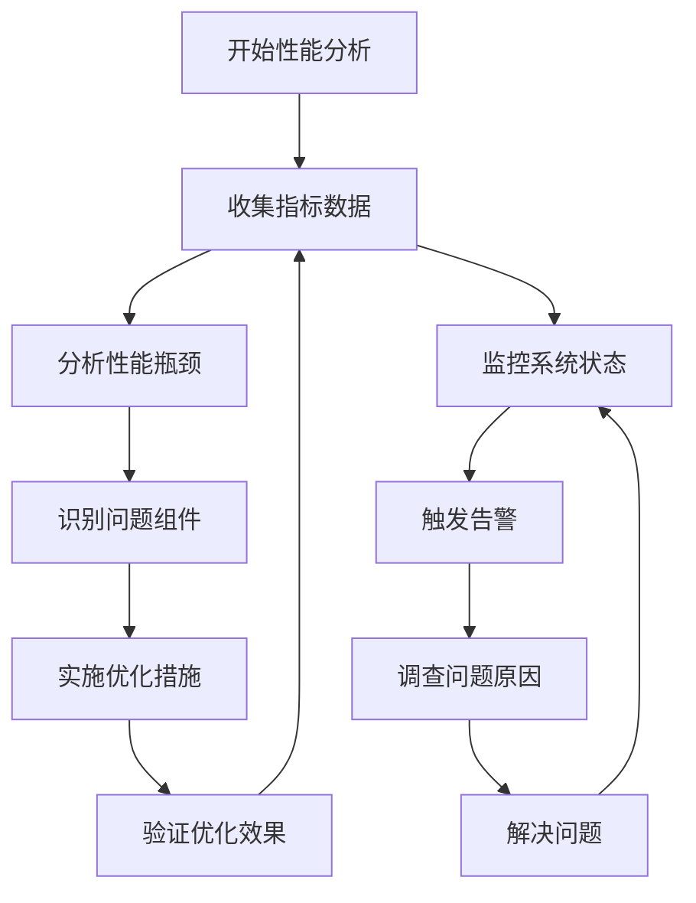

**图表来源**
- [internal/usecase/skills/executor.go](file://internal/usecase/skills/executor.go#L266-L300)

### 最佳实践建议

1. **配置验证**：定期检查 MCP 服务器配置的正确性
2. **监控告警**：建立完善的监控和告警机制
3. **备份策略**：为关键配置和数据建立备份
4. **文档维护**：保持技术文档的及时更新
5. **安全审计**：定期进行安全配置和访问控制审计

**章节来源**
- [internal/usecase/skills/mcp_manager.go](file://internal/usecase/skills/mcp_manager.go#L143-L167)
- [internal/usecase/skills/mcp_manager.go](file://internal/usecase/skills/mcp_manager.go#L262-L278)

## 结论

MCP 工具调用执行功能在 MindX 项目中展现了高度的模块化设计和完善的错误处理机制。通过分层架构的设计，系统实现了良好的可维护性和扩展性。CallTool 方法的实现体现了严谨的参数验证、会话检查和结果处理流程。

系统的主要优势包括：
- **健壮的异常处理**：多层次的错误检测和恢复机制
- **灵活的配置管理**：支持多种传输方式和认证模式
- **完善的监控体系**：全面的性能指标和日志记录
- **高效的资源管理**：连接池和缓存策略优化性能

未来可以进一步优化的方向：
- 增强自动重连机制的智能性
- 扩展更多传输协议的支持
- 优化大规模并发场景下的性能表现
- 加强安全防护和访问控制机制

通过持续的改进和完善，MCP 工具调用功能将继续为 MindX 项目提供稳定可靠的服务能力。