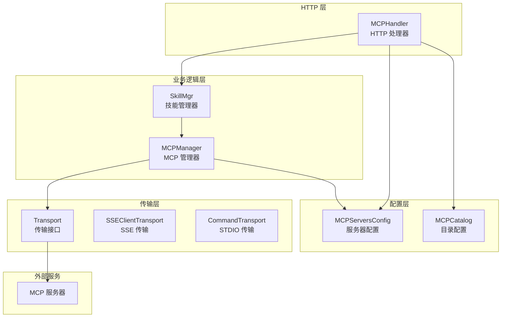
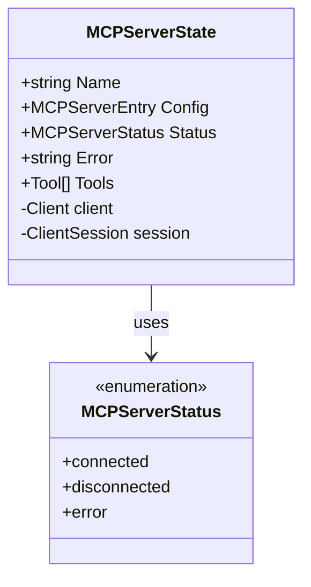
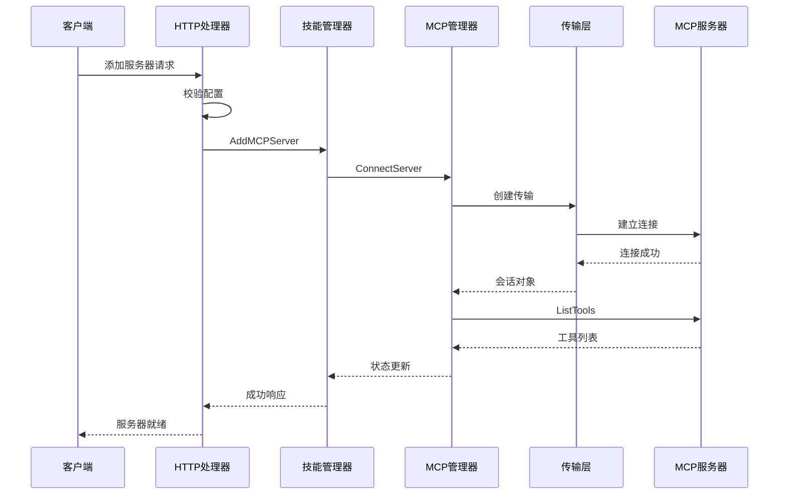
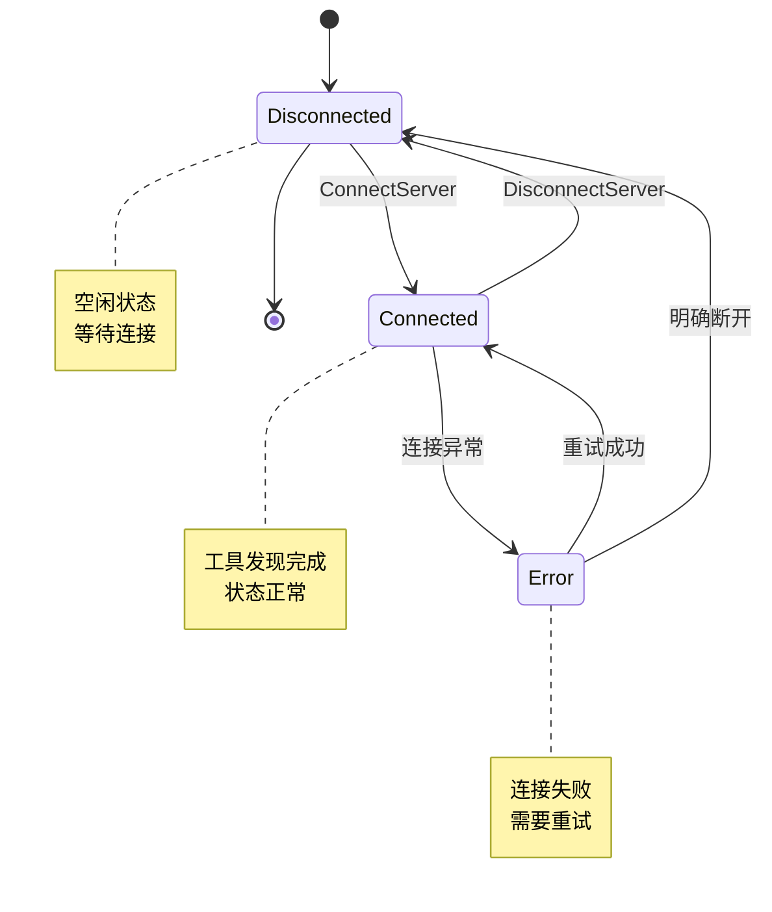
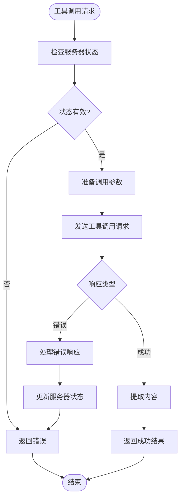
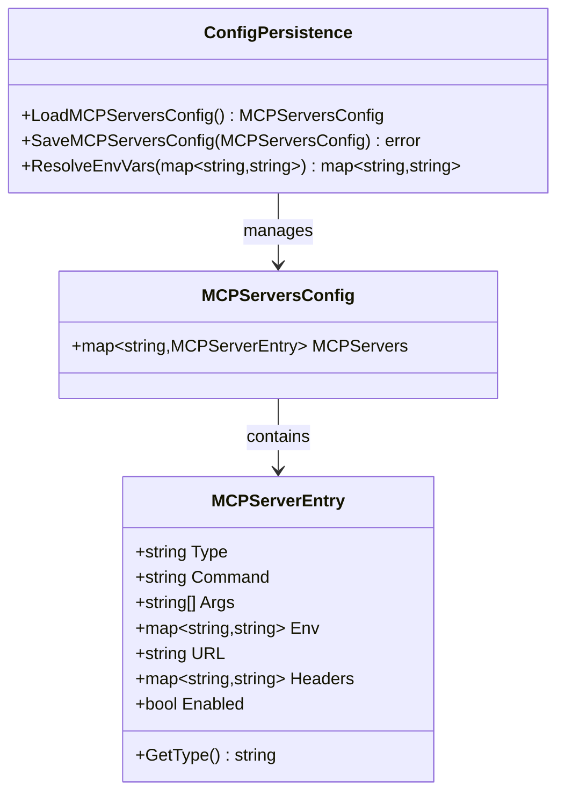
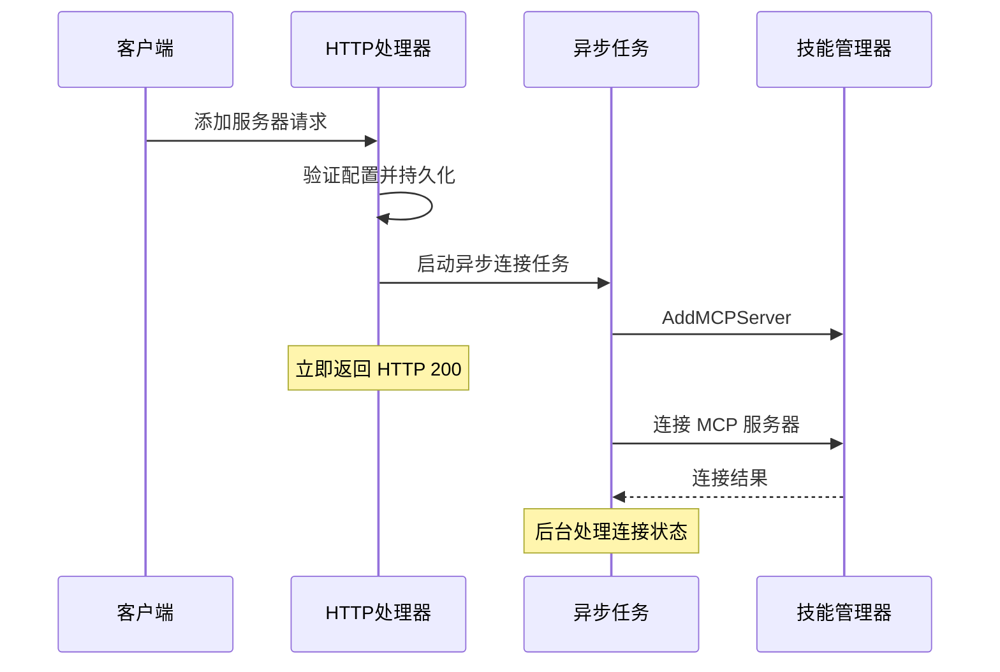
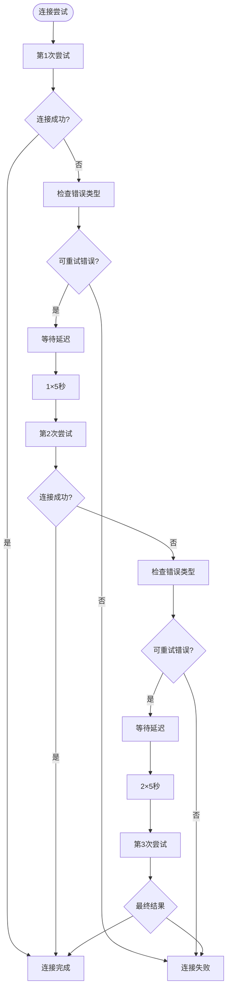
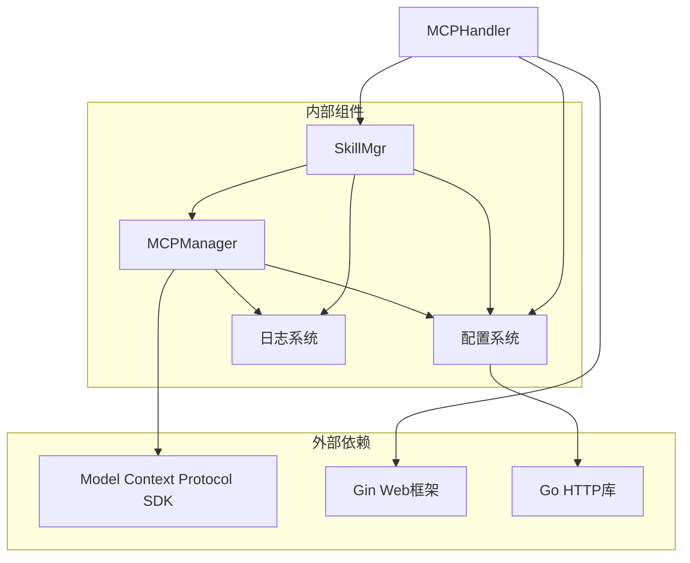

# MCP 服务器生命周期

<cite>
**本文档引用的文件**
- [mcp_manager.go](file://internal/usecase/skills/mcp_manager.go)
- [mcp.go](file://internal/config/mcp.go)
- [mcp.go](file://internal/adapters/http/handlers/mcp.go)
- [skill_mgr.go](file://internal/usecase/skills/skill_mgr.go)
- [mcp_catalog.go](file://internal/config/mcp_catalog.go)
- [mcp_servers.json.template](file://config/mcp_servers.json.template)
- [mcp_index_test.go](file://internal/usecase/skills/mcp_index_test.go)
</cite>

## 目录
1. [简介](#简介)
2. [项目结构](#项目结构)
3. [核心组件](#核心组件)
4. [架构概览](#架构概览)
5. [详细组件分析](#详细组件分析)
6. [依赖关系分析](#依赖关系分析)
7. [性能考虑](#性能考虑)
8. [故障排除指南](#故障排除指南)
9. [结论](#结论)

## 简介

MCP（Model Context Protocol）服务器生命周期管理是 MindX 智能体平台中的关键组件，负责管理外部 MCP 服务器的完整生命周期，包括连接建立、工具发现、状态监控、断开清理等功能。本文档深入解释了服务器状态管理机制、状态转换条件、状态持久化策略，以及完整的生命周期管理流程。

## 项目结构

MCP 服务器生命周期管理涉及多个层次的组件协作：

**图表来源**
- [mcp_manager.go](file://internal/usecase/skills/mcp_manager.go#L36-L47)
- [mcp.go](file://internal/adapters/http/handlers/mcp.go#L13-L23)
- [skill_mgr.go](file://internal/usecase/skills/skill_mgr.go#L20-L34)

**章节来源**
- [mcp_manager.go](file://internal/usecase/skills/mcp_manager.go#L1-L50)
- [mcp.go](file://internal/adapters/http/handlers/mcp.go#L1-L30)
- [skill_mgr.go](file://internal/usecase/skills/skill_mgr.go#L1-L50)

## 核心组件

### 状态枚举定义

MCP 服务器状态通过字符串枚举进行管理，定义了三种基本状态：

**图表来源**
- [mcp_manager.go](file://internal/usecase/skills/mcp_manager.go#L17-L34)

### 并发安全设计

系统采用读写锁确保并发访问的安全性：

- **读锁 (RLock)**: 用于状态查询、工具列表获取等只读操作
- **写锁 (Lock)**: 用于状态修改、连接建立、断开等修改操作

这种设计避免了竞态条件，确保多线程环境下的一致性。

**章节来源**
- [mcp_manager.go](file://internal/usecase/skills/mcp_manager.go#L36-L47)
- [mcp_manager.go](file://internal/usecase/skills/mcp_manager.go#L170-L173)

## 架构概览

MCP 服务器生命周期管理采用分层架构设计，各层职责明确：

**图表来源**
- [mcp.go](file://internal/adapters/http/handlers/mcp.go#L33-L90)
- [skill_mgr.go](file://internal/usecase/skills/skill_mgr.go#L374-L393)
- [mcp_manager.go](file://internal/usecase/skills/mcp_manager.go#L49-L141)

## 详细组件分析

### MCPManager 组件

MCPManager 是核心的生命周期管理组件，负责服务器的完整生命周期：

#### 状态管理机制

**图表来源**
- [mcp_manager.go](file://internal/usecase/skills/mcp_manager.go#L17-L23)
- [mcp_manager.go](file://internal/usecase/skills/mcp_manager.go#L49-L141)

#### 连接建立流程

连接建立过程包含以下关键步骤：

1. **传输类型检测**: 支持 SSE 和 STDIO 两种传输方式
2. **环境变量解析**: 支持 `${VAR}` 占位符解析
3. **客户端初始化**: 创建 MCP 客户端实例
4. **会话建立**: 建立与服务器的通信会话
5. **工具发现**: 自动发现服务器提供的工具列表

#### 工具调用机制

**图表来源**
- [mcp_manager.go](file://internal/usecase/skills/mcp_manager.go#L169-L204)

**章节来源**
- [mcp_manager.go](file://internal/usecase/skills/mcp_manager.go#L49-L204)

### 配置管理系统

#### 配置持久化

MCP 服务器配置采用 JSON 文件持久化机制：

**图表来源**
- [mcp.go](file://internal/config/mcp.go#L13-L37)
- [mcp.go](file://internal/config/mcp.go#L39-L80)

#### 目录集成

系统支持从内置目录和远程目录加载 MCP 服务器配置：

- **内置目录**: 随程序打包的目录配置
- **远程目录**: 可配置的远程目录源
- **目录合并**: 远程条目覆盖内置条目，新增条目追加

**章节来源**
- [mcp.go](file://internal/config/mcp.go#L39-L106)
- [mcp_catalog.go](file://internal/config/mcp_catalog.go#L58-L161)

### HTTP 接口层

#### API 端点设计

HTTP 处理器提供了完整的 MCP 服务器管理 API：

| 端点 | 方法 | 功能 | 请求体 | 响应 |
|------|------|------|--------|------|
| `/mcp/servers` | GET | 列出所有服务器 | 无 | 服务器列表 |
| `/mcp/servers` | POST | 添加新服务器 | 服务器配置 | 添加结果 |
| `/mcp/servers/:name` | DELETE | 删除服务器 | 无 | 删除结果 |
| `/mcp/servers/:name/restart` | POST | 重启服务器 | 无 | 重启结果 |
| `/mcp/servers/:name/tools` | GET | 获取工具列表 | 无 | 工具列表 |

#### 异步处理机制

系统采用异步方式处理服务器连接，避免阻塞 HTTP 响应：

**图表来源**
- [mcp.go](file://internal/adapters/http/handlers/mcp.go#L237-L244)

**章节来源**
- [mcp.go](file://internal/adapters/http/handlers/mcp.go#L25-L136)
- [mcp.go](file://internal/adapters/http/handlers/mcp.go#L138-L160)

### 重试和故障恢复机制

#### 连接重试策略

系统实现了智能的连接重试机制：

**图表来源**
- [skill_mgr.go](file://internal/usecase/skills/skill_mgr.go#L406-L449)

#### 错误分类策略

系统对错误类型进行智能分类：

| 错误类型 | 重试策略 | 说明 |
|----------|----------|------|
| 超时错误 | 重试 | `context deadline exceeded`, `i/o timeout` |
| 网络拒绝 | 重试 | `connection refused` |
| 进程崩溃 | 不重试 | `EOF` |
| 协议不兼容 | 不重试 | `405 Method Not Allowed` |

**章节来源**
- [skill_mgr.go](file://internal/usecase/skills/skill_mgr.go#L406-L468)

## 依赖关系分析

### 组件依赖图

**图表来源**
- [mcp_manager.go](file://internal/usecase/skills/mcp_manager.go#L3-L15)
- [mcp.go](file://internal/adapters/http/handlers/mcp.go#L3-L11)

### 数据流分析

MCP 服务器生命周期的数据流遵循以下模式：

1. **配置输入**: HTTP 请求或配置文件输入
2. **状态转换**: 配置驱动的状态转换
3. **资源管理**: 连接建立和释放
4. **工具发现**: 自动化的工具列表获取
5. **状态持久化**: 配置文件的实时更新

**章节来源**
- [mcp_manager.go](file://internal/usecase/skills/mcp_manager.go#L1-L50)
- [mcp.go](file://internal/config/mcp.go#L1-L50)

## 性能考虑

### 并发性能优化

系统通过以下机制优化并发性能：

- **读写分离**: 读操作使用 RWMutex 的读锁，提高并发读取性能
- **异步处理**: HTTP 请求采用异步方式处理，避免阻塞主线程
- **连接池**: 复用已建立的连接，减少重复连接开销
- **批量操作**: 支持批量初始化多个 MCP 服务器

### 内存管理

- **状态缓存**: 服务器状态存储在内存中，提供快速访问
- **资源清理**: 断开连接时及时释放底层资源
- **垃圾回收**: 通过状态重置和指针置零促进 GC 回收

## 故障排除指南

### 常见问题诊断

#### 连接失败排查

1. **检查传输配置**
   - 确认 URL 或命令配置正确
   - 验证网络连通性
   - 检查认证头设置

2. **环境变量问题**
   - 确认 `${VAR}` 占位符已正确解析
   - 验证环境变量值的有效性

3. **超时问题**
   - 检查服务器启动时间
   - 调整连接超时配置

#### 工具调用失败

1. **状态检查**
   - 确认服务器处于 `connected` 状态
   - 验证工具名称拼写正确

2. **参数验证**
   - 检查必需参数是否提供
   - 验证参数类型和格式

**章节来源**
- [mcp_manager.go](file://internal/usecase/skills/mcp_manager.go#L169-L204)
- [skill_mgr.go](file://internal/usecase/skills/skill_mgr.go#L454-L468)

### 最佳实践建议

1. **配置管理**
   - 使用目录功能统一管理服务器配置
   - 定期备份配置文件
   - 为敏感信息使用环境变量

2. **监控和日志**
   - 启用详细的日志记录
   - 设置适当的告警阈值
   - 定期检查服务器状态

3. **故障恢复**
   - 实现自动重试机制
   - 设置合理的超时时间
   - 准备手动干预流程

## 结论

MCP 服务器生命周期管理通过精心设计的状态管理、并发安全机制和智能重试策略，为 MindX 平台提供了可靠的外部服务器集成能力。系统的关键优势包括：

- **完整的生命周期管理**: 从连接建立到断开清理的全流程覆盖
- **高并发安全性**: 通过读写锁确保多线程环境下的数据一致性
- **智能故障恢复**: 自动重试和错误分类机制提升系统稳定性
- **灵活的配置管理**: 支持多种传输方式和配置来源
- **完善的监控机制**: 提供丰富的状态查询和调试接口

这些特性使得 MCP 服务器生命周期管理成为 MindX 平台中不可或缺的核心组件，为构建复杂的智能体应用提供了坚实的基础。