# MCP 管理器实现

<cite>
**本文档引用的文件**
- [mcp_manager.go](file://internal/usecase/skills/mcp_manager.go)
- [mcp_utils.go](file://internal/usecase/skills/mcp_utils.go)
- [executor.go](file://internal/usecase/skills/executor.go)
- [mcp.go](file://internal/adapters/http/handlers/mcp.go)
- [mcp.go](file://internal/config/mcp.go)
- [mcp_catalog.go](file://internal/config/mcp_catalog.go)
- [skill_mgr.go](file://internal/usecase/skills/skill_mgr.go)
- [types.ts](file://dashboard/src/components/mcp/types.ts)
- [mcp_servers.json.template](file://config/mcp_servers.json.template)
</cite>

## 目录
1. [简介](#简介)
2. [项目结构](#项目结构)
3. [核心组件](#核心组件)
4. [架构概览](#架构概览)
5. [详细组件分析](#详细组件分析)
6. [依赖关系分析](#依赖关系分析)
7. [性能考虑](#性能考虑)
8. [故障排除指南](#故障排除指南)
9. [结论](#结论)
10. [附录](#附录)

## 简介

MCP（Model Context Protocol）管理器实现是 MindX 智能体平台中的关键组件，负责管理 MCP 服务器连接、工具发现和工具调用执行。该实现支持两种传输方式：标准输入输出（stdio）和服务器发送事件（SSE），为开发者提供了灵活的 MCP 服务器集成能力。

本技术文档深入解析 MCP 管理器的设计架构和核心功能，包括服务器连接管理、工具发现机制和调用执行流程，为开发者理解和扩展 MCP 功能提供全面指导。

## 项目结构

MCP 管理器相关的代码分布在多个层次中：

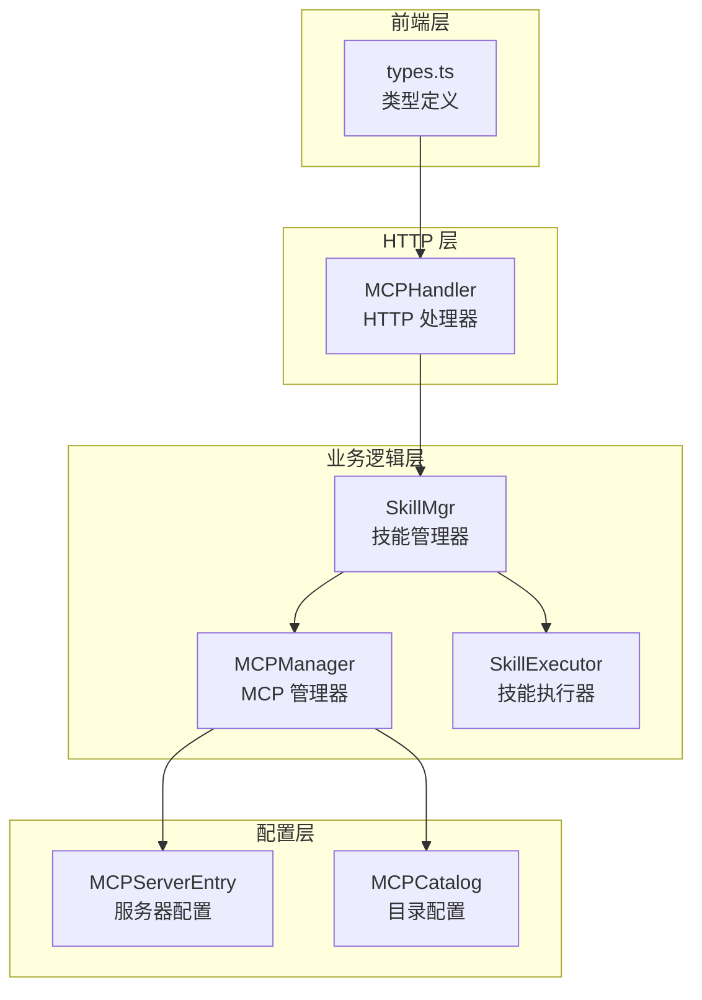

**图表来源**
- [mcp.go](file://internal/adapters/http/handlers/mcp.go#L1-L248)
- [skill_mgr.go](file://internal/usecase/skills/skill_mgr.go#L20-L62)
- [mcp_manager.go](file://internal/usecase/skills/mcp_manager.go#L36-L47)

**章节来源**
- [mcp_manager.go](file://internal/usecase/skills/mcp_manager.go#L1-L292)
- [mcp.go](file://internal/adapters/http/handlers/mcp.go#L1-L248)
- [mcp.go](file://internal/config/mcp.go#L1-L106)

## 核心组件

MCP 管理器实现包含以下核心组件：

### MCPManager 主要职责
- **服务器连接管理**：支持 stdio 和 SSE 两种传输方式
- **工具发现机制**：自动获取 MCP 服务器提供的工具列表
- **工具调用执行**：安全地执行 MCP 工具并处理结果
- **状态管理**：维护服务器连接状态和错误信息

### 数据结构设计

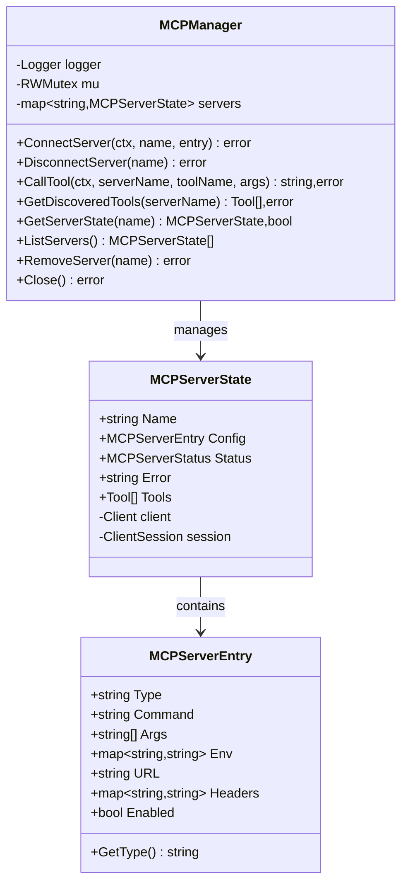

**图表来源**
- [mcp_manager.go](file://internal/usecase/skills/mcp_manager.go#L25-L40)
- [mcp.go](file://internal/config/mcp.go#L17-L29)

**章节来源**
- [mcp_manager.go](file://internal/usecase/skills/mcp_manager.go#L17-L47)
- [mcp.go](file://internal/config/mcp.go#L17-L37)

## 架构概览

MCP 管理器采用分层架构设计，确保了良好的关注点分离和可扩展性：

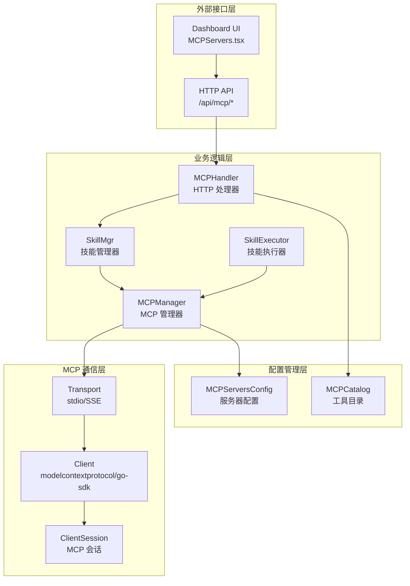

**图表来源**
- [mcp.go](file://internal/adapters/http/handlers/mcp.go#L13-L23)
- [skill_mgr.go](file://internal/usecase/skills/skill_mgr.go#L20-L34)
- [mcp_manager.go](file://internal/usecase/skills/mcp_manager.go#L49-L104)

## 详细组件分析

### 服务器连接管理

#### 连接建立流程

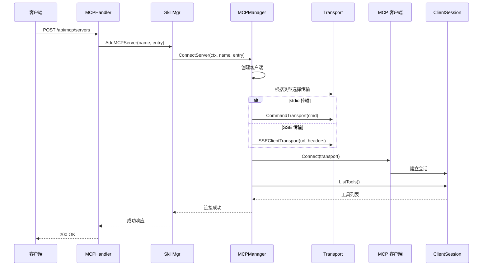

**图表来源**
- [mcp_manager.go](file://internal/usecase/skills/mcp_manager.go#L49-L141)
- [mcp.go](file://internal/adapters/http/handlers/mcp.go#L33-L90)

#### 传输方式实现差异

| 特性 | stdio 传输 | SSE 传输 |
|------|------------|----------|
| **连接方式** | 子进程启动 | HTTP SSE 连接 |
| **认证机制** | 环境变量继承 | HTTP 头部认证 |
| **工作目录** | 用户主目录 | 当前进程目录 |
| **错误处理** | 进程退出码 | HTTP 状态码 |
| **配置字段** | command, args, env | url, headers |

**章节来源**
- [mcp_manager.go](file://internal/usecase/skills/mcp_manager.go#L73-L104)
- [mcp.go](file://internal/config/mcp.go#L17-L29)

### 工具发现机制

#### 工具发现流程

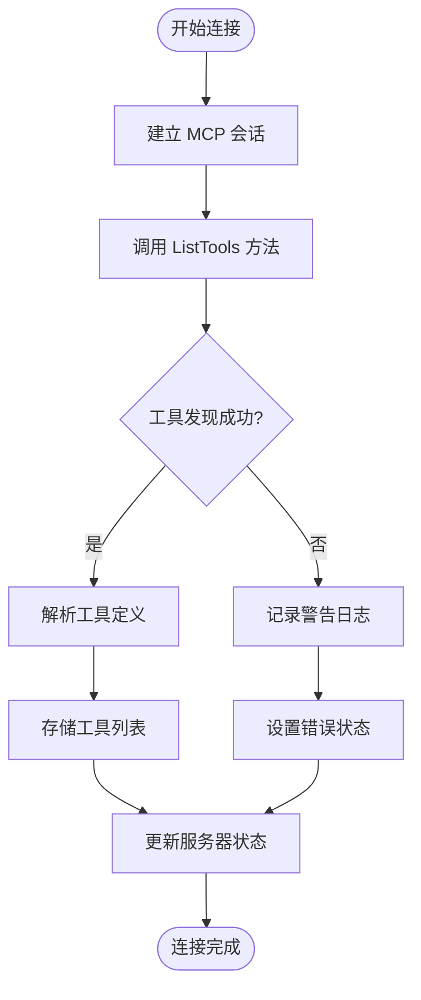

**图表来源**
- [mcp_manager.go](file://internal/usecase/skills/mcp_manager.go#L120-L137)

#### 工具元数据转换

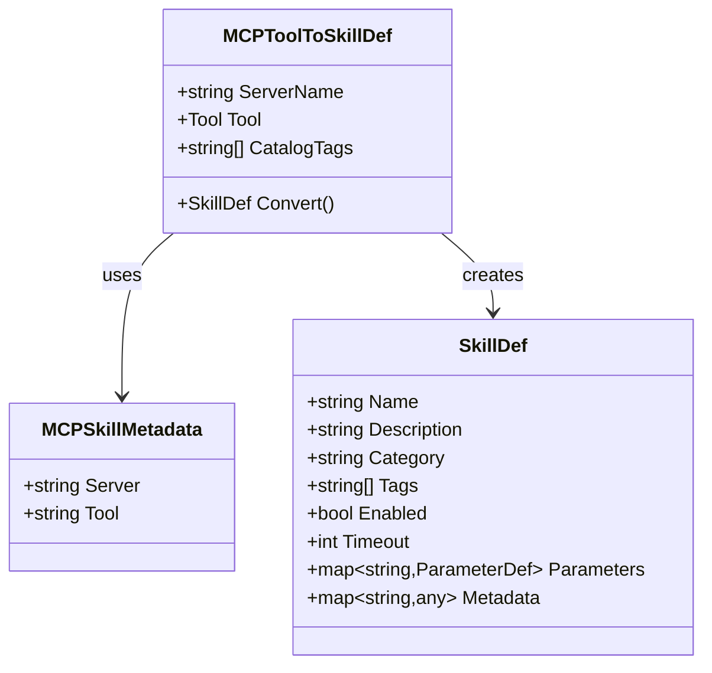

**图表来源**
- [mcp_utils.go](file://internal/usecase/skills/mcp_utils.go#L11-L97)

**章节来源**
- [mcp_utils.go](file://internal/usecase/skills/mcp_utils.go#L56-L97)

### 工具调用执行流程

#### 调用执行序列

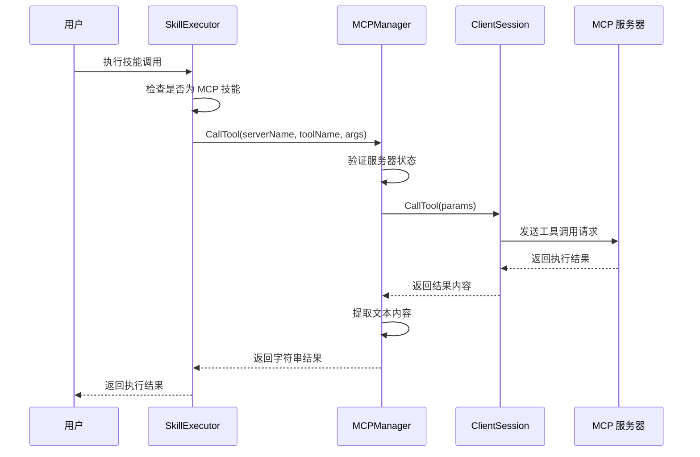

**图表来源**
- [executor.go](file://internal/usecase/skills/executor.go#L105-L136)
- [mcp_manager.go](file://internal/usecase/skills/mcp_manager.go#L169-L204)

**章节来源**
- [executor.go](file://internal/usecase/skills/executor.go#L105-L136)
- [mcp_manager.go](file://internal/usecase/skills/mcp_manager.go#L169-L204)

### 配置管理系统

#### 配置结构设计

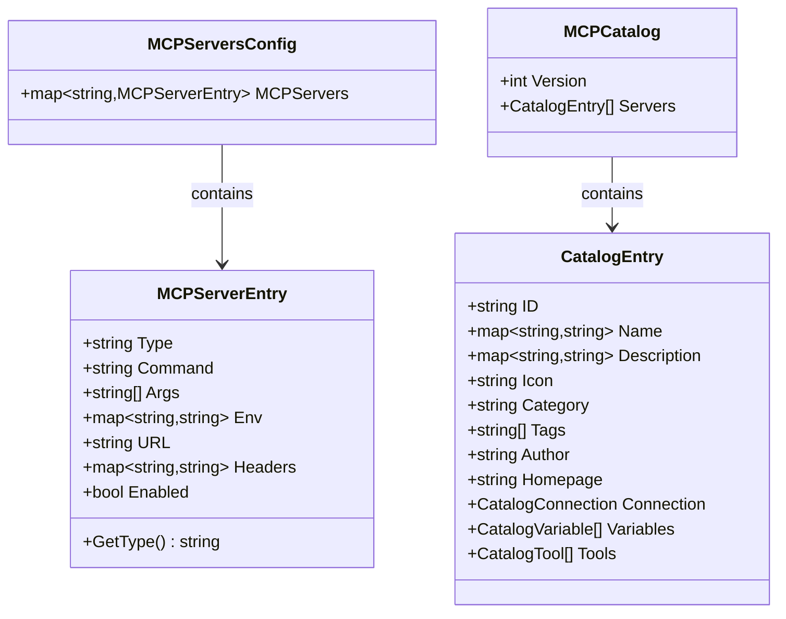

**图表来源**
- [mcp.go](file://internal/config/mcp.go#L13-L29)
- [mcp_catalog.go](file://internal/config/mcp_catalog.go#L16-L33)

**章节来源**
- [mcp.go](file://internal/config/mcp.go#L13-L64)
- [mcp_catalog.go](file://internal/config/mcp_catalog.go#L16-L65)

## 依赖关系分析

### 组件依赖图

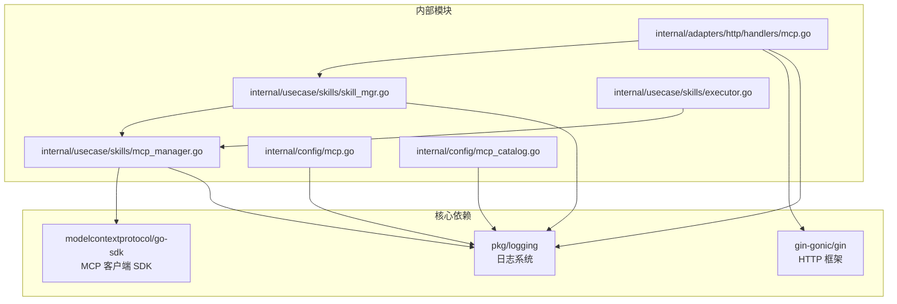

**图表来源**
- [mcp_manager.go](file://internal/usecase/skills/mcp_manager.go#L3-L15)
- [mcp.go](file://internal/adapters/http/handlers/mcp.go#L3-L11)

### 错误处理策略

MCP 管理器实现了多层次的错误处理机制：

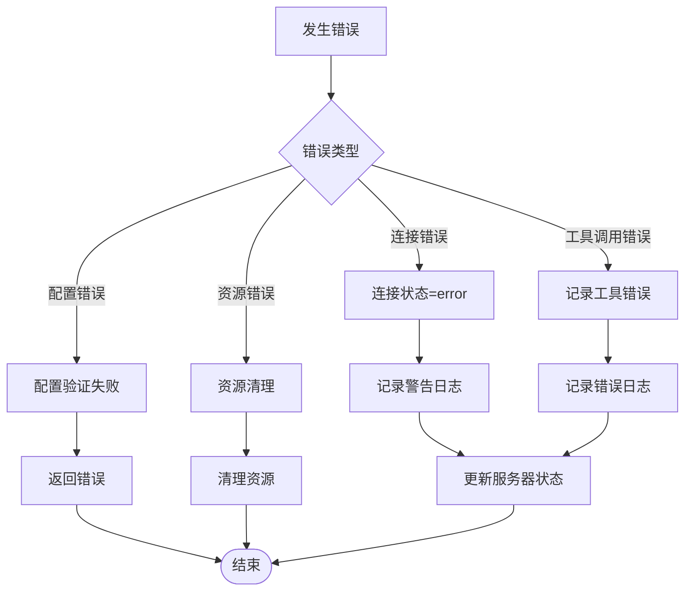

**图表来源**
- [mcp_manager.go](file://internal/usecase/skills/mcp_manager.go#L106-L114)
- [mcp_manager.go](file://internal/usecase/skills/mcp_manager.go#L190-L197)

**章节来源**
- [mcp_manager.go](file://internal/usecase/skills/mcp_manager.go#L106-L114)
- [mcp_manager.go](file://internal/usecase/skills/mcp_manager.go#L190-L197)

## 性能考虑

### 连接池管理
- 使用 RWMutex 实现读写分离，提高并发访问性能
- 连接状态缓存减少重复查询开销
- 工具列表缓存避免频繁的 ListTools 调用

### 资源优化
- 进程工作目录设置为主目录，避免路径依赖问题
- 环境变量继承机制减少配置复杂度
- SSE 传输支持连接复用和重连机制

### 内存管理
- 及时清理断开的连接和会话
- 工具描述映射使用延迟初始化
- 日志级别控制减少不必要的日志开销

## 故障排除指南

### 常见问题诊断

#### 连接失败排查
1. **检查 MCP 服务器状态**
   - 验证服务器是否正常运行
   - 检查网络连接和防火墙设置

2. **验证配置参数**
   - 确认命令路径和参数正确
   - 检查环境变量和工作目录设置

3. **查看日志信息**
   - 关注连接超时和认证失败日志
   - 检查工具发现失败的具体原因

#### 工具调用异常处理

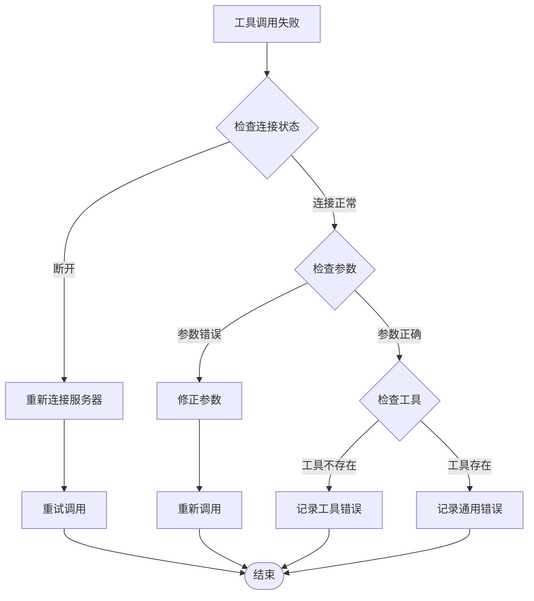

**图表来源**
- [mcp_manager.go](file://internal/usecase/skills/mcp_manager.go#L175-L180)
- [mcp_manager.go](file://internal/usecase/skills/mcp_manager.go#L190-L197)

**章节来源**
- [mcp_manager.go](file://internal/usecase/skills/mcp_manager.go#L175-L180)
- [mcp_manager.go](file://internal/usecase/skills/mcp_manager.go#L190-L197)

## 结论

MCP 管理器实现展现了优秀的软件架构设计，通过清晰的分层结构和完善的错误处理机制，为 MCP 服务器的集成提供了可靠的基础。该实现的主要优势包括：

1. **灵活性**：支持多种传输方式，适应不同部署场景
2. **可靠性**：完善的连接管理和错误恢复机制
3. **可扩展性**：模块化设计便于功能扩展和维护
4. **易用性**：简洁的 API 接口和完整的配置管理

对于开发者而言，理解这些设计原则和实现细节有助于更好地利用和扩展 MCP 功能，构建更加智能和高效的自动化解决方案。

## 附录

### API 接口说明

#### HTTP API 端点

| 端点 | 方法 | 描述 | 请求体 | 响应体 |
|------|------|------|--------|--------|
| `/api/mcp/servers` | GET | 获取所有 MCP 服务器状态 | 无 | `{servers: [], count: number}` |
| `/api/mcp/servers` | POST | 添加新的 MCP 服务器 | 见下表 | `{message: string, name: string}` |
| `/api/mcp/servers/:name` | DELETE | 删除 MCP 服务器 | 无 | `{message: string, name: string}` |
| `/api/mcp/servers/:name/restart` | POST | 重启 MCP 服务器 | 无 | `{message: string, name: string}` |
| `/api/mcp/servers/:name/tools` | GET | 获取服务器工具列表 | 无 | `{server: string, tools: [], count: number}` |
| `/api/mcp/catalog` | GET | 获取 MCP 目录信息 | 无 | `{servers: [], installed: []}` |
| `/api/mcp/catalog/install` | POST | 从目录安装 MCP 服务器 | `{id: string, variables: map}` | `{message: string, name: string}` |

#### 添加服务器请求体字段

| 字段 | 类型 | 必需 | 描述 | 默认值 |
|------|------|------|------|--------|
| name | string | 是 | 服务器名称 | - |
| type | string | 否 | 传输类型 | "stdio" |
| command | string | 否 | 命令路径 | - |
| args | string[] | 否 | 命令参数 | [] |
| env | map[string]string | 否 | 环境变量 | {} |
| url | string | 否 | SSE URL | - |
| headers | map[string]string | 否 | HTTP 头部 | {} |
| enabled | bool | 否 | 是否启用 | true |

### 配置文件格式

#### MCP 服务器配置文件 (mcp_servers.json)

```json
{
  "mcpServers": {
    "server_name": {
      "type": "stdio",
      "command": "/path/to/mcp-server",
      "args": ["--port", "8080"],
      "env": {"ENV_VAR": "value"},
      "enabled": true
    }
  }
}
```

#### 前端类型定义

```typescript
interface MCPServerEntry {
  name: string;
  type: string;
  command?: string;
  args?: string[];
  env?: Record<string, string>;
  url?: string;
  headers?: Record<string, string>;
  enabled: boolean;
}
```

**章节来源**
- [mcp.go](file://internal/adapters/http/handlers/mcp.go#L33-L90)
- [mcp_servers.json.template](file://config/mcp_servers.json.template#L1-L4)
- [types.ts](file://dashboard/src/components/mcp/types.ts#L17-L36)