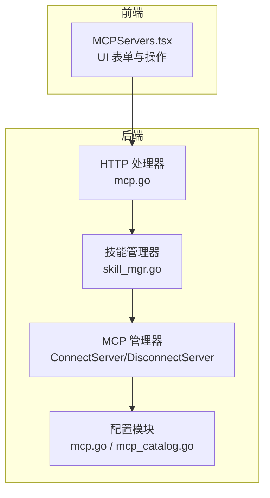
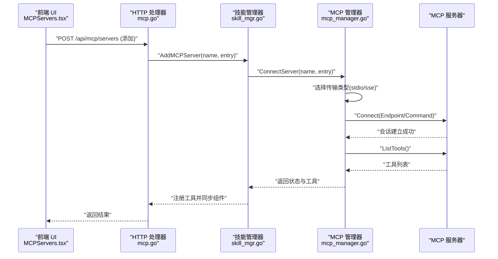
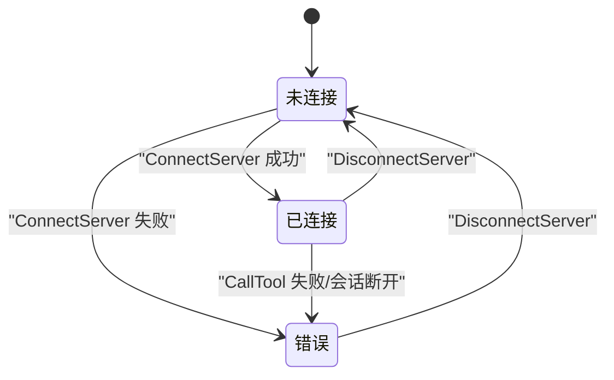
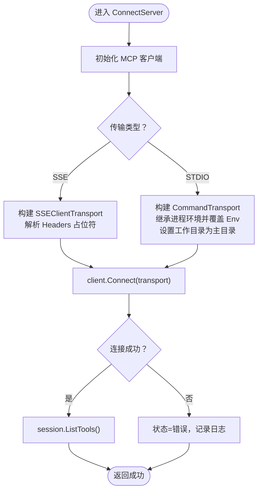
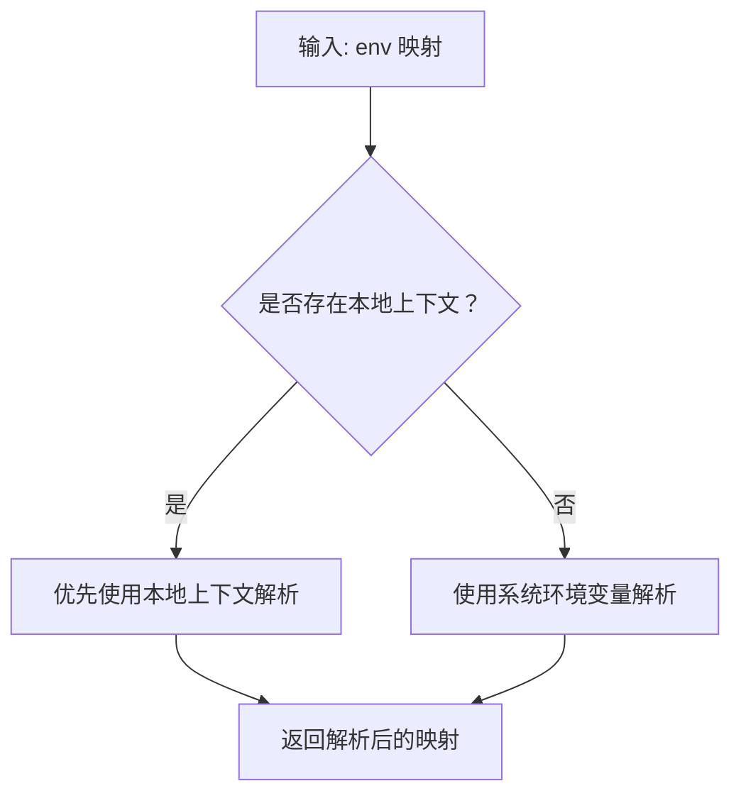
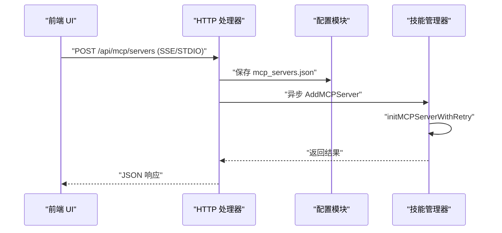
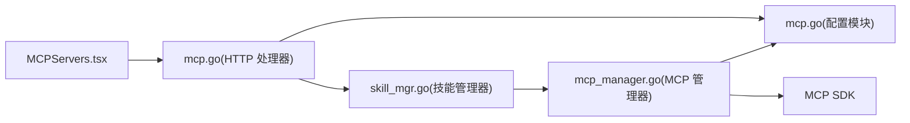

# MCP 连接管理

<cite>
**本文引用的文件**
- [internal/usecase/skills/mcp_manager.go](file://internal/usecase/skills/mcp_manager.go)
- [internal/config/mcp.go](file://internal/config/mcp.go)
- [internal/adapters/http/handlers/mcp.go](file://internal/adapters/http/handlers/mcp.go)
- [internal/usecase/skills/skill_mgr.go](file://internal/usecase/skills/skill_mgr.go)
- [internal/config/mcp_catalog.go](file://internal/config/mcp_catalog.go)
- [dashboard/src/components/MCPServers.tsx](file://dashboard/src/components/MCPServers.tsx)
- [config/mcp_servers.json.template](file://config/mcp_servers.json.template)
</cite>

## 目录
1. [简介](#简介)
2. [项目结构](#项目结构)
3. [核心组件](#核心组件)
4. [架构总览](#架构总览)
5. [详细组件分析](#详细组件分析)
6. [依赖关系分析](#依赖关系分析)
7. [性能考量](#性能考量)
8. [故障排查指南](#故障排查指南)
9. [结论](#结论)
10. [附录](#附录)

## 简介
本文件面向 MCP（Model Context Protocol）连接管理功能，围绕 ConnectServer 方法的实现机制展开，系统性解释以下内容：
- stdio 与 SSE 两种传输方式的差异、适用场景与配置要点
- 连接建立流程：客户端初始化、传输层配置、会话创建与工具发现
- 环境变量处理机制：命令行参数继承、用户配置覆盖与占位符解析
- 连接状态管理：状态枚举、状态转换与错误处理策略
- 连接配置示例与最佳实践，帮助开发者正确配置不同类型的 MCP 服务器

## 项目结构
MCP 连接管理涉及后端 Go 服务与前端 React 控制台两部分：
- 后端 Go
  - 连接管理器：负责创建客户端、选择传输、建立会话、工具发现与状态维护
  - 配置模块：负责读写 mcp_servers.json、解析环境变量占位符、目录项解析
  - HTTP 处理器：提供添加/移除/安装 MCP 服务器的 API
  - 技能管理器：负责初始化 MCP 服务器并将其工具注册为可执行技能
- 前端 React
  - MCP 服务器管理界面：支持 SSE/STDIO 两种类型配置与目录一键安装

**图表来源**
- [internal/usecase/skills/mcp_manager.go](file://internal/usecase/skills/mcp_manager.go#L49-L141)
- [internal/config/mcp.go](file://internal/config/mcp.go#L1-L105)
- [internal/adapters/http/handlers/mcp.go](file://internal/adapters/http/handlers/mcp.go#L1-L247)
- [internal/usecase/skills/skill_mgr.go](file://internal/usecase/skills/skill_mgr.go#L470-L506)
- [dashboard/src/components/MCPServers.tsx](file://dashboard/src/components/MCPServers.tsx#L62-L103)

**章节来源**
- [internal/usecase/skills/mcp_manager.go](file://internal/usecase/skills/mcp_manager.go#L49-L141)
- [internal/config/mcp.go](file://internal/config/mcp.go#L1-L105)
- [internal/adapters/http/handlers/mcp.go](file://internal/adapters/http/handlers/mcp.go#L1-L247)
- [internal/usecase/skills/skill_mgr.go](file://internal/usecase/skills/skill_mgr.go#L470-L506)
- [dashboard/src/components/MCPServers.tsx](file://dashboard/src/components/MCPServers.tsx#L62-L103)

## 核心组件
- 连接状态枚举与状态对象
  - 状态枚举：已连接、未连接、错误
  - 状态对象：包含服务器名称、配置、状态、错误信息、已发现工具等
- 连接管理器
  - 提供 ConnectServer、DisconnectServer、CallTool、GetDiscoveredTools、ListServers 等方法
  - 负责根据配置选择传输（SSE 或 STDIO）、创建会话、工具发现与状态更新
- 配置模块
  - 定义 MCPServerEntry 结构体，支持 type、command/args/env（stdio）与 url/headers（sse）
  - 提供环境变量占位符解析函数，支持本地上下文与系统环境变量
  - 提供目录项解析函数，将目录条目转换为可用的 MCPServerEntry
- HTTP 处理器
  - 对外暴露添加/移除/获取目录/从目录安装等接口
  - 支持 SSE/STDIO 的请求体字段绑定
- 技能管理器
  - 调用连接管理器建立连接并进行工具发现
  - 将工具注册为可执行技能，并同步组件与索引

**章节来源**
- [internal/usecase/skills/mcp_manager.go](file://internal/usecase/skills/mcp_manager.go#L17-L34)
- [internal/usecase/skills/mcp_manager.go](file://internal/usecase/skills/mcp_manager.go#L49-L141)
- [internal/config/mcp.go](file://internal/config/mcp.go#L13-L37)
- [internal/config/mcp.go](file://internal/config/mcp.go#L84-L105)
- [internal/config/mcp_catalog.go](file://internal/config/mcp_catalog.go#L119-L161)
- [internal/adapters/http/handlers/mcp.go](file://internal/adapters/http/handlers/mcp.go#L33-L50)
- [internal/usecase/skills/skill_mgr.go](file://internal/usecase/skills/skill_mgr.go#L470-L506)

## 架构总览
下图展示从 UI 到后端连接管理器的整体调用链路与关键交互点。

**图表来源**
- [dashboard/src/components/MCPServers.tsx](file://dashboard/src/components/MCPServers.tsx#L143-L200)
- [internal/adapters/http/handlers/mcp.go](file://internal/adapters/http/handlers/mcp.go#L33-L50)
- [internal/usecase/skills/skill_mgr.go](file://internal/usecase/skills/skill_mgr.go#L470-L506)
- [internal/usecase/skills/mcp_manager.go](file://internal/usecase/skills/mcp_manager.go#L49-L141)

## 详细组件分析

### 连接状态管理与状态转换
- 状态枚举
  - 已连接：连接成功且会话有效
  - 未连接：初始或断开后的状态
  - 错误：连接失败或调用工具时报错
- 状态转换
  - ConnectServer 成功：状态从“未连接”转为“已连接”，并缓存会话与工具列表
  - ConnectServer 失败：状态从“未连接”转为“错误”，记录错误信息
  - DisconnectServer：清空会话与工具，状态转为“未连接”
  - CallTool 失败：若底层连接断开，状态转为“错误”
- 错误处理
  - 连接失败：记录日志并返回错误
  - 工具调用失败：更新状态并返回错误
  - 断开失败：记录警告但继续清理

**图表来源**
- [internal/usecase/skills/mcp_manager.go](file://internal/usecase/skills/mcp_manager.go#L17-L34)
- [internal/usecase/skills/mcp_manager.go](file://internal/usecase/skills/mcp_manager.go#L143-L167)
- [internal/usecase/skills/mcp_manager.go](file://internal/usecase/skills/mcp_manager.go#L169-L204)

**章节来源**
- [internal/usecase/skills/mcp_manager.go](file://internal/usecase/skills/mcp_manager.go#L17-L34)
- [internal/usecase/skills/mcp_manager.go](file://internal/usecase/skills/mcp_manager.go#L143-L167)
- [internal/usecase/skills/mcp_manager.go](file://internal/usecase/skills/mcp_manager.go#L169-L204)

### ConnectServer 实现机制
- 客户端初始化
  - 创建 MCP 客户端实例，设置实现标识（名称与版本）
- 传输层配置
  - SSE：基于 Endpoint 构造 SSEClientTransport；若配置 Headers，则解析占位符并注入到 HTTP 客户端
  - STDIO：基于 Command 与 Args 构造 CommandTransport；继承当前进程环境变量，再叠加用户配置的 Env；工作目录设为用户主目录
- 会话创建
  - 调用 client.Connect 建立会话；失败则更新状态为“错误”
- 工具发现
  - 成功建立会话后调用 ListTools 获取工具列表；失败记录错误信息但不中断整体流程

**图表来源**
- [internal/usecase/skills/mcp_manager.go](file://internal/usecase/skills/mcp_manager.go#L66-L105)
- [internal/usecase/skills/mcp_manager.go](file://internal/usecase/skills/mcp_manager.go#L120-L137)

**章节来源**
- [internal/usecase/skills/mcp_manager.go](file://internal/usecase/skills/mcp_manager.go#L49-L141)

### 传输方式对比与适用场景
- SSE（服务端推送）
  - 适合远程 HTTP SSE 服务器，便于跨主机部署与统一认证
  - 需要配置 URL 与 Headers；Headers 支持环境变量占位符解析
- STDIO（标准输入输出）
  - 适合本地子进程，常用于 npm 包（如 npx）启动的 MCP 服务器
  - 需要配置 Command 与 Args；Env 可覆盖系统环境变量
  - 工作目录固定为主目录，避免受当前进程工作目录影响

**章节来源**
- [internal/usecase/skills/mcp_manager.go](file://internal/usecase/skills/mcp_manager.go#L73-L103)
- [internal/config/mcp.go](file://internal/config/mcp.go#L17-L29)

### 环境变量处理机制
- 占位符解析
  - 支持 ${VAR_NAME} 形式的占位符
  - 优先从本地上下文（localEnv）解析，否则回退到系统环境变量
- SSE 场景
  - Headers 中的占位符通过 ResolveEnvVarsWithContext 解析，结合 entry.Env 作为本地上下文
- STDIO 场景
  - Env 中的占位符通过 ResolveEnvVars 解析，最终合并到子进程环境变量
- 目录项解析
  - 目录中的 URL/Args/Headers/Env 支持占位符替换，生成可用的 MCPServerEntry

**图表来源**
- [internal/config/mcp.go](file://internal/config/mcp.go#L89-L105)
- [internal/config/mcp_catalog.go](file://internal/config/mcp_catalog.go#L119-L161)

**章节来源**
- [internal/config/mcp.go](file://internal/config/mcp.go#L84-L105)
- [internal/config/mcp_catalog.go](file://internal/config/mcp_catalog.go#L119-L161)

### 连接配置示例与最佳实践
- 配置文件模板
  - mcp_servers.json 默认为空对象，用于存放多个 MCP 服务器配置
- 示例字段
  - type：传输类型（stdio 或 sse，默认 stdio）
  - command/args/env：stdio 场景的命令、参数与环境变量
  - url/headers：sse 场景的端点与请求头
  - enabled：是否启用
- 最佳实践
  - SSE：建议将认证令牌放入 Headers，并使用占位符从系统环境或本地变量解析
  - STDIO：建议明确指定工作目录（管理器已设为主目录），合理设置 Env 以避免权限问题
  - 超时与重试：STDIO 类型因冷启动较慢，连接超时时间更长；连接失败时按策略重试
  - 工具发现：首次连接后自动列出工具，建议在 UI 展示并记录工具描述与标签

**章节来源**
- [config/mcp_servers.json.template](file://config/mcp_servers.json.template#L1-L3)
- [internal/config/mcp.go](file://internal/config/mcp.go#L13-L37)
- [internal/usecase/skills/skill_mgr.go](file://internal/usecase/skills/skill_mgr.go#L395-L402)

### HTTP 接口与前端交互
- 添加服务器
  - 支持 SSE/STDIO 的请求体字段绑定
  - 异步连接服务器，不阻塞 HTTP 响应
- 目录安装
  - 校验目录变量（必填与默认值）
  - 解析目录条目为 MCPServerEntry 并持久化配置
- 前端 UI
  - 支持切换 SSE/STDIO 类型，动态渲染对应表单项
  - 提供工具列表查看与状态展示

**图表来源**
- [internal/adapters/http/handlers/mcp.go](file://internal/adapters/http/handlers/mcp.go#L33-L50)
- [internal/adapters/http/handlers/mcp.go](file://internal/adapters/http/handlers/mcp.go#L183-L247)
- [internal/usecase/skills/skill_mgr.go](file://internal/usecase/skills/skill_mgr.go#L404-L449)

**章节来源**
- [internal/adapters/http/handlers/mcp.go](file://internal/adapters/http/handlers/mcp.go#L33-L50)
- [internal/adapters/http/handlers/mcp.go](file://internal/adapters/http/handlers/mcp.go#L183-L247)
- [dashboard/src/components/MCPServers.tsx](file://dashboard/src/components/MCPServers.tsx#L309-L353)

## 依赖关系分析
- 组件耦合
  - MCP 管理器依赖配置模块（解析占位符、读取配置）
  - 技能管理器依赖 MCP 管理器（建立连接、工具发现）
  - HTTP 处理器依赖配置模块（保存/加载配置）与技能管理器（异步连接）
  - 前端 UI 依赖 HTTP 处理器（获取服务器列表、目录、安装）
- 外部依赖
  - MCP SDK：提供 Transport、Client、ClientSession、ListTools、CallTool 等能力
  - HTTP 客户端：SSE 传输中用于注入自定义 Header

**图表来源**
- [internal/usecase/skills/mcp_manager.go](file://internal/usecase/skills/mcp_manager.go#L1-L15)
- [internal/config/mcp.go](file://internal/config/mcp.go#L1-L105)
- [internal/adapters/http/handlers/mcp.go](file://internal/adapters/http/handlers/mcp.go#L1-L23)
- [internal/usecase/skills/skill_mgr.go](file://internal/usecase/skills/skill_mgr.go#L1-L34)
- [dashboard/src/components/MCPServers.tsx](file://dashboard/src/components/MCPServers.tsx#L62-L103)

**章节来源**
- [internal/usecase/skills/mcp_manager.go](file://internal/usecase/skills/mcp_manager.go#L1-L15)
- [internal/config/mcp.go](file://internal/config/mcp.go#L1-L105)
- [internal/adapters/http/handlers/mcp.go](file://internal/adapters/http/handlers/mcp.go#L1-L23)
- [internal/usecase/skills/skill_mgr.go](file://internal/usecase/skills/skill_mgr.go#L1-L34)
- [dashboard/src/components/MCPServers.tsx](file://dashboard/src/components/MCPServers.tsx#L62-L103)

## 性能考量
- 连接超时
  - SSE：默认较短超时，适合快速探测
  - STDIO：默认较长超时，考虑冷启动（如 npx 下载/安装）耗时
- 重试策略
  - 仅对超时/临时网络错误进行有限次重试，避免对不可恢复错误重复尝试
- 工具发现
  - 首次连接后缓存工具列表，减少后续调用成本
- 日志与可观测性
  - 关键路径均记录日志，便于定位连接失败原因

**章节来源**
- [internal/usecase/skills/skill_mgr.go](file://internal/usecase/skills/skill_mgr.go#L395-L402)
- [internal/usecase/skills/skill_mgr.go](file://internal/usecase/skills/skill_mgr.go#L404-L449)
- [internal/usecase/skills/mcp_manager.go](file://internal/usecase/skills/mcp_manager.go#L120-L137)

## 故障排查指南
- 常见错误与处理
  - 连接超时：检查网络连通性、SSE 端点可达性；适当增加超时或重试间隔
  - 进程崩溃（EOF）：STDIO 子进程启动后立即退出，需检查命令、参数与环境变量
  - 协议不兼容（Method Not Allowed）：确认服务器版本与客户端实现兼容
- 日志定位
  - 连接失败：查看“MCP server 连接失败”相关日志
  - 工具发现失败：查看“MCP server 工具发现失败”相关日志
  - 断开失败：查看“MCP server 关闭失败”相关日志
- 建议步骤
  - 先验证 SSE 端点与认证头；再验证 STDIO 命令与工作目录
  - 使用最小化配置复现问题，逐步加入变量与参数
  - 查看工具列表与描述，确认工具发现是否成功

**章节来源**
- [internal/usecase/skills/mcp_manager.go](file://internal/usecase/skills/mcp_manager.go#L106-L113)
- [internal/usecase/skills/mcp_manager.go](file://internal/usecase/skills/mcp_manager.go#L122-L126)
- [internal/usecase/skills/mcp_manager.go](file://internal/usecase/skills/mcp_manager.go#L153-L158)
- [internal/usecase/skills/skill_mgr.go](file://internal/usecase/skills/skill_mgr.go#L451-L468)

## 结论
MCP 连接管理通过清晰的状态模型与稳健的传输抽象，实现了 SSE 与 STDIO 两种模式的统一接入。配合完善的环境变量解析、工具发现与重试机制，开发者可以快速、可靠地集成各类 MCP 服务器。建议在生产环境中优先采用 SSE 并严格管理认证头，STDIO 则适用于本地开发与调试场景，并注意冷启动与工作目录的影响。

## 附录
- 关键实现路径参考
  - 连接建立与状态管理：[internal/usecase/skills/mcp_manager.go](file://internal/usecase/skills/mcp_manager.go#L49-L141)
  - 环境变量解析：[internal/config/mcp.go](file://internal/config/mcp.go#L84-L105)
  - 目录项解析为配置：[internal/config/mcp_catalog.go](file://internal/config/mcp_catalog.go#L119-L161)
  - HTTP 接口与异步连接：[internal/adapters/http/handlers/mcp.go](file://internal/adapters/http/handlers/mcp.go#L33-L50), [internal/adapters/http/handlers/mcp.go](file://internal/adapters/http/handlers/mcp.go#L237-L247)
  - 技能注册与工具发现：[internal/usecase/skills/skill_mgr.go](file://internal/usecase/skills/skill_mgr.go#L470-L506)
  - 前端表单与类型切换：[dashboard/src/components/MCPServers.tsx](file://dashboard/src/components/MCPServers.tsx#L309-L353)