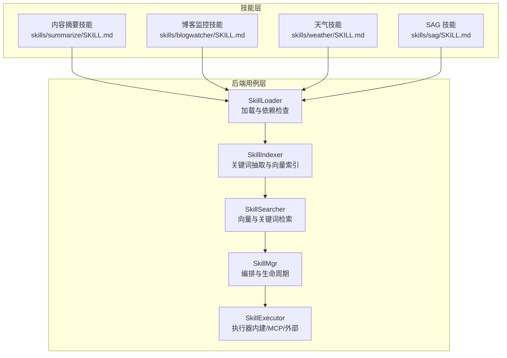
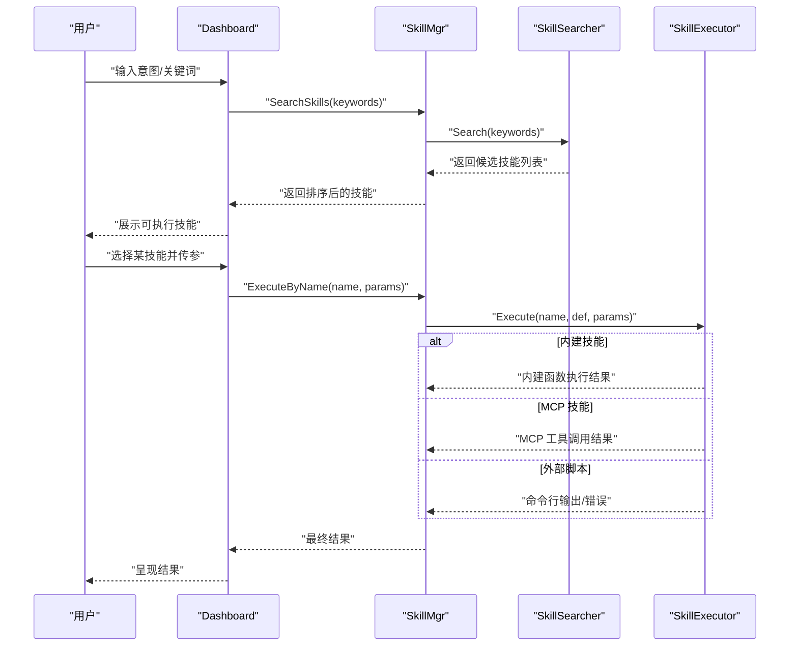
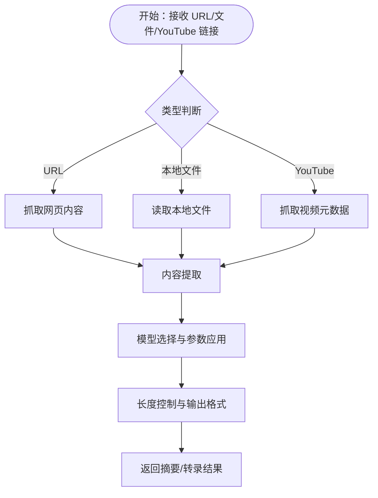
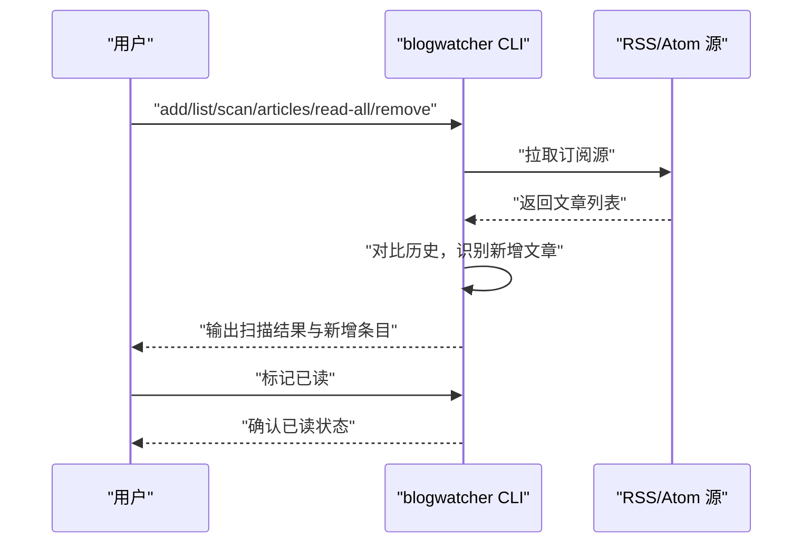
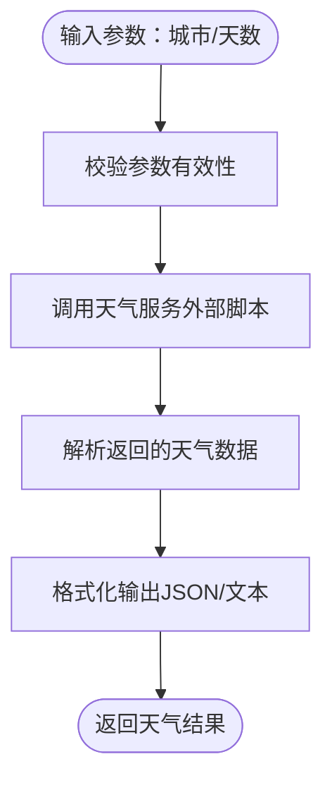
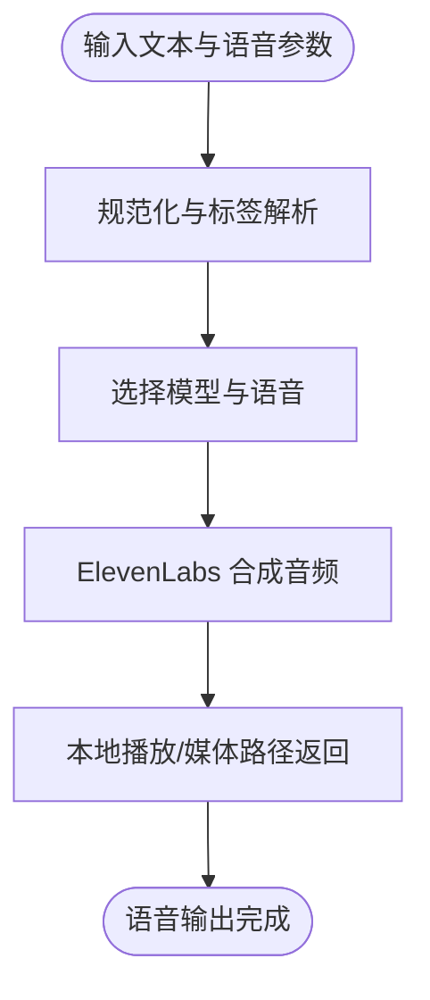
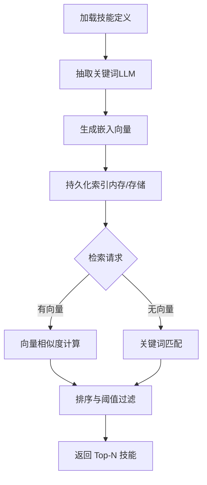
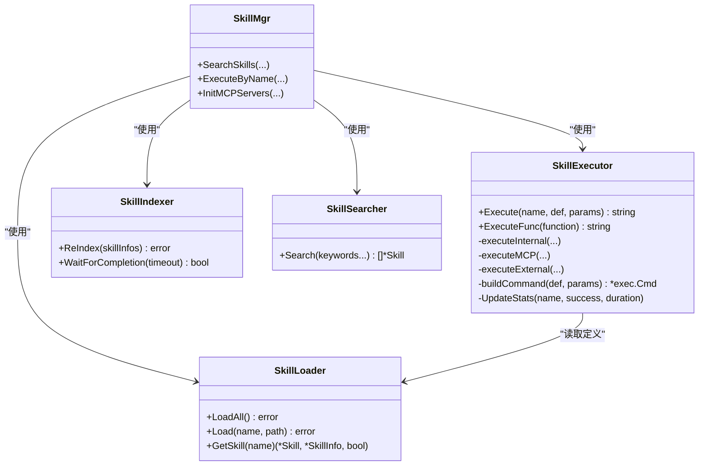
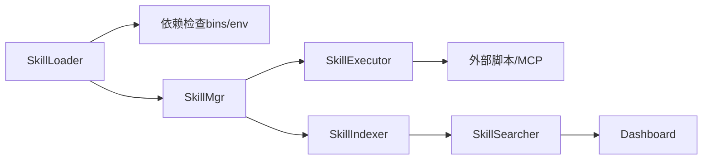

# 专业工具类技能

<cite>
**本文引用的文件**
- [skills/summarize/SKILL.md](file://skills/summarize/SKILL.md)
- [skills/blogwatcher/SKILL.md](file://skills/blogwatcher/SKILL.md)
- [skills/weather/SKILL.md](file://skills/weather/SKILL.md)
- [skills/sag/SKILL.md](file://skills/sag/SKILL.md)
- [internal/usecase/skills/indexer.go](file://internal/usecase/skills/indexer.go)
- [internal/usecase/skills/searcher.go](file://internal/usecase/skills/searcher.go)
- [internal/usecase/skills/skill_mgr.go](file://internal/usecase/skills/skill_mgr.go)
- [internal/usecase/skills/executor.go](file://internal/usecase/skills/executor.go)
- [internal/usecase/skills/loader.go](file://internal/usecase/skills/loader.go)
- [internal/usecase/skills/SKILL_DEVELOPMENT.md](file://internal/usecase/skills/SKILL_DEVELOPMENT.md)
- [dashboard/src/components/skills/SkillFilters.tsx](file://dashboard/src/components/skills/SkillFilters.tsx)
- [dashboard/src/components/Skills.tsx](file://dashboard/src/components/Skills.tsx)
</cite>

## 目录
1. [简介](#简介)
2. [项目结构](#项目结构)
3. [核心组件](#核心组件)
4. [架构总览](#架构总览)
5. [详细组件分析](#详细组件分析)
6. [依赖关系分析](#依赖关系分析)
7. [性能考量](#性能考量)
8. [故障排查指南](#故障排查指南)
9. [结论](#结论)
10. [附录](#附录)

## 简介
本文件面向 MindX 专业工具类技能，围绕以下四类技能进行系统化说明：
- 内容摘要技能：从 URL、本地文件与视频中提取摘要与转录文本，具备长度控制与多模型支持。
- 博客监控技能：跟踪博客与 RSS/Atom 源更新，支持增量扫描与已读标记。
- 天气技能：查询全球城市天气与短期预报，支持参数化城市与天数。
- SAG 技能：基于 ElevenLabs 的高质量 TTS，支持语音选择、音频标签与聊天语音回复。

同时，文档阐述了技能的语义索引与检索机制、执行器的调度策略、以及在前端的可视化与配置优化建议。

## 项目结构
MindX 的专业工具类技能位于 skills 目录下，每项技能以 SKILL.md 描述其元数据与使用方式；后端通过内部 usecase 层实现技能加载、索引、检索与执行，并在 dashboard 提供可视化界面。

图示来源
- [internal/usecase/skills/loader.go](file://internal/usecase/skills/loader.go#L35-L123)
- [internal/usecase/skills/indexer.go](file://internal/usecase/skills/indexer.go#L116-L176)
- [internal/usecase/skills/searcher.go](file://internal/usecase/skills/searcher.go#L42-L62)
- [internal/usecase/skills/skill_mgr.go](file://internal/usecase/skills/skill_mgr.go#L87-L98)
- [internal/usecase/skills/executor.go](file://internal/usecase/skills/executor.go#L57-L79)

章节来源
- [internal/usecase/skills/loader.go](file://internal/usecase/skills/loader.go#L35-L123)
- [internal/usecase/skills/skill_mgr.go](file://internal/usecase/skills/skill_mgr.go#L36-L84)

## 核心组件
- 技能加载器（SkillLoader）：扫描 skills 目录，解析 SKILL.md，检查二进制与环境依赖，构建技能信息与状态。
- 索引器（SkillIndexer）：从技能定义中抽取关键词，生成嵌入向量，持久化索引，支持异步队列与断点续载。
- 检索器（SkillSearcher）：基于向量相似度与关键词匹配进行技能检索，提供回退策略。
- 执行器（SkillExecutor）：根据技能类型（内建、MCP、外部脚本）执行命令，记录统计与错误。
- 管理器（SkillMgr）：协调加载、索引、检索与执行，提供 MCP 服务器初始化与动态增删。

章节来源
- [internal/usecase/skills/indexer.go](file://internal/usecase/skills/indexer.go#L116-L176)
- [internal/usecase/skills/searcher.go](file://internal/usecase/skills/searcher.go#L72-L188)
- [internal/usecase/skills/executor.go](file://internal/usecase/skills/executor.go#L57-L195)
- [internal/usecase/skills/skill_mgr.go](file://internal/usecase/skills/skill_mgr.go#L87-L98)

## 架构总览
下面的序列图展示了从用户发起到技能执行的关键流程，包括向量索引与检索的协同。

图示来源
- [internal/usecase/skills/skill_mgr.go](file://internal/usecase/skills/skill_mgr.go#L228-L230)
- [internal/usecase/skills/executor.go](file://internal/usecase/skills/executor.go#L57-L79)

## 详细组件分析

### 内容摘要技能（Summarize）
- 功能概述
  - 支持 URL、本地文件与 YouTube 链接的摘要与转录。
  - 提供长度控制参数与多模型支持，适合不同场景的输出需求。
- 关键特性
  - YouTube 转录与摘要的差异化参数，便于在内容过大时先给出紧凑摘要再展开。
  - 支持后备提取（Firecrawl、Apify）与模型密钥配置。
- 使用场景
  - 快速理解长文章/视频内容，辅助知识整理与学习。
  - 对大体量内容进行分段展开，提升交互体验。

图示来源
- [skills/summarize/SKILL.md](file://skills/summarize/SKILL.md#L27-L87)

章节来源
- [skills/summarize/SKILL.md](file://skills/summarize/SKILL.md#L27-L87)

### 博客监控技能（BlogWatcher）
- 功能概述
  - 跟踪博客与 RSS/Atom 源更新，支持添加/列出/扫描/标记已读等操作。
- 关键特性
  - 增量扫描：仅返回新增文章，减少无效通知。
  - 已读标记：支持单篇与批量标记，便于维护阅读状态。
- 使用场景
  - 订阅技术博客、新闻源，自动推送最新文章。
  - 团队知识库的自动化内容采集与提醒。

图示来源
- [skills/blogwatcher/SKILL.md](file://skills/blogwatcher/SKILL.md#L27-L70)

章节来源
- [skills/blogwatcher/SKILL.md](file://skills/blogwatcher/SKILL.md#L27-L70)

### 天气技能（Weather）
- 功能概述
  - 查询全球城市天气与短期预报，支持城市名与查询天数参数。
- 关键特性
  - 参数化接口：city 与 days 明确输入约束。
  - 与后端执行器配合，通过命令行脚本实现外部调用。
- 使用场景
  - 日常出行规划、旅行安排与气候关注。
  - 与其他技能组合，形成“查询-提醒”的自动化工作流。

图示来源
- [skills/weather/SKILL.md](file://skills/weather/SKILL.md#L19-L42)
- [internal/usecase/skills/executor.go](file://internal/usecase/skills/executor.go#L138-L195)

章节来源
- [skills/weather/SKILL.md](file://skills/weather/SKILL.md#L19-L42)
- [internal/usecase/skills/executor.go](file://internal/usecase/skills/executor.go#L138-L195)

### SAG 技能（语音合成）
- 功能概述
  - 基于 ElevenLabs 的高质量 TTS，支持语音选择、音频标签与聊天语音回复。
- 关键特性
  - 多模型与语音 ID 支持，满足不同表达风格。
  - v3/v2/v2.5 的发音与交付规则差异，需按版本正确配置。
- 使用场景
  - 文字转语音播报、语音助手回复、多媒体内容配音。

图示来源
- [skills/sag/SKILL.md](file://skills/sag/SKILL.md#L29-L90)

章节来源
- [skills/sag/SKILL.md](file://skills/sag/SKILL.md#L29-L90)

### 技能语义索引与检索（后端机制）
- 关键机制
  - 从技能定义中抽取关键词，结合嵌入向量与关键词匹配，实现高效检索。
  - 异步索引队列与持久化，支持断点续跑与后台重建。
- 算法要点
  - 向量相似度采用余弦相似度，阈值与排序策略保证召回质量。
  - 当向量表为空或生成失败时，回退到关键词匹配。

图示来源
- [internal/usecase/skills/indexer.go](file://internal/usecase/skills/indexer.go#L116-L176)
- [internal/usecase/skills/searcher.go](file://internal/usecase/skills/searcher.go#L72-L188)

章节来源
- [internal/usecase/skills/indexer.go](file://internal/usecase/skills/indexer.go#L116-L176)
- [internal/usecase/skills/searcher.go](file://internal/usecase/skills/searcher.go#L72-L188)

### 技能执行器（后端机制）
- 执行类型
  - 内建技能：直接调用内置函数，性能最优。
  - MCP 技能：通过 MCP 管理器调用外部工具，支持并发与重试。
  - 外部脚本：解析命令行与参数，通过 stdin 传递 JSON，捕获 stdout/stderr。
- 统计与持久化
  - 成功/失败次数、执行耗时、平均耗时与最近运行时间，持久化存储便于诊断。

图示来源
- [internal/usecase/skills/executor.go](file://internal/usecase/skills/executor.go#L57-L195)
- [internal/usecase/skills/loader.go](file://internal/usecase/skills/loader.go#L60-L123)
- [internal/usecase/skills/indexer.go](file://internal/usecase/skills/indexer.go#L188-L253)
- [internal/usecase/skills/searcher.go](file://internal/usecase/skills/searcher.go#L42-L62)
- [internal/usecase/skills/skill_mgr.go](file://internal/usecase/skills/skill_mgr.go#L87-L98)

章节来源
- [internal/usecase/skills/executor.go](file://internal/usecase/skills/executor.go#L57-L195)
- [internal/usecase/skills/loader.go](file://internal/usecase/skills/loader.go#L60-L123)
- [internal/usecase/skills/skill_mgr.go](file://internal/usecase/skills/skill_mgr.go#L87-L98)

## 依赖关系分析
- 技能定义依赖
  - 二进制依赖（bins）与环境变量（env）由加载器检查，决定技能能否运行。
- 执行依赖
  - 外部脚本通过命令行与 JSON 参数交互；MCP 技能通过 MCP 管理器连接远端工具。
- 前端依赖
  - Dashboard 提供技能状态筛选与操作入口，支持一键安装、转换与环境配置。

图示来源
- [internal/usecase/skills/loader.go](file://internal/usecase/skills/loader.go#L186-L204)
- [internal/usecase/skills/executor.go](file://internal/usecase/skills/executor.go#L138-L195)
- [internal/usecase/skills/skill_mgr.go](file://internal/usecase/skills/skill_mgr.go#L36-L84)
- [dashboard/src/components/skills/SkillFilters.tsx](file://dashboard/src/components/skills/SkillFilters.tsx#L1-L31)

章节来源
- [internal/usecase/skills/loader.go](file://internal/usecase/skills/loader.go#L186-L204)
- [dashboard/src/components/skills/SkillFilters.tsx](file://dashboard/src/components/skills/SkillFilters.tsx#L1-L31)

## 性能考量
- 向量检索
  - 通过余弦相似度与阈值过滤，减少无效匹配；当向量表为空时自动回退关键词匹配。
- 异步索引
  - 索引器使用队列与持久化文件，支持后台重建与断点续跑，避免阻塞主线程。
- 执行超时
  - 外部脚本与 MCP 调用均设置超时，防止长时间阻塞；MCP 连接支持重试与不可重试错误区分。
- 统计与可观测
  - 执行器记录成功/失败次数、平均耗时与最近运行时间，便于性能优化与故障定位。

章节来源
- [internal/usecase/skills/searcher.go](file://internal/usecase/skills/searcher.go#L72-L188)
- [internal/usecase/skills/indexer.go](file://internal/usecase/skills/indexer.go#L446-L516)
- [internal/usecase/skills/executor.go](file://internal/usecase/skills/executor.go#L117-L121)
- [internal/usecase/skills/skill_mgr.go](file://internal/usecase/skills/skill_mgr.go#L406-L449)

## 故障排查指南
- 依赖缺失
  - 若报错“技能未找到”或“命令格式错误”，检查 SKILL.md 中的 requires.bins 与环境变量是否满足。
- 执行失败
  - 查看执行器日志与返回的 stderr；对于外部脚本，确认 JSON 参数是否正确传入。
- 索引异常
  - 若检索效果不佳，尝试触发后台重建索引；查看索引器队列文件与持久化状态。
- MCP 连接问题
  - 对于超时/网络错误进行重试；若为协议不兼容或进程崩溃，需检查 MCP 服务器配置与版本。

章节来源
- [internal/usecase/skills/loader.go](file://internal/usecase/skills/loader.go#L186-L204)
- [internal/usecase/skills/executor.go](file://internal/usecase/skills/executor.go#L179-L190)
- [internal/usecase/skills/indexer.go](file://internal/usecase/skills/indexer.go#L446-L516)
- [internal/usecase/skills/skill_mgr.go](file://internal/usecase/skills/skill_mgr.go#L406-L449)

## 结论
MindX 的专业工具类技能通过标准化的 SKILL.md 元数据与后端用例层实现了高内聚、低耦合的技能体系。内容摘要、博客监控、天气查询与语音合成四大技能覆盖了信息获取、内容消费、日常查询与语音交互等高频场景；语义索引与检索、异步索引与执行超时保障了系统的可用性与性能；前端可视化进一步提升了运维与使用的便捷性。

## 附录
- 开发与测试建议
  - 在 SKILL.md 中编写清晰的 description 与合理 tags，有助于提升检索质量。
  - 本地测试遵循“stdin JSON 输入、stdout JSON 输出、stderr 错误输出”的规范。
  - MCP 技能通过 metadata.mcp 标注，实现与标准技能一致的体验。

章节来源
- [internal/usecase/skills/SKILL_DEVELOPMENT.md](file://internal/usecase/skills/SKILL_DEVELOPMENT.md#L199-L268)
- [internal/usecase/skills/SKILL_DEVELOPMENT.md](file://internal/usecase/skills/SKILL_DEVELOPMENT.md#L341-L416)
- [dashboard/src/components/Skills.tsx](file://dashboard/src/components/Skills.tsx#L1-L291)