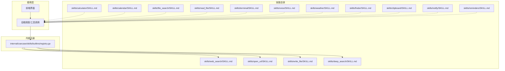
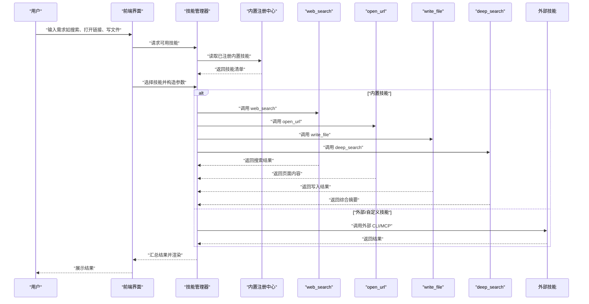
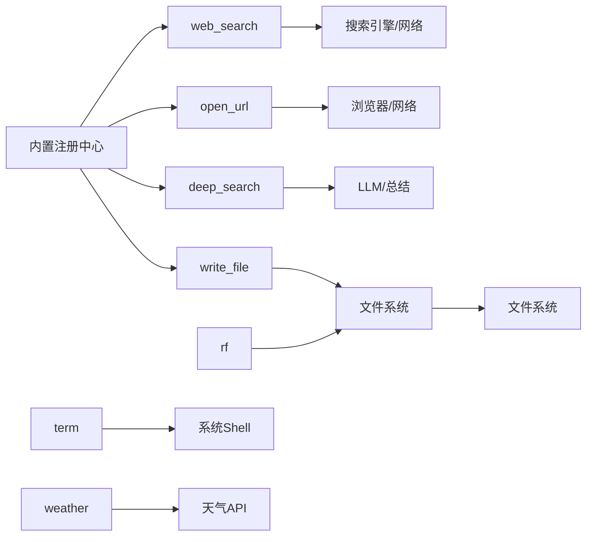

# 内置技能集合

<cite>
**本文档引用的文件**
- [README.md](file://README.md)
- [internal/usecase/skills/builtins/registry.go](file://internal/usecase/skills/builtins/registry.go)
- [skills/calculator/SKILL.md](file://skills/calculator/SKILL.md)
- [skills/calendar/SKILL.md](file://skills/calendar/SKILL.md)
- [skills/web_search/SKILL.md](file://skills/web_search/SKILL.md)
- [skills/open_url/SKILL.md](file://skills/open_url/SKILL.md)
- [skills/write_file/SKILL.md](file://skills/write_file/SKILL.md)
- [skills/deep_search/SKILL.md](file://skills/deep_search/SKILL.md)
- [skills/file_search/SKILL.md](file://skills/file_search/SKILL.md)
- [skills/read_file/SKILL.md](file://skills/read_file/SKILL.md)
- [skills/terminal/SKILL.md](file://skills/terminal/SKILL.md)
- [skills/voice/SKILL.md](file://skills/voice/SKILL.md)
- [skills/weather/SKILL.md](file://skills/weather/SKILL.md)
- [skills/finder/SKILL.md](file://skills/finder/SKILL.md)
- [skills/clipboard/SKILL.md](file://skills/clipboard/SKILL.md)
- [skills/notify/SKILL.md](file://skills/notify/SKILL.md)
- [skills/reminders/SKILL.md](file://skills/reminders/SKILL.md)
</cite>

## 目录
1. [简介](#简介)
2. [项目结构](#项目结构)
3. [核心组件](#核心组件)
4. [架构总览](#架构总览)
5. [详细组件分析](#详细组件分析)
6. [依赖关系分析](#依赖关系分析)
7. [性能考量](#性能考量)
8. [故障排查指南](#故障排查指南)
9. [结论](#结论)
10. [附录](#附录)

## 简介
本文件为 MindX 内置技能集合的权威参考文档，覆盖计算器、日历、搜索、文件操作、系统信息、网络工具、终端命令、语音播报、天气查询、Finder 文件管理、剪贴板、系统通知、提醒事项等技能。文档面向不同技术背景的读者，提供技能功能特性、配置参数、输入输出格式、使用示例、依赖关系与组合使用方法、性能特点与适用场景、扩展与定制方法、最佳实践与常见问题解决方案，并给出技能选择与使用的决策指导。

## 项目结构
MindX 的技能体系由“技能目录 + 内核注册 + 使用层”三层构成：
- 技能目录：位于 skills/ 目录下，每个技能以独立子目录呈现，包含技能元数据文件 SKILL.md 与对应的 CLI 实现。
- 内核注册：在内核中通过注册表集中注册内置技能，决定哪些技能可用以及如何加载。
- 使用层：前端界面与后端调度层根据用户意图调用相应技能，传递参数并解析结果。

**图表来源**
- [internal/usecase/skills/builtins/registry.go](file://internal/usecase/skills/builtins/registry.go#L15-L29)
- [skills/calculator/SKILL.md](file://skills/calculator/SKILL.md#L1-L37)
- [skills/calendar/SKILL.md](file://skills/calendar/SKILL.md#L1-L54)
- [skills/web_search/SKILL.md](file://skills/web_search/SKILL.md#L1-L67)
- [skills/open_url/SKILL.md](file://skills/open_url/SKILL.md#L1-L70)
- [skills/write_file/SKILL.md](file://skills/write_file/SKILL.md#L1-L99)
- [skills/deep_search/SKILL.md](file://skills/deep_search/SKILL.md#L1-L91)
- [skills/file_search/SKILL.md](file://skills/file_search/SKILL.md#L1-L100)
- [skills/read_file/SKILL.md](file://skills/read_file/SKILL.md#L1-L68)
- [skills/terminal/SKILL.md](file://skills/terminal/SKILL.md#L1-L42)
- [skills/voice/SKILL.md](file://skills/voice/SKILL.md#L1-L41)
- [skills/weather/SKILL.md](file://skills/weather/SKILL.md#L1-L43)
- [skills/finder/SKILL.md](file://skills/finder/SKILL.md#L1-L41)
- [skills/clipboard/SKILL.md](file://skills/clipboard/SKILL.md#L1-L40)
- [skills/notify/SKILL.md](file://skills/notify/SKILL.md#L1-L45)
- [skills/reminders/SKILL.md](file://skills/reminders/SKILL.md#L1-L50)

**章节来源**
- [README.md](file://README.md#L1-L215)
- [internal/usecase/skills/builtins/registry.go](file://internal/usecase/skills/builtins/registry.go#L15-L29)

## 核心组件
- 内置技能注册中心：负责将内置技能（如网页搜索、打开 URL、写文件、深度搜索、定时任务等）注册到技能管理器，供上层调用。
- 技能目录：每个技能以独立目录存放，包含元数据文件 SKILL.md（描述、参数、示例、输出格式等）与对应的 CLI 实现。
- 使用层：前端界面与后端调度层根据用户意图选择合适技能，构造参数并解析结果，实现端到端的工具链路。

**章节来源**
- [internal/usecase/skills/builtins/registry.go](file://internal/usecase/skills/builtins/registry.go#L15-L29)

## 架构总览
以下序列图展示了“用户意图 → 技能选择 → 参数构造 → 调用执行 → 结果返回”的典型流程，重点体现内置技能的注册与调用关系。

**图表来源**
- [internal/usecase/skills/builtins/registry.go](file://internal/usecase/skills/builtins/registry.go#L15-L29)
- [skills/web_search/SKILL.md](file://skills/web_search/SKILL.md#L17-L22)
- [skills/open_url/SKILL.md](file://skills/open_url/SKILL.md#L21-L26)
- [skills/write_file/SKILL.md](file://skills/write_file/SKILL.md#L17-L30)
- [skills/deep_search/SKILL.md](file://skills/deep_search/SKILL.md#L27-L32)

## 详细组件分析

### 计算器技能（calculator）
- 功能概述：执行数学表达式计算，支持基本运算与函数表达式。
- 关键参数
  - expression（字符串，必填）：数学表达式，如“2+3*4”、“sin(0.5)”。
- 输入输出
  - 输入：JSON 对象，包含 name 与 parameters.expression。
  - 输出：由 CLI 实现返回，通常为数值或表达式结果。
- 使用示例：参见 SKILL.md 中的 JSON 示例。
- 适用场景：快速计算、公式求值、科学计算辅助。
- 性能特点：本地 CLI 执行，延迟低；超时时间由技能配置控制。
- 依赖关系：无外部依赖，直接调用本地 CLI。
- 扩展与定制：可增加更多数学函数支持或自定义表达式解析器。

**章节来源**
- [skills/calculator/SKILL.md](file://skills/calculator/SKILL.md#L1-L37)

### 日历技能（calendar）
- 功能概述：查看、创建日历事件与日程安排。
- 关键参数
  - action（字符串，必填）：“list”列出事件、“create”创建事件。
  - title（字符串，可选）：事件标题（创建时需要）。
  - start_date（字符串，可选）：开始日期（格式 YYYY/MM/DD，创建时需要）。
  - end_date（字符串，可选）：结束日期（格式 YYYY/MM/DD）。
  - days（整数，可选）：列出未来几天的事件，默认 7 天。
- 输入输出
  - 输入：JSON 对象，包含 name 与 parameters。
  - 输出：由 CLI 实现返回，通常为事件列表或创建确认。
- 使用示例：参见 SKILL.md 中的 JSON 示例。
- 适用场景：日程管理、会议安排、行程提醒。
- 性能特点：本地 CLI 执行，延迟低；注意日期格式一致性。
- 依赖关系：依赖系统日历服务或第三方日历 CLI。
- 扩展与定制：可增加重复事件、提醒设置、跨日历同步等功能。

**章节来源**
- [skills/calendar/SKILL.md](file://skills/calendar/SKILL.md#L1-L54)

### 网页搜索技能（web_search）
- 功能概述：使用 DuckDuckGo 搜索引擎进行网页搜索，返回标题、链接与描述。
- 关键参数
  - terms（字符串，必填）：搜索关键词，如“Go 语言教程”、“最新科技新闻”。
- 输入输出
  - 输入：JSON 对象，包含 name 与 parameters.terms。
  - 输出：包含 count、elapsed_ms 与 results 列表（每项含 title、link、description）。
- 使用示例：参见 SKILL.md 中的 JSON 示例。
- 适用场景：信息检索、参考资料查找、热点事件追踪。
- 性能特点：内置反检测措施，支持 JavaScript 渲染动态页面；超时较长（60 秒）。
- 依赖关系：依赖 DuckDuckGo 搜索与浏览器渲染能力。
- 扩展与定制：可替换搜索引擎、增加结果过滤策略、支持多语言地区。

**章节来源**
- [skills/web_search/SKILL.md](file://skills/web_search/SKILL.md#L1-L67)

### 打开 URL 技能（open_url）
- 功能概述：打开 URL 并提取页面内容、标题与引用链接。
- 关键参数
  - url（字符串，必填）：目标 URL，如“https://example.com/article”。
- 输入输出
  - 输入：JSON 对象，包含 name 与 parameters.url。
  - 输出：包含 title、url、content、refs（引用链接数组）、elapsed_ms。
- 使用示例：参见 SKILL.md 中的 JSON 示例。
- 适用场景：网页内容读取、链接提取、动态内容抓取。
- 性能特点：支持 JavaScript 渲染，内置反检测；超时较长（60 秒）。
- 依赖关系：依赖无头浏览器与代理配置。
- 扩展与定制：可增加内容清洗规则、缓存策略、并发控制。

**章节来源**
- [skills/open_url/SKILL.md](file://skills/open_url/SKILL.md#L1-L70)

### 写文件技能（write_file）
- 功能概述：将内容写入指定文件，自动创建不存在的目录，支持自定义子目录路径。
- 关键参数
  - filename（字符串，必填）：文件名，如“note.txt”、“data.json”。
  - content（字符串，必填）：要写入的内容。
  - path（字符串，可选）：documents 下的子目录路径，如“notes”、“reports/2024”。
- 输入输出
  - 输入：JSON 对象，包含 name 与 parameters。
  - 输出：包含 file_path、content_length、elapsed_ms。
- 使用示例：参见 SKILL.md 中的多组 JSON 示例。
- 适用场景：笔记保存、数据导出、配置文件生成、日志记录。
- 性能特点：本地文件写入，延迟低；支持多级目录自动创建。
- 依赖关系：受限于工作区 documents 目录，确保写入权限。
- 扩展与定制：可增加覆盖/追加模式、编码控制、原子写入。

**章节来源**
- [skills/write_file/SKILL.md](file://skills/write_file/SKILL.md#L1-L99)

### 深度搜索技能（deep_search）
- 功能概述：AI 驱动的深度搜索，结合网页搜索与 LLM 分析，提供综合答案与参考链接。
- 关键参数
  - terms（字符串，必填）：搜索查询或问题，如“什么是机器学习”、“最新 AI 发展”。
- 输入输出
  - 输入：JSON 对象，包含 name 与 parameters.terms。
  - 输出：包含 summary、page_contents（URL、标题、内容）、elapsed、elapsed_ms。
- 使用示例：参见 SKILL.md 中的 JSON 示例。
- 适用场景：复杂问题解答、多源信息整合、研究性任务。
- 性能特点：多步骤处理（搜索→筛选→阅读→总结），超时较长（180 秒）。
- 依赖关系：依赖外部 LLM 与网页内容提取能力。
- 扩展与定制：可调整筛选策略、总结模板、多语言输出、结果缓存。

**章节来源**
- [skills/deep_search/SKILL.md](file://skills/deep_search/SKILL.md#L1-L91)

### 文件搜索技能（file_search）
- 功能概述：在文件系统中搜索文件与目录，支持按文件名、按内容或两者同时搜索。
- 关键参数
  - action（字符串，必填）：“files”按文件名搜索、“content”按内容搜索、“both”同时搜索。
  - pattern（字符串，必填）：搜索模式/关键字。
  - path（字符串，可选）：搜索起始路径，默认当前目录（.）。
- 输入输出
  - 输入：JSON 对象，包含 name 与 parameters。
  - 输出：包含 results（路径数组）、count、pattern。
- 使用示例：参见 SKILL.md 中的多组 JSON 示例。
- 适用场景：文件定位、代码检索、批量查找。
- 性能特点：本地文件系统扫描，延迟取决于目录规模；“both”会合并去重。
- 依赖关系：依赖系统文件遍历能力。
- 扩展与定制：可增加正则匹配、忽略大小写、排除目录、并发扫描。

**章节来源**
- [skills/file_search/SKILL.md](file://skills/file_search/SKILL.md#L1-L100)

### 读文件技能（read_file）
- 功能概述：从指定文件中读取内容并返回。
- 关键参数
  - path（字符串，必填）：目标文件路径（绝对路径或相对路径）。
  - encoding（字符串，可选）：文件编码，默认 utf-8。
- 输入输出
  - 输入：JSON 对象，包含 name 与 parameters。
  - 输出：包含 success、path、content、bytes_read。
- 使用示例：参见 SKILL.md 中的 JSON 示例。
- 适用场景：日志查看、配置读取、文本内容提取。
- 性能特点：本地文件读取，延迟低；大文件读取可能耗时较长。
- 依赖关系：依赖系统文件权限与 cat 命令实现。
- 扩展与定制：可增加二进制安全读取、分块读取、编码自动识别。

**章节来源**
- [skills/read_file/SKILL.md](file://skills/read_file/SKILL.md#L1-L68)

### 终端技能（terminal）
- 功能概述：在终端中执行 shell 命令行指令。
- 关键参数
  - command（字符串，必填）：要执行的命令。
  - timeout（整数，可选）：超时时间（秒），默认 30 秒。
- 输入输出
  - 输入：JSON 对象，包含 name 与 parameters。
  - 输出：由 CLI 实现返回，通常为命令执行结果与状态。
- 使用示例：参见 SKILL.md 中的 JSON 示例。
- 适用场景：系统运维、批量任务、环境探测。
- 性能特点：本地命令执行，延迟低；注意超时与安全限制。
- 依赖关系：依赖系统 shell 与执行权限。
- 扩展与定制：可增加命令白名单、参数转义、结果解析器。

**章节来源**
- [skills/terminal/SKILL.md](file://skills/terminal/SKILL.md#L1-L42)

### 语音技能（voice）
- 功能概述：使用系统语音朗读文本内容。
- 关键参数
  - text（字符串，必填）：要播报的文本内容。
  - voice（字符串，可选）：语音类型。
- 输入输出
  - 输入：JSON 对象，包含 name 与 parameters。
  - 输出：由 CLI 实现返回，通常为播报状态。
- 使用示例：参见 SKILL.md 中的 JSON 示例。
- 适用场景：无障碍播报、任务提醒、内容朗读。
- 性能特点：本地语音合成，延迟低；受系统语音库影响。
- 依赖关系：依赖系统语音服务。
- 扩展与定制：可增加语速、音调、语言切换。

**章节来源**
- [skills/voice/SKILL.md](file://skills/voice/SKILL.md#L1-L41)

### 天气技能（weather）
- 功能概述：查询全球城市天气信息、气温与天气预报。
- 关键参数
  - city（字符串，必填）：城市名称，如“北京”、“New York”。
  - days（整数，可选）：查询天数，默认 1 天。
- 输入输出
  - 输入：JSON 对象，包含 name 与 parameters。
  - 输出：由 CLI 实现返回，通常为天气数据。
- 使用示例：参见 SKILL.md 中的 JSON 示例。
- 适用场景：出行规划、气候关注、天气提醒。
- 性能特点：依赖外部天气 API；超时适中（60 秒）。
- 依赖关系：依赖天气服务接口。
- 扩展与定制：可增加空气质量、紫外线指数、多城市对比。

**章节来源**
- [skills/weather/SKILL.md](file://skills/weather/SKILL.md#L1-L43)

### Finder 技能（finder）
- 功能概述：浏览目录、查看文件信息、打开文件夹。
- 关键参数
  - action（字符串，必填）：“list”列出目录、“open”打开目录、“info”获取文件信息。
  - path（字符串，可选）：文件路径，默认当前目录（.）。
- 输入输出
  - 输入：JSON 对象，包含 name 与 parameters。
  - 输出：由 CLI 实现返回，通常为目录列表或文件信息。
- 使用示例：参见 SKILL.md 中的 JSON 示例。
- 适用场景：文件浏览、目录导航、文件信息查看。
- 性能特点：本地文件系统操作，延迟低。
- 依赖关系：依赖系统 Finder 或等效工具。
- 扩展与定制：可增加排序方式、过滤条件、快捷打开。

**章节来源**
- [skills/finder/SKILL.md](file://skills/finder/SKILL.md#L1-L41)

### 剪贴板技能（clipboard）
- 功能概述：读取和写入剪贴板内容，支持复制粘贴文本。
- 关键参数
  - action（字符串，必填）：“get”读取剪贴板、“set”写入剪贴板。
  - text（字符串，可选）：要写入的文本内容（仅在 action 为“set”时需要）。
- 输入输出
  - 输入：JSON 对象，包含 name 与 parameters。
  - 输出：由 CLI 实现返回，通常为读取内容或写入状态。
- 使用示例：参见 SKILL.md 中的 JSON 示例。
- 适用场景：快速复制、批量粘贴、内容共享。
- 性能特点：本地剪贴板操作，延迟极低。
- 依赖关系：依赖系统剪贴板服务。
- 扩展与定制：可增加历史记录、格式转换、多格式支持。

**章节来源**
- [skills/clipboard/SKILL.md](file://skills/clipboard/SKILL.md#L1-L40)

### 通知技能（notify）
- 功能概述：显示 macOS 系统通知和提醒。
- 关键参数
  - title（字符串，可选）：通知标题，默认“Notification”。
  - message（字符串，必填）：通知消息内容。
  - sound（字符串，可选）：提示音名称。
- 输入输出
  - 输入：JSON 对象，包含 name 与 parameters。
  - 输出：由 CLI 实现返回，通常为发送状态。
- 使用示例：参见 SKILL.md 中的 JSON 示例。
- 适用场景：任务完成提醒、重要信息提示、系统告警。
- 性能特点：本地通知发送，延迟低。
- 依赖关系：依赖系统通知服务。
- 扩展与定制：可增加点击动作、图标、分类标签。

**章节来源**
- [skills/notify/SKILL.md](file://skills/notify/SKILL.md#L1-L45)

### 提醒事项技能（reminders）
- 功能概述：创建、列出、完成提醒任务与待办事项。
- 关键参数
  - action（字符串，必填）：“list”列出提醒、“add”添加提醒、“complete”完成提醒。
  - title（字符串，可选）：提醒标题（add/complete 时必需）。
  - due_date（字符串，可选）：截止日期（格式 YYYY/MM/DD HH:MM:SS）。
  - priority（整数，可选）：优先级（0-9），默认 0。
- 输入输出
  - 输入：JSON 对象，包含 name 与 parameters。
  - 输出：由 CLI 实现返回，通常为任务列表或操作确认。
- 使用示例：参见 SKILL.md 中的 JSON 示例。
- 适用场景：任务管理、待办事项、优先级安排。
- 性能特点：本地任务管理，延迟低。
- 依赖关系：依赖系统提醒服务或第三方提醒 CLI。
- 扩展与定制：可增加重复周期、提醒方式、标签分类。

**章节来源**
- [skills/reminders/SKILL.md](file://skills/reminders/SKILL.md#L1-L50)

## 依赖关系分析
- 内置技能注册：注册中心集中注册 web_search、open_url、write_file、deep_search 等内置技能，确保上层可直接调用。
- 外部依赖：部分技能依赖外部服务（如天气、搜索引擎、LLM），需关注网络与权限。
- 本地依赖：多数技能为本地 CLI 执行，对系统环境与权限有要求。
- 组合使用：搜索类技能（web_search、open_url、deep_search）常与文件类技能（write_file、file_search、read_file）配合，形成“搜索→提取→落盘”的闭环。

**图表来源**
- [internal/usecase/skills/builtins/registry.go](file://internal/usecase/skills/builtins/registry.go#L15-L29)
- [skills/web_search/SKILL.md](file://skills/web_search/SKILL.md#L17-L22)
- [skills/open_url/SKILL.md](file://skills/open_url/SKILL.md#L21-L26)
- [skills/write_file/SKILL.md](file://skills/write_file/SKILL.md#L17-L30)
- [skills/deep_search/SKILL.md](file://skills/deep_search/SKILL.md#L27-L32)

**章节来源**
- [internal/usecase/skills/builtins/registry.go](file://internal/usecase/skills/builtins/registry.go#L15-L29)

## 性能考量
- 超时控制：各技能配置了合理的超时时间（如 web_search、open_url、deep_search、weather 为 60 秒或更高），避免阻塞；终端与文件类技能通常为 30 秒。
- 本地优先：计算器、日历、文件搜索、读写文件、终端、语音、Finder、剪贴板、通知、提醒等技能均为本地执行，延迟低、隐私安全。
- 网络敏感：网页搜索、打开 URL、深度搜索、天气查询依赖网络，需考虑网络波动与代理配置。
- 资源占用：深度搜索涉及多轮网络请求与 LLM 推理，资源消耗较高；建议在空闲时段或夜间执行。
- 缓存与复用：可对频繁访问的网页内容与搜索结果进行缓存，减少重复请求。

## 故障排查指南
- 技能不可用
  - 检查技能是否已在注册中心注册；确认操作系统支持与权限。
  - 参考注册中心的注册逻辑与技能元数据。
- 网络相关错误
  - 确认网络连通性与代理配置；检查搜索引擎与天气 API 的可用性。
- 文件权限问题
  - 确认写文件路径存在且具备写入权限；检查 documents 目录的访问权限。
- 超时与卡顿
  - 调整技能超时参数；对大文件读取与深度搜索任务安排在非高峰时段。
- 输出异常
  - 校验输入参数格式与必填字段；检查 CLI 实现的返回格式一致性。

**章节来源**
- [internal/usecase/skills/builtins/registry.go](file://internal/usecase/skills/builtins/registry.go#L15-L29)
- [skills/write_file/SKILL.md](file://skills/write_file/SKILL.md#L34-L41)
- [skills/web_search/SKILL.md](file://skills/web_search/SKILL.md#L26-L33)
- [skills/open_url/SKILL.md](file://skills/open_url/SKILL.md#L30-L37)
- [skills/deep_search/SKILL.md](file://skills/deep_search/SKILL.md#L36-L43)

## 结论
MindX 内置技能集合覆盖日常与专业场景，既保证本地隐私与低延迟，又通过内置注册中心实现统一调度与扩展。通过合理选择与组合使用（如“搜索→提取→落盘”），可显著提升信息处理效率。建议在实际部署中结合业务场景调整超时、缓存与权限策略，最大化发挥 MindX 的功能潜力。

## 附录
- 最佳实践
  - 优先使用本地技能处理常规任务，减少网络依赖。
  - 将搜索与文件操作组合，构建“信息采集→内容处理→归档保存”的工作流。
  - 对高耗时任务（如深度搜索）安排在夜间或空闲时段。
  - 严格校验输入参数，避免权限与路径错误导致失败。
- 扩展与定制
  - 新增技能：遵循 SKILL.md 元数据规范，提供 CLI 实现与参数定义。
  - 修改行为：通过调整超时、输出格式、缓存策略等方式优化体验。
  - 组合使用：将多个技能串联，形成复合工具链，满足复杂任务需求。