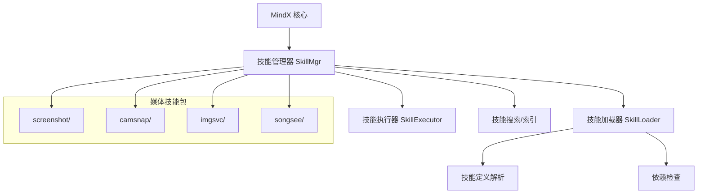
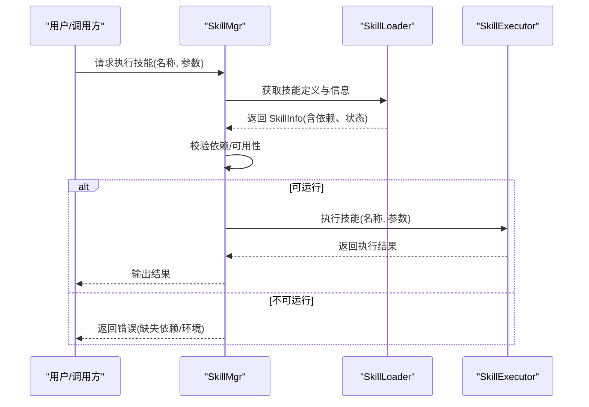
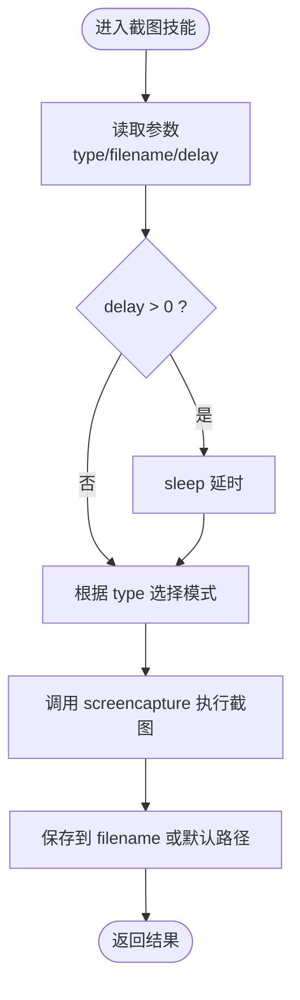
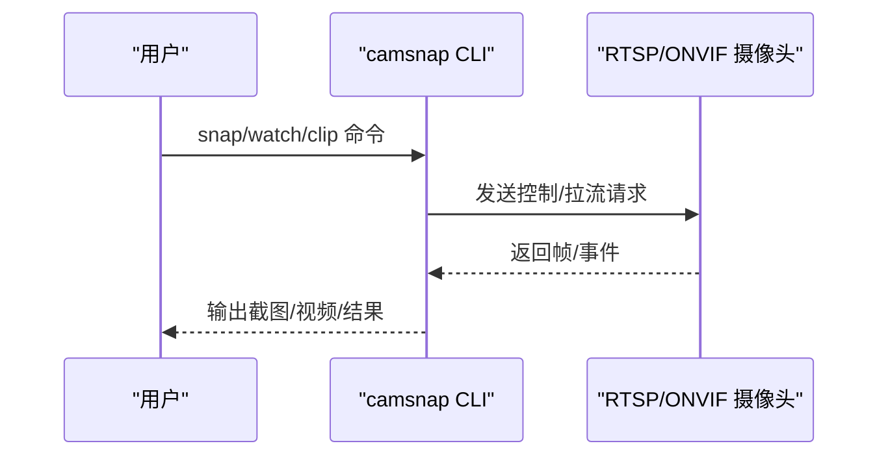
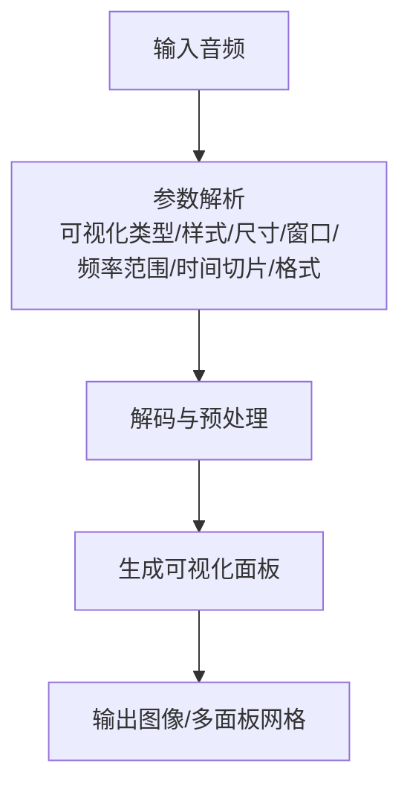
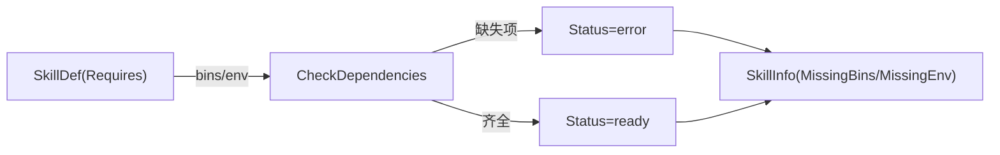

# 媒体类技能

<cite>
**本文档引用的文件**
- [screenshot/SKILL.md](file://skills/screenshot/SKILL.md)
- [screenshot/screenshot_cli.sh](file://skills/screenshot/screenshot_cli.sh)
- [camsnap/SKILL.md](file://skills/camsnap/SKILL.md)
- [songsee/SKILL.md](file://skills/songsee/SKILL.md)
- [imgsvc/SKILL.md](file://skills/imgsvc/SKILL.md)
- [internal/entity/skill.go](file://internal/entity/skill.go)
- [internal/usecase/skills/loader.go](file://internal/usecase/skills/loader.go)
- [internal/usecase/skills/skill_mgr.go](file://internal/usecase/skills/skill_mgr.go)
- [internal/config/config.go](file://internal/config/config.go)
- [cmd/main.go](file://cmd/main.go)
</cite>

## 目录
1. [简介](#简介)
2. [项目结构](#项目结构)
3. [核心组件](#核心组件)
4. [架构总览](#架构总览)
5. [详细组件分析](#详细组件分析)
6. [依赖关系分析](#依赖关系分析)
7. [性能考虑](#性能考虑)
8. [故障排除指南](#故障排除指南)
9. [结论](#结论)

## 简介
本文件面向 MindX 媒体类技能，围绕截图捕获、相机拍照、图片服务和音乐播放四大方向，系统梳理其功能特性、实现机制与使用建议。重点覆盖：
- 截图技能：区域选择、延迟拍摄、格式转换
- 相机技能：设备检测、快门控制、图像质量设置
- 图片服务技能：在线处理、格式转换、压缩优化
- 音频可视化技能：频谱图生成、多面板可视化、参数化控制

## 项目结构
媒体类技能均以“技能包”形式组织，每个技能包含：
- SKILL.md：技能定义（名称、描述、参数、依赖、安装方式等）
- 可选执行脚本或外部二进制：实际执行逻辑

**图表来源**
- [internal/usecase/skills/skill_mgr.go](file://internal/usecase/skills/skill_mgr.go#L40-L85)
- [internal/usecase/skills/loader.go](file://internal/usecase/skills/loader.go#L26-L33)

**章节来源**
- [cmd/main.go](file://cmd/main.go#L18-L21)
- [internal/config/config.go](file://internal/config/config.go#L13-L37)

## 核心组件
- 技能定义结构：统一承载技能元数据、参数、依赖、安装方法等
- 技能加载器：扫描技能目录、解析 SKILL.md、检查运行依赖
- 技能管理器：协调加载、执行、索引、搜索、MCP 注册等

关键要点：
- 技能定义支持 YAML Front Matter，包含参数类型、描述、依赖、安装方法等
- 依赖检查基于系统 PATH 与环境变量，决定技能能否运行
- 管理器负责将技能信息同步到搜索/索引组件，支撑后续检索与推荐

**章节来源**
- [internal/entity/skill.go](file://internal/entity/skill.go#L5-L25)
- [internal/entity/skill.go](file://internal/entity/skill.go#L27-L42)
- [internal/usecase/skills/loader.go](file://internal/usecase/skills/loader.go#L60-L123)
- [internal/usecase/skills/loader.go](file://internal/usecase/skills/loader.go#L186-L204)
- [internal/usecase/skills/skill_mgr.go](file://internal/usecase/skills/skill_mgr.go#L40-L85)

## 架构总览
媒体技能在 MindX 中的执行路径如下：

**图表来源**
- [internal/usecase/skills/skill_mgr.go](file://internal/usecase/skills/skill_mgr.go#L189-L211)
- [internal/usecase/skills/loader.go](file://internal/usecase/skills/loader.go#L76-L101)

## 详细组件分析

### 截图技能（screenshot）
- 功能概述
  - 支持全屏、区域选择、窗口三种截图模式
  - 支持延迟拍摄（秒级延时）
  - 自动构建默认保存路径（桌面，带时间戳）
- 参数与行为
  - type：screen/selection/window（默认全屏）
  - filename：输出文件路径（为空则使用默认路径）
  - delay：延时秒数（非0时睡眠相应秒数）
- 实现要点
  - 基于系统 screencapture 命令执行不同模式
  - 通过 jq 解析传入 JSON 参数
  - 成功返回结果与文件路径

**图表来源**
- [screenshot/screenshot_cli.sh](file://skills/screenshot/screenshot_cli.sh#L8-L42)

**章节来源**
- [screenshot/SKILL.md](file://skills/screenshot/SKILL.md#L18-L31)
- [screenshot/screenshot_cli.sh](file://skills/screenshot/screenshot_cli.sh#L18-L42)

### 相机技能（camsnap）
- 功能概述
  - 从 RTSP/ONVIF 摄像头获取截图、视频片段、移动侦测
  - 需要外部二进制 camsnap 与 ffmpeg
- 配置与常用命令
  - 设备发现、添加摄像头、截图、录制、移动侦测、诊断
- 注意事项
  - 需要在 PATH 中包含 ffmpeg
  - 建议长时间录制前先进行短时测试

**图表来源**
- [camsnap/SKILL.md](file://skills/camsnap/SKILL.md#L29-L49)

**章节来源**
- [camsnap/SKILL.md](file://skills/camsnap/SKILL.md#L22-L26)
- [camsnap/SKILL.md](file://skills/camsnap/SKILL.md#L35-L49)

### 图片服务技能（imgsvc）
- 功能概述
  - 提供图片搜索、下载、无障碍访问（自动翻墙）与后台下载管理
- 使用场景
  - 搜索关键字、打开网页（自动翻墙）、下载图片、推送图片地址
- 运行条件
  - 需要外部二进制 imgsvc

**章节来源**
- [imgsvc/SKILL.md](file://skills/imgsvc/SKILL.md#L1-L27)
- [imgsvc/SKILL.md](file://skills/imgsvc/SKILL.md#L34-L43)

### 音频可视化技能（songsee）
- 功能概述
  - 从音频生成频谱图与多种可视化面板（如梅尔频谱、色度图、HPSS、自相似、响度、节拍图、MFCC、能量等）
  - 支持时间切片、调色板、尺寸、FFT 窗口/步长、频率范围、输出格式等参数
- 使用场景
  - 音频分析、教学演示、创作辅助、音频特征提取

**图表来源**
- [songsee/SKILL.md](file://skills/songsee/SKILL.md#L47-L56)

**章节来源**
- [songsee/SKILL.md](file://skills/songsee/SKILL.md#L47-L61)

## 依赖关系分析
媒体技能的依赖检查与运行状态由技能加载器统一管理：
- 二进制依赖：基于 PATH 检查所需命令是否存在
- 环境变量依赖：检查必需环境变量是否已设置
- 运行状态：根据缺失项决定技能状态（ready/error）

**图表来源**
- [internal/usecase/skills/loader.go](file://internal/usecase/skills/loader.go#L186-L204)
- [internal/entity/skill.go](file://internal/entity/skill.go#L27-L42)

**章节来源**
- [internal/usecase/skills/loader.go](file://internal/usecase/skills/loader.go#L76-L101)
- [internal/entity/skill.go](file://internal/entity/skill.go#L165-L204)

## 性能考虑
- 截图技能
  - 延迟拍摄适合避免界面抖动，但会增加等待时间
  - 默认保存路径位于桌面，注意磁盘空间与权限
- 相机技能
  - 长时间录制建议先进行短时测试，避免网络/存储瓶颈
  - ffmpeg 作为依赖，确保版本与编解码器支持满足需求
- 图片服务技能
  - 后台下载与自动管理适合批量任务，注意并发与带宽占用
- 音频可视化
  - 多面板渲染会显著增加计算与内存消耗，建议按需选择可视化类型
  - FFT 窗口/步长与频率范围影响计算复杂度，应根据音频长度与采样率合理设置

## 故障排除指南
- 技能不可运行（Status=error）
  - 检查缺失的二进制依赖（如 ffmpeg、camsnap、imgsvc、songsee）
  - 检查环境变量是否已设置（如 API Key）
- 截图失败
  - 确认 screencapture 可用且具有必要权限
  - 检查 filename 是否可写，路径是否存在
- 相机截图/录制异常
  - 确认 RTSP/ONVIF 地址、账号密码正确
  - 检查网络连通性与防火墙策略
- 图片服务下载失败
  - 确认 imgsvc 可用，网络可访问目标站点
  - 检查下载路径权限与磁盘空间
- 音频可视化耗时过长
  - 减少可视化面板数量
  - 调整 FFT 窗口/步长与输出尺寸

**章节来源**
- [internal/usecase/skills/loader.go](file://internal/usecase/skills/loader.go#L76-L101)
- [camsnap/SKILL.md](file://skills/camsnap/SKILL.md#L46-L50)
- [songsee/SKILL.md](file://skills/songsee/SKILL.md#L57-L62)

## 结论
MindX 的媒体类技能通过标准化的技能定义与统一的加载/执行框架，实现了对截图、相机、图片服务与音频可视化的灵活集成。建议在部署阶段优先补齐外部依赖与环境变量，并结合具体使用场景优化参数配置，以获得稳定高效的媒体处理体验。