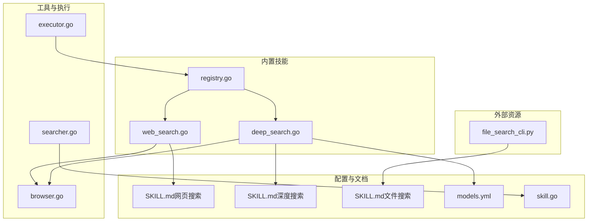
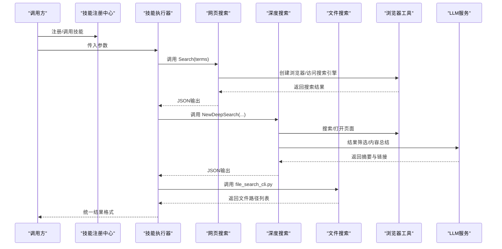
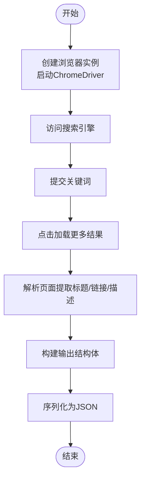
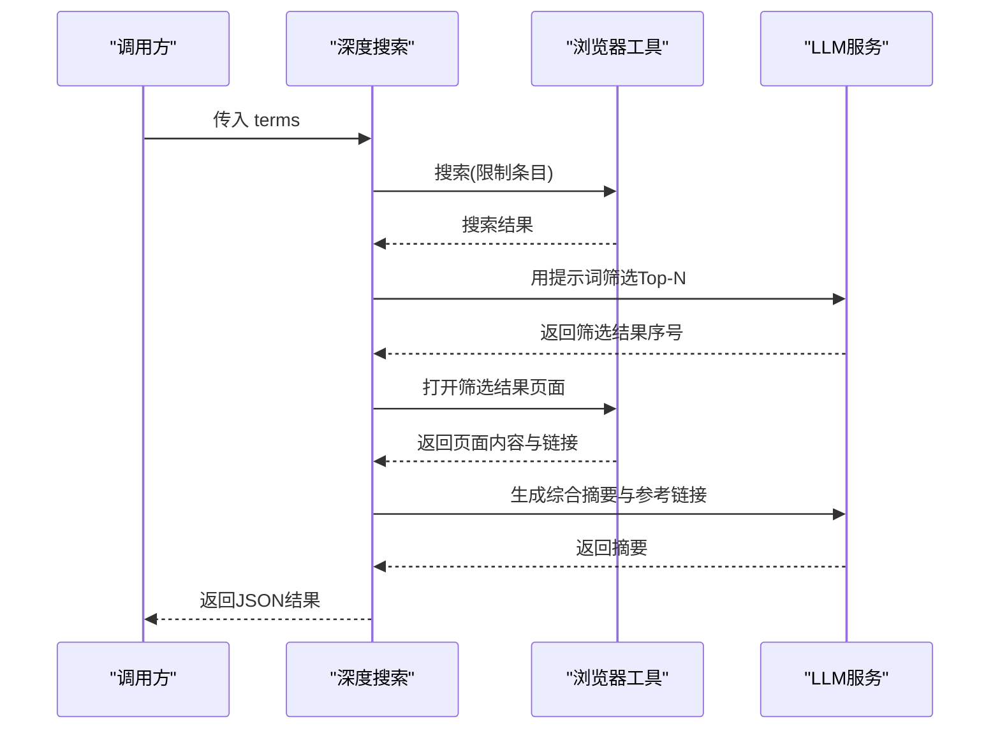
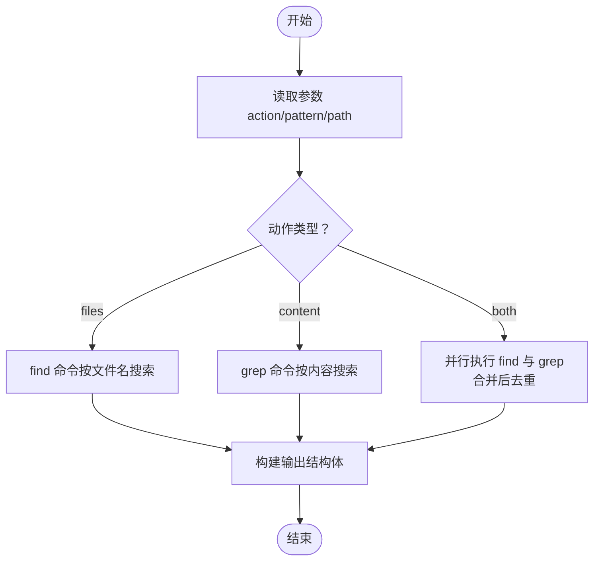
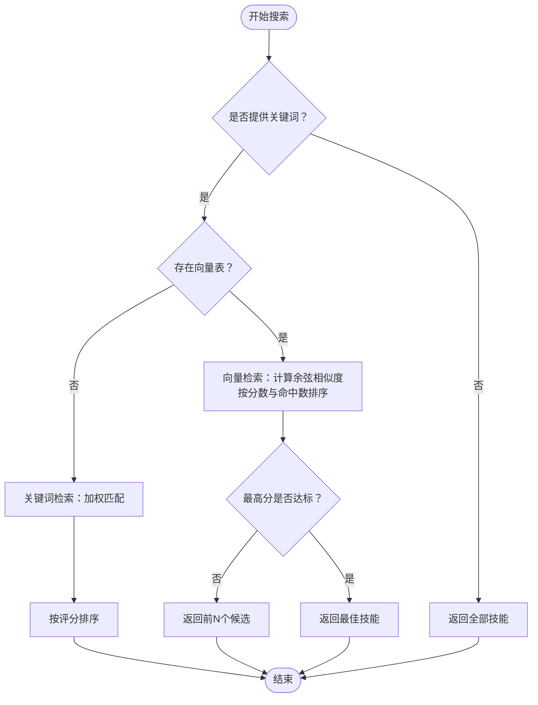
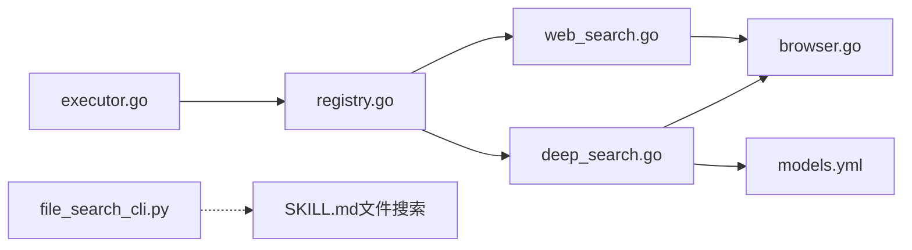

# 搜索类技能

<cite>
**本文引用的文件**   
- [web_search.go](file://internal/usecase/skills/builtins/web_search.go)
- [deep_search.go](file://internal/usecase/skills/builtins/deep_search.go)
- [file_search_cli.py](file://skills/file_search/file_search_cli.py)
- [browser.go](file://internal/utils/browser.go)
- [registry.go](file://internal/usecase/skills/builtins/registry.go)
- [SKILL.md（网页搜索）](file://skills/web_search/SKILL.md)
- [SKILL.md（深度搜索）](file://skills/deep_search/SKILL.md)
- [SKILL.md（文件搜索）](file://skills/file_search/SKILL.md)
- [searcher.go](file://internal/usecase/skills/searcher.go)
- [models.yml](file://config/models.yml)
- [skill.go](file://internal/entity/skill.go)
- [executor.go](file://internal/usecase/skills/executor.go)
</cite>

## 目录
1. [简介](#简介)
2. [项目结构](#项目结构)
3. [核心组件](#核心组件)
4. [架构总览](#架构总览)
5. [组件详解](#组件详解)
6. [依赖关系分析](#依赖关系分析)
7. [性能考量](#性能考量)
8. [故障排查指南](#故障排查指南)
9. [结论](#结论)
10. [附录](#附录)

## 简介
本文件面向 MindX 的搜索类技能，系统性梳理网页搜索、深度搜索与文件搜索三大技能的功能特性、实现原理、参数配置、结果展示与性能优化策略，并给出组合使用与高级查询技巧，帮助开发者与使用者高效、稳定地运用这些能力。

## 项目结构
围绕搜索类技能的相关代码主要分布在以下位置：
- 内置技能实现：internal/usecase/skills/builtins
- 浏览器与反检测工具：internal/utils/browser.go
- 技能注册与执行：internal/usecase/skills/builtins/registry.go、internal/usecase/skills/executor.go
- 搜索器与检索逻辑：internal/usecase/skills/searcher.go
- 技能元数据与文档：skills/*/SKILL.md
- 模型配置：config/models.yml
- 技能实体定义：internal/entity/skill.go

**图示来源**
- [web_search.go](file://internal/usecase/skills/builtins/web_search.go#L1-L50)
- [deep_search.go](file://internal/usecase/skills/builtins/deep_search.go#L1-L236)
- [browser.go](file://internal/utils/browser.go#L1-L361)
- [registry.go](file://internal/usecase/skills/builtins/registry.go#L1-L30)
- [executor.go](file://internal/usecase/skills/executor.go#L105-L143)
- [searcher.go](file://internal/usecase/skills/searcher.go#L1-L307)
- [SKILL.md（网页搜索）](file://skills/web_search/SKILL.md#L1-L67)
- [SKILL.md（深度搜索）](file://skills/deep_search/SKILL.md#L1-L91)
- [SKILL.md（文件搜索）](file://skills/file_search/SKILL.md#L1-L100)
- [models.yml](file://config/models.yml#L1-L92)
- [skill.go](file://internal/entity/skill.go#L1-L25)
- [file_search_cli.py](file://skills/file_search/file_search_cli.py#L1-L56)

**章节来源**
- [web_search.go](file://internal/usecase/skills/builtins/web_search.go#L1-L50)
- [deep_search.go](file://internal/usecase/skills/builtins/deep_search.go#L1-L236)
- [browser.go](file://internal/utils/browser.go#L1-L361)
- [registry.go](file://internal/usecase/skills/builtins/registry.go#L1-L30)
- [executor.go](file://internal/usecase/skills/executor.go#L105-L143)
- [searcher.go](file://internal/usecase/skills/searcher.go#L1-L307)
- [SKILL.md（网页搜索）](file://skills/web_search/SKILL.md#L1-L67)
- [SKILL.md（深度搜索）](file://skills/deep_search/SKILL.md#L1-L91)
- [SKILL.md（文件搜索）](file://skills/file_search/SKILL.md#L1-L100)
- [models.yml](file://config/models.yml#L1-L92)
- [skill.go](file://internal/entity/skill.go#L1-L25)
- [file_search_cli.py](file://skills/file_search/file_search_cli.py#L1-L56)

## 核心组件
- 网页搜索技能：基于浏览器自动化访问搜索引擎，抓取标题、链接与摘要，支持反检测与动态渲染。
- 深度搜索技能：先检索再筛选，再打开页面阅读并由 LLM 总结，输出带参考链接的综合答案。
- 文件搜索技能：通过外部 Python 脚本在文件系统中按文件名或内容搜索，支持“文件名+内容”合并去重。

**章节来源**
- [web_search.go](file://internal/usecase/skills/builtins/web_search.go#L10-L35)
- [deep_search.go](file://internal/usecase/skills/builtins/deep_search.go#L14-L78)
- [file_search_cli.py](file://skills/file_search/file_search_cli.py#L7-L52)
- [SKILL.md（网页搜索）](file://skills/web_search/SKILL.md#L24-L67)
- [SKILL.md（深度搜索）](file://skills/deep_search/SKILL.md#L34-L91)
- [SKILL.md（文件搜索）](file://skills/file_search/SKILL.md#L37-L100)

## 架构总览
下图展示了搜索类技能的端到端流程：技能注册、参数解析、执行与结果返回；其中网页/深度搜索依赖浏览器工具，深度搜索还依赖 LLM；文件搜索通过外部命令执行。

**图示来源**
- [registry.go](file://internal/usecase/skills/builtins/registry.go#L15-L28)
- [web_search.go](file://internal/usecase/skills/builtins/web_search.go#L10-L35)
- [deep_search.go](file://internal/usecase/skills/builtins/deep_search.go#L16-L77)
- [browser.go](file://internal/utils/browser.go#L98-L167)
- [file_search_cli.py](file://skills/file_search/file_search_cli.py#L7-L52)

## 组件详解

### 网页搜索技能（web_search）
- 功能要点
  - 使用搜索引擎进行网页搜索，返回标题、链接与描述。
  - 支持 JavaScript 渲染的动态页面，具备反检测措施（随机 UA、窗口尺寸、指纹伪装、隐藏 webdriver 标记）。
- 实现要点
  - 通过浏览器工具创建会话，访问搜索引擎并提交关键词，点击“更多结果”以拉取更多条目。
  - 解析页面结构提取结果，封装为统一结构体并序列化输出。
- 参数与输出
  - 输入：terms（关键词）
  - 输出：包含计数、耗时与结果数组的 JSON
- 使用场景
  - 快速获取网页信息、参考资料、最新资讯等

**图示来源**
- [browser.go](file://internal/utils/browser.go#L176-L249)
- [web_search.go](file://internal/usecase/skills/builtins/web_search.go#L10-L35)

**章节来源**
- [web_search.go](file://internal/usecase/skills/builtins/web_search.go#L10-L35)
- [browser.go](file://internal/utils/browser.go#L98-L167)
- [browser.go](file://internal/utils/browser.go#L176-L249)
- [SKILL.md（网页搜索）](file://skills/web_search/SKILL.md#L24-L67)

### 深度搜索技能（deep_search）
- 功能要点
  - 先检索（最多若干条），再由 LLM 筛选最相关条目，打开页面阅读后由 LLM 总结并列出参考链接。
  - 支持多语言输出，适合复杂问题与需要交叉验证的场景。
- 实现要点
  - 通过浏览器工具检索，限制条目数量并交给 LLM 进行“编号式”筛选。
  - 打开筛选后的页面，抽取正文与链接，汇总给 LLM 生成综合回答。
  - 输出包含摘要、页面内容列表与耗时。
- 参数与输出
  - 输入：terms（查询或问题）
  - 输出：摘要、页面内容数组、耗时字符串与毫秒数
- 使用场景
  - 需要综合答案、多来源验证、复杂主题研究

**图示来源**
- [deep_search.go](file://internal/usecase/skills/builtins/deep_search.go#L16-L77)
- [browser.go](file://internal/utils/browser.go#L176-L249)
- [browser.go](file://internal/utils/browser.go#L251-L302)

**章节来源**
- [deep_search.go](file://internal/usecase/skills/builtins/deep_search.go#L14-L78)
- [deep_search.go](file://internal/usecase/skills/builtins/deep_search.go#L93-L147)
- [deep_search.go](file://internal/usecase/skills/builtins/deep_search.go#L149-L185)
- [SKILL.md（深度搜索）](file://skills/deep_search/SKILL.md#L34-L91)

### 文件搜索技能（file_search）
- 功能要点
  - 支持三种动作：仅按文件名搜索、仅按内容搜索、同时搜索并去重合并。
  - 默认从当前目录开始，可指定起始路径。
- 实现要点
  - 通过外部 Python 脚本执行系统命令（find/grep），将结果标准化为 JSON。
  - 合并去重采用集合操作，保证结果唯一性。
- 参数与输出
  - 输入：action（files/content/both）、pattern（关键字）、path（起始路径）
  - 输出：结果数组、数量与关键字
- 使用场景
  - 快速定位配置文件、源代码片段、日志文件等

**图示来源**
- [file_search_cli.py](file://skills/file_search/file_search_cli.py#L7-L52)

**章节来源**
- [file_search_cli.py](file://skills/file_search/file_search_cli.py#L7-L52)
- [SKILL.md（文件搜索）](file://skills/file_search/SKILL.md#L37-L100)

### 搜索器与检索逻辑（技能索引与排序）
- 功能要点
  - 支持向量检索与关键词检索双通道；当存在向量表时优先向量相似度排序，否则回退到关键词匹配。
  - 向量检索采用余弦相似度，按最高相似度与命中关键词数排序；关键词检索对名称、描述、标签、分类进行加权匹配。
- 关键点
  - 向量检索阈值与返回策略：若最高分低于阈值，则返回前 N 个候选；否则返回最佳。
  - 关键词检索评分规则：名称完全匹配+3，描述包含+2，标签包含+2，分类包含+1，全文包含+1；并支持反向匹配增强召回。

**图示来源**
- [searcher.go](file://internal/usecase/skills/searcher.go#L42-L62)
- [searcher.go](file://internal/usecase/skills/searcher.go#L72-L188)
- [searcher.go](file://internal/usecase/skills/searcher.go#L190-L281)

**章节来源**
- [searcher.go](file://internal/usecase/skills/searcher.go#L42-L62)
- [searcher.go](file://internal/usecase/skills/searcher.go#L72-L188)
- [searcher.go](file://internal/usecase/skills/searcher.go#L190-L281)

## 依赖关系分析
- 技能注册与执行
  - 注册中心将内置技能注册到管理器，执行器根据技能定义选择内部函数或外部命令执行。
- 浏览器工具链
  - 网页/深度搜索依赖浏览器工具，负责启动 ChromeDriver、伪装指纹、访问页面、解析 DOM。
- LLM 集成
  - 深度搜索通过 LLM 完成结果筛选与内容总结，需配置 BaseURL、APIKey、模型与语言。
- 外部命令
  - 文件搜索通过 Python 脚本执行系统命令，受操作系统与权限影响。

**图示来源**
- [registry.go](file://internal/usecase/skills/builtins/registry.go#L15-L28)
- [web_search.go](file://internal/usecase/skills/builtins/web_search.go#L10-L35)
- [deep_search.go](file://internal/usecase/skills/builtins/deep_search.go#L16-L77)
- [browser.go](file://internal/utils/browser.go#L98-L167)
- [executor.go](file://internal/usecase/skills/executor.go#L105-L143)
- [models.yml](file://config/models.yml#L1-L92)
- [file_search_cli.py](file://skills/file_search/file_search_cli.py#L1-L56)

**章节来源**
- [registry.go](file://internal/usecase/skills/builtins/registry.go#L15-L28)
- [executor.go](file://internal/usecase/skills/executor.go#L105-L143)
- [browser.go](file://internal/utils/browser.go#L98-L167)
- [models.yml](file://config/models.yml#L1-L92)

## 性能考量
- 浏览器与网络
  - 使用无头模式与随机 UA/窗口尺寸降低被识别概率；合理控制“加载更多”次数，避免过度请求。
  - ChromeDriver 生命周期复用，避免频繁启停。
- LLM 调用
  - 控制筛选与总结阶段的输入长度，必要时截断，减少 token 消耗与延迟。
  - 选择合适模型与温度、最大 tokens，平衡质量与性能。
- 文件搜索
  - 合理设置起始路径，避免扫描过大目录；内容搜索建议限定文件类型或扩展名。
- 检索排序
  - 向量检索优先时，确保向量表质量与覆盖度；关键词检索时，保持元数据清晰有助于提升召回。

[本节为通用指导，无需具体文件引用]

## 故障排查指南
- 浏览器相关
  - 现象：无法连接驱动或页面元素未找到
  - 排查：确认 ChromeDriver 可执行路径与端口可用；检查代理设置与网络连通性；查看调试日志
  - 参考：浏览器工具初始化、元素定位与等待逻辑
- LLM 相关
  - 现象：筛选或总结失败
  - 排查：确认 BaseURL、APIKey、模型名称正确；检查网络与服务可用性；适当调整提示词或上下文长度
  - 参考：深度搜索的 LLM 调用与提示词构造
- 文件搜索相关
  - 现象：无结果或权限不足
  - 排查：确认脚本可执行、路径存在且可读；检查 action/pattern/path 参数；在 Windows 下注意路径分隔符
  - 参考：Python 脚本的命令执行与输出格式
- 技能执行超时
  - 现象：执行超时
  - 排查：调整技能 Timeout 或减少请求次数；检查外部服务响应时间

**章节来源**
- [browser.go](file://internal/utils/browser.go#L61-L96)
- [browser.go](file://internal/utils/browser.go#L176-L249)
- [deep_search.go](file://internal/usecase/skills/builtins/deep_search.go#L44-L46)
- [file_search_cli.py](file://skills/file_search/file_search_cli.py#L14-L17)
- [executor.go](file://internal/usecase/skills/executor.go#L117-L121)

## 结论
MindX 的搜索类技能以“可插拔、可扩展、可配置”为核心设计原则：网页搜索强调稳定性与反检测，深度搜索强调多源聚合与 LLM 辅助，文件搜索强调跨平台与系统命令集成。配合内置的检索器与向量索引，用户可以实现从关键词到语义的多层级检索体验。建议在生产环境中合理配置 LLM 与浏览器参数，关注超时与资源占用，并结合实际场景选择合适的技能组合。

[本节为总结，无需具体文件引用]

## 附录

### 搜索参数配置与最佳实践
- 网页搜索
  - terms：建议明确具体关键词，避免歧义；可结合时间范围、站点限定等高级语法（视搜索引擎而定）
- 深度搜索
  - terms：尽量使用完整问题句式；合理设置模型温度与最大 tokens，平衡准确性与时效
  - 模型配置：参考 models.yml 中的 BaseURL、APIKey、Temperature、MaxTokens
- 文件搜索
  - action：files/content/both，按需选择；both 会进行去重合并
  - pattern：建议使用稳定关键字；避免正则表达式特殊字符
  - path：优先缩小范围；注意权限与符号链接

**章节来源**
- [SKILL.md（网页搜索）](file://skills/web_search/SKILL.md#L17-L22)
- [SKILL.md（深度搜索）](file://skills/deep_search/SKILL.md#L27-L32)
- [SKILL.md（文件搜索）](file://skills/file_search/SKILL.md#L22-L35)
- [models.yml](file://config/models.yml#L1-L92)

### 结果展示与用户体验
- 统一输出结构：网页搜索与深度搜索均输出 JSON，便于前端统一渲染；文件搜索输出路径列表，便于进一步处理
- 展示建议：网页搜索可显示标题、摘要与链接；深度搜索可折叠展示页面内容与参考链接；文件搜索可提供“打开文件”快捷入口

**章节来源**
- [web_search.go](file://internal/usecase/skills/builtins/web_search.go#L37-L49)
- [deep_search.go](file://internal/usecase/skills/builtins/deep_search.go#L187-L200)
- [file_search_cli.py](file://skills/file_search/file_search_cli.py#L44-L48)

### 组合使用策略与高级技巧
- 先文件后网页：先用文件搜索定位本地资料，再用网页搜索补充外部信息
- 先关键词后深度：先用网页搜索快速收集线索，再用深度搜索提炼综合答案
- 多轮迭代：深度搜索输出的参考链接可再次进入网页搜索进行二次验证
- 搜索器辅助：通过技能检索器的关键词/向量检索，先筛选出最相关的技能，再执行对应搜索

**章节来源**
- [searcher.go](file://internal/usecase/skills/searcher.go#L42-L62)
- [searcher.go](file://internal/usecase/skills/searcher.go#L72-L188)