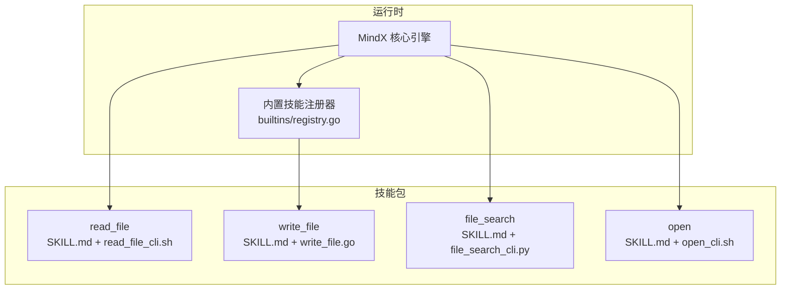
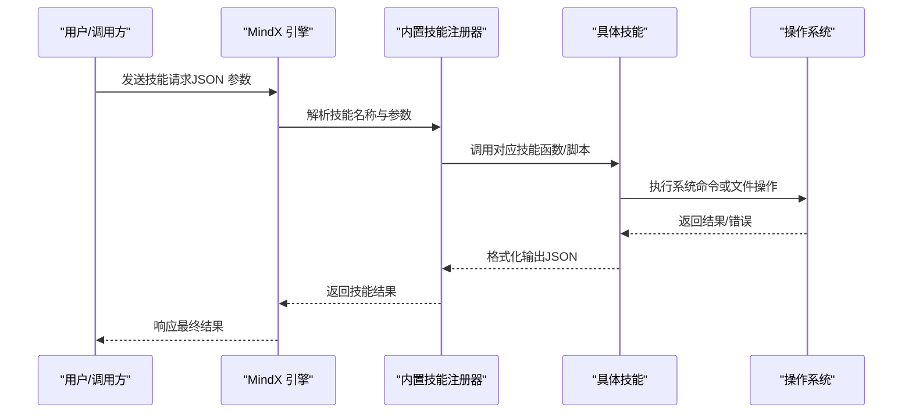
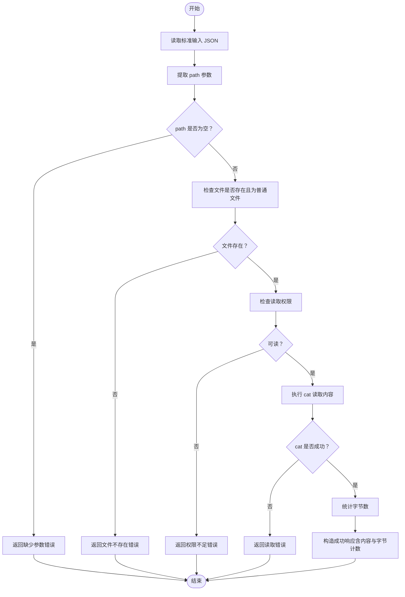
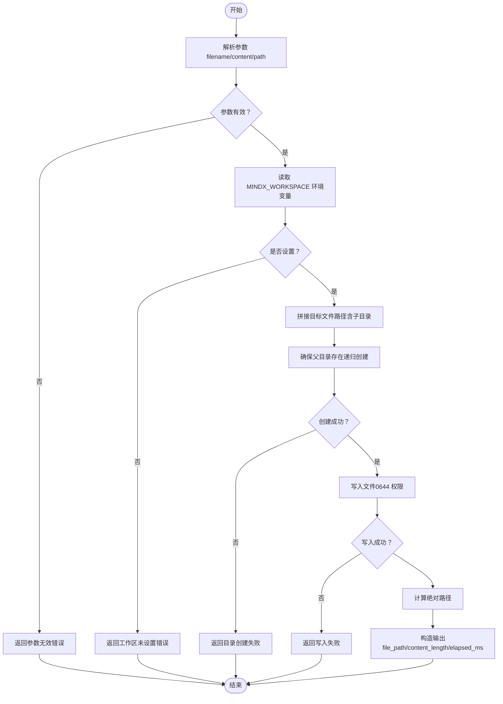
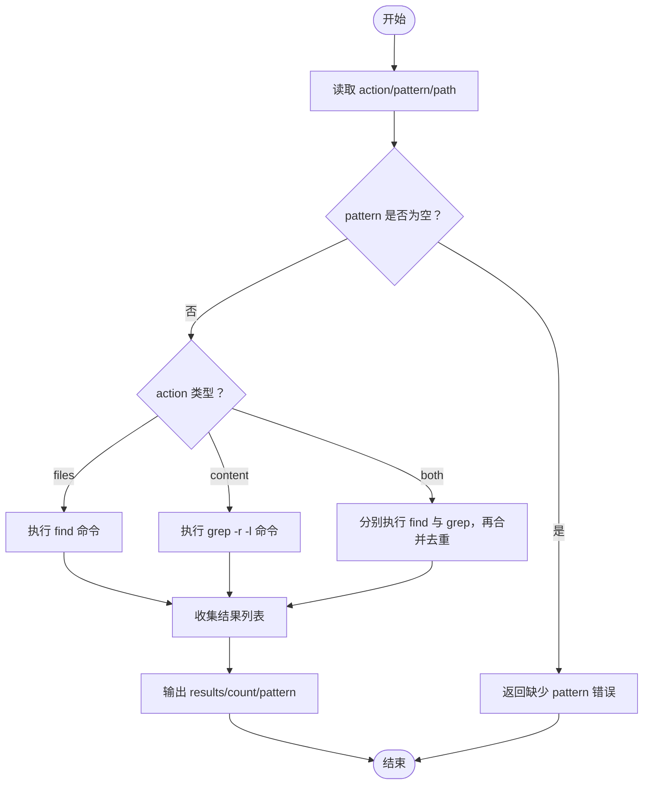
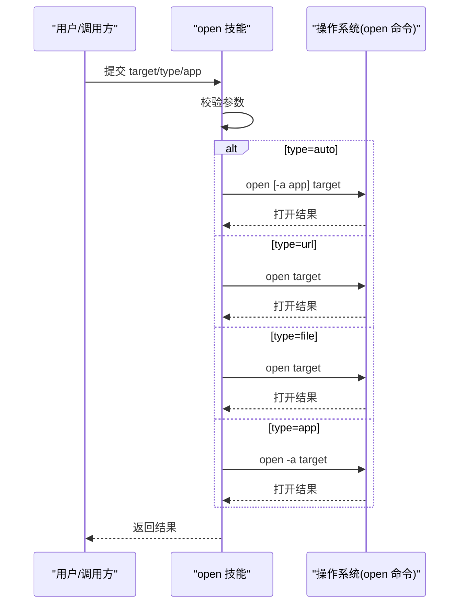
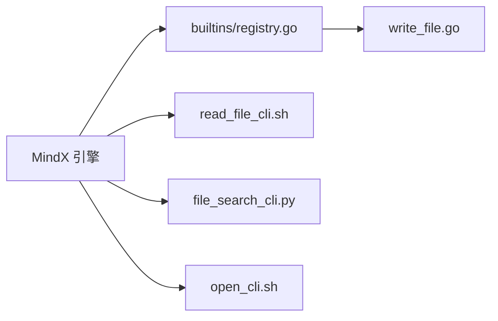

# 文件操作类技能

<cite>
**本文档引用的文件**
- [skills/read_file/SKILL.md](file://skills/read_file/SKILL.md)
- [skills/read_file/read_file_cli.sh](file://skills/read_file/read_file_cli.sh)
- [skills/write_file/SKILL.md](file://skills/write_file/SKILL.md)
- [internal/usecase/skills/builtins/write_file.go](file://internal/usecase/skills/builtins/write_file.go)
- [internal/usecase/skills/builtins/registry.go](file://internal/usecase/skills/builtins/registry.go)
- [skills/file_search/SKILL.md](file://skills/file_search/SKILL.md)
- [skills/file_search/file_search_cli.py](file://skills/file_search/file_search_cli.py)
- [skills/open/SKILL.md](file://skills/open/SKILL.md)
- [skills/open/open_cli.sh](file://skills/open/open_cli.sh)
</cite>

## 目录
1. [简介](#简介)
2. [项目结构](#项目结构)
3. [核心组件](#核心组件)
4. [架构总览](#架构总览)
5. [详细组件分析](#详细组件分析)
6. [依赖关系分析](#依赖关系分析)
7. [性能考虑](#性能考虑)
8. [故障排除指南](#故障排除指南)
9. [结论](#结论)
10. [附录](#附录)

## 简介
本文件面向 MindX 的文件操作类技能，系统性梳理以下能力：文件读取、文件写入、文件查找与文件打开。文档覆盖各技能的功能特性、参数与输出规范、实现原理、错误处理与安全建议，并给出性能优化与最佳实践指导，帮助开发者与使用者高效、安全地使用这些技能。

## 项目结构
MindX 将文件相关技能以“技能包”形式组织，每个技能包含：
- 技能元数据描述文件（SKILL.md）：定义名称、版本、参数、示例与输出格式
- 可执行脚本（CLI）：Linux/macOS 上的 Bash/Python 实现；Windows 平台通过分发包中的对应脚本适配
- 内部 Go 实现（写入技能）：在服务端以内置技能方式注册与调用

图表来源
- [internal/usecase/skills/builtins/registry.go](file://internal/usecase/skills/builtins/registry.go#L15-L29)
- [internal/usecase/skills/builtins/write_file.go](file://internal/usecase/skills/builtins/write_file.go#L11-L53)
- [skills/read_file/SKILL.md](file://skills/read_file/SKILL.md#L1-L27)
- [skills/file_search/SKILL.md](file://skills/file_search/SKILL.md#L1-L35)
- [skills/open/SKILL.md](file://skills/open/SKILL.md#L1-L33)

章节来源
- [internal/usecase/skills/builtins/registry.go](file://internal/usecase/skills/builtins/registry.go#L15-L29)
- [skills/read_file/SKILL.md](file://skills/read_file/SKILL.md#L1-L27)
- [skills/write_file/SKILL.md](file://skills/write_file/SKILL.md#L1-L30)
- [skills/file_search/SKILL.md](file://skills/file_search/SKILL.md#L1-L35)
- [skills/open/SKILL.md](file://skills/open/SKILL.md#L1-L33)

## 核心组件
- 文件读取技能（read_file）
  - 通过系统 cat 命令读取文件内容，支持绝对/相对路径，返回成功标志、路径、内容与字节数
  - 参数：path（必填）、encoding（可选，但脚本未直接解析该参数）
- 文件写入技能（write_file）
  - 内置 Go 技能，限定写入到工作区 documents 目录，自动创建目录，返回绝对路径、内容长度与耗时
  - 参数：filename（必填）、content（必填）、path（可选，子目录路径）
- 文件查找技能（file_search）
  - 支持按文件名、按内容或两者同时搜索，基于 find/grep 命令组合实现
  - 参数：action（files/content/both）、pattern（必填）、path（可选，起始路径）
- 文件打开技能（open）
  - 基于 macOS open 命令，支持自动识别、URL、文件与应用打开，可指定应用
  - 参数：target（必填）、type（auto/url/file/app）、app（可选）

章节来源
- [skills/read_file/SKILL.md](file://skills/read_file/SKILL.md#L18-L27)
- [skills/read_file/read_file_cli.sh](file://skills/read_file/read_file_cli.sh#L5-L10)
- [skills/write_file/SKILL.md](file://skills/write_file/SKILL.md#L17-L30)
- [internal/usecase/skills/builtins/write_file.go](file://internal/usecase/skills/builtins/write_file.go#L11-L53)
- [skills/file_search/SKILL.md](file://skills/file_search/SKILL.md#L22-L35)
- [skills/file_search/file_search_cli.py](file://skills/file_search/file_search_cli.py#L10-L17)
- [skills/open/SKILL.md](file://skills/open/SKILL.md#L20-L33)
- [skills/open/open_cli.sh](file://skills/open/open_cli.sh#L9-L16)

## 架构总览
文件操作技能在 MindX 中的调用链路如下：

图表来源
- [internal/usecase/skills/builtins/registry.go](file://internal/usecase/skills/builtins/registry.go#L15-L29)
- [internal/usecase/skills/builtins/write_file.go](file://internal/usecase/skills/builtins/write_file.go#L11-L53)
- [skills/read_file/read_file_cli.sh](file://skills/read_file/read_file_cli.sh#L3-L10)
- [skills/file_search/file_search_cli.py](file://skills/file_search/file_search_cli.py#L8-L17)
- [skills/open/open_cli.sh](file://skills/open/open_cli.sh#L8-L16)

## 详细组件分析

### 文件读取技能（read_file）
- 功能要点
  - 读取文本文件内容，返回路径、内容与字节数
  - 支持绝对/相对路径
  - 未对编码进行显式转换（encoding 参数存在但脚本未使用）
- 错误处理
  - 缺少 path 参数、文件不存在、无读取权限、读取失败均返回错误信息
- 性能与优化
  - 使用系统 cat 命令，简单高效；对超大文件需谨慎，避免一次性加载至内存
- 安全建议
  - 严格校验输入路径，避免路径穿越
  - 对外部可控输入进行白名单过滤与长度限制

图表来源
- [skills/read_file/read_file_cli.sh](file://skills/read_file/read_file_cli.sh#L3-L33)

章节来源
- [skills/read_file/SKILL.md](file://skills/read_file/SKILL.md#L18-L27)
- [skills/read_file/read_file_cli.sh](file://skills/read_file/read_file_cli.sh#L5-L20)
- [skills/read_file/read_file_cli.sh](file://skills/read_file/read_file_cli.sh#L22-L33)

### 文件写入技能（write_file）
- 功能要点
  - 限定写入到工作区 documents 目录（可通过 path 参数指定子目录）
  - 自动创建缺失目录
  - 返回绝对路径、内容长度与写入耗时
- 权限与安全
  - 默认写入权限掩码为 0644，具备基本安全性
  - 依赖 MINDX_WORKSPACE 环境变量定位工作区根目录
- 错误处理
  - 参数校验失败、目录创建失败、写入失败均返回错误
- 性能与优化
  - 单次写入，适合小到中等规模文本；大文件建议分块或异步处理

图表来源
- [internal/usecase/skills/builtins/write_file.go](file://internal/usecase/skills/builtins/write_file.go#L11-L53)

章节来源
- [skills/write_file/SKILL.md](file://skills/write_file/SKILL.md#L17-L30)
- [internal/usecase/skills/builtins/write_file.go](file://internal/usecase/skills/builtins/write_file.go#L24-L53)
- [internal/usecase/skills/builtins/registry.go](file://internal/usecase/skills/builtins/registry.go#L18-L18)

### 文件查找技能（file_search）
- 功能要点
  - action=files：按文件名模糊搜索（大小写不敏感）
  - action=content：按内容搜索（返回包含关键字的文件列表）
  - action=both：合并去重
- 实现逻辑
  - files：使用 find 命令
  - content：使用 grep -r -l
  - both：分别执行后合并去重
- 性能优化建议
  - 限制搜索范围（path），避免根目录全盘扫描
  - 对 pattern 进行必要转义，避免特殊字符引发性能问题
  - 大型仓库建议配合 .gitignore/.ignore 规则或使用更专业的索引工具

图表来源
- [skills/file_search/file_search_cli.py](file://skills/file_search/file_search_cli.py#L8-L52)

章节来源
- [skills/file_search/SKILL.md](file://skills/file_search/SKILL.md#L22-L35)
- [skills/file_search/file_search_cli.py](file://skills/file_search/file_search_cli.py#L10-L48)

### 文件打开技能（open）
- 功能要点
  - 支持自动识别、URL、文件与应用四种类型
  - 可指定应用（macOS open -a）
- 兼容性
  - 仅在 macOS 上使用 open 命令；Windows/Linux 平台通过分发包中的脚本适配
- 安全建议
  - 严格校验 target 与 app 输入，避免执行未知应用或恶意链接
  - 对外部输入进行白名单与长度限制

图表来源
- [skills/open/open_cli.sh](file://skills/open/open_cli.sh#L8-L48)

章节来源
- [skills/open/SKILL.md](file://skills/open/SKILL.md#L20-L33)
- [skills/open/open_cli.sh](file://skills/open/open_cli.sh#L9-L48)

## 依赖关系分析
- 注册关系
  - 内置技能注册器将 write_file 注册为内部技能，供核心引擎调用
- 调用关系
  - read_file/file_search/open 由技能管理器根据请求动态调用
  - write_file 由注册器统一注册，核心引擎直接调用

图表来源
- [internal/usecase/skills/builtins/registry.go](file://internal/usecase/skills/builtins/registry.go#L15-L29)
- [internal/usecase/skills/builtins/write_file.go](file://internal/usecase/skills/builtins/write_file.go#L11-L53)

章节来源
- [internal/usecase/skills/builtins/registry.go](file://internal/usecase/skills/builtins/registry.go#L15-L29)

## 性能考虑
- 文件读取
  - 大文件建议分块读取或流式处理，避免一次性占用过多内存
  - 对超大文件可考虑压缩传输或分页读取
- 文件写入
  - 单次写入适合中小文件；大文件建议采用缓冲写入与异步落盘
  - 控制并发写入数量，避免磁盘抖动
- 文件查找
  - 优先缩小搜索路径（path），减少 IO 开销
  - 对 pattern 做必要转义，避免正则复杂度导致的性能退化
  - 在大型仓库中结合索引工具或缓存结果
- 文件打开
  - 避免频繁触发系统打开流程，可做轻量缓存与去重

## 故障排除指南
- 文件读取
  - 缺少 path 参数：检查调用方参数传递
  - 文件不存在/不可读：确认路径与权限
  - 读取失败：查看系统错误输出并检查磁盘空间与 inode 使用率
- 文件写入
  - MINDX_WORKSPACE 未设置：确保环境变量正确配置
  - 目录创建失败：检查父目录权限与磁盘配额
  - 写入失败：检查目标路径是否为只读卷或被其他进程占用
- 文件查找
  - pattern 为空：补充搜索关键字
  - 结果为空：扩大搜索范围或调整关键字
- 文件打开
  - 类型不支持：确认 type 值为 auto/url/file/app
  - 应用不存在：确认应用名称与系统已安装情况

章节来源
- [skills/read_file/read_file_cli.sh](file://skills/read_file/read_file_cli.sh#L7-L20)
- [internal/usecase/skills/builtins/write_file.go](file://internal/usecase/skills/builtins/write_file.go#L24-L43)
- [skills/file_search/file_search_cli.py](file://skills/file_search/file_search_cli.py#L14-L17)
- [skills/open/open_cli.sh](file://skills/open/open_cli.sh#L13-L16)

## 结论
MindX 的文件操作类技能以“脚本 + 内置 Go 实现”的方式覆盖了常见文件任务：读取、写入、查找与打开。整体设计简洁可靠，遵循最小权限原则与错误显式反馈。在生产环境中，建议结合本文的性能与安全建议，针对不同场景选择合适的实现与参数配置，以获得稳定高效的体验。

## 附录
- 最佳实践清单
  - 读取：对路径进行白名单校验，限制最大读取大小，必要时启用分块读取
  - 写入：固定工作区目录，使用默认权限掩码，记录写入耗时用于监控
  - 查找：限定搜索路径，避免全盘扫描，对关键字进行转义与长度限制
  - 打开：严格校验目标与应用名称，避免执行未知程序或恶意链接
- 安全建议
  - 禁止路径穿越（如 ../），对输入进行规范化
  - 限制单次操作的资源占用，防止拒绝服务
  - 对外部可控输入进行长度与字符集限制
  - 定期审计工作区目录权限与访问日志