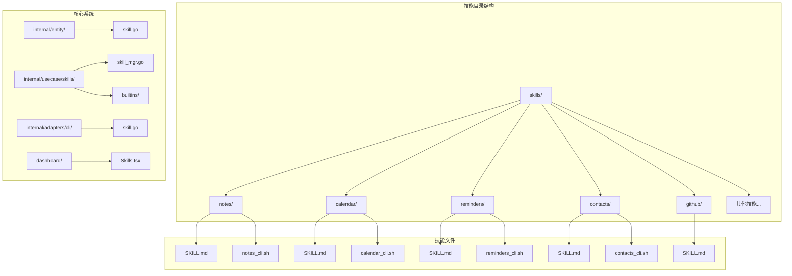
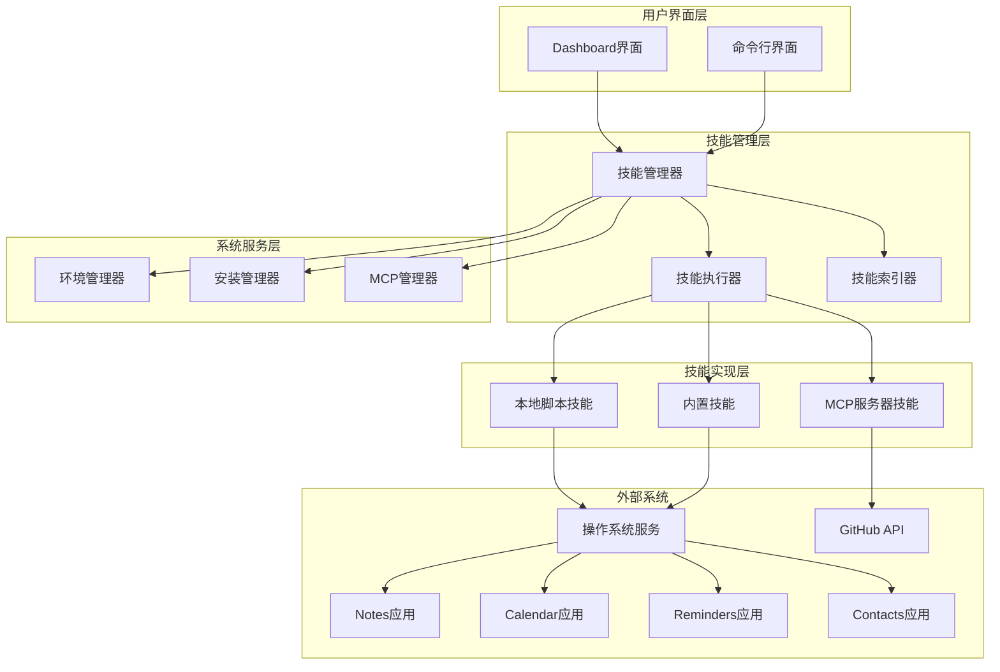
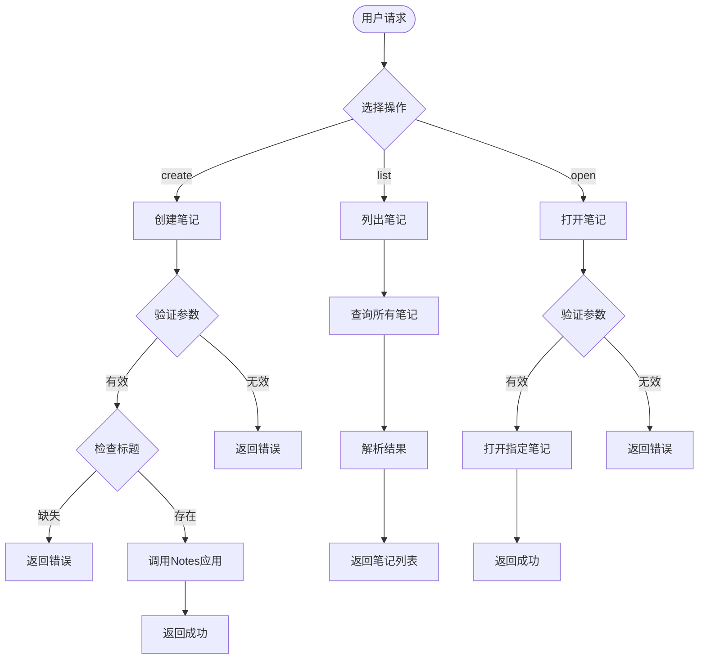
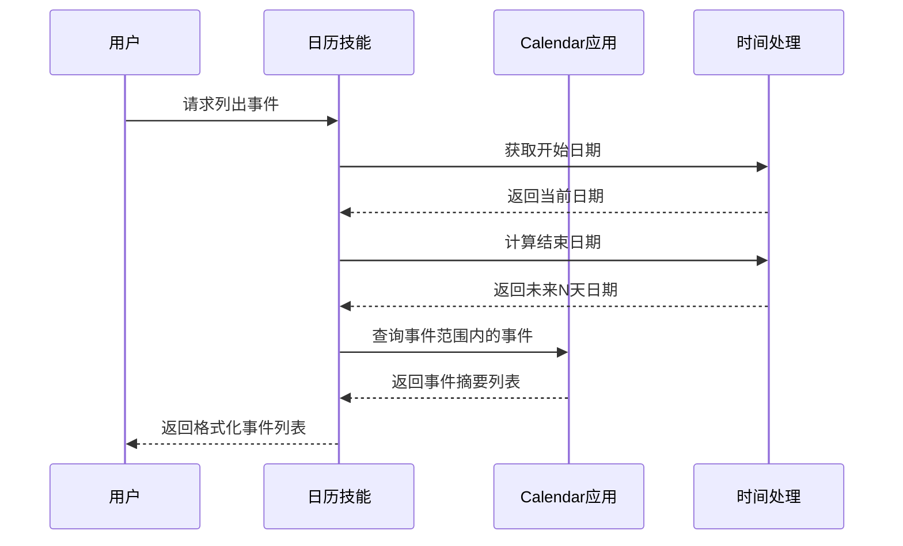
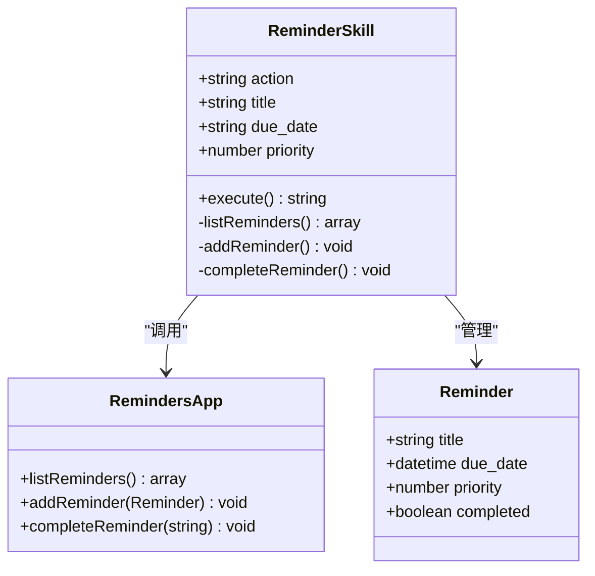
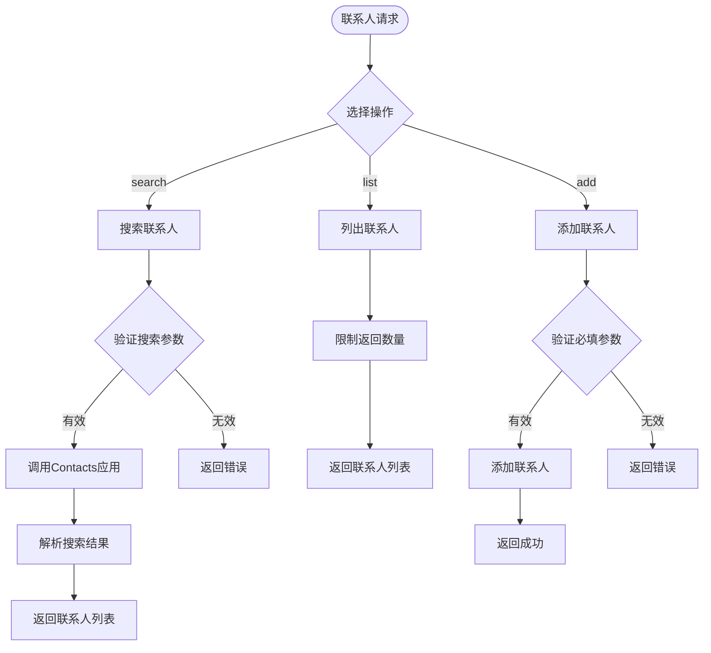
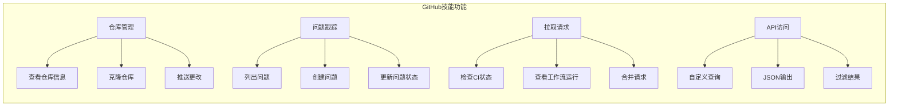
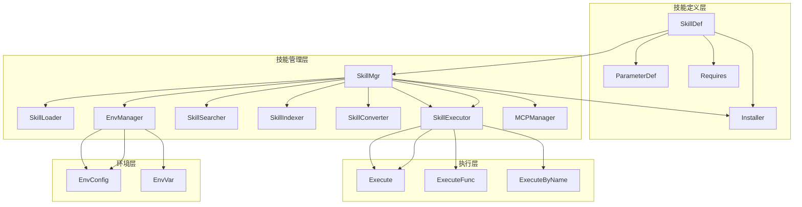

# 生产力工具类技能

<cite>
**本文档引用的文件**
- [skills/notes/SKILL.md](file://skills/notes/SKILL.md)
- [skills/notes/notes_cli.sh](file://skills/notes/notes_cli.sh)
- [skills/calendar/SKILL.md](file://skills/calendar/SKILL.md)
- [skills/calendar/calendar_cli.sh](file://skills/calendar/calendar_cli.sh)
- [skills/reminders/SKILL.md](file://skills/reminders/SKILL.md)
- [skills/reminders/reminders_cli.sh](file://skills/reminders/reminders_cli.sh)
- [skills/contacts/SKILL.md](file://skills/contacts/SKILL.md)
- [skills/contacts/contacts_cli.sh](file://skills/contacts/contacts_cli.sh)
- [skills/github/SKILL.md](file://skills/github/SKILL.md)
- [internal/entity/skill.go](file://internal/entity/skill.go)
- [internal/usecase/skills/skill_mgr.go](file://internal/usecase/skills/skill_mgr.go)
- [internal/usecase/skills/builtins/registry.go](file://internal/usecase/skills/builtins/registry.go)
- [internal/adapters/cli/skill.go](file://internal/adapters/cli/skill.go)
- [dashboard/src/components/Skills.tsx](file://dashboard/src/components/Skills.tsx)
- [dashboard/src/components/skills/SkillEnvDialog.tsx](file://dashboard/src/components/skills/SkillEnvDialog.tsx)
</cite>

## 目录
1. [简介](#简介)
2. [项目结构](#项目结构)
3. [核心组件](#核心组件)
4. [架构概览](#架构概览)
5. [详细组件分析](#详细组件分析)
6. [依赖关系分析](#依赖关系分析)
7. [性能考虑](#性能考虑)
8. [故障排除指南](#故障排除指南)
9. [结论](#结论)

## 简介

MindX 是一个基于人工智能的生产力工具平台，提供了多种技能（Skills）来增强用户的工作效率。本文档专注于生产力工具类技能，包括笔记管理、日历安排、提醒事项、联系人管理和 GitHub 集成等核心功能。

这些技能通过统一的技能管理系统进行编排和执行，支持本地脚本调用、MCP（Model Context Protocol）服务器集成以及内置技能扩展。每个技能都经过精心设计，提供直观的接口和强大的功能，帮助用户更好地组织和管理工作任务。

## 项目结构

MindX 项目采用模块化的架构设计，各个技能以独立的目录形式组织，每个技能包含技能定义文件和对应的执行脚本。

**图表来源**
- [skills/notes/SKILL.md](file://skills/notes/SKILL.md#L1-L46)
- [skills/calendar/SKILL.md](file://skills/calendar/SKILL.md#L1-L54)
- [skills/reminders/SKILL.md](file://skills/reminders/SKILL.md#L1-L50)
- [skills/contacts/SKILL.md](file://skills/contacts/SKILL.md#L1-L69)
- [skills/github/SKILL.md](file://skills/github/SKILL.md#L1-L72)

**章节来源**
- [skills/notes/SKILL.md](file://skills/notes/SKILL.md#L1-L46)
- [skills/calendar/SKILL.md](file://skills/calendar/SKILL.md#L1-L54)
- [skills/reminders/SKILL.md](file://skills/reminders/SKILL.md#L1-L50)
- [skills/contacts/SKILL.md](file://skills/contacts/SKILL.md#L1-L69)
- [skills/github/SKILL.md](file://skills/github/SKILL.md#L1-L72)

## 核心组件

MindX 的技能系统由多个核心组件构成，每个组件负责特定的功能领域：

### 技能定义模型
技能系统的核心是统一的技能定义模型，它标准化了所有技能的元数据、参数和行为规范。

### 技能管理器
技能管理器负责技能的加载、执行、索引和监控，提供完整的生命周期管理。

### 执行引擎
执行引擎处理技能的实际执行，支持本地脚本、外部命令和内置函数等多种执行方式。

### 环境管理系统
环境管理系统负责技能执行所需的环境变量配置和管理。

**章节来源**
- [internal/entity/skill.go](file://internal/entity/skill.go#L1-L83)
- [internal/usecase/skills/skill_mgr.go](file://internal/usecase/skills/skill_mgr.go#L1-L558)

## 架构概览

MindX 的技能系统采用分层架构设计，确保了系统的可扩展性和可维护性。

**图表来源**
- [internal/usecase/skills/skill_mgr.go](file://internal/usecase/skills/skill_mgr.go#L20-L62)
- [internal/entity/skill.go](file://internal/entity/skill.go#L5-L25)

## 详细组件分析

### 笔记管理技能

笔记管理技能提供了完整的笔记生命周期管理功能，包括创建、列出和打开笔记操作。

#### 功能特性

**图表来源**
- [skills/notes/notes_cli.sh](file://skills/notes/notes_cli.sh#L13-L41)

#### 技术实现

笔记技能通过 macOS 的 AppleScript 接口与 Notes 应用进行交互，实现了以下核心功能：

- **创建笔记**：验证标题参数，调用 AppleScript 创建新笔记
- **列出笔记**：查询所有笔记名称并格式化输出
- **打开笔记**：根据标题查找并打开指定笔记

**章节来源**
- [skills/notes/SKILL.md](file://skills/notes/SKILL.md#L1-L46)
- [skills/notes/notes_cli.sh](file://skills/notes/notes_cli.sh#L1-L42)

### 日历安排技能

日历安排技能专注于日历事件的管理和查询，提供事件列表和创建功能。

#### 功能特性

**图表来源**
- [skills/calendar/calendar_cli.sh](file://skills/calendar/calendar_cli.sh#L16-L28)

#### 技术实现

日历技能实现了灵活的日期处理机制：

- **事件查询**：支持指定日期范围内的事件查询
- **日期计算**：自动计算未来指定天数的结束日期
- **简化创建**：提供基础的事件创建接口（当前版本）

**章节来源**
- [skills/calendar/SKILL.md](file://skills/calendar/SKILL.md#L1-L54)
- [skills/calendar/calendar_cli.sh](file://skills/calendar/calendar_cli.sh#L1-L43)

### 提醒事项技能

提醒事项技能提供了任务管理和提醒功能，支持提醒的创建、完成和查询。

#### 功能特性

**图表来源**
- [skills/reminders/reminders_cli.sh](file://skills/reminders/reminders_cli.sh#L14-L44)

#### 技术实现

提醒技能具有完整的任务管理功能：

- **任务列表**：查询未完成的提醒事项
- **任务创建**：支持截止日期和优先级设置
- **任务完成**：标记任务为已完成状态

**章节来源**
- [skills/reminders/SKILL.md](file://skills/reminders/SKILL.md#L1-L50)
- [skills/reminders/reminders_cli.sh](file://skills/reminders/reminders_cli.sh#L1-L45)

### 联系人管理技能

联系人管理技能提供了通讯录的搜索、查看和添加功能。

#### 功能特性

**图表来源**
- [skills/contacts/contacts_cli.sh](file://skills/contacts/contacts_cli.sh#L14-L101)

#### 技术实现

联系人技能实现了完整的通讯录管理：

- **智能搜索**：支持按姓名、电话或邮箱搜索
- **联系人列表**：限制返回数量的联系人列表
- **联系人添加**：支持添加电话和邮箱信息

**章节来源**
- [skills/contacts/SKILL.md](file://skills/contacts/SKILL.md#L1-L69)
- [skills/contacts/contacts_cli.sh](file://skills/contacts/contacts_cli.sh#L1-L102)

### GitHub 集成技能

GitHub 集成技能提供了与 GitHub 平台的深度集成，支持仓库管理、问题跟踪和拉取请求等功能。

#### 功能特性

**图表来源**
- [skills/github/SKILL.md](file://skills/github/SKILL.md#L27-L72)

#### 技术实现

GitHub 技能通过 `gh` CLI 工具实现与 GitHub 的交互：

- **PR检查**：监控拉取请求的持续集成状态
- **工作流管理**：查看和管理 CI/CD 工作流
- **API访问**：提供底层 API 调用能力

**章节来源**
- [skills/github/SKILL.md](file://skills/github/SKILL.md#L1-L72)

## 依赖关系分析

MindX 的技能系统具有清晰的依赖关系和模块化设计。

**图表来源**
- [internal/entity/skill.go](file://internal/entity/skill.go#L5-L83)
- [internal/usecase/skills/skill_mgr.go](file://internal/usecase/skills/skill_mgr.go#L20-L62)

### 依赖关系特点

1. **松耦合设计**：各组件之间通过接口进行通信，降低耦合度
2. **可扩展性**：支持新的技能类型和执行方式
3. **环境隔离**：每个技能都有独立的环境配置
4. **向量化搜索**：支持基于语义的技能检索

**章节来源**
- [internal/entity/skill.go](file://internal/entity/skill.go#L1-L83)
- [internal/usecase/skills/skill_mgr.go](file://internal/usecase/skills/skill_mgr.go#L1-L558)

## 性能考虑

MindX 技能系统在设计时充分考虑了性能优化和资源管理。

### 执行性能优化

- **异步索引**：技能向量索引在后台异步处理，不影响主流程
- **连接池管理**：MCP 服务器连接采用连接池复用
- **缓存策略**：技能元数据和执行结果进行缓存

### 资源管理

- **内存优化**：使用读写锁保护共享资源
- **并发控制**：MCP 服务器初始化采用并发处理
- **超时管理**：不同类型的连接设置合适的超时时间

### 扩展性考虑

- **插件架构**：支持动态加载新的技能实现
- **负载均衡**：多服务器环境下支持负载均衡
- **故障转移**：关键组件支持故障转移机制

## 故障排除指南

### 常见问题及解决方案

#### 技能执行失败

**问题症状**：技能执行返回错误信息

**可能原因**：
1. 缺少必要的系统依赖
2. 环境变量配置错误
3. 权限不足

**解决步骤**：
1. 检查技能定义中的 `requires` 字段
2. 验证环境变量配置
3. 确认系统权限设置

#### MCP 服务器连接问题

**问题症状**：MCP 服务器初始化失败

**解决方法**：
1. 检查网络连接状态
2. 验证服务器配置
3. 查看重试日志

#### 性能问题

**问题症状**：技能响应缓慢

**优化建议**：
1. 检查系统资源使用情况
2. 调整超时参数
3. 优化技能实现

**章节来源**
- [internal/usecase/skills/skill_mgr.go](file://internal/usecase/skills/skill_mgr.go#L406-L468)
- [internal/adapters/cli/skill.go](file://internal/adapters/cli/skill.go#L54-L76)

## 结论

MindX 的生产力工具类技能系统展现了现代 AI 助手平台的设计理念和技术实现。通过模块化架构、统一的技能管理接口和丰富的功能特性，该系统为用户提供了强大而灵活的生产力工具集。

### 主要优势

1. **统一接口**：所有技能遵循相同的接口规范，便于使用和扩展
2. **系统集成**：深度集成 macOS 系统服务，提供原生体验
3. **可扩展性**：支持多种技能实现方式和扩展机制
4. **环境管理**：完善的环境变量和依赖管理机制

### 发展方向

随着技术的发展，MindX 技能系统将继续演进，包括：
- 增强 AI 驱动的技能组合能力
- 扩展跨平台支持
- 优化性能和用户体验
- 加强安全性和可靠性

这个系统为构建智能化生产力工具提供了优秀的参考架构和实现范例。