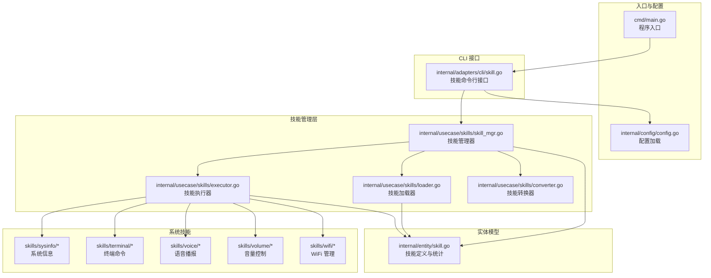
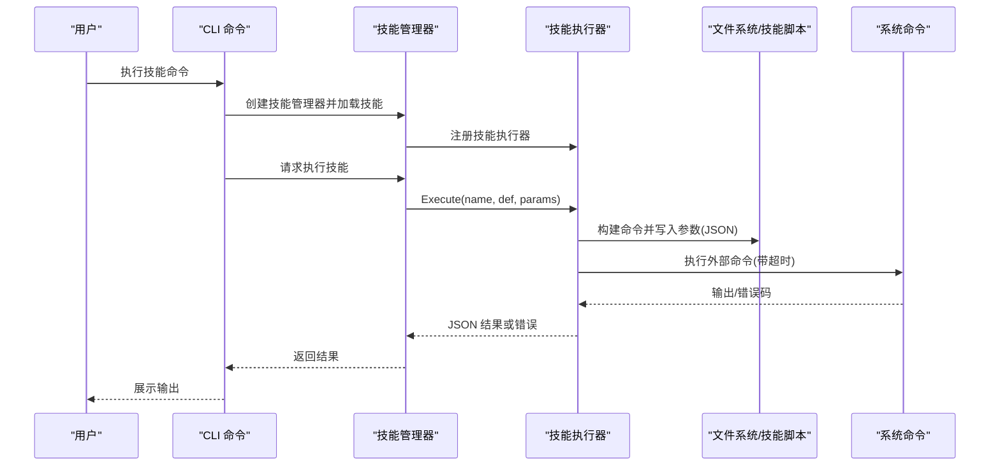
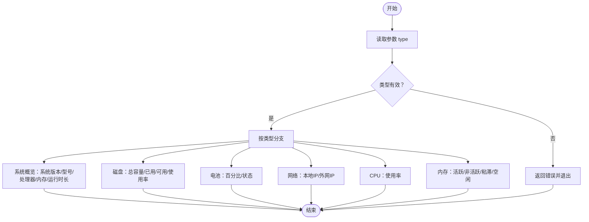
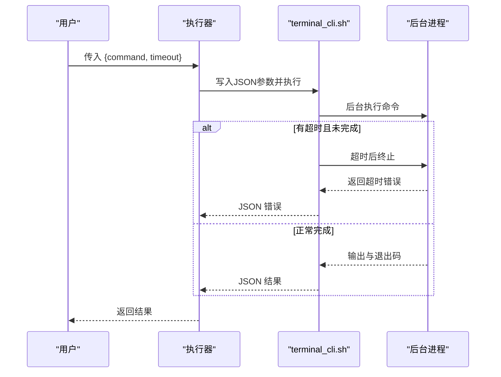
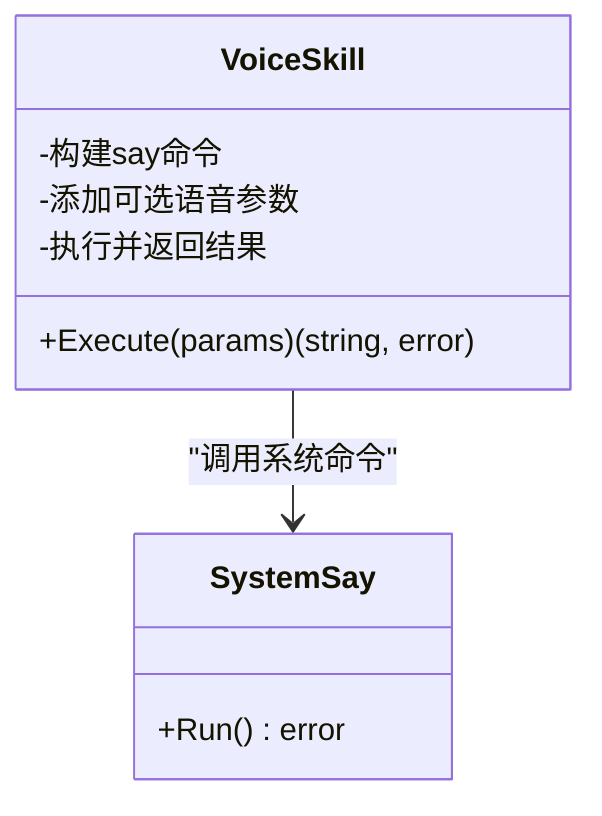
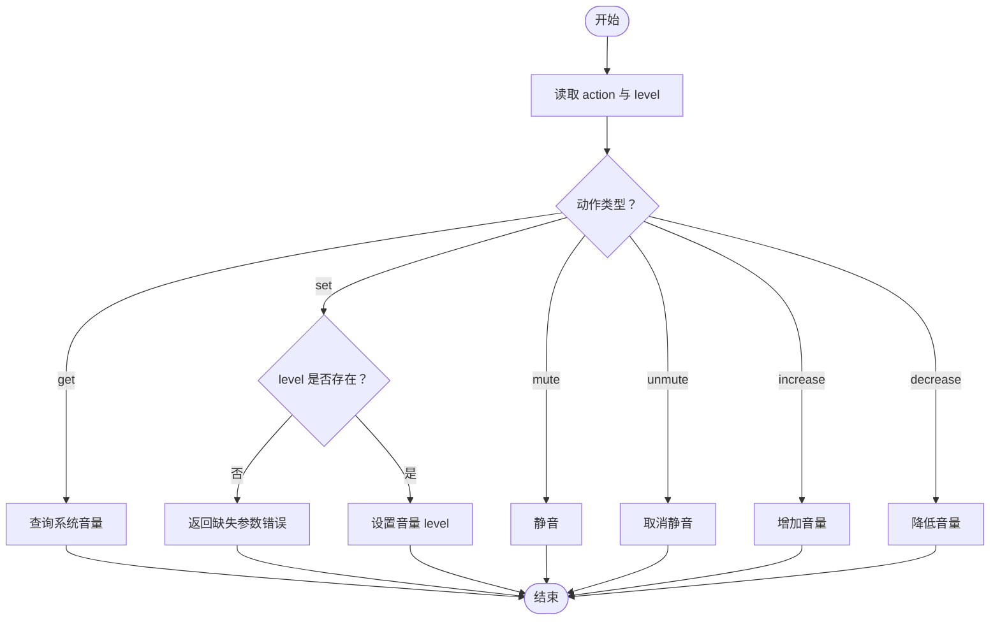
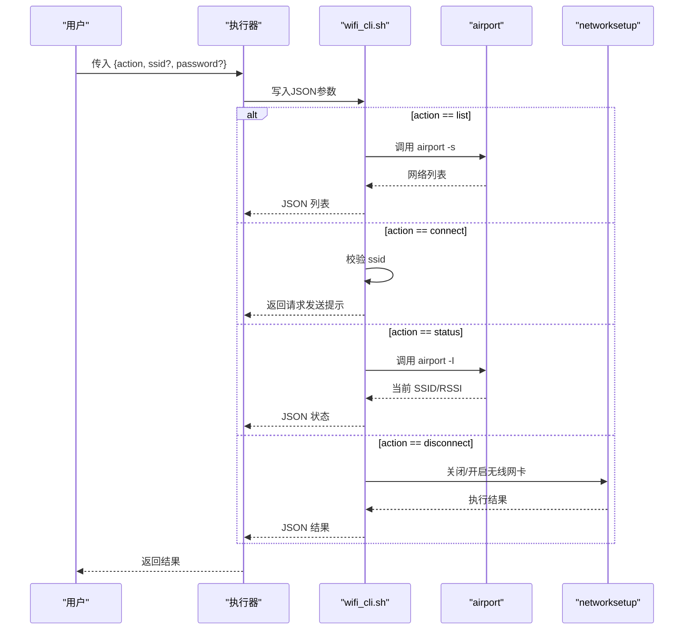

# 系统工具类技能

<cite>
**本文档引用的文件**
- [cmd/main.go](file://cmd/main.go)
- [internal/usecase/skills/executor.go](file://internal/usecase/skills/executor.go)
- [internal/usecase/skills/skill_mgr.go](file://internal/usecase/skills/skill_mgr.go)
- [internal/usecase/skills/loader.go](file://internal/usecase/skills/loader.go)
- [internal/usecase/skills/converter.go](file://internal/usecase/skills/converter.go)
- [internal/entity/skill.go](file://internal/entity/skill.go)
- [internal/adapters/cli/skill.go](file://internal/adapters/cli/skill.go)
- [internal/config/config.go](file://internal/config/config.go)
- [skills/sysinfo/SKILL.md](file://skills/sysinfo/SKILL.md)
- [skills/sysinfo/sysinfo_cli.sh](file://skills/sysinfo/sysinfo_cli.sh)
- [skills/terminal/SKILL.md](file://skills/terminal/SKILL.md)
- [skills/terminal/terminal_cli.sh](file://skills/terminal/terminal_cli.sh)
- [skills/voice/SKILL.md](file://skills/voice/SKILL.md)
- [skills/voice/voice.go](file://skills/voice/voice.go)
- [skills/volume/SKILL.md](file://skills/volume/SKILL.md)
- [skills/volume/volume_cli.sh](file://skills/volume/volume_cli.sh)
- [skills/wifi/SKILL.md](file://skills/wifi/SKILL.md)
- [skills/wifi/wifi_cli.sh](file://skills/wifi/wifi_cli.sh)
</cite>

## 目录
1. [简介](#简介)
2. [项目结构](#项目结构)
3. [核心组件](#核心组件)
4. [架构总览](#架构总览)
5. [详细组件分析](#详细组件分析)
6. [依赖关系分析](#依赖关系分析)
7. [性能考虑](#性能考虑)
8. [故障排除指南](#故障排除指南)
9. [结论](#结论)
10. [附录](#附录)

## 简介
本文件面向 MindX 系统的工具类技能，围绕系统信息获取、终端操作、语音处理与网络管理四大方向，系统化梳理其功能特性、实现原理、配置参数、使用示例与故障排除方法。重点技能包括：
- 系统信息技能：硬件检测、性能监控与系统状态查询
- 终端技能：命令执行、输出处理与安全控制
- 语音技能：音频输入输出、语音合成与语音识别（系统集成）
- 音量控制与 WiFi 管理：系统集成与设备控制

## 项目结构
MindX 采用分层架构与技能体系组织，核心入口通过 CLI 命令调用技能管理器，技能由 YAML 前言定义与 Shell/Go 脚本实现，统一由技能执行器负责调度与超时控制。

**图表来源**
- [cmd/main.go](file://cmd/main.go#L1-L21)
- [internal/adapters/cli/skill.go](file://internal/adapters/cli/skill.go#L1-L327)
- [internal/usecase/skills/skill_mgr.go](file://internal/usecase/skills/skill_mgr.go#L1-L558)
- [internal/usecase/skills/executor.go](file://internal/usecase/skills/executor.go#L1-L402)
- [internal/usecase/skills/loader.go](file://internal/usecase/skills/loader.go#L1-L249)
- [internal/usecase/skills/converter.go](file://internal/usecase/skills/converter.go#L1-L121)
- [internal/entity/skill.go](file://internal/entity/skill.go#L1-L83)

**章节来源**
- [cmd/main.go](file://cmd/main.go#L1-L21)
- [internal/adapters/cli/skill.go](file://internal/adapters/cli/skill.go#L1-L327)
- [internal/usecase/skills/skill_mgr.go](file://internal/usecase/skills/skill_mgr.go#L1-L558)
- [internal/usecase/skills/executor.go](file://internal/usecase/skills/executor.go#L1-L402)
- [internal/usecase/skills/loader.go](file://internal/usecase/skills/loader.go#L1-L249)
- [internal/usecase/skills/converter.go](file://internal/usecase/skills/converter.go#L1-L121)
- [internal/entity/skill.go](file://internal/entity/skill.go#L1-L83)

## 核心组件
- 技能定义与统计：技能元数据、参数定义、运行统计与状态
- 技能加载器：扫描技能目录、解析 SKILL.md、检查依赖、构建技能信息
- 技能执行器：构建外部命令、注入参数、设置超时、处理输出与错误
- 技能管理器：协调加载、执行、索引、MCP 注册与统计持久化
- CLI 接口：提供 list/run/validate/enable/disable/reload 等命令

**章节来源**
- [internal/entity/skill.go](file://internal/entity/skill.go#L1-L83)
- [internal/usecase/skills/loader.go](file://internal/usecase/skills/loader.go#L1-L249)
- [internal/usecase/skills/executor.go](file://internal/usecase/skills/executor.go#L1-L402)
- [internal/usecase/skills/skill_mgr.go](file://internal/usecase/skills/skill_mgr.go#L1-L558)
- [internal/adapters/cli/skill.go](file://internal/adapters/cli/skill.go#L1-L327)

## 架构总览
系统以“配置驱动 + 技能即服务”的方式组织，CLI 作为入口，技能管理器负责生命周期管理，执行器负责具体执行与超时控制，技能以 Shell/Go 实现并与系统命令深度集成。

**图表来源**
- [internal/adapters/cli/skill.go](file://internal/adapters/cli/skill.go#L79-L127)
- [internal/usecase/skills/skill_mgr.go](file://internal/usecase/skills/skill_mgr.go#L189-L211)
- [internal/usecase/skills/executor.go](file://internal/usecase/skills/executor.go#L138-L195)

## 详细组件分析

### 系统信息技能（sysinfo）
- 功能概述：获取系统概览、磁盘、电池、网络、CPU、内存等信息
- 支持平台：darwin
- 关键参数：
  - type：all/overview/disk/battery/network/cpu/memory
- 输出格式：JSON 对象，包含对应字段
- 安全与稳定性：严格参数校验与错误返回；使用系统命令组合输出

**图表来源**
- [skills/sysinfo/sysinfo_cli.sh](file://skills/sysinfo/sysinfo_cli.sh#L11-L52)
- [skills/sysinfo/SKILL.md](file://skills/sysinfo/SKILL.md#L20-L25)

**章节来源**
- [skills/sysinfo/SKILL.md](file://skills/sysinfo/SKILL.md#L1-L38)
- [skills/sysinfo/sysinfo_cli.sh](file://skills/sysinfo/sysinfo_cli.sh#L1-L53)

### 终端技能（terminal）
- 功能概述：在终端中执行 shell 命令，支持超时控制与输出处理
- 关键参数：
  - command：必填，要执行的命令
  - timeout：可选，超时秒数，默认30秒；0表示无限制
- 输出处理：成功时转义输出；失败时返回错误码与输出
- 安全控制：参数校验、超时终止、临时文件隔离输出

**图表来源**
- [internal/usecase/skills/executor.go](file://internal/usecase/skills/executor.go#L138-L195)
- [skills/terminal/terminal_cli.sh](file://skills/terminal/terminal_cli.sh#L8-L59)

**章节来源**
- [skills/terminal/SKILL.md](file://skills/terminal/SKILL.md#L1-L42)
- [skills/terminal/terminal_cli.sh](file://skills/terminal/terminal_cli.sh#L1-L59)

### 语音技能（voice）
- 功能概述：使用系统语音朗读文本内容，支持选择语音类型
- 支持平台：darwin
- 关键参数：
  - text：必填，要播报的文本
  - voice：可选，语音类型标识
- 实现方式：调用系统 say 命令，动态拼接参数

**图表来源**
- [skills/voice/voice.go](file://skills/voice/voice.go#L8-L38)
- [skills/voice/SKILL.md](file://skills/voice/SKILL.md#L18-L27)

**章节来源**
- [skills/voice/SKILL.md](file://skills/voice/SKILL.md#L1-L41)
- [skills/voice/voice.go](file://skills/voice/voice.go#L1-L39)

### 音量控制技能（volume）
- 功能概述：获取/设置音量、静音/取消静音、增减音量
- 支持平台：darwin
- 关键参数：
  - action：get/set/mute/unmute/increase/decrease
  - level：当 action 为 set 时必填（0-100）
- 实现方式：通过 AppleScript 与系统音量设置交互

**图表来源**
- [skills/volume/volume_cli.sh](file://skills/volume/volume_cli.sh#L12-L52)
- [skills/volume/SKILL.md](file://skills/volume/SKILL.md#L18-L27)

**章节来源**
- [skills/volume/SKILL.md](file://skills/volume/SKILL.md#L1-L41)
- [skills/volume/volume_cli.sh](file://skills/volume/volume_cli.sh#L1-L53)

### WiFi 管理技能（wifi）
- 功能概述：列出可用网络、连接/断开 WiFi、查看状态
- 支持平台：darwin
- 关键参数：
  - action：list/connect/status/disconnect
  - ssid/password：连接时需要
- 实现方式：调用系统 airport 与 networksetup 命令

**图表来源**
- [skills/wifi/wifi_cli.sh](file://skills/wifi/wifi_cli.sh#L13-L44)
- [skills/wifi/SKILL.md](file://skills/wifi/SKILL.md#L18-L31)

**章节来源**
- [skills/wifi/SKILL.md](file://skills/wifi/SKILL.md#L1-L44)
- [skills/wifi/wifi_cli.sh](file://skills/wifi/wifi_cli.sh#L1-L45)

## 依赖关系分析
- 技能定义依赖：通过 SKILL.md 的 YAML 前言定义命令、参数、超时与标签
- 依赖检查：加载时检查二进制与环境变量是否存在
- 执行路径：外部脚本通过 JSON 输入参数，标准输出 JSON 结果
- 统计持久化：执行器将成功/失败次数、平均耗时与最近运行时间持久化到存储

**图表来源**
- [internal/usecase/skills/loader.go](file://internal/usecase/skills/loader.go#L60-L123)
- [internal/usecase/skills/executor.go](file://internal/usecase/skills/executor.go#L138-L195)
- [internal/entity/skill.go](file://internal/entity/skill.go#L51-L83)

**章节来源**
- [internal/usecase/skills/loader.go](file://internal/usecase/skills/loader.go#L186-L204)
- [internal/usecase/skills/executor.go](file://internal/usecase/skills/executor.go#L266-L322)
- [internal/entity/skill.go](file://internal/entity/skill.go#L51-L83)

## 性能考虑
- 超时控制：外部脚本执行统一受上下文超时约束，避免长时间阻塞
- 输出处理：成功输出进行转义与合并，减少解析复杂度
- 统计采样：执行时间滚动采样上限为固定窗口，保证统计效率
- 异步索引：技能向量索引异步工作，不影响主流程

[本节为通用指导，无需特定文件来源]

## 故障排除指南
- 技能未找到：确认技能名称正确且已启用
- 依赖缺失：检查二进制与环境变量，参考缺失项提示
- 超时错误：调整 timeout 或简化命令；必要时拆分子任务
- 权限问题：某些系统命令需要管理员权限或用户授权（如 WiFi 连接）
- 输出异常：确认脚本输出符合 JSON 格式；错误输出会被捕获并返回

**章节来源**
- [internal/usecase/skills/executor.go](file://internal/usecase/skills/executor.go#L179-L190)
- [internal/usecase/skills/loader.go](file://internal/usecase/skills/loader.go#L76-L101)
- [internal/adapters/cli/skill.go](file://internal/adapters/cli/skill.go#L109-L125)

## 结论
MindX 的系统工具类技能通过标准化的技能定义与执行框架，实现了对系统信息、终端命令、语音播报、音量控制与 WiFi 管理的统一接入。其设计强调安全性（参数校验、超时控制）、可观测性（统计与日志）与可扩展性（Shell/Go 脚本与 MCP）。建议在生产环境中结合权限与网络策略，合理设置超时与重试，确保稳定运行。

[本节为总结性内容，无需特定文件来源]

## 附录

### 使用示例与参数说明

- 系统信息技能
  - 示例：type=battery
  - 输出：包含 percentage 与 status 字段的 JSON 对象

- 终端技能
  - 示例：command=ls -la /Users
  - 输出：包含 result 与 exit_code 的 JSON 对象

- 语音技能
  - 示例：text=任务完成, voice=Samantha
  - 行为：系统语音播报指定文本

- 音量控制技能
  - 示例：action=set, level=50
  - 输出：包含 result 的 JSON 对象

- WiFi 管理技能
  - 示例：action=list
  - 输出：网络列表的 JSON 数组

**章节来源**
- [skills/sysinfo/SKILL.md](file://skills/sysinfo/SKILL.md#L29-L37)
- [skills/terminal/SKILL.md](file://skills/terminal/SKILL.md#L33-L41)
- [skills/voice/SKILL.md](file://skills/voice/SKILL.md#L31-L40)
- [skills/volume/SKILL.md](file://skills/volume/SKILL.md#L31-L40)
- [skills/wifi/SKILL.md](file://skills/wifi/SKILL.md#L35-L43)