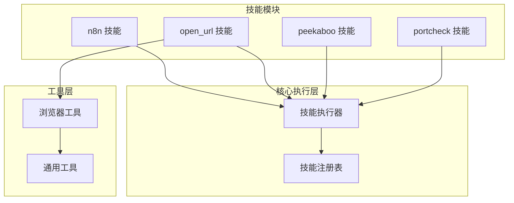
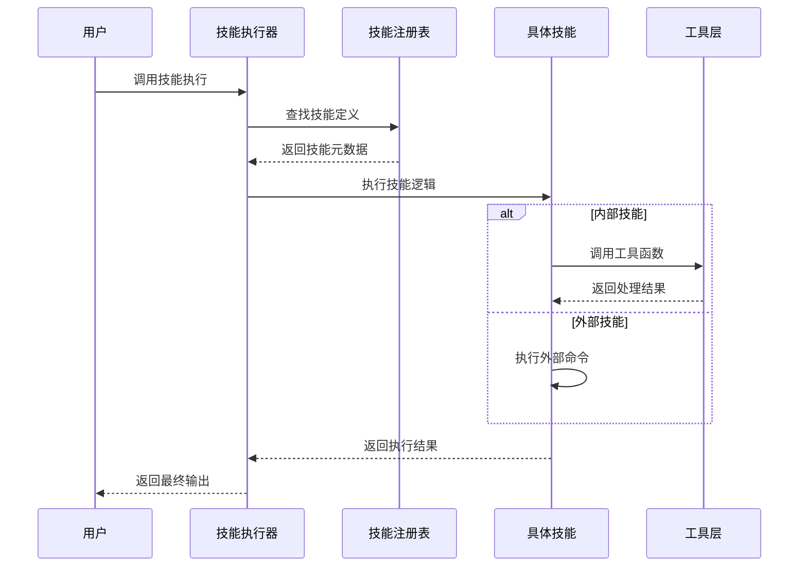
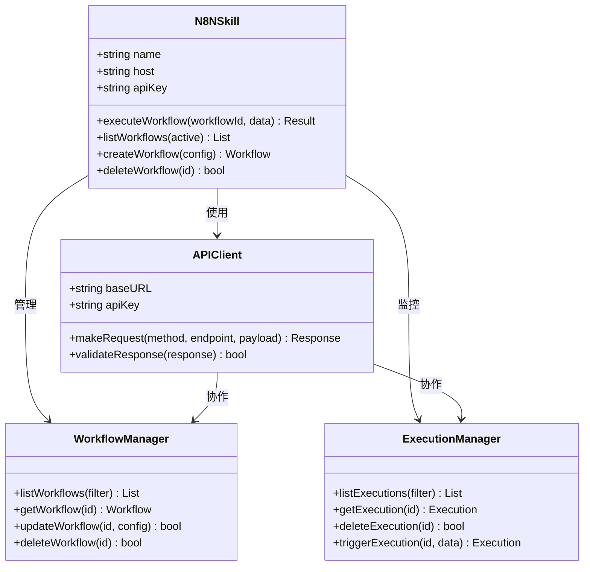
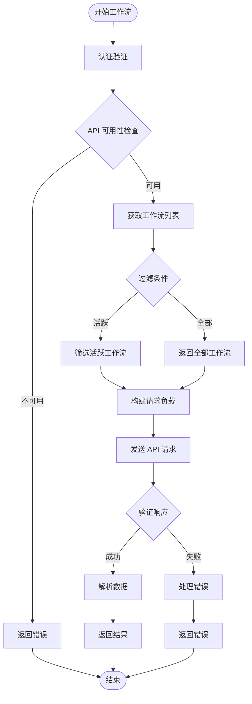
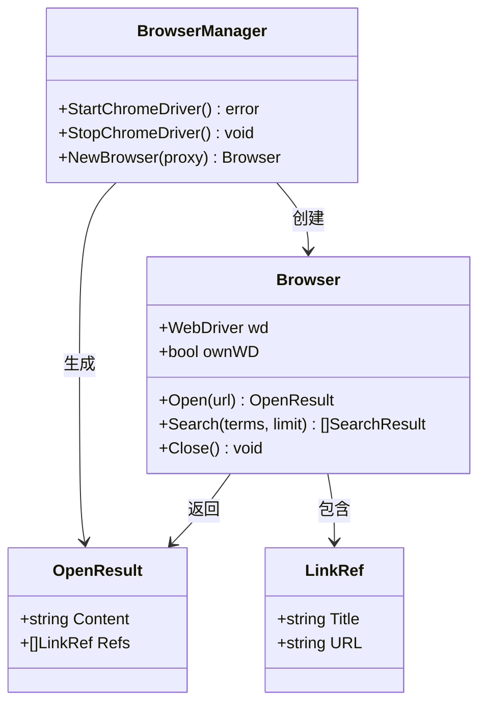
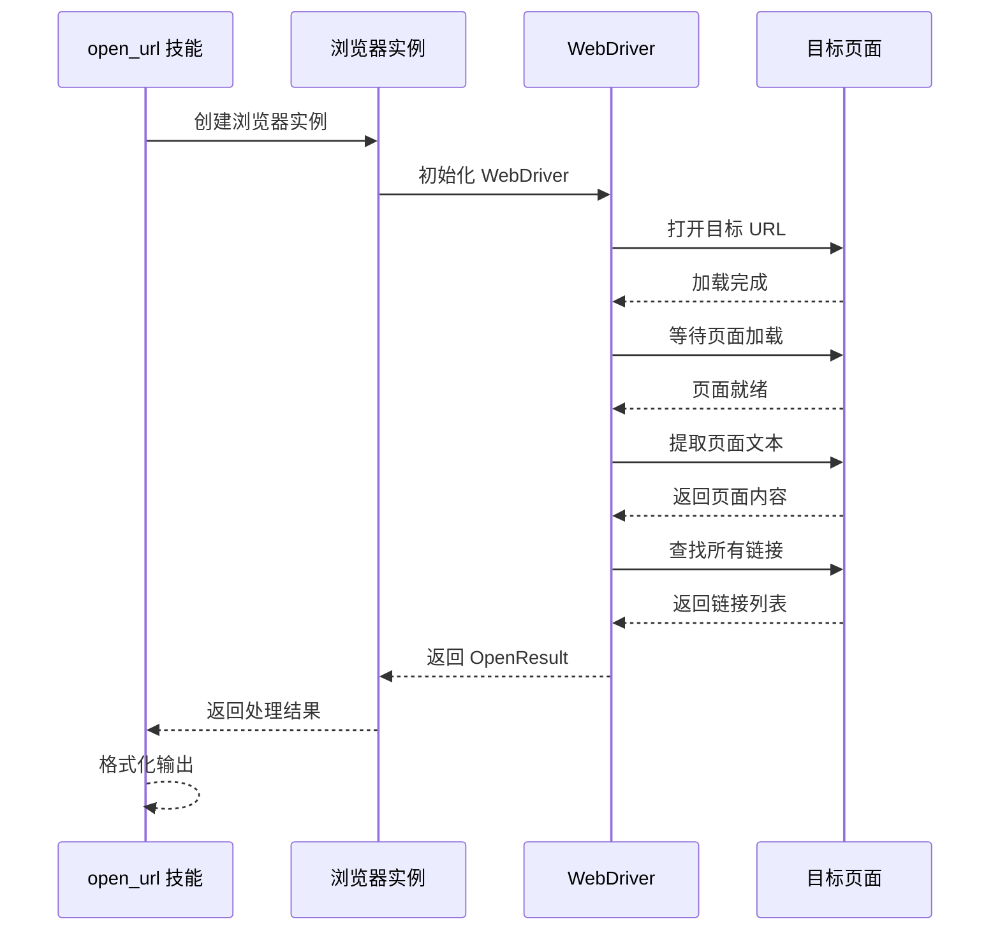
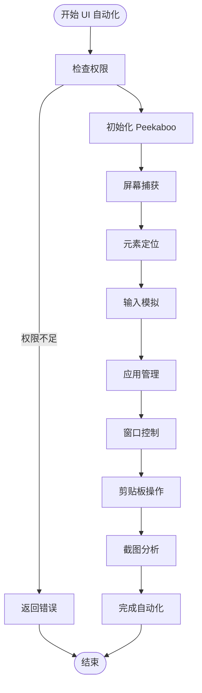
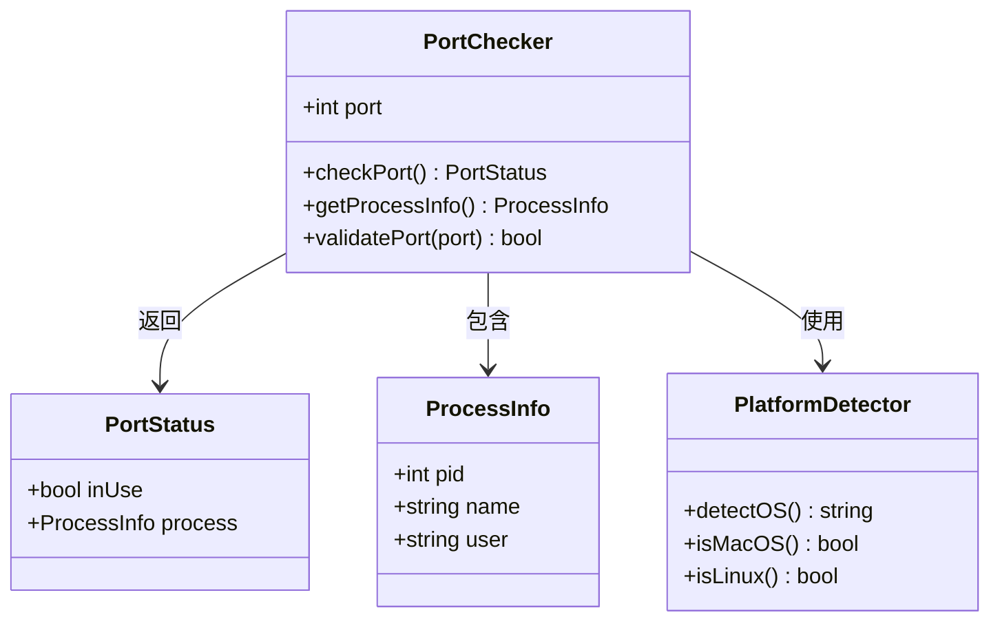
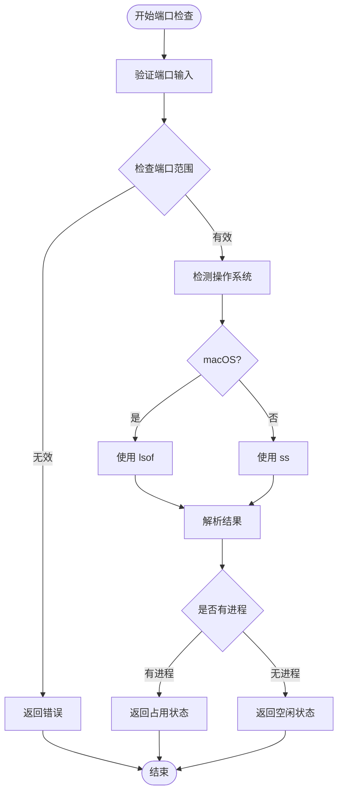
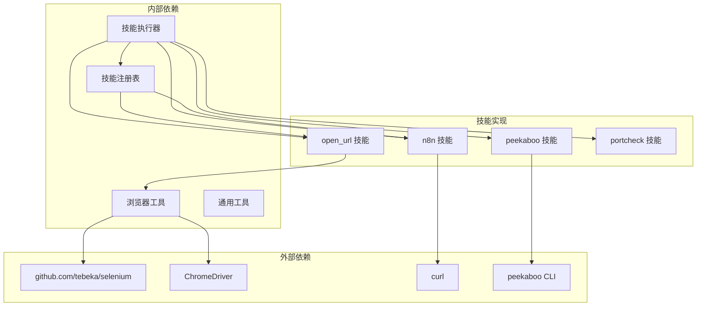

# 自动化工具类技能

<cite>
**本文档引用的文件**
- [n8n 技能说明](file://skills/n8n/SKILL.md)
- [n8n API 参考](file://skills/n8n/references/API_REFERENCE.md)
- [open_url 技能说明](file://skills/open_url/SKILL.md)
- [open_url Go 实现](file://internal/usecase/skills/builtins/open_url.go)
- [浏览器工具](file://internal/utils/browser.go)
- [peekaboo 技能说明](file://skills/peekaboo/SKILL.md)
- [portcheck 技能说明](file://skills/portcheck/SKILL.md)
- [portcheck Shell 实现](file://skills/portcheck/portcheck_cli.sh)
- [技能注册表](file://internal/usecase/skills/builtins/registry.go)
- [技能执行器](file://internal/usecase/skills/executor.go)
</cite>

## 目录
1. [简介](#简介)
2. [项目结构](#项目结构)
3. [核心组件](#核心组件)
4. [架构概览](#架构概览)
5. [详细组件分析](#详细组件分析)
6. [依赖关系分析](#依赖关系分析)
7. [性能考虑](#性能考虑)
8. [故障排除指南](#故障排除指南)
9. [结论](#结论)

## 简介

MindX 自动化工具类技能提供了四个关键的自动化能力：n8n 工作流集成、URL 打开与内容提取、窥视者 UI 自动化监控，以及端口检查诊断。这些技能通过统一的技能执行框架进行管理和调度，为用户提供了一套完整的自动化解决方案。

## 项目结构

MindX 的自动化技能采用模块化设计，每个技能都是独立的模块，包含技能定义、实现代码和文档说明。

**图表来源**
- [技能注册表](file://internal/usecase/skills/builtins/registry.go#L15-L29)
- [技能执行器](file://internal/usecase/skills/executor.go#L57-L79)

**章节来源**
- [技能注册表](file://internal/usecase/skills/builtins/registry.go#L1-L30)
- [技能执行器](file://internal/usecase/skills/executor.go#L57-L79)

## 核心组件

MindX 自动化工具类技能包含以下四个核心组件：

### 1. n8n 工作流管理技能
- **功能**：通过 REST API 管理 n8n 工作流、执行记录、标签和凭证
- **认证**：基于 API 密钥的认证机制
- **支持的操作**：创建工作流、更新工作流、删除工作流、触发执行等

### 2. open_url 网页内容提取技能
- **功能**：使用无头 Chrome 浏览器打开 URL 并提取页面内容
- **特性**：支持 JavaScript 渲染、代理配置、反检测措施
- **输出**：页面标题、内容、引用链接等

### 3. peekaboo UI 自动化技能
- **功能**：macOS 平台的 UI 自动化，包括屏幕捕获、元素定位、自动点击
- **支持的操作**：应用管理、窗口控制、输入模拟、截图分析
- **平台**：专为 macOS 设计

### 4. portcheck 端口检查技能
- **功能**：检查指定端口的占用情况和进程信息
- **支持平台**：macOS 和 Linux
- **输出**：端口状态、进程详情等

**章节来源**
- [n8n 技能说明](file://skills/n8n/SKILL.md#L1-L95)
- [open_url 技能说明](file://skills/open_url/SKILL.md#L1-L70)
- [peekaboo 技能说明](file://skills/peekaboo/SKILL.md#L1-L99)
- [portcheck 技能说明](file://skills/portcheck/SKILL.md#L1-L60)

## 架构概览

MindX 的技能架构采用分层设计，确保了良好的可扩展性和维护性。

**图表来源**
- [技能执行器](file://internal/usecase/skills/executor.go#L57-L79)
- [技能注册表](file://internal/usecase/skills/builtins/registry.go#L15-L29)

## 详细组件分析

### n8n 工作流管理技能

#### 技能架构设计

**图表来源**
- [n8n 技能说明](file://skills/n8n/SKILL.md#L29-L95)
- [n8n API 参考](file://skills/n8n/references/API_REFERENCE.md#L43-L343)

#### 工作流编排流程

**图表来源**
- [n8n API 参考](file://skills/n8n/references/API_REFERENCE.md#L45-L83)

#### 数据传递机制

n8n 技能通过以下机制实现数据传递：

1. **环境变量管理**：通过 `N8N_API_KEY` 和 `N8N_HOST` 环境变量进行配置
2. **请求头传递**：使用 `X-N8N-API-KEY` 头进行身份验证
3. **JSON 数据交换**：工作流执行数据以 JSON 格式传递

**章节来源**
- [n8n 技能说明](file://skills/n8n/SKILL.md#L33-L95)
- [n8n API 参考](file://skills/n8n/references/API_REFERENCE.md#L12-L42)

### open_url 网页内容提取技能

#### 浏览器集成架构

**图表来源**
- [open_url Go 实现](file://internal/usecase/skills/builtins/open_url.go#L51-L65)
- [浏览器工具](file://internal/utils/browser.go#L51-L59)

#### 浏览器自动化流程

**图表来源**
- [open_url Go 实现](file://internal/usecase/skills/builtins/open_url.go#L11-L38)
- [浏览器工具](file://internal/utils/browser.go#L251-L302)

#### 快捷方式和安全控制

open_url 技能实现了多种安全和性能优化措施：

1. **反检测机制**：随机化 User-Agent 和窗口大小
2. **代理支持**：支持 HTTP/HTTPS 代理配置
3. **无头模式**：使用 Chrome 无头模式运行
4. **资源管理**：自动清理浏览器进程和资源

**章节来源**
- [open_url 技能说明](file://skills/open_url/SKILL.md#L28-L70)
- [open_url Go 实现](file://internal/usecase/skills/builtins/open_url.go#L1-L66)
- [浏览器工具](file://internal/utils/browser.go#L98-L167)

### peekaboo UI 自动化技能

#### UI 自动化功能架构

**图表来源**
- [peekaboo 技能说明](file://skills/peekaboo/SKILL.md#L26-L99)

#### 核心功能分类

peekaboo 技能提供三大类核心功能：

1. **交互操作**：点击、拖拽、热键、移动、粘贴、按键、滚动、输入
2. **系统操作**：应用生命周期管理、剪贴板、系统对话框、Dock、菜单、窗口
3. **视觉操作**：屏幕截图、图像分析

**章节来源**
- [peekaboo 技能说明](file://skills/peekaboo/SKILL.md#L40-L99)

### portcheck 端口检查技能

#### 网络诊断架构

**图表来源**
- [portcheck 技能说明](file://skills/portcheck/SKILL.md#L1-L60)
- [portcheck Shell 实现](file://skills/portcheck/portcheck_cli.sh#L28-L41)

#### 端口检查流程

**图表来源**
- [portcheck Shell 实现](file://skills/portcheck/portcheck_cli.sh#L16-L41)

**章节来源**
- [portcheck 技能说明](file://skills/portcheck/SKILL.md#L34-L60)
- [portcheck Shell 实现](file://skills/portcheck/portcheck_cli.sh#L1-L42)

## 依赖关系分析

MindX 技能系统的依赖关系体现了清晰的分层架构。

**图表来源**
- [技能注册表](file://internal/usecase/skills/builtins/registry.go#L15-L29)
- [技能执行器](file://internal/usecase/skills/executor.go#L218-L260)

**章节来源**
- [技能注册表](file://internal/usecase/skills/builtins/registry.go#L1-L30)
- [技能执行器](file://internal/usecase/skills/executor.go#L218-L260)

## 性能考虑

### 内存管理
- **浏览器实例复用**：ChromeDriver 服务采用单例模式，避免重复启动
- **资源清理**：自动关闭浏览器会话和清理临时文件
- **内存泄漏防护**：及时释放 WebDriver 对象和相关资源

### 网络性能
- **超时控制**：为每个技能设置合理的超时时间
- **并发限制**：避免同时启动过多的浏览器实例
- **缓存策略**：对常用的 API 响应进行缓存

### 平台优化
- **条件编译**：针对不同操作系统优化执行路径
- **资源适配**：根据系统资源动态调整执行策略
- **错误恢复**：实现优雅的错误处理和恢复机制

## 故障排除指南

### n8n 技能常见问题

1. **API 密钥错误**
   - 检查 `N8N_API_KEY` 环境变量是否正确设置
   - 验证 API 密钥是否具有足够的权限

2. **连接超时**
   - 确认 `N8N_HOST` 地址可达
   - 检查防火墙设置和网络连接

3. **API 版本不兼容**
   - 确认使用的 API 版本与 n8n 实例匹配
   - 检查请求头中的版本信息

### open_url 技能问题

1. **浏览器启动失败**
   - 检查 ChromeDriver 是否正确安装
   - 验证 Chrome 浏览器版本兼容性

2. **页面加载超时**
   - 调整页面等待时间
   - 检查网络连接稳定性

3. **内容提取异常**
   - 确认目标网站允许爬虫访问
   - 检查反爬虫机制和应对策略

### peekaboo 技能问题

1. **权限不足**
   - 运行 `peekaboo permissions` 检查权限
   - 授权屏幕录制和辅助功能权限

2. **元素定位失败**
   - 使用 `peekaboo see --annotate` 进行可视化调试
   - 检查元素的可见性和稳定性

### portcheck 技能问题

1. **端口范围错误**
   - 确认端口号在 1-65535 范围内
   - 检查输入参数格式

2. **平台兼容性**
   - 确认操作系统支持相应命令
   - 检查系统工具的可用性

**章节来源**
- [n8n 技能说明](file://skills/n8n/SKILL.md#L89-L95)
- [open_url 技能说明](file://skills/open_url/SKILL.md#L30-L70)
- [peekaboo 技能说明](file://skills/peekaboo/SKILL.md#L95-L99)
- [portcheck 技能说明](file://skills/portcheck/SKILL.md#L26-L30)

## 结论

MindX 自动化工具类技能提供了一个功能完整、架构清晰的自动化解决方案。通过统一的技能执行框架，四个核心技能（n8n 工作流管理、open_url 内容提取、peekaboo UI 自动化、portcheck 端口检查）实现了高度的模块化和可扩展性。

### 主要优势

1. **模块化设计**：每个技能都是独立的模块，便于维护和扩展
2. **统一接口**：通过技能执行器提供一致的调用接口
3. **平台兼容**：支持多操作系统和多种执行方式
4. **安全考虑**：内置多种安全和反检测机制
5. **性能优化**：合理的资源管理和错误处理机制

### 最佳实践建议

1. **配置管理**：使用环境变量管理敏感配置信息
2. **错误处理**：实现完善的错误处理和重试机制
3. **监控告警**：建立技能执行状态的监控和告警机制
4. **性能调优**：根据实际需求调整超时时间和资源限制
5. **安全审计**：定期审查技能的权限和访问控制

这套自动化工具类技能为用户提供了强大的自动化能力，能够满足各种复杂的自动化需求，是构建智能化工作流程的理想选择。