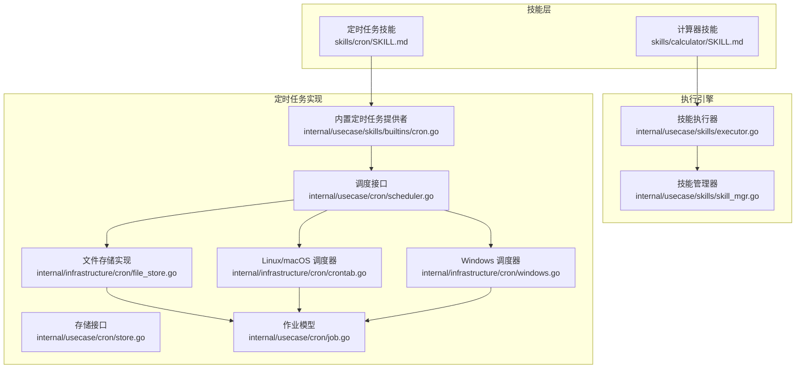
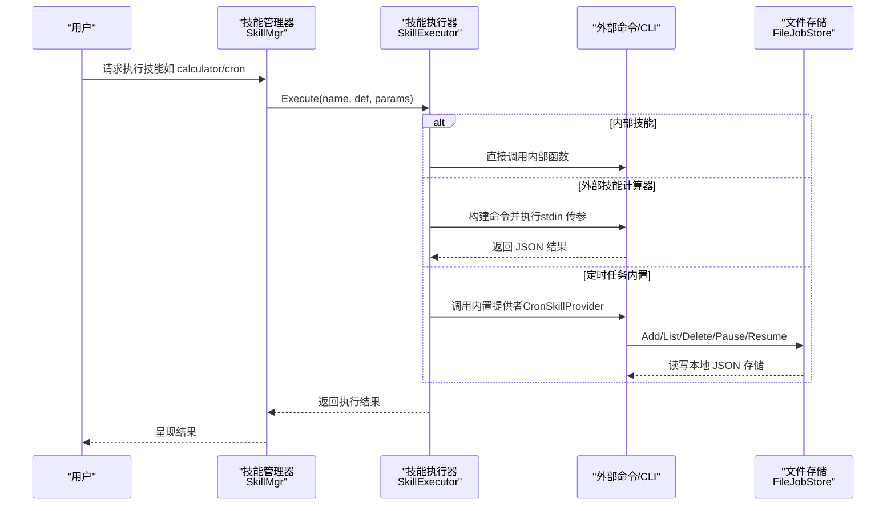
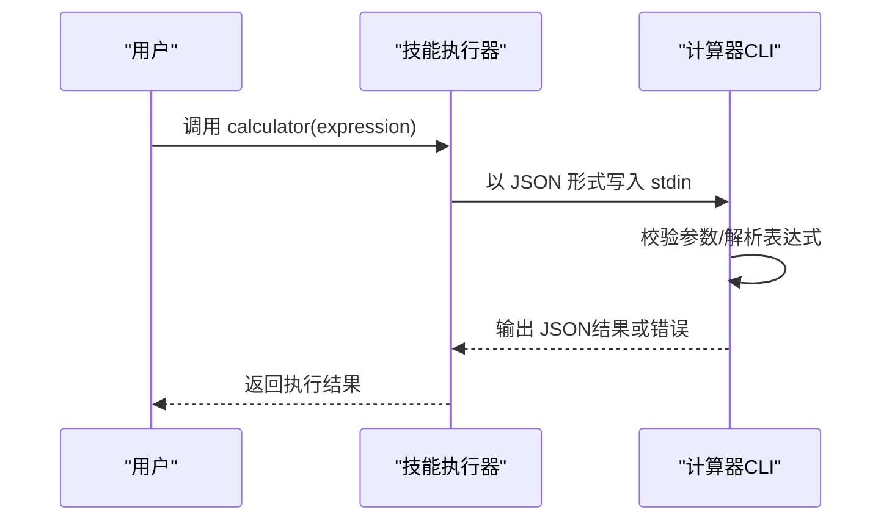
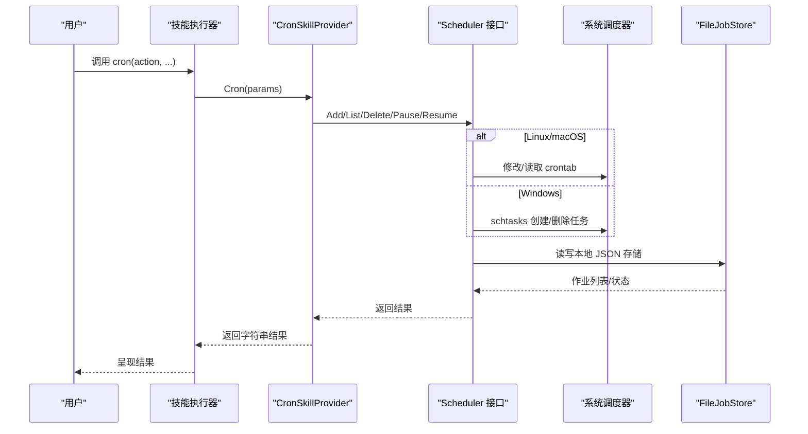
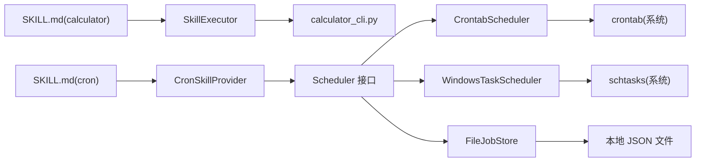
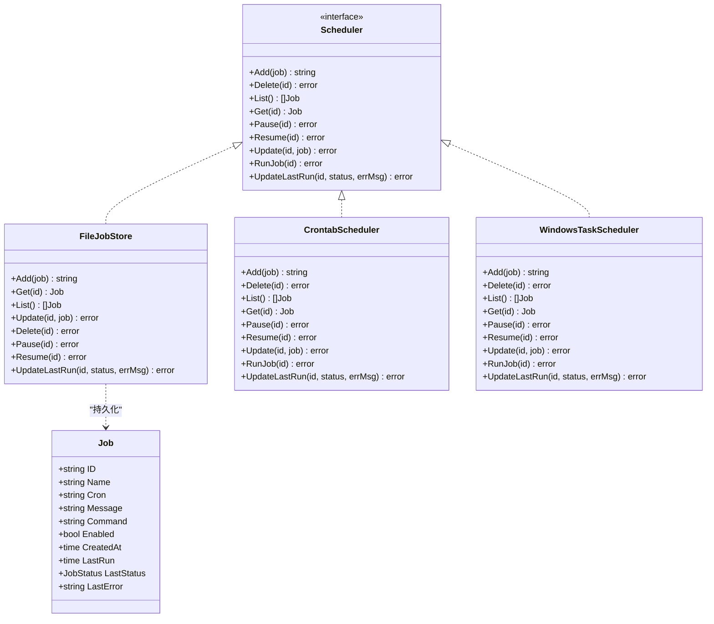

# 计算类技能

<cite>
**本文引用的文件**
- [skills/calculator/SKILL.md](file://skills/calculator/SKILL.md)
- [skills/calculator/calculator_cli.py](file://skills/calculator/calculator_cli.py)
- [skills/cron/SKILL.md](file://skills/cron/SKILL.md)
- [internal/usecase/skills/builtins/cron.go](file://internal/usecase/skills/builtins/cron.go)
- [internal/infrastructure/cron/crontab.go](file://internal/infrastructure/cron/crontab.go)
- [internal/infrastructure/cron/windows.go](file://internal/infrastructure/cron/windows.go)
- [internal/infrastructure/cron/file_store.go](file://internal/infrastructure/cron/file_store.go)
- [internal/usecase/cron/job.go](file://internal/usecase/cron/job.go)
- [internal/usecase/cron/scheduler.go](file://internal/usecase/cron/scheduler.go)
- [internal/usecase/cron/store.go](file://internal/usecase/cron/store.go)
- [internal/usecase/skills/executor.go](file://internal/usecase/skills/executor.go)
- [internal/utils/math.go](file://internal/utils/math.go)
- [internal/usecase/skills/skill_mgr.go](file://internal/usecase/skills/skill_mgr.go)
</cite>

## 目录
1. [简介](#简介)
2. [项目结构](#项目结构)
3. [核心组件](#核心组件)
4. [架构总览](#架构总览)
5. [组件详解](#组件详解)
6. [依赖关系分析](#依赖关系分析)
7. [性能与精度建议](#性能与精度建议)
8. [故障排查指南](#故障排查指南)
9. [结论](#结论)
10. [附录](#附录)

## 简介
本文件面向 MindX 的“计算类技能”，聚焦两类技能：
- 计算器技能：接收数学表达式，安全地解析并计算，返回结果与历史记录能力（通过外部 CLI 与系统交互实现）。
- 定时任务技能：统一管理 Cron 任务的添加、查询、删除、暂停与恢复，基于系统原生调度器（Linux/macOS 的 crontab 或 Windows 的任务计划程序），并在任务触发时通过 MindX 发起完整对话流程。

文档将从功能特性、使用方法、应用场景、配置参数、数据流与架构、性能与安全、最佳实践等方面进行系统化说明，并给出可视化图示与排障建议。

## 项目结构
围绕计算类技能的相关代码分布在以下区域：
- 技能定义与外部 CLI：skills/calculator
- 定时任务技能实现：skills/cron 以及内部 usecase/infrastructure 层
- 技能执行引擎：internal/usecase/skills
- 工具与通用能力：internal/utils

图表来源
- [skills/calculator/SKILL.md](file://skills/calculator/SKILL.md#L1-L37)
- [skills/cron/SKILL.md](file://skills/cron/SKILL.md#L1-L187)
- [internal/usecase/skills/executor.go](file://internal/usecase/skills/executor.go#L57-L177)
- [internal/usecase/skills/skill_mgr.go](file://internal/usecase/skills/skill_mgr.go#L1-L558)
- [internal/usecase/skills/builtins/cron.go](file://internal/usecase/skills/builtins/cron.go#L1-L118)
- [internal/usecase/cron/scheduler.go](file://internal/usecase/cron/scheduler.go#L1-L17)
- [internal/usecase/cron/store.go](file://internal/usecase/cron/store.go#L1-L13)
- [internal/infrastructure/cron/file_store.go](file://internal/infrastructure/cron/file_store.go#L1-L184)
- [internal/infrastructure/cron/crontab.go](file://internal/infrastructure/cron/crontab.go#L1-L263)
- [internal/infrastructure/cron/windows.go](file://internal/infrastructure/cron/windows.go#L1-L172)
- [internal/usecase/cron/job.go](file://internal/usecase/cron/job.go#L1-L25)

章节来源
- [skills/calculator/SKILL.md](file://skills/calculator/SKILL.md#L1-L37)
- [skills/cron/SKILL.md](file://skills/cron/SKILL.md#L1-L187)
- [internal/usecase/skills/executor.go](file://internal/usecase/skills/executor.go#L57-L177)
- [internal/usecase/skills/skill_mgr.go](file://internal/usecase/skills/skill_mgr.go#L1-L558)

## 核心组件
- 计算器技能
  - 技能定义：位于 skills/calculator/SKILL.md，声明参数 expression（必填）与执行命令 calculator_cli.py。
  - 外部 CLI：skills/calculator/calculator_cli.py 从标准输入读取 JSON 参数，校验 expression 后使用安全上下文计算表达式，输出结果或错误。
  - 执行路径：由技能执行引擎以外部命令方式调用，参数序列化为 JSON 写入 stdin，输出经解析后返回。
- 定时任务技能
  - 技能定义：位于 skills/cron/SKILL.md，支持 add/list/delete/pause/resume 动作，参数包括 name、cron、message、id 等。
  - 内置提供者：internal/usecase/skills/builtins/cron.go 根据 action 分派到具体操作。
  - 调度与存储：
    - 接口：internal/usecase/cron/scheduler.go、internal/usecase/cron/store.go。
    - 实现：Linux/macOS 使用 crontab.go；Windows 使用 windows.go；通用存储使用 file_store.go。
    - 作业模型：internal/usecase/cron/job.go。
  - 触发机制：Cron 在系统层面按表达式触发，Linux/macOS 通过修改 crontab 注释/取消注释实现暂停/恢复；Windows 通过 schtasks 创建/删除任务实现。

章节来源
- [skills/calculator/SKILL.md](file://skills/calculator/SKILL.md#L1-L37)
- [skills/calculator/calculator_cli.py](file://skills/calculator/calculator_cli.py#L1-L39)
- [internal/usecase/skills/executor.go](file://internal/usecase/skills/executor.go#L138-L177)
- [skills/cron/SKILL.md](file://skills/cron/SKILL.md#L1-L187)
- [internal/usecase/skills/builtins/cron.go](file://internal/usecase/skills/builtins/cron.go#L1-L118)
- [internal/usecase/cron/scheduler.go](file://internal/usecase/cron/scheduler.go#L1-L17)
- [internal/usecase/cron/store.go](file://internal/usecase/cron/store.go#L1-L13)
- [internal/infrastructure/cron/file_store.go](file://internal/infrastructure/cron/file_store.go#L1-L184)
- [internal/infrastructure/cron/crontab.go](file://internal/infrastructure/cron/crontab.go#L1-L263)
- [internal/infrastructure/cron/windows.go](file://internal/infrastructure/cron/windows.go#L1-L172)
- [internal/usecase/cron/job.go](file://internal/usecase/cron/job.go#L1-L25)

## 架构总览
下图展示计算器与定时任务两大类技能在 MindX 中的端到端调用与执行路径。

图表来源
- [internal/usecase/skills/skill_mgr.go](file://internal/usecase/skills/skill_mgr.go#L189-L211)
- [internal/usecase/skills/executor.go](file://internal/usecase/skills/executor.go#L57-L177)
- [internal/usecase/skills/builtins/cron.go](file://internal/usecase/skills/builtins/cron.go#L17-L41)
- [internal/infrastructure/cron/file_store.go](file://internal/infrastructure/cron/file_store.go#L57-L184)

## 组件详解

### 计算器技能
- 功能特性
  - 支持任意合法数学表达式计算（通过外部 CLI 执行）。
  - 参数校验：expression 必填；缺失时报错。
  - 错误处理：表达式异常时返回错误信息。
  - 历史记录：当前 CLI 未内置持久化；可通过外部系统或上层应用收集与存储。
- 使用方法
  - 调用格式：包含参数 name 与 parameters.expression。
  - 示例见技能定义文件中的示例 JSON。
- 数据流与执行链路
  - 技能执行器以外部命令方式调用 calculator_cli.py，将参数序列化为 JSON 写入 stdin。
  - CLI 读取并解析表达式，计算后输出 JSON；执行器捕获输出并返回。
- 安全与精度
  - CLI 使用受限上下文执行表达式，避免导入内置函数，降低风险。
  - 精度控制建议：结合工具函数进行四舍五入与范围约束（见“性能与精度建议”）。

图表来源
- [skills/calculator/SKILL.md](file://skills/calculator/SKILL.md#L19-L36)
- [skills/calculator/calculator_cli.py](file://skills/calculator/calculator_cli.py#L9-L35)
- [internal/usecase/skills/executor.go](file://internal/usecase/skills/executor.go#L138-L177)

章节来源
- [skills/calculator/SKILL.md](file://skills/calculator/SKILL.md#L1-L37)
- [skills/calculator/calculator_cli.py](file://skills/calculator/calculator_cli.py#L1-L39)
- [internal/usecase/skills/executor.go](file://internal/usecase/skills/executor.go#L138-L177)

### 定时任务技能
- 功能特性
  - 统一管理：add/list/delete/pause/resume。
  - 系统级调度：Linux/macOS 使用 crontab；Windows 使用任务计划程序。
  - 对话触发：任务触发时通过 MindX 发送消息，进入大脑正常对话路径。
- 使用方法
  - 添加任务：action=add，需提供 name、cron、message。
  - 查询/删除/暂停/恢复：分别对应 list/delete/pause/resume，delete/pause/resume 需提供 id。
  - Cron 表达式：分 时 日 月 周，支持常用示例。
- 数据流与执行链路
  - 内置提供者根据 action 分派到具体操作。
  - 调度器接口在不同平台有不同的实现：crontab.go 与 windows.go。
  - 作业信息保存在本地 JSON 文件中，便于跨进程/跨重启持久化。

图表来源
- [skills/cron/SKILL.md](file://skills/cron/SKILL.md#L22-L43)
- [internal/usecase/skills/builtins/cron.go](file://internal/usecase/skills/builtins/cron.go#L17-L117)
- [internal/infrastructure/cron/crontab.go](file://internal/infrastructure/cron/crontab.go#L27-L126)
- [internal/infrastructure/cron/windows.go](file://internal/infrastructure/cron/windows.go#L27-L146)
- [internal/infrastructure/cron/file_store.go](file://internal/infrastructure/cron/file_store.go#L57-L184)

章节来源
- [skills/cron/SKILL.md](file://skills/cron/SKILL.md#L1-L187)
- [internal/usecase/skills/builtins/cron.go](file://internal/usecase/skills/builtins/cron.go#L1-L118)
- [internal/infrastructure/cron/crontab.go](file://internal/infrastructure/cron/crontab.go#L1-L263)
- [internal/infrastructure/cron/windows.go](file://internal/infrastructure/cron/windows.go#L1-L172)
- [internal/infrastructure/cron/file_store.go](file://internal/infrastructure/cron/file_store.go#L1-L184)
- [internal/usecase/cron/job.go](file://internal/usecase/cron/job.go#L1-L25)
- [internal/usecase/cron/scheduler.go](file://internal/usecase/cron/scheduler.go#L1-L17)
- [internal/usecase/cron/store.go](file://internal/usecase/cron/store.go#L1-L13)

## 依赖关系分析
- 计算器技能
  - 依赖技能执行器以外部命令方式运行 CLI。
  - CLI 依赖 Python 运行时与标准库。
- 定时任务技能
  - 依赖调度接口与平台特定实现。
  - 依赖文件存储实现持久化作业信息。
  - 依赖系统原生命令（crontab/schtasks）。

图表来源
- [skills/calculator/SKILL.md](file://skills/calculator/SKILL.md#L1-L37)
- [skills/calculator/calculator_cli.py](file://skills/calculator/calculator_cli.py#L1-L39)
- [skills/cron/SKILL.md](file://skills/cron/SKILL.md#L1-L187)
- [internal/usecase/skills/builtins/cron.go](file://internal/usecase/skills/builtins/cron.go#L1-L118)
- [internal/infrastructure/cron/crontab.go](file://internal/infrastructure/cron/crontab.go#L1-L263)
- [internal/infrastructure/cron/windows.go](file://internal/infrastructure/cron/windows.go#L1-L172)
- [internal/infrastructure/cron/file_store.go](file://internal/infrastructure/cron/file_store.go#L1-L184)

章节来源
- [internal/usecase/skills/executor.go](file://internal/usecase/skills/executor.go#L138-L177)
- [internal/usecase/skills/builtins/cron.go](file://internal/usecase/skills/builtins/cron.go#L1-L118)
- [internal/infrastructure/cron/crontab.go](file://internal/infrastructure/cron/crontab.go#L1-L263)
- [internal/infrastructure/cron/windows.go](file://internal/infrastructure/cron/windows.go#L1-L172)
- [internal/infrastructure/cron/file_store.go](file://internal/infrastructure/cron/file_store.go#L1-L184)

## 性能与精度建议
- 计算器技能
  - 精度控制：可使用工具函数对浮点结果进行四舍五入与范围约束，避免显示过多无效小数位。
  - 性能优化：表达式尽量简洁；避免复杂三角函数/对数等高开销运算；必要时缓存中间结果。
  - 安全加固：CLI 已限制内置函数作用域；建议在上层对表达式做白名单/黑名单预检。
- 定时任务技能
  - Cron 表达式优化：优先使用稳定的时间段（如工作日固定时刻），减少资源争用。
  - 平台差异：Linux/macOS 与 Windows 的调度器行为略有差异，注意暂停/恢复与任务重建策略。
  - 存储与并发：文件存储采用互斥锁保护，避免并发写冲突；建议在高频变更场景下合并操作。

章节来源
- [internal/utils/math.go](file://internal/utils/math.go#L99-L104)
- [internal/infrastructure/cron/file_store.go](file://internal/infrastructure/cron/file_store.go#L16-L20)
- [internal/infrastructure/cron/crontab.go](file://internal/infrastructure/cron/crontab.go#L128-L171)
- [internal/infrastructure/cron/windows.go](file://internal/infrastructure/cron/windows.go#L76-L109)

## 故障排查指南
- 计算器技能
  - 缺少参数：当 expression 为空时，CLI 返回错误；请检查调用参数。
  - 表达式错误：表达式语法或函数非法会导致异常；请修正表达式或在上层进行合法性校验。
  - 权限问题：确保 Python 可执行权限与运行环境可用。
- 定时任务技能
  - 添加失败：检查 name、cron、message 是否齐全；确认系统调度器可用（crontab/schtasks）。
  - 查看/删除/暂停/恢复失败：确认 id 是否正确；Linux/macOS 注意注释/取消注释是否生效；Windows 注意任务名映射规则。
  - 存储异常：检查本地 JSON 文件是否存在且可读写；必要时清理损坏文件后重试。
- 通用
  - 技能执行超时：外部技能默认超时为 30 秒，可在技能定义中调整 timeout。
  - 日志与统计：执行器会记录成功/失败与耗时，可用于定位问题。

章节来源
- [skills/calculator/calculator_cli.py](file://skills/calculator/calculator_cli.py#L16-L35)
- [internal/usecase/skills/builtins/cron.go](file://internal/usecase/skills/builtins/cron.go#L43-L117)
- [internal/infrastructure/cron/crontab.go](file://internal/infrastructure/cron/crontab.go#L173-L231)
- [internal/infrastructure/cron/windows.go](file://internal/infrastructure/cron/windows.go#L59-L146)
- [internal/infrastructure/cron/file_store.go](file://internal/infrastructure/cron/file_store.go#L169-L183)
- [internal/usecase/skills/executor.go](file://internal/usecase/skills/executor.go#L145-L151)

## 结论
- 计算器技能通过外部 CLI 提供基础的数学表达式计算能力，具备参数校验与错误处理，适合在自动化工作流中作为轻量计算节点。
- 定时任务技能以系统原生调度器为核心，统一管理任务生命周期，确保即使 MindX 未运行也能按时触发，同时保持与大脑对话路径一致，便于扩展为复杂自动化流程。
- 两者均具备良好的可维护性与跨平台支持，建议结合业务场景合理配置 Cron 表达式与计算精度策略，持续优化执行效率与稳定性。

## 附录

### 使用示例与配置参数
- 计算器技能
  - 示例请求：包含 name 与 parameters.expression。
  - 参数说明：expression 为必填字符串，支持常见数学运算与函数。
- 定时任务技能
  - 添加任务：action=add，name、cron、message 必填。
  - 查询任务：action=list。
  - 删除/暂停/恢复：action=delete/pause/resume，id 必填。
  - Cron 表达式：分 时 日 月 周，支持常用示例。

章节来源
- [skills/calculator/SKILL.md](file://skills/calculator/SKILL.md#L19-L36)
- [skills/cron/SKILL.md](file://skills/cron/SKILL.md#L22-L43)
- [skills/cron/SKILL.md](file://skills/cron/SKILL.md#L77-L98)

### 数据模型与状态

图表来源
- [internal/usecase/cron/job.go](file://internal/usecase/cron/job.go#L14-L25)
- [internal/usecase/cron/scheduler.go](file://internal/usecase/cron/scheduler.go#L3-L12)
- [internal/usecase/cron/store.go](file://internal/usecase/cron/store.go#L3-L12)
- [internal/infrastructure/cron/file_store.go](file://internal/infrastructure/cron/file_store.go#L16-L24)
- [internal/infrastructure/cron/crontab.go](file://internal/infrastructure/cron/crontab.go#L13-L25)
- [internal/infrastructure/cron/windows.go](file://internal/infrastructure/cron/windows.go#L13-L25)