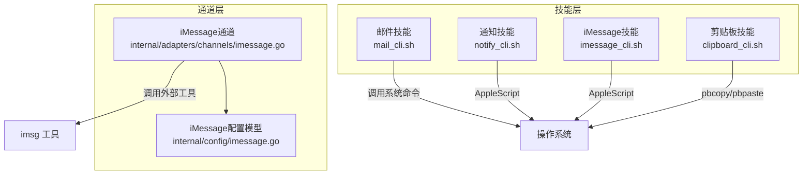
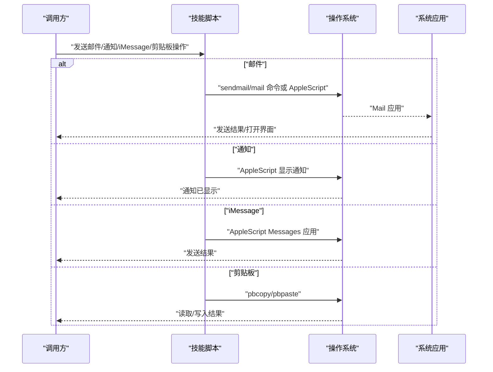
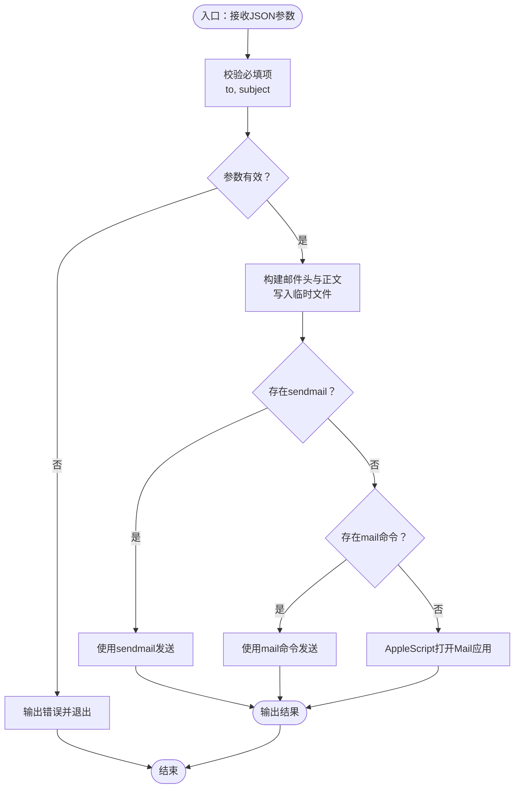
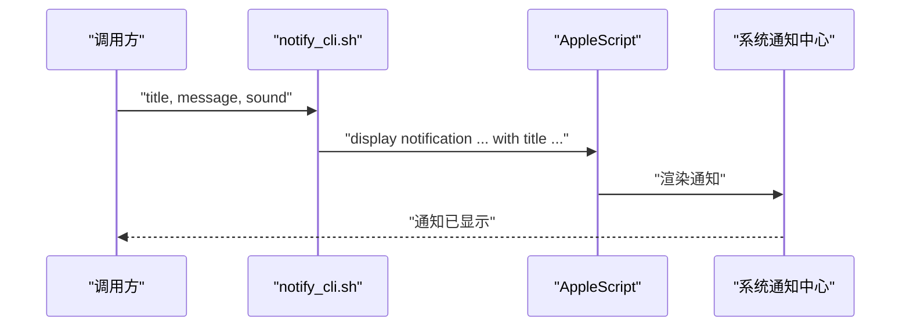
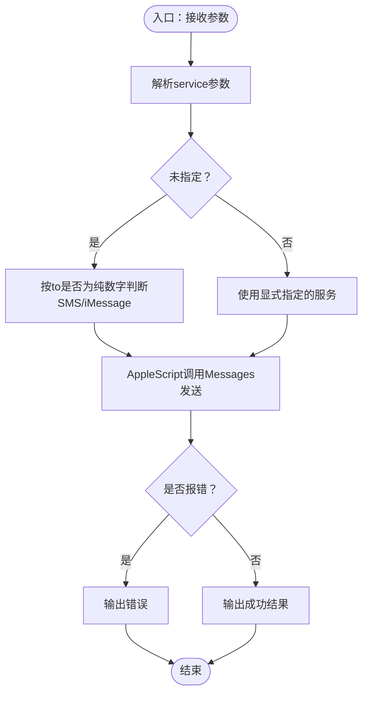
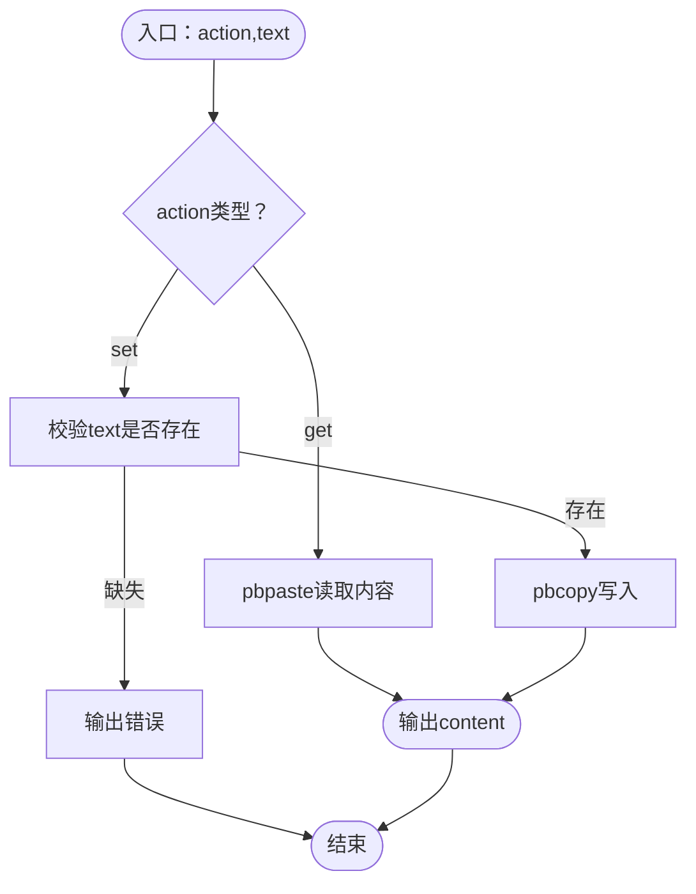
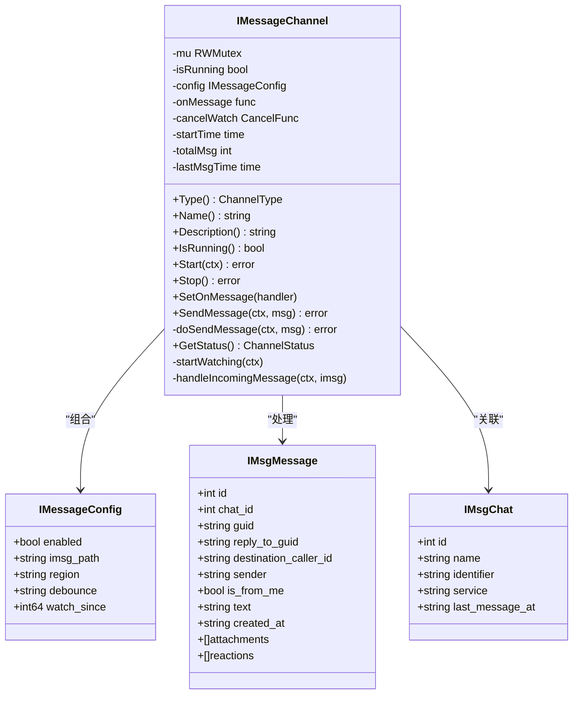
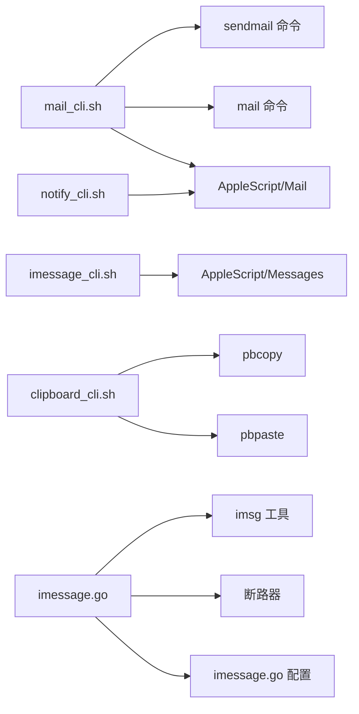

# 通信类技能

<cite>
**本文档引用的文件**
- [skills/mail/SKILL.md](file://skills/mail/SKILL.md)
- [skills/mail/mail_cli.sh](file://skills/mail/mail_cli.sh)
- [skills/notify/SKILL.md](file://skills/notify/SKILL.md)
- [skills/notify/notify_cli.sh](file://skills/notify/notify_cli.sh)
- [skills/imessage/SKILL.md](file://skills/imessage/SKILL.md)
- [skills/imessage/imessage_cli.sh](file://skills/imessage/imessage_cli.sh)
- [skills/clipboard/SKILL.md](file://skills/clipboard/SKILL.md)
- [skills/clipboard/clipboard_cli.sh](file://skills/clipboard/clipboard_cli.sh)
- [internal/config/imessage.go](file://internal/config/imessage.go)
- [internal/adapters/channels/imessage.go](file://internal/adapters/channels/imessage.go)
</cite>

## 目录
1. [简介](#简介)
2. [项目结构](#项目结构)
3. [核心组件](#核心组件)
4. [架构总览](#架构总览)
5. [详细组件分析](#详细组件分析)
6. [依赖关系分析](#依赖关系分析)
7. [性能考虑](#性能考虑)
8. [故障排除指南](#故障排除指南)
9. [结论](#结论)

## 简介
本文件面向 MindX 的通信类技能，系统性梳理以下能力：邮件发送、系统通知、iMessage 与剪贴板操作。文档从功能特性、数据流、错误处理、性能与安全等方面进行深入解析，并提供配置方法与典型使用场景，帮助开发者与使用者快速上手并稳定集成。

## 项目结构
通信类技能由“技能层”和“通道层”两部分组成：
- 技能层：以 Bash 脚本形式提供对外接口，遵循统一的参数规范与返回格式，便于调用方解耦。
- 通道层：在后台常驻监听或发送消息，屏蔽底层系统差异，向上提供稳定的通道抽象。

图表来源
- [skills/mail/mail_cli.sh](file://skills/mail/mail_cli.sh#L1-L62)
- [skills/notify/notify_cli.sh](file://skills/notify/notify_cli.sh#L1-L22)
- [skills/imessage/imessage_cli.sh](file://skills/imessage/imessage_cli.sh#L1-L71)
- [skills/clipboard/clipboard_cli.sh](file://skills/clipboard/clipboard_cli.sh#L1-L32)
- [internal/adapters/channels/imessage.go](file://internal/adapters/channels/imessage.go#L1-L272)
- [internal/config/imessage.go](file://internal/config/imessage.go#L1-L10)

章节来源
- [skills/mail/SKILL.md](file://skills/mail/SKILL.md#L1-L55)
- [skills/notify/SKILL.md](file://skills/notify/SKILL.md#L1-L45)
- [skills/imessage/SKILL.md](file://skills/imessage/SKILL.md#L1-L59)
- [skills/clipboard/SKILL.md](file://skills/clipboard/SKILL.md#L1-L40)
- [internal/adapters/channels/imessage.go](file://internal/adapters/channels/imessage.go#L1-L272)
- [internal/config/imessage.go](file://internal/config/imessage.go#L1-L10)

## 核心组件
- 邮件技能：支持收件人、主题、正文、抄送与密送字段；优先使用 sendmail/mail 命令发送，若不可用则通过 AppleScript 打开 Mail 应用准备发送。
- 系统通知技能：基于 AppleScript 在 macOS 上显示通知，支持自定义标题与提示音。
- iMessage 技能：支持 iMessage 与 SMS 自动识别或显式指定，使用 AppleScript 发送消息；通道层通过外部 imsg 工具实现监听与发送。
- 剪贴板技能：支持读取与写入剪贴板内容，使用 pbcopy/pbpaste 实现。

章节来源
- [skills/mail/SKILL.md](file://skills/mail/SKILL.md#L1-L55)
- [skills/notify/SKILL.md](file://skills/notify/SKILL.md#L1-L45)
- [skills/imessage/SKILL.md](file://skills/imessage/SKILL.md#L1-L59)
- [skills/clipboard/SKILL.md](file://skills/clipboard/SKILL.md#L1-L40)

## 架构总览
下图展示从调用方到系统原语的完整路径，以及通道层与外部工具的协作方式。

图表来源
- [skills/mail/mail_cli.sh](file://skills/mail/mail_cli.sh#L36-L61)
- [skills/notify/notify_cli.sh](file://skills/notify/notify_cli.sh#L18-L21)
- [skills/imessage/imessage_cli.sh](file://skills/imessage/imessage_cli.sh#L44-L70)
- [skills/clipboard/clipboard_cli.sh](file://skills/clipboard/clipboard_cli.sh#L12-L31)

## 详细组件分析

### 邮件技能
- 功能要点
  - 参数：收件人、主题、正文、可选抄送与密送。
  - 发送策略：优先 sendmail；其次 mail；最后回退到 AppleScript 打开 Mail 应用。
  - 返回：包含结果描述、收件人与主题等关键信息。
- 安全与加密
  - 当前实现未内置 TLS/SSL 加密；建议在具备 SMTP 服务器的环境中部署，由 sendmail/mail 或系统 MTA 负责传输安全。
- 附件处理
  - 脚本未实现附件参数解析与打包逻辑；如需附件，请通过系统 MTA 或在调用前自行生成 MIME。
- 错误处理
  - 缺少必填参数时直接返回错误；命令执行失败时记录错误信息。
- 使用场景
  - 自动化报告投递、系统告警邮件、批量通知等。

图表来源
- [skills/mail/mail_cli.sh](file://skills/mail/mail_cli.sh#L8-L61)

章节来源
- [skills/mail/SKILL.md](file://skills/mail/SKILL.md#L1-L55)
- [skills/mail/mail_cli.sh](file://skills/mail/mail_cli.sh#L1-L62)

### 系统通知技能
- 功能要点
  - 参数：标题（默认值）、消息内容、可选提示音。
  - 行为：通过 AppleScript 调用系统通知中心显示通知。
- 适用范围
  - 仅 macOS 平台可用。
- 使用场景
  - 任务完成提示、定时提醒、状态变更通知等。

图表来源
- [skills/notify/notify_cli.sh](file://skills/notify/notify_cli.sh#L8-L21)

章节来源
- [skills/notify/SKILL.md](file://skills/notify/SKILL.md#L1-L45)
- [skills/notify/notify_cli.sh](file://skills/notify/notify_cli.sh#L1-L22)

### iMessage 技能
- 功能要点
  - 参数：接收者（邮箱或电话号）、消息内容、服务类型（iMessage/SMS）。
  - 服务识别：若未显式指定，根据接收者是否为纯数字判定 SMS 或 iMessage。
  - 发送：通过 AppleScript 与 Messages 应用交互。
- 使用场景
  - 个人消息提醒、跨设备即时沟通、与联系人自动化互动。

图表来源
- [skills/imessage/imessage_cli.sh](file://skills/imessage/imessage_cli.sh#L8-L70)

章节来源
- [skills/imessage/SKILL.md](file://skills/imessage/SKILL.md#L1-L59)
- [skills/imessage/imessage_cli.sh](file://skills/imessage/imessage_cli.sh#L1-L71)

### 剪贴板技能
- 功能要点
  - 操作类型：get（读取）、set（写入）。
  - 写入校验：set 模式必须提供文本内容。
  - 实现：pbcopy 写入，pbpaste 读取。
- 使用场景
  - 文本复制/粘贴、跨应用共享、UI 自动化流程中作为中间态存储。

图表来源
- [skills/clipboard/clipboard_cli.sh](file://skills/clipboard/clipboard_cli.sh#L8-L31)

章节来源
- [skills/clipboard/SKILL.md](file://skills/clipboard/SKILL.md#L1-L40)
- [skills/clipboard/clipboard_cli.sh](file://skills/clipboard/clipboard_cli.sh#L1-L32)

### 通道层：iMessage 通道
- 组件职责
  - 通过外部 imsg 工具监听数据库事件，将收到的消息转换为统一实体并回调给上层。
  - 提供发送消息能力，封装断路器与并发控制。
- 关键配置
  - enabled：是否启用
  - imsg_path：imsg 可执行文件路径
  - region：区域设置
  - debounce：事件去抖间隔
  - watch_since：起始 rowid，用于增量监听
- 数据模型
  - IMsgChat：会话基本信息
  - IMsgMessage：消息体，包含 GUID、回复关系、附件占位等

图表来源
- [internal/adapters/channels/imessage.go](file://internal/adapters/channels/imessage.go#L29-L272)
- [internal/config/imessage.go](file://internal/config/imessage.go#L3-L9)

章节来源
- [internal/adapters/channels/imessage.go](file://internal/adapters/channels/imessage.go#L1-L272)
- [internal/config/imessage.go](file://internal/config/imessage.go#L1-L10)

## 依赖关系分析
- 技能层依赖
  - 邮件：sendmail/mail 命令或 AppleScript/Mail 应用
  - 通知：AppleScript
  - iMessage：AppleScript/Messages 应用
  - 剪贴板：pbcopy/pbpaste
- 通道层依赖
  - 外部 imsg 工具：负责数据库监听与消息发送
  - 断路器：对发送操作进行熔断保护
  - 配置模块：提供运行参数与默认值

图表来源
- [skills/mail/mail_cli.sh](file://skills/mail/mail_cli.sh#L36-L56)
- [skills/notify/notify_cli.sh](file://skills/notify/notify_cli.sh#L18-L19)
- [skills/imessage/imessage_cli.sh](file://skills/imessage/imessage_cli.sh#L44-L63)
- [skills/clipboard/clipboard_cli.sh](file://skills/clipboard/clipboard_cli.sh#L14-L24)
- [internal/adapters/channels/imessage.go](file://internal/adapters/channels/imessage.go#L131-L160)
- [internal/config/imessage.go](file://internal/config/imessage.go#L3-L9)

章节来源
- [skills/mail/mail_cli.sh](file://skills/mail/mail_cli.sh#L1-L62)
- [skills/notify/notify_cli.sh](file://skills/notify/notify_cli.sh#L1-L22)
- [skills/imessage/imessage_cli.sh](file://skills/imessage/imessage_cli.sh#L1-L71)
- [skills/clipboard/clipboard_cli.sh](file://skills/clipboard/clipboard_cli.sh#L1-L32)
- [internal/adapters/channels/imessage.go](file://internal/adapters/channels/imessage.go#L1-L272)
- [internal/config/imessage.go](file://internal/config/imessage.go#L1-L10)

## 性能考虑
- 命令选择与回退
  - 优先使用 sendmail/mail，避免 GUI 应用启动开销；AppleScript 回退路径适合一次性任务但不适合高频调用。
- 事件去抖与增量监听
  - 通道层通过 debounce 降低重复事件影响，watch_since 支持从特定位置继续监听，减少历史扫描压力。
- 断路器保护
  - 发送路径采用断路器，异常时快速失败并避免级联故障。
- 建议
  - 对高频邮件发送，建议在后端部署 MTA 并使用 sendmail/mail；对 iMessage/SMS，尽量批量合并请求并控制速率。

## 故障排除指南
- 邮件技能
  - 现象：缺少 to 或 subject 参数
  - 处理：确保必填字段非空
  - 现象：sendmail/mail 均不可用
  - 处理：安装系统 MTA 或允许 AppleScript 打开 Mail 应用
- 通知技能
  - 现象：缺少 message
  - 处理：提供消息内容
  - 现象：macOS 权限不足
  - 处理：授予通知权限
- iMessage 技能
  - 现象：服务类型识别错误
  - 处理：显式指定 service=iMessage 或 service=SMS
  - 现象：AppleScript 执行失败
  - 处理：确认 Messages 应用已登录相应账户
- 剪贴板技能
  - 现象：set 模式缺少 text
  - 处理：提供要写入的文本
- 通道层 iMessage
  - 现象：imsg 未找到
  - 处理：正确配置 imsg_path
  - 现象：监听无事件
  - 处理：检查 debounce 与 watch_since 设置

章节来源
- [skills/mail/mail_cli.sh](file://skills/mail/mail_cli.sh#L15-L23)
- [skills/notify/notify_cli.sh](file://skills/notify/notify_cli.sh#L13-L16)
- [skills/imessage/imessage_cli.sh](file://skills/imessage/imessage_cli.sh#L13-L21)
- [skills/clipboard/clipboard_cli.sh](file://skills/clipboard/clipboard_cli.sh#L20-L23)
- [internal/adapters/channels/imessage.go](file://internal/adapters/channels/imessage.go#L94-L96)
- [internal/config/imessage.go](file://internal/config/imessage.go#L3-L9)

## 结论
MindX 的通信类技能以简洁的 Bash 脚本与系统原语为核心，覆盖邮件、通知、iMessage 与剪贴板等常用场景。通道层通过外部工具与断路器进一步增强了稳定性与可观测性。建议在生产环境结合系统 MTA 与权限配置完善邮件与通知能力，并通过显式配置与去抖策略提升 iMessage 的可靠性与性能。