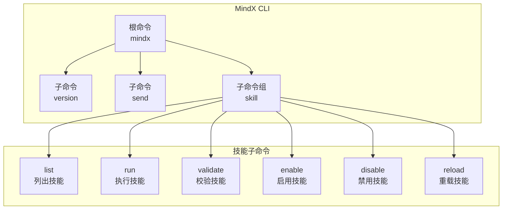
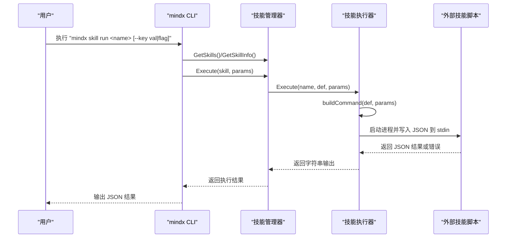
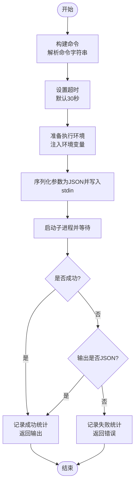
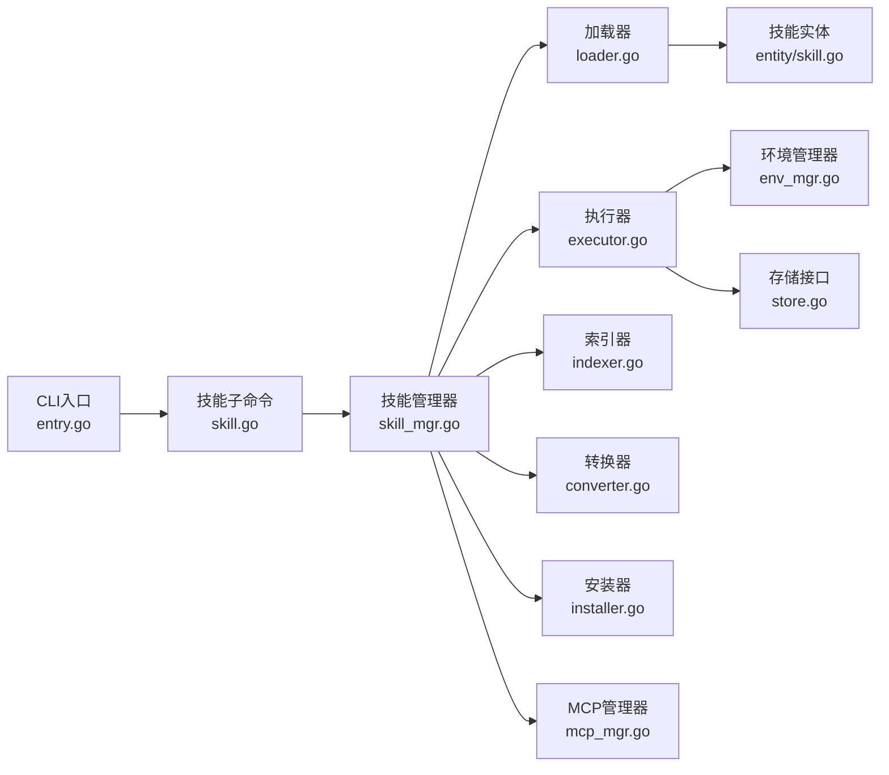
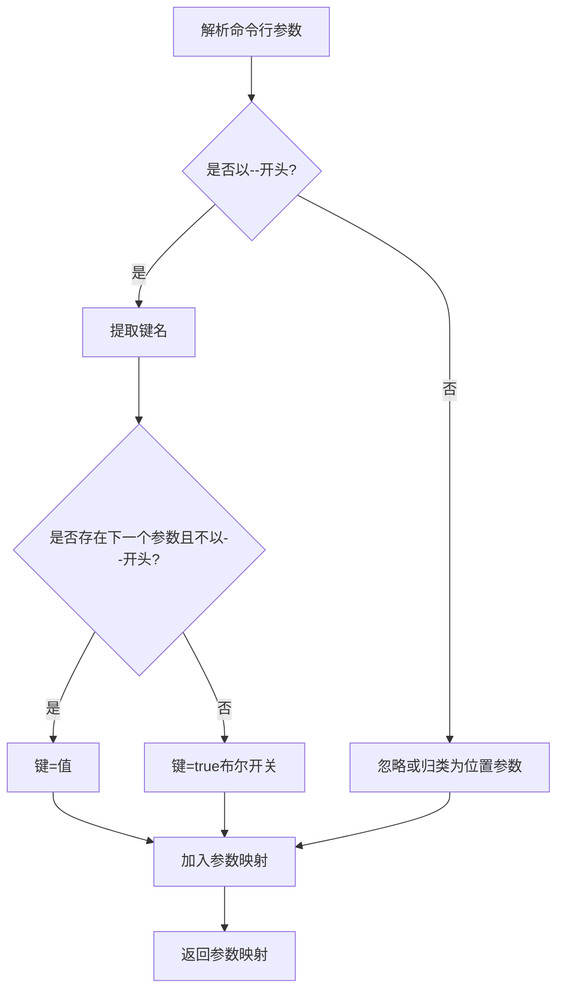

# CLI 技能开发

<cite>
**本文引用的文件**
- [internal/adapters/cli/entry.go](file://internal/adapters/cli/entry.go)
- [internal/adapters/cli/skill.go](file://internal/adapters/cli/skill.go)
- [internal/usecase/skills/executor.go](file://internal/usecase/skills/executor.go)
- [internal/usecase/skills/skill_mgr.go](file://internal/usecase/skills/skill_mgr.go)
- [internal/usecase/skills/loader.go](file://internal/usecase/skills/loader.go)
- [internal/entity/skill.go](file://internal/entity/skill.go)
- [internal/config/config.go](file://internal/config/config.go)
- [skills/calculator/calculator_cli.py](file://skills/calculator/calculator_cli.py)
- [skills/calculator/SKILL.md](file://skills/calculator/SKILL.md)
- [skills/calendar/calendar_cli.sh](file://skills/calendar/calendar_cli.sh)
- [skills/finder/finder_cli.sh](file://skills/finder/finder_cli.sh)
- [skills/file_search/file_search_cli.py](file://skills/file_search/file_search_cli.py)
- [skills/sysinfo/sysinfo_cli.sh](file://skills/sysinfo/sysinfo_cli.sh)
</cite>

## 目录
1. [简介](#简介)
2. [项目结构](#项目结构)
3. [核心组件](#核心组件)
4. [架构总览](#架构总览)
5. [详细组件分析](#详细组件分析)
6. [依赖关系分析](#依赖关系分析)
7. [性能考量](#性能考量)
8. [故障排查指南](#故障排查指南)
9. [结论](#结论)
10. [附录](#附录)

## 简介
本指南面向希望在 MindX 平台上开发“CLI 技能”的开发者，系统讲解命令行脚本的开发规范与最佳实践，涵盖：
- 输入参数处理：通过标准输入（stdin）以 JSON 格式传递参数
- 输出格式规范：统一以 JSON 输出结果
- 错误处理：标准错误（stderr）输出错误信息并返回非零退出码
- 参数解析：支持键值对与布尔开关两种形式
- 跨平台兼容：基于技能定义中的 OS 字段与依赖检查
- 实战示例：覆盖 Bash、Python 等多语言 CLI 技能
- 调试与测试：结合内置 CLI 工具进行本地验证

## 项目结构
MindX 的 CLI 技能由“外部命令型技能”构成，技能定义位于每个技能目录下的 SKILL.md，脚本位于同目录下，运行时由技能管理器负责加载、校验与执行。

图表来源
- [internal/adapters/cli/entry.go](file://internal/adapters/cli/entry.go#L17-L21)
- [internal/adapters/cli/skill.go](file://internal/adapters/cli/skill.go#L18-L22)

章节来源
- [internal/adapters/cli/entry.go](file://internal/adapters/cli/entry.go#L17-L21)
- [internal/adapters/cli/skill.go](file://internal/adapters/cli/skill.go#L18-L22)

## 核心组件
- CLI 入口与根命令：负责初始化国际化、构建根命令树、注册子命令与标志位，并在错误时输出到 stdout 并退出码非零。
- 技能子命令组：提供 list、run、validate、enable、disable、reload 等能力，支持过滤与统计展示。
- 技能执行器：负责构建外部命令、准备执行环境、将参数以 JSON 写入 stdin、捕获输出并记录统计。
- 技能管理器：协调加载器、执行器、索引器等组件，提供启用/禁用、重载、执行等高层接口。
- 技能定义实体：标准化技能元数据、参数定义、依赖与输出格式等。

章节来源
- [internal/adapters/cli/entry.go](file://internal/adapters/cli/entry.go#L113-L122)
- [internal/adapters/cli/skill.go](file://internal/adapters/cli/skill.go#L18-L253)
- [internal/usecase/skills/executor.go](file://internal/usecase/skills/executor.go#L19-L42)
- [internal/usecase/skills/skill_mgr.go](file://internal/usecase/skills/skill_mgr.go#L20-L34)
- [internal/entity/skill.go](file://internal/entity/skill.go#L5-L25)

## 架构总览
MindX 的 CLI 技能执行链路如下：

图表来源
- [internal/adapters/cli/skill.go](file://internal/adapters/cli/skill.go#L86-L126)
- [internal/usecase/skills/skill_mgr.go](file://internal/usecase/skills/skill_mgr.go#L189-L200)
- [internal/usecase/skills/executor.go](file://internal/usecase/skills/executor.go#L138-L195)

## 详细组件分析

### CLI 入口与错误处理
- 初始化流程：先初始化国际化，再执行根命令；若执行失败，打印错误并以非零退出码退出。
- send 子命令：通过 HTTP 请求向本地服务发送消息，便于集成测试与调试。
- 版本信息：输出版本号、构建时间、Git 提交号等。

章节来源
- [internal/adapters/cli/entry.go](file://internal/adapters/cli/entry.go#L113-L122)
- [internal/adapters/cli/entry.go](file://internal/adapters/cli/entry.go#L23-L38)
- [internal/adapters/cli/entry.go](file://internal/adapters/cli/entry.go#L40-L91)

### 技能子命令组
- list：按分类过滤显示技能列表，包含描述、标签、缺失依赖、统计信息等。
- run：解析命令行参数为键值对或布尔开关，查找目标技能并执行，输出执行前后的参数摘要。
- validate：展示技能启用状态、可运行性、缺失依赖与最近错误。
- enable/disable：切换技能启用状态并同步组件。
- reload：重新加载技能并输出当前技能数量。

章节来源
- [internal/adapters/cli/skill.go](file://internal/adapters/cli/skill.go#L24-L77)
- [internal/adapters/cli/skill.go](file://internal/adapters/cli/skill.go#L79-L127)
- [internal/adapters/cli/skill.go](file://internal/adapters/cli/skill.go#L129-L167)
- [internal/adapters/cli/skill.go](file://internal/adapters/cli/skill.go#L169-L217)
- [internal/adapters/cli/skill.go](file://internal/adapters/cli/skill.go#L219-L240)
- [internal/adapters/cli/skill.go](file://internal/adapters/cli/skill.go#L312-L326)

### 技能执行器（关键流程）
- 命令构建：解析技能定义中的命令字符串，支持带引号的参数分割；必要时拼接技能目录路径。
- 执行环境：准备环境变量，注入到子进程；设置工作目录为技能目录。
- 参数传递：将参数序列化为 JSON 并写入子进程的 stdin。
- 超时控制：默认 30 秒，可通过技能定义覆盖；超时后上下文取消。
- 输出处理：优先记录成功；若非 JSON 输出但执行失败，则视为错误；否则作为成功结果返回。
- 统计更新：记录成功/失败次数、平均耗时、最近运行时间等。

图表来源
- [internal/usecase/skills/executor.go](file://internal/usecase/skills/executor.go#L138-L195)
- [internal/usecase/skills/executor.go](file://internal/usecase/skills/executor.go#L218-L260)

章节来源
- [internal/usecase/skills/executor.go](file://internal/usecase/skills/executor.go#L57-L79)
- [internal/usecase/skills/executor.go](file://internal/usecase/skills/executor.go#L138-L195)
- [internal/usecase/skills/executor.go](file://internal/usecase/skills/executor.go#L218-L260)
- [internal/usecase/skills/executor.go](file://internal/usecase/skills/executor.go#L266-L300)

### 技能管理器与加载器
- 加载器：扫描技能目录，读取 SKILL.md 并解析为技能定义；检查二进制与环境变量依赖；生成技能信息（含可运行性、缺失项、格式等）。
- 管理器：协调加载器、执行器、索引器、转换器、安装器与 MCP 管理器；提供启用/禁用、重载、执行等接口；同步各组件状态。

章节来源
- [internal/usecase/skills/loader.go](file://internal/usecase/skills/loader.go#L35-L58)
- [internal/usecase/skills/loader.go](file://internal/usecase/skills/loader.go#L60-L123)
- [internal/usecase/skills/loader.go](file://internal/usecase/skills/loader.go#L165-L184)
- [internal/usecase/skills/loader.go](file://internal/usecase/skills/loader.go#L186-L200)
- [internal/usecase/skills/skill_mgr.go](file://internal/usecase/skills/skill_mgr.go#L36-L85)

### 技能定义实体
- 技能定义：包含名称、描述、版本、分类、标签、OS 支持、启用状态、超时、命令、参数定义、依赖、安装方式、主页、元数据、输出格式、指引、是否内部等。
- 技能信息：包含定义、目录、内容、可运行性、缺失依赖、统计数据等。
- 统计数据：成功次数、失败次数、执行耗时序列、最后运行时间等。

章节来源
- [internal/entity/skill.go](file://internal/entity/skill.go#L5-L25)
- [internal/entity/skill.go](file://internal/entity/skill.go#L59-L82)
- [internal/entity/skill.go](file://internal/entity/skill.go#L51-L57)

## 依赖关系分析
- CLI 层依赖技能管理器提供的技能集合与执行能力。
- 技能管理器依赖加载器、执行器、索引器、转换器、安装器与 MCP 管理器。
- 执行器依赖环境管理器准备执行环境，依赖存储持久化统计数据。
- 技能定义实体贯穿加载、校验、执行与统计环节。

图表来源
- [internal/adapters/cli/entry.go](file://internal/adapters/cli/entry.go#L113-L122)
- [internal/adapters/cli/skill.go](file://internal/adapters/cli/skill.go#L242-L253)
- [internal/usecase/skills/skill_mgr.go](file://internal/usecase/skills/skill_mgr.go#L40-L62)
- [internal/usecase/skills/executor.go](file://internal/usecase/skills/executor.go#L19-L42)
- [internal/entity/skill.go](file://internal/entity/skill.go#L5-L25)

章节来源
- [internal/adapters/cli/entry.go](file://internal/adapters/cli/entry.go#L113-L122)
- [internal/adapters/cli/skill.go](file://internal/adapters/cli/skill.go#L242-L253)
- [internal/usecase/skills/skill_mgr.go](file://internal/usecase/skills/skill_mgr.go#L40-L62)
- [internal/usecase/skills/executor.go](file://internal/usecase/skills/executor.go#L19-L42)
- [internal/entity/skill.go](file://internal/entity/skill.go#L5-L25)

## 性能考量
- 超时控制：执行器默认超时 30 秒，可在技能定义中调整；合理设置避免长时间阻塞。
- 统计与缓存：执行器维护技能执行次数、失败次数与最近执行时间，便于监控与优化。
- 环境准备：尽量减少每次执行的环境变量注入开销；复用已准备的环境。
- 输出解析：优先返回结构化 JSON，避免额外解析成本；非 JSON 输出会被视为错误处理。

章节来源
- [internal/usecase/skills/executor.go](file://internal/usecase/skills/executor.go#L145-L148)
- [internal/usecase/skills/executor.go](file://internal/usecase/skills/executor.go#L266-L300)

## 故障排查指南
- 参数解析问题：确认命令行参数以键值对形式传入（如 --key val 或 --flag），布尔开关无需值。
- 依赖缺失：使用 validate 子命令查看缺失的二进制与环境变量；根据 SKILL.md 中 requires 字段补齐。
- 超时与错误：检查技能定义中的 timeout 设置；查看 stderr 输出的错误信息；关注执行器的日志记录。
- 配置加载：确保工作区与配置初始化正常；必要时重新执行 reload 子命令。
- 跨平台：检查 SKILL.md 中 os 字段与当前系统匹配情况；确认依赖工具可用。

章节来源
- [internal/adapters/cli/skill.go](file://internal/adapters/cli/skill.go#L312-L326)
- [internal/adapters/cli/skill.go](file://internal/adapters/cli/skill.go#L129-L167)
- [internal/usecase/skills/executor.go](file://internal/usecase/skills/executor.go#L145-L148)
- [internal/config/config.go](file://internal/config/config.go#L13-L37)

## 结论
MindX 的 CLI 技能体系通过“定义即规范”的方式，将参数传递、执行流程、输出格式与错误处理标准化。开发者只需遵循 SKILL.md 的元数据规范与 stdin JSON 参数约定，即可快速开发跨平台、可复用、可观测的 CLI 技能。

## 附录

### 开发规范与最佳实践
- 输入参数
  - 通过标准输入（stdin）以 JSON 形式接收参数
  - 必须包含所有必填字段；未提供时应返回错误并退出非零
- 输出格式
  - 统一输出 JSON；包含业务结果与必要的元信息
  - 成功与失败均应返回结构化 JSON，便于上层解析
- 错误处理
  - 错误信息输出到标准错误（stderr）
  - 使用非零退出码表示失败
- 参数解析
  - 支持键值对（--key val）与布尔开关（--flag）
  - 建议在脚本内显式校验参数完整性
- 跨平台兼容
  - 在 SKILL.md 中声明支持的 OS 列表
  - 使用依赖检查（requires.bins、requires.env）确保运行环境
- 超时与资源
  - 合理设置技能定义中的 timeout
  - 控制资源占用，避免长时间阻塞

章节来源
- [internal/usecase/skills/executor.go](file://internal/usecase/skills/executor.go#L170-L177)
- [internal/adapters/cli/skill.go](file://internal/adapters/cli/skill.go#L312-L326)
- [internal/entity/skill.go](file://internal/entity/skill.go#L27-L31)
- [internal/entity/skill.go](file://internal/entity/skill.go#L13-L14)

### 多语言 CLI 技能示例

#### Python 示例：计算器
- 功能：从 stdin 读取 JSON 参数，执行表达式计算，输出结果或错误
- 规范：参数必须包含 expression；异常时输出 JSON 错误并退出非零

章节来源
- [skills/calculator/calculator_cli.py](file://skills/calculator/calculator_cli.py#L9-L39)
- [skills/calculator/SKILL.md](file://skills/calculator/SKILL.md#L19-L24)

#### Shell 示例：日历
- 功能：根据 action（list/create）执行不同逻辑；使用 jq 解析参数
- 规范：缺失必要参数时输出 JSON 错误并退出非零

章节来源
- [skills/calendar/calendar_cli.sh](file://skills/calendar/calendar_cli.sh#L8-L43)

#### Shell 示例：Finder
- 功能：支持 list、open、info 三种动作；对不存在路径输出错误
- 规范：未知动作时输出 JSON 错误并退出非零

章节来源
- [skills/finder/finder_cli.sh](file://skills/finder/finder_cli.sh#L8-L38)

#### Python 示例：文件搜索
- 功能：支持 files/content/both 三种模式；使用 subprocess 调用系统命令
- 规范：参数缺失时输出 JSON 错误并退出非零

章节来源
- [skills/file_search/file_search_cli.py](file://skills/file_search/file_search_cli.py#L7-L56)

#### Shell 示例：系统信息
- 功能：支持 overview/disk/battery/network/cpu/memory 等类型
- 规范：未知类型时输出 JSON 错误并退出非零

章节来源
- [skills/sysinfo/sysinfo_cli.sh](file://skills/sysinfo/sysinfo_cli.sh#L8-L53)

### 参数解析流程（代码级）

图表来源
- [internal/adapters/cli/skill.go](file://internal/adapters/cli/skill.go#L312-L326)