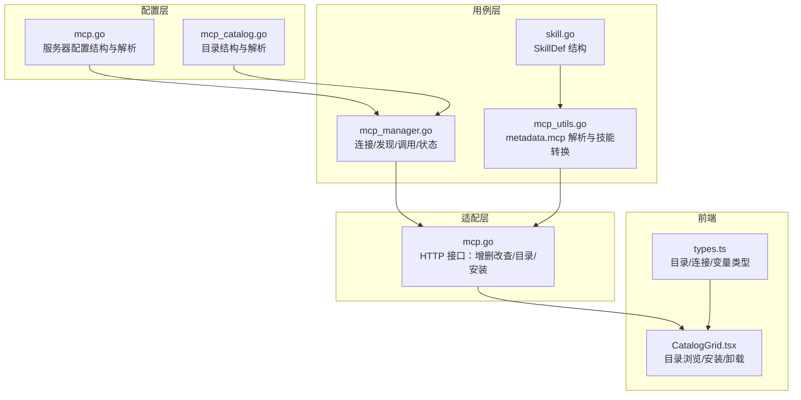
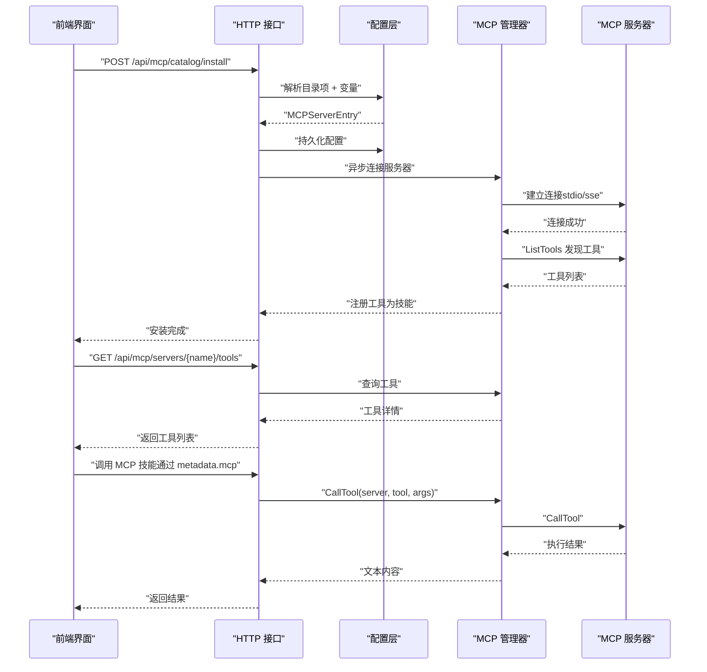
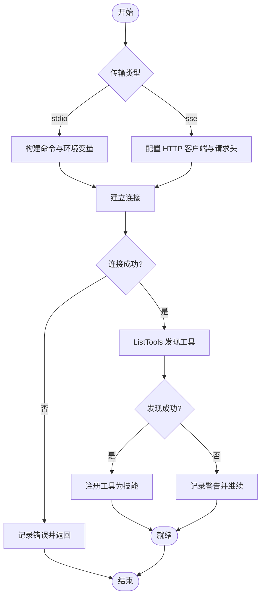
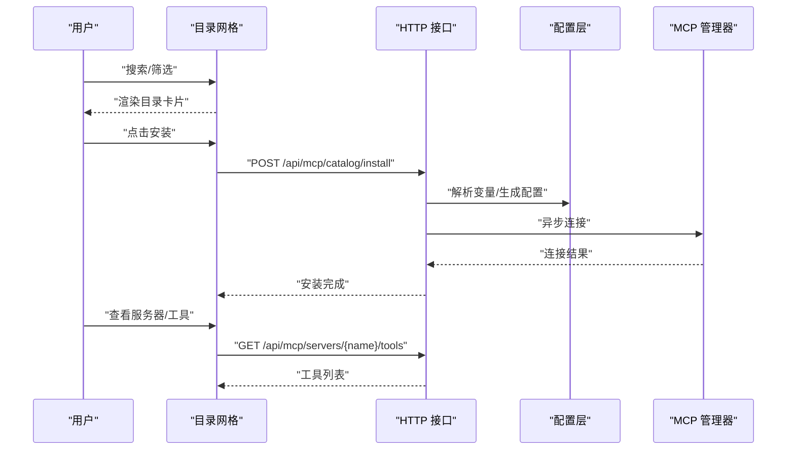
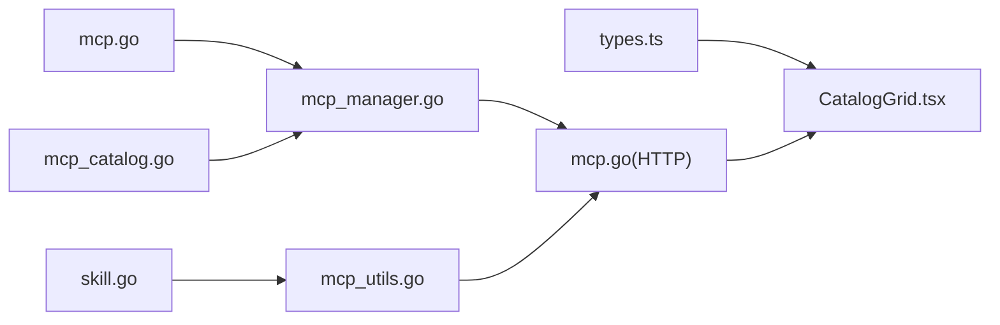

# MCP 技能开发

<cite>
**本文引用的文件**
- [README.md](file://README.md)
- [SKILL_DEVELOPMENT.md](file://internal/usecase/skills/SKILL_DEVELOPMENT.md)
- [mcp.go](file://internal/config/mcp.go)
- [mcp_catalog.go](file://internal/config/mcp_catalog.go)
- [mcp_manager.go](file://internal/usecase/skills/mcp_manager.go)
- [mcp_utils.go](file://internal/usecase/skills/mcp_utils.go)
- [mcp.go](file://internal/adapters/http/handlers/mcp.go)
- [types.ts](file://dashboard/src/components/mcp/types.ts)
- [CatalogGrid.tsx](file://dashboard/src/components/mcp/CatalogGrid.tsx)
- [mcp_servers.json.template](file://config/mcp_servers.json.template)
- [skill.go](file://internal/entity/skill.go)
</cite>

## 目录
1. [简介](#简介)
2. [项目结构](#项目结构)
3. [核心组件](#核心组件)
4. [架构总览](#架构总览)
5. [组件详解](#组件详解)
6. [依赖关系分析](#依赖关系分析)
7. [性能考量](#性能考量)
8. [故障排查指南](#故障排查指南)
9. [结论](#结论)
10. [附录](#附录)

## 简介
本文件面向开发者，系统化介绍 MindX 中的 MCP（Model Context Protocol）技能开发与集成方案。内容涵盖：
- MCP 协议在 MindX 中的应用方式与优势
- metadata.mcp 字段的配置方法与规则
- MCP 技能与本地技能的差异与统一体验
- 从 MCP 服务器配置到技能定义的完整开发流程
- 前端显示与交互体验
- 连接管理、工具发现与调用执行机制
- 最佳实践与常见问题解决方案
- MCP 服务器配置示例与调试方法

## 项目结构
MindX 将 MCP 能力贯穿“配置层、用例层、适配层、前端界面”四个层面：
- 配置层：负责 MCP 服务器配置与目录解析
- 用例层：负责 MCP 连接、工具发现、调用执行与状态管理
- 适配层：提供 HTTP 接口，暴露 MCP 管理能力
- 前端：提供 MCP 目录浏览、安装与服务器管理界面

图表来源
- [mcp.go](file://internal/config/mcp.go#L13-L30)
- [mcp_catalog.go](file://internal/config/mcp_catalog.go#L16-L56)
- [mcp_manager.go](file://internal/usecase/skills/mcp_manager.go#L25-L40)
- [mcp_utils.go](file://internal/usecase/skills/mcp_utils.go#L11-L14)
- [mcp.go](file://internal/adapters/http/handlers/mcp.go#L13-L23)
- [types.ts](file://dashboard/src/components/mcp/types.ts#L3-L36)
- [CatalogGrid.tsx](file://dashboard/src/components/mcp/CatalogGrid.tsx#L12-L149)

章节来源
- [README.md](file://README.md#L48-L52)
- [mcp.go](file://internal/config/mcp.go#L13-L30)
- [mcp_catalog.go](file://internal/config/mcp_catalog.go#L16-L56)
- [mcp_manager.go](file://internal/usecase/skills/mcp_manager.go#L25-L40)
- [mcp_utils.go](file://internal/usecase/skills/mcp_utils.go#L11-L14)
- [mcp.go](file://internal/adapters/http/handlers/mcp.go#L13-L23)
- [types.ts](file://dashboard/src/components/mcp/types.ts#L3-L36)
- [CatalogGrid.tsx](file://dashboard/src/components/mcp/CatalogGrid.tsx#L12-L149)

## 核心组件
- MCP 服务器配置结构与解析：定义服务器类型、命令行参数、环境变量、SSE URL 与请求头等
- MCP 目录结构与解析：定义目录项、连接参数、变量、工具清单，并支持内置与远程目录合并
- MCP 管理器：负责连接、工具发现、调用执行、状态维护与错误处理
- MCP 工具到技能定义转换：从 MCP Tool 的 JSON Schema 生成 SkillDef，保留 metadata.mcp
- HTTP 接口：提供服务器增删改查、目录获取与一键安装、工具列表查询
- 前端类型与界面：目录项、连接参数、变量类型定义；目录网格、安装对话框与搜索过滤

章节来源
- [mcp.go](file://internal/config/mcp.go#L13-L30)
- [mcp_catalog.go](file://internal/config/mcp_catalog.go#L16-L56)
- [mcp_manager.go](file://internal/usecase/skills/mcp_manager.go#L25-L40)
- [mcp_utils.go](file://internal/usecase/skills/mcp_utils.go#L11-L14)
- [mcp.go](file://internal/adapters/http/handlers/mcp.go#L13-L23)
- [types.ts](file://dashboard/src/components/mcp/types.ts#L3-L36)
- [CatalogGrid.tsx](file://dashboard/src/components/mcp/CatalogGrid.tsx#L12-L149)

## 架构总览
下图展示了 MCP 技能从“目录安装”到“工具调用”的端到端流程。

图表来源
- [mcp.go](file://internal/adapters/http/handlers/mcp.go#L183-L247)
- [mcp_catalog.go](file://internal/config/mcp_catalog.go#L119-L161)
- [mcp_manager.go](file://internal/usecase/skills/mcp_manager.go#L49-L141)
- [mcp_utils.go](file://internal/usecase/skills/mcp_utils.go#L33-L54)

## 组件详解

### metadata.mcp 字段与配置规则
- 作用：在 SKILL.md 的 metadata 字段中声明该技能为 MCP 技能，并指定服务器与工具名
- 字段要求：
  - server：MCP 服务器名称（需与已配置的服务器一致）
  - tool：MCP 工具名称（需与服务器工具发现结果一致）
- 规则要点：
  - 保持 SKILL.md 格式不变，仅新增 metadata.mcp
  - 前端统一展示与本地技能一致，MCP 技能带有特定标记
  - 通过工具输入模式（JSON Schema）自动生成参数定义

章节来源
- [SKILL_DEVELOPMENT.md](file://internal/usecase/skills/SKILL_DEVELOPMENT.md#L365-L452)
- [mcp_utils.go](file://internal/usecase/skills/mcp_utils.go#L11-L14)
- [mcp_utils.go](file://internal/usecase/skills/mcp_utils.go#L33-L54)
- [skill.go](file://internal/entity/skill.go#L21)

### MCP 服务器配置与目录安装
- 服务器配置文件模板：mcp_servers.json.template 提供空配置结构，实际运行时由配置层加载与保存
- 目录安装流程：
  - 前端请求 /api/mcp/catalog/install，携带目录项 ID 与变量
  - 后端解析目录项为 MCPServerEntry，持久化到配置文件
  - 异步触发连接，连接成功后工具被注册为技能
- 目录项字段：
  - connection.type：传输类型（stdio/sse）
  - connection.command/args/url/headers/env：连接参数
  - variables：变量定义（键、标签、描述、类型、是否必填、默认值）
  - tools：工具清单

章节来源
- [mcp_servers.json.template](file://config/mcp_servers.json.template#L1-L4)
- [mcp.go](file://internal/adapters/http/handlers/mcp.go#L183-L247)
- [mcp_catalog.go](file://internal/config/mcp_catalog.go#L16-L56)
- [mcp_catalog.go](file://internal/config/mcp_catalog.go#L119-L161)

### 连接管理、工具发现与调用执行
- 连接管理：
  - 支持 stdio 与 sse 两种传输方式
  - stdio：继承当前进程环境，支持 env 覆盖；工作目录设为用户 HOME
  - sse：支持 HTTP 客户端与自定义请求头注入
  - 连接成功后进行工具发现（ListTools），并将工具注册为技能
- 调用执行：
  - 通过 CallTool(server, tool, args) 调用
  - 返回内容提取文本，错误时更新状态并返回错误信息
- 状态管理：
  - 维护连接状态（connected/disconnected/error）、错误信息、工具列表

图表来源
- [mcp_manager.go](file://internal/usecase/skills/mcp_manager.go#L49-L141)

章节来源
- [mcp_manager.go](file://internal/usecase/skills/mcp_manager.go#L49-L141)
- [mcp_manager.go](file://internal/usecase/skills/mcp_manager.go#L169-L204)

### 前端显示与交互体验
- 目录浏览：
  - 支持按类别与关键词搜索过滤
  - 展示图标、名称、描述、作者、工具预览与安装状态
- 安装流程：
  - 若目录项带变量，弹出安装对话框收集变量
  - 调用 /api/mcp/catalog/install 完成安装
- 服务器管理：
  - 支持添加、删除、重启服务器
  - 展示服务器状态、工具列表与错误信息

图表来源
- [CatalogGrid.tsx](file://dashboard/src/components/mcp/CatalogGrid.tsx#L12-L149)
- [mcp.go](file://internal/adapters/http/handlers/mcp.go#L162-L181)
- [mcp.go](file://internal/adapters/http/handlers/mcp.go#L114-L136)

章节来源
- [types.ts](file://dashboard/src/components/mcp/types.ts#L3-L36)
- [CatalogGrid.tsx](file://dashboard/src/components/mcp/CatalogGrid.tsx#L12-L149)
- [mcp.go](file://internal/adapters/http/handlers/mcp.go#L162-L181)
- [mcp.go](file://internal/adapters/http/handlers/mcp.go#L114-L136)

### MCP 技能与本地技能对比与优势
- 零学习成本：SKILL.md 格式完全一致，仅增加 metadata.mcp
- 统一体验：前端展示、搜索、统计与执行逻辑一致
- 强大扩展：可连接任意 MCP 服务器与工具，突破本地脚本限制
- 与本地技能对比：
  - 执行方式：本地命令行脚本 vs MCP 协议调用
  - 前端标记：本地技能 [std]，MCP 技能 [MCP]
  - 搜索与统计：两者均支持

章节来源
- [SKILL_DEVELOPMENT.md](file://internal/usecase/skills/SKILL_DEVELOPMENT.md#L369-L434)
- [README.md](file://README.md#L48-L52)

## 依赖关系分析
- 配置层依赖：
  - mcp.go：定义 MCPServerEntry 与配置文件读写
  - mcp_catalog.go：定义目录结构、变量解析与目录合并
- 用例层依赖：
  - mcp_manager.go：封装 MCP 客户端、连接、工具发现与调用
  - mcp_utils.go：解析 metadata.mcp、将 MCP Tool 转换为 SkillDef
- 适配层依赖：
  - mcp.go：提供 HTTP 接口，调用用例层能力
- 前端依赖：
  - types.ts：目录/连接/变量类型定义
  - CatalogGrid.tsx：目录浏览与安装交互

图表来源
- [mcp.go](file://internal/config/mcp.go#L13-L30)
- [mcp_catalog.go](file://internal/config/mcp_catalog.go#L16-L56)
- [mcp_manager.go](file://internal/usecase/skills/mcp_manager.go#L25-L40)
- [mcp_utils.go](file://internal/usecase/skills/mcp_utils.go#L11-L14)
- [mcp.go](file://internal/adapters/http/handlers/mcp.go#L13-L23)
- [types.ts](file://dashboard/src/components/mcp/types.ts#L3-L36)
- [CatalogGrid.tsx](file://dashboard/src/components/mcp/CatalogGrid.tsx#L12-L149)

章节来源
- [mcp.go](file://internal/config/mcp.go#L13-L30)
- [mcp_catalog.go](file://internal/config/mcp_catalog.go#L16-L56)
- [mcp_manager.go](file://internal/usecase/skills/mcp_manager.go#L25-L40)
- [mcp_utils.go](file://internal/usecase/skills/mcp_utils.go#L11-L14)
- [mcp.go](file://internal/adapters/http/handlers/mcp.go#L13-L23)
- [types.ts](file://dashboard/src/components/mcp/types.ts#L3-L36)
- [CatalogGrid.tsx](file://dashboard/src/components/mcp/CatalogGrid.tsx#L12-L149)

## 性能考量
- 连接与发现：
  - stdio 传输建议将工作目录设为用户 HOME，避免对当前进程工作目录的依赖
  - SSE 传输建议缓存 HTTP 客户端与请求头，减少重复初始化开销
- 工具调用：
  - 合理设置超时时间（默认 30 秒），避免长时间阻塞
  - 对频繁调用的工具，可在前端做结果缓存与去抖
- 目录安装：
  - 异步连接策略避免阻塞 HTTP 响应，提升用户体验

## 故障排查指南
- 连接失败：
  - 检查服务器类型与参数（stdio 的 command/args/env 或 sse 的 url/headers）
  - 确认环境变量解析与覆盖顺序（继承当前进程环境后再覆盖）
- 工具发现失败：
  - 查看服务器日志与状态（error 状态会记录错误信息）
  - 确认服务器已正确实现 ListTools 并返回有效工具列表
- 调用失败：
  - 检查 metadata.mcp.server 与 tool 是否与服务器实际工具名一致
  - 核对参数类型与必填项，确保符合工具输入模式
- 前端安装异常：
  - 确认目录项变量是否满足必填条件
  - 检查 /api/mcp/catalog/install 返回的错误信息

章节来源
- [mcp_manager.go](file://internal/usecase/skills/mcp_manager.go#L106-L141)
- [mcp_manager.go](file://internal/usecase/skills/mcp_manager.go#L169-L204)
- [mcp.go](file://internal/adapters/http/handlers/mcp.go#L57-L89)
- [mcp.go](file://internal/adapters/http/handlers/mcp.go#L213-L229)

## 结论
MindX 通过 MCP 协议实现了“零学习成本、统一体验、强大扩展”的技能体系：开发者只需在 SKILL.md 中声明 metadata.mcp，即可将任意 MCP 工具无缝接入 MindX 的技能生态。后端提供完善的连接管理、工具发现与调用执行机制，前端提供直观的目录浏览与安装交互。配合目录变量与内置/远程目录合并策略，MCP 技能开发变得高效、可复用且易于维护。

## 附录

### 完整开发流程（从服务器配置到技能定义）
- 步骤 1：准备 MCP 服务器
  - 选择传输类型（stdio 或 sse），配置命令/参数/环境变量或 URL/请求头
- 步骤 2：在前端安装服务器
  - 打开 MCP 目录，选择目标目录项
  - 若目录项带变量，填写变量后点击安装
  - 安装完成后，服务器状态变为 connected，工具列表可见
- 步骤 3：定义 MCP 技能
  - 在 SKILL.md 的 metadata 字段中添加 mcp.server 与 mcp.tool
  - 保持其他字段与本地技能一致
- 步骤 4：验证与调试
  - 在前端查看技能是否出现 [MCP] 标记
  - 调用技能，观察返回结果与错误信息
  - 如遇问题，检查服务器连接状态与工具输入模式

章节来源
- [SKILL_DEVELOPMENT.md](file://internal/usecase/skills/SKILL_DEVELOPMENT.md#L365-L452)
- [mcp.go](file://internal/adapters/http/handlers/mcp.go#L183-L247)
- [mcp_catalog.go](file://internal/config/mcp_catalog.go#L119-L161)
- [mcp_manager.go](file://internal/usecase/skills/mcp_manager.go#L120-L137)

### metadata.mcp 字段配置示例
- 示例说明：
  - server：MCP 服务器名称（与已配置服务器一致）
  - tool：MCP 工具名称（与服务器工具发现结果一致）
- 注意事项：
  - 保持 SKILL.md 格式不变，仅新增 metadata.mcp
  - 参数定义可基于工具输入模式自动生成

章节来源
- [SKILL_DEVELOPMENT.md](file://internal/usecase/skills/SKILL_DEVELOPMENT.md#L375-L416)
- [mcp_utils.go](file://internal/usecase/skills/mcp_utils.go#L56-L97)

### MCP 服务器配置示例与调试方法
- 配置示例：
  - stdio：type=stdio，command 与 args 指定可执行程序与参数，env 覆盖环境变量
  - sse：type=sse，url 指定服务器地址，headers 注入认证头
- 调试方法：
  - 查看服务器状态与错误信息（connected/disconnected/error）
  - 检查工具列表是否正确返回
  - 使用最小化参数调用工具，逐步定位问题

章节来源
- [mcp.go](file://internal/config/mcp.go#L17-L29)
- [mcp_manager.go](file://internal/usecase/skills/mcp_manager.go#L49-L141)
- [mcp.go](file://internal/adapters/http/handlers/mcp.go#L33-L90)