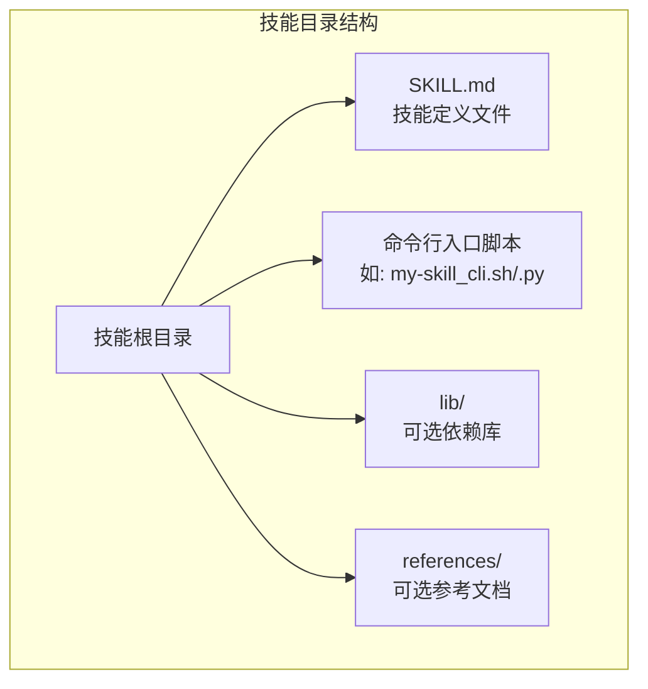
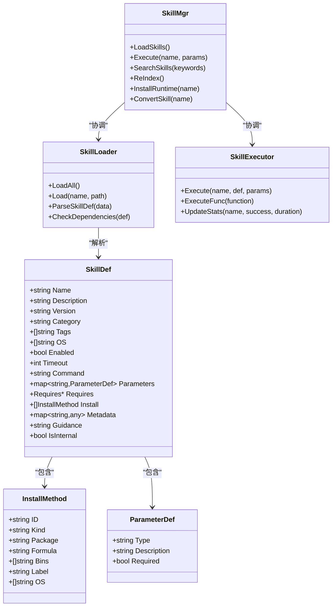
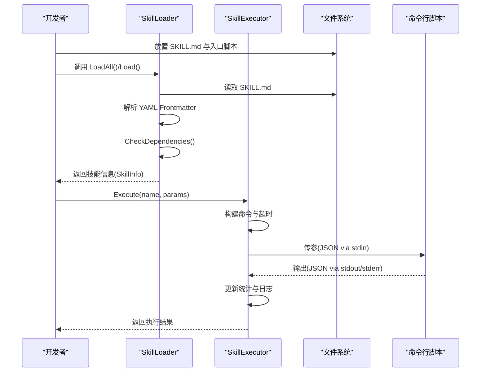
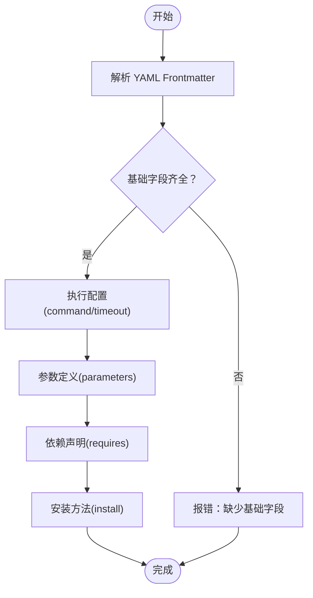
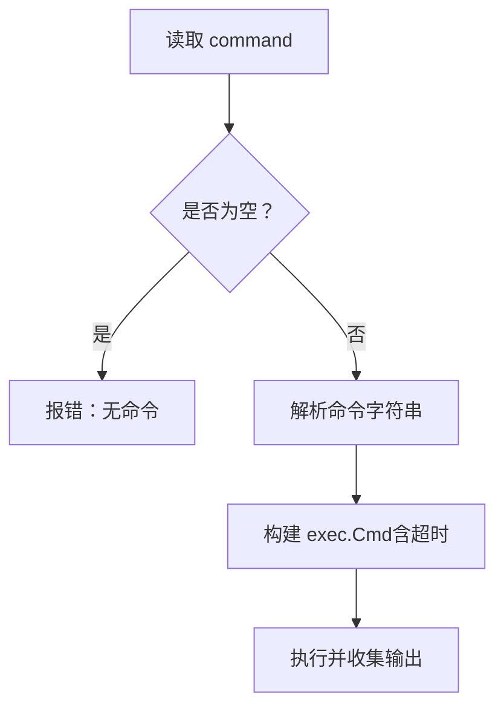
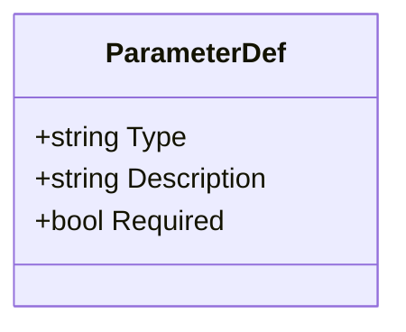
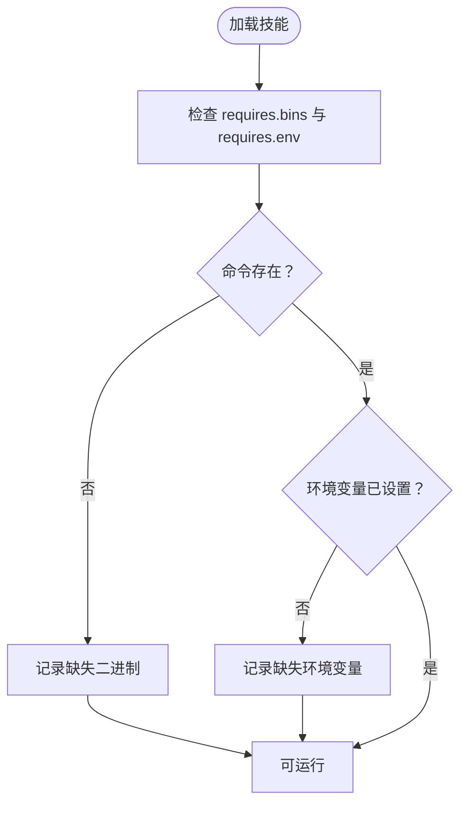
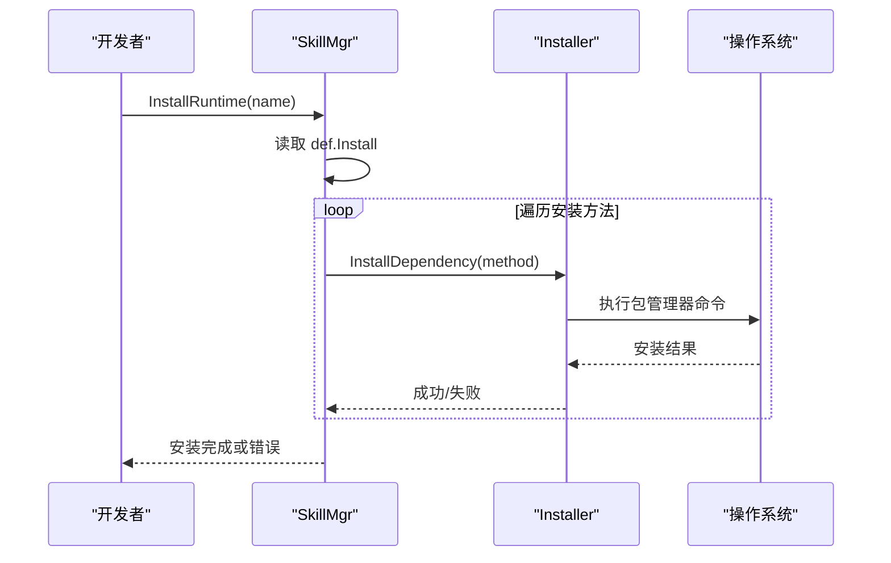
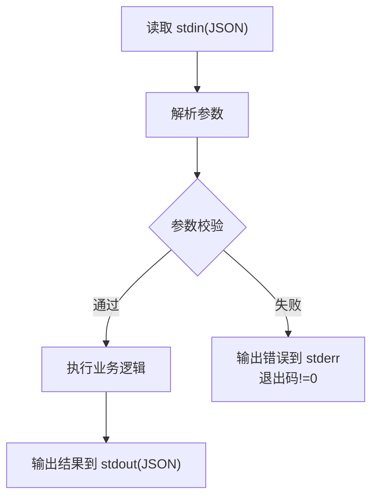
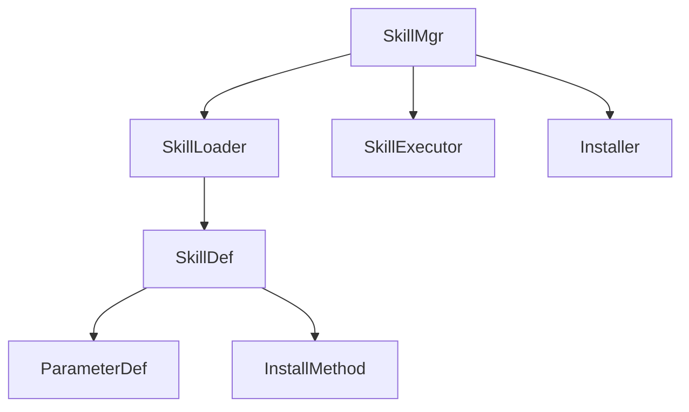

# 技能开发基础规范

<cite>
**本文档引用的文件**
- [SKILL_DEVELOPMENT.md](file://internal/usecase/skills/SKILL_DEVELOPMENT.md)
- [skill.go](file://internal/entity/skill.go)
- [loader.go](file://internal/usecase/skills/loader.go)
- [converter.go](file://internal/usecase/skills/converter.go)
- [executor.go](file://internal/usecase/skills/executor.go)
- [skill_mgr.go](file://internal/usecase/skills/skill_mgr.go)
- [calculator/SKILL.md](file://skills/calculator/SKILL.md)
- [weather/SKILL.md](file://skills/weather/SKILL.md)
- [web_search/SKILL.md](file://skills/web_search/SKILL.md)
- [deep_search/SKILL.md](file://skills/deep_search/SKILL.md)
- [read_file/SKILL.md](file://skills/read_file/SKILL.md)
- [write_file/SKILL.md](file://skills/write_file/SKILL.md)
- [open_url/SKILL.md](file://skills/open_url/SKILL.md)
- [calendar_cli.sh](file://skills/calendar/calendar_cli.sh)
- [calculator_cli.py](file://skills/calculator/calculator_cli.py)
</cite>

## 目录
1. [简介](#简介)
2. [项目结构](#项目结构)
3. [核心组件](#核心组件)
4. [架构总览](#架构总览)
5. [详细组件分析](#详细组件分析)
6. [依赖关系分析](#依赖关系分析)
7. [性能考量](#性能考量)
8. [故障排查指南](#故障排查指南)
9. [结论](#结论)
10. [附录](#附录)

## 简介
本规范面向第三方开发者，系统性阐述 MindX 技能系统的开发与集成要求。重点涵盖技能目录结构、SKILL.md 的 YAML Frontmatter 与 Markdown 文档两部分的完整结构，以及执行配置、参数定义、依赖声明、安装方法等关键字段的含义与配置方法。同时提供命令行脚本规范、跨平台支持策略、完整开发模板与最佳实践示例，帮助开发者快速构建高质量的 MindX 技能。

## 项目结构
MindX 技能系统采用“文件定义 + 命令行脚本”的标准目录结构：
- 技能根目录：包含 SKILL.md（必需）与命令行入口脚本（如 my-skill_cli.sh 或 my-skill_cli.py）
- 可选目录：lib/（依赖库）、references/（参考文档）

**图表来源**
- [SKILL_DEVELOPMENT.md](file://internal/usecase/skills/SKILL_DEVELOPMENT.md#L7-L16)

**章节来源**
- [SKILL_DEVELOPMENT.md](file://internal/usecase/skills/SKILL_DEVELOPMENT.md#L5-L16)

## 核心组件
MindX 技能系统围绕以下核心组件协作：
- SkillLoader：负责扫描技能目录、读取并解析 SKILL.md 的 YAML Frontmatter，校验依赖项，生成技能信息
- SkillExecutor：根据定义执行技能命令，支持超时控制、参数传递、统计记录与错误处理
- SkillMgr：门面入口，协调加载、执行、搜索、索引、转换、安装等子系统
- SkillDef/InstallMethod/ParameterDef：技能定义的数据模型，承载 SKILL.md 的元数据与配置

**图表来源**
- [skill_mgr.go](file://internal/usecase/skills/skill_mgr.go#L20-L62)
- [loader.go](file://internal/usecase/skills/loader.go#L18-L33)
- [executor.go](file://internal/usecase/skills/executor.go#L19-L42)
- [skill.go](file://internal/entity/skill.go#L6-L49)

**章节来源**
- [skill_mgr.go](file://internal/usecase/skills/skill_mgr.go#L20-L62)
- [loader.go](file://internal/usecase/skills/loader.go#L18-L33)
- [executor.go](file://internal/usecase/skills/executor.go#L19-L42)
- [skill.go](file://internal/entity/skill.go#L6-L49)

## 架构总览
MindX 技能系统的工作流分为“加载解析”、“依赖校验”、“执行调度”、“统计记录”四个阶段：

**图表来源**
- [loader.go](file://internal/usecase/skills/loader.go#L60-L123)
- [executor.go](file://internal/usecase/skills/executor.go#L138-L195)

**章节来源**
- [loader.go](file://internal/usecase/skills/loader.go#L60-L123)
- [executor.go](file://internal/usecase/skills/executor.go#L138-L195)

## 详细组件分析

### SKILL.md 文件结构与字段说明
SKILL.md 由 YAML Frontmatter 与 Markdown 文档两部分组成，Frontmatter 定义技能元数据，Markdown 部分提供详细说明与示例。

- 目录结构与文件位置
  - 必需：SKILL.md
  - 命令行入口脚本：my-skill_cli.sh 或 my-skill_cli.py
  - 可选：lib/、references/

- YAML Frontmatter 字段
  - 基础字段：name、description、version、category、tags、enabled、os
  - 执行配置：command、timeout
  - 参数定义：parameters（type、description、required）
  - 依赖声明：requires（bins、env）
  - 安装方法：install（id、kind、package/formula、label、os）
  - 其他：metadata、guidance、is_internal、homepage、output_format

- Markdown 文档
  - 功能说明、使用示例、输出格式、使用场景等

**图表来源**
- [SKILL_DEVELOPMENT.md](file://internal/usecase/skills/SKILL_DEVELOPMENT.md#L18-L48)

**章节来源**
- [SKILL_DEVELOPMENT.md](file://internal/usecase/skills/SKILL_DEVELOPMENT.md#L18-L48)

### 基础字段详解
- name：技能唯一标识符，使用小写字母与连字符
- description：技能简短描述，用于搜索匹配与展示
- version：版本号，遵循语义化版本规范
- category：技能分类，用于分组展示
- tags：标签列表，用于搜索与分类
- enabled：是否启用该技能
- os：支持的操作系统列表（如 darwin、linux、windows）

**章节来源**
- [SKILL_DEVELOPMENT.md](file://internal/usecase/skills/SKILL_DEVELOPMENT.md#L54-L62)

### 执行配置：command 与 timeout
- command：执行命令，相对技能目录的路径
- timeout：执行超时时间（秒），默认 30 秒；若未设置则按默认值处理

**图表来源**
- [executor.go](file://internal/usecase/skills/executor.go#L138-L195)

**章节来源**
- [SKILL_DEVELOPMENT.md](file://internal/usecase/skills/SKILL_DEVELOPMENT.md#L64-L69)
- [executor.go](file://internal/usecase/skills/executor.go#L138-L195)

### 参数定义：parameters 的完整格式
parameters 定义技能接受的参数，字段包括：
- type：参数类型（string、number、boolean、array、object）
- description：参数描述，用于 LLM 理解参数用途
- required：是否必需

**图表来源**
- [skill.go](file://internal/entity/skill.go#L44-L49)

**章节来源**
- [SKILL_DEVELOPMENT.md](file://internal/usecase/skills/SKILL_DEVELOPMENT.md#L71-L94)
- [skill.go](file://internal/entity/skill.go#L44-L49)

### 依赖声明：requires 的配置方式
requires 声明技能运行所需的外部依赖：
- bins：需要的二进制文件（命令行工具）
- env：需要的环境变量

Loader 会在加载时检查这些依赖，并在技能信息中标注缺失项。

**图表来源**
- [loader.go](file://internal/usecase/skills/loader.go#L186-L204)

**章节来源**
- [SKILL_DEVELOPMENT.md](file://internal/usecase/skills/SKILL_DEVELOPMENT.md#L95-L113)
- [loader.go](file://internal/usecase/skills/loader.go#L186-L204)

### 安装方法：install 的配置选项与跨平台支持
install 定义依赖的安装方法，字段包括：
- id：安装方法唯一标识
- kind：包管理器类型（brew、apt、yum/dnf、npm、pip/pip3、snap、choco 等）
- package/formula：包名或 Homebrew formula 名称
- label：安装方法的显示名称
- os：该安装方法适用的操作系统

SkillMgr 支持批量安装运行时依赖，Installer 根据 kind 选择对应命令执行安装。

**图表来源**
- [skill_mgr.go](file://internal/usecase/skills/skill_mgr.go#L290-L324)
- [skill_installer.go](file://internal/usecase/skills/skill_installer.go#L24-L66)

**章节来源**
- [SKILL_DEVELOPMENT.md](file://internal/usecase/skills/SKILL_DEVELOPMENT.md#L114-L142)
- [skill_mgr.go](file://internal/usecase/skills/skill_mgr.go#L290-L324)
- [skill_installer.go](file://internal/usecase/skills/skill_installer.go#L24-L66)

### 命令行脚本规范
- 输入：通过标准输入（stdin）以 JSON 格式传入参数
- 输出：正常结果输出到标准输出（stdout），推荐使用 JSON 格式；错误信息输出到标准错误（stderr），并以非零退出码退出
- 超时：由系统统一设置超时，脚本应尽量避免长时间阻塞

**图表来源**
- [SKILL_DEVELOPMENT.md](file://internal/usecase/skills/SKILL_DEVELOPMENT.md#L201-L237)

**章节来源**
- [SKILL_DEVELOPMENT.md](file://internal/usecase/skills/SKILL_DEVELOPMENT.md#L201-L237)
- [calculator_cli.py](file://skills/calculator/calculator_cli.py#L9-L38)
- [calendar_cli.sh](file://skills/calendar/calendar_cli.sh#L8-L42)

### 搜索优化建议
- description：清晰描述功能，包含关键动词与名词，避免冗余
- tags：选择通用、功能、平台标签，数量适中（建议 2-5 个）
- category：使用系统预定义分类（general、system、communication、productivity、media、automation）
- 参数描述：参数 description 会被纳入搜索索引，需清晰说明用途、示例值与默认值
- Markdown 文档：包含功能说明、使用场景、示例与注意事项

**章节来源**
- [SKILL_DEVELOPMENT.md](file://internal/usecase/skills/SKILL_DEVELOPMENT.md#L238-L308)

### 开发注意事项
- 跨平台兼容性：使用 os 字段声明支持的操作系统，在脚本中检查运行环境，为不同平台提供不同的安装方法
- 安全性：不在代码中硬编码敏感信息，使用环境变量存储 API 密钥等敏感数据，并在 requires.env 中声明所需环境变量
- 错误处理：验证必需参数是否存在，提供有意义的错误信息，使用适当的退出码
- 性能考虑：合理设置 timeout 值，避免长时间运行的阻塞操作，对于耗时操作考虑提供进度反馈
- 日志输出：正常输出到 stdout，错误和调试信息输出到 stderr，避免在 stdout 输出非结果内容

**章节来源**
- [SKILL_DEVELOPMENT.md](file://internal/usecase/skills/SKILL_DEVELOPMENT.md#L309-L340)

### 测试技能
- 本地测试：进入技能目录，使用 echo + 脚本的方式测试输入输出
- 验证 SKILL.md：提取并验证 YAML frontmatter 格式

**章节来源**
- [SKILL_DEVELOPMENT.md](file://internal/usecase/skills/SKILL_DEVELOPMENT.md#L341-L364)

### MCP 技能开发
MindX 支持通过 MCP（Model Context Protocol）协议连接外部工具和服务。MCP 技能通过 metadata.mcp 字段标记，格式与本地技能完全一致，前端显示与搜索体验一致。

- metadata.mcp 字段：server（MCP 服务器名称）、tool（MCP 工具名称）
- 前端显示：MCP 技能在技能管理页面会显示 [MCP] 粉色标签

**章节来源**
- [SKILL_DEVELOPMENT.md](file://internal/usecase/skills/SKILL_DEVELOPMENT.md#L365-L438)

### 发布清单
在发布技能前，请确认：
- SKILL.md 包含所有必需字段
- description 清晰描述技能功能
- tags 与 category 正确分类
- 参数定义完整且描述清晰
- 命令行脚本可执行且错误处理完善
- metadata.mcp.server 与 metadata.mcp.tool 正确配置（MCP 技能）
- 本地测试通过
- 跨平台兼容性已考虑

**章节来源**
- [SKILL_DEVELOPMENT.md](file://internal/usecase/skills/SKILL_DEVELOPMENT.md#L439-L452)

## 依赖关系分析
SkillMgr 作为门面协调各子系统，SkillLoader 负责解析与依赖校验，SkillExecutor 负责执行与统计，Installer 负责安装运行时依赖。

**图表来源**
- [skill_mgr.go](file://internal/usecase/skills/skill_mgr.go#L20-L62)
- [loader.go](file://internal/usecase/skills/loader.go#L18-L33)
- [executor.go](file://internal/usecase/skills/executor.go#L19-L42)
- [skill.go](file://internal/entity/skill.go#L6-L49)

**章节来源**
- [skill_mgr.go](file://internal/usecase/skills/skill_mgr.go#L20-L62)
- [loader.go](file://internal/usecase/skills/loader.go#L18-L33)
- [executor.go](file://internal/usecase/skills/executor.go#L19-L42)
- [skill.go](file://internal/entity/skill.go#L6-L49)

## 性能考量
- 合理设置 timeout：根据技能复杂度设定超时，避免长时间阻塞
- 避免长时间运行的阻塞操作：对于耗时操作，考虑提供进度反馈或拆分为多个步骤
- 统一超时控制：系统在执行时统一设置超时，脚本应配合非阻塞设计
- 统计与监控：系统记录执行次数、错误次数、平均耗时等指标，便于性能分析

**章节来源**
- [executor.go](file://internal/usecase/skills/executor.go#L266-L300)
- [SKILL_DEVELOPMENT.md](file://internal/usecase/skills/SKILL_DEVELOPMENT.md#L329-L334)

## 故障排查指南
- YAML frontmatter 格式错误：检查 --- 分隔符与缩进，确保 YAML 语法正确
- 依赖缺失：根据缺失的二进制文件与环境变量，使用安装方法进行修复
- 超时失败：适当提高 timeout，或优化脚本逻辑减少阻塞
- 执行失败：查看标准错误输出，定位参数缺失或脚本异常
- MCP 连接失败：检查 MCP 服务器配置与网络，系统支持带重试的初始化流程

**章节来源**
- [loader.go](file://internal/usecase/skills/loader.go#L165-L184)
- [loader.go](file://internal/usecase/skills/loader.go#L186-L204)
- [executor.go](file://internal/usecase/skills/executor.go#L179-L190)
- [skill_mgr.go](file://internal/usecase/skills/skill_mgr.go#L406-L449)

## 结论
MindX 技能开发规范以 SKILL.md 为核心，通过标准化的 YAML Frontmatter 与 Markdown 文档定义技能元数据与使用说明，结合命令行脚本与系统执行器实现可靠的技能执行与管理。开发者应严格遵循字段规范、参数定义、依赖声明与安装方法配置，确保技能在多平台环境下稳定运行，并充分利用系统提供的搜索、索引与统计能力提升用户体验。

## 附录

### 技能开发模板
- 目录结构
  - 技能根目录
    - SKILL.md（必需）
    - 命令行入口脚本（如 my-skill_cli.sh/.py）
    - lib/（可选）
    - references/（可选）

- SKILL.md 基本框架
  - YAML Frontmatter：name、description、version、category、tags、enabled、os、timeout、command、parameters、requires、install
  - Markdown 文档：功能说明、使用示例、输出格式、使用场景

**章节来源**
- [SKILL_DEVELOPMENT.md](file://internal/usecase/skills/SKILL_DEVELOPMENT.md#L7-L16)
- [SKILL_DEVELOPMENT.md](file://internal/usecase/skills/SKILL_DEVELOPMENT.md#L22-L48)

### 最佳实践示例
- 计算器技能：演示了基本的参数定义与脚本实现
- 天气技能：展示了参数类型与描述的最佳实践
- 网页搜索/深度搜索：体现了 is_internal 与 guidance 字段的使用
- 文件读取/写入：展示了参数与输出格式的设计思路
- 打开 URL：演示了复杂输出格式与使用场景说明

**章节来源**
- [calculator/SKILL.md](file://skills/calculator/SKILL.md#L1-L37)
- [weather/SKILL.md](file://skills/weather/SKILL.md#L1-L43)
- [web_search/SKILL.md](file://skills/web_search/SKILL.md#L1-L67)
- [deep_search/SKILL.md](file://skills/deep_search/SKILL.md#L1-L91)
- [read_file/SKILL.md](file://skills/read_file/SKILL.md#L1-L68)
- [write_file/SKILL.md](file://skills/write_file/SKILL.md#L1-L99)
- [open_url/SKILL.md](file://skills/open_url/SKILL.md#L1-L70)