# 技能开发指南

<cite>
**本文档引用的文件**
- [cmd/main.go](file://cmd/main.go)
- [internal/adapters/cli/skill.go](file://internal/adapters/cli/skill.go)
- [internal/usecase/skills/README.md](file://internal/usecase/skills/README.md)
- [internal/usecase/skills/SKILL_DEVELOPMENT.md](file://internal/usecase/skills/SKILL_DEVELOPMENT.md)
- [internal/usecase/skills/loader.go](file://internal/usecase/skills/loader.go)
- [internal/usecase/skills/executor.go](file://internal/usecase/skills/executor.go)
- [internal/entity/skill.go](file://internal/entity/skill.go)
- [internal/config/mcp.go](file://internal/config/mcp.go)
- [config/mcp_servers.json.template](file://config/mcp_servers.json.template)
- [internal/usecase/skills/mcp_manager.go](file://internal/usecase/skills/mcp_manager.go)
- [skills/calculator/SKILL.md](file://skills/calculator/SKILL.md)
- [skills/calculator/calculator_cli.py](file://skills/calculator/calculator_cli.py)
- [scripts/dev-start.sh](file://scripts/dev-start.sh)
</cite>

## 目录
1. [简介](#简介)
2. [项目结构](#项目结构)
3. [核心组件](#核心组件)
4. [架构概览](#架构概览)
5. [详细组件分析](#详细组件分析)
6. [依赖关系分析](#依赖关系分析)
7. [性能考虑](#性能考虑)
8. [故障排除指南](#故障排除指南)
9. [结论](#结论)
10. [附录](#附录)

## 简介

MindX 是一个强大的技能驱动智能体平台，支持通过 CLI 技能和 MCP 技能两种方式扩展功能。本指南将详细介绍技能开发的标准规范和最佳实践，包括技能目录结构、配置文件格式和元数据定义。

## 项目结构

MindX 项目采用模块化的架构设计，主要包含以下核心目录：

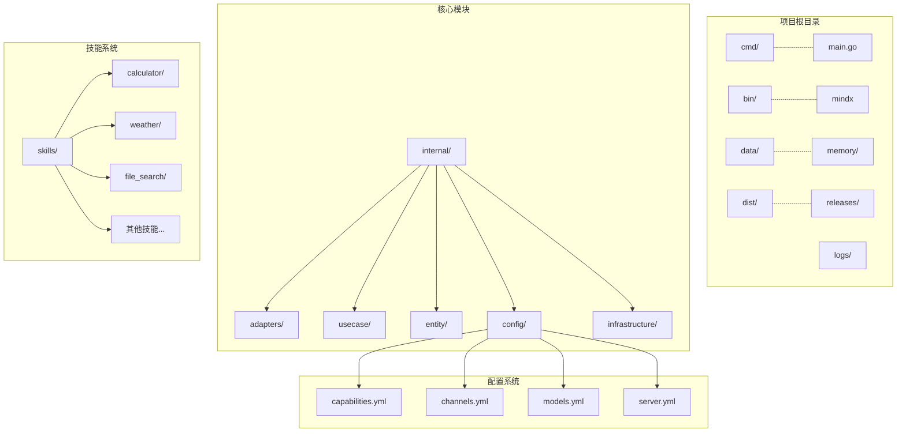

**图表来源**
- [cmd/main.go](file://cmd/main.go#L1-L21)
- [internal/adapters/cli/skill.go](file://internal/adapters/cli/skill.go#L1-L50)

**章节来源**
- [cmd/main.go](file://cmd/main.go#L1-L21)
- [internal/adapters/cli/skill.go](file://internal/adapters/cli/skill.go#L1-L50)

## 核心组件

### 技能管理器 (SkillMgr)

技能管理器是 MindX 系统的核心组件，采用 Facade 设计模式，协调各个子组件完成复杂的技能管理任务：

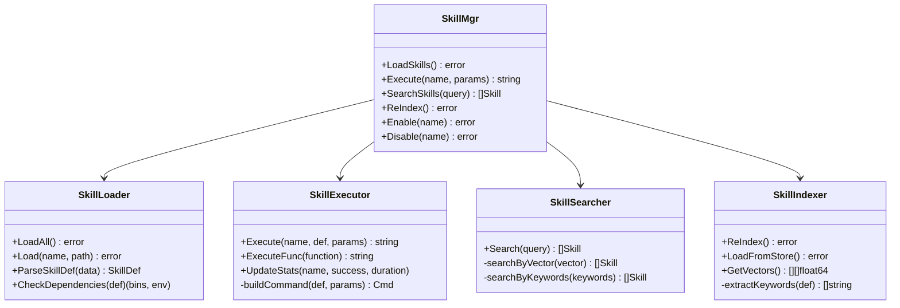

**图表来源**
- [internal/usecase/skills/README.md](file://internal/usecase/skills/README.md#L11-L46)
- [internal/usecase/skills/loader.go](file://internal/usecase/skills/loader.go#L18-L33)
- [internal/usecase/skills/executor.go](file://internal/usecase/skills/executor.go#L19-L42)

### 技能定义实体

技能系统的核心数据结构包括技能定义、参数定义和技能信息：

```mermaid
classDiagram
class SkillDef {
+string name
+string description
+string version
+string category
+[]string tags
+[]string os
+bool enabled
+int timeout
+string command
+map[string]ParameterDef parameters
+Requires requires
+[]InstallMethod install
+string homepage
+map[string]interface{} metadata
+string output_format
+string guidance
+bool is_internal
}
class ParameterDef {
+string type
+string description
+bool required
}
class Requires {
+[]string bins
+[]string env
}
class InstallMethod {
+string id
+string kind
+string package
+string formula
+[]string bins
+string label
+[]string os
}
class SkillInfo {
+SkillDef def
+string directory
+string content
+bool canRun
+[]string missingBins
+[]string missingEnv
+string format
+string status
+[]float64 vector
+int successCount
+int errorCount
+time lastRunTime
+string lastError
+int64 avgExecutionMs
+[]int64 executionTimes
}
SkillDef --> ParameterDef
SkillDef --> Requires
SkillDef --> InstallMethod
SkillInfo --> SkillDef
```

**图表来源**
- [internal/entity/skill.go](file://internal/entity/skill.go#L5-L25)
- [internal/entity/skill.go](file://internal/entity/skill.go#L44-L82)

**章节来源**
- [internal/usecase/skills/README.md](file://internal/usecase/skills/README.md#L1-L168)
- [internal/entity/skill.go](file://internal/entity/skill.go#L1-L83)

## 架构概览

MindX 技能系统的整体架构采用分层设计，从底层的技能加载到上层的执行和搜索：

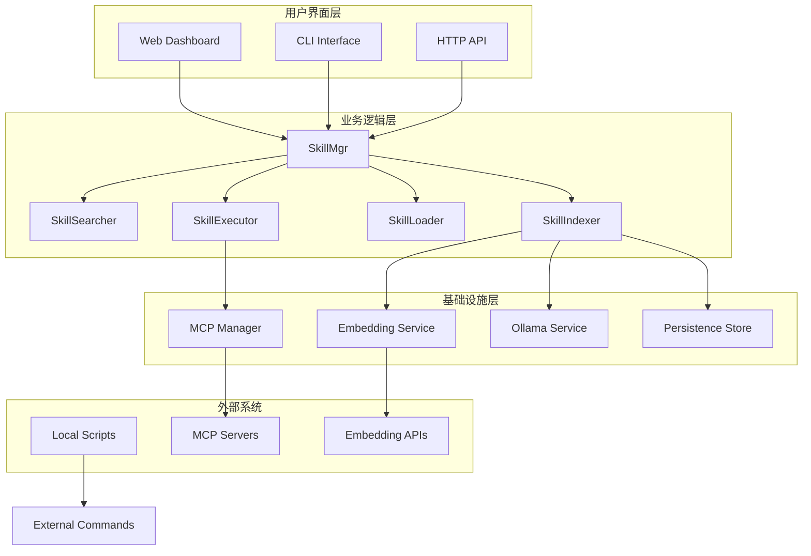

**图表来源**
- [internal/usecase/skills/README.md](file://internal/usecase/skills/README.md#L9-L46)
- [internal/usecase/skills/executor.go](file://internal/usecase/skills/executor.go#L57-L79)

## 详细组件分析

### CLI 技能开发

CLI 技能是最常见的技能类型，通过本地命令行脚本实现功能。

#### 目录结构规范

标准的 CLI 技能目录结构如下：

```
my-skill/
├── SKILL.md           # 技能定义文件（必需）
├── my-skill_cli.sh    # 命令行入口脚本
├── lib/               # 依赖库（可选）
└── references/        # 参考文档（可选）
    └── API_REFERENCE.md
```

#### SKILL.md 文件结构

SKILL.md 采用 YAML Frontmatter 和 Markdown 文档的组合格式：

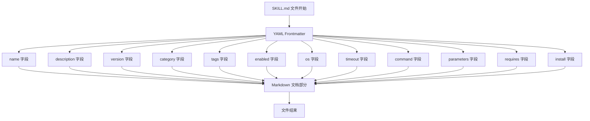

**图表来源**
- [internal/usecase/skills/SKILL_DEVELOPMENT.md](file://internal/usecase/skills/SKILL_DEVELOPMENT.md#L20-L49)

#### 参数传递机制

CLI 技能通过标准输入接收参数，采用 JSON 格式传递：

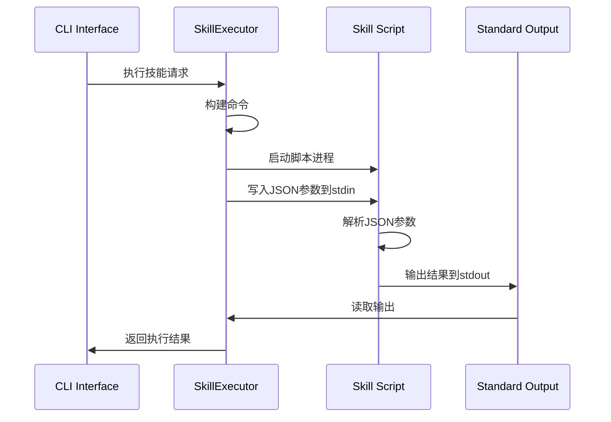

**图表来源**
- [internal/usecase/skills/executor.go](file://internal/usecase/skills/executor.go#L138-L195)
- [internal/usecase/skills/executor.go](file://internal/usecase/skills/executor.go#L218-L260)

#### 错误处理机制

CLI 技能的错误处理遵循标准的 Unix 命令行约定：

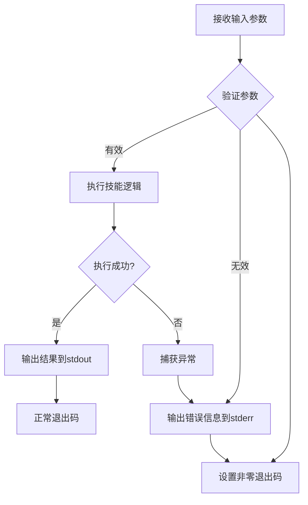

**图表来源**
- [internal/usecase/skills/executor.go](file://internal/usecase/skills/executor.go#L179-L190)

### MCP 技能开发

MCP (Model Context Protocol) 技能提供了与外部工具和服务的无缝集成能力。

#### MCP 技能配置

MCP 技能通过 metadata 字段中的 mcp 配置进行标识：

```mermaid
classDiagram
class SkillDef {
+string name
+string description
+map[string]interface{} metadata
}
class MCPSkillMetadata {
+string server
+string tool
}
SkillDef --> MCPSkillMetadata : "metadata.mcp"
```

**图表来源**
- [internal/usecase/skills/SKILL_DEVELOPMENT.md](file://internal/usecase/skills/SKILL_DEVELOPMENT.md#L375-L416)

#### MCP 服务器配置

MCP 服务器配置支持两种传输方式：

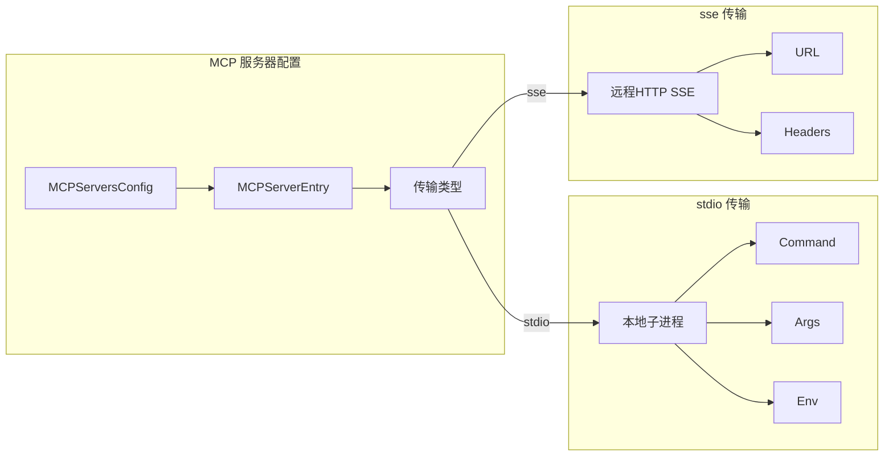

**图表来源**
- [internal/config/mcp.go](file://internal/config/mcp.go#L13-L29)
- [internal/config/mcp.go](file://internal/config/mcp.go#L49-L64)

#### MCP 管理器工作流程

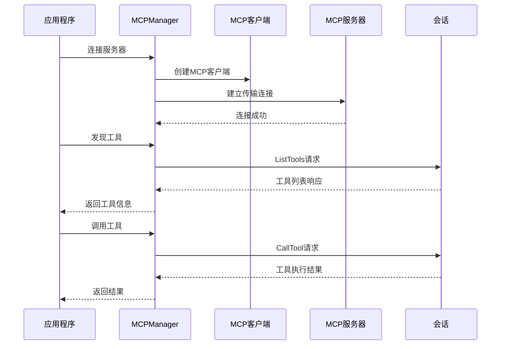

**图表来源**
- [internal/usecase/skills/mcp_manager.go](file://internal/usecase/skills/mcp_manager.go#L49-L141)
- [internal/usecase/skills/mcp_manager.go](file://internal/usecase/skills/mcp_manager.go#L169-L204)

**章节来源**
- [internal/usecase/skills/SKILL_DEVELOPMENT.md](file://internal/usecase/skills/SKILL_DEVELOPMENT.md#L1-L452)
- [internal/config/mcp.go](file://internal/config/mcp.go#L1-L106)
- [internal/usecase/skills/mcp_manager.go](file://internal/usecase/skills/mcp_manager.go#L1-L292)

## 依赖关系分析

### 技能加载流程

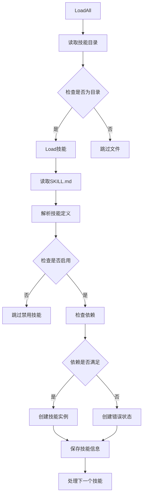

**图表来源**
- [internal/usecase/skills/loader.go](file://internal/usecase/skills/loader.go#L35-L58)
- [internal/usecase/skills/loader.go](file://internal/usecase/skills/loader.go#L60-L123)

### 技能执行流程

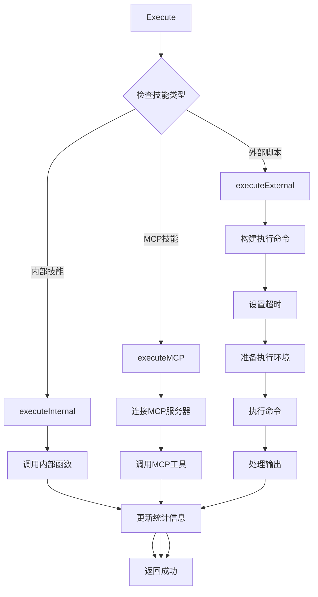

**图表来源**
- [internal/usecase/skills/executor.go](file://internal/usecase/skills/executor.go#L57-L79)
- [internal/usecase/skills/executor.go](file://internal/usecase/skills/executor.go#L81-L136)

**章节来源**
- [internal/usecase/skills/loader.go](file://internal/usecase/skills/loader.go#L1-L249)
- [internal/usecase/skills/executor.go](file://internal/usecase/skills/executor.go#L1-L402)

## 性能考虑

### 执行超时管理

技能执行支持超时控制，防止长时间阻塞：

- **默认超时**: 30秒
- **自定义超时**: 通过 `timeout` 字段配置
- **MCP 调用超时**: 支持独立的超时设置

### 统计信息收集

系统自动收集技能执行的统计信息：

- **成功率统计**: 成功/失败次数
- **执行时间监控**: 平均执行时间、最近执行时间
- **性能分析**: 最近100次执行时间记录

### 内存管理

- **并发安全**: 使用读写锁保护共享资源
- **资源清理**: 自动清理临时文件和进程
- **内存优化**: 限制统计信息存储数量

## 故障排除指南

### 常见问题诊断

#### 技能加载失败

**症状**: 技能无法加载或显示为不可运行

**排查步骤**:
1. 检查 SKILL.md 格式是否正确
2. 验证依赖项是否满足
3. 确认命令路径是否正确
4. 检查权限设置

#### 执行超时

**症状**: 技能执行超过设定时间

**解决方案**:
1. 增加 `timeout` 配置值
2. 优化脚本性能
3. 添加进度反馈机制

#### MCP 连接失败

**症状**: MCP 技能无法连接服务器

**排查步骤**:
1. 检查 MCP 服务器配置
2. 验证网络连接
3. 确认认证信息
4. 查看服务器状态

### 调试工具使用

#### 开发环境启动

使用提供的开发脚本启动完整的开发环境：

```bash
./scripts/dev-start.sh
```

该脚本会自动启动：
- 后端服务器 (端口 911)
- 前端开发服务器 (端口 5173)
- WebSocket 服务 (端口 1314)

#### CLI 调试命令

```bash
# 列出所有技能
mindx skill list

# 验证特定技能
mindx skill validate <技能名>

# 手动执行技能
mindx skill run <技能名> --参数值

# 重新加载技能
mindx skill reload
```

**章节来源**
- [scripts/dev-start.sh](file://scripts/dev-start.sh#L1-L285)
- [internal/adapters/cli/skill.go](file://internal/adapters/cli/skill.go#L24-L253)

## 结论

MindX 技能开发平台提供了完整的技能生态系统，支持本地 CLI 技能和 MCP 技能两种开发方式。通过标准化的配置文件格式和完善的执行框架，开发者可以快速创建、测试和部署各种类型的技能。

关键优势包括：
- **统一的开发规范**: 标准化的 SKILL.md 格式
- **灵活的执行方式**: 支持本地脚本和外部服务集成
- **完善的监控机制**: 自动统计和性能分析
- **便捷的开发工具**: 完整的 CLI 和调试工具链

## 附录

### 开发最佳实践

#### 目录结构建议
- 使用有意义的技能名称（小写字母和连字符）
- 合理组织文件结构，包含必要的文档
- 提供清晰的错误信息和帮助文档

#### 参数设计原则
- 明确参数类型和用途
- 提供合理的默认值
- 包含必要的验证逻辑
- 支持参数描述和示例

#### 错误处理规范
- 使用标准的 Unix 退出码
- 在 stderr 输出错误信息
- 提供有意义的错误描述
- 避免在 stdout 输出非结果内容

### 示例技能分析

#### 计算器技能示例

该示例展示了完整的 CLI 技能实现：

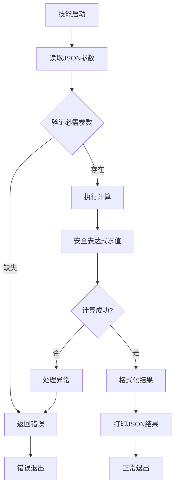

**图表来源**
- [skills/calculator/calculator_cli.py](file://skills/calculator/calculator_cli.py#L9-L39)

**章节来源**
- [skills/calculator/SKILL.md](file://skills/calculator/SKILL.md#L1-L37)
- [skills/calculator/calculator_cli.py](file://skills/calculator/calculator_cli.py#L1-L39)