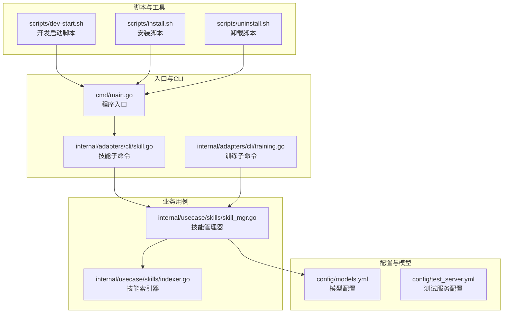
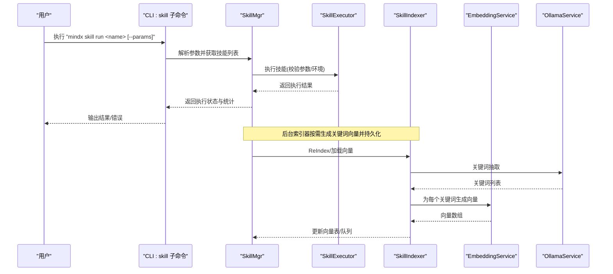
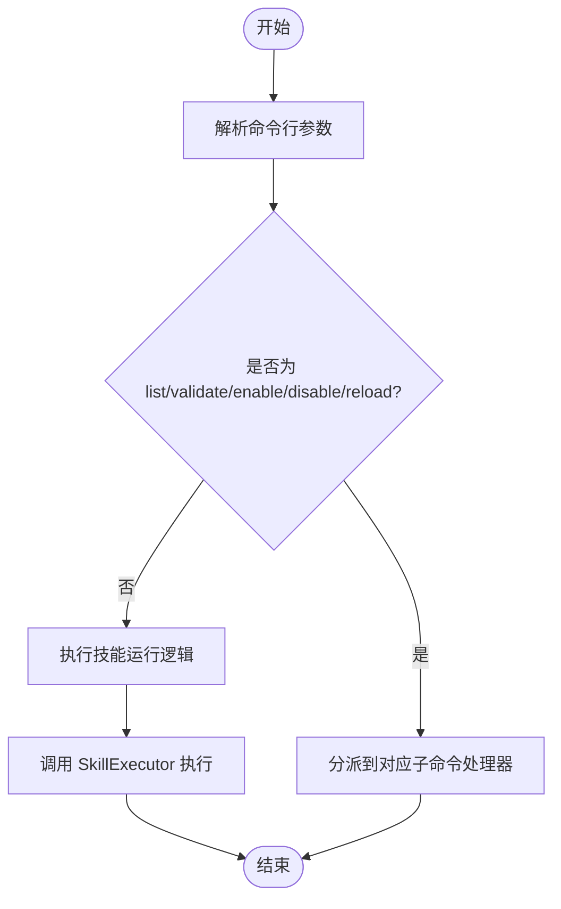
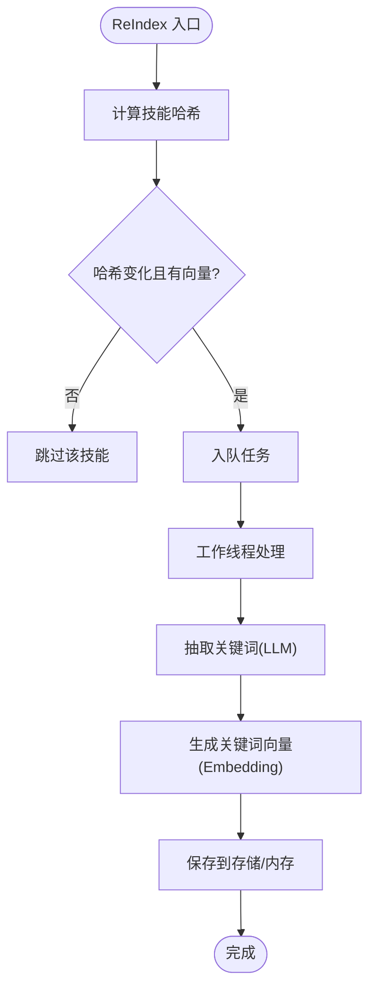
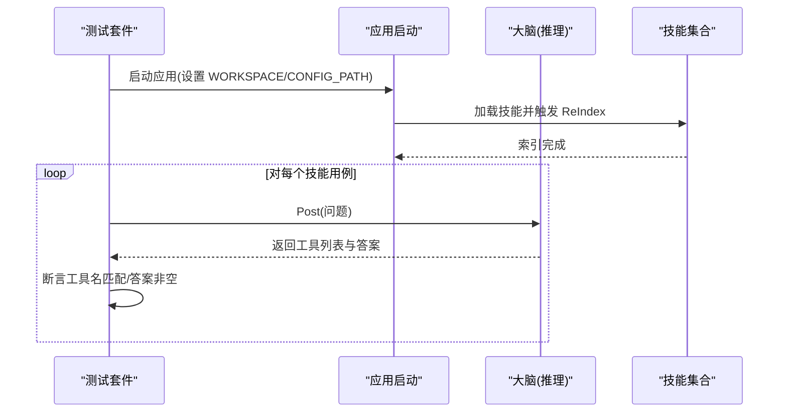
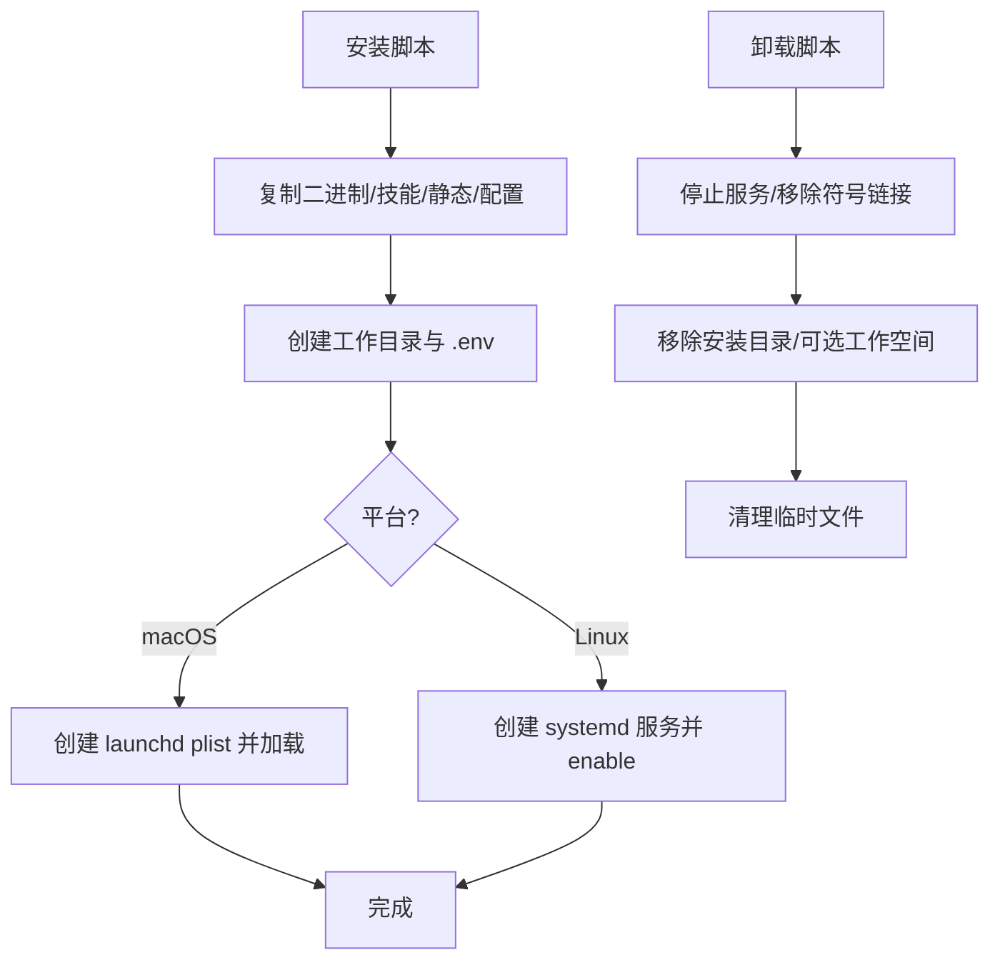
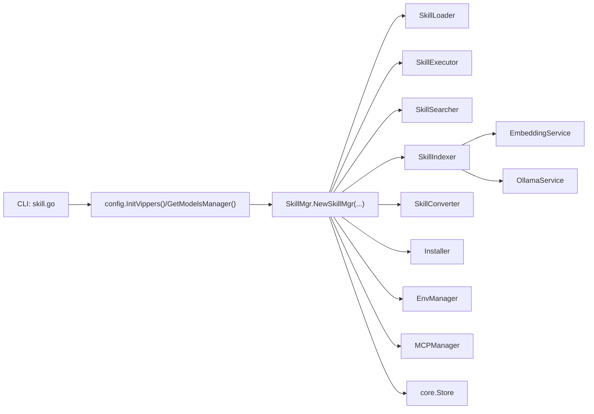

# 技能测试与部署

<cite>
**本文引用的文件**
- [cmd/main.go](file://cmd/main.go)
- [internal/adapters/cli/skill.go](file://internal/adapters/cli/skill.go)
- [internal/adapters/cli/training.go](file://internal/adapters/cli/training.go)
- [internal/usecase/skills/indexer.go](file://internal/usecase/skills/indexer.go)
- [internal/usecase/skills/skill_mgr.go](file://internal/usecase/skills/skill_mgr.go)
- [internal/tests/integration_test.go](file://internal/tests/integration_test.go)
- [config/test_server.yml](file://config/test_server.yml)
- [config/models.yml](file://config/models.yml)
- [scripts/install.sh](file://scripts/install.sh)
- [scripts/uninstall.sh](file://scripts/uninstall.sh)
- [scripts/dev-start.sh](file://scripts/dev-start.sh)
- [skills/calculator/SKILL.md](file://skills/calculator/SKILL.md)
- [skills/github/SKILL.md](file://skills/github/SKILL.md)
</cite>

## 目录
1. [简介](#简介)
2. [项目结构](#项目结构)
3. [核心组件](#核心组件)
4. [架构总览](#架构总览)
5. [详细组件分析](#详细组件分析)
6. [依赖关系分析](#依赖关系分析)
7. [性能考虑](#性能考虑)
8. [故障排查指南](#故障排查指南)
9. [结论](#结论)
10. [附录](#附录)

## 简介
本指南面向技能开发者与运维人员，提供从开发、测试、向量化索引、打包分发、安装部署到性能与监控的全流程操作手册。内容覆盖：
- 本地开发与测试流程
- 技能参数校验与输出格式检查
- 技能向量化索引的测试与验证
- 技能打包、分发与版本管理策略
- 安装、卸载与更新流程
- 性能测试与基准测试方法
- 部署最佳实践与常见问题排查
- 监控与日志分析方法

## 项目结构
MindX 采用多模块分层架构，CLI 入口负责命令解析与路由，内部通过 usecase 层协调技能加载、执行、索引与搜索；配置与模型管理由 config 层提供；基础设施层对接 Ollama、嵌入服务等外部能力。

**图表来源**
- [cmd/main.go](file://cmd/main.go#L1-L21)
- [internal/adapters/cli/skill.go](file://internal/adapters/cli/skill.go#L1-L327)
- [internal/adapters/cli/training.go](file://internal/adapters/cli/training.go#L1-L208)
- [internal/usecase/skills/skill_mgr.go](file://internal/usecase/skills/skill_mgr.go#L1-L200)
- [internal/usecase/skills/indexer.go](file://internal/usecase/skills/indexer.go#L1-L547)
- [config/models.yml](file://config/models.yml#L1-L92)
- [config/test_server.yml](file://config/test_server.yml#L1-L35)
- [scripts/install.sh](file://scripts/install.sh#L1-L324)
- [scripts/uninstall.sh](file://scripts/uninstall.sh#L1-L263)
- [scripts/dev-start.sh](file://scripts/dev-start.sh#L1-L285)

**章节来源**
- [cmd/main.go](file://cmd/main.go#L1-L21)
- [internal/adapters/cli/skill.go](file://internal/adapters/cli/skill.go#L1-L327)
- [internal/adapters/cli/training.go](file://internal/adapters/cli/training.go#L1-L208)
- [internal/usecase/skills/skill_mgr.go](file://internal/usecase/skills/skill_mgr.go#L1-L200)
- [internal/usecase/skills/indexer.go](file://internal/usecase/skills/indexer.go#L1-L547)
- [config/models.yml](file://config/models.yml#L1-L92)
- [config/test_server.yml](file://config/test_server.yml#L1-L35)
- [scripts/install.sh](file://scripts/install.sh#L1-L324)
- [scripts/uninstall.sh](file://scripts/uninstall.sh#L1-L263)
- [scripts/dev-start.sh](file://scripts/dev-start.sh#L1-L285)

## 核心组件
- CLI 子命令体系：提供技能列表、运行、验证、启用/禁用、重载等能力；训练子命令支持消息与 LoRA 训练模式。
- 技能管理器：统一编排加载、执行、索引、搜索、转换、安装与 MCP 管理。
- 技能索引器：基于关键词抽取与嵌入生成，构建技能向量索引，支持持久化与队列恢复。
- 配置与模型：集中管理模型参数、嵌入服务与测试服务配置。
- 脚本工具：安装/卸载/开发启动脚本，简化部署与调试。

**章节来源**
- [internal/adapters/cli/skill.go](file://internal/adapters/cli/skill.go#L18-L253)
- [internal/adapters/cli/training.go](file://internal/adapters/cli/training.go#L21-L195)
- [internal/usecase/skills/skill_mgr.go](file://internal/usecase/skills/skill_mgr.go#L20-L84)
- [internal/usecase/skills/indexer.go](file://internal/usecase/skills/indexer.go#L32-L73)
- [config/models.yml](file://config/models.yml#L1-L92)
- [config/test_server.yml](file://config/test_server.yml#L1-L35)
- [scripts/install.sh](file://scripts/install.sh#L1-L324)
- [scripts/uninstall.sh](file://scripts/uninstall.sh#L1-L263)
- [scripts/dev-start.sh](file://scripts/dev-start.sh#L1-L285)

## 架构总览
下图展示 CLI 到技能管理器再到索引器与嵌入服务的整体调用链路。

**图表来源**
- [internal/adapters/cli/skill.go](file://internal/adapters/cli/skill.go#L79-L127)
- [internal/usecase/skills/skill_mgr.go](file://internal/usecase/skills/skill_mgr.go#L189-L200)
- [internal/usecase/skills/indexer.go](file://internal/usecase/skills/indexer.go#L116-L176)

## 详细组件分析

### CLI 技能子命令与测试流程
- 列表与过滤：支持按分类筛选技能，显示启用状态、缺失依赖与统计信息。
- 运行与参数解析：将命令行参数转为键值映射，传递给执行器。
- 验证：检查技能启用状态、可运行性、缺失二进制与环境变量、最近错误。
- 启用/禁用/重载：动态调整技能状态并同步组件数据。

**图表来源**
- [internal/adapters/cli/skill.go](file://internal/adapters/cli/skill.go#L24-L127)

**章节来源**
- [internal/adapters/cli/skill.go](file://internal/adapters/cli/skill.go#L24-L127)

### 技能向量化索引器
- 关键词抽取：通过 LLM 将技能描述提炼为关键词集合。
- 向量生成：对关键词调用嵌入服务生成向量。
- 持久化与队列：将向量与哈希存入存储，支持队列文件恢复。
- 并发与状态：工作线程异步处理任务，原子计数跟踪待处理任务。

**图表来源**
- [internal/usecase/skills/indexer.go](file://internal/usecase/skills/indexer.go#L188-L253)
- [internal/usecase/skills/indexer.go](file://internal/usecase/skills/indexer.go#L116-L176)
- [internal/usecase/skills/indexer.go](file://internal/usecase/skills/indexer.go#L343-L393)

**章节来源**
- [internal/usecase/skills/indexer.go](file://internal/usecase/skills/indexer.go#L32-L73)
- [internal/usecase/skills/indexer.go](file://internal/usecase/skills/indexer.go#L188-L253)
- [internal/usecase/skills/indexer.go](file://internal/usecase/skills/indexer.go#L343-L393)

### 集成测试与验证
- 自动化测试：遍历一组典型技能场景，断言工具识别与响应非空。
- 索引等待：等待技能索引完成后再进行推理测试。
- 日志配置：集成测试期间输出日志到临时文件便于定位问题。

**图表来源**
- [internal/tests/integration_test.go](file://internal/tests/integration_test.go#L35-L89)
- [internal/tests/integration_test.go](file://internal/tests/integration_test.go#L128-L215)

**章节来源**
- [internal/tests/integration_test.go](file://internal/tests/integration_test.go#L1-L259)

### 训练子命令与参数
- 支持模式：消息训练与 LoRA 微调两种模式。
- 参数校验：LoRA 模式要求虚拟环境存在；未知模式直接报错。
- 工作流：收集 -> 过滤 -> 生成 -> 校验 -> 更新配置 -> 训练执行。
- 输出：训练报告包含 ID、状态、基座模型、新模型、配对数、耗时、评分与改进情况。

**章节来源**
- [internal/adapters/cli/training.go](file://internal/adapters/cli/training.go#L21-L195)

### 安装、卸载与更新
- 安装脚本：支持 macOS/Linux，复制二进制、技能、静态资源与配置模板，创建符号链接，创建工作目录与 .env，按平台创建 launchd 或 systemd 服务。
- 卸载脚本：停止服务、移除符号链接与安装目录、可选删除工作空间、清理临时文件。
- 更新流程：重新运行安装脚本或替换二进制后重启服务。

**图表来源**
- [scripts/install.sh](file://scripts/install.sh#L100-L301)
- [scripts/uninstall.sh](file://scripts/uninstall.sh#L68-L218)

**章节来源**
- [scripts/install.sh](file://scripts/install.sh#L1-L324)
- [scripts/uninstall.sh](file://scripts/uninstall.sh#L1-L263)

### 开发启动与本地测试
- 开发脚本：自动创建 .dev 工作空间，启动后端(监听 911)与前端(监听 5173)，支持热重载与清理。
- 本地验证：结合测试服务配置与模型配置，确保 Ollama 服务可达，向量索引可用。

**章节来源**
- [scripts/dev-start.sh](file://scripts/dev-start.sh#L1-L285)
- [config/test_server.yml](file://config/test_server.yml#L1-L35)
- [config/models.yml](file://config/models.yml#L1-L92)

## 依赖关系分析
- CLI 依赖配置初始化与模型管理，创建技能管理器并注入嵌入与 LLM 服务。
- 技能管理器聚合加载器、执行器、搜索器、索引器、转换器、安装器与环境管理器。
- 索引器依赖嵌入服务与 LLM 服务，使用存储进行向量持久化。

**图表来源**
- [internal/adapters/cli/skill.go](file://internal/adapters/cli/skill.go#L255-L300)
- [internal/usecase/skills/skill_mgr.go](file://internal/usecase/skills/skill_mgr.go#L36-L84)
- [internal/usecase/skills/indexer.go](file://internal/usecase/skills/indexer.go#L53-L73)

**章节来源**
- [internal/adapters/cli/skill.go](file://internal/adapters/cli/skill.go#L255-L300)
- [internal/usecase/skills/skill_mgr.go](file://internal/usecase/skills/skill_mgr.go#L36-L84)
- [internal/usecase/skills/indexer.go](file://internal/usecase/skills/indexer.go#L53-L73)

## 性能考虑
- 向量化索引并发：索引器使用工作线程与队列，避免阻塞主线程；建议在 CPU/内存充足时开启多核嵌入服务。
- 嵌入与 LLM：合理选择嵌入模型与 LLM 基座，注意网络延迟与吞吐；批量写入存储时使用批处理接口。
- 推理阶段：根据技能超时配置控制单次执行时间，必要时拆分复杂任务。
- 集成测试：在测试前等待索引完成，减少误判；使用短超时与断言最小集提升回归效率。

[本节为通用指导，无需特定文件引用]

## 故障排查指南
- 服务未启动
  - 检查端口占用与进程是否存在；开发脚本提供端口检测与 PID 管理。
  - 参考：[scripts/dev-start.sh](file://scripts/dev-start.sh#L52-L109)
- 技能不可运行
  - 使用验证命令检查缺失二进制与环境变量；确认技能启用状态。
  - 参考：[internal/adapters/cli/skill.go](file://internal/adapters/cli/skill.go#L129-L167)
- 向量索引异常
  - 确认 LLM 服务可达；查看索引器日志；等待队列清空或重启服务。
  - 参考：[internal/usecase/skills/indexer.go](file://internal/usecase/skills/indexer.go#L255-L264)
- 训练失败
  - 检查模式参数与依赖；查看训练报告中的错误字段；确认数据目录与最小语料阈值。
  - 参考：[internal/adapters/cli/training.go](file://internal/adapters/cli/training.go#L54-L64)
- 安装/卸载问题
  - macOS 使用 launchd，Linux 使用 systemd；权限不足时按提示使用 sudo。
  - 参考：[scripts/install.sh](file://scripts/install.sh#L208-L301)，[scripts/uninstall.sh](file://scripts/uninstall.sh#L126-L166)

**章节来源**
- [scripts/dev-start.sh](file://scripts/dev-start.sh#L52-L109)
- [internal/adapters/cli/skill.go](file://internal/adapters/cli/skill.go#L129-L167)
- [internal/usecase/skills/indexer.go](file://internal/usecase/skills/indexer.go#L255-L264)
- [internal/adapters/cli/training.go](file://internal/adapters/cli/training.go#L54-L64)
- [scripts/install.sh](file://scripts/install.sh#L208-L301)
- [scripts/uninstall.sh](file://scripts/uninstall.sh#L126-L166)

## 结论
通过 CLI 子命令、技能管理器与索引器的协同，MindX 提供了从开发到部署的一体化能力。配合安装脚本与集成测试，可实现稳定的本地验证与生产部署。建议在生产环境中：
- 明确版本与发布分支策略，使用安装脚本进行标准化部署
- 在变更技能或模型配置后，先运行集成测试与向量化索引验证
- 建立日志与监控机制，结合训练报告与索引状态进行持续优化

[本节为总结，无需特定文件引用]

## 附录

### 技能开发与测试操作清单
- 本地开发
  - 启动开发环境：[scripts/dev-start.sh](file://scripts/dev-start.sh#L246-L281)
  - 访问后端 API：http://localhost:911；前端界面：http://localhost:5173
- 技能测试
  - 列出技能：mindx skill list [--category 分类]
  - 验证技能：mindx skill validate <name>
  - 运行技能：mindx skill run <name> [--参数]
  - 参考示例：
    - [skills/calculator/SKILL.md](file://skills/calculator/SKILL.md#L1-L37)
    - [skills/github/SKILL.md](file://skills/github/SKILL.md#L1-L72)
- 集成测试
  - 运行测试套件：确保索引完成后进行推理断言
  - 参考：[internal/tests/integration_test.go](file://internal/tests/integration_test.go#L128-L215)

**章节来源**
- [scripts/dev-start.sh](file://scripts/dev-start.sh#L246-L281)
- [internal/adapters/cli/skill.go](file://internal/adapters/cli/skill.go#L24-L127)
- [skills/calculator/SKILL.md](file://skills/calculator/SKILL.md#L1-L37)
- [skills/github/SKILL.md](file://skills/github/SKILL.md#L1-L72)
- [internal/tests/integration_test.go](file://internal/tests/integration_test.go#L128-L215)

### 向量化索引测试与验证步骤
- 触发 ReIndex：等待索引器完成或使用等待接口
- 校验向量表：检查向量数量与关键词一致性
- 验证检索：以关键词或自然语言查询技能，确认命中与排序
- 参考：
  - [internal/usecase/skills/indexer.go](file://internal/usecase/skills/indexer.go#L188-L253)
  - [internal/usecase/skills/indexer.go](file://internal/usecase/skills/indexer.go#L310-L337)

**章节来源**
- [internal/usecase/skills/indexer.go](file://internal/usecase/skills/indexer.go#L188-L253)
- [internal/usecase/skills/indexer.go](file://internal/usecase/skills/indexer.go#L310-L337)

### 打包、分发与版本管理
- 版本号：VERSION 文件决定安装脚本与发布产物版本
- 发布产物：dist 与 releases 目录包含多平台二进制与安装包
- 分发策略：安装脚本复制预编译二进制与资源，便于快速部署
- 参考：
  - [scripts/install.sh](file://scripts/install.sh#L34-L40)
  - [releases/](file://releases/)
  - [dist/](file://dist/)

**章节来源**
- [scripts/install.sh](file://scripts/install.sh#L34-L40)
- [releases/](file://releases/)
- [dist/](file://dist/)

### 安装、卸载与更新流程
- 安装
  - macOS/Linux：./scripts/install.sh
  - 创建符号链接与系统服务；创建工作空间与配置模板
- 卸载
  - ./scripts/uninstall.sh：停止服务、移除符号链接与安装目录、可选删除工作空间
- 更新
  - 替换二进制后重启服务；或重新运行安装脚本

**章节来源**
- [scripts/install.sh](file://scripts/install.sh#L100-L301)
- [scripts/uninstall.sh](file://scripts/uninstall.sh#L68-L218)

### 性能测试与基准测试
- 集成测试作为基准：覆盖常用技能场景，记录工具识别与响应质量
- 训练报告：对比基座模型与新模型的评分与改进情况
- 参考：
  - [internal/tests/integration_test.go](file://internal/tests/integration_test.go#L128-L215)
  - [internal/adapters/cli/training.go](file://internal/adapters/cli/training.go#L160-L191)

**章节来源**
- [internal/tests/integration_test.go](file://internal/tests/integration_test.go#L128-L215)
- [internal/adapters/cli/training.go](file://internal/adapters/cli/training.go#L160-L191)

### 部署最佳实践与注意事项
- 环境隔离：使用独立工作空间与 .env，避免与系统路径冲突
- 服务管理：macOS 使用 launchd，Linux 使用 systemd，确保自启动与日志落盘
- 资源规划：为嵌入与 LLM 服务预留 CPU/内存；监控索引队列长度
- 安全与权限：安装脚本可能需要 sudo 写入系统路径；卸载时确认工作空间保留策略

**章节来源**
- [scripts/install.sh](file://scripts/install.sh#L208-L301)
- [scripts/uninstall.sh](file://scripts/uninstall.sh#L188-L218)

### 监控与日志分析
- 日志配置：集成测试使用系统日志配置输出到临时文件
- 建议：在生产环境启用系统服务日志与应用日志轮转，定期巡检索引状态与队列积压
- 参考：
  - [internal/tests/integration_test.go](file://internal/tests/integration_test.go#L48-L61)

**章节来源**
- [internal/tests/integration_test.go](file://internal/tests/integration_test.go#L48-L61)