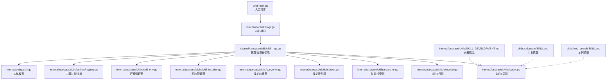
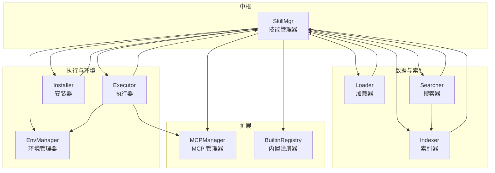
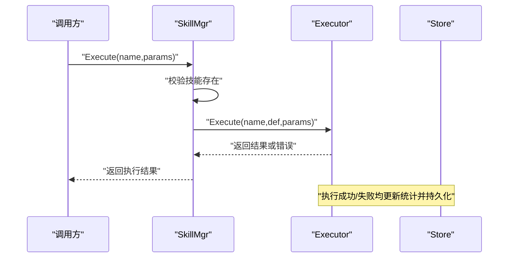
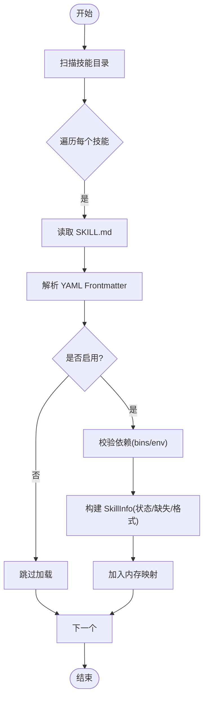
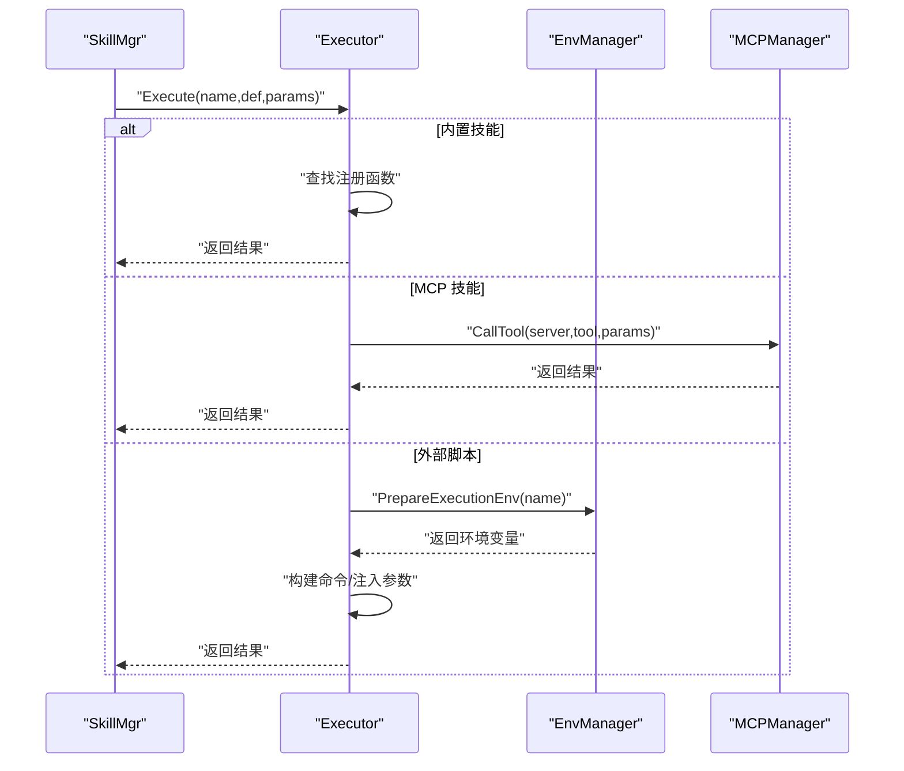
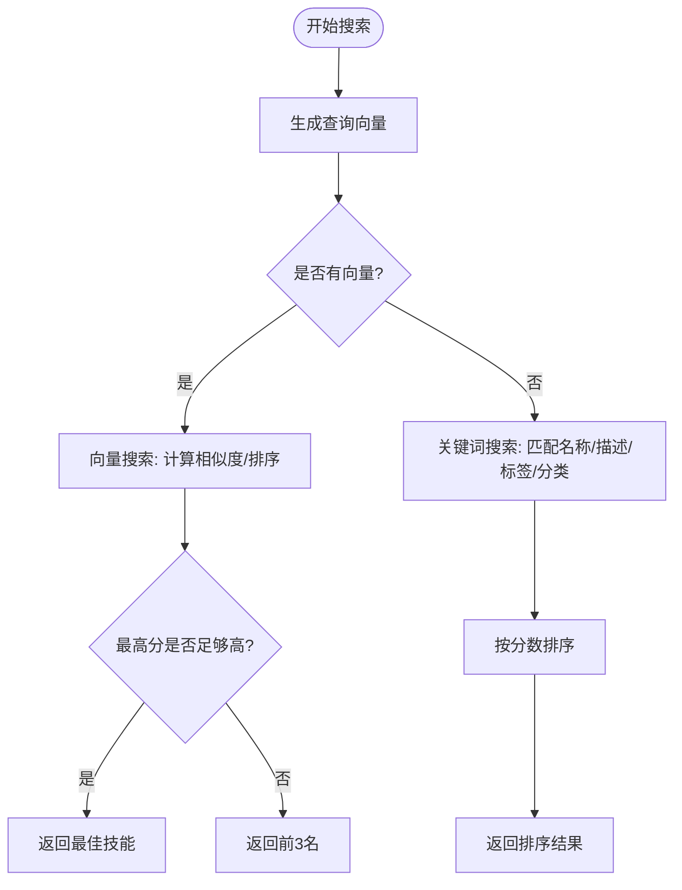
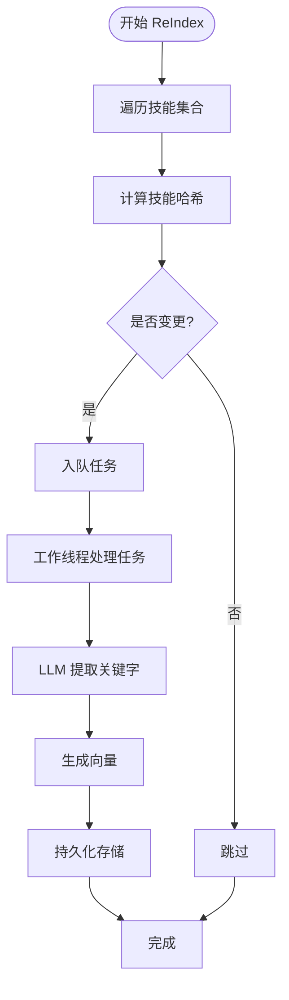
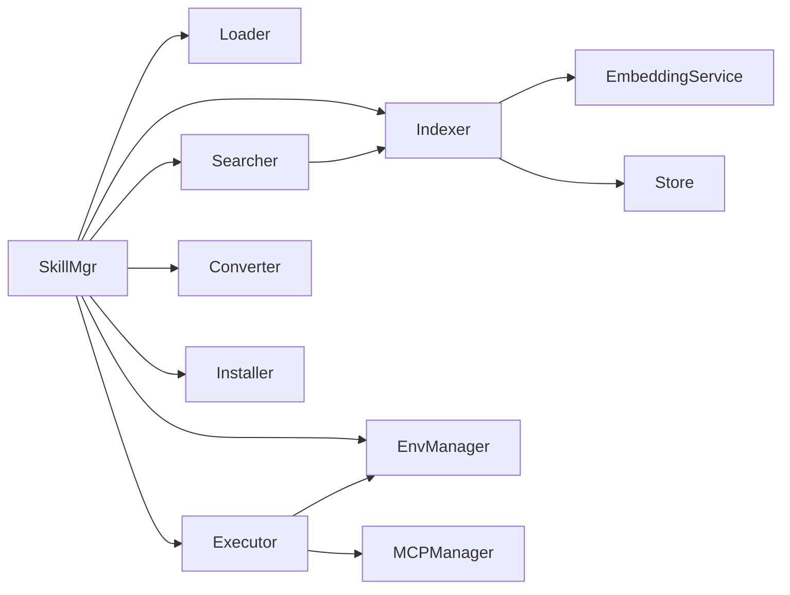

# 技能生态系统

<cite>
**本文引用的文件**
- [cmd/main.go](file://cmd/main.go)
- [internal/core/skillmgr.go](file://internal/core/skillmgr.go)
- [internal/usecase/skills/skill_mgr.go](file://internal/usecase/skills/skill_mgr.go)
- [internal/usecase/skills/loader.go](file://internal/usecase/skills/loader.go)
- [internal/usecase/skills/indexer.go](file://internal/usecase/skills/indexer.go)
- [internal/usecase/skills/searcher.go](file://internal/usecase/skills/searcher.go)
- [internal/usecase/skills/executor.go](file://internal/usecase/skills/executor.go)
- [internal/usecase/skills/skill_installer.go](file://internal/usecase/skills/skill_installer.go)
- [internal/usecase/skills/converter.go](file://internal/usecase/skills/converter.go)
- [internal/usecase/skills/skill_env.go](file://internal/usecase/skills/skill_env.go)
- [internal/usecase/skills/builtins/registry.go](file://internal/usecase/skills/builtins/registry.go)
- [internal/entity/skill.go](file://internal/entity/skill.go)
- [internal/usecase/skills/SKILL_DEVELOPMENT.md](file://internal/usecase/skills/SKILL_DEVELOPMENT.md)
- [skills/calculator/SKILL.md](file://skills/calculator/SKILL.md)
- [skills/web_search/SKILL.md](file://skills/web_search/SKILL.md)
</cite>

## 目录
1. [简介](#简介)
2. [项目结构](#项目结构)
3. [核心组件](#核心组件)
4. [架构总览](#架构总览)
5. [组件详解](#组件详解)
6. [依赖关系分析](#依赖关系分析)
7. [性能考量](#性能考量)
8. [故障排查指南](#故障排查指南)
9. [结论](#结论)
10. [附录](#附录)

## 简介
MindX 技能生态系统围绕“技能管理器”构建，提供技能的加载、执行、搜索与索引、安装与卸载、版本管理与运行时环境管理等能力。系统同时支持两类技能：
- CLI 技能：通过本地命令行脚本执行
- MCP 技能：通过 Model Context Protocol 连接外部工具与服务

系统具备向量化索引与语义搜索能力，结合关键词匹配，实现高效、准确的技能检索；并通过异步索引队列与持久化存储，保障大规模技能集的可维护性与稳定性。

## 项目结构
- 入口程序位于 cmd/main.go，初始化构建信息并启动 CLI 子系统
- 核心接口定义在 internal/core/skillmgr.go，抽象出技能管理器的能力边界
- 技能管理器实现位于 internal/usecase/skills/skill_mgr.go，协调加载器、执行器、搜索器、索引器、转换器、安装器、环境管理器与 MCP 管理器
- 实体模型位于 internal/entity/skill.go，定义技能定义、安装方法、统计信息等
- 开发规范与模板位于 internal/usecase/skills/SKILL_DEVELOPMENT.md
- 内置技能注册位于 internal/usecase/skills/builtins/registry.go
- 示例技能 SKILL.md 位于 skills/.../SKILL.md

图表来源
- [cmd/main.go](file://cmd/main.go#L1-L21)
- [internal/core/skillmgr.go](file://internal/core/skillmgr.go#L1-L18)
- [internal/usecase/skills/skill_mgr.go](file://internal/usecase/skills/skill_mgr.go#L1-L60)
- [internal/usecase/skills/loader.go](file://internal/usecase/skills/loader.go#L1-L35)
- [internal/usecase/skills/executor.go](file://internal/usecase/skills/executor.go#L1-L42)
- [internal/usecase/skills/searcher.go](file://internal/usecase/skills/searcher.go#L1-L32)
- [internal/usecase/skills/indexer.go](file://internal/usecase/skills/indexer.go#L1-L51)
- [internal/usecase/skills/converter.go](file://internal/usecase/skills/converter.go#L1-L29)
- [internal/usecase/skills/skill_installer.go](file://internal/usecase/skills/skill_installer.go#L1-L22)
- [internal/usecase/skills/skill_env.go](file://internal/usecase/skills/skill_env.go#L1-L42)
- [internal/usecase/skills/builtins/registry.go](file://internal/usecase/skills/builtins/registry.go#L1-L30)
- [internal/entity/skill.go](file://internal/entity/skill.go#L1-L83)
- [internal/usecase/skills/SKILL_DEVELOPMENT.md](file://internal/usecase/skills/SKILL_DEVELOPMENT.md#L1-L60)
- [skills/calculator/SKILL.md](file://skills/calculator/SKILL.md#L1-L37)
- [skills/web_search/SKILL.md](file://skills/web_search/SKILL.md#L1-L67)

章节来源
- [cmd/main.go](file://cmd/main.go#L1-L21)
- [internal/core/skillmgr.go](file://internal/core/skillmgr.go#L1-L18)

## 核心组件
- 技能管理器接口：定义执行、工具调用、获取技能、搜索技能、注册内置技能等能力
- 技能管理器实现：组合加载器、执行器、搜索器、索引器、转换器、安装器、环境管理器、MCP 管理器，负责生命周期管理与组件同步
- 加载器：扫描技能目录，解析 SKILL.md，校验依赖，构建技能信息
- 执行器：根据技能类型（内置、MCP、外部脚本）执行，支持超时控制、参数序列化、统计记录
- 搜索器：优先向量搜索，回退关键词匹配，支持关键词与向量混合评分
- 索引器：异步生成技能关键字向量，持久化存储，支持增量重建与队列容错
- 转换器：将 SKILL.md 的 YAML Frontmatter 规范化并回写
- 安装器：支持 brew/apt/yum/dnf/npm/pip/snap/choco 等包管理器安装依赖
- 环境管理器：集中管理技能运行时环境变量，支持 Workspace 下的 skills.yml
- 内置技能注册：注册 web_search/open_url/write_file/cron/deep_search 等内置技能

章节来源
- [internal/core/skillmgr.go](file://internal/core/skillmgr.go#L1-L18)
- [internal/usecase/skills/skill_mgr.go](file://internal/usecase/skills/skill_mgr.go#L20-L62)
- [internal/usecase/skills/loader.go](file://internal/usecase/skills/loader.go#L18-L33)
- [internal/usecase/skills/executor.go](file://internal/usecase/skills/executor.go#L19-L42)
- [internal/usecase/skills/searcher.go](file://internal/usecase/skills/searcher.go#L15-L32)
- [internal/usecase/skills/indexer.go](file://internal/usecase/skills/indexer.go#L32-L51)
- [internal/usecase/skills/converter.go](file://internal/usecase/skills/converter.go#L16-L29)
- [internal/usecase/skills/skill_installer.go](file://internal/usecase/skills/skill_installer.go#L12-L22)
- [internal/usecase/skills/skill_env.go](file://internal/usecase/skills/skill_env.go#L28-L42)
- [internal/usecase/skills/builtins/registry.go](file://internal/usecase/skills/builtins/registry.go#L15-L29)

## 架构总览
技能管理器作为中枢，协调各子系统协同工作。加载器负责发现与解析技能；执行器负责实际执行；搜索器负责检索；索引器负责向量化与持久化；安装器负责依赖安装；环境管理器负责运行时环境；内置注册器负责注册系统内置技能。

图表来源
- [internal/usecase/skills/skill_mgr.go](file://internal/usecase/skills/skill_mgr.go#L20-L62)
- [internal/usecase/skills/loader.go](file://internal/usecase/skills/loader.go#L18-L33)
- [internal/usecase/skills/executor.go](file://internal/usecase/skills/executor.go#L19-L42)
- [internal/usecase/skills/searcher.go](file://internal/usecase/skills/searcher.go#L15-L32)
- [internal/usecase/skills/indexer.go](file://internal/usecase/skills/indexer.go#L32-L51)
- [internal/usecase/skills/skill_env.go](file://internal/usecase/skills/skill_env.go#L28-L42)
- [internal/usecase/skills/skill_installer.go](file://internal/usecase/skills/skill_installer.go#L12-L22)
- [internal/usecase/skills/builtins/registry.go](file://internal/usecase/skills/builtins/registry.go#L15-L29)

## 组件详解

### 技能管理器（SkillMgr）
- 职责
  - 加载技能：初始化环境、加载所有技能、同步组件
  - 执行技能：按名称或工具函数执行，支持内置、MCP、外部脚本
  - 搜索技能：向量搜索优先，回退关键词匹配
  - 索引管理：增量重建、等待队列完成、同步组件
  - 安装与批量安装：按定义安装依赖
  - MCP 管理：初始化、添加、移除、重启 MCP 服务器
  - 关闭：停止索引工作线程，关闭 MCP 管理器
- 关键流程
  - 初始化：加载环境 -> 加载技能 -> 同步组件 -> 从存储加载索引 -> 启动索引工作线程
  - 执行：校验技能存在 -> 调用执行器 -> 记录统计
  - 搜索：空关键词返回全部 -> 有向量索引则向量搜索 -> 否则关键词搜索
  - 索引：计算哈希 -> 判定是否变更 -> 入队异步处理 -> 持久化存储

图表来源
- [internal/usecase/skills/skill_mgr.go](file://internal/usecase/skills/skill_mgr.go#L189-L211)
- [internal/usecase/skills/executor.go](file://internal/usecase/skills/executor.go#L57-L79)
- [internal/usecase/skills/executor.go](file://internal/usecase/skills/executor.go#L266-L300)

章节来源
- [internal/usecase/skills/skill_mgr.go](file://internal/usecase/skills/skill_mgr.go#L36-L84)
- [internal/usecase/skills/skill_mgr.go](file://internal/usecase/skills/skill_mgr.go#L122-L149)
- [internal/usecase/skills/skill_mgr.go](file://internal/usecase/skills/skill_mgr.go#L189-L211)
- [internal/usecase/skills/skill_mgr.go](file://internal/usecase/skills/skill_mgr.go#L228-L241)
- [internal/usecase/skills/skill_mgr.go](file://internal/usecase/skills/skill_mgr.go#L361-L371)

### 技能加载器（SkillLoader）
- 职责
  - 扫描技能目录，逐个加载 SKILL.md
  - 解析 YAML Frontmatter 为 SkillDef
  - 校验依赖（二进制与环境变量）
  - 构建 SkillInfo（包含状态、缺失项、格式、统计等）
  - 支持注册/注销 MCP 技能
- 关键点
  - 未启用的技能跳过加载
  - 依赖缺失标记为不可运行
  - 为 MCP 技能标记格式为 mcp

图表来源
- [internal/usecase/skills/loader.go](file://internal/usecase/skills/loader.go#L35-L58)
- [internal/usecase/skills/loader.go](file://internal/usecase/skills/loader.go#L60-L123)
- [internal/usecase/skills/loader.go](file://internal/usecase/skills/loader.go#L165-L184)
- [internal/usecase/skills/loader.go](file://internal/usecase/skills/loader.go#L186-L204)
- [internal/usecase/skills/loader.go](file://internal/usecase/skills/loader.go#L206-L231)

章节来源
- [internal/usecase/skills/loader.go](file://internal/usecase/skills/loader.go#L18-L33)
- [internal/usecase/skills/loader.go](file://internal/usecase/skills/loader.go#L35-L58)
- [internal/usecase/skills/loader.go](file://internal/usecase/skills/loader.go#L60-L123)
- [internal/usecase/skills/loader.go](file://internal/usecase/skills/loader.go#L206-L231)

### 技能执行器（SkillExecutor）
- 职责
  - 执行内置技能、MCP 技能、外部脚本
  - 命令解析与参数序列化
  - 超时控制与上下文管理
  - 统计信息收集与持久化
- 关键点
  - 内置技能：通过注册表回调执行
  - MCP 技能：通过 MCP 管理器调用工具
  - 外部脚本：构建命令、注入环境变量、传递 JSON 参数、捕获输出与错误

图表来源
- [internal/usecase/skills/executor.go](file://internal/usecase/skills/executor.go#L57-L79)
- [internal/usecase/skills/executor.go](file://internal/usecase/skills/executor.go#L81-L103)
- [internal/usecase/skills/executor.go](file://internal/usecase/skills/executor.go#L105-L136)
- [internal/usecase/skills/executor.go](file://internal/usecase/skills/executor.go#L138-L195)
- [internal/usecase/skills/executor.go](file://internal/usecase/skills/executor.go#L218-L260)
- [internal/usecase/skills/executor.go](file://internal/usecase/skills/executor.go#L266-L300)

章节来源
- [internal/usecase/skills/executor.go](file://internal/usecase/skills/executor.go#L19-L42)
- [internal/usecase/skills/executor.go](file://internal/usecase/skills/executor.go#L57-L79)
- [internal/usecase/skills/executor.go](file://internal/usecase/skills/executor.go#L138-L195)
- [internal/usecase/skills/executor.go](file://internal/usecase/skills/executor.go#L266-L300)

### 技能搜索器（SkillSearcher）
- 职责
  - 向量搜索：将查询关键词嵌入，计算与技能关键字向量的最大余弦相似度，排序返回
  - 关键词搜索：当无向量或向量为空时，回退到关键词匹配
- 关键点
  - 向量搜索优先级更高，阈值与排序策略保证高质量召回
  - 回退策略确保在向量索引不完整时仍可用

图表来源
- [internal/usecase/skills/searcher.go](file://internal/usecase/skills/searcher.go#L42-L62)
- [internal/usecase/skills/searcher.go](file://internal/usecase/skills/searcher.go#L72-L188)
- [internal/usecase/skills/searcher.go](file://internal/usecase/skills/searcher.go#L190-L281)

章节来源
- [internal/usecase/skills/searcher.go](file://internal/usecase/skills/searcher.go#L15-L32)
- [internal/usecase/skills/searcher.go](file://internal/usecase/skills/searcher.go#L42-L62)
- [internal/usecase/skills/searcher.go](file://internal/usecase/skills/searcher.go#L72-L188)
- [internal/usecase/skills/searcher.go](file://internal/usecase/skills/searcher.go#L190-L281)

### 技能索引器（SkillIndexer）
- 职责
  - 异步生成技能关键字向量，写入内存与持久化存储
  - 增量重建：基于哈希判断是否需要重新索引
  - 队列容错：任务持久化到文件，重启后恢复
  - 关键字提取：通过 LLM 生成中文关键字，增强中文匹配
- 关键点
  - 使用系统提示词提取中文关键字
  - 任务队列容量与等待完成机制
  - 与 Store 的批量写入与扫描

图表来源
- [internal/usecase/skills/indexer.go](file://internal/usecase/skills/indexer.go#L188-L253)
- [internal/usecase/skills/indexer.go](file://internal/usecase/skills/indexer.go#L116-L176)
- [internal/usecase/skills/indexer.go](file://internal/usecase/skills/indexer.go#L343-L393)
- [internal/usecase/skills/indexer.go](file://internal/usecase/skills/indexer.go#L446-L516)

章节来源
- [internal/usecase/skills/indexer.go](file://internal/usecase/skills/indexer.go#L32-L51)
- [internal/usecase/skills/indexer.go](file://internal/usecase/skills/indexer.go#L188-L253)
- [internal/usecase/skills/indexer.go](file://internal/usecase/skills/indexer.go#L343-L393)
- [internal/usecase/skills/indexer.go](file://internal/usecase/skills/indexer.go#L446-L516)

### 技能转换器（SkillConverter）
- 职责
  - 将 SKILL.md 的 YAML Frontmatter 规范化并回写，补全缺失字段
  - 支持单个与批量转换
- 关键点
  - 读取 -> 解析 -> 补全 -> 序列化 -> 写回

章节来源
- [internal/usecase/skills/converter.go](file://internal/usecase/skills/converter.go#L16-L29)
- [internal/usecase/skills/converter.go](file://internal/usecase/skills/converter.go#L37-L104)
- [internal/usecase/skills/converter.go](file://internal/usecase/skills/converter.go#L106-L120)

### 安装管理器（Installer）
- 职责
  - 支持 brew/apt/yum/dnf/npm/pip/snap/choco 等安装方式
  - 将输出重定向到标准流，便于日志与用户交互
- 关键点
  - 选择包管理器并构造命令
  - 执行并返回错误

章节来源
- [internal/usecase/skills/skill_installer.go](file://internal/usecase/skills/skill_installer.go#L12-L22)
- [internal/usecase/skills/skill_installer.go](file://internal/usecase/skills/skill_installer.go#L24-L66)

### 环境管理器（EnvManager）
- 职责
  - 从 workspace 下的 skills.yml 加载技能专属环境变量
  - 执行时合并宿主环境与技能专属变量
  - 支持设置与保存
- 关键点
  - 变量命名规则：SKILL_{技能名}_{变量名}

章节来源
- [internal/usecase/skills/skill_env.go](file://internal/usecase/skills/skill_env.go#L28-L42)
- [internal/usecase/skills/skill_env.go](file://internal/usecase/skills/skill_env.go#L100-L120)
- [internal/usecase/skills/skill_env.go](file://internal/usecase/skills/skill_env.go#L122-L135)

### 内置技能注册（BuiltinRegistry）
- 职责
  - 注册 web_search/open_url/write_file/cron/deep_search 等内置技能
  - 通过 SkillMgr.RegisterInternalSkill 注册
- 关键点
  - cron 与 deep_search 依赖外部调度器与配置

章节来源
- [internal/usecase/skills/builtins/registry.go](file://internal/usecase/skills/builtins/registry.go#L15-L29)

## 依赖关系分析
- 组件耦合
  - SkillMgr 对 Loader/Executor/Searcher/Indexer/Converter/Installer/EnvManager/MCPManager 具有强依赖，负责编排与同步
  - Executor 依赖 EnvManager 与 MCPManager
  - Searcher 依赖 Indexer 的向量表
  - Indexer 依赖 EmbeddingService 与 Store
- 外部依赖
  - 包管理器（brew/apt/yum/dnf/npm/pip/snap/choco）
  - LLM/Ollama 用于关键字提取与向量生成
  - Store 接口用于持久化向量与统计

图表来源
- [internal/usecase/skills/skill_mgr.go](file://internal/usecase/skills/skill_mgr.go#L40-L62)
- [internal/usecase/skills/executor.go](file://internal/usecase/skills/executor.go#L20-L28)
- [internal/usecase/skills/searcher.go](file://internal/usecase/skills/searcher.go#L15-L22)
- [internal/usecase/skills/indexer.go](file://internal/usecase/skills/indexer.go#L32-L36)

章节来源
- [internal/usecase/skills/skill_mgr.go](file://internal/usecase/skills/skill_mgr.go#L40-L62)
- [internal/usecase/skills/executor.go](file://internal/usecase/skills/executor.go#L20-L28)
- [internal/usecase/skills/searcher.go](file://internal/usecase/skills/searcher.go#L15-L22)
- [internal/usecase/skills/indexer.go](file://internal/usecase/skills/indexer.go#L32-L36)

## 性能考量
- 异步索引与队列
  - 索引器使用通道队列与工作线程，避免阻塞主线程
  - 通过等待队列完成与持久化，保证一致性
- 向量搜索与回退
  - 优先向量搜索，阈值与排序策略减少无效匹配
  - 无向量时自动回退关键词搜索
- 执行超时与统计
  - 执行器为每类技能设置合理超时，记录执行时间与成功率
- 增量重建
  - 基于哈希判断是否需要重建，减少不必要的计算

[本节为通用性能讨论，无需列出具体文件来源]

## 故障排查指南
- 技能未加载
  - 检查 SKILL.md 格式与 Frontmatter 是否正确
  - 查看依赖缺失（bins/env）与状态
- 执行失败
  - 查看执行器日志与输出，确认参数序列化与环境变量
  - 检查超时设置与 MCP 连接状态
- 搜索无结果
  - 确认向量索引是否为空或重建中
  - 增加关键词或优化 description/tags
- 安装失败
  - 检查包管理器可用性与权限
  - 查看安装器日志与错误信息

章节来源
- [internal/usecase/skills/loader.go](file://internal/usecase/skills/loader.go#L60-L123)
- [internal/usecase/skills/executor.go](file://internal/usecase/skills/executor.go#L138-L195)
- [internal/usecase/skills/searcher.go](file://internal/usecase/skills/searcher.go#L283-L287)
- [internal/usecase/skills/indexer.go](file://internal/usecase/skills/indexer.go#L333-L337)
- [internal/usecase/skills/skill_installer.go](file://internal/usecase/skills/skill_installer.go#L24-L66)

## 结论
MindX 技能生态系统通过模块化设计与清晰的职责划分，实现了技能的全生命周期管理。借助向量化索引与关键词搜索的双轨机制，系统在可扩展性与易用性之间取得平衡。内置技能与 MCP 扩展进一步增强了系统的通用性与生态兼容性。建议在开发新技能时严格遵循 SKILL.md 规范，并充分利用内置注册与环境管理能力，确保良好的用户体验与运维效率。

[本节为总结性内容，无需列出具体文件来源]

## 附录

### 技能开发规范与模板
- 目录结构
  - SKILL.md（必需）
  - 命令行入口脚本（如 my-skill_cli.sh）
  - 可选 lib 与 references/API_REFERENCE.md
- SKILL.md 结构
  - YAML Frontmatter：name/description/version/category/tags/os/enabled/timeout/command/parameters/requires/install/homepage/metadata/output_format/guidance/is_internal
  - Markdown 文档：详细说明、使用示例、输出格式、注意事项
- 参数与依赖
  - parameters：type/description/required
  - requires：bins/env
  - install：id/kind/package/formula/label/os
- MCP 技能
  - 通过 metadata.mcp 标记 server/tool，其余 SKILL.md 完全一致
- 开发注意事项
  - 跨平台兼容性、安全性、错误处理、性能、日志输出
- 测试与验证
  - 本地测试脚本与 SKILL.md 校验

章节来源
- [internal/usecase/skills/SKILL_DEVELOPMENT.md](file://internal/usecase/skills/SKILL_DEVELOPMENT.md#L1-L60)
- [internal/usecase/skills/SKILL_DEVELOPMENT.md](file://internal/usecase/skills/SKILL_DEVELOPMENT.md#L114-L142)
- [internal/usecase/skills/SKILL_DEVELOPMENT.md](file://internal/usecase/skills/SKILL_DEVELOPMENT.md#L365-L438)

### 内置技能示例
- web_search：内部技能，使用 DuckDuckGo 搜索
- calculator：CLI 技能，执行数学表达式

章节来源
- [internal/usecase/skills/builtins/registry.go](file://internal/usecase/skills/builtins/registry.go#L16-L18)
- [skills/calculator/SKILL.md](file://skills/calculator/SKILL.md#L1-L37)
- [skills/web_search/SKILL.md](file://skills/web_search/SKILL.md#L1-L67)

### 数据模型概览
- SkillDef：技能定义（名称、描述、版本、分类、标签、命令、参数、依赖、安装方法、元数据等）
- InstallMethod：安装方法（id/kind/package/formula/bins/label/os）
- SkillStats：技能统计（成功次数、失败次数、执行时间、最后运行时间）
- SkillInfo：技能完整信息（包含 Def、目录、内容、能否运行、缺失项、格式、状态、向量、统计）

章节来源
- [internal/entity/skill.go](file://internal/entity/skill.go#L5-L25)
- [internal/entity/skill.go](file://internal/entity/skill.go#L33-L42)
- [internal/entity/skill.go](file://internal/entity/skill.go#L51-L57)
- [internal/entity/skill.go](file://internal/entity/skill.go#L59-L82)