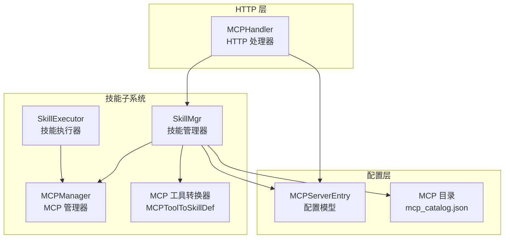
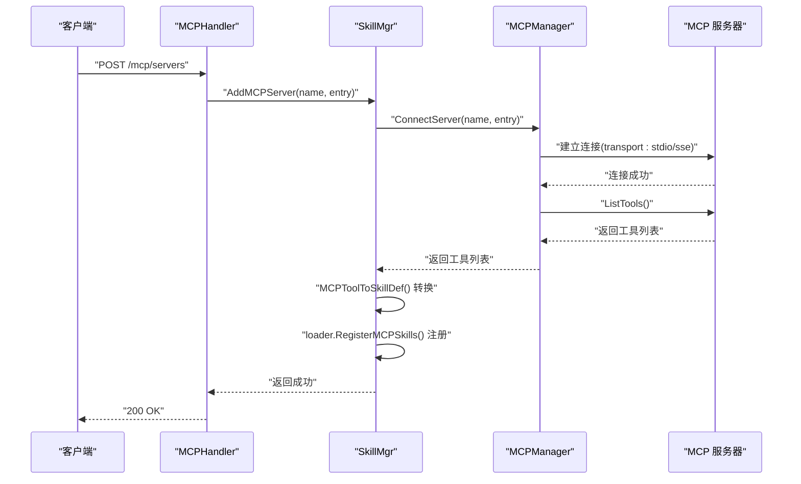
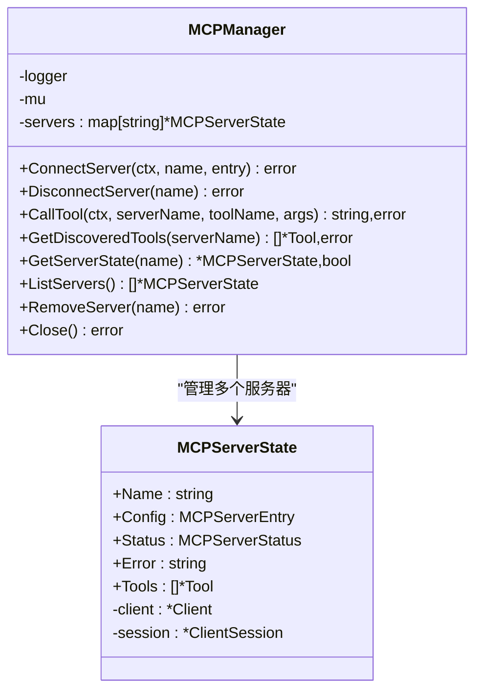
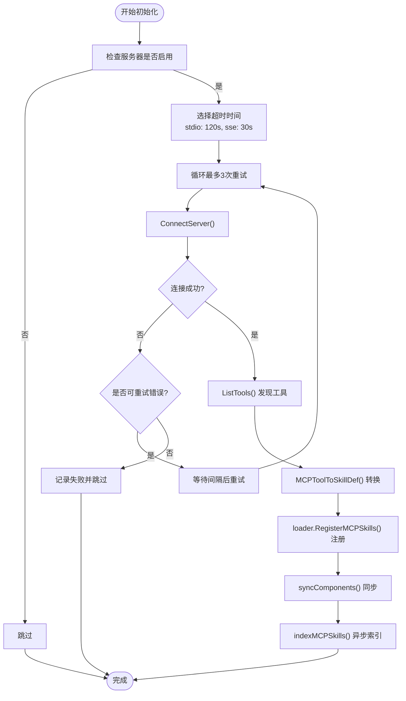
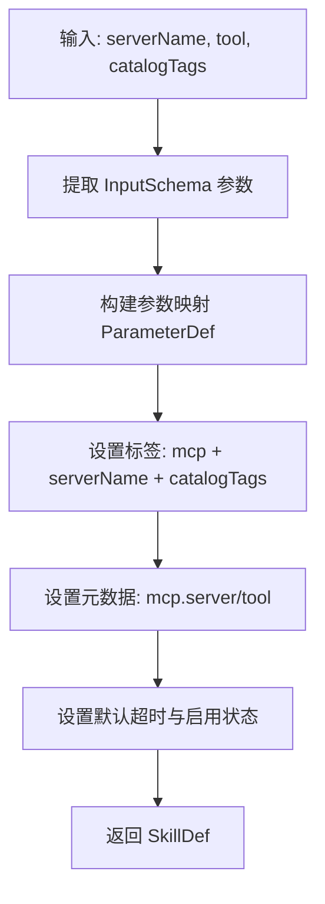
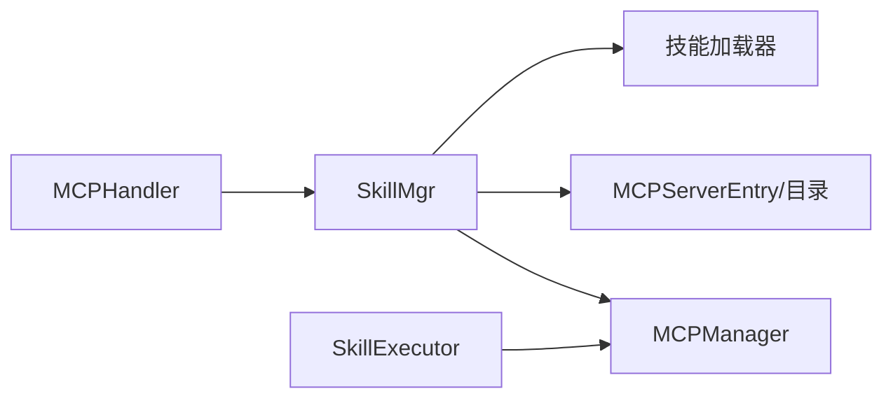

# MCP 管理器

<cite>
**本文档引用的文件**
- [mcp_manager.go](file://internal/usecase/skills/mcp_manager.go)
- [mcp_utils.go](file://internal/usecase/skills/mcp_utils.go)
- [mcp.go](file://internal/config/mcp.go)
- [mcp_catalog.json](file://config/catalog/mcp_catalog.json)
- [skill_mgr.go](file://internal/usecase/skills/skill_mgr.go)
- [executor.go](file://internal/usecase/skills/executor.go)
- [mcp.go](file://internal/adapters/http/handlers/mcp.go)
- [mcp_catalog_test.go](file://internal/config/mcp_catalog_test.go)
- [mcp_index_test.go](file://internal/usecase/skills/mcp_index_test.go)
- [mcp_utils_test.go](file://internal/usecase/skills/mcp_utils_test.go)
- [mcp_servers.json.template](file://config/mcp_servers.json.template)
</cite>

## 目录
1. [简介](#简介)
2. [项目结构](#项目结构)
3. [核心组件](#核心组件)
4. [架构总览](#架构总览)
5. [详细组件分析](#详细组件分析)
6. [依赖关系分析](#依赖关系分析)
7. [性能考虑](#性能考虑)
8. [故障排除指南](#故障排除指南)
9. [结论](#结论)
10. [附录](#附录)

## 简介
本文件为 MindX MCP 管理器的技术文档，全面阐述 MCP 协议实现与服务器管理机制，包括 MCP 服务器的连接、工具发现与注册流程；多服务器并发管理策略；工具动态发现与注册机制；连接重试、错误恢复与状态监控；以及 MCP 与技能管理器其他组件的集成方式。同时提供 MCP 配置选项、服务器管理策略、调试技巧、集成示例与故障排除指南。

## 项目结构
MCP 管理器位于技能子系统中，围绕以下关键模块组织：
- MCP 管理器：负责连接、断开、工具调用与状态管理
- MCP 工具转换器：将 MCP 工具转换为内部技能定义
- 技能管理器：协调 MCP 服务器初始化、工具注册与索引
- HTTP 处理器：提供 MCP 服务器的运行时增删改查与目录安装接口
- 配置系统：提供 MCP 服务器配置、目录与环境变量解析
- 执行器：统一调度内部技能、MCP 技能与外部脚本技能

图表来源
- [skill_mgr.go](file://internal/usecase/skills/skill_mgr.go#L36-L62)
- [mcp_manager.go](file://internal/usecase/skills/mcp_manager.go#L36-L47)
- [mcp_utils.go](file://internal/usecase/skills/mcp_utils.go#L56-L97)
- [mcp.go](file://internal/adapters/http/handlers/mcp.go#L13-L23)
- [mcp.go](file://internal/config/mcp.go#L17-L29)
- [mcp_catalog.json](file://config/catalog/mcp_catalog.json#L1-L755)

章节来源
- [skill_mgr.go](file://internal/usecase/skills/skill_mgr.go#L36-L62)
- [mcp_manager.go](file://internal/usecase/skills/mcp_manager.go#L36-L47)
- [mcp_utils.go](file://internal/usecase/skills/mcp_utils.go#L56-L97)
- [mcp.go](file://internal/adapters/http/handlers/mcp.go#L13-L23)
- [mcp.go](file://internal/config/mcp.go#L17-L29)
- [mcp_catalog.json](file://config/catalog/mcp_catalog.json#L1-L755)

## 核心组件
- MCPManager：维护多服务器状态、连接生命周期、工具发现与调用
- SkillMgr：并发初始化 MCP 服务器、工具注册、索引与状态同步
- SkillExecutor：统一执行入口，识别并路由到 MCP 执行路径
- MCP 工具转换器：将 MCP Tool 转换为内部 SkillDef，并注入元数据与参数
- HTTP 处理器：提供 MCP 服务器的增删改查、目录安装与工具查询接口
- 配置系统：MCPServerEntry、环境变量解析、目录解析与持久化

章节来源
- [mcp_manager.go](file://internal/usecase/skills/mcp_manager.go#L17-L47)
- [skill_mgr.go](file://internal/usecase/skills/skill_mgr.go#L20-L34)
- [executor.go](file://internal/usecase/skills/executor.go#L19-L42)
- [mcp_utils.go](file://internal/usecase/skills/mcp_utils.go#L56-L97)
- [mcp.go](file://internal/adapters/http/handlers/mcp.go#L13-L23)
- [mcp.go](file://internal/config/mcp.go#L17-L29)

## 架构总览
MCP 管理器采用“配置驱动 + 并发初始化 + 动态注册”的架构模式：
- 配置驱动：从 mcp_servers.json 读取服务器配置，支持 stdio 与 SSE 两种传输
- 并发初始化：SkillMgr 对每个服务器独立 goroutine 初始化，各自带超时与重试
- 动态注册：连接成功后发现工具，转换为内部技能定义并注册到技能加载器
- 执行路由：执行器根据元数据判断是否为 MCP 技能，路由到 MCPManager 调用

图表来源
- [mcp.go](file://internal/adapters/http/handlers/mcp.go#L33-L90)
- [skill_mgr.go](file://internal/usecase/skills/skill_mgr.go#L470-L506)
- [mcp_manager.go](file://internal/usecase/skills/mcp_manager.go#L49-L141)
- [mcp_utils.go](file://internal/usecase/skills/mcp_utils.go#L56-L97)

章节来源
- [mcp.go](file://internal/adapters/http/handlers/mcp.go#L33-L90)
- [skill_mgr.go](file://internal/usecase/skills/skill_mgr.go#L373-L506)
- [mcp_manager.go](file://internal/usecase/skills/mcp_manager.go#L49-L141)
- [mcp_utils.go](file://internal/usecase/skills/mcp_utils.go#L56-L97)

## 详细组件分析

### MCPManager：连接、工具发现与调用
- 连接管理
  - 支持 stdio 与 SSE 两种传输
  - stdio：通过命令与参数启动子进程，继承并覆盖环境变量，工作目录设为用户主目录
  - SSE：基于 HTTP 客户端，支持自定义头部，用于认证
  - 连接成功后记录状态为 connected，并缓存 client 与 session
- 工具发现与注册
  - 连接后调用 ListTools 获取工具列表
  - 成功则缓存工具，失败记录错误但不中断流程
- 工具调用
  - 通过 session.CallTool 调用指定工具，自动提取文本内容
  - 调用失败时更新状态为 error
- 状态管理
  - 提供 GetServerState、ListServers、GetDiscoveredTools 等查询接口
  - 支持 DisconnectServer、RemoveServer、Close 等清理操作

图表来源
- [mcp_manager.go](file://internal/usecase/skills/mcp_manager.go#L25-L47)
- [mcp_manager.go](file://internal/usecase/skills/mcp_manager.go#L49-L278)

章节来源
- [mcp_manager.go](file://internal/usecase/skills/mcp_manager.go#L49-L278)

### SkillMgr：并发初始化、重试与注册
- 并发初始化
  - 对每个启用的服务器启动独立 goroutine
  - stdio 服务器使用较长超时（npx 冷启动），SSE 使用较短超时
- 重试策略
  - 最大重试 3 次，每次间隔递增
  - 仅对超时、I/O 超时、连接拒绝等可恢复错误进行重试
  - 对 EOF、方法不允许等不可恢复错误直接放弃
- 工具注册与索引
  - 连接成功后发现工具，转换为内部技能定义
  - 从目录获取中文描述与标签，覆盖或补充技能元数据
  - 注册到 loader 并同步组件，异步送入索引队列生成向量

图表来源
- [skill_mgr.go](file://internal/usecase/skills/skill_mgr.go#L373-L468)
- [skill_mgr.go](file://internal/usecase/skills/skill_mgr.go#L470-L506)
- [mcp_utils.go](file://internal/usecase/skills/mcp_utils.go#L56-L97)

章节来源
- [skill_mgr.go](file://internal/usecase/skills/skill_mgr.go#L373-L506)
- [mcp_utils.go](file://internal/usecase/skills/mcp_utils.go#L56-L97)

### MCP 工具转换器：MCPToolToSkillDef
- 输入：MCP 服务器名、MCP Tool、可选目录标签
- 输出：内部 SkillDef
- 关键点：
  - 从 Tool.InputSchema 提取参数定义，支持原生 map 与 json.RawMessage
  - 自动注入标签：["mcp", serverName]，并合并目录标签
  - 元数据包含 mcp.server 与 mcp.tool，便于执行器识别
  - 默认超时 30 秒，启用状态为 true

图表来源
- [mcp_utils.go](file://internal/usecase/skills/mcp_utils.go#L56-L97)
- [mcp_utils.go](file://internal/usecase/skills/mcp_utils.go#L99-L131)

章节来源
- [mcp_utils.go](file://internal/usecase/skills/mcp_utils.go#L56-L131)

### HTTP 处理器：MCP 服务器管理与目录安装
- 接口概览
  - 列表：GET /mcp/servers
  - 添加：POST /mcp/servers（支持校验字段与持久化）
  - 删除：DELETE /mcp/servers/:name
  - 重启：POST /mcp/servers/:name/restart
  - 查询工具：GET /mcp/servers/:name/tools
  - 目录：GET /mcp/catalog
  - 从目录安装：POST /mcp/catalog/install（异步连接）
- 关键行为
  - 添加/删除/重启均会持久化到 mcp_servers.json
  - 目录安装时解析变量并异步连接，不阻塞 HTTP 响应

章节来源
- [mcp.go](file://internal/adapters/http/handlers/mcp.go#L25-L160)
- [mcp.go](file://internal/adapters/http/handlers/mcp.go#L162-L247)

### 配置系统：MCPServerEntry 与目录解析
- MCPServerEntry
  - 支持 type: stdio/sse，默认 stdio
  - stdio：command、args、env
  - sse：url、headers
  - enabled：是否启用
  - 环境变量解析：支持 ${VAR} 占位符，优先使用本地上下文，否则使用系统环境
- 目录系统
  - 内置目录包含多种 MCP 服务器，支持变量与中文描述
  - 支持解析目录项为 MCPServerEntry，替换变量占位符
  - 支持匹配工具描述，支持连字符与下划线标准化

章节来源
- [mcp.go](file://internal/config/mcp.go#L17-L29)
- [mcp.go](file://internal/config/mcp.go#L82-L105)
- [mcp_catalog.json](file://config/catalog/mcp_catalog.json#L1-L755)
- [mcp_catalog_test.go](file://internal/config/mcp_catalog_test.go#L31-L74)

## 依赖关系分析
- MCPManager 依赖 mcp SDK 的 Client/Session，负责连接与工具调用
- SkillMgr 依赖 MCPManager、配置系统、目录系统与技能加载器
- SkillExecutor 依赖 MCPManager 以执行 MCP 技能
- HTTP 处理器依赖 SkillMgr 以提供运行时管理接口

图表来源
- [mcp.go](file://internal/adapters/http/handlers/mcp.go#L13-L23)
- [skill_mgr.go](file://internal/usecase/skills/skill_mgr.go#L20-L34)
- [executor.go](file://internal/usecase/skills/executor.go#L19-L42)

章节来源
- [mcp.go](file://internal/adapters/http/handlers/mcp.go#L13-L23)
- [skill_mgr.go](file://internal/usecase/skills/skill_mgr.go#L20-L34)
- [executor.go](file://internal/usecase/skills/executor.go#L19-L42)

## 性能考虑
- 并发初始化：每个服务器独立 goroutine，充分利用 CPU 与 I/O 并行
- 超时与重试：针对不同传输类型设置合理超时，避免长时间阻塞
- 异步索引：工具注册后异步送入索引队列，不阻塞连接流程
- 环境变量解析：仅在连接前解析一次，减少重复计算
- 日志与监控：关键路径记录状态变化与错误，便于定位性能瓶颈

## 故障排除指南
- 连接失败
  - 检查服务器类型与必要字段：SSE 必须提供 url，stdio 必须提供 command
  - stdio：确认命令可执行、工作目录权限、环境变量覆盖是否正确
  - SSE：确认 URL 可达、认证头是否正确、网络延迟是否超过超时
- 工具发现失败
  - 确认服务器已连接且状态为 connected
  - 检查服务器是否实现 ListTools 方法
- 工具调用失败
  - 检查工具名称是否正确（区分大小写与连字符/下划线）
  - 检查参数是否满足 InputSchema 的 required 字段
  - 查看 MCPManager 的错误状态与日志
- 重试策略
  - 仅对超时、I/O 超时、连接拒绝等可恢复错误进行重试
  - 对 EOF、方法不允许等不可恢复错误，建议手动干预修复后重试
- 配置问题
  - 确认 mcp_servers.json 是否存在且格式正确
  - 使用目录安装时，检查变量是否正确解析

章节来源
- [mcp.go](file://internal/adapters/http/handlers/mcp.go#L57-L69)
- [mcp_manager.go](file://internal/usecase/skills/mcp_manager.go#L106-L114)
- [skill_mgr.go](file://internal/usecase/skills/skill_mgr.go#L404-L468)
- [mcp_servers.json.template](file://config/mcp_servers.json.template#L1-L4)

## 结论
MCP 管理器通过清晰的职责划分与健壮的错误处理机制，实现了 MCP 服务器的稳定接入与工具的动态注册。其并发初始化与异步索引策略提升了整体性能，而完善的重试与状态监控保障了可靠性。配合 HTTP 处理器与目录系统，用户可以便捷地管理 MCP 服务器并快速扩展技能生态。

## 附录

### MCP 配置选项
- mcp_servers.json
  - mcpServers: 服务器映射，键为服务器名称，值为 MCPServerEntry
- MCPServerEntry
  - type: "stdio" 或 "sse"（默认 stdio）
  - stdio：command、args、env
  - sse：url、headers
  - enabled：是否启用

章节来源
- [mcp.go](file://internal/config/mcp.go#L13-L29)
- [mcp_servers.json.template](file://config/mcp_servers.json.template#L1-L4)

### MCP 服务器管理策略
- 启动策略：并发初始化，独立超时与重试
- 运行时管理：支持添加、删除、重启与查询工具
- 目录安装：从内置目录一键安装并异步连接

章节来源
- [skill_mgr.go](file://internal/usecase/skills/skill_mgr.go#L373-L558)
- [mcp.go](file://internal/adapters/http/handlers/mcp.go#L105-L160)

### 调试技巧
- 启用详细日志：观察连接、工具发现、调用与重试过程
- 使用目录安装：快速验证连接与工具可用性
- 检查环境变量：确认 ${VAR} 占位符解析结果
- 验证参数：确保 InputSchema 的 required 字段满足

章节来源
- [mcp_catalog_test.go](file://internal/config/mcp_catalog_test.go#L31-L74)
- [mcp_utils_test.go](file://internal/usecase/skills/mcp_utils_test.go#L13-L137)

### 集成示例
- 通过 HTTP 添加 SSE 服务器：提供 url 与 headers
- 通过 HTTP 添加 stdio 服务器：提供 command 与 args
- 从目录安装：提供所需变量，系统自动解析并异步连接

章节来源
- [mcp.go](file://internal/adapters/http/handlers/mcp.go#L33-L90)
- [mcp.go](file://internal/adapters/http/handlers/mcp.go#L183-L247)