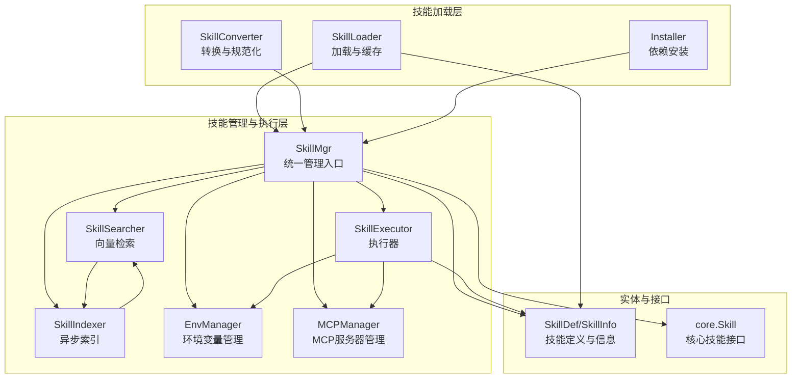
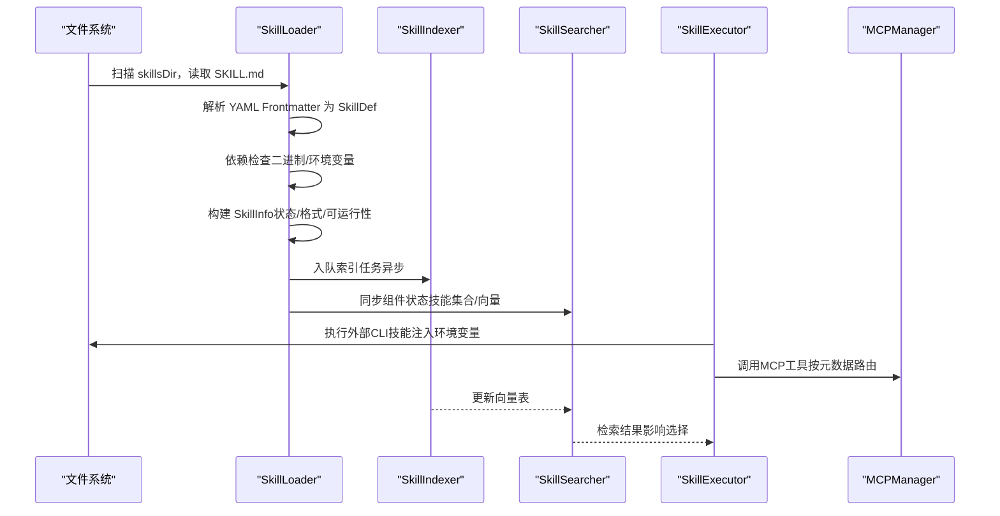
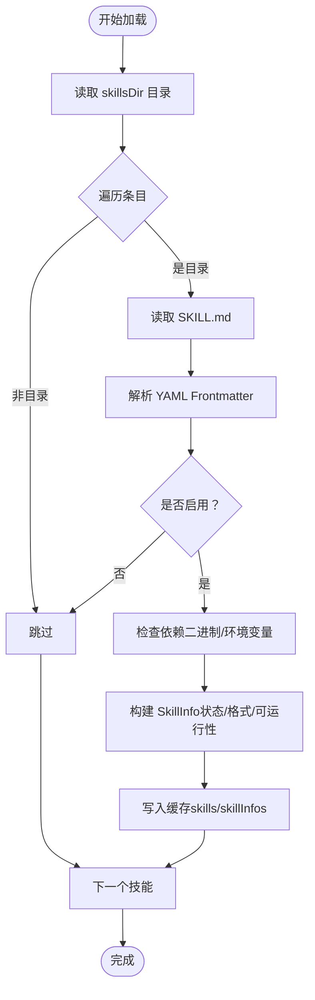
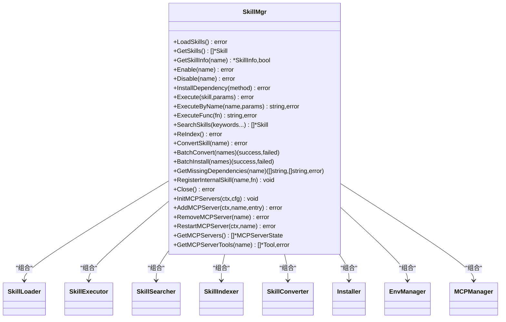
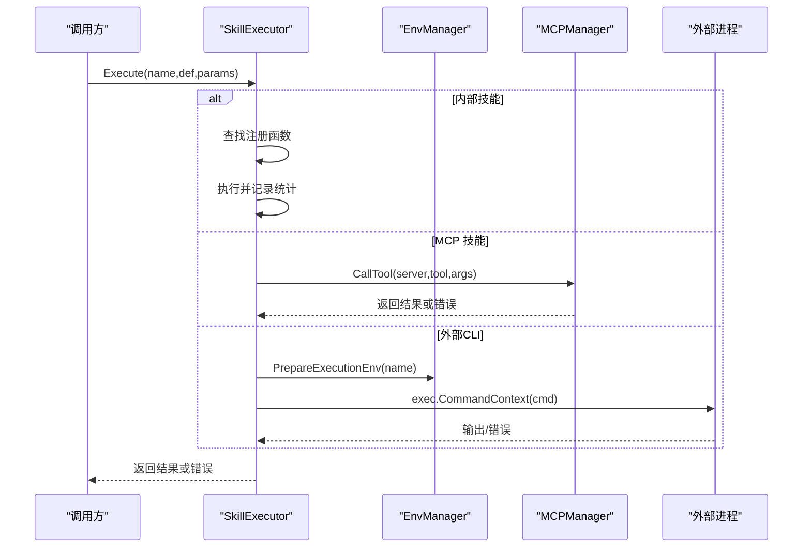
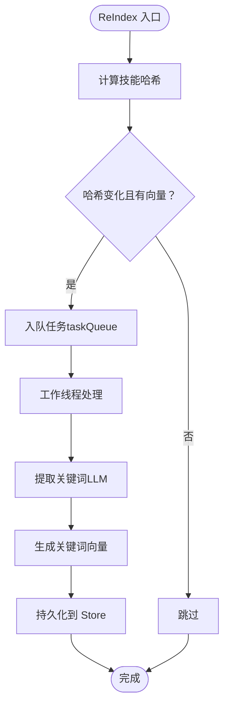
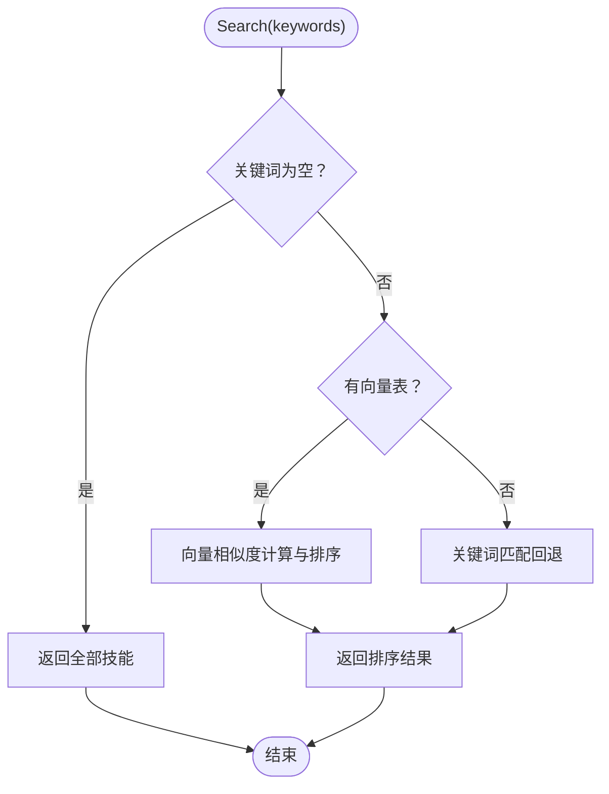
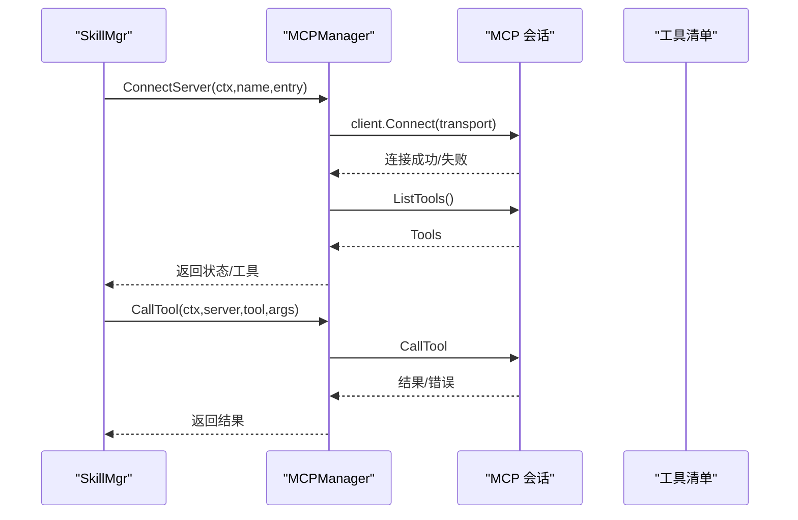
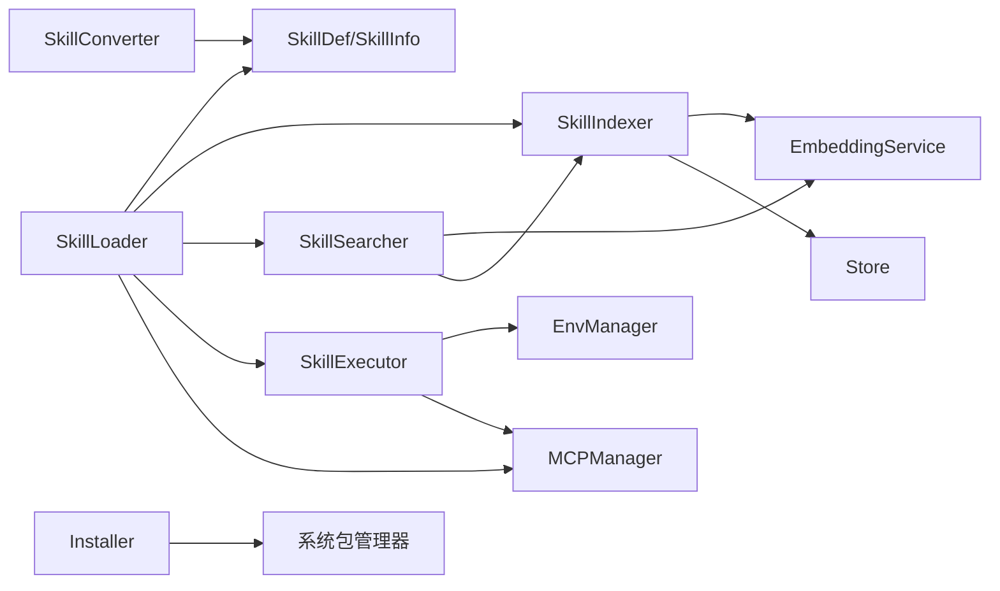

# 技能加载器

<cite>
**本文档引用的文件**
- [loader.go](file://internal/usecase/skills/loader.go)
- [skill_mgr.go](file://internal/usecase/skills/skill_mgr.go)
- [skill.go](file://internal/entity/skill.go)
- [indexer.go](file://internal/usecase/skills/indexer.go)
- [searcher.go](file://internal/usecase/skills/searcher.go)
- [executor.go](file://internal/usecase/skills/executor.go)
- [converter.go](file://internal/usecase/skills/converter.go)
- [skill_installer.go](file://internal/usecase/skills/skill_installer.go)
- [mcp_manager.go](file://internal/usecase/skills/mcp_manager.go)
- [skill_env.go](file://internal/usecase/skills/skill_env.go)
- [skillmgr.go](file://internal/core/skillmgr.go)
- [SKILL.md](file://skills/calculator/SKILL.md)
- [SKILL.md](file://skills/notes/SKILL.md)
</cite>

## 目录
1. [简介](#简介)
2. [项目结构](#项目结构)
3. [核心组件](#核心组件)
4. [架构总览](#架构总览)
5. [详细组件分析](#详细组件分析)
6. [依赖关系分析](#依赖关系分析)
7. [性能考虑](#性能考虑)
8. [故障排查指南](#故障排查指南)
9. [结论](#结论)
10. [附录](#附录)

## 简介
本文件面向 MindX 技能加载器的技术文档，系统性阐述其核心功能与实现原理，涵盖以下方面：
- 技能文件系统的扫描机制与发现流程
- 技能定义的解析过程与数据模型
- 技能信息的缓存策略与状态管理
- CLI 技能、MCP 技能及其他类型技能的加载与执行方式
- 错误处理机制、依赖检查与运行时状态维护
- 与技能管理器其他组件的协作关系及线程安全保障
- 配置选项与性能优化建议

## 项目结构
MindX 技能加载器位于 internal/usecase/skills 目录下，围绕 SkillLoader 为核心，配合 SkillMgr、SkillIndexer、SkillSearcher、SkillExecutor、SkillConverter、Installer、MCPManager、EnvManager 等组件协同工作，形成“发现-解析-索引-检索-执行”的完整闭环。

图表来源
- [loader.go](file://internal/usecase/skills/loader.go#L18-L24)
- [skill_mgr.go](file://internal/usecase/skills/skill_mgr.go#L20-L34)
- [executor.go](file://internal/usecase/skills/executor.go#L19-L28)
- [indexer.go](file://internal/usecase/skills/indexer.go#L32-L51)
- [searcher.go](file://internal/usecase/skills/searcher.go#L15-L22)
- [skill_env.go](file://internal/usecase/skills/skill_env.go#L28-L33)
- [mcp_manager.go](file://internal/usecase/skills/mcp_manager.go#L36-L40)
- [skill.go](file://internal/entity/skill.go#L5-L25)
- [skillmgr.go](file://internal/core/skillmgr.go#L3-L7)

章节来源
- [loader.go](file://internal/usecase/skills/loader.go#L1-L249)
- [skill_mgr.go](file://internal/usecase/skills/skill_mgr.go#L1-L558)

## 核心组件
- SkillLoader：负责扫描 skillsDir 下的技能目录，解析 SKILL.md，构建 core.Skill 与 entity.SkillInfo，并进行依赖检查与状态标记；支持 MCP 技能的动态注册与注销。
- SkillMgr：技能管理器入口，组合 Loader、Executor、Searcher、Indexer、Converter、Installer、EnvManager、MCPManager，负责初始化、同步组件状态、暴露统一 API。
- SkillExecutor：根据技能类型（内部、外部CLI、MCP）执行技能，内置统计与持久化。
- SkillIndexer：异步向量化技能关键词，生成向量索引并持久化，支持队列恢复与后台工作线程。
- SkillSearcher：基于嵌入向量与关键词的混合检索，提供相似度排序与回退策略。
- SkillConverter：将技能文件规范化为标准格式，确保必要字段补齐。
- Installer：封装多种包管理器的安装逻辑。
- MCPManager：管理 MCP 服务器连接、工具发现与调用。
- EnvManager：管理技能级环境变量配置与注入。
- 实体与接口：SkillDef/SkillInfo 描述技能元数据与运行态信息；core.Skill 提供统一的技能接口抽象。

章节来源
- [loader.go](file://internal/usecase/skills/loader.go#L18-L249)
- [skill_mgr.go](file://internal/usecase/skills/skill_mgr.go#L20-L34)
- [executor.go](file://internal/usecase/skills/executor.go#L19-L42)
- [indexer.go](file://internal/usecase/skills/indexer.go#L32-L73)
- [searcher.go](file://internal/usecase/skills/searcher.go#L15-L32)
- [converter.go](file://internal/usecase/skills/converter.go#L16-L29)
- [skill_installer.go](file://internal/usecase/skills/skill_installer.go#L12-L22)
- [mcp_manager.go](file://internal/usecase/skills/mcp_manager.go#L36-L47)
- [skill_env.go](file://internal/usecase/skills/skill_env.go#L28-L42)
- [skill.go](file://internal/entity/skill.go#L5-L83)
- [skillmgr.go](file://internal/core/skillmgr.go#L3-L17)

## 架构总览
技能加载器遵循“分层解耦、职责单一”的设计原则，通过 SkillMgr 统一编排各子系统，实现从文件系统到执行环境的全链路贯通。

图表来源
- [loader.go](file://internal/usecase/skills/loader.go#L35-L123)
- [indexer.go](file://internal/usecase/skills/indexer.go#L188-L253)
- [searcher.go](file://internal/usecase/skills/searcher.go#L42-L62)
- [executor.go](file://internal/usecase/skills/executor.go#L57-L79)
- [mcp_manager.go](file://internal/usecase/skills/mcp_manager.go#L169-L204)

## 详细组件分析

### SkillLoader：文件系统扫描与技能解析
- 扫描机制：遍历 skillsDir 下的子目录，每个目录代表一个技能包；仅处理目录项，忽略文件。
- 解析流程：读取 SKILL.md，校验 YAML Frontmatter 格式，解析为 SkillDef；若未启用则跳过。
- 依赖检查：CheckDependencies 对比系统 PATH 与环境变量，记录缺失项，决定 CanRun 状态。
- 缓存策略：使用互斥锁保护内存映射 skills 与 skillInfos；提供 GetSkills/GetSkillInfos/GetSkill 原子读取。
- MCP 注册：RegisterMCPSkills/UnregisterMCPSkills 支持运行时动态增删 MCP 工具，命名空间前缀避免冲突。
- 线程安全：LoadAll/LD 的主循环内逐个 Load，内部通过 RWMutex 保护读写。

图表来源
- [loader.go](file://internal/usecase/skills/loader.go#L35-L123)

章节来源
- [loader.go](file://internal/usecase/skills/loader.go#L35-L123)
- [loader.go](file://internal/usecase/skills/loader.go#L165-L184)
- [loader.go](file://internal/usecase/skills/loader.go#L186-L204)
- [loader.go](file://internal/usecase/skills/loader.go#L207-L248)

### SkillMgr：统一管理与组件同步
- 初始化：加载环境变量配置、全量加载技能、同步组件（执行器、检索器、转换器、索引器），启动索引工作线程。
- 生命周期：提供 Enable/Disable、InstallDependency、Execute/ExecuteByName/ExecuteFunc、SearchSkills、ReIndex、ConvertSkill/BatchConvert/BatchInstall 等 API。
- MCP 管理：InitMCPServers 并发初始化多个 MCP 服务器，带超时与重试策略；AddMCPServer/RemoveMCPServer/RestartMCPServer 支持运行时变更。
- 线程安全：全局 RWMutex 保护关键路径，组件间通过 Loader 的只读快照进行同步。

图表来源
- [skill_mgr.go](file://internal/usecase/skills/skill_mgr.go#L20-L62)
- [loader.go](file://internal/usecase/skills/loader.go#L18-L24)
- [executor.go](file://internal/usecase/skills/executor.go#L19-L28)
- [searcher.go](file://internal/usecase/skills/searcher.go#L15-L22)
- [indexer.go](file://internal/usecase/skills/indexer.go#L32-L51)
- [converter.go](file://internal/usecase/skills/converter.go#L16-L21)
- [skill_installer.go](file://internal/usecase/skills/skill_installer.go#L12-L15)
- [skill_env.go](file://internal/usecase/skills/skill_env.go#L28-L33)
- [mcp_manager.go](file://internal/usecase/skills/mcp_manager.go#L36-L40)

章节来源
- [skill_mgr.go](file://internal/usecase/skills/skill_mgr.go#L36-L85)
- [skill_mgr.go](file://internal/usecase/skills/skill_mgr.go#L87-L98)
- [skill_mgr.go](file://internal/usecase/skills/skill_mgr.go#L374-L393)
- [skill_mgr.go](file://internal/usecase/skills/skill_mgr.go#L406-L449)
- [skill_mgr.go](file://internal/usecase/skills/skill_mgr.go#L471-L506)
- [skill_mgr.go](file://internal/usecase/skills/skill_mgr.go#L508-L527)
- [skill_mgr.go](file://internal/usecase/skills/skill_mgr.go#L529-L547)

### SkillExecutor：技能执行与统计
- 执行类型：
  - 内部技能：通过 RegisterInternalSkill 注册，直接回调执行。
  - MCP 技能：依据 SkillDef 中的 metadata 标识判断，调用 MCPManager.CallTool。
  - 外部 CLI 技能：解析 Command，注入环境变量，设置超时，执行并处理输出。
- 统计与持久化：UpdateStats 记录成功/失败次数、执行耗时、平均耗时、最近运行时间；可持久化到 Store。
- 参数序列化：将 map[string]any 序列化为 JSON 传入子进程 stdin。

图表来源
- [executor.go](file://internal/usecase/skills/executor.go#L57-L79)
- [executor.go](file://internal/usecase/skills/executor.go#L81-L103)
- [executor.go](file://internal/usecase/skills/executor.go#L105-L136)
- [executor.go](file://internal/usecase/skills/executor.go#L138-L195)
- [executor.go](file://internal/usecase/skills/executor.go#L266-L300)
- [executor.go](file://internal/usecase/skills/executor.go#L302-L322)

章节来源
- [executor.go](file://internal/usecase/skills/executor.go#L57-L195)
- [executor.go](file://internal/usecase/skills/executor.go#L266-L373)

### SkillIndexer：异步向量化与持久化
- 关键词提取：使用 LLM 生成技能关键词，支持多格式响应清洗与过滤。
- 向量生成：对关键词逐一生成嵌入向量，聚合为技能向量表。
- 异步队列：taskQueue + 队列文件持久化，工作线程消费任务，原子计数 pendingCount。
- 持久化：批量写入 Store，键前缀 skill_vector:，支持重启恢复。
- 索引策略：基于哈希值判断是否需要重新索引，避免重复计算。

图表来源
- [indexer.go](file://internal/usecase/skills/indexer.go#L188-L253)
- [indexer.go](file://internal/usecase/skills/indexer.go#L116-L176)
- [indexer.go](file://internal/usecase/skills/indexer.go#L266-L297)
- [indexer.go](file://internal/usecase/skills/indexer.go#L395-L407)
- [indexer.go](file://internal/usecase/skills/indexer.go#L446-L488)

章节来源
- [indexer.go](file://internal/usecase/skills/indexer.go#L188-L253)
- [indexer.go](file://internal/usecase/skills/indexer.go#L343-L393)
- [indexer.go](file://internal/usecase/skills/indexer.go#L446-L516)

### SkillSearcher：向量与关键词混合检索
- 向量检索：将查询关键词转为向量，计算与技能向量的最大余弦相似度，按分数与命中数排序。
- 回退策略：当无嵌入服务或向量为空时，回退到关键词匹配（名称、描述、标签、分类）。
- 性能阈值：相似度低于阈值时返回前 N 个候选，否则返回最高分技能。

图表来源
- [searcher.go](file://internal/usecase/skills/searcher.go#L42-L62)
- [searcher.go](file://internal/usecase/skills/searcher.go#L72-L188)
- [searcher.go](file://internal/usecase/skills/searcher.go#L190-L281)

章节来源
- [searcher.go](file://internal/usecase/skills/searcher.go#L42-L188)
- [searcher.go](file://internal/usecase/skills/searcher.go#L190-L281)

### SkillConverter：技能文件规范化
- 功能：读取 SKILL.md，解析 YAML，补齐默认字段（版本、分类、启用状态），写回文件并更新缓存。
- 批量转换：支持批量处理，记录成功/失败集合。

章节来源
- [converter.go](file://internal/usecase/skills/converter.go#L37-L104)
- [converter.go](file://internal/usecase/skills/converter.go#L106-L120)

### Installer：依赖安装
- 支持包管理器：brew、apt、yum/dnf、npm、pip/pip3、snap、choco。
- 行为：根据 InstallMethod.Kind 选择命令，继承标准输出/错误流，记录日志。

章节来源
- [skill_installer.go](file://internal/usecase/skills/skill_installer.go#L24-L66)

### MCPManager：MCP 服务器管理
- 连接方式：支持 SSE 与 stdio 两种传输；SSE 支持自定义 headers 注入；stdio 继承并覆盖环境变量。
- 工具发现：连接后调用 ListTools 获取工具清单。
- 调用流程：CallTool 根据 server/tool 元数据调用工具，错误时更新状态。
- 并发与重试：SkillMgr.InitMCPServers 并发初始化，带超时与不可重试错误判定。

图表来源
- [mcp_manager.go](file://internal/usecase/skills/mcp_manager.go#L50-L141)
- [mcp_manager.go](file://internal/usecase/skills/mcp_manager.go#L169-L204)
- [skill_mgr.go](file://internal/usecase/skills/skill_mgr.go#L374-L393)
- [skill_mgr.go](file://internal/usecase/skills/skill_mgr.go#L406-L449)

章节来源
- [mcp_manager.go](file://internal/usecase/skills/mcp_manager.go#L50-L141)
- [mcp_manager.go](file://internal/usecase/skills/mcp_manager.go#L169-L204)
- [mcp_manager.go](file://internal/usecase/skills/mcp_manager.go#L238-L278)

### EnvManager：技能环境变量管理
- 加载：从 workspaceDir/skills.yml 读取技能级环境变量配置。
- 注入：PrepareExecutionEnv 继承当前进程环境，叠加技能前缀变量（SKILL_{技能名_变量名}）。
- 持久化：SetSkillEnv 更新配置并写回文件。

章节来源
- [skill_env.go](file://internal/usecase/skills/skill_env.go#L44-L68)
- [skill_env.go](file://internal/usecase/skills/skill_env.go#L100-L120)
- [skill_env.go](file://internal/usecase/skills/skill_env.go#L122-L135)
- [skill_env.go](file://internal/usecase/skills/skill_env.go#L137-L150)

### 数据模型与接口
- SkillDef：技能定义，包含名称、描述、版本、分类、标签、OS、启用状态、超时、命令、参数、依赖、安装方法、主页、元数据、输出格式、指导、是否内部等。
- SkillInfo：技能运行态信息，包含 Def、Directory、Content、CanRun、MissingBins/MissingEnv、Format、Status、向量、统计信息等。
- core.Skill：核心技能接口，提供 GetName、Execute、ExecuteFunc。

章节来源
- [skill.go](file://internal/entity/skill.go#L5-L83)
- [skillmgr.go](file://internal/core/skillmgr.go#L3-L17)

## 依赖关系分析
- 组件耦合：
  - SkillMgr 对各子系统强依赖，但通过只读快照与互斥锁降低耦合风险。
  - SkillLoader 与 SkillIndexer 通过 taskQueue 松耦合，Indexer 异步处理。
  - SkillExecutor 与 EnvManager、MCPManager 弱耦合，通过接口与元数据交互。
- 外部依赖：
  - YAML 解析（gopkg.in/yaml.v3/v2）
  - OS 命令执行与环境变量
  - LLM 嵌入服务与存储接口（Store）

图表来源
- [loader.go](file://internal/usecase/skills/loader.go#L18-L24)
- [indexer.go](file://internal/usecase/skills/indexer.go#L32-L51)
- [searcher.go](file://internal/usecase/skills/searcher.go#L15-L22)
- [executor.go](file://internal/usecase/skills/executor.go#L19-L28)
- [converter.go](file://internal/usecase/skills/converter.go#L16-L21)
- [skill_installer.go](file://internal/usecase/skills/skill_installer.go#L12-L15)

章节来源
- [loader.go](file://internal/usecase/skills/loader.go#L18-L24)
- [indexer.go](file://internal/usecase/skills/indexer.go#L32-L51)
- [searcher.go](file://internal/usecase/skills/searcher.go#L15-L22)
- [executor.go](file://internal/usecase/skills/executor.go#L19-L28)
- [converter.go](file://internal/usecase/skills/converter.go#L16-L21)
- [skill_installer.go](file://internal/usecase/skills/skill_installer.go#L12-L15)

## 性能考虑
- 异步索引：Indexer 使用工作线程与队列，避免阻塞主线程；支持队列文件持久化，重启后恢复。
- 向量复用：基于哈希判断是否需要重新索引，减少重复计算。
- 检索降级：无嵌入服务或向量为空时自动回退关键词匹配，保证可用性。
- 执行超时：外部 CLI 与 MCP 调用均设置超时，防止长时间阻塞。
- 统计采样：执行耗时最多保留固定窗口，避免内存膨胀。
- 并发初始化：MCP 服务器并发连接，缩短启动时间。

## 故障排查指南
- 技能未加载：
  - 检查 SKILL.md 是否存在 YAML Frontmatter，确认 enabled 字段。
  - 查看依赖检查结果（缺失二进制/环境变量）。
- 依赖安装失败：
  - 确认 InstallMethod.Kind 与系统包管理器匹配。
  - 检查网络与权限（sudo、管理员权限）。
- MCP 连接问题：
  - stdio：检查命令与参数、工作目录、环境变量继承与覆盖。
  - SSE：检查 URL、headers 注入、认证头是否正确。
  - 观察重试日志：区分可重试（超时/连接拒绝）与不可重试（协议错误/进程崩溃）。
- 执行失败：
  - 外部 CLI：查看子进程输出（JSON 优先），确认命令格式与参数序列化。
  - MCP：检查工具名与参数结构，关注返回的错误内容。
- 索引异常：
  - 关注队列文件写入与恢复日志，确认队列大小与 pendingCount。
  - 检查嵌入服务可用性与 LLM 接口响应格式。

章节来源
- [loader.go](file://internal/usecase/skills/loader.go#L60-L123)
- [loader.go](file://internal/usecase/skills/loader.go#L186-L204)
- [skill_installer.go](file://internal/usecase/skills/skill_installer.go#L24-L66)
- [mcp_manager.go](file://internal/usecase/skills/mcp_manager.go#L50-L141)
- [mcp_manager.go](file://internal/usecase/skills/mcp_manager.go#L169-L204)
- [executor.go](file://internal/usecase/skills/executor.go#L138-L195)
- [indexer.go](file://internal/usecase/skills/indexer.go#L446-L516)

## 结论
MindX 技能加载器通过清晰的分层设计与完善的错误处理机制，实现了从文件系统到执行环境的全链路自动化。其异步索引、混合检索与运行时 MCP 管理能力，显著提升了技能发现与使用的效率与灵活性。建议在生产环境中结合队列监控、超时配置与日志审计，持续优化性能与稳定性。

## 附录
- 技能文件示例参考：
  - [SKILL.md](file://skills/calculator/SKILL.md#L1-L37)
  - [SKILL.md](file://skills/notes/SKILL.md#L1-L46)