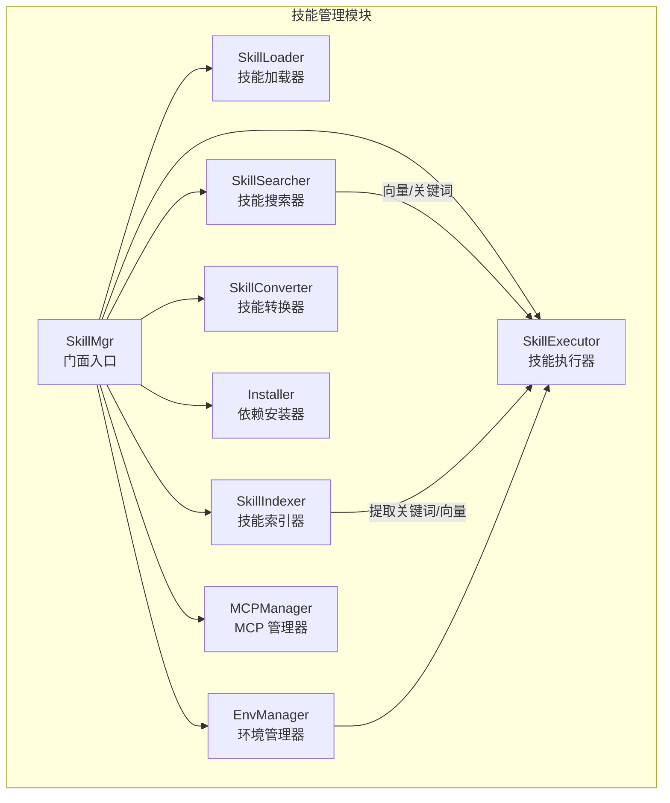
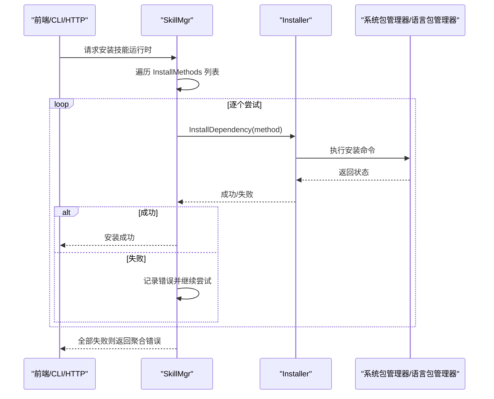
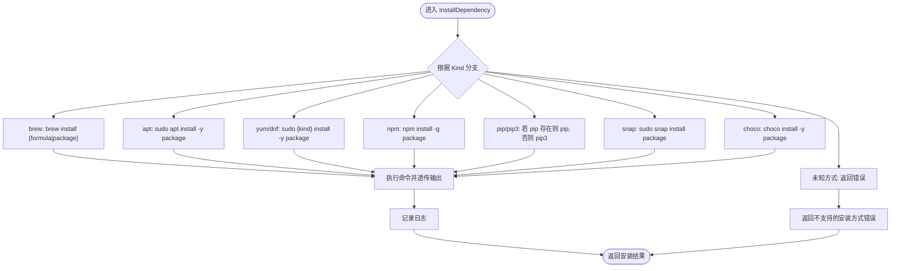
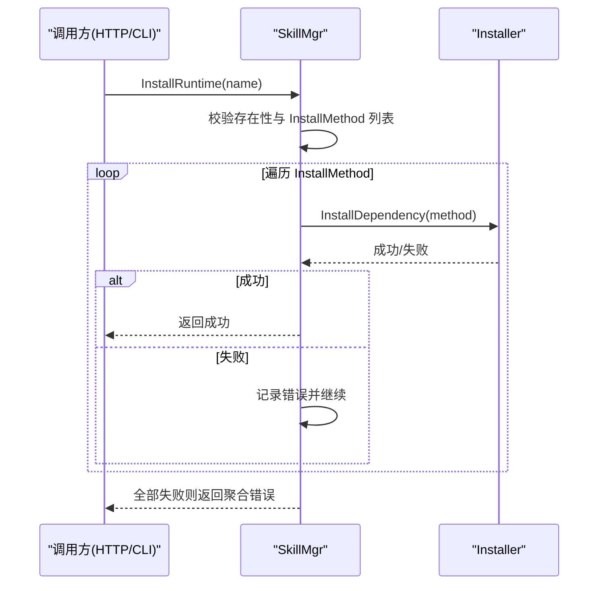
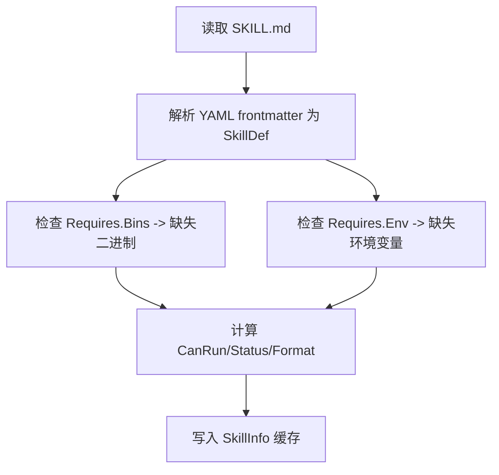
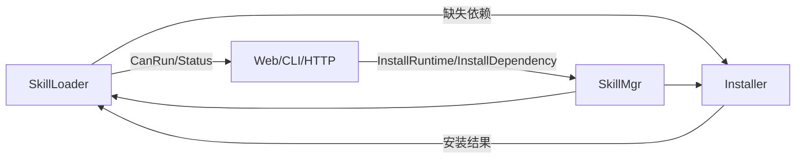

# 技能安装器

<cite>
**本文引用的文件**
- [internal/usecase/skills/skill_installer.go](file://internal/usecase/skills/skill_installer.go)
- [internal/usecase/skills/skill_mgr.go](file://internal/usecase/skills/skill_mgr.go)
- [internal/entity/skill.go](file://internal/entity/skill.go)
- [internal/usecase/skills/loader.go](file://internal/usecase/skills/loader.go)
- [internal/usecase/skills/converter.go](file://internal/usecase/skills/converter.go)
- [internal/adapters/http/handlers/skills.go](file://internal/adapters/http/handlers/skills.go)
- [internal/adapters/cli/skill.go](file://internal/adapters/cli/skill.go)
- [dashboard/src/components/Skills.tsx](file://dashboard/src/components/Skills.tsx)
- [internal/usecase/skills/README.md](file://internal/usecase/skills/README.md)
- [INSTALL.md](file://INSTALL.md)
- [README.md](file://README.md)
</cite>

## 目录
1. [简介](#简介)
2. [项目结构](#项目结构)
3. [核心组件](#核心组件)
4. [架构总览](#架构总览)
5. [详细组件分析](#详细组件分析)
6. [依赖关系分析](#依赖关系分析)
7. [性能考量](#性能考量)
8. [故障排除指南](#故障排除指南)
9. [结论](#结论)
10. [附录](#附录)

## 简介
本文件面向 MindX 技能安装器，系统性阐述其安装机制与实现原理，覆盖依赖检查、环境准备、安装执行全流程；详解多安装方式（系统包管理器、Python pip、Node.js npm 等）的适配策略；说明依赖解析、冲突检测与版本管理机制；解释安装过程中的错误处理与回滚策略；阐明与技能管理器其他组件的协作关系；对比批量安装与单个安装的差异；并提供配置选项、安装策略与故障排除指南。

## 项目结构
技能安装器位于技能管理模块内部，围绕 Facade 模式组织，Installer 作为“依赖安装器”组件，由 SkillMgr 统一调度，配合 Loader、Executor、Searcher、Indexer、Converter、EnvMgr、MCPManager 等组件协同工作。

图表来源
- [internal/usecase/skills/README.md](file://internal/usecase/skills/README.md#L11-L46)

章节来源
- [internal/usecase/skills/README.md](file://internal/usecase/skills/README.md#L1-L168)

## 核心组件
- Installer：封装具体安装方法，负责调用系统包管理器或语言包管理器执行安装。
- SkillMgr：统一入口，协调各子组件；提供 InstallRuntime、InstallDependency、BatchInstall 等对外接口。
- SkillLoader：加载 SKILL.md，解析 SkillDef，检查缺失依赖（二进制与环境变量）。
- SkillConverter：标准化技能元数据格式，便于统一管理与展示。
- HTTP/CLI/Web：对外暴露安装与查询接口，驱动 SkillMgr 执行安装。

章节来源
- [internal/usecase/skills/skill_installer.go](file://internal/usecase/skills/skill_installer.go#L12-L22)
- [internal/usecase/skills/skill_mgr.go](file://internal/usecase/skills/skill_mgr.go#L20-L62)
- [internal/usecase/skills/loader.go](file://internal/usecase/skills/loader.go#L18-L33)
- [internal/usecase/skills/converter.go](file://internal/usecase/skills/converter.go#L16-L29)

## 架构总览
技能安装器在 SkillMgr 的统一调度下，按顺序尝试多种安装方法，任一成功即终止；若全部失败则返回聚合错误。安装前由 Loader 检查缺失依赖，Web/CLI/HTTP 层发起安装请求，Installer 负责具体执行。

图表来源
- [internal/usecase/skills/skill_mgr.go](file://internal/usecase/skills/skill_mgr.go#L290-L324)
- [internal/usecase/skills/skill_installer.go](file://internal/usecase/skills/skill_installer.go#L25-L66)

章节来源
- [internal/usecase/skills/skill_mgr.go](file://internal/usecase/skills/skill_mgr.go#L290-L324)
- [internal/usecase/skills/skill_installer.go](file://internal/usecase/skills/skill_installer.go#L25-L66)

## 详细组件分析

### Installer：安装器
- 职责：根据 InstallMethod.Kind 选择对应安装方式，构造命令并执行；将输出透传至标准输出/错误。
- 支持的安装方式：
  - brew/apt/yum/dnf/snap/choco：系统包管理器安装。
  - npm：全局安装 Node.js 包。
  - pip/pip3：优先使用 pip，不存在则回退 pip3。
  - brew 支持 Formula 字段（Homebrew formula）。
- 错误处理：捕获命令执行错误并包装为可追踪的错误；记录安装开始与完成日志。
- 输出与日志：安装过程输出直接透传到标准输出/错误，便于用户观察进度与问题。

图表来源
- [internal/usecase/skills/skill_installer.go](file://internal/usecase/skills/skill_installer.go#L25-L66)

章节来源
- [internal/usecase/skills/skill_installer.go](file://internal/usecase/skills/skill_installer.go#L25-L66)

### SkillMgr：技能管理器（安装入口）
- InstallRuntime：按顺序尝试 InstallMethod 列表，任一成功即返回；全部失败则返回聚合错误。
- InstallDependency：委托 Installer 执行具体安装。
- BatchInstall：遍历技能名列表，逐个调用 InstallRuntime，并汇总成功/失败集合。
- GetMissingDependencies：返回 Loader 计算的缺失二进制与环境变量列表，供前端展示与引导安装。

图表来源
- [internal/usecase/skills/skill_mgr.go](file://internal/usecase/skills/skill_mgr.go#L290-L324)
- [internal/usecase/skills/skill_mgr.go](file://internal/usecase/skills/skill_mgr.go#L332-L346)

章节来源
- [internal/usecase/skills/skill_mgr.go](file://internal/usecase/skills/skill_mgr.go#L290-L324)
- [internal/usecase/skills/skill_mgr.go](file://internal/usecase/skills/skill_mgr.go#L332-L346)

### SkillLoader：依赖检查与状态计算
- 作用：读取 SKILL.md，解析 YAML frontmatter 为 SkillDef；检查缺失的二进制与环境变量；计算 CanRun、Status、Format 等状态字段。
- 依赖检查：通过 exec.LookPath 检查二进制是否存在；通过 os.Getenv 检查环境变量是否设置。
- 输出：MissingBins、MissingEnv 供上层安装器与前端展示。

图表来源
- [internal/usecase/skills/loader.go](file://internal/usecase/skills/loader.go#L60-L123)
- [internal/usecase/skills/loader.go](file://internal/usecase/skills/loader.go#L186-L200)

章节来源
- [internal/usecase/skills/loader.go](file://internal/usecase/skills/loader.go#L60-L123)
- [internal/usecase/skills/loader.go](file://internal/usecase/skills/loader.go#L186-L200)

### 数据模型：InstallMethod 与 SkillDef
- InstallMethod：描述一种安装方法，包含 id、kind、package/formula、bins、label、os 等字段。
- SkillDef：技能定义，包含 install 数组（安装方法列表）、requires（缺失依赖声明）等。

章节来源
- [internal/entity/skill.go](file://internal/entity/skill.go#L33-L42)
- [internal/entity/skill.go](file://internal/entity/skill.go#L5-L25)

### 与前端/CLI/HTTP 的集成
- Web/Dashboard：Skills.tsx 在用户点击安装时，若存在缺失依赖，则调用 /api/skills/:name/install 触发安装。
- HTTP Handler：SkillsHandler.installRuntime 接收安装请求，调用 SkillMgr.InstallRuntime 并返回结果。
- CLI：mindx skill 命令族通过 createSkillManager 创建 SkillMgr 实例，支持列出、运行、验证、启用/禁用、重载等操作。

章节来源
- [dashboard/src/components/Skills.tsx](file://dashboard/src/components/Skills.tsx#L91-L112)
- [internal/adapters/http/handlers/skills.go](file://internal/adapters/http/handlers/skills.go#L171-L194)
- [internal/adapters/cli/skill.go](file://internal/adapters/cli/skill.go#L255-L300)

## 依赖关系分析
- 组件耦合：
  - SkillMgr 依赖 Installer、Loader、Executor、Searcher、Indexer、Converter、EnvMgr、MCPManager。
  - Installer 仅依赖实体模型与系统命令执行，内聚性高、耦合度低。
- 依赖链：
  - Loader 产出缺失依赖信息给上层（Installer/前端）。
  - Installer 执行安装，影响 Loader 计算的 CanRun 状态。
  - HTTP/CLI/Web 作为入口，最终调用 SkillMgr 的安装接口。

图表来源
- [internal/usecase/skills/loader.go](file://internal/usecase/skills/loader.go#L76-L77)
- [internal/usecase/skills/skill_mgr.go](file://internal/usecase/skills/skill_mgr.go#L290-L324)
- [internal/usecase/skills/skill_installer.go](file://internal/usecase/skills/skill_installer.go#L25-L66)

章节来源
- [internal/usecase/skills/loader.go](file://internal/usecase/skills/loader.go#L76-L77)
- [internal/usecase/skills/skill_mgr.go](file://internal/usecase/skills/skill_mgr.go#L290-L324)
- [internal/usecase/skills/skill_installer.go](file://internal/usecase/skills/skill_installer.go#L25-L66)

## 性能考量
- 安装策略：
  - 多方法并列尝试：优先选择最合适的安装方式，一旦成功立即停止，避免重复安装。
  - 批量安装：串行逐个安装，便于定位失败原因；若需并行可考虑在上层引入并发控制。
- I/O 与日志：
  - 安装过程输出透传至标准输出/错误，利于实时反馈；建议在后台任务中收集日志以便回溯。
- 资源占用：
  - 系统包管理器与语言包管理器的安装通常为 I/O 密集型，注意避免在同一时间大量并发安装导致系统负载过高。

[本节为通用性能讨论，不直接分析具体文件]

## 故障排除指南
- 常见问题与定位思路
  - 安装方式不受支持：检查 InstallMethod.Kind 是否为受支持的值（brew、apt、yum、dnf、npm、pip、pip3、snap、choco）。
  - 权限不足：系统包管理器安装需管理员权限；确认 sudo 可用或以管理员身份运行。
  - pip/pip3 不存在：Installer 会尝试回退到 pip3，若仍失败，需安装 Python 包管理器。
  - Homebrew formula：当使用 brew 时，若存在 Formula 字段优先使用；否则使用 Package 字段。
  - 网络/镜像问题：npm/pip 安装可能受网络影响，建议配置国内镜像源或代理。
  - 安装失败但部分组件已生效：Installer 不提供回滚，建议记录安装前状态并在失败时提示用户手动清理。
- 前端/CLI/HTTP 使用建议
  - Web/Dashboard：在点击安装前，先通过 /api/skills/:name/dependencies 获取缺失依赖列表，再发起安装请求。
  - CLI：使用 mindx skill list 查看技能状态与缺失依赖；mindx skill validate 检查技能启用与可运行状态。
  - HTTP：调用 /api/skills/:name/install 触发安装；若失败，查看响应中的错误信息与日志。

章节来源
- [internal/usecase/skills/skill_installer.go](file://internal/usecase/skills/skill_installer.go#L42-L46)
- [internal/adapters/http/handlers/skills.go](file://internal/adapters/http/handlers/skills.go#L171-L194)
- [internal/adapters/cli/skill.go](file://internal/adapters/cli/skill.go#L255-L300)
- [INSTALL.md](file://INSTALL.md#L360-L436)

## 结论
技能安装器通过 Installer 组件与 SkillMgr 的统一调度，实现了对多安装方式的兼容与容错；结合 Loader 的依赖检查与前端/CLI/HTTP 的入口，形成完整的“发现—安装—验证—执行”闭环。建议在生产环境中配合日志收集与失败重试策略，进一步提升安装成功率与用户体验。

[本节为总结性内容，不直接分析具体文件]

## 附录

### 安装策略与配置选项
- 安装策略
  - 多方法并列尝试：按 InstallMethod 列表顺序依次尝试，成功即停。
  - 批量安装：逐个技能安装，汇总成功/失败。
- 配置与环境
  - Ollama 本地模型服务：MindX 依赖 Ollama 进行推理与向量计算，安装前需确保服务可用。
  - 工作目录与安装目录：通过环境变量或安装脚本配置，确保权限与路径正确。

章节来源
- [internal/usecase/skills/skill_mgr.go](file://internal/usecase/skills/skill_mgr.go#L332-L346)
- [README.md](file://README.md#L72-L91)
- [INSTALL.md](file://INSTALL.md#L308-L325)

### 示例与最佳实践
- 单个安装示例
  - 通过 Web/Dashboard 点击“安装依赖”，系统根据缺失依赖列表调用 /api/skills/:name/install。
  - 通过 CLI 使用 mindx skill list 查看缺失依赖，再使用 mindx skill run 执行技能。
- 批量安装示例
  - 通过 HTTP 批量安装：POST /api/skills/batch-install，传入技能名数组。
  - 通过 CLI：循环调用 mindx skill enable/disable/list 等命令组合实现批量效果。
- 最佳实践
  - 安装前先执行依赖检查，减少失败概率。
  - 对于网络受限环境，提前配置 npm/pip 镜像源。
  - 记录安装日志，便于问题定位与审计。

章节来源
- [dashboard/src/components/Skills.tsx](file://dashboard/src/components/Skills.tsx#L91-L112)
- [internal/adapters/http/handlers/skills.go](file://internal/adapters/http/handlers/skills.go#L431-L449)
- [internal/adapters/cli/skill.go](file://internal/adapters/cli/skill.go#L255-L300)