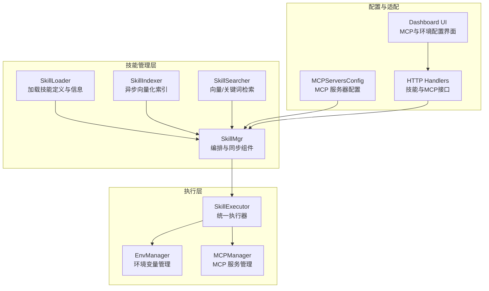
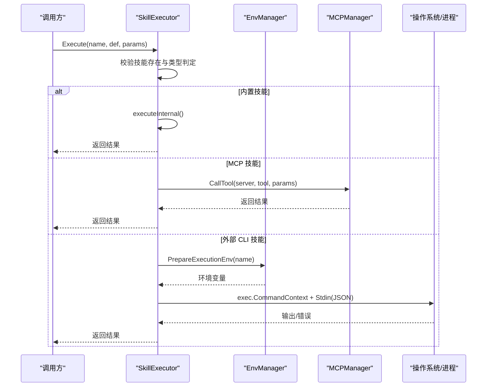
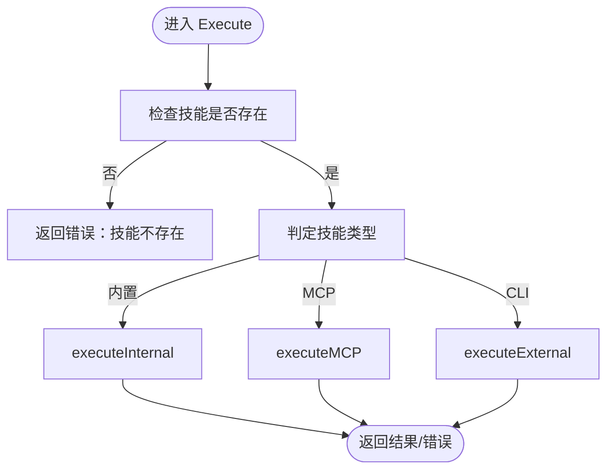
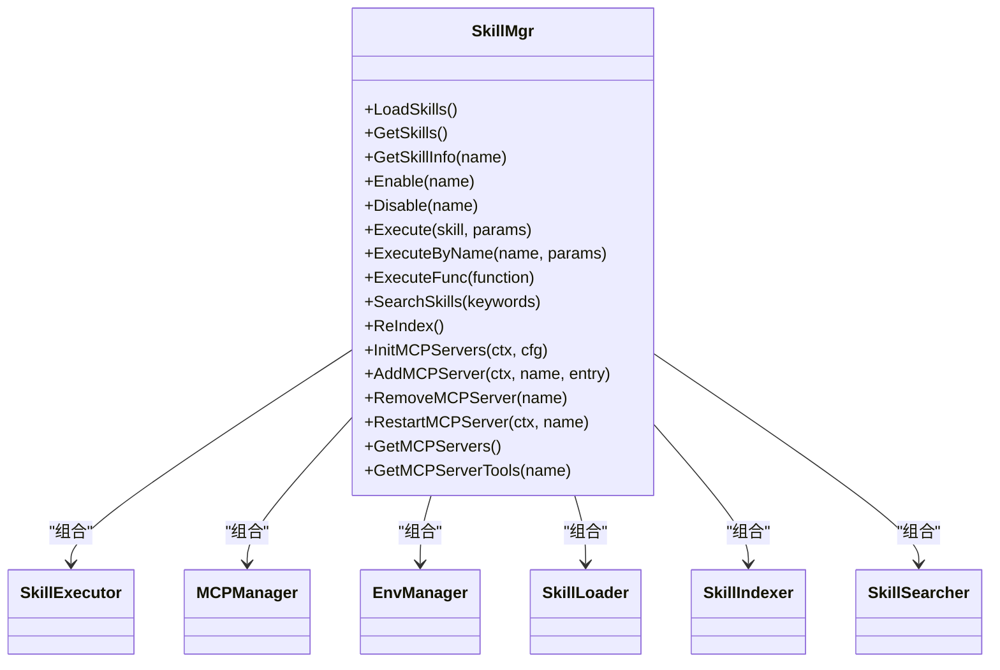
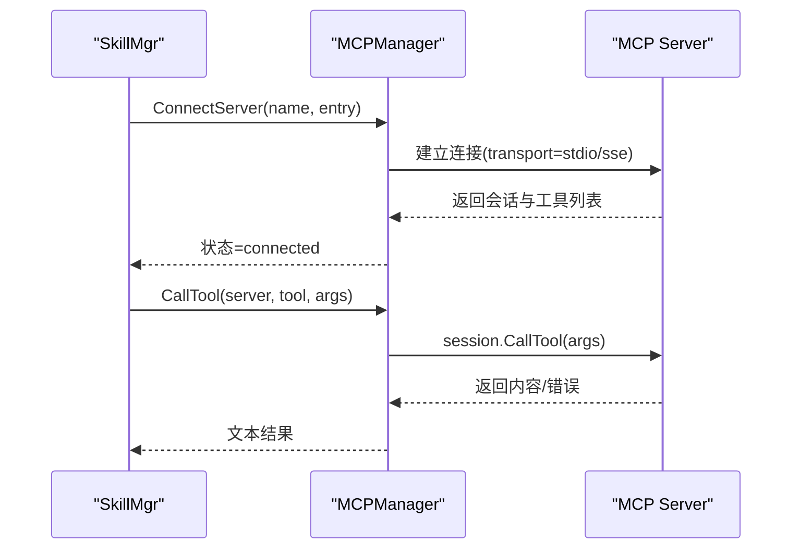
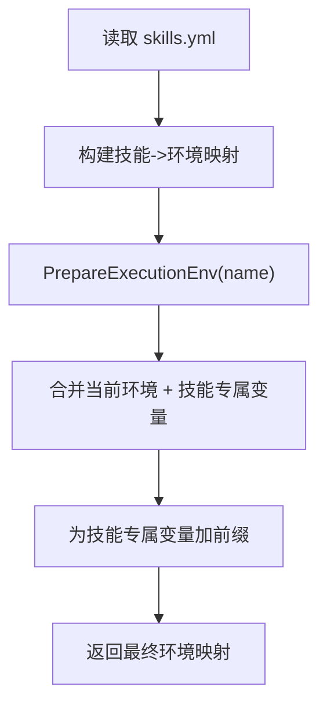
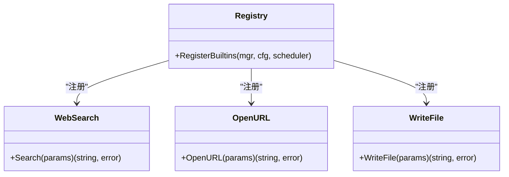
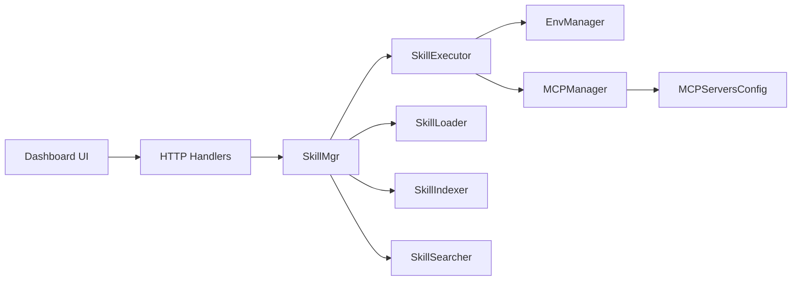

# 技能执行器

<cite>
**本文引用的文件**
- [executor.go](file://internal/usecase/skills/executor.go)
- [skill_mgr.go](file://internal/usecase/skills/skill_mgr.go)
- [mcp_manager.go](file://internal/usecase/skills/mcp_manager.go)
- [mcp_utils.go](file://internal/usecase/skills/mcp_utils.go)
- [skill_env.go](file://internal/usecase/skills/skill_env.go)
- [loader.go](file://internal/usecase/skills/loader.go)
- [searcher.go](file://internal/usecase/skills/searcher.go)
- [indexer.go](file://internal/usecase/skills/indexer.go)
- [mcp.go](file://internal/config/mcp.go)
- [registry.go](file://internal/usecase/skills/builtins/registry.go)
- [web_search.go](file://internal/usecase/skills/builtins/web_search.go)
- [open_url.go](file://internal/usecase/skills/builtins/open_url.go)
- [write_file.go](file://internal/usecase/skills/builtins/write_file.go)
- [skills.go](file://internal/adapters/http/handlers/skills.go)
- [mcp.go](file://internal/adapters/http/handlers/mcp.go)
- [MCPServers.tsx](file://dashboard/src/components/MCPServers.tsx)
- [SkillEnvDialog.tsx](file://dashboard/src/components/skills/SkillEnvDialog.tsx)
- [CatalogGrid.tsx](file://dashboard/src/components/mcp/CatalogGrid.tsx)
- [skill.go](file://internal/entity/skill.go)
</cite>

## 目录
1. [简介](#简介)
2. [项目结构](#项目结构)
3. [核心组件](#核心组件)
4. [架构总览](#架构总览)
5. [详细组件分析](#详细组件分析)
6. [依赖关系分析](#依赖关系分析)
7. [性能考量](#性能考量)
8. [故障排查指南](#故障排查指南)
9. [结论](#结论)
10. [附录](#附录)

## 简介
本文件面向 MindX 技能执行器，系统性阐述其核心架构与执行机制，涵盖技能调用的路由逻辑、参数传递与结果处理；详解 CLI 技能、MCP 技能与内置技能的执行流程；说明环境管理、资源控制与错误处理；解释与环境管理器、MCP 管理器的协作关系及异步处理实现；并提供配置选项、性能监控与调试技巧。

## 项目结构
MindX 技能体系由“加载-索引-搜索-执行”四层构成，技能执行器位于执行层，负责统一调度不同类型的技能执行，并与环境管理器、MCP 管理器、存储层协同工作。

图表来源
- [skill_mgr.go](file://internal/usecase/skills/skill_mgr.go#L36-L84)
- [executor.go](file://internal/usecase/skills/executor.go#L19-L42)
- [mcp_manager.go](file://internal/usecase/skills/mcp_manager.go#L36-L47)
- [mcp.go](file://internal/config/mcp.go#L13-L29)
- [mcp.go](file://internal/adapters/http/handlers/mcp.go#L13-L23)

章节来源
- [skill_mgr.go](file://internal/usecase/skills/skill_mgr.go#L36-L84)
- [executor.go](file://internal/usecase/skills/executor.go#L19-L42)

## 核心组件
- 技能执行器（SkillExecutor）：统一调度内部技能、CLI 技能与 MCP 技能，负责参数序列化、超时控制、环境注入、统计上报与错误处理。
- 技能管理器（SkillMgr）：装配加载器、索引器、搜索器、转换器、安装器、环境管理器与 MCP 管理器，协调组件同步与生命周期。
- MCP 管理器（MCPManager）：维护 MCP 服务器连接状态、工具发现与调用，支持 stdio 与 SSE 两种传输方式。
- 环境管理器（EnvManager）：加载/保存技能专属环境变量，按技能名注入前缀化的环境键值。
- 加载器（SkillLoader）：解析 SKILL.md，提取技能定义与依赖检查，构建技能信息。
- 搜索器（SkillSearcher）：基于嵌入向量与关键词进行技能检索。
- 索引器（SkillIndexer）：异步生成技能关键词向量并持久化，支持后台重建索引与队列落盘。

章节来源
- [executor.go](file://internal/usecase/skills/executor.go#L19-L42)
- [skill_mgr.go](file://internal/usecase/skills/skill_mgr.go#L20-L34)
- [mcp_manager.go](file://internal/usecase/skills/mcp_manager.go#L36-L47)
- [skill_env.go](file://internal/usecase/skills/skill_env.go#L28-L42)
- [loader.go](file://internal/usecase/skills/loader.go#L18-L33)
- [searcher.go](file://internal/usecase/skills/searcher.go#L15-L32)
- [indexer.go](file://internal/usecase/skills/indexer.go#L32-L51)

## 架构总览
技能执行器采用策略模式，依据技能定义中的元数据与类型，分派至对应执行路径：内置函数、MCP 工具或外部 CLI 命令。执行前统一进行超时上下文、环境变量注入与参数序列化；执行后更新统计并持久化。

图表来源
- [executor.go](file://internal/usecase/skills/executor.go#L57-L79)
- [executor.go](file://internal/usecase/skills/executor.go#L81-L103)
- [executor.go](file://internal/usecase/skills/executor.go#L105-L136)
- [executor.go](file://internal/usecase/skills/executor.go#L138-L195)
- [mcp_manager.go](file://internal/usecase/skills/mcp_manager.go#L169-L204)
- [skill_env.go](file://internal/usecase/skills/skill_env.go#L100-L120)

## 详细组件分析

### 技能执行器（SkillExecutor）
- 职责
  - 统一入口 Execute：校验技能存在、记录日志、按类型分派。
  - 内置技能 executeInternal：从注册表取函数指针执行，统计成功/失败与耗时。
  - MCP 技能 executeMCP：解析元数据，构造超时上下文，调用 MCPManager 的 CallTool。
  - 外部 CLI 技能 executeExternal：构建命令、设置超时、注入环境变量、序列化参数到 stdin、收集输出。
  - 辅助功能：命令解析、统计更新与持久化、批量加载统计。
- 关键点
  - 超时控制：默认 30 秒，若定义中指定 Timeout 则按秒数覆盖。
  - 环境注入：EnvManager.PrepareExecutionEnv 生成环境映射，CLI 执行时合并到进程环境。
  - 参数传递：以 JSON 形式写入子进程 stdin，便于脚本/程序读取。
  - 结果处理：若 CLI 退出码非 0 但输出为合法 JSON，则视为成功返回。
  - 统计维度：成功/失败计数、最近 N 次耗时、平均耗时、最后运行时间，持久化到 Store。

图表来源
- [executor.go](file://internal/usecase/skills/executor.go#L57-L79)
- [executor.go](file://internal/usecase/skills/executor.go#L81-L103)
- [executor.go](file://internal/usecase/skills/executor.go#L105-L136)
- [executor.go](file://internal/usecase/skills/executor.go#L138-L195)

章节来源
- [executor.go](file://internal/usecase/skills/executor.go#L57-L195)
- [executor.go](file://internal/usecase/skills/executor.go#L266-L373)

### 技能管理器（SkillMgr）
- 职责
  - 组装各子系统：加载器、索引器、搜索器、转换器、安装器、环境管理器、MCP 管理器。
  - 同步组件：将加载器的技能与向量索引同步到执行器与搜索器。
  - 生命周期：启动索引工作线程、关闭时清理索引与 MCP 连接。
  - MCP 初始化：并发初始化配置的服务器，带超时与可重试策略。
  - 执行代理：提供 ExecuteByName 与 ExecuteFunc 便捷入口。
- 异步处理
  - 索引器使用 goroutine 与通道队列异步处理任务，支持队列落盘与后台重建。
  - MCP 初始化并发连接，每个服务器独立超时与重试。

图表来源
- [skill_mgr.go](file://internal/usecase/skills/skill_mgr.go#L20-L34)
- [executor.go](file://internal/usecase/skills/executor.go#L19-L42)
- [mcp_manager.go](file://internal/usecase/skills/mcp_manager.go#L36-L47)
- [skill_env.go](file://internal/usecase/skills/skill_env.go#L28-L42)
- [loader.go](file://internal/usecase/skills/loader.go#L18-L33)
- [indexer.go](file://internal/usecase/skills/indexer.go#L32-L51)
- [searcher.go](file://internal/usecase/skills/searcher.go#L15-L32)

章节来源
- [skill_mgr.go](file://internal/usecase/skills/skill_mgr.go#L36-L84)
- [skill_mgr.go](file://internal/usecase/skills/skill_mgr.go#L373-L449)
- [indexer.go](file://internal/usecase/skills/indexer.go#L75-L114)

### MCP 管理器（MCPManager）
- 功能
  - 连接与状态管理：支持 stdio 与 SSE 两种传输，维护连接状态、工具列表与错误信息。
  - 工具调用：封装客户端会话，调用指定工具并返回文本内容。
  - 服务器生命周期：支持添加、移除、重启与状态查询。
- 错误与重连
  - 对连接超时、网络拒绝等可重试错误进行有限次重试。
  - 对协议错误、进程崩溃等不可重试错误直接放弃。

图表来源
- [mcp_manager.go](file://internal/usecase/skills/mcp_manager.go#L49-L167)
- [mcp_manager.go](file://internal/usecase/skills/mcp_manager.go#L169-L204)

章节来源
- [mcp_manager.go](file://internal/usecase/skills/mcp_manager.go#L17-L204)

### 环境管理器（EnvManager）
- 功能
  - 读取/保存 skills.yml，按技能名维护环境变量映射。
  - 运行时注入：PrepareExecutionEnv 将当前环境复制，叠加技能专属变量，生成前缀化键名。
  - 支持设置/获取技能环境变量并持久化。
- 注入规则
  - 技能专属变量键名格式为 SKILL_<UPPER_SKILLNAME>_<UPPER_ENVKEY>，避免冲突。

图表来源
- [skill_env.go](file://internal/usecase/skills/skill_env.go#L44-L68)
- [skill_env.go](file://internal/usecase/skills/skill_env.go#L100-L120)

章节来源
- [skill_env.go](file://internal/usecase/skills/skill_env.go#L14-L150)

### 内置技能注册与实现
- 注册
  - 通过 RegisterBuiltins 将内置技能注册到 SkillMgr，形成统一的执行入口。
- 实现
  - web_search：基于浏览器搜索，返回结构化 JSON。
  - open_url：打开网页并抽取标题，返回结构化 JSON。
  - write_file：写入文件到工作区 documents 目录，返回结构化 JSON。
  - cron：可选注册，基于定时调度器提供周期性技能。

图表来源
- [registry.go](file://internal/usecase/skills/builtins/registry.go#L15-L29)
- [web_search.go](file://internal/usecase/skills/builtins/web_search.go#L10-L35)
- [open_url.go](file://internal/usecase/skills/builtins/open_url.go#L11-L37)
- [write_file.go](file://internal/usecase/skills/builtins/write_file.go#L11-L52)

章节来源
- [registry.go](file://internal/usecase/skills/builtins/registry.go#L15-L29)
- [web_search.go](file://internal/usecase/skills/builtins/web_search.go#L10-L35)
- [open_url.go](file://internal/usecase/skills/builtins/open_url.go#L11-L37)
- [write_file.go](file://internal/usecase/skills/builtins/write_file.go#L11-L52)

### 技能加载与索引
- 加载（SkillLoader）
  - 读取 SKILL.md，解析 YAML Frontmatter 为 SkillDef。
  - 检查依赖（二进制与环境变量），计算 CanRun 状态。
  - 构造 SkillInfo，包含统计字段与状态。
- 索引（SkillIndexer）
  - 异步工作线程消费任务队列，提取关键词并生成向量。
  - 使用 LLM 服务辅助抽取关键词，结合标签增强。
  - 持久化向量与哈希，支持后台重建与队列落盘。
- 搜索（SkillSearcher）
  - 若具备嵌入服务与向量，优先向量检索；否则回退关键词匹配。

章节来源
- [loader.go](file://internal/usecase/skills/loader.go#L60-L123)
- [indexer.go](file://internal/usecase/skills/indexer.go#L75-L176)
- [searcher.go](file://internal/usecase/skills/searcher.go#L42-L188)

### MCP 技能元数据与工具发现
- 元数据识别
  - 通过 IsMCPSkill 判断是否为 MCP 技能，要求 metadata.mcp 包含 server 与 tool。
- 工具转定义
  - MCPToolToSkillDef 将 MCP Tool 转换为 SkillDef，支持从目录注入标签与覆盖描述。

章节来源
- [mcp_utils.go](file://internal/usecase/skills/mcp_utils.go#L16-L59)

### HTTP 接口与前端交互
- 技能环境接口
  - 提供获取/设置技能环境变量的 HTTP 接口，支持敏感键脱敏展示。
- MCP 管理接口
  - 列表、添加、删除 MCP 服务器，支持 SSE 与 stdio 两种传输。
- 前端界面
  - MCP 服务器管理、目录安装、技能环境配置对话框等。

章节来源
- [skills.go](file://internal/adapters/http/handlers/skills.go#L216-L250)
- [mcp.go](file://internal/adapters/http/handlers/mcp.go#L25-L55)
- [MCPServers.tsx](file://dashboard/src/components/MCPServers.tsx#L62-L103)
- [SkillEnvDialog.tsx](file://dashboard/src/components/skills/SkillEnvDialog.tsx#L13-L42)
- [CatalogGrid.tsx](file://dashboard/src/components/mcp/CatalogGrid.tsx#L42-L83)

## 依赖关系分析
- 组件耦合
  - SkillMgr 组合多子系统，作为编排中心；SkillExecutor 依赖 EnvManager 与 MCPManager。
  - MCPManager 依赖配置与日志；EnvManager 依赖 YAML 与文件系统。
- 外部依赖
  - MCP SDK 用于协议通信；嵌入服务与 LLM 服务用于向量化与关键词抽取。
- 潜在循环依赖
  - 当前文件未见直接循环导入；执行器与管理器通过接口与方法调用解耦。

图表来源
- [executor.go](file://internal/usecase/skills/executor.go#L19-L42)
- [mcp_manager.go](file://internal/usecase/skills/mcp_manager.go#L36-L47)
- [mcp.go](file://internal/config/mcp.go#L13-L29)
- [skill_mgr.go](file://internal/usecase/skills/skill_mgr.go#L20-L34)

章节来源
- [executor.go](file://internal/usecase/skills/executor.go#L19-L42)
- [mcp_manager.go](file://internal/usecase/skills/mcp_manager.go#L36-L47)
- [mcp.go](file://internal/config/mcp.go#L13-L29)

## 性能考量
- 执行性能
  - 统计窗口：最近 100 次执行时间滚动更新，计算平均耗时，便于前端展示与告警。
  - 超时控制：CLI 与 MCP 均支持超时，避免长时间阻塞。
  - 异步索引：索引器后台工作，不影响主流程；支持队列落盘与重建。
- 资源控制
  - 子进程命令上下文控制生命周期；环境变量注入避免污染全局。
  - MCP 连接池与状态机，避免重复握手与资源泄漏。
- 监控与可观测性
  - 日志记录执行开始/成功/失败与输出；统计持久化到 Store，支持重启后恢复。
  - 前端展示技能统计与 MCP 服务器状态。

章节来源
- [executor.go](file://internal/usecase/skills/executor.go#L266-L373)
- [indexer.go](file://internal/usecase/skills/indexer.go#L75-L114)
- [mcp_manager.go](file://internal/usecase/skills/mcp_manager.go#L169-L204)

## 故障排查指南
- 常见问题定位
  - 技能不存在：检查 SkillLoader 是否正确加载 SKILL.md，确认名称大小写与目录结构。
  - 依赖缺失：查看 SkillLoader.CheckDependencies 输出，确认二进制与环境变量。
  - CLI 执行失败：检查命令拼接、参数序列化与环境变量；关注 stderr 输出是否为合法 JSON。
  - MCP 连接失败：确认服务器配置、传输类型、超时与重试策略；查看状态与错误信息。
- 日志与统计
  - 查看执行器日志与统计持久化键（skill_stats:<name>）恢复数据。
- 前端辅助
  - MCP 服务器状态与工具列表；技能环境变量配置与保存。

章节来源
- [loader.go](file://internal/usecase/skills/loader.go#L186-L200)
- [executor.go](file://internal/usecase/skills/executor.go#L138-L195)
- [mcp_manager.go](file://internal/usecase/skills/mcp_manager.go#L169-L204)
- [skills.go](file://internal/adapters/http/handlers/skills.go#L216-L250)

## 结论
MindX 技能执行器通过清晰的分层与策略模式，实现了对内置、CLI 与 MCP 三类技能的一致化执行；配合环境管理、异步索引与完善的错误处理，提供了高可用、可观测且易扩展的技能执行平台。建议在生产环境中启用异步索引、合理设置超时与重试策略，并通过前端界面与日志持续监控执行状态。

## 附录

### 配置选项与最佳实践
- MCP 服务器配置
  - 支持 stdio 与 SSE 两种传输，默认 stdio；可配置命令、参数、环境变量与 SSE URL/Headers。
  - 建议为 stdio 服务器预留较长超时，以应对冷启动延迟。
- 技能环境变量
  - 使用 skills.yml 为技能单独配置环境变量，运行时通过 EnvManager 注入。
  - 前端支持敏感键脱敏展示，避免泄露。
- 内置技能
  - 通过 RegisterBuiltins 注册 web_search、open_url、write_file 等常用能力。
  - cron 技能可选注册，结合调度器实现周期性任务。

章节来源
- [mcp.go](file://internal/config/mcp.go#L13-L29)
- [mcp.go](file://internal/config/mcp.go#L41-L64)
- [mcp.go](file://internal/config/mcp.go#L67-L80)
- [mcp.go](file://internal/config/mcp.go#L82-L105)
- [registry.go](file://internal/usecase/skills/builtins/registry.go#L15-L29)
- [skills.go](file://internal/adapters/http/handlers/skills.go#L216-L250)

### 数据模型与实体
- 技能定义（SkillDef）：包含名称、描述、版本、分类、标签、OS、启用状态、超时、命令、参数、依赖、安装方法、主页、元数据、输出格式、指引、是否内置等。
- 技能统计（SkillStats）：成功次数、失败次数、执行耗时序列、最后运行时间。
- 技能信息（SkillInfo）：完整技能信息，包含向量、统计与运行状态。

章节来源
- [skill.go](file://internal/entity/skill.go#L6-L25)
- [skill.go](file://internal/entity/skill.go#L51-L57)
- [skill.go](file://internal/entity/skill.go#L59-L82)