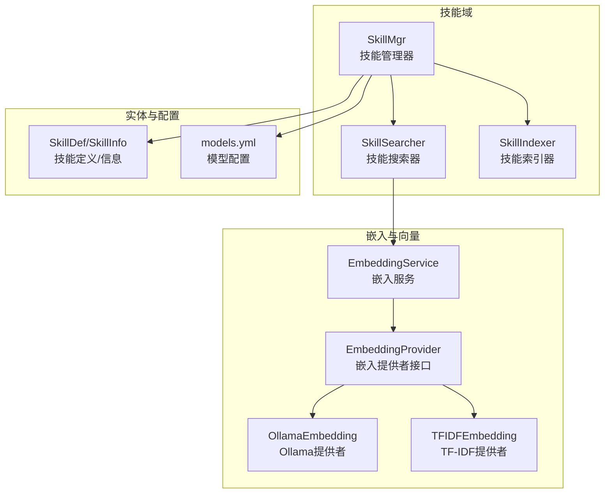
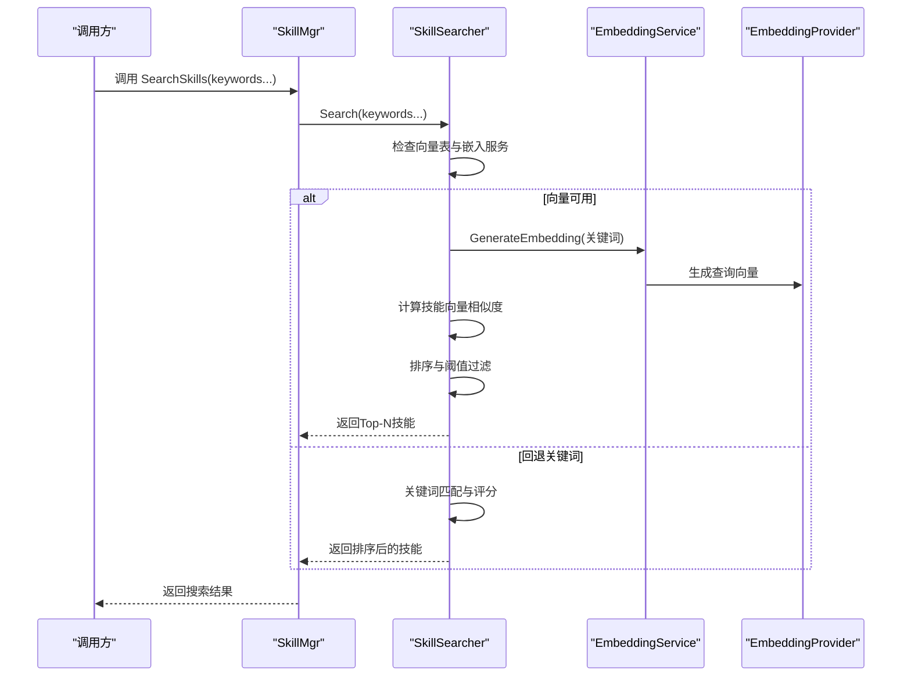
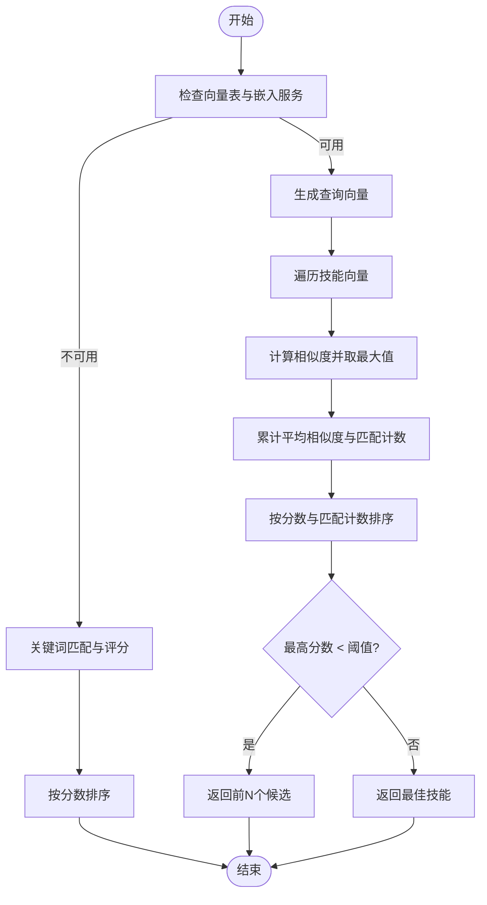
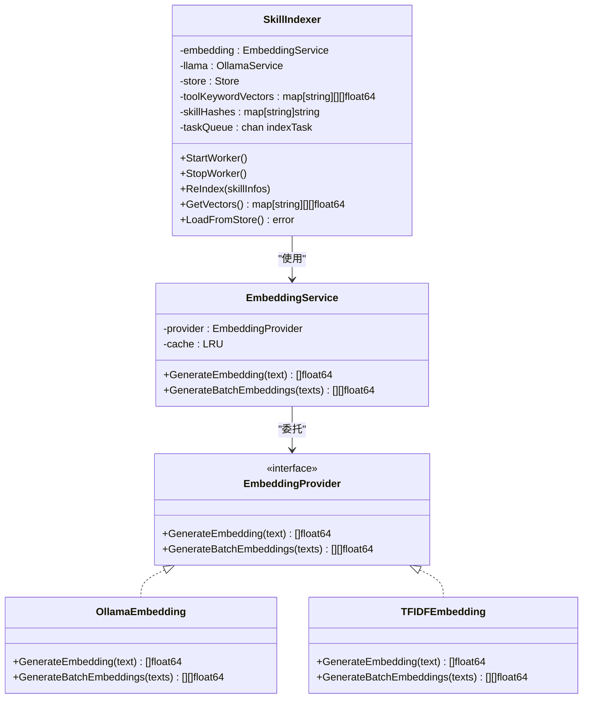
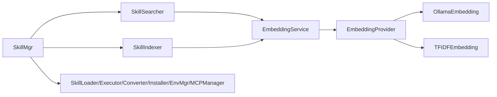

# 技能搜索器

<cite>
**本文引用的文件**
- [internal/usecase/skills/searcher.go](file://internal/usecase/skills/searcher.go)
- [internal/usecase/skills/indexer.go](file://internal/usecase/skills/indexer.go)
- [internal/usecase/embedding/service.go](file://internal/usecase/embedding/service.go)
- [internal/infrastructure/embedding/ollama.go](file://internal/infrastructure/embedding/ollama.go)
- [internal/infrastructure/embedding/tfidfe.go](file://internal/infrastructure/embedding/tfidfe.go)
- [internal/core/embedding.go](file://internal/core/embedding.go)
- [internal/entity/skill.go](file://internal/entity/skill.go)
- [internal/usecase/skills/skill_mgr.go](file://internal/usecase/skills/skill_mgr.go)
- [internal/usecase/skills/searcher_test.go](file://internal/usecase/skills/searcher_test.go)
- [internal/usecase/skills/vector_search_test.go](file://internal/usecase/skills/vector_search_test.go)
- [internal/usecase/skills/builtins/deep_search.go](file://internal/usecase/skills/builtins/deep_search.go)
- [internal/usecase/skills/builtins/web_search.go](file://internal/usecase/skills/builtins/web_search.go)
- [config/models.yml](file://config/models.yml)
- [internal/infrastructure/persistence/memory_store_test.go](file://internal/infrastructure/persistence/memory_store_test.go)
- [reports/2022-02-23/glm-5/技术细节评估报告.md](file://reports/2022-02-23/glm-5/技术细节评估报告.md)
- [reports/2022-02-22/doubao-seed-2.0-code/04_深入技术细节角度专项评测报告.md](file://reports/2022-02-22/doubao-seed-2.0-code/04_深入技术细节角度专项评测报告.md)
</cite>

## 目录
1. [简介](#简介)
2. [项目结构](#项目结构)
3. [核心组件](#核心组件)
4. [架构总览](#架构总览)
5. [详细组件分析](#详细组件分析)
6. [依赖关系分析](#依赖关系分析)
7. [性能考量](#性能考量)
8. [故障排查指南](#故障排查指南)
9. [结论](#结论)
10. [附录](#附录)

## 简介
本文件面向 MindX 技能搜索器，系统性阐述其多维度搜索机制与实现原理，包括基于关键词、标签与语义的混合搜索策略；向量数据库与嵌入服务的集成方式；大规模技能数据的搜索性能优化；缓存机制、查询优化与结果聚合策略；以及配置参数、性能调优与搜索策略选择指南。文档同时提供搜索流程图、类图与序列图，帮助读者从代码层面理解系统行为。

## 项目结构
技能搜索器位于 internal/usecase/skills 子目录，围绕 SkillSearcher、SkillIndexer 与 EmbeddingService 三大核心组件协作，配合实体定义与技能管理器 SkillMgr，形成“索引预计算—运行时检索—结果排序”的完整链路。

图表来源
- [internal/usecase/skills/skill_mgr.go](file://internal/usecase/skills/skill_mgr.go#L36-L84)
- [internal/usecase/skills/searcher.go](file://internal/usecase/skills/searcher.go#L15-L32)
- [internal/usecase/skills/indexer.go](file://internal/usecase/skills/indexer.go#L32-L73)
- [internal/usecase/embedding/service.go](file://internal/usecase/embedding/service.go#L13-L29)
- [internal/core/embedding.go](file://internal/core/embedding.go#L3-L7)
- [internal/infrastructure/embedding/ollama.go](file://internal/infrastructure/embedding/ollama.go#L24-L55)
- [internal/infrastructure/embedding/tfidfe.go](file://internal/infrastructure/embedding/tfidfe.go#L5-L17)
- [internal/entity/skill.go](file://internal/entity/skill.go#L5-L25)
- [config/models.yml](file://config/models.yml#L1-L92)

章节来源
- [internal/usecase/skills/skill_mgr.go](file://internal/usecase/skills/skill_mgr.go#L36-L84)
- [internal/usecase/skills/searcher.go](file://internal/usecase/skills/searcher.go#L15-L32)
- [internal/usecase/skills/indexer.go](file://internal/usecase/skills/indexer.go#L32-L73)
- [internal/usecase/embedding/service.go](file://internal/usecase/embedding/service.go#L13-L29)
- [internal/core/embedding.go](file://internal/core/embedding.go#L3-L7)
- [internal/infrastructure/embedding/ollama.go](file://internal/infrastructure/embedding/ollama.go#L24-L55)
- [internal/infrastructure/embedding/tfidfe.go](file://internal/infrastructure/embedding/tfidfe.go#L5-L17)
- [internal/entity/skill.go](file://internal/entity/skill.go#L5-L25)
- [config/models.yml](file://config/models.yml#L1-L92)

## 核心组件
- 技能搜索器 SkillSearcher：负责根据关键词执行混合搜索，优先使用向量相似度，回退到关键词匹配；内置排序与阈值过滤。
- 技能索引器 SkillIndexer：负责从技能定义中抽取关键词，生成关键词向量，建立技能-关键词向量映射，并持久化索引。
- 嵌入服务 EmbeddingService：统一的嵌入生成入口，封装缓存与批量生成能力，屏蔽底层提供者差异。
- 嵌入提供者 EmbeddingProvider：抽象接口，支持 Ollama 与 TF-IDF 两种实现。
- 实体定义 SkillDef/SkillInfo：承载技能元数据（名称、描述、分类、标签等），用于关键词匹配与向量索引。

章节来源
- [internal/usecase/skills/searcher.go](file://internal/usecase/skills/searcher.go#L15-L32)
- [internal/usecase/skills/indexer.go](file://internal/usecase/skills/indexer.go#L32-L73)
- [internal/usecase/embedding/service.go](file://internal/usecase/embedding/service.go#L13-L29)
- [internal/core/embedding.go](file://internal/core/embedding.go#L3-L7)
- [internal/entity/skill.go](file://internal/entity/skill.go#L5-L25)

## 架构总览
技能搜索器的运行时架构由“索引预计算—检索—排序过滤”三层组成。SkillIndexer 在后台异步生成技能的关键词向量并持久化；SkillMgr 将索引同步至 SkillSearcher；检索阶段 SkillSearcher 优先使用 EmbeddingService 生成查询向量，与技能向量计算余弦相似度，按分数与匹配计数排序；若向量表为空或相似度不足，则回退到关键词匹配。

图表来源
- [internal/usecase/skills/skill_mgr.go](file://internal/usecase/skills/skill_mgr.go#L228-L230)
- [internal/usecase/skills/searcher.go](file://internal/usecase/skills/searcher.go#L42-L62)
- [internal/usecase/embedding/service.go](file://internal/usecase/embedding/service.go#L31-L59)
- [internal/core/embedding.go](file://internal/core/embedding.go#L3-L7)

## 详细组件分析

### 技能搜索器 SkillSearcher
- 搜索入口：接收可变参数关键词，先检查向量表与嵌入服务是否存在；存在则走向量路径，否则回退关键词路径。
- 向量路径：
  - 逐个关键词生成查询向量，累加技能的最大相似度，得到平均相似度与匹配计数。
  - 若无任何技能匹配，回退关键词路径；若最高相似度低于阈值，则返回前 N 个候选，否则返回最佳技能。
- 关键词路径：
  - 对技能定义的名称、描述、标签、分类进行正向与反向匹配，赋予不同权重，按总分降序排列。
- 相似度函数：计算两个向量的余弦相似度，用于排序稳定性。

图表来源
- [internal/usecase/skills/searcher.go](file://internal/usecase/skills/searcher.go#L72-L188)
- [internal/usecase/skills/searcher.go](file://internal/usecase/skills/searcher.go#L190-L281)
- [internal/usecase/skills/searcher.go](file://internal/usecase/skills/searcher.go#L289-L306)

章节来源
- [internal/usecase/skills/searcher.go](file://internal/usecase/skills/searcher.go#L42-L62)
- [internal/usecase/skills/searcher.go](file://internal/usecase/skills/searcher.go#L72-L188)
- [internal/usecase/skills/searcher.go](file://internal/usecase/skills/searcher.go#L190-L281)
- [internal/usecase/skills/searcher.go](file://internal/usecase/skills/searcher.go#L289-L306)

### 技能索引器 SkillIndexer
- 关键词抽取：使用 LLM 从技能名称、描述、分类中提炼中文关键字，并合并标签；去除空串。
- 向量生成：对每个关键词调用 EmbeddingService 生成向量，构建技能-关键词向量映射。
- 持久化：将向量索引与哈希写入存储，支持重启后加载；提供队列文件容灾与异步工作线程。
- 增量更新：基于技能哈希判断是否需要重建索引，避免重复计算。

图表来源
- [internal/usecase/skills/indexer.go](file://internal/usecase/skills/indexer.go#L32-L73)
- [internal/usecase/embedding/service.go](file://internal/usecase/embedding/service.go#L13-L29)
- [internal/core/embedding.go](file://internal/core/embedding.go#L3-L7)
- [internal/infrastructure/embedding/ollama.go](file://internal/infrastructure/embedding/ollama.go#L24-L55)
- [internal/infrastructure/embedding/tfidfe.go](file://internal/infrastructure/embedding/tfidfe.go#L5-L17)

章节来源
- [internal/usecase/skills/indexer.go](file://internal/usecase/skills/indexer.go#L116-L176)
- [internal/usecase/skills/indexer.go](file://internal/usecase/skills/indexer.go#L188-L253)
- [internal/usecase/skills/indexer.go](file://internal/usecase/skills/indexer.go#L343-L393)
- [internal/usecase/skills/indexer.go](file://internal/usecase/skills/indexer.go#L395-L444)

### 嵌入服务与提供者
- EmbeddingService：提供统一的 GenerateEmbedding 与 GenerateBatchEmbeddings 接口，内部维护 LRU 缓存，避免重复调用底层提供者。
- OllamaEmbedding：对接本地或远程 Ollama 服务，支持批量生成；具备兼容多种响应格式的能力。
- TFIDFEmbedding：在未配置外部模型时的降级方案，提供字符频率向量与简单分词。

章节来源
- [internal/usecase/embedding/service.go](file://internal/usecase/embedding/service.go#L31-L77)
- [internal/infrastructure/embedding/ollama.go](file://internal/infrastructure/embedding/ollama.go#L57-L111)
- [internal/infrastructure/embedding/tfidfe.go](file://internal/infrastructure/embedding/tfidfe.go#L45-L104)

### 实体与技能管理器
- SkillDef/SkillInfo：承载技能元数据，供关键词匹配与向量索引使用。
- SkillMgr：协调 Loader、Executor、Searcher、Indexer、Converter、Installer、EnvMgr、MCPManager，负责组件同步与生命周期管理；对外暴露 SearchSkills 接口。

章节来源
- [internal/entity/skill.go](file://internal/entity/skill.go#L5-L25)
- [internal/usecase/skills/skill_mgr.go](file://internal/usecase/skills/skill_mgr.go#L87-L98)
- [internal/usecase/skills/skill_mgr.go](file://internal/usecase/skills/skill_mgr.go#L228-L230)

## 依赖关系分析
- 组件耦合：SkillSearcher 依赖 EmbeddingService 与技能信息；SkillIndexer 依赖 EmbeddingService、LLM 服务与存储；SkillMgr 协调三者并提供统一接口。
- 外部依赖：Ollama 服务、Badger/内存存储（用于向量索引持久化与检索）。
- 潜在循环依赖：当前文件组织避免了直接循环，但需注意索引与检索的数据同步点。

图表来源
- [internal/usecase/skills/searcher.go](file://internal/usecase/skills/searcher.go#L15-L32)
- [internal/usecase/embedding/service.go](file://internal/usecase/embedding/service.go#L13-L29)
- [internal/infrastructure/embedding/ollama.go](file://internal/infrastructure/embedding/ollama.go#L24-L55)
- [internal/infrastructure/embedding/tfidfe.go](file://internal/infrastructure/embedding/tfidfe.go#L5-L17)
- [internal/usecase/skills/indexer.go](file://internal/usecase/skills/indexer.go#L32-L73)
- [internal/usecase/skills/skill_mgr.go](file://internal/usecase/skills/skill_mgr.go#L36-L84)

## 性能考量
- 向量检索复杂度：当前实现为全量扫描，复杂度 O(n)，建议引入近似最近邻索引（如 HNSW）以降低到 O(log n)。
- 缓存策略：EmbeddingService 使用 LRU 缓存，建议结合热点关键词与批量生成优化缓存命中率。
- 存储与序列化：向量索引采用 JSON 序列化，建议改用二进制编码以减少 CPU 开销与内存占用。
- 并发与异步：索引器使用后台工作线程与队列，避免阻塞主线程；建议对批量向量生成增加并发控制与背压策略。
- 模型配置：models.yml 提供多种模型与参数，可根据性能与精度需求调整温度、最大令牌数等。

章节来源
- [reports/2022-02-23/glm-5/技术细节评估报告.md](file://reports/2022-02-23/glm-5/技术细节评估报告.md#L267-L310)
- [reports/2022-02-23/glm-5/技术细节评估报告.md](file://reports/2022-02-23/glm-5/技术细节评估报告.md#L312-L342)
- [reports/2022-02-23/glm-5/技术细节评估报告.md](file://reports/2022-02-23/glm-5/技术细节评估报告.md#L341-L382)
- [internal/usecase/embedding/service.go](file://internal/usecase/embedding/service.go#L22-L29)
- [config/models.yml](file://config/models.yml#L1-L92)

## 故障排查指南
- 向量搜索退化为关键词搜索
  - 现象：向量表为空导致直接走关键词路径。
  - 排查：确认 EmbeddingService 可用、SkillIndexer 成功生成并持久化向量；检查 ReIndex 是否完成。
  - 参考测试：向量表非空断言确保不会静默退化。
- 嵌入服务不可用
  - 现象：GenerateEmbedding 返回错误。
  - 排查：检查 Ollama 服务连通性与模型可用性；确认 models.yml 中模型配置正确。
- 关键词匹配异常
  - 现象：排序不符合预期。
  - 排查：核对 SkillDef 的名称、描述、标签、分类字段；关注大小写与空白字符处理。
- 结果为空
  - 现象：关键词无法匹配任何技能。
  - 排查：确认关键词与技能元数据的覆盖范围；必要时放宽关键词或补充标签。

章节来源
- [internal/usecase/skills/vector_search_test.go](file://internal/usecase/skills/vector_search_test.go#L114-L155)
- [internal/usecase/skills/searcher_test.go](file://internal/usecase/skills/searcher_test.go#L61-L152)
- [internal/usecase/skills/searcher_test.go](file://internal/usecase/skills/searcher_test.go#L154-L210)

## 结论
MindX 技能搜索器通过“关键词+语义”的混合策略，在保证召回质量的同时兼顾性能与可扩展性。当前实现以向量全量扫描与 LRU 缓存为基础，具备良好的工程实践；未来可通过引入 HNSW 索引、优化序列化与并发控制进一步提升大规模场景下的检索效率与稳定性。

## 附录

### 搜索策略与阈值
- 向量相似度阈值：最高分数低于阈值时返回前 N 个候选，否则返回最佳技能。
- 匹配计数：统计超过阈值的关键词数量，作为排序第二优先级。
- 关键词匹配权重：名称包含、描述包含、标签包含、分类包含、反向匹配分别赋权，最终按总分排序。

章节来源
- [internal/usecase/skills/searcher.go](file://internal/usecase/skills/searcher.go#L152-L188)
- [internal/usecase/skills/searcher.go](file://internal/usecase/skills/searcher.go#L190-L281)

### 集成与配置要点
- 嵌入提供者选择：优先使用 OllamaEmbedding；在离线或受限环境下可使用 TFIDFEmbedding。
- 模型配置：根据场景选择合适的模型与参数，平衡响应速度与语义质量。
- 索引持久化：启用存储后，重启可自动加载向量索引，减少首次检索延迟。

章节来源
- [internal/infrastructure/embedding/ollama.go](file://internal/infrastructure/embedding/ollama.go#L32-L55)
- [internal/infrastructure/embedding/tfidfe.go](file://internal/infrastructure/embedding/tfidfe.go#L12-L17)
- [config/models.yml](file://config/models.yml#L1-L92)
- [internal/usecase/skills/indexer.go](file://internal/usecase/skills/indexer.go#L343-L393)

### 相关内置技能与检索示例
- 深度搜索与网页搜索：内置技能可作为检索结果的补充，对搜索结果进行二次筛选与摘要。
- 示例场景：意图识别输出的 intent 与 keywords 组合作为搜索词，验证搜索器能正确返回目标技能。

章节来源
- [internal/usecase/skills/builtins/deep_search.go](file://internal/usecase/skills/builtins/deep_search.go#L48-L99)
- [internal/usecase/skills/builtins/web_search.go](file://internal/usecase/skills/builtins/web_search.go#L10-L49)
- [internal/usecase/skills/searcher_test.go](file://internal/usecase/skills/searcher_test.go#L281-L375)