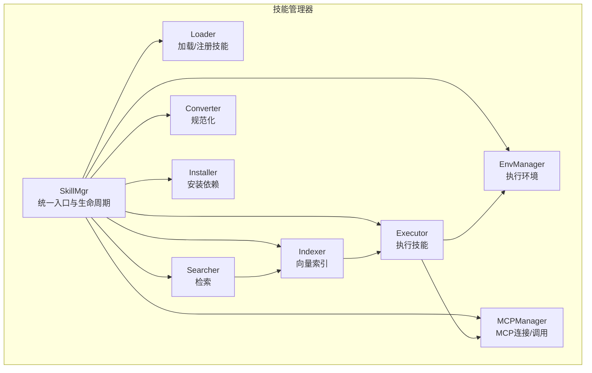
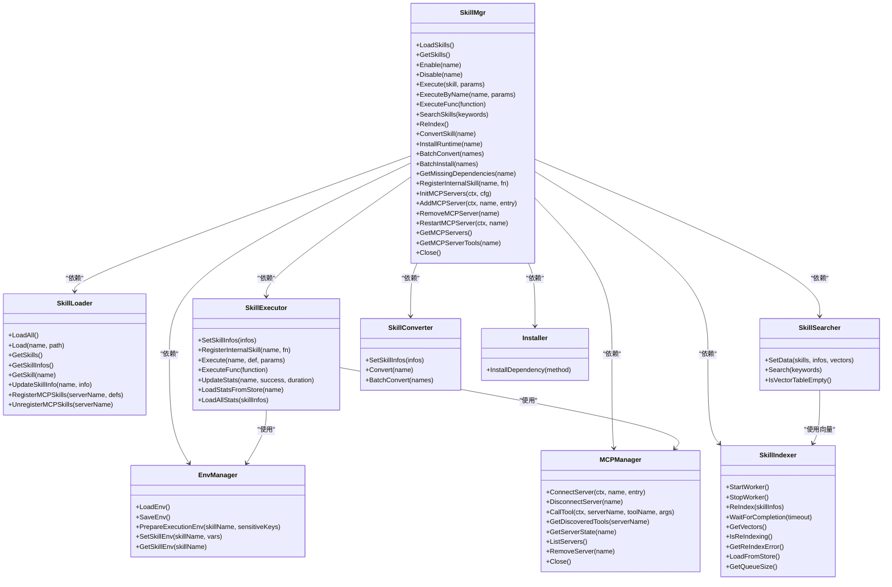
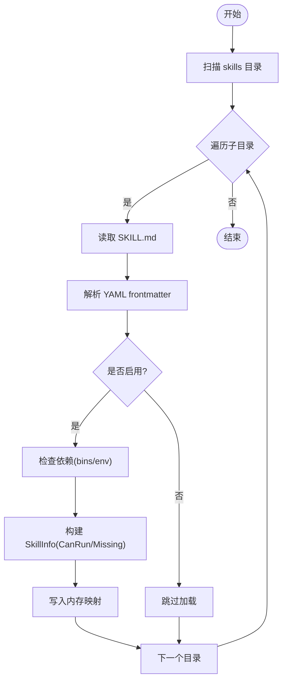
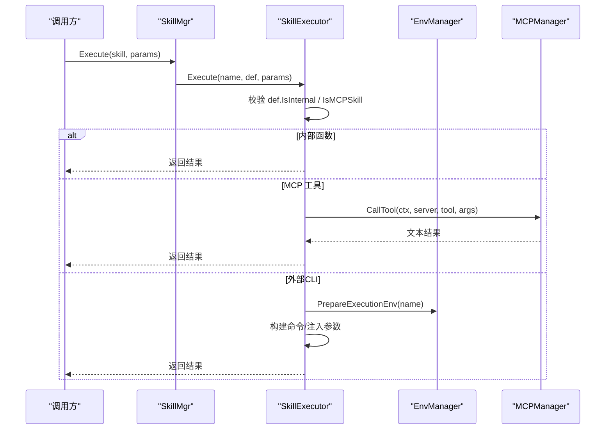
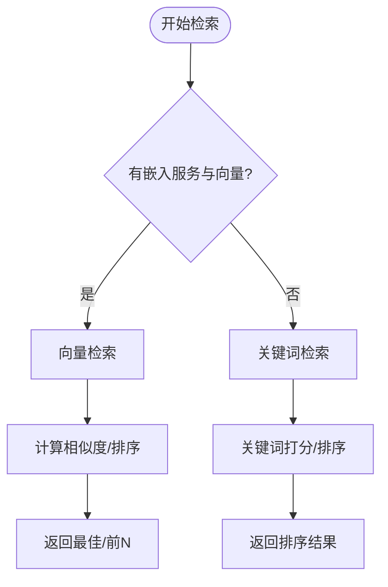
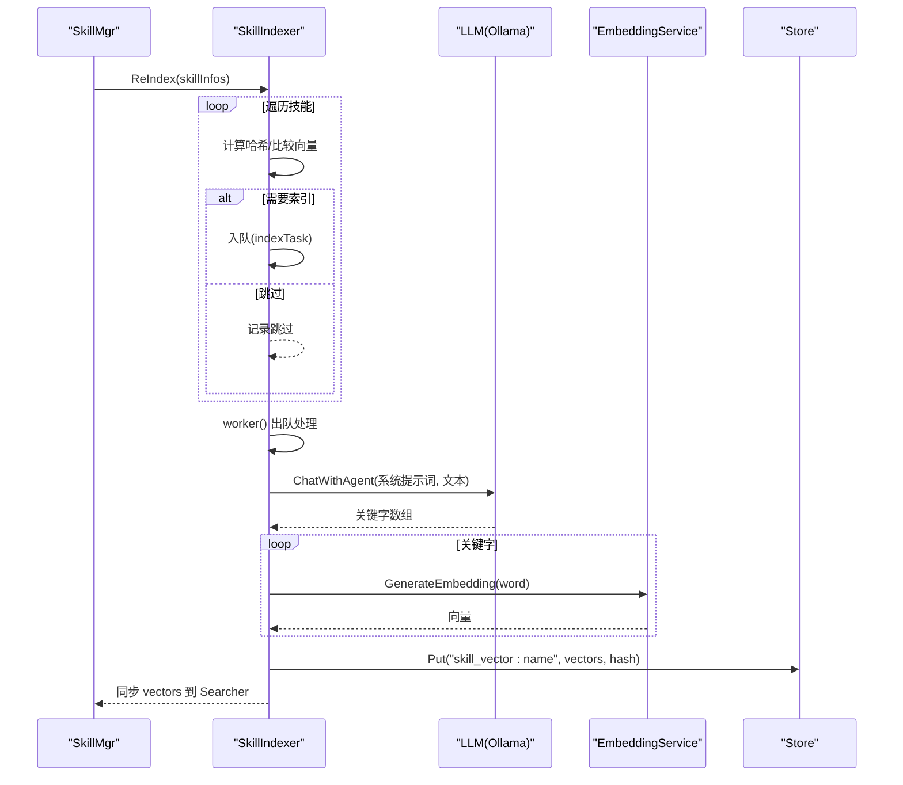
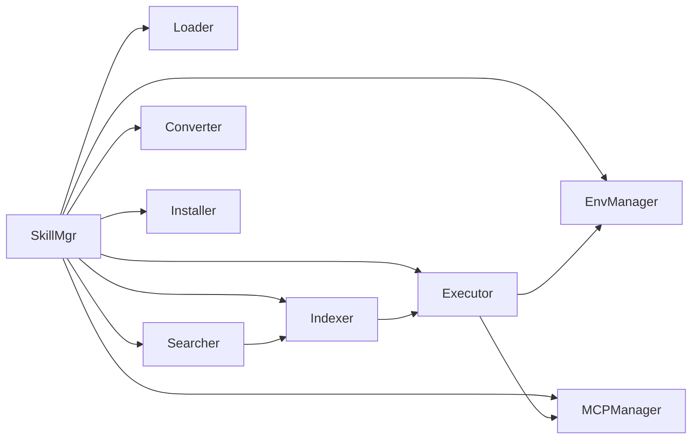

# 技能管理器

<cite>
**本文引用的文件**
- [cmd/main.go](file://cmd/main.go)
- [internal/core/skillmgr.go](file://internal/core/skillmgr.go)
- [internal/usecase/skills/skill_mgr.go](file://internal/usecase/skills/skill_mgr.go)
- [internal/entity/skill.go](file://internal/entity/skill.go)
- [internal/usecase/skills/loader.go](file://internal/usecase/skills/loader.go)
- [internal/usecase/skills/executor.go](file://internal/usecase/skills/executor.go)
- [internal/usecase/skills/searcher.go](file://internal/usecase/skills/searcher.go)
- [internal/usecase/skills/indexer.go](file://internal/usecase/skills/indexer.go)
- [internal/usecase/skills/converter.go](file://internal/usecase/skills/converter.go)
- [internal/usecase/skills/skill_installer.go](file://internal/usecase/skills/skill_installer.go)
- [internal/usecase/skills/skill_env.go](file://internal/usecase/skills/skill_env.go)
- [internal/usecase/skills/mcp_manager.go](file://internal/usecase/skills/mcp_manager.go)
- [internal/config/config.go](file://internal/config/config.go)
- [README.md](file://README.md)
</cite>

## 目录
1. [简介](#简介)
2. [项目结构](#项目结构)
3. [核心组件](#核心组件)
4. [架构总览](#架构总览)
5. [详细组件分析](#详细组件分析)
6. [依赖关系分析](#依赖关系分析)
7. [性能考量](#性能考量)
8. [故障排查指南](#故障排查指南)
9. [结论](#结论)
10. [附录](#附录)

## 简介
本文件面向开发者与维护者，系统化阐述 MindX 技能管理器的架构设计、组件职责与协作机制，覆盖技能加载、执行、搜索、索引、转换与安装等全生命周期管理，并给出状态与依赖管理策略、错误处理与性能优化建议，以及可扩展的使用模式与配置要点。

## 项目结构
MindX 技能管理器位于 internal/usecase/skills 目录下，围绕 SkillMgr 协调多个子系统：
- Loader：扫描 skills 目录，解析 SKILL.md，构建技能定义与信息
- Executor：执行技能（内部函数、外部 CLI、MCP 工具），统计执行指标
- Searcher：基于向量与关键词的混合检索
- Indexer：异步生成技能关键字向量，持久化并供检索使用
- Converter：规范化/补全技能定义文件
- Installer：按定义安装运行依赖
- EnvManager：管理技能执行环境变量
- MCPManager：连接与调用 MCP 服务器，动态注册/注销工具
- SkillMgr：对外统一入口，负责组件装配、状态同步与生命周期控制

图表来源
- [internal/usecase/skills/skill_mgr.go](file://internal/usecase/skills/skill_mgr.go#L20-L62)
- [internal/usecase/skills/loader.go](file://internal/usecase/skills/loader.go#L18-L33)
- [internal/usecase/skills/executor.go](file://internal/usecase/skills/executor.go#L19-L42)
- [internal/usecase/skills/searcher.go](file://internal/usecase/skills/searcher.go#L15-L32)
- [internal/usecase/skills/indexer.go](file://internal/usecase/skills/indexer.go#L32-L51)
- [internal/usecase/skills/converter.go](file://internal/usecase/skills/converter.go#L16-L29)
- [internal/usecase/skills/skill_installer.go](file://internal/usecase/skills/skill_installer.go#L12-L22)
- [internal/usecase/skills/skill_env.go](file://internal/usecase/skills/skill_env.go#L28-L42)
- [internal/usecase/skills/mcp_manager.go](file://internal/usecase/skills/mcp_manager.go#L36-L47)

章节来源
- [internal/usecase/skills/skill_mgr.go](file://internal/usecase/skills/skill_mgr.go#L20-L84)
- [internal/usecase/skills/loader.go](file://internal/usecase/skills/loader.go#L35-L58)
- [internal/usecase/skills/indexer.go](file://internal/usecase/skills/indexer.go#L75-L85)

## 核心组件
- Skill 接口与 SkillManager 接口：抽象技能与管理器能力，便于替换实现与测试
- SkillDef/SkillInfo：技能定义与运行时信息（含依赖、状态、统计）
- 各子系统职责：
  - Loader：文件系统扫描、YAML frontmatter 解析、依赖检查、MCP 工具注册
  - Executor：命令构建、超时控制、参数序列化、执行结果处理、统计落盘
  - Searcher：向量检索与关键词检索双轨回退
  - Indexer：异步任务队列、LLM 关键字抽取、向量生成与持久化
  - Converter：补全缺失字段、规范化 YAML
  - Installer：跨平台包管理器安装
  - EnvManager：技能专属环境变量注入
  - MCPManager：MCP 连接、工具发现、调用与状态管理

章节来源
- [internal/core/skillmgr.go](file://internal/core/skillmgr.go#L3-L17)
- [internal/entity/skill.go](file://internal/entity/skill.go#L5-L82)
- [internal/usecase/skills/loader.go](file://internal/usecase/skills/loader.go#L60-L123)
- [internal/usecase/skills/executor.go](file://internal/usecase/skills/executor.go#L57-L79)
- [internal/usecase/skills/searcher.go](file://internal/usecase/skills/searcher.go#L42-L62)
- [internal/usecase/skills/indexer.go](file://internal/usecase/skills/indexer.go#L116-L176)
- [internal/usecase/skills/converter.go](file://internal/usecase/skills/converter.go#L37-L104)
- [internal/usecase/skills/skill_installer.go](file://internal/usecase/skills/skill_installer.go#L24-L66)
- [internal/usecase/skills/skill_env.go](file://internal/usecase/skills/skill_env.go#L100-L120)
- [internal/usecase/skills/mcp_manager.go](file://internal/usecase/skills/mcp_manager.go#L49-L141)

## 架构总览
SkillMgr 作为中枢，负责：
- 组件初始化与装配
- 加载技能、同步各子系统数据视图
- 生命周期控制（启用/禁用、索引重建、MCP 动态增删）
- 错误传播与日志记录
- 资源回收（索引工作线程、MCP 连接）

图表来源
- [internal/usecase/skills/skill_mgr.go](file://internal/usecase/skills/skill_mgr.go#L20-L62)
- [internal/usecase/skills/loader.go](file://internal/usecase/skills/loader.go#L18-L33)
- [internal/usecase/skills/executor.go](file://internal/usecase/skills/executor.go#L19-L42)
- [internal/usecase/skills/searcher.go](file://internal/usecase/skills/searcher.go#L15-L32)
- [internal/usecase/skills/indexer.go](file://internal/usecase/skills/indexer.go#L32-L51)
- [internal/usecase/skills/converter.go](file://internal/usecase/skills/converter.go#L16-L29)
- [internal/usecase/skills/skill_installer.go](file://internal/usecase/skills/skill_installer.go#L12-L22)
- [internal/usecase/skills/skill_env.go](file://internal/usecase/skills/skill_env.go#L28-L42)
- [internal/usecase/skills/mcp_manager.go](file://internal/usecase/skills/mcp_manager.go#L36-L47)

## 详细组件分析

### 技能加载器（Loader）
- 负责遍历 skills 目录，读取 SKILL.md，解析 YAML frontmatter，构建 SkillDef 与 SkillInfo
- 检查依赖（二进制与环境变量），标记 CanRun 与缺失项
- 支持注册 MCP 工具为技能，统一纳入管理
- 提供并发安全的读写接口

图表来源
- [internal/usecase/skills/loader.go](file://internal/usecase/skills/loader.go#L35-L58)
- [internal/usecase/skills/loader.go](file://internal/usecase/skills/loader.go#L60-L123)
- [internal/usecase/skills/loader.go](file://internal/usecase/skills/loader.go#L186-L204)

章节来源
- [internal/usecase/skills/loader.go](file://internal/usecase/skills/loader.go#L35-L123)
- [internal/entity/skill.go](file://internal/entity/skill.go#L5-L82)

### 执行器（Executor）
- 支持三类执行路径：内部函数、外部 CLI、MCP 工具
- 统一超时控制、参数序列化、标准输入注入
- 统计执行次数、错误次数、平均耗时、最近运行时间
- 可选持久化统计到存储

图表来源
- [internal/usecase/skills/skill_mgr.go](file://internal/usecase/skills/skill_mgr.go#L189-L211)
- [internal/usecase/skills/executor.go](file://internal/usecase/skills/executor.go#L57-L79)
- [internal/usecase/skills/executor.go](file://internal/usecase/skills/executor.go#L105-L136)
- [internal/usecase/skills/executor.go](file://internal/usecase/skills/executor.go#L138-L195)
- [internal/usecase/skills/skill_env.go](file://internal/usecase/skills/skill_env.go#L100-L120)
- [internal/usecase/skills/mcp_manager.go](file://internal/usecase/skills/mcp_manager.go#L169-L204)

章节来源
- [internal/usecase/skills/executor.go](file://internal/usecase/skills/executor.go#L57-L195)
- [internal/usecase/skills/executor.go](file://internal/usecase/skills/executor.go#L266-L373)

### 搜索器（Searcher）
- 若存在嵌入服务与技能向量，则进行向量相似度检索；否则回退到关键词匹配
- 向量检索：对查询词生成向量，计算与技能关键字向量的最大余弦相似度，聚合评分排序
- 关键词检索：拼接名称/描述/标签/分类，进行正反向匹配打分

图表来源
- [internal/usecase/skills/searcher.go](file://internal/usecase/skills/searcher.go#L42-L62)
- [internal/usecase/skills/searcher.go](file://internal/usecase/skills/searcher.go#L72-L188)
- [internal/usecase/skills/searcher.go](file://internal/usecase/skills/searcher.go#L190-L281)

章节来源
- [internal/usecase/skills/searcher.go](file://internal/usecase/skills/searcher.go#L42-L281)

### 索引器（Indexer）
- 异步工作线程：消费任务队列，逐个生成技能关键字向量
- LLM 关键字抽取：通过系统提示词抽取精准中文关键字
- 持久化：以键值形式保存向量与哈希，支持重启恢复队列
- 去重与增量：基于哈希判断是否需要重新索引

图表来源
- [internal/usecase/skills/skill_mgr.go](file://internal/usecase/skills/skill_mgr.go#L232-L241)
- [internal/usecase/skills/indexer.go](file://internal/usecase/skills/indexer.go#L188-L253)
- [internal/usecase/skills/indexer.go](file://internal/usecase/skills/indexer.go#L116-L176)
- [internal/usecase/skills/indexer.go](file://internal/usecase/skills/indexer.go#L266-L297)
- [internal/usecase/skills/indexer.go](file://internal/usecase/skills/indexer.go#L343-L393)
- [internal/usecase/skills/indexer.go](file://internal/usecase/skills/indexer.go#L409-L444)

章节来源
- [internal/usecase/skills/indexer.go](file://internal/usecase/skills/indexer.go#L75-L176)
- [internal/usecase/skills/indexer.go](file://internal/usecase/skills/indexer.go#L188-L331)
- [internal/usecase/skills/indexer.go](file://internal/usecase/skills/indexer.go#L343-L516)

### 转换器（Converter）
- 读取 SKILL.md，确保 frontmatter 存在并解析
- 补全缺失字段（名称、版本、分类、启用状态等）
- 重写文件，更新内存中的 SkillInfo.Def

章节来源
- [internal/usecase/skills/converter.go](file://internal/usecase/skills/converter.go#L37-L104)

### 安装器（Installer）
- 根据 InstallMethod.Kind 选择包管理器命令（brew/apt/yum/dnf/npm/pip/snap/choco）
- 输出安装过程到标准流，记录日志

章节来源
- [internal/usecase/skills/skill_installer.go](file://internal/usecase/skills/skill_installer.go#L24-L66)

### 环境管理器（EnvManager）
- 从 workspaceDir/skills.yml 读取技能专属环境变量
- 执行前将环境变量注入到子进程，键名格式为 SKILL_<技能名>_ <变量名>
- 支持保存/更新配置

章节来源
- [internal/usecase/skills/skill_env.go](file://internal/usecase/skills/skill_env.go#L44-L120)

### MCP 管理器（MCPManager）
- 支持 SSE 与 stdio 两种传输方式
- 连接后发现工具，缓存工具列表
- 调用工具时进行状态校验与错误处理
- 支持动态添加/移除/重启服务器

章节来源
- [internal/usecase/skills/mcp_manager.go](file://internal/usecase/skills/mcp_manager.go#L49-L141)
- [internal/usecase/skills/mcp_manager.go](file://internal/usecase/skills/mcp_manager.go#L169-L204)
- [internal/usecase/skills/mcp_manager.go](file://internal/usecase/skills/mcp_manager.go#L249-L278)

## 依赖关系分析
- 组件耦合
  - SkillMgr 对各子系统强依赖，但通过接口与同步点解耦
  - Executor 依赖 EnvManager 与 MCPManager，形成执行链路
  - Searcher 依赖 Indexer 的向量表，形成检索链路
  - Indexer 依赖 EmbeddingService 与 OllamaService，形成预计算链路
- 并发与同步
  - 多处使用 RWMutex 保证读写一致性
  - Indexer 使用通道与工作线程异步处理，原子计数 pendingCount
  - SkillMgr.syncComponents 在状态变更后统一刷新各子系统数据视图
- 外部依赖
  - MCP SDK、Viper 配置、Ollama 服务、嵌入服务等

图表来源
- [internal/usecase/skills/skill_mgr.go](file://internal/usecase/skills/skill_mgr.go#L87-L98)
- [internal/usecase/skills/executor.go](file://internal/usecase/skills/executor.go#L20-L42)
- [internal/usecase/skills/searcher.go](file://internal/usecase/skills/searcher.go#L15-L32)
- [internal/usecase/skills/indexer.go](file://internal/usecase/skills/indexer.go#L32-L51)

章节来源
- [internal/usecase/skills/skill_mgr.go](file://internal/usecase/skills/skill_mgr.go#L87-L120)
- [internal/usecase/skills/indexer.go](file://internal/usecase/skills/indexer.go#L75-L85)

## 性能考量
- 异步索引与批量处理
  - Indexer 使用通道队列与工作线程，避免阻塞主线程
  - 支持等待队列清空后再同步 Searcher，保证检索一致性
- 向量检索优化
  - 仅在嵌入服务可用且向量表非空时启用向量检索，否则回退关键词
  - 通过最大相似度聚合与阈值过滤减少无效匹配
- 执行性能
  - 统一超时控制，避免长时间阻塞
  - 统计窗口限制（最多 100 条执行时间），滚动更新平均耗时
- I/O 与持久化
  - 向量与统计信息持久化到 Store，支持重启恢复
  - 队列文件容灾，异常退出后可恢复任务

章节来源
- [internal/usecase/skills/indexer.go](file://internal/usecase/skills/indexer.go#L75-L114)
- [internal/usecase/skills/indexer.go](file://internal/usecase/skills/indexer.go#L255-L264)
- [internal/usecase/skills/searcher.go](file://internal/usecase/skills/searcher.go#L72-L188)
- [internal/usecase/skills/executor.go](file://internal/usecase/skills/executor.go#L266-L300)
- [internal/usecase/skills/indexer.go](file://internal/usecase/skills/indexer.go#L409-L444)

## 故障排查指南
- 索引失败
  - 现象：ReIndex 返回错误或 IsReIndexing 持续为真
  - 排查：查看 GetReIndexError，确认嵌入服务与 LLM 服务可用
  - 处理：等待队列清空或重启服务后重试
- 检索为空
  - 现象：向量表为空或返回空集
  - 排查：IsVectorTableEmpty 是否为真；是否已完成 ReIndex
  - 处理：触发 ReIndex 并等待完成
- 执行失败
  - 现象：Execute/ExecuteFunc 返回错误
  - 排查：检查技能定义、依赖缺失、MCP 连接状态、命令构建与参数序列化
  - 处理：补充依赖、修正命令、检查 MCP 工具可用性
- MCP 连接不稳定
  - 现象：连接超时、协议错误、进程崩溃
  - 排查：区分可重试与不可重试错误；检查传输类型（stdio 冷启动慢）
  - 处理：调整超时、重试策略或更换传输方式

章节来源
- [internal/usecase/skills/skill_mgr.go](file://internal/usecase/skills/skill_mgr.go#L262-L268)
- [internal/usecase/skills/indexer.go](file://internal/usecase/skills/indexer.go#L321-L331)
- [internal/usecase/skills/executor.go](file://internal/usecase/skills/executor.go#L57-L79)
- [internal/usecase/skills/mcp_manager.go](file://internal/usecase/skills/mcp_manager.go#L406-L449)

## 结论
MindX 技能管理器通过 SkillMgr 将加载、执行、搜索、索引、转换、安装与环境管理等能力有机整合，采用异步索引与向量检索提升用户体验，配合严格的错误处理与状态同步机制，确保系统在复杂场景下的稳定性与可扩展性。开发者可基于现有接口与模式扩展新的执行后端、检索策略与安装方式。

## 附录

### 技能生命周期与关键操作
- 加载：Loader 扫描并解析 SKILL.md，构建 SkillInfo
- 启用/禁用：更新 Def.Enabled 并同步组件
- 执行：Executor 依据类型路由至内部函数、MCP 或外部 CLI
- 搜索：Searcher 优先向量检索，回退关键词匹配
- 索引：Indexer 异步生成关键字向量并持久化
- 转换：Converter 规范化 SKILL.md frontmatter
- 安装：Installer 根据 InstallMethod 执行安装

章节来源
- [internal/usecase/skills/skill_mgr.go](file://internal/usecase/skills/skill_mgr.go#L122-L183)
- [internal/usecase/skills/executor.go](file://internal/usecase/skills/executor.go#L57-L195)
- [internal/usecase/skills/searcher.go](file://internal/usecase/skills/searcher.go#L42-L62)
- [internal/usecase/skills/indexer.go](file://internal/usecase/skills/indexer.go#L188-L253)
- [internal/usecase/skills/converter.go](file://internal/usecase/skills/converter.go#L37-L104)
- [internal/usecase/skills/skill_installer.go](file://internal/usecase/skills/skill_installer.go#L24-L66)

### 配置与运行要点
- 配置加载：通过 Viper 从工作目录加载 server.yml、channels.yml、capabilities.yml、models.yml
- MCP 服务器：支持 SSE 与 stdio 两种传输，stdoi 超时常需要更长超时
- 环境变量：技能专属变量通过 EnvManager 注入，键名格式为 SKILL_<技能名>_ <变量名>
- 日志与国际化：统一使用 Logger 记录，i18n 提供多语言文案

章节来源
- [internal/config/config.go](file://internal/config/config.go#L13-L37)
- [internal/config/config.go](file://internal/config/config.go#L39-L82)
- [internal/usecase/skills/mcp_manager.go](file://internal/usecase/skills/mcp_manager.go#L73-L104)
- [internal/usecase/skills/skill_env.go](file://internal/usecase/skills/skill_env.go#L100-L120)
- [README.md](file://README.md#L64-L138)