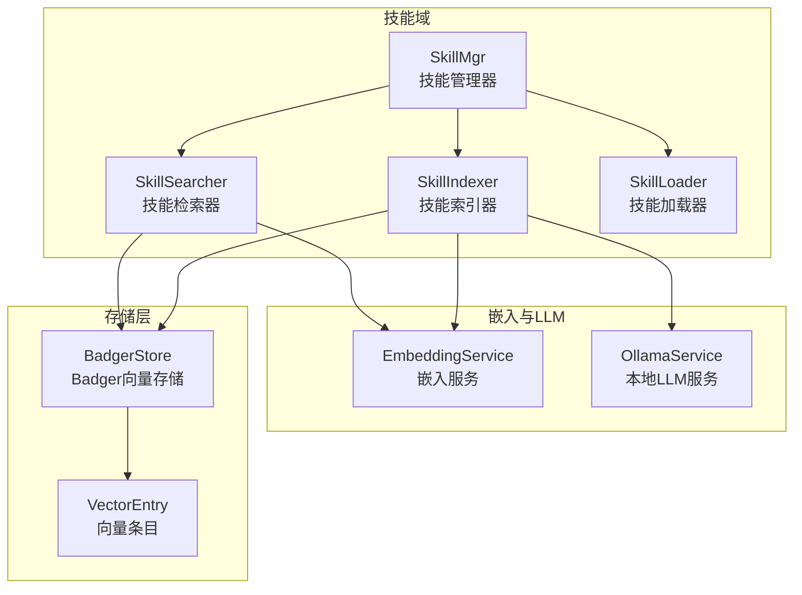
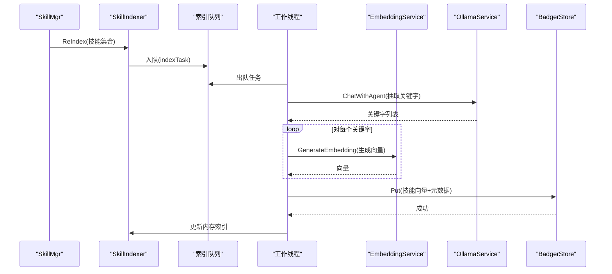
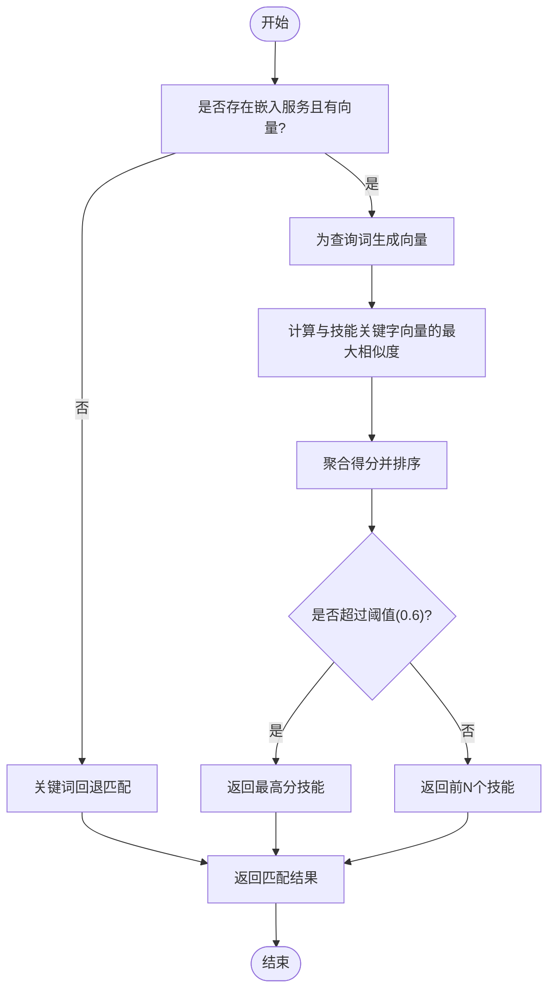
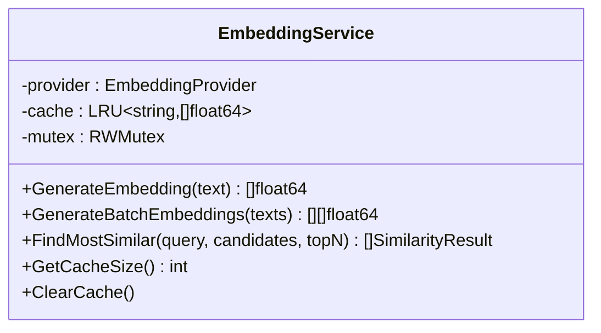
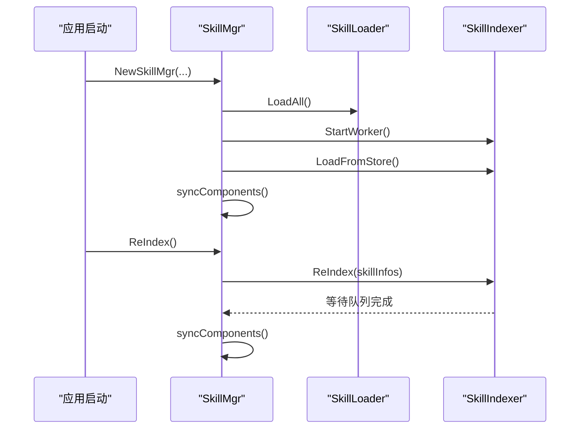
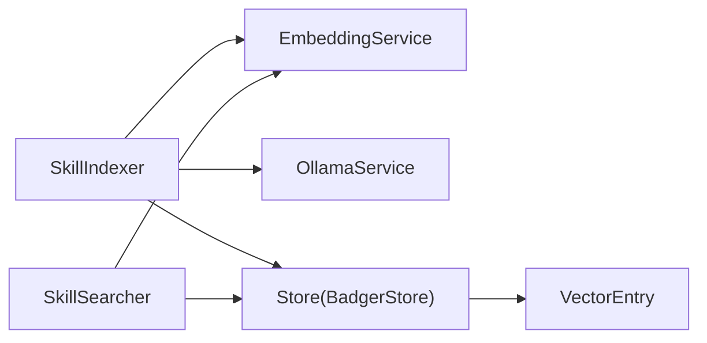

# 技能索引器

<cite>
**本文档引用的文件**
- [indexer.go](file://internal/usecase/skills/indexer.go)
- [searcher.go](file://internal/usecase/skills/searcher.go)
- [service.go](file://internal/usecase/embedding/service.go)
- [badger_store.go](file://internal/infrastructure/persistence/badger_store.go)
- [store.go](file://internal/infrastructure/persistence/store.go)
- [vector.go](file://internal/entity/vector.go)
- [skill_mgr.go](file://internal/usecase/skills/skill_mgr.go)
- [ollama.go](file://internal/infrastructure/llama/ollama.go)
- [loader.go](file://internal/usecase/skills/loader.go)
- [tfidfe.go](file://internal/infrastructure/embedding/tfidfe.go)
- [index_queue.json](file://data/index_queue.json)
- [VectorStoreSection.tsx](file://dashboard/src/components/settings/VectorStoreSection.tsx)
</cite>

## 目录
1. [简介](#简介)
2. [项目结构](#项目结构)
3. [核心组件](#核心组件)
4. [架构总览](#架构总览)
5. [详细组件分析](#详细组件分析)
6. [依赖关系分析](#依赖关系分析)
7. [性能考虑](#性能考虑)
8. [故障排除指南](#故障排除指南)
9. [结论](#结论)
10. [附录](#附录)

## 简介
本文件面向 MindX 技能索引器，系统性阐述其索引构建与维护机制，包括：
- 向量索引的生成、存储与更新策略
- 技能的批量索引、增量更新与全量重建
- 异步索引队列的工作原理
- 与嵌入向量服务、持久化存储的集成方式
- 一致性与可靠性保障
- 并发控制、错误恢复与性能监控
- 配置选项、索引策略选择与性能优化建议，并提供具体示例与故障排除指南

## 项目结构
MindX 技能索引器位于 usecase/skills 子模块，围绕 SkillIndexer、SkillSearcher、SkillMgr 三大核心组件协同工作，配合 EmbeddingService、BadgerStore 等基础设施，形成“异步索引 + 向量检索”的完整闭环。



图表来源
- [skill_mgr.go](file://internal/usecase/skills/skill_mgr.go#L36-L84)
- [indexer.go](file://internal/usecase/skills/indexer.go#L53-L73)
- [searcher.go](file://internal/usecase/skills/searcher.go#L24-L32)
- [service.go](file://internal/usecase/embedding/service.go#L22-L29)
- [ollama.go](file://internal/infrastructure/llama/ollama.go#L23-L29)
- [badger_store.go](file://internal/infrastructure/persistence/badger_store.go#L25-L44)
- [vector.go](file://internal/entity/vector.go#L6-L10)

章节来源
- [skill_mgr.go](file://internal/usecase/skills/skill_mgr.go#L36-L84)
- [indexer.go](file://internal/usecase/skills/indexer.go#L53-L73)
- [searcher.go](file://internal/usecase/skills/searcher.go#L24-L32)
- [service.go](file://internal/usecase/embedding/service.go#L22-L29)
- [ollama.go](file://internal/infrastructure/llama/ollama.go#L23-L29)
- [badger_store.go](file://internal/infrastructure/persistence/badger_store.go#L25-L44)
- [vector.go](file://internal/entity/vector.go#L6-L10)

## 核心组件
- SkillIndexer：负责技能关键字抽取、向量生成、索引持久化与异步队列管理
- SkillSearcher：负责基于向量的相似度检索与关键词回退检索
- EmbeddingService：统一的嵌入生成入口，内置 LRU 缓存
- OllamaService：本地 LLM 服务，用于从技能描述中抽取中文关键字
- BadgerStore：基于 Badger 的向量存储，支持扫描、批量写入与阈值检索
- SkillMgr：协调加载、索引、搜索与 MCP 工具注册流程

章节来源
- [indexer.go](file://internal/usecase/skills/indexer.go#L32-L51)
- [searcher.go](file://internal/usecase/skills/searcher.go#L15-L22)
- [service.go](file://internal/usecase/embedding/service.go#L15-L29)
- [ollama.go](file://internal/infrastructure/llama/ollama.go#L14-L18)
- [badger_store.go](file://internal/infrastructure/persistence/badger_store.go#L16-L22)
- [skill_mgr.go](file://internal/usecase/skills/skill_mgr.go#L20-L34)

## 架构总览
技能索引器采用“异步索引 + 向量检索”架构：
- 全量/增量 ReIndex 将技能信息推入异步队列
- 工作线程逐个处理任务，抽取关键字并生成向量
- 向量与哈希元数据持久化至 BadgerStore
- 检索阶段优先使用向量相似度，失败则回退关键词匹配



图表来源
- [skill_mgr.go](file://internal/usecase/skills/skill_mgr.go#L232-L241)
- [indexer.go](file://internal/usecase/skills/indexer.go#L116-L176)
- [indexer.go](file://internal/usecase/skills/indexer.go#L446-L488)
- [service.go](file://internal/usecase/embedding/service.go#L32-L59)
- [ollama.go](file://internal/infrastructure/llama/ollama.go#L98-L104)
- [badger_store.go](file://internal/infrastructure/persistence/badger_store.go#L65-L99)

## 详细组件分析

### SkillIndexer：索引构建与维护
- 异步队列与工作线程
  - 100容量的有界通道作为队列，原子计数 pendingCount 统计排队/处理中的任务数
  - 工作线程从队列取出任务，处理完成后持久化并向内存索引更新
- 关键字抽取与向量生成
  - 使用 OllamaService 的 ChatWithAgent 从技能名称、描述、分类与标签中抽取中文关键字
  - 通过 EmbeddingService 为每个关键字生成向量，LRU 缓存避免重复计算
- 索引持久化与一致性
  - 单条索引持久化：Put("skill_vector:{name}", 向量, 元数据{向量数组, 哈希})
  - 批量持久化：BatchPut 批量写入，提升重建效率
  - 队列落盘：saveQueueToFile/loadQueueFromFile 支持重启恢复
- 哈希校验与增量更新
  - computeSkillHash 基于技能定义与目录生成哈希，与内存 skillHashes 比较决定是否跳过
- 查询与状态
  - GetVectors 返回当前内存索引
  - IsReIndexing/GetReIndexError/IsVectorTableEmpty/GetQueueSize 提供运行时状态

```mermaid
classDiagram
class SkillIndexer {
-embedding : EmbeddingService
-llama : OllamaService
-store : Store
-logger : Logger
-dataPath : string
-mu : RWMutex
-isReIndexing : bool
-reIndexError : error
-toolKeywordVectors : map[string][][]float64
-skillHashes : map[string]string
-taskQueue : chan indexTask
-queueFile : string
-stopChan : chan struct{}
-workerWg : WaitGroup
-pendingCount : int64
+StartWorker()
+StopWorker()
+ReIndex(skillInfos)
+WaitForCompletion(timeout)
+GetVectors() map[string][][]float64
+IsReIndexing() bool
+GetReIndexError() error
+IsVectorTableEmpty() bool
+GetQueueSize() int
+LoadFromStore() error
-processTask(task, systemPrompt)
-extractKeywords(prompt, text) []string
-saveSingleIndex(skillName, vectors, hash) error
-saveVectorIndexToStore() error
-saveQueueToFile()
-loadQueueFromFile()
}
```

图表来源
- [indexer.go](file://internal/usecase/skills/indexer.go#L32-L51)
- [indexer.go](file://internal/usecase/skills/indexer.go#L75-L114)
- [indexer.go](file://internal/usecase/skills/indexer.go#L116-L176)
- [indexer.go](file://internal/usecase/skills/indexer.go#L343-L393)
- [indexer.go](file://internal/usecase/skills/indexer.go#L446-L516)

章节来源
- [indexer.go](file://internal/usecase/skills/indexer.go#L53-L73)
- [indexer.go](file://internal/usecase/skills/indexer.go#L75-L114)
- [indexer.go](file://internal/usecase/skills/indexer.go#L116-L176)
- [indexer.go](file://internal/usecase/skills/indexer.go#L178-L186)
- [indexer.go](file://internal/usecase/skills/indexer.go#L188-L253)
- [indexer.go](file://internal/usecase/skills/indexer.go#L255-L264)
- [indexer.go](file://internal/usecase/skills/indexer.go#L310-L331)
- [indexer.go](file://internal/usecase/skills/indexer.go#L343-L393)
- [indexer.go](file://internal/usecase/skills/indexer.go#L395-L444)
- [indexer.go](file://internal/usecase/skills/indexer.go#L446-L516)

### SkillSearcher：向量检索与关键词回退
- 向量检索
  - 对查询词逐一生成向量，计算与技能关键字向量的最大余弦相似度
  - 聚合得分并排序，超过阈值（0.6）取最优，否则取前N个候选
- 关键词回退
  - 当嵌入服务不可用或无向量时，按名称/描述/标签/分类进行关键词匹配
- 状态查询
  - IsVectorTableEmpty 判断向量表是否为空



图表来源
- [searcher.go](file://internal/usecase/skills/searcher.go#L42-L62)
- [searcher.go](file://internal/usecase/skills/searcher.go#L72-L188)
- [searcher.go](file://internal/usecase/skills/searcher.go#L190-L281)
- [searcher.go](file://internal/usecase/skills/searcher.go#L289-L306)

章节来源
- [searcher.go](file://internal/usecase/skills/searcher.go#L42-L62)
- [searcher.go](file://internal/usecase/skills/searcher.go#L72-L188)
- [searcher.go](file://internal/usecase/skills/searcher.go#L190-L281)
- [searcher.go](file://internal/usecase/skills/searcher.go#L289-L306)

### EmbeddingService：嵌入生成与缓存
- 统一入口：GenerateEmbedding(text) 与 GenerateBatchEmbeddings(texts)
- LRU 缓存：默认容量 500，避免重复调用底层嵌入提供者
- 提供者抽象：core.EmbeddingProvider，支持 TF-IDF 等实现



图表来源
- [service.go](file://internal/usecase/embedding/service.go#L15-L29)
- [service.go](file://internal/usecase/embedding/service.go#L32-L77)
- [tfidfe.go](file://internal/infrastructure/embedding/tfidfe.go#L6-L17)

章节来源
- [service.go](file://internal/usecase/embedding/service.go#L15-L29)
- [service.go](file://internal/usecase/embedding/service.go#L32-L77)
- [tfidfe.go](file://internal/infrastructure/embedding/tfidfe.go#L6-L17)

### BadgerStore：向量存储与检索
- 存储结构：VectorEntry(Key, Vector, Metadata)
- 写入：Put/BatchPut，支持元数据序列化
- 读取：Get/Scan，Scan 支持前缀扫描
- 检索：Search/SearchWithThreshold，内部遍历并计算余弦相似度，返回 TopN

```mermaid
classDiagram
class BadgerStore {
-db : *badger.DB
-svc : *VectorService
-provider : EmbeddingProvider
-stopCh : chan struct{}
+Put(key, vector, metadata) error
+Get(key) *VectorEntry
+Delete(key) error
+Search(queryVec, topN) []VectorEntry
+SearchWithThreshold(queryVec, topN, minScore) []VectorEntry
+BatchPut(entries) error
+Scan(prefix) []VectorEntry
+Backup(w) (uint64, error)
+Close() error
}
class VectorService {
+FindMostSimilar(queryVec, candidates, topN) []SimilarityResult
}
class VectorEntry {
+Key : string
+Vector : []float64
+Metadata : json.RawMessage
}
BadgerStore --> VectorService : "使用"
BadgerStore --> VectorEntry : "读写"
```

图表来源
- [badger_store.go](file://internal/infrastructure/persistence/badger_store.go#L16-L22)
- [badger_store.go](file://internal/infrastructure/persistence/badger_store.go#L65-L99)
- [badger_store.go](file://internal/infrastructure/persistence/badger_store.go#L130-L198)
- [badger_store.go](file://internal/infrastructure/persistence/badger_store.go#L211-L229)
- [badger_store.go](file://internal/infrastructure/persistence/badger_store.go#L231-L263)
- [vector.go](file://internal/entity/vector.go#L6-L10)

章节来源
- [badger_store.go](file://internal/infrastructure/persistence/badger_store.go#L16-L22)
- [badger_store.go](file://internal/infrastructure/persistence/badger_store.go#L65-L99)
- [badger_store.go](file://internal/infrastructure/persistence/badger_store.go#L130-L198)
- [badger_store.go](file://internal/infrastructure/persistence/badger_store.go#L211-L229)
- [badger_store.go](file://internal/infrastructure/persistence/badger_store.go#L231-L263)
- [vector.go](file://internal/entity/vector.go#L6-L10)

### SkillMgr：索引生命周期与MCP集成
- 初始化：创建 Loader/Executor/Searcher/Indexer/Converter/Installer/MCPManager
- 加载与同步：LoadAll -> syncComponents -> 启动索引工作线程
- ReIndex：触发全量重建，等待队列清空后同步内存索引
- MCP 工具：connectAndRegisterMCP 注册新工具，indexMCPSkills 增量入队



图表来源
- [skill_mgr.go](file://internal/usecase/skills/skill_mgr.go#L36-L84)
- [skill_mgr.go](file://internal/usecase/skills/skill_mgr.go#L87-L98)
- [skill_mgr.go](file://internal/usecase/skills/skill_mgr.go#L232-L241)
- [skill_mgr.go](file://internal/usecase/skills/skill_mgr.go#L243-L260)

章节来源
- [skill_mgr.go](file://internal/usecase/skills/skill_mgr.go#L36-L84)
- [skill_mgr.go](file://internal/usecase/skills/skill_mgr.go#L87-L98)
- [skill_mgr.go](file://internal/usecase/skills/skill_mgr.go#L232-L241)
- [skill_mgr.go](file://internal/usecase/skills/skill_mgr.go#L243-L260)

## 依赖关系分析
- SkillIndexer 依赖 EmbeddingService 与 OllamaService 进行关键字抽取与向量生成，依赖 Store 接口持久化
- SkillSearcher 依赖 EmbeddingService 进行查询向量生成，依赖 Store 进行向量检索
- BadgerStore 实现 Store 接口，提供 Put/BatchPut/Scan/Search 等能力
- SkillMgr 协调各组件生命周期，触发 ReIndex 与 MCP 工具注册



图表来源
- [indexer.go](file://internal/usecase/skills/indexer.go#L32-L36)
- [searcher.go](file://internal/usecase/skills/searcher.go#L15-L17)
- [service.go](file://internal/usecase/embedding/service.go#L15-L18)
- [ollama.go](file://internal/infrastructure/llama/ollama.go#L14-L17)
- [badger_store.go](file://internal/infrastructure/persistence/badger_store.go#L16-L22)
- [vector.go](file://internal/entity/vector.go#L6-L10)

章节来源
- [indexer.go](file://internal/usecase/skills/indexer.go#L32-L36)
- [searcher.go](file://internal/usecase/skills/searcher.go#L15-L17)
- [service.go](file://internal/usecase/embedding/service.go#L15-L18)
- [ollama.go](file://internal/infrastructure/llama/ollama.go#L14-L17)
- [badger_store.go](file://internal/infrastructure/persistence/badger_store.go#L16-L22)
- [vector.go](file://internal/entity/vector.go#L6-L10)

## 性能考虑
- 异步队列与背压
  - 100容量队列限制并发，pendingCount 原子计数便于监控
  - 队列文件落盘，重启后恢复，避免丢失
- 嵌入缓存
  - EmbeddingService LRU 缓存默认 500，显著降低重复向量生成成本
- 批量写入
  - ReIndex 时使用 BatchPut，减少事务开销
- 检索阈值与TopN
  - SearchWithThreshold 过滤低分结果，FindMostSimilar 仅返回 TopN
- 存储优化
  - BadgerStore 默认配置，支持后台 GC 与压缩；生产环境可按报告建议调优 LSM 参数

章节来源
- [indexer.go](file://internal/usecase/skills/indexer.go#L67-L69)
- [indexer.go](file://internal/usecase/skills/indexer.go#L50-L51)
- [indexer.go](file://internal/usecase/skills/indexer.go#L446-L488)
- [service.go](file://internal/usecase/embedding/service.go#L24-L29)
- [service.go](file://internal/usecase/embedding/service.go#L62-L77)
- [badger_store.go](file://internal/infrastructure/persistence/badger_store.go#L135-L198)
- [badger_store.go](file://internal/infrastructure/persistence/badger_store.go#L48-L63)

## 故障排除指南
- 关键字抽取失败
  - 现象：warn 日志提示抽取失败
  - 排查：确认 OllamaService 可用，system prompt 与输入文本格式正确
- 向量生成失败
  - 现象：warn 日志提示生成向量失败
  - 排查：检查 EmbeddingProvider 配置与网络连通性
- 索引队列异常
  - 现象：队列文件写入失败或恢复失败
  - 排查：检查 data 目录权限、磁盘空间；必要时删除 index_queue.json 手动恢复
- 检索无结果
  - 现象：向量检索为空，回退关键词匹配
  - 排查：确认技能向量已生成并持久化；检查向量维度与查询向量一致
- 存储异常
  - 现象：Put/Scan/Search 报错
  - 排查：BadgerStore 日志与错误包装信息，确认数据库路径与权限

章节来源
- [indexer.go](file://internal/usecase/skills/indexer.go#L129-L133)
- [indexer.go](file://internal/usecase/skills/indexer.go#L152-L156)
- [indexer.go](file://internal/usecase/skills/indexer.go#L467-L483)
- [indexer.go](file://internal/usecase/skills/indexer.go#L495-L513)
- [searcher.go](file://internal/usecase/skills/searcher.go#L88-L91)
- [badger_store.go](file://internal/infrastructure/persistence/badger_store.go#L66-L99)
- [badger_store.go](file://internal/infrastructure/persistence/badger_store.go#L135-L198)

## 结论
MindX 技能索引器通过“异步队列 + LRU 缓存 + 批量写入 + 向量阈值检索”的组合，实现了高效、可靠的技能向量索引与检索。其模块化设计便于扩展与维护，结合 BadgerStore 的事务与扫描能力，满足了从开发到生产的多种场景需求。建议在生产环境中根据数据规模与查询延迟目标进一步调优 LSM 参数与缓存策略。

## 附录

### 索引策略与配置
- 向量存储类型
  - memory：适合测试与小规模数据
  - badger：适合生产环境，具备事务与持久化能力
- 存储路径
  - 可通过配置项设置数据路径，BadgerStore 会在启动时创建目录
- 关键字抽取
  - 依赖本地 Ollama 服务，确保模型可用与网络可达

章节来源
- [store.go](file://internal/infrastructure/persistence/store.go#L26-L43)
- [VectorStoreSection.tsx](file://dashboard/src/components/settings/VectorStoreSection.tsx#L12-L38)

### 索引示例与操作流程
- 全量重建
  - 调用 SkillMgr.ReIndex，内部触发 SkillIndexer.ReIndex，等待队列完成并同步内存索引
- 增量更新
  - MCP 工具注册后，仅对新增工具进行 ReIndex，不触发全量重建
- 异步队列
  - 任务入队后由工作线程逐个处理，支持队列文件落盘与恢复

章节来源
- [skill_mgr.go](file://internal/usecase/skills/skill_mgr.go#L232-L241)
- [skill_mgr.go](file://internal/usecase/skills/skill_mgr.go#L243-L260)
- [indexer.go](file://internal/usecase/skills/indexer.go#L232-L243)
- [indexer.go](file://internal/usecase/skills/indexer.go#L446-L516)