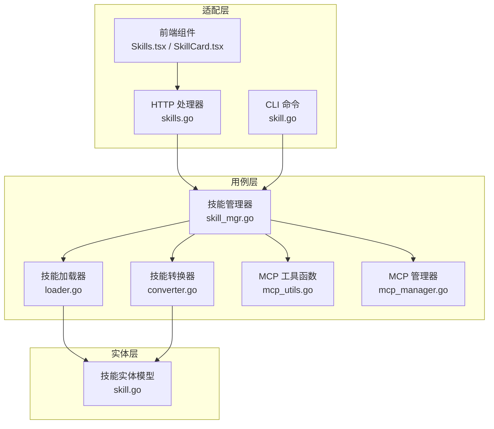
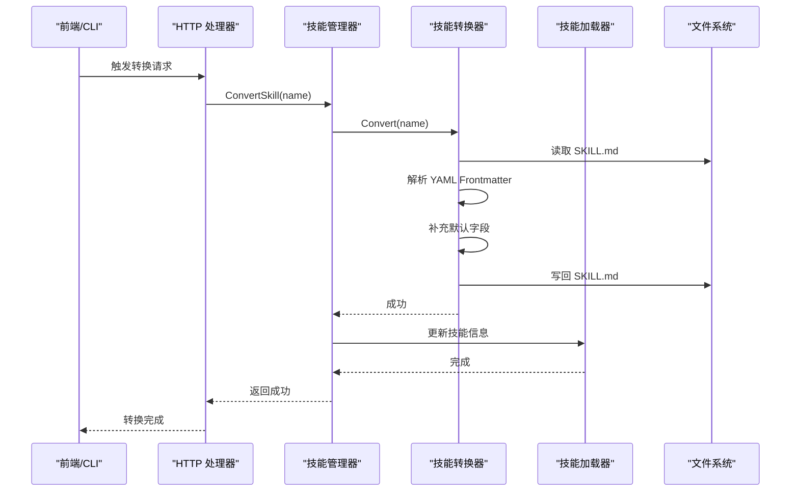
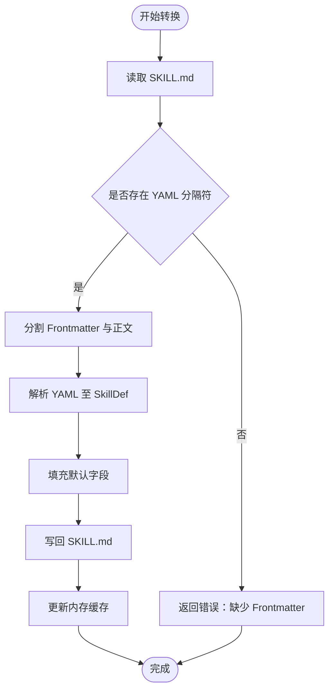
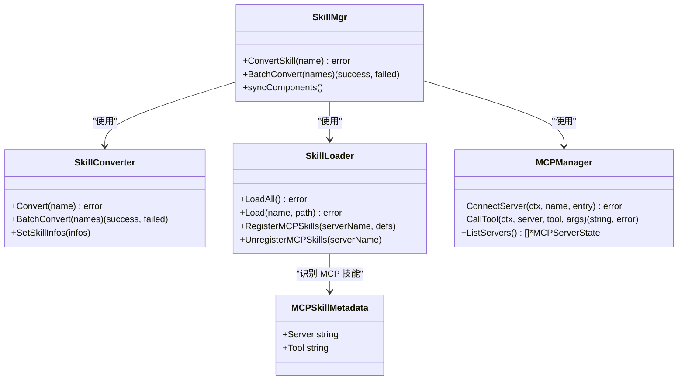

# 技能转换器

<cite>
**本文档引用的文件**
- [converter.go](file://internal/usecase/skills/converter.go)
- [skill_mgr.go](file://internal/usecase/skills/skill_mgr.go)
- [loader.go](file://internal/usecase/skills/loader.go)
- [mcp_utils.go](file://internal/usecase/skills/mcp_utils.go)
- [mcp_manager.go](file://internal/usecase/skills/mcp_manager.go)
- [skills.go](file://internal/adapters/http/handlers/skills.go)
- [skill.go](file://internal/adapters/cli/skill.go)
- [skill.go](file://internal/entity/skill.go)
- [Skills.tsx](file://dashboard/src/components/Skills.tsx)
- [SkillCard.tsx](file://dashboard/src/components/skills/SkillCard.tsx)
- [SKILL_DEVELOPMENT.md](file://internal/usecase/skills/SKILL_DEVELOPMENT.md)
</cite>

## 目录
1. [简介](#简介)
2. [项目结构](#项目结构)
3. [核心组件](#核心组件)
4. [架构总览](#架构总览)
5. [详细组件分析](#详细组件分析)
6. [依赖关系分析](#依赖关系分析)
7. [性能考量](#性能考量)
8. [故障排查指南](#故障排查指南)
9. [结论](#结论)
10. [附录](#附录)

## 简介
本文件面向 MindX 技能转换器，系统性阐述其转换机制、实现原理与最佳实践。重点覆盖以下方面：
- 不同格式技能之间的转换规则与适配策略（标准格式、外部格式、MCP 格式）
- CLI 技能、MCP 技能与其他格式技能的转换流程与数据映射
- 转换验证、错误处理与回滚机制
- 与技能管理器其他组件的协作关系
- 批量转换与单个转换的差异策略
- 配置选项、转换模板与最佳实践

## 项目结构
技能转换器位于内部用例层，围绕“加载器-转换器-执行器-索引器-管理器”的职责划分组织，HTTP 与 CLI 适配器分别提供对外接口。

图表来源
- [skills.go](file://internal/adapters/http/handlers/skills.go#L117-L140)
- [skill.go](file://internal/adapters/cli/skill.go#L242-L300)
- [loader.go](file://internal/usecase/skills/loader.go#L18-L33)
- [converter.go](file://internal/usecase/skills/converter.go#L16-L21)
- [skill_mgr.go](file://internal/usecase/skills/skill_mgr.go#L20-L34)
- [mcp_utils.go](file://internal/usecase/skills/mcp_utils.go#L1-L59)
- [mcp_manager.go](file://internal/usecase/skills/mcp_manager.go#L36-L47)
- [skill.go](file://internal/entity/skill.go#L5-L25)

章节来源
- [skills.go](file://internal/adapters/http/handlers/skills.go#L1-L496)
- [skill.go](file://internal/adapters/cli/skill.go#L1-L327)
- [loader.go](file://internal/usecase/skills/loader.go#L1-L249)
- [converter.go](file://internal/usecase/skills/converter.go#L1-L121)
- [skill_mgr.go](file://internal/usecase/skills/skill_mgr.go#L1-L558)
- [mcp_utils.go](file://internal/usecase/skills/mcp_utils.go#L1-L59)
- [mcp_manager.go](file://internal/usecase/skills/mcp_manager.go#L1-L292)
- [skill.go](file://internal/entity/skill.go#L1-L83)

## 核心组件
- 技能转换器（SkillConverter）：负责将现有技能文件标准化为标准格式，补充缺失字段并写回文件系统。
- 技能管理器（SkillMgr）：协调加载器、转换器、执行器、索引器与 MCP 管理器，提供统一的转换与批量转换入口。
- 技能加载器（SkillLoader）：解析 SKILL.md 的 YAML Frontmatter，识别技能格式（标准/外部/MCP），并构建技能信息。
- MCP 工具函数（mcp_utils.go）：识别 MCP 技能、提取元数据、将 MCP 工具转换为标准 SkillDef。
- MCP 管理器（mcp_manager.go）：连接 MCP 服务器、发现工具、调用工具并维护状态。
- 实体模型（skill.go）：定义 SkillDef、SkillInfo、参数与安装方法等数据结构。

章节来源
- [converter.go](file://internal/usecase/skills/converter.go#L16-L121)
- [skill_mgr.go](file://internal/usecase/skills/skill_mgr.go#L20-L84)
- [loader.go](file://internal/usecase/skills/loader.go#L18-L123)
- [mcp_utils.go](file://internal/usecase/skills/mcp_utils.go#L11-L59)
- [mcp_manager.go](file://internal/usecase/skills/mcp_manager.go#L36-L141)
- [skill.go](file://internal/entity/skill.go#L5-L83)

## 架构总览
技能转换器在技能生命周期中处于“加载后-执行前”的标准化阶段，确保所有技能以统一的结构进入后续流程。

图表来源
- [skills.go](file://internal/adapters/http/handlers/skills.go#L117-L140)
- [skill_mgr.go](file://internal/usecase/skills/skill_mgr.go#L282-L288)
- [converter.go](file://internal/usecase/skills/converter.go#L37-L104)
- [loader.go](file://internal/usecase/skills/loader.go#L103-L122)

## 详细组件分析

### 技能转换器（SkillConverter）
- 职责
  - 读取技能目录下的 SKILL.md
  - 解析 YAML Frontmatter，校验格式完整性
  - 对缺失字段进行标准化填充（版本号、分类、启用状态等）
  - 写回文件，更新内存中的技能信息缓存
- 关键流程
  - 前言校验：必须以 YAML 分隔符开头
  - 分割 Frontmatter 与正文
  - 反序列化 YAML 至 SkillDef
  - 标准化默认值并序列化回写
  - 更新缓存中的 Def 引用
- 并发与线程安全
  - 使用读写锁保护技能信息映射
- 批量转换
  - 遍历名称列表逐个转换，收集成功与失败结果

图表来源
- [converter.go](file://internal/usecase/skills/converter.go#L37-L104)

章节来源
- [converter.go](file://internal/usecase/skills/converter.go#L16-L121)

### 技能管理器（SkillMgr）
- 职责
  - 组合各子组件（加载器、转换器、执行器、索引器、MCP 管理器）
  - 提供单个与批量转换接口
  - 转换后同步组件状态，确保后续流程可见最新定义
- 转换接口
  - ConvertSkill(name)：单个转换
  - BatchConvert(names)：批量转换
- 与加载器协作
  - 通过 SetSkillInfos 注入技能信息映射
  - 转换完成后调用 syncComponents 同步执行器、搜索器与转换器

章节来源
- [skill_mgr.go](file://internal/usecase/skills/skill_mgr.go#L20-L84)
- [skill_mgr.go](file://internal/usecase/skills/skill_mgr.go#L282-L330)

### 技能加载器（SkillLoader）
- 职责
  - 读取 SKILL.md 并解析 YAML
  - 识别技能格式：标准、外部（通过 metadata 标记）、MCP（通过 metadata.mcp 标记）
  - 检查依赖（二进制与环境变量），计算可运行状态
  - 构建 SkillInfo（包含格式、状态、统计信息等）
- 格式识别
  - 标准：默认
  - 外部：metadata 中包含特定标记
  - MCP：metadata.mcp 包含 server 与 tool 字段
- MCP 注册与注销
  - RegisterMCPSkills：将 MCP 工具注册为技能
  - UnregisterMCPSkills：按前缀移除某服务器的所有 MCP 技能

章节来源
- [loader.go](file://internal/usecase/skills/loader.go#L60-L123)
- [loader.go](file://internal/usecase/skills/loader.go#L165-L184)
- [loader.go](file://internal/usecase/skills/loader.go#L206-L248)

### MCP 工具函数（mcp_utils.go）
- 能力
  - IsMCPSkill：判断是否为 MCP 技能
  - GetMCPSkillMetadata：提取 server 与 tool 元数据
  - MCPToolToSkillDef：将 MCP Tool 转换为标准 SkillDef，并合并标签与描述

章节来源
- [mcp_utils.go](file://internal/usecase/skills/mcp_utils.go#L16-L59)

### MCP 管理器（mcp_manager.go）
- 能力
  - 连接 MCP 服务器（支持 SSE 与 stdio 两种传输）
  - 发现工具、调用工具、维护状态
  - 断开连接、移除服务器、关闭所有连接
- 重试与错误处理
  - 根据传输类型设置不同超时
  - 对超时与临时网络错误进行有限次重试
  - 对不可恢复错误（如协议不兼容、进程崩溃）不重试

章节来源
- [mcp_manager.go](file://internal/usecase/skills/mcp_manager.go#L49-L141)
- [mcp_manager.go](file://internal/usecase/skills/mcp_manager.go#L406-L468)

### HTTP 适配器（SkillsHandler）
- 能力
  - 单个转换：convertSkill
  - 批量转换：batchConvert
  - 依赖安装：installDependencies、installRuntime
  - 技能验证：validateSkill
  - 启用/禁用：enableSkill、disableSkill
- 错误处理
  - 对转换失败、安装失败、验证失败等情况返回相应状态码与错误信息

章节来源
- [skills.go](file://internal/adapters/http/handlers/skills.go#L117-L140)
- [skills.go](file://internal/adapters/http/handlers/skills.go#L398-L429)
- [skills.go](file://internal/adapters/http/handlers/skills.go#L252-L281)

### CLI 适配器（Skills CLI）
- 能力
  - 技能列表、运行、验证、启用/禁用、重载
  - 通过 createSkillManager 初始化技能管理器并执行操作
- 参数解析
  - 支持 --key 或 --key value 形式的参数传递

章节来源
- [skill.go](file://internal/adapters/cli/skill.go#L18-L253)
- [skill.go](file://internal/adapters/cli/skill.go#L255-L300)
- [skill.go](file://internal/adapters/cli/skill.go#L312-L326)

### 前端组件（Dashboard）
- 能力
  - 展示技能列表、格式标签（标准/外部/MCP）、状态
  - 触发转换、安装依赖、查看环境变量、验证技能
- 交互
  - 转换对话框展示转换将执行的操作
  - 验证结果汇总缺失项与错误

章节来源
- [Skills.tsx](file://dashboard/src/components/Skills.tsx#L74-L124)
- [Skills.tsx](file://dashboard/src/components/Skills.tsx#L268-L291)
- [SkillCard.tsx](file://dashboard/src/components/skills/SkillCard.tsx#L14-L21)

## 依赖关系分析
- 耦合与内聚
  - SkillMgr 作为编排者，聚合多个子组件，内聚度高但耦合于各组件接口
  - Converter 与 Loader 通过 SkillInfo 映射进行松耦合交互
  - MCP 管理器与加载器通过注册/注销接口解耦
- 外部依赖
  - YAML 解析库（gopkg.in/yaml.v3）
  - MCP SDK（modelcontextprotocol/go-sdk/mcp）
  - 日志与国际化（pkg/logging、pkg/i18n）

图表来源
- [skill_mgr.go](file://internal/usecase/skills/skill_mgr.go#L20-L84)
- [converter.go](file://internal/usecase/skills/converter.go#L16-L35)
- [loader.go](file://internal/usecase/skills/loader.go#L18-L33)
- [mcp_manager.go](file://internal/usecase/skills/mcp_manager.go#L36-L47)
- [mcp_utils.go](file://internal/usecase/skills/mcp_utils.go#L11-L14)

## 性能考量
- 转换复杂度
  - 单个转换：O(1) 文件读写 + YAML 解析/序列化，受文件大小影响
  - 批量转换：O(n) 遍历，建议分批执行以避免长时间阻塞
- 并发与锁
  - 转换器使用读写锁，读多写少场景下可并行读取；写入时互斥
- I/O 与缓存
  - 转换后立即更新内存映射，减少重复解析
  - 建议在批量转换前预热加载器，降低首次解析开销

## 故障排查指南
- 常见错误与定位
  - 缺少 YAML 分隔符：检查 SKILL.md 是否以分隔符开头
  - Frontmatter 格式无效：确认三段式分隔与 YAML 语法
  - 技能不存在：确认名称与目录一致
  - 写入失败：检查权限与磁盘空间
- 错误处理策略
  - HTTP 层返回 500 并携带错误信息
  - CLI 层打印错误并退出
  - 转换失败不影响其他技能，批量转换返回成功/失败映射
- 回滚机制
  - 当前实现未提供自动回滚；建议在转换前备份 SKILL.md
  - 若出现异常，可手动恢复备份或重新加载技能

章节来源
- [converter.go](file://internal/usecase/skills/converter.go#L58-L65)
- [skills.go](file://internal/adapters/http/handlers/skills.go#L127-L134)
- [skill.go](file://internal/adapters/cli/skill.go#L38-L44)

## 结论
技能转换器通过“解析-标准化-写回”的简单流程，实现了对多种技能格式的统一与规范化，为后续执行、索引与搜索奠定基础。结合加载器的格式识别与 MCP 管理器的外部集成，系统形成了从“格式适配到能力扩展”的完整闭环。建议在生产环境中配合批量转换策略与前置备份，确保转换过程的安全与可追溯。

## 附录

### 转换规则与适配策略
- 标准格式（standard）
  - 默认格式，遵循统一的 YAML Frontmatter 字段集
  - 转换时自动补全缺失字段（版本号、分类、启用状态等）
- 外部格式（external）
  - 通过 metadata 标记外部来源，转换后仍保持该标记
  - 用于区分非标准来源的技能
- MCP 格式（mcp）
  - 通过 metadata.mcp.server 与 metadata.mcp.tool 标识
  - 转换后以标准 SkillDef 存储，保留 MCP 元数据以便后续调用

章节来源
- [loader.go](file://internal/usecase/skills/loader.go#L89-L94)
- [mcp_utils.go](file://internal/usecase/skills/mcp_utils.go#L16-L31)
- [mcp_utils.go](file://internal/usecase/skills/mcp_utils.go#L56-L59)

### 数据映射与格式标准化
- 字段映射
  - YAML Frontmatter -> SkillDef
  - 缺失字段 -> 默认值填充
  - 前端展示字段 -> Format、Status、统计信息
- 格式标准化
  - 统一 YAML 格式与缩进
  - 保留原有 Markdown 正文内容

章节来源
- [converter.go](file://internal/usecase/skills/converter.go#L70-L91)
- [skill.go](file://internal/entity/skill.go#L5-L25)

### 转换验证与错误处理
- 验证点
  - YAML Frontmatter 语法
  - 必填字段完整性
  - 技能可运行性（二进制与环境变量）
- 错误处理
  - 转换失败返回具体原因
  - 批量转换返回成功/失败集合
  - 前端展示缺失项与错误摘要

章节来源
- [skills.go](file://internal/adapters/http/handlers/skills.go#L252-L281)
- [Skills.tsx](file://dashboard/src/components/Skills.tsx#L50-L72)

### 与技能管理器其他组件的协作
- 加载器：提供技能信息映射，转换器通过 SetSkillInfos 注入
- 执行器：依赖转换后的 SkillDef 进行执行
- 索引器：基于转换后的定义生成向量索引
- MCP 管理器：注册 MCP 工具为技能，转换器不参与 MCP 工具的转换

章节来源
- [skill_mgr.go](file://internal/usecase/skills/skill_mgr.go#L87-L98)
- [loader.go](file://internal/usecase/skills/loader.go#L206-L231)

### 批量转换与单个转换策略
- 单个转换
  - 适合调试与小规模修复
  - 转换后立即同步组件
- 批量转换
  - 适合大规模迁移
  - 返回成功/失败映射，便于后续处理
  - 建议分批执行并监控日志

章节来源
- [converter.go](file://internal/usecase/skills/converter.go#L106-L120)
- [skills.go](file://internal/adapters/http/handlers/skills.go#L398-L429)

### 配置选项与最佳实践
- 配置项
  - MCP 服务器配置：传输类型（SSE/stdio）、URL/命令、认证头、环境变量
  - 技能目录：skillsDir
- 最佳实践
  - 转换前备份 SKILL.md
  - 使用批量转换时分批执行并记录日志
  - 对外部格式与 MCP 格式保持元数据一致性
  - 定期验证技能可运行性与依赖完整性

章节来源
- [mcp_manager.go](file://internal/usecase/skills/mcp_manager.go#L73-L104)
- [SKILL_DEVELOPMENT.md](file://internal/usecase/skills/SKILL_DEVELOPMENT.md#L365-L452)