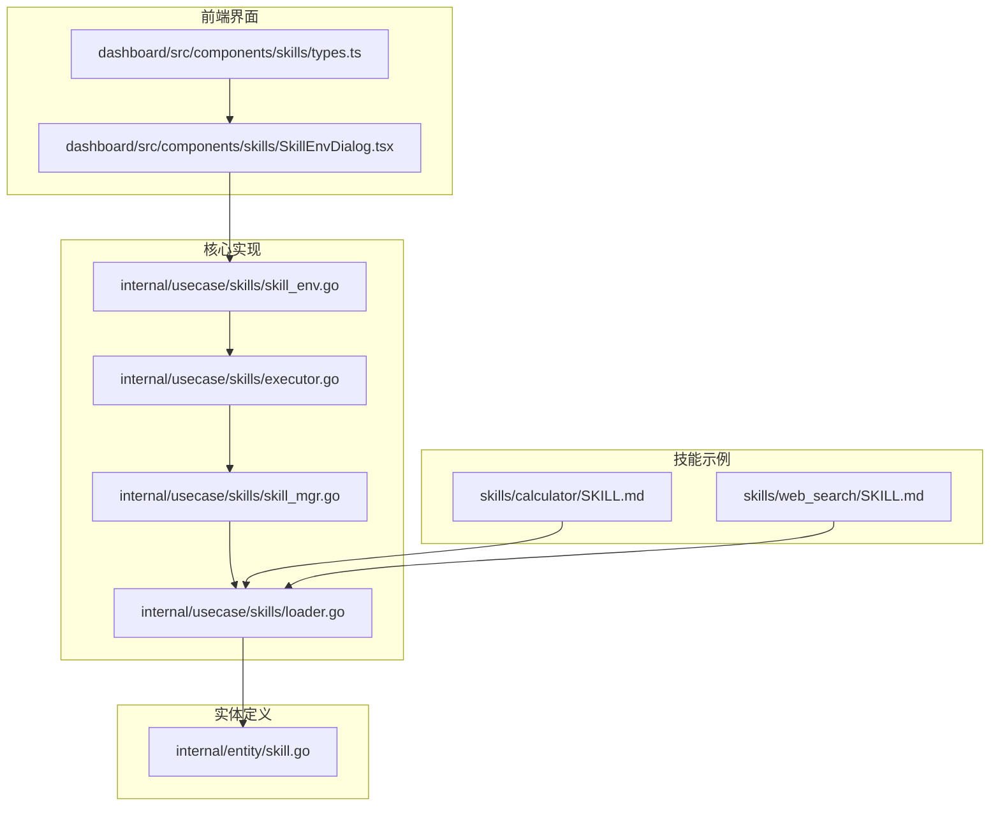
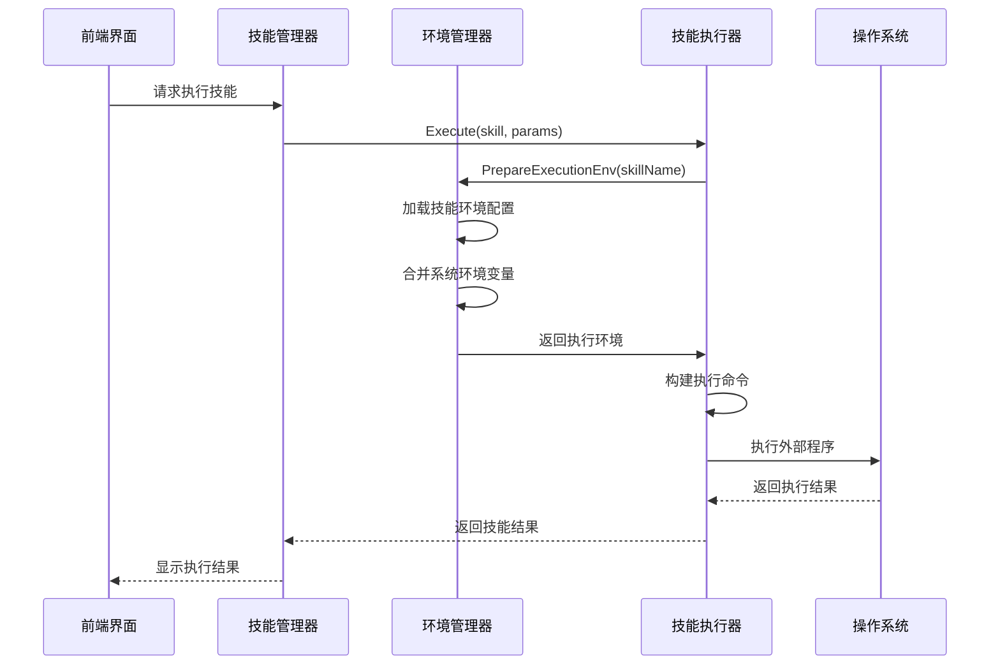
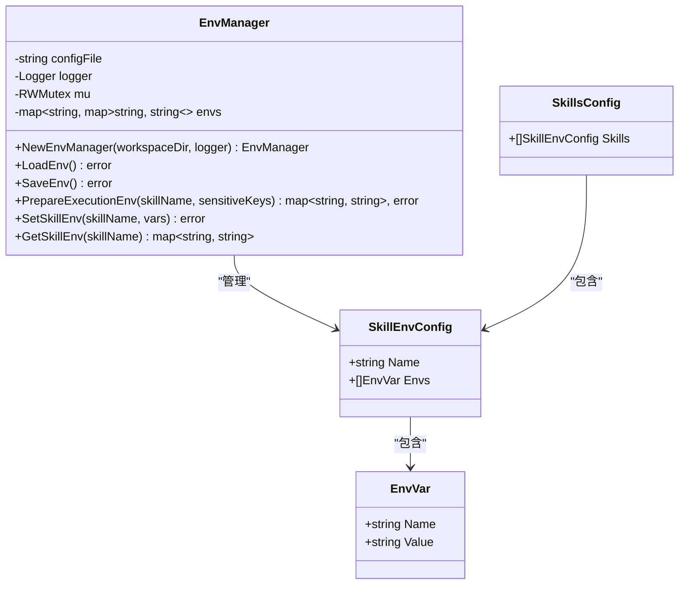
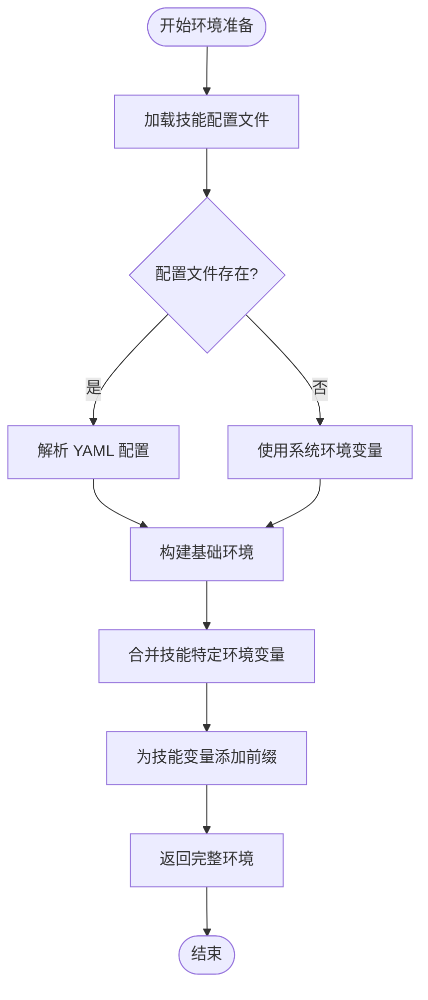
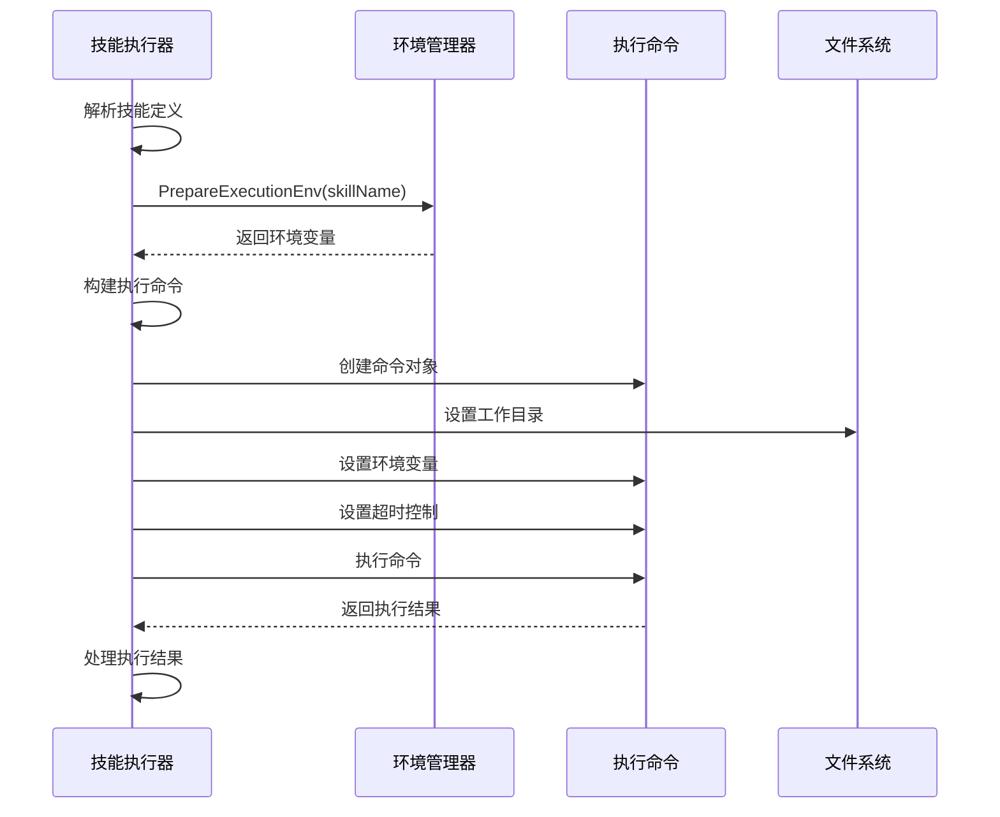
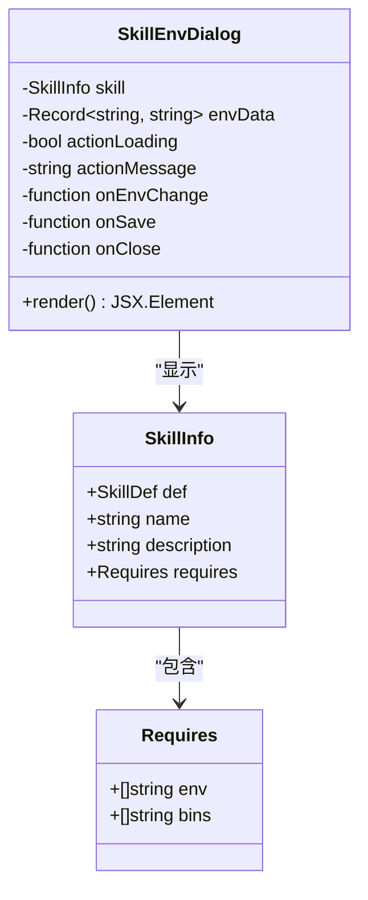
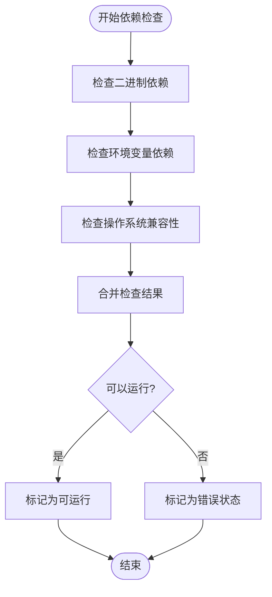

# 环境管理器

<cite>
**本文档引用的文件**
- [internal/usecase/skills/skill_env.go](file://internal/usecase/skills/skill_env.go)
- [internal/usecase/skills/executor.go](file://internal/usecase/skills/executor.go)
- [internal/usecase/skills/skill_mgr.go](file://internal/usecase/skills/skill_mgr.go)
- [internal/usecase/skills/loader.go](file://internal/usecase/skills/loader.go)
- [internal/entity/skill.go](file://internal/entity/skill.go)
- [dashboard/src/components/skills/SkillEnvDialog.tsx](file://dashboard/src/components/skills/SkillEnvDialog.tsx)
- [dashboard/src/components/skills/types.ts](file://dashboard/src/components/skills/types.ts)
- [skills/calculator/SKILL.md](file://skills/calculator/SKILL.md)
- [skills/web_search/SKILL.md](file://skills/web_search/SKILL.md)
</cite>

## 目录
1. [简介](#简介)
2. [项目结构](#项目结构)
3. [核心组件](#核心组件)
4. [架构概览](#架构概览)
5. [详细组件分析](#详细组件分析)
6. [依赖关系分析](#依赖关系分析)
7. [性能考虑](#性能考虑)
8. [故障排除指南](#故障排除指南)
9. [结论](#结论)
10. [附录](#附录)

## 简介

MindX 环境管理器是 MindX 智能体平台中的关键组件，负责管理技能执行所需的环境配置和运行时环境。该系统支持多种编程语言和运行时环境，包括 Python 虚拟环境、Node.js 环境、系统路径配置等，确保不同技能之间的环境隔离和安全性。

环境管理器的核心功能包括：
- 技能环境配置的加载和持久化
- 执行环境的动态构建和管理
- 环境变量的隔离和安全控制
- 资源限制和超时控制
- 与技能执行器的紧密协作

## 项目结构

MindX 环境管理器主要分布在以下目录中：



**图表来源**
- [internal/usecase/skills/skill_env.go](file://internal/usecase/skills/skill_env.go#L1-L151)
- [internal/usecase/skills/executor.go](file://internal/usecase/skills/executor.go#L1-L402)
- [internal/usecase/skills/skill_mgr.go](file://internal/usecase/skills/skill_mgr.go#L1-L558)

**章节来源**
- [internal/usecase/skills/skill_env.go](file://internal/usecase/skills/skill_env.go#L1-L151)
- [internal/usecase/skills/executor.go](file://internal/usecase/skills/executor.go#L1-L402)
- [internal/usecase/skills/skill_mgr.go](file://internal/usecase/skills/skill_mgr.go#L1-L558)

## 核心组件

### 环境管理器 (EnvManager)

EnvManager 是环境管理器的核心组件，负责技能环境配置的管理。它提供了以下关键功能：

- **配置文件管理**：读取和写入 skills.yml 配置文件
- **环境变量管理**：为不同技能设置和获取专用环境变量
- **线程安全**：使用 RWMutex 确保并发访问的安全性
- **动态环境构建**：根据技能需求动态构建执行环境

### 技能执行器 (SkillExecutor)

SkillExecutor 负责实际执行技能，并与环境管理器协作：

- **命令构建**：解析技能定义中的命令并构建执行命令
- **环境准备**：调用环境管理器准备执行环境
- **执行控制**：管理技能执行的超时和资源限制
- **结果处理**：处理技能执行结果和错误

### 技能管理器 (SkillMgr)

SkillMgr 作为协调者，整合各个组件：

- **组件初始化**：创建和初始化环境管理器、执行器等组件
- **生命周期管理**：管理技能系统的整个生命周期
- **状态同步**：同步各组件的状态和数据

**章节来源**
- [internal/usecase/skills/skill_env.go](file://internal/usecase/skills/skill_env.go#L28-L42)
- [internal/usecase/skills/executor.go](file://internal/usecase/skills/executor.go#L19-L42)
- [internal/usecase/skills/skill_mgr.go](file://internal/usecase/skills/skill_mgr.go#L20-L62)

## 架构概览



**图表来源**
- [internal/usecase/skills/skill_mgr.go](file://internal/usecase/skills/skill_mgr.go#L189-L211)
- [internal/usecase/skills/executor.go](file://internal/usecase/skills/executor.go#L57-L79)
- [internal/usecase/skills/skill_env.go](file://internal/usecase/skills/skill_env.go#L100-L120)

## 详细组件分析

### 环境管理器实现分析



**图表来源**
- [internal/usecase/skills/skill_env.go](file://internal/usecase/skills/skill_env.go#L14-L33)

#### 环境配置数据结构

环境管理器使用 YAML 格式的配置文件来存储技能环境信息：

| 字段名 | 类型 | 描述 | 必需 |
|--------|------|------|------|
| name | string | 技能名称 | 是 |
| envs | []EnvVar | 环境变量数组 | 否 |
| envs.name | string | 环境变量名称 | 是 |
| envs.value | string | 环境变量值 | 是 |

#### 环境准备流程



**图表来源**
- [internal/usecase/skills/skill_env.go](file://internal/usecase/skills/skill_env.go#L100-L120)

**章节来源**
- [internal/usecase/skills/skill_env.go](file://internal/usecase/skills/skill_env.go#L44-L98)
- [internal/usecase/skills/skill_env.go](file://internal/usecase/skills/skill_env.go#L100-L150)

### 技能执行器集成分析

```mermaid
classDiagram
class SkillExecutor {
-string skillsDir
-EnvManager envMgr
-Store store
-Logger logger
-RWMutex mu
-map~string, SkillInfo~ skillInfos
-map~string, InternalSkillFunc~ internalSkills
-MCPManager mcpMgr
+Execute(name, def, params) string, error
+executeExternal(name, def, params, startTime) string, error
+buildCommand(def, params) *exec.Cmd, error
+UpdateStats(name, success, duration) void
}
class EnvManager {
+PrepareExecutionEnv(skillName, sensitiveKeys) map~string, string~, error
}
class SkillDef {
+string Command
+int Timeout
+bool IsInternal
+map~string, interface{}~ Metadata
}
SkillExecutor --> EnvManager : "依赖"
SkillExecutor --> SkillDef : "使用"
```

**图表来源**
- [internal/usecase/skills/executor.go](file://internal/usecase/skills/executor.go#L19-L42)
- [internal/entity/skill.go](file://internal/entity/skill.go#L6-L25)

#### 执行流程分析



**图表来源**
- [internal/usecase/skills/executor.go](file://internal/usecase/skills/executor.go#L138-L195)
- [internal/usecase/skills/executor.go](file://internal/usecase/skills/executor.go#L218-L260)

**章节来源**
- [internal/usecase/skills/executor.go](file://internal/usecase/skills/executor.go#L57-L195)
- [internal/usecase/skills/executor.go](file://internal/usecase/skills/executor.go#L218-L260)

### 前端环境配置界面



**图表来源**
- [dashboard/src/components/skills/SkillEnvDialog.tsx](file://dashboard/src/components/skills/SkillEnvDialog.tsx#L3-L11)
- [internal/entity/skill.go](file://internal/entity/skill.go#L27-L31)

**章节来源**
- [dashboard/src/components/skills/SkillEnvDialog.tsx](file://dashboard/src/components/skills/SkillEnvDialog.tsx#L1-L58)
- [dashboard/src/components/skills/types.ts](file://dashboard/src/components/skills/types.ts#L72-L102)

## 依赖关系分析

### 技能依赖检查机制



**图表来源**
- [internal/usecase/skills/loader.go](file://internal/usecase/skills/loader.go#L186-L200)

### 环境隔离机制

环境管理器通过以下机制确保环境隔离：

1. **命名空间隔离**：为每个技能的环境变量添加前缀
2. **工作目录隔离**：每个技能在独立的工作目录中执行
3. **权限控制**：配置文件具有适当的文件权限
4. **超时控制**：防止长时间运行的技能占用资源

**章节来源**
- [internal/usecase/skills/skill_env.go](file://internal/usecase/skills/skill_env.go#L112-L117)
- [internal/usecase/skills/executor.go](file://internal/usecase/skills/executor.go#L155-L157)

## 性能考虑

### 线程安全设计

环境管理器使用读写锁确保并发访问的安全性：

- **读操作**：多个 goroutine 可以同时读取环境配置
- **写操作**：独占锁确保配置修改的原子性
- **性能优化**：减少锁竞争，提高并发性能

### 缓存策略

虽然环境管理器本身没有实现缓存，但可以通过以下方式优化性能：

1. **配置文件缓存**：在内存中缓存已解析的配置
2. **执行结果缓存**：对于重复的技能调用结果进行缓存
3. **环境变量预热**：在系统启动时预加载常用环境配置

### 资源管理

- **内存管理**：合理管理环境变量映射表的内存使用
- **文件句柄**：及时关闭不再使用的文件句柄
- **进程管理**：监控和限制技能执行的资源使用

## 故障排除指南

### 常见问题及解决方案

#### 环境配置文件无法读取

**问题症状**：
- 技能环境配置丢失
- 系统提示配置文件不存在

**解决步骤**：
1. 检查 skills.yml 文件是否存在
2. 验证文件权限设置
3. 确认 YAML 格式正确性

**章节来源**
- [internal/usecase/skills/skill_env.go](file://internal/usecase/skills/skill_env.go#L44-L47)

#### 技能执行失败

**问题症状**：
- 技能执行返回错误
- 系统日志显示执行失败

**排查步骤**：
1. 检查技能命令格式
2. 验证环境变量配置
3. 确认工作目录权限
4. 查看超时设置

**章节来源**
- [internal/usecase/skills/executor.go](file://internal/usecase/skills/executor.go#L179-L190)

#### 环境变量冲突

**问题症状**：
- 技能间环境变量相互影响
- 执行结果异常

**解决方法**：
1. 检查环境变量命名规范
2. 确认变量前缀使用
3. 验证变量作用域

### 调试技巧

1. **启用详细日志**：增加日志级别以获取更多信息
2. **环境变量验证**：使用 `env` 命令验证环境变量
3. **手动执行测试**：在相同环境下手动执行技能命令
4. **资源监控**：监控 CPU 和内存使用情况

## 结论

MindX 环境管理器通过精心设计的架构实现了技能执行环境的有效管理。其核心优势包括：

- **强隔离性**：通过命名空间和工作目录实现环境隔离
- **高安全性**：严格的权限控制和超时管理
- **良好扩展性**：支持多种编程语言和运行时环境
- **易用性**：简洁的配置接口和友好的用户界面

该系统为 MindX 平台提供了稳定可靠的技能执行环境，确保不同技能能够在隔离和安全的环境中正常运行。

## 附录

### 配置示例

#### 基本技能配置

```yaml
skills:
  - name: calculator
    envs:
      - name: API_KEY
        value: "your-api-key"
      - name: DEBUG
        value: "false"
```

#### 环境变量命名规范

- 使用 `SKILL_<技能名>_` 前缀
- 采用大写字母和下划线分隔
- 避免使用系统保留的关键字

### 最佳实践

1. **环境隔离**：为每个技能创建独立的环境变量命名空间
2. **权限最小化**：只授予技能运行所需的最小权限
3. **超时设置**：为长时间运行的技能设置合理的超时时间
4. **监控告警**：建立环境状态监控和异常告警机制
5. **备份恢复**：定期备份环境配置，建立快速恢复机制

### 安全建议

- 定期审查和更新环境变量
- 使用加密存储敏感信息
- 实施最小权限原则
- 建立审计日志记录机制
- 定期进行安全漏洞扫描