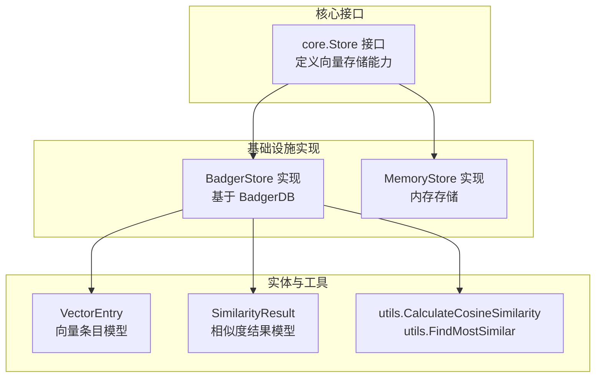
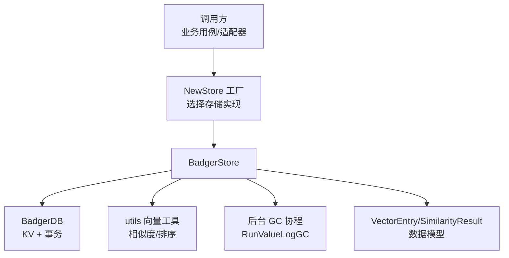
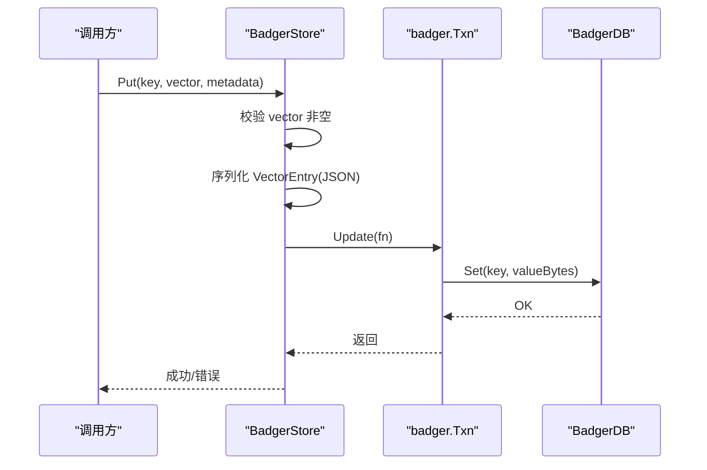
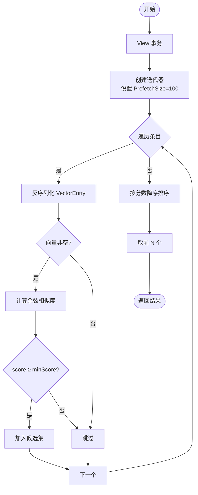
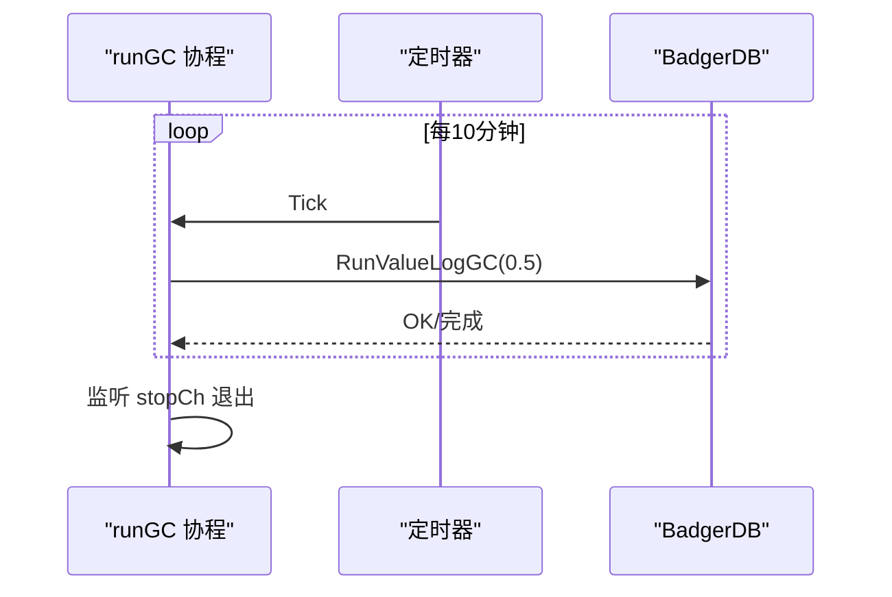
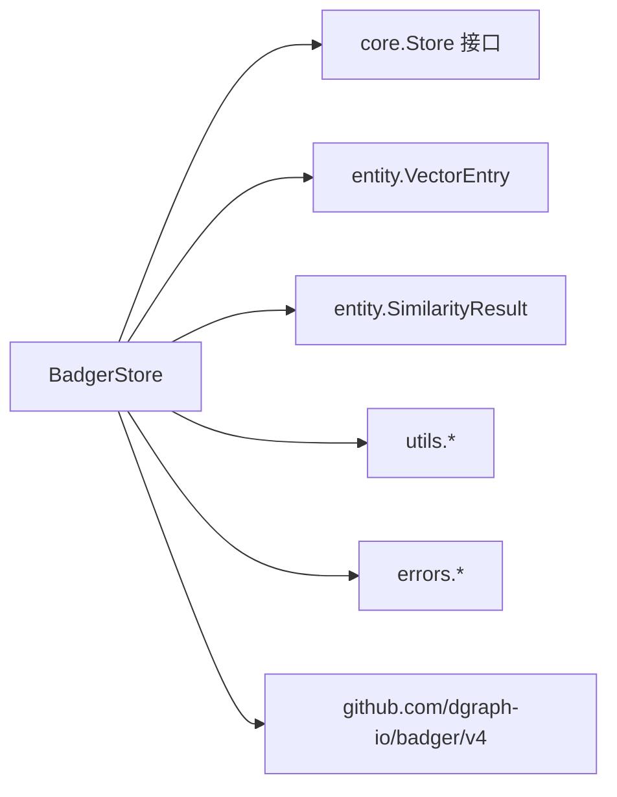

# BadgerDB 集成

<cite>
**本文引用的文件**
- [internal/infrastructure/persistence/badger_store.go](file://internal/infrastructure/persistence/badger_store.go)
- [internal/infrastructure/persistence/badger_store_test.go](file://internal/infrastructure/persistence/badger_store_test.go)
- [internal/infrastructure/persistence/store.go](file://internal/infrastructure/persistence/store.go)
- [internal/core/store.go](file://internal/core/store.go)
- [internal/entity/vector.go](file://internal/entity/vector.go)
- [internal/entity/embedding.go](file://internal/entity/embedding.go)
- [internal/utils/vector.go](file://internal/utils/vector.go)
- [internal/errors/errors.go](file://internal/errors/errors.go)
- [go.mod](file://go.mod)
- [go.sum](file://go.sum)
</cite>

## 目录
1. [简介](#简介)
2. [项目结构](#项目结构)
3. [核心组件](#核心组件)
4. [架构总览](#架构总览)
5. [详细组件分析](#详细组件分析)
6. [依赖关系分析](#依赖关系分析)
7. [性能考量](#性能考量)
8. [故障排除指南](#故障排除指南)
9. [结论](#结论)
10. [附录](#附录)

## 简介
本文件面向 MindX 中的 BadgerDB 集成，提供从配置选项、性能调优到向量存储实现与后台垃圾回收的完整技术说明。重点涵盖以下方面：
- BadgerDB 配置项与调优策略：CompactL0OnClose、NumCompactors 等关键参数的作用与影响
- 向量存储实现机制：Put、Get、Delete、Search、SearchWithThreshold、BatchPut、Scan 等核心操作的实现原理与流程
- 批量操作与扫描优化策略：迭代器 PrefetchSize、事务批处理等
- 后台垃圾回收机制：定期 Value Log GC 的触发与停止逻辑
- 存储性能监控与故障排除：常见问题定位与最佳实践
- 数据一致性与事务管理：ACID 事务在向量存储中的应用与建议

## 项目结构
MindX 的向量存储以接口抽象为核心，BadgerDB 作为具体实现之一，配合内存实现共同提供可插拔的存储能力。BadgerDB 实现位于基础设施层 persistence 包中，通过工厂方法按配置选择存储类型。



**图表来源**
- [internal/core/store.go](file://internal/core/store.go#L5-L15)
- [internal/infrastructure/persistence/badger_store.go](file://internal/infrastructure/persistence/badger_store.go#L16-L22)
- [internal/infrastructure/persistence/store.go](file://internal/infrastructure/persistence/store.go#L25-L42)
- [internal/entity/vector.go](file://internal/entity/vector.go#L5-L10)
- [internal/entity/embedding.go](file://internal/entity/embedding.go#L3-L8)
- [internal/utils/vector.go](file://internal/utils/vector.go#L10-L70)

**章节来源**
- [internal/core/store.go](file://internal/core/store.go#L5-L15)
- [internal/infrastructure/persistence/store.go](file://internal/infrastructure/persistence/store.go#L25-L42)

## 核心组件
- BadgerStore：BadgerDB 向量存储的具体实现，封装了数据库连接、向量条目序列化、事务读写、相似度计算与后台 GC。
- Store 工厂：根据配置选择 Badger 或内存存储，负责目录准备与实例创建。
- VectorEntry：向量条目模型，包含键、向量数组与元数据 JSON。
- SimilarityResult：相似度结果模型，用于承载候选匹配及其元信息。
- 向量工具：余弦相似度计算与 TopN 排序。

**章节来源**
- [internal/infrastructure/persistence/badger_store.go](file://internal/infrastructure/persistence/badger_store.go#L16-L22)
- [internal/infrastructure/persistence/store.go](file://internal/infrastructure/persistence/store.go#L25-L42)
- [internal/entity/vector.go](file://internal/entity/vector.go#L5-L10)
- [internal/entity/embedding.go](file://internal/entity/embedding.go#L3-L8)
- [internal/utils/vector.go](file://internal/utils/vector.go#L10-L70)

## 架构总览
BadgerStore 通过 BadgerDB 提供 ACID 事务能力，将 VectorEntry 序列化为 JSON 存储于键空间；查询时遍历或按前缀扫描，计算余弦相似度后返回 TopN 结果。后台任务定期触发 Value Log GC，维持存储健康。



**图表来源**
- [internal/infrastructure/persistence/store.go](file://internal/infrastructure/persistence/store.go#L25-L42)
- [internal/infrastructure/persistence/badger_store.go](file://internal/infrastructure/persistence/badger_store.go#L24-L44)
- [internal/utils/vector.go](file://internal/utils/vector.go#L10-L70)

## 详细组件分析

### BadgerStore 类与事务模型
BadgerStore 封装了数据库句柄、向量服务与嵌入提供者，并在构造时启动后台 GC 协程。其核心方法均在事务上下文中执行，确保 ACID 语义。

```mermaid
classDiagram
class BadgerStore {
-db : badger.DB
-svc : VectorService
-provider : EmbeddingProvider
-stopCh : chan struct
+Put(key, vector, metadata) error
+Get(key) *VectorEntry, error
+Delete(key) error
+Search(queryVec, topN) []VectorEntry, error
+SearchWithThreshold(queryVec, topN, minScore) []VectorEntry, error
+BatchPut(entries) error
+Scan(prefix) []VectorEntry, error
+Backup(w) (uint64, error)
+Close() error
-runGC() void
}
class VectorService {
+FindMostSimilar(queryVec, candidates, topN) []SimilarityResult
}
class VectorEntry {
+Key : string
+Vector : []float64
+Metadata : json.RawMessage
}
class SimilarityResult {
+Target : string
+Score : float64
+Metadata : map[string]interface{}
}
BadgerStore --> VectorService : "使用"
BadgerStore --> VectorEntry : "读写"
BadgerStore --> SimilarityResult : "排序输出"
```

**图表来源**
- [internal/infrastructure/persistence/badger_store.go](file://internal/infrastructure/persistence/badger_store.go#L16-L22)
- [internal/infrastructure/persistence/badger_store.go](file://internal/infrastructure/persistence/badger_store.go#L47-L63)
- [internal/infrastructure/persistence/store.go](file://internal/infrastructure/persistence/store.go#L45-L56)
- [internal/entity/vector.go](file://internal/entity/vector.go#L5-L10)
- [internal/entity/embedding.go](file://internal/entity/embedding.go#L3-L8)

**章节来源**
- [internal/infrastructure/persistence/badger_store.go](file://internal/infrastructure/persistence/badger_store.go#L16-L22)
- [internal/infrastructure/persistence/badger_store.go](file://internal/infrastructure/persistence/badger_store.go#L47-L63)
- [internal/infrastructure/persistence/store.go](file://internal/infrastructure/persistence/store.go#L45-L56)

### 配置与初始化：CompactL0OnClose、NumCompactors 等
- CompactL0OnClose：在关闭数据库时进行 L0 压缩，有助于释放空间并提升后续写入性能。
- NumCompactors：压缩器并发数，控制后台 compaction 的并行度，平衡 CPU 与 I/O。
- 日志与选项：默认日志器关闭，避免与上层日志冲突；其他选项通过 Badger 默认值管理。

这些配置直接影响写放大、读放大与存储占用，需结合数据规模与硬件资源调整。

**章节来源**
- [internal/infrastructure/persistence/badger_store.go](file://internal/infrastructure/persistence/badger_store.go#L26-L29)

### 核心操作实现原理

#### Put：向量写入
- 参数校验：向量不可为空
- 元数据处理：支持 []byte、json.RawMessage 或结构化对象的 JSON 序列化
- 事务写入：将 VectorEntry JSON 以键值形式写入



**图表来源**
- [internal/infrastructure/persistence/badger_store.go](file://internal/infrastructure/persistence/badger_store.go#L65-L99)

**章节来源**
- [internal/infrastructure/persistence/badger_store.go](file://internal/infrastructure/persistence/badger_store.go#L65-L99)

#### Get：向量读取
- 事务只读：通过 View 获取项并反序列化为 VectorEntry

**章节来源**
- [internal/infrastructure/persistence/badger_store.go](file://internal/infrastructure/persistence/badger_store.go#L101-L121)

#### Delete：向量删除
- 事务删除：直接删除对应键

**章节来源**
- [internal/infrastructure/persistence/badger_store.go](file://internal/infrastructure/persistence/badger_store.go#L123-L128)

#### Search/SearchWithThreshold：相似度检索
- 遍历策略：使用迭代器遍历所有条目，PrefetchSize 控制预取大小
- 相似度计算：对非空向量计算余弦相似度
- 过滤与排序：可设置最小阈值 minScore，随后按分数降序取前 N
- 输出：返回 VectorEntry 列表



**图表来源**
- [internal/infrastructure/persistence/badger_store.go](file://internal/infrastructure/persistence/badger_store.go#L130-L198)
- [internal/utils/vector.go](file://internal/utils/vector.go#L10-L70)

**章节来源**
- [internal/infrastructure/persistence/badger_store.go](file://internal/infrastructure/persistence/badger_store.go#L130-L198)
- [internal/utils/vector.go](file://internal/utils/vector.go#L10-L70)

#### BatchPut：批量写入
- 单事务批处理：在一次 Update 中循环写入多个条目，减少事务开销
- 容错策略：单条失败不影响整体提交（当前实现逐条写入，遇到错误即返回）

**章节来源**
- [internal/infrastructure/persistence/badger_store.go](file://internal/infrastructure/persistence/badger_store.go#L211-L229)

#### Scan：前缀扫描
- 使用 Seek + ValidForPrefix 遍历指定前缀的所有条目
- 适用于按命名空间（如 user:、item:）批量导出或清理

**章节来源**
- [internal/infrastructure/persistence/badger_store.go](file://internal/infrastructure/persistence/badger_store.go#L231-L263)

### 后台垃圾回收机制
- 触发周期：每 10 分钟触发一次
- 回收策略：持续执行 RunValueLogGC，直到返回非空错误（表示无可回收）
- 停止条件：关闭时通过 stopCh 通知协程退出



**图表来源**
- [internal/infrastructure/persistence/badger_store.go](file://internal/infrastructure/persistence/badger_store.go#L47-L63)

**章节来源**
- [internal/infrastructure/persistence/badger_store.go](file://internal/infrastructure/persistence/badger_store.go#L47-L63)

### 数据一致性与事务管理
- 事务语义：Put/Delete/BatchPut 在 Update 事务中执行；Get 在 View 事务中执行，保证读写隔离
- ACID 特性：利用 BadgerDB 的事务能力，确保写入原子性与持久性
- 最佳实践：
  - 将相关写操作放入同一事务，避免部分提交
  - 对大规模写入使用 BatchPut，减少事务次数
  - 读取与写入分离，避免长事务阻塞

**章节来源**
- [internal/infrastructure/persistence/badger_store.go](file://internal/infrastructure/persistence/badger_store.go#L96-L98)
- [internal/infrastructure/persistence/badger_store.go](file://internal/infrastructure/persistence/badger_store.go#L217-L228)

## 依赖关系分析
- 外部依赖：BadgerDB v4 作为核心 KV 引擎
- 内部依赖：core.Store 接口、entity.VectorEntry/SimilarityResult、utils 向量工具、errors 错误包装



**图表来源**
- [internal/infrastructure/persistence/badger_store.go](file://internal/infrastructure/persistence/badger_store.go#L3-L14)
- [go.mod](file://go.mod#L1-L200)
- [go.sum](file://go.sum#L45-L46)

**章节来源**
- [internal/infrastructure/persistence/badger_store.go](file://internal/infrastructure/persistence/badger_store.go#L3-L14)
- [go.mod](file://go.mod#L1-L200)
- [go.sum](file://go.sum#L45-L46)

## 性能考量
- 写入路径优化
  - 使用 BatchPut 合并多次 Set，降低事务开销
  - 控制写入频率，避免频繁小事务
- 读取路径优化
  - Search/Scan 设置合理的 PrefetchSize（当前为 100），平衡内存与吞吐
  - 使用前缀扫描替代全表遍历，减少无效解码
- 相似度计算
  - 余弦相似度计算为 O(d)（d 为向量维度），TopN 排序 O(k log k)，k 为候选数
  - 可考虑引入近似最近邻（ANN）库进一步加速大规模检索
- 压缩与 GC
  - CompactL0OnClose 与 NumCompactors 影响写放大与空间占用，需结合负载压测调参
  - 后台 GC 周期性执行，建议监控磁盘与 CPU 使用率，必要时缩短周期

[本节为通用性能指导，无需特定文件引用]

## 故障排除指南
- 常见错误类型
  - 存储错误：打开数据库失败、序列化/反序列化异常、空向量写入
  - 业务错误：键不存在、阈值过滤导致结果为空
- 定位步骤
  - 检查数据库路径与权限，确认目录存在且可写
  - 核对向量维度与非空约束，避免空向量写入
  - 使用 Scan 前缀验证键空间是否正确
  - 查看错误包装类型，区分底层异常与业务异常
- 建议
  - 在生产环境启用定期备份（Backup 方法）
  - 监控 GC 周期与磁盘占用，防止碎片堆积
  - 对高频写入场景使用 BatchPut，避免单条写入抖动

**章节来源**
- [internal/errors/errors.go](file://internal/errors/errors.go#L9-L33)
- [internal/errors/errors.go](file://internal/errors/errors.go#L93-L119)
- [internal/infrastructure/persistence/badger_store_test.go](file://internal/infrastructure/persistence/badger_store_test.go#L21-L48)
- [internal/infrastructure/persistence/badger_store_test.go](file://internal/infrastructure/persistence/badger_store_test.go#L63-L69)

## 结论
BadgerStore 为 MindX 提供了高性能、可扩展的向量存储能力。通过合理的配置（如 CompactL0OnClose、NumCompactors）、事务化的读写与后台 GC，以及针对批量与扫描的优化策略，可在多种场景下获得稳定的性能表现。建议结合实际负载进行压测与参数微调，并建立完善的监控与备份机制，确保系统的可靠性与可维护性。

[本节为总结性内容，无需特定文件引用]

## 附录

### API 一览（核心方法）
- Put(key string, vector []float64, metadata interface{}) error
- Get(key string) (*VectorEntry, error)
- Delete(key string) error
- Search(queryVec []float64, topN int) ([]VectorEntry, error)
- SearchWithThreshold(queryVec []float64, topN int, minScore float64) ([]VectorEntry, error)
- BatchPut(entries []VectorEntry) error
- Scan(prefix string) ([]VectorEntry, error)
- Close() error
- Backup(w io.Writer) (uint64, error)

**章节来源**
- [internal/core/store.go](file://internal/core/store.go#L6-L14)
- [internal/infrastructure/persistence/badger_store.go](file://internal/infrastructure/persistence/badger_store.go#L65-L263)

### 配置与调优要点
- CompactL0OnClose：关闭时压缩 L0，释放空间，适合写密集场景
- NumCompactors：压缩器并发数，CPU 与 I/O 的权衡
- PrefetchSize：迭代器预取大小，影响扫描吞吐与内存占用
- 值日志与块缓存：可通过 Badger 选项进一步优化（当前使用默认值）

**章节来源**
- [internal/infrastructure/persistence/badger_store.go](file://internal/infrastructure/persistence/badger_store.go#L26-L29)
- [internal/infrastructure/persistence/badger_store.go](file://internal/infrastructure/persistence/badger_store.go#L140-L141)
- [internal/infrastructure/persistence/badger_store.go](file://internal/infrastructure/persistence/badger_store.go#L235-L236)