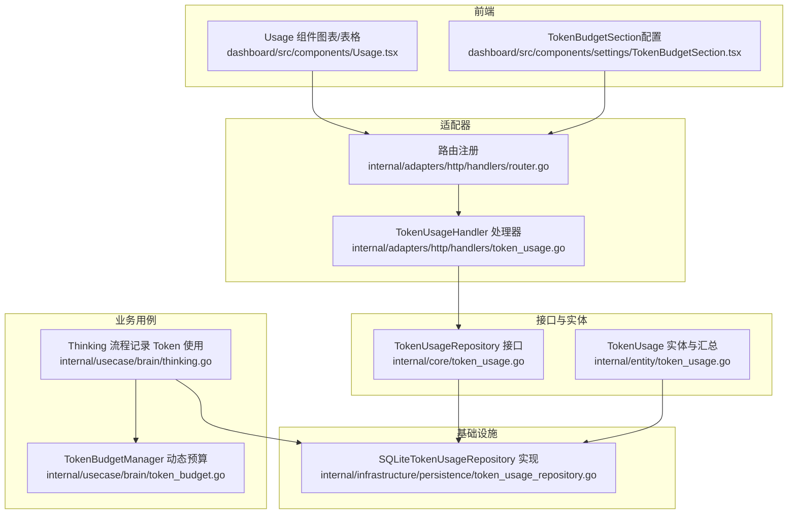
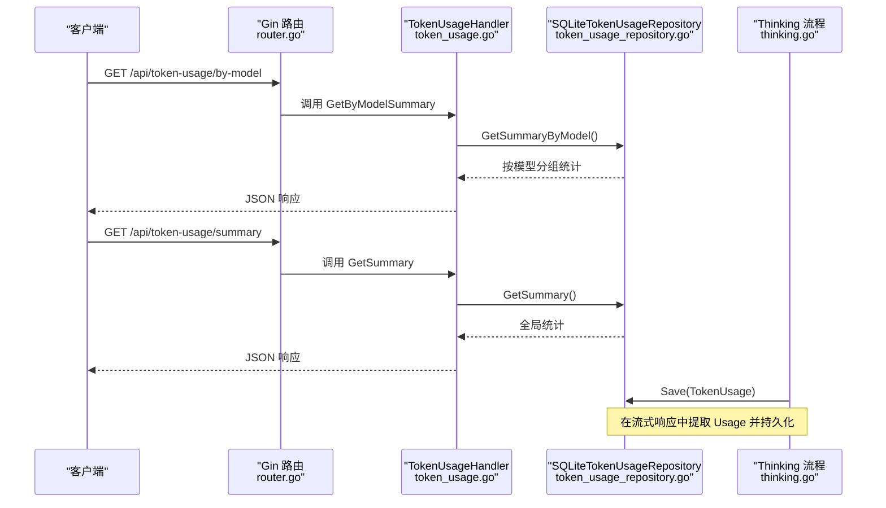
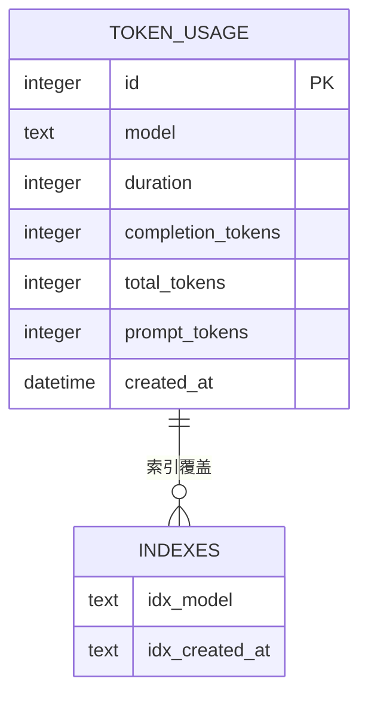
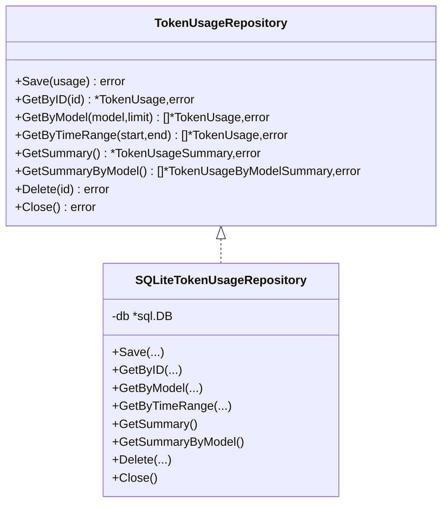
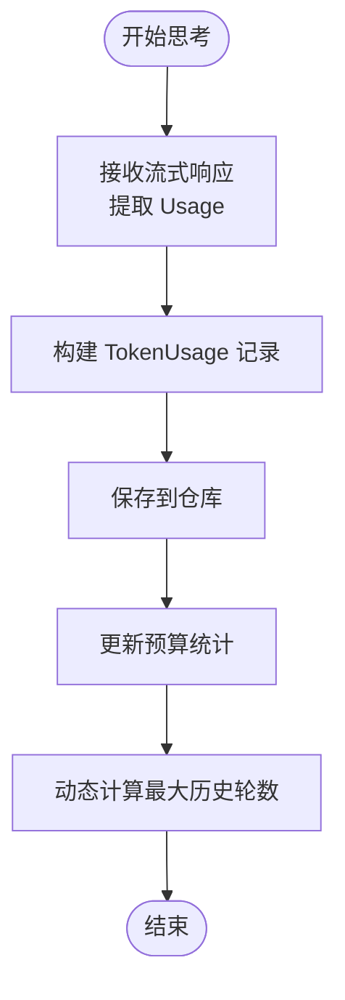
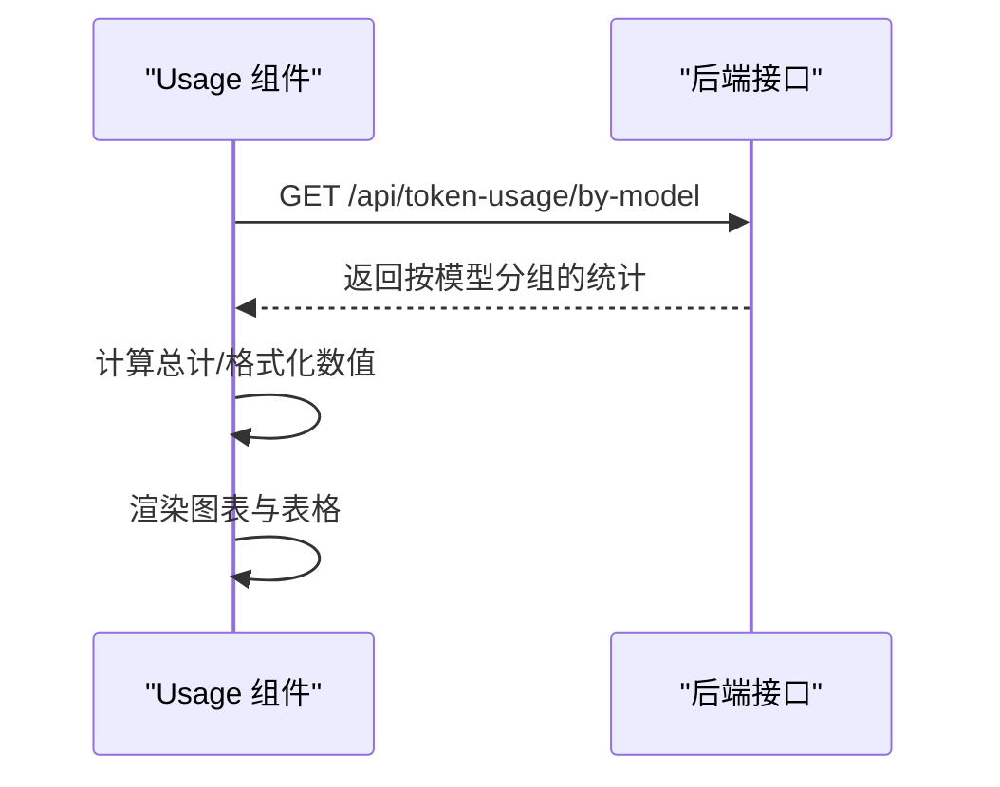
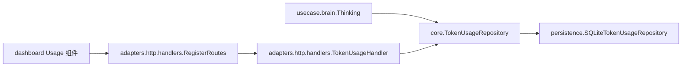

# Token 使用统计

<cite>
**本文引用的文件**
- [internal/core/token_usage.go](file://internal/core/token_usage.go)
- [internal/entity/token_usage.go](file://internal/entity/token_usage.go)
- [internal/infrastructure/persistence/token_usage_repository.go](file://internal/infrastructure/persistence/token_usage_repository.go)
- [internal/adapters/http/handlers/token_usage.go](file://internal/adapters/http/handlers/token_usage.go)
- [internal/adapters/http/handlers/router.go](file://internal/adapters/http/handlers/router.go)
- [internal/usecase/brain/thinking.go](file://internal/usecase/brain/thinking.go)
- [internal/usecase/brain/token_budget.go](file://internal/usecase/brain/token_budget.go)
- [internal/config/model.go](file://internal/config/model.go)
- [dashboard/src/components/Usage.tsx](file://dashboard/src/components/Usage.tsx)
- [dashboard/src/components/settings/TokenBudgetSection.tsx](file://dashboard/src/components/settings/TokenBudgetSection.tsx)
</cite>

## 目录
1. [简介](#简介)
2. [项目结构](#项目结构)
3. [核心组件](#核心组件)
4. [架构总览](#架构总览)
5. [组件详解](#组件详解)
6. [依赖关系分析](#依赖关系分析)
7. [性能与扩展性](#性能与扩展性)
8. [故障排查与告警](#故障排查与告警)
9. [结论](#结论)
10. [附录](#附录)

## 简介
本文件面向 MindX 的 Token 使用统计系统，系统性阐述以下主题：
- Token 使用量的跟踪机制：输入、输出与总 Token 的采集来源与计算方式
- 数据存储策略：SQLite 持久化、索引与 WAL 模式
- Token 使用仓库（Repository）的数据模型与查询接口
- 成本控制与预算管理：动态预算管理器与静态预算配置
- 使用量报告与可视化：后端接口与前端图表展示
- 分析与预测：按模型分组统计与趋势观察
- 异常检测与告警：结合指标与阈值的告警思路
- 管理员运维建议：监控、优化与配置调优

## 项目结构
围绕 Token 统计的关键代码分布在如下层次：
- 接口与实体层：定义 Token 使用记录与汇总统计的数据结构与仓库接口
- 基础设施层：SQLite 仓库实现，负责持久化与查询
- 业务用例层：思考流程中记录 Token 使用，并维护预算统计
- 适配器层：HTTP 路由与处理器，暴露统计接口
- 前端仪表盘：消费统计接口并进行可视化展示

**图示来源**
- [internal/core/token_usage.go](file://internal/core/token_usage.go#L8-L33)
- [internal/entity/token_usage.go](file://internal/entity/token_usage.go#L5-L37)
- [internal/infrastructure/persistence/token_usage_repository.go](file://internal/infrastructure/persistence/token_usage_repository.go#L12-L43)
- [internal/usecase/brain/thinking.go](file://internal/usecase/brain/thinking.go#L295-L319)
- [internal/usecase/brain/token_budget.go](file://internal/usecase/brain/token_budget.go#L10-L25)
- [internal/adapters/http/handlers/token_usage.go](file://internal/adapters/http/handlers/token_usage.go#L10-L18)
- [internal/adapters/http/handlers/router.go](file://internal/adapters/http/handlers/router.go#L126-L132)
- [dashboard/src/components/Usage.tsx](file://dashboard/src/components/Usage.tsx#L17-L42)
- [dashboard/src/components/settings/TokenBudgetSection.tsx](file://dashboard/src/components/settings/TokenBudgetSection.tsx#L9-L46)

**章节来源**
- [internal/core/token_usage.go](file://internal/core/token_usage.go#L8-L33)
- [internal/entity/token_usage.go](file://internal/entity/token_usage.go#L5-L37)
- [internal/infrastructure/persistence/token_usage_repository.go](file://internal/infrastructure/persistence/token_usage_repository.go#L12-L43)
- [internal/adapters/http/handlers/router.go](file://internal/adapters/http/handlers/router.go#L126-L132)

## 核心组件
- Token 使用仓库接口：定义保存、查询、汇总与删除等能力
- 实体模型：记录单次调用的输入/输出/总 Token、耗时与时间戳；提供全局与按模型分组的汇总
- SQLite 仓库实现：建表、索引、WAL 模式、增删改查与聚合查询
- 思考流程：在流式响应中提取 Usage，写入仓库并更新预算统计
- HTTP 处理器与路由：对外提供按模型分组与总统计的查询接口
- 前端 Usage 组件：拉取接口数据，渲染统计卡片、柱状图与表格
- 预算配置：保留输出 Token、最小历史轮数、初始平均每轮 Token

**章节来源**
- [internal/core/token_usage.go](file://internal/core/token_usage.go#L8-L33)
- [internal/entity/token_usage.go](file://internal/entity/token_usage.go#L5-L37)
- [internal/infrastructure/persistence/token_usage_repository.go](file://internal/infrastructure/persistence/token_usage_repository.go#L46-L64)
- [internal/usecase/brain/thinking.go](file://internal/usecase/brain/thinking.go#L295-L319)
- [internal/adapters/http/handlers/token_usage.go](file://internal/adapters/http/handlers/token_usage.go#L20-L48)
- [dashboard/src/components/Usage.tsx](file://dashboard/src/components/Usage.tsx#L17-L42)
- [internal/config/model.go](file://internal/config/model.go#L24-L28)

## 架构总览
下图展示了从“思考”到“统计”的完整链路，以及“前端可视化”的接入点。

**图示来源**
- [internal/adapters/http/handlers/router.go](file://internal/adapters/http/handlers/router.go#L126-L132)
- [internal/adapters/http/handlers/token_usage.go](file://internal/adapters/http/handlers/token_usage.go#L20-L48)
- [internal/infrastructure/persistence/token_usage_repository.go](file://internal/infrastructure/persistence/token_usage_repository.go#L194-L271)
- [internal/usecase/brain/thinking.go](file://internal/usecase/brain/thinking.go#L295-L319)

## 组件详解

### 数据模型与存储策略
- 数据模型
  - 单条记录包含：模型名、耗时（毫秒）、补全 Token、总 Token、提示 Token、创建时间
  - 汇总统计包含：总请求次数、总时长、总 Token、Prompt/Completion Token 总量、平均每请求 Token 与耗时
- 存储策略
  - SQLite 表结构包含主键自增、模型与时间索引，提升按模型与时间范围查询效率
  - 启用 WAL 模式以提升并发读写性能
  - 提供按模型、时间范围、ID 查询与删除能力，以及全局与按模型分组的聚合查询

**图示来源**
- [internal/infrastructure/persistence/token_usage_repository.go](file://internal/infrastructure/persistence/token_usage_repository.go#L46-L64)

**章节来源**
- [internal/entity/token_usage.go](file://internal/entity/token_usage.go#L5-L37)
- [internal/infrastructure/persistence/token_usage_repository.go](file://internal/infrastructure/persistence/token_usage_repository.go#L46-L64)
- [internal/infrastructure/persistence/token_usage_repository.go](file://internal/infrastructure/persistence/token_usage_repository.go#L194-L271)

### 仓库接口与实现
- 接口能力
  - 保存、按 ID/模型/时间范围查询、删除
  - 全局与按模型分组的统计汇总
- 实现要点
  - 建表与索引在初始化阶段完成
  - 聚合查询使用 COUNT/SUM/COALESCE 计算总量与平均值
  - 按模型分组排序按总 Token 降序

**图示来源**
- [internal/core/token_usage.go](file://internal/core/token_usage.go#L8-L33)
- [internal/infrastructure/persistence/token_usage_repository.go](file://internal/infrastructure/persistence/token_usage_repository.go#L12-L43)

**章节来源**
- [internal/core/token_usage.go](file://internal/core/token_usage.go#L8-L33)
- [internal/infrastructure/persistence/token_usage_repository.go](file://internal/infrastructure/persistence/token_usage_repository.go#L66-L92)
- [internal/infrastructure/persistence/token_usage_repository.go](file://internal/infrastructure/persistence/token_usage_repository.go#L119-L192)
- [internal/infrastructure/persistence/token_usage_repository.go](file://internal/infrastructure/persistence/token_usage_repository.go#L194-L271)

### Token 使用记录采集与预算统计
- 采集来源
  - 思考流程在流式响应中提取 Usage（Prompt/Completion/Total），计算耗时，封装为 TokenUsage 并保存
- 预算统计
  - 动态预算管理器记录累计输入/输出 Token 与轮数，平滑更新平均每轮 Token
  - 根据模型最大 Token、预留输出 Token、系统提示 Token 与最小历史轮数，动态计算最大历史轮数
  - 提供节省估算：比较静态与动态预算下的最大轮数差异

**图示来源**
- [internal/usecase/brain/thinking.go](file://internal/usecase/brain/thinking.go#L295-L319)
- [internal/usecase/brain/token_budget.go](file://internal/usecase/brain/token_budget.go#L51-L130)

**章节来源**
- [internal/usecase/brain/thinking.go](file://internal/usecase/brain/thinking.go#L295-L319)
- [internal/usecase/brain/token_budget.go](file://internal/usecase/brain/token_budget.go#L10-L25)
- [internal/usecase/brain/token_budget.go](file://internal/usecase/brain/token_budget.go#L51-L130)

### 成本控制与预算管理
- 配置项
  - 预留输出 Token：为模型输出保留的 Token 额度
  - 最小历史轮数：即使预算允许更高轮数，也至少保留的轮数
  - 初始平均每轮 Token：预算估算的起点
- 动态调整
  - 通过实际运行时的平均输入 Token 平滑更新，避免估算偏差导致的历史轮数不足或浪费
  - 估算节省：比较静态与动态预算下的最大轮数差额与改善比例

**章节来源**
- [internal/config/model.go](file://internal/config/model.go#L24-L28)
- [internal/usecase/brain/token_budget.go](file://internal/usecase/brain/token_budget.go#L178-L226)

### 使用量报告与可视化
- 后端接口
  - GET /api/token-usage/by-model：按模型分组统计
  - GET /api/token-usage/summary：全局统计
- 前端展示
  - Usage 组件：拉取接口数据，渲染统计卡片（总 Token、总请求、总时长）、柱状图（总 Token/Prompt/Completion）与表格
  - TokenBudgetSection：提供预算配置项的编辑入口

**图示来源**
- [internal/adapters/http/handlers/router.go](file://internal/adapters/http/handlers/router.go#L126-L132)
- [internal/adapters/http/handlers/token_usage.go](file://internal/adapters/http/handlers/token_usage.go#L20-L48)
- [dashboard/src/components/Usage.tsx](file://dashboard/src/components/Usage.tsx#L26-L42)

**章节来源**
- [internal/adapters/http/handlers/router.go](file://internal/adapters/http/handlers/router.go#L126-L132)
- [internal/adapters/http/handlers/token_usage.go](file://internal/adapters/http/handlers/token_usage.go#L20-L48)
- [dashboard/src/components/Usage.tsx](file://dashboard/src/components/Usage.tsx#L17-L42)
- [dashboard/src/components/settings/TokenBudgetSection.tsx](file://dashboard/src/components/settings/TokenBudgetSection.tsx#L9-L46)

### 分析与趋势预测
- 按模型分组统计可用于识别高消耗模型与异常峰值
- 时间序列可基于 created_at 字段进行聚合（如按日/小时），结合历史窗口观察趋势
- 建议：在仓库层扩展按时间粒度的聚合查询，前端提供时间选择器与多维度筛选

**章节来源**
- [internal/infrastructure/persistence/token_usage_repository.go](file://internal/infrastructure/persistence/token_usage_repository.go#L159-L192)
- [internal/infrastructure/persistence/token_usage_repository.go](file://internal/infrastructure/persistence/token_usage_repository.go#L226-L271)

### 异常使用检测与告警
- 指标埋点：Prometheus 指标记录成功/失败次数与各模型的 Prompt/Completion Token 总量
- 告警思路：基于阈值（如单请求 Token 超过阈值、模型总 Token 突增、平均耗时异常）触发告警
- 建议：结合前端“总时长/秒”展示与后端指标，设置多级阈值与抑制策略

**章节来源**
- [internal/usecase/brain/thinking.go](file://internal/usecase/brain/thinking.go#L257-L262)

## 依赖关系分析
- 低耦合接口：核心接口与实现分离，便于替换存储后端
- 明确边界：业务用例仅依赖接口，不直接依赖具体实现
- 可观测性：通过中间件与日志记录关键事件，便于排障

**图示来源**
- [internal/core/token_usage.go](file://internal/core/token_usage.go#L8-L33)
- [internal/infrastructure/persistence/token_usage_repository.go](file://internal/infrastructure/persistence/token_usage_repository.go#L12-L43)
- [internal/usecase/brain/thinking.go](file://internal/usecase/brain/thinking.go#L295-L319)
- [internal/adapters/http/handlers/token_usage.go](file://internal/adapters/http/handlers/token_usage.go#L10-L18)
- [internal/adapters/http/handlers/router.go](file://internal/adapters/http/handlers/router.go#L126-L132)
- [dashboard/src/components/Usage.tsx](file://dashboard/src/components/Usage.tsx#L17-L42)

**章节来源**
- [internal/core/token_usage.go](file://internal/core/token_usage.go#L8-L33)
- [internal/infrastructure/persistence/token_usage_repository.go](file://internal/infrastructure/persistence/token_usage_repository.go#L12-L43)
- [internal/adapters/http/handlers/router.go](file://internal/adapters/http/handlers/router.go#L126-L132)

## 性能与扩展性
- 存储层
  - WAL 模式提升并发读写吞吐
  - 模型与时间索引加速查询
- 查询层
  - 聚合查询使用 COALESCE 保证空集安全
  - 按模型分组排序按总 Token 降序，便于快速定位高消耗模型
- 扩展建议
  - 引入时间序列聚合（按日/小时）与滚动窗口统计
  - 支持分页与过滤参数，避免一次性返回大量数据
  - 可选替换为更强大的时序数据库或 OLAP 引擎以支撑更大规模

[本节为通用建议，无需特定文件引用]

## 故障排查与告警
- 常见问题
  - 保存失败：检查数据库连接、路径权限与 WAL 模式启用
  - 查询为空：确认模型名是否正确、时间范围是否合理
  - 预算异常：核对预留输出 Token、最小历史轮数与初始平均每轮 Token
- 告警建议
  - 单请求 Token 异常：超过阈值即告警
  - 模型总 Token 突增：设置环比阈值
  - 平均耗时异常：超过基线一定比例触发

**章节来源**
- [internal/infrastructure/persistence/token_usage_repository.go](file://internal/infrastructure/persistence/token_usage_repository.go#L18-L43)
- [internal/infrastructure/persistence/token_usage_repository.go](file://internal/infrastructure/persistence/token_usage_repository.go#L273-L291)
- [internal/usecase/brain/token_budget.go](file://internal/usecase/brain/token_budget.go#L178-L226)

## 结论
MindX 的 Token 使用统计体系以清晰的接口抽象、可靠的 SQLite 存储与完善的前端可视化为基础，结合动态预算管理与指标埋点，实现了从“采集—存储—分析—告警”的闭环。通过持续优化查询与扩展聚合能力，可进一步支撑更大规模的生产环境。

[本节为总结，无需特定文件引用]

## 附录

### API 规范（后端）
- GET /api/token-usage/by-model
  - 返回：按模型分组的统计列表（请求次数、总/平均耗时、总/平均 Token 等）
- GET /api/token-usage/summary
  - 返回：全局统计（总请求、总耗时、总 Token、平均/请求）

**章节来源**
- [internal/adapters/http/handlers/router.go](file://internal/adapters/http/handlers/router.go#L126-L132)
- [internal/adapters/http/handlers/token_usage.go](file://internal/adapters/http/handlers/token_usage.go#L20-L48)

### 前端组件要点
- Usage 组件：定时刷新、错误处理、图表与表格渲染
- TokenBudgetSection：预算配置项的双向绑定与更新回调

**章节来源**
- [dashboard/src/components/Usage.tsx](file://dashboard/src/components/Usage.tsx#L17-L42)
- [dashboard/src/components/settings/TokenBudgetSection.tsx](file://dashboard/src/components/settings/TokenBudgetSection.tsx#L9-L46)