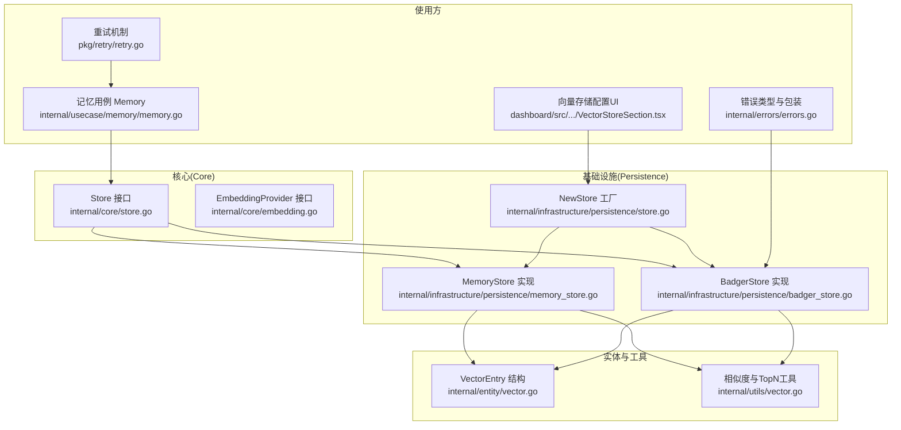
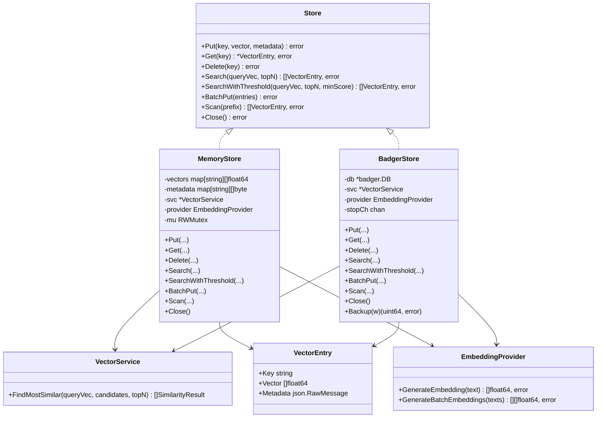
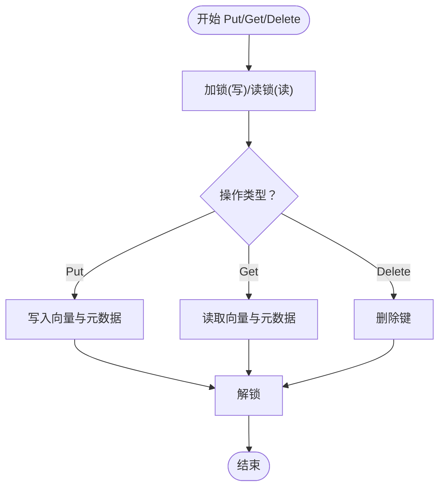
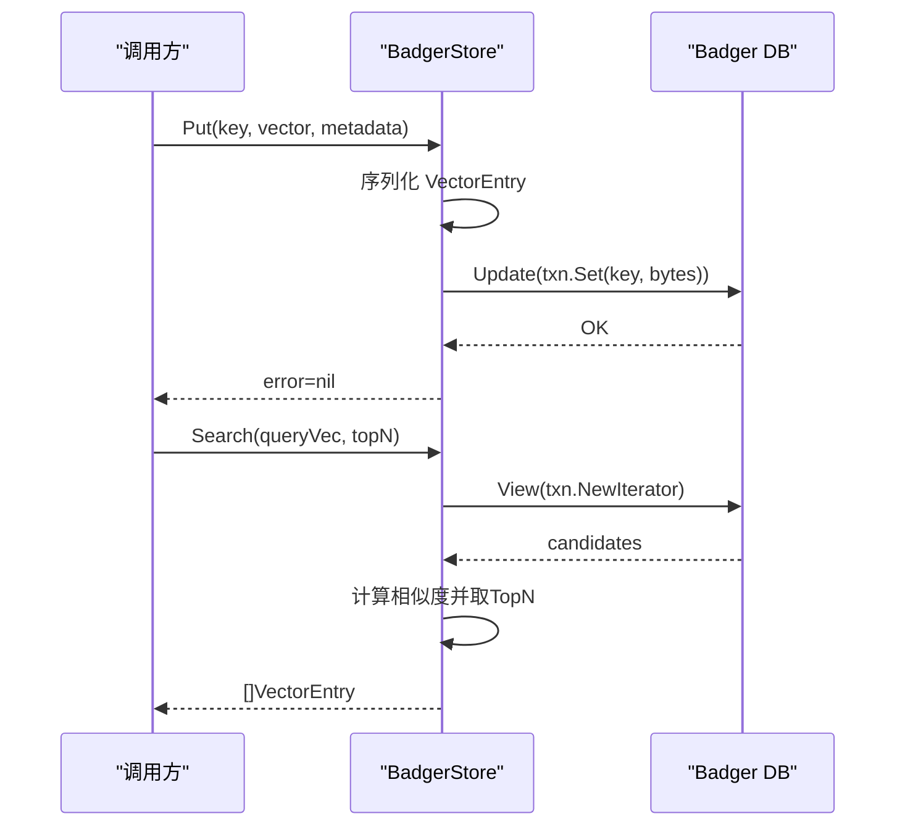
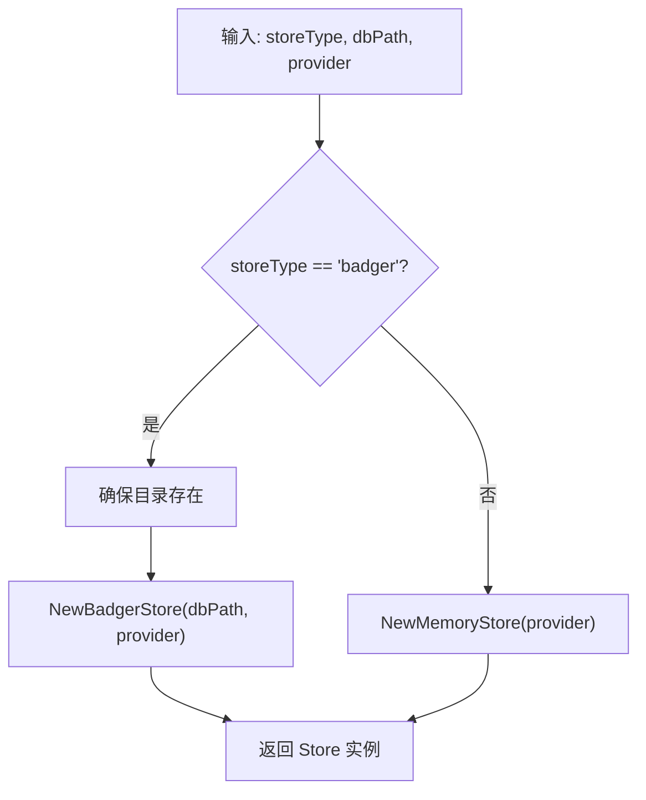
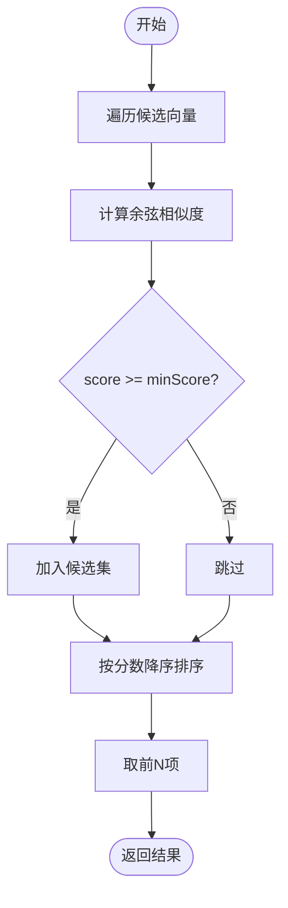
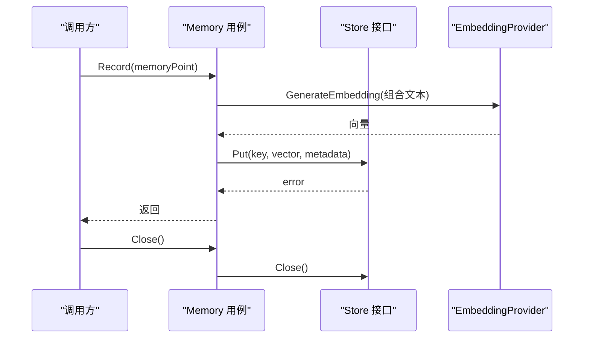
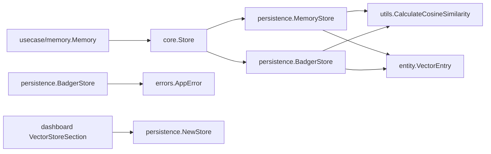

# 存储抽象层

<cite>
**本文引用的文件**
- [internal/core/store.go](file://internal/core/store.go)
- [internal/infrastructure/persistence/store.go](file://internal/infrastructure/persistence/store.go)
- [internal/infrastructure/persistence/memory_store.go](file://internal/infrastructure/persistence/memory_store.go)
- [internal/infrastructure/persistence/badger_store.go](file://internal/infrastructure/persistence/badger_store.go)
- [internal/infrastructure/persistence/memory_store_test.go](file://internal/infrastructure/persistence/memory_store_test.go)
- [internal/infrastructure/persistence/badger_store_test.go](file://internal/infrastructure/persistence/badger_store_test.go)
- [internal/entity/vector.go](file://internal/entity/vector.go)
- [internal/utils/vector.go](file://internal/utils/vector.go)
- [internal/core/embedding.go](file://internal/core/embedding.go)
- [internal/usecase/memory/memory.go](file://internal/usecase/memory/memory.go)
- [pkg/retry/retry.go](file://pkg/reetry/retry.go)
- [internal/errors/errors.go](file://internal/errors/errors.go)
- [dashboard/src/components/settings/VectorStoreSection.tsx](file://dashboard/src/components/settings/VectorStoreSection.tsx)
</cite>

## 目录
1. [简介](#简介)
2. [项目结构](#项目结构)
3. [核心组件](#核心组件)
4. [架构总览](#架构总览)
5. [详细组件分析](#详细组件分析)
6. [依赖关系分析](#依赖关系分析)
7. [性能考量与优化](#性能考量与优化)
8. [故障排查指南](#故障排查指南)
9. [结论](#结论)
10. [附录](#附录)

## 简介
本文件面向 MindX 的存储抽象层，系统性阐述存储接口的设计理念、抽象层次与实现策略；对比内存存储与持久化存储（Badger）在行为、性能与适用场景上的差异；说明存储适配器模式的应用与扩展方法；解释错误处理与重试机制；给出性能优化与缓存策略的实现指南；并提供单元测试与集成测试的方法与最佳实践，帮助开发者快速上手并安全地扩展自定义存储实现。

## 项目结构
存储抽象层位于 internal 核心与基础设施之间，通过统一的 Store 接口向上屏蔽底层实现差异，向下分别提供内存与 Badger 两种实现。同时，工具与实体层提供相似度计算与向量条目结构支持。

图表来源
- [internal/core/store.go](file://internal/core/store.go#L5-L15)
- [internal/infrastructure/persistence/store.go](file://internal/infrastructure/persistence/store.go#L25-L43)
- [internal/infrastructure/persistence/memory_store.go](file://internal/infrastructure/persistence/memory_store.go#L13-L30)
- [internal/infrastructure/persistence/badger_store.go](file://internal/infrastructure/persistence/badger_store.go#L16-L44)
- [internal/entity/vector.go](file://internal/entity/vector.go#L5-L10)
- [internal/utils/vector.go](file://internal/utils/vector.go#L10-L70)
- [internal/usecase/memory/memory.go](file://internal/usecase/memory/memory.go#L18-L26)
- [pkg/retry/retry.go](file://pkg/retry/retry.go#L75-L107)
- [internal/errors/errors.go](file://internal/errors/errors.go#L9-L33)
- [dashboard/src/components/settings/VectorStoreSection.tsx](file://dashboard/src/components/settings/VectorStoreSection.tsx#L9-L38)

章节来源
- [internal/core/store.go](file://internal/core/store.go#L1-L16)
- [internal/infrastructure/persistence/store.go](file://internal/infrastructure/persistence/store.go#L1-L57)

## 核心组件
- Store 接口：定义向量存储的统一能力集，包括增删改查、批量写入、扫描与关闭。
- MemoryStore：基于内存的向量存储实现，适合开发测试与小规模数据。
- BadgerStore：基于 Badger 的持久化向量存储实现，具备后台 GC、批量写入与前缀扫描等特性。
- NewStore 工厂：根据配置选择具体存储实现，支持 memory 与 badger 两种类型。
- VectorEntry：向量条目结构，包含键、向量与元数据。
- SimilarityResult/工具：提供余弦相似度计算与 TopN 排序。
- EmbeddingProvider：嵌入生成接口，为存储写入提供向量数据。
- Memory 用例：消费 Store 接口进行记忆记录与清理。
- 错误体系：统一的错误类型与包装，便于上层识别与处理。
- 重试机制：通用的指数退避重试逻辑，可应用于外部依赖或存储操作。

章节来源
- [internal/core/store.go](file://internal/core/store.go#L5-L15)
- [internal/infrastructure/persistence/memory_store.go](file://internal/infrastructure/persistence/memory_store.go#L13-L30)
- [internal/infrastructure/persistence/badger_store.go](file://internal/infrastructure/persistence/badger_store.go#L16-L44)
- [internal/infrastructure/persistence/store.go](file://internal/infrastructure/persistence/store.go#L25-L43)
- [internal/entity/vector.go](file://internal/entity/vector.go#L5-L10)
- [internal/utils/vector.go](file://internal/utils/vector.go#L10-L70)
- [internal/core/embedding.go](file://internal/core/embedding.go#L3-L7)
- [internal/usecase/memory/memory.go](file://internal/usecase/memory/memory.go#L18-L26)
- [internal/errors/errors.go](file://internal/errors/errors.go#L9-L33)
- [pkg/retry/retry.go](file://pkg/retry/retry.go#L75-L107)

## 架构总览
存储抽象层采用“接口 + 工厂 + 多实现”的适配器模式：
- 上层仅依赖 Store 接口，不感知具体实现。
- 工厂根据配置动态创建内存或持久化存储实例。
- 具体实现负责数据持久化、并发控制、相似度计算与批处理等细节。
- 使用方（如记忆用例）通过 Store 完成读写与检索。

图表来源
- [internal/core/store.go](file://internal/core/store.go#L5-L15)
- [internal/infrastructure/persistence/memory_store.go](file://internal/infrastructure/persistence/memory_store.go#L13-L30)
- [internal/infrastructure/persistence/badger_store.go](file://internal/infrastructure/persistence/badger_store.go#L16-L44)
- [internal/entity/vector.go](file://internal/entity/vector.go#L5-L10)
- [internal/utils/vector.go](file://internal/utils/vector.go#L31-L70)
- [internal/core/embedding.go](file://internal/core/embedding.go#L3-L7)

## 详细组件分析

### Store 接口与抽象层次
- 设计目标：以最小必要方法覆盖向量存储的常见需求，保证上层业务无感切换实现。
- 方法职责：
  - Put/Get/Delete：单条向量的增删改查。
  - Search/SearchWithThreshold：相似度检索与阈值过滤。
  - BatchPut：批量写入，提升吞吐。
  - Scan：按前缀扫描，支持命名空间式组织。
  - Close：资源释放。
- 抽象优势：将“如何存储”与“何时存储”解耦，便于替换与扩展。

章节来源
- [internal/core/store.go](file://internal/core/store.go#L5-L15)

### 内存存储 MemoryStore
- 并发模型：读写锁保护，读多写少场景友好。
- 数据结构：键到向量与元数据的映射，序列化元数据以便跨层传递。
- 检索流程：遍历所有向量计算余弦相似度，再取 TopN。
- 批量写入：加锁后批量插入，避免频繁加锁开销。
- 前缀扫描：按前缀筛选返回条目集合。
- 适用场景：开发测试、临时数据、小规模数据。

图表来源
- [internal/infrastructure/persistence/memory_store.go](file://internal/infrastructure/persistence/memory_store.go#L32-L76)

章节来源
- [internal/infrastructure/persistence/memory_store.go](file://internal/infrastructure/persistence/memory_store.go#L13-L177)

### 持久化存储 BadgerStore
- 持久化：基于 Badger KV，支持 ACID 事务与高并发读写。
- 资源管理：后台定时触发 Value Log GC，降低磁盘占用。
- 写入策略：单条写入与批量写入均使用事务，确保一致性。
- 检索策略：迭代器遍历候选，计算相似度后取 TopN。
- 前缀扫描：利用 Seek+Prefix 迭代器高效匹配。
- 错误处理：对关键错误进行包装，携带存储类型上下文。
- 适用场景：生产环境、需要持久化的长期数据。

图表来源
- [internal/infrastructure/persistence/badger_store.go](file://internal/infrastructure/persistence/badger_store.go#L65-L121)
- [internal/infrastructure/persistence/badger_store.go](file://internal/infrastructure/persistence/badger_store.go#L135-L198)

章节来源
- [internal/infrastructure/persistence/badger_store.go](file://internal/infrastructure/persistence/badger_store.go#L16-L264)

### 存储工厂 NewStore 与选择机制
- 类型选择：当 storeType 为 badger 时创建 BadgerStore，并确保数据目录存在；否则默认返回 MemoryStore。
- 路径策略：badger 默认路径为 data/vectors，memory 则无需持久化路径。
- 扩展方式：新增实现时在工厂 switch 中添加新分支，保持接口不变。

图表来源
- [internal/infrastructure/persistence/store.go](file://internal/infrastructure/persistence/store.go#L25-L43)

章节来源
- [internal/infrastructure/persistence/store.go](file://internal/infrastructure/persistence/store.go#L25-L43)

### 相似度计算与 TopN 选择
- 余弦相似度：计算两个向量的夹角余弦值，范围[-1,1]。
- TopN 选择：对候选集按相似度降序排序，截取前 N 项。
- 在内存与持久化实现中复用同一工具，保证检索一致性。

图表来源
- [internal/utils/vector.go](file://internal/utils/vector.go#L10-L70)
- [internal/infrastructure/persistence/memory_store.go](file://internal/infrastructure/persistence/memory_store.go#L83-L124)
- [internal/infrastructure/persistence/badger_store.go](file://internal/infrastructure/persistence/badger_store.go#L135-L198)

章节来源
- [internal/utils/vector.go](file://internal/utils/vector.go#L10-L70)

### 使用方：记忆用例与存储交互
- 记忆记录：在记录前可进行向量生成与语义去重，随后写入 Store。
- 资源关闭：统一通过 Store.Close 释放底层资源。
- 配置来源：默认 badger，数据路径默认 data/memory。

图表来源
- [internal/usecase/memory/memory.go](file://internal/usecase/memory/memory.go#L62-L107)
- [internal/core/embedding.go](file://internal/core/embedding.go#L3-L7)
- [internal/core/store.go](file://internal/core/store.go#L5-L15)

章节来源
- [internal/usecase/memory/memory.go](file://internal/usecase/memory/memory.go#L18-L112)

## 依赖关系分析
- 松耦合：上层仅依赖 Store 接口，实现由工厂注入。
- 可替换性：通过配置即可切换内存/持久化实现，不影响业务逻辑。
- 依赖链路：
  - Store -> MemoryStore/BadgerStore
  - Store -> VectorService -> utils
  - Store -> VectorEntry
  - Memory 用例 -> Store
  - BadgerStore -> 错误包装
  - UI -> 工厂（配置存储类型）

图表来源
- [internal/core/store.go](file://internal/core/store.go#L5-L15)
- [internal/infrastructure/persistence/memory_store.go](file://internal/infrastructure/persistence/memory_store.go#L13-L30)
- [internal/infrastructure/persistence/badger_store.go](file://internal/infrastructure/persistence/badger_store.go#L16-L44)
- [internal/utils/vector.go](file://internal/utils/vector.go#L10-L29)
- [internal/entity/vector.go](file://internal/entity/vector.go#L5-L10)
- [internal/usecase/memory/memory.go](file://internal/usecase/memory/memory.go#L18-L26)
- [internal/errors/errors.go](file://internal/errors/errors.go#L94-L105)
- [dashboard/src/components/settings/VectorStoreSection.tsx](file://dashboard/src/components/settings/VectorStoreSection.tsx#L9-L38)

章节来源
- [internal/core/store.go](file://internal/core/store.go#L5-L15)
- [internal/infrastructure/persistence/store.go](file://internal/infrastructure/persistence/store.go#L25-L43)

## 性能考量与优化
- 检索性能
  - 内存实现：全表遍历，适合小规模数据；可通过前缀扫描减少候选集。
  - Badger 实现：使用迭代器与 PrefetchSize 提升扫描效率；建议合理设置 topN 与 minScore 以减少候选数量。
- 写入性能
  - 批量写入：优先使用 BatchPut，减少事务开销。
  - 内存实现：批量写入时一次性加锁，避免多次加锁。
  - Badger 实现：批量写入在单事务内完成，保证原子性。
- 存储生命周期
  - Badger 后台 GC：定期压缩日志，降低磁盘占用；可根据数据增长调整周期。
- 缓存策略
  - 顶层缓存：在业务层对热点查询结果进行短期缓存（需自行实现）。
  - 存储层缓存：当前实现未内置缓存，可在上层结合业务特征引入 LRU/LFU 缓存。
- 相似度计算
  - 向量维度较高时，建议预归一化或使用近似最近邻算法（ANN）替代余弦相似度，以显著降低复杂度。

章节来源
- [internal/infrastructure/persistence/memory_store.go](file://internal/infrastructure/persistence/memory_store.go#L131-L148)
- [internal/infrastructure/persistence/badger_store.go](file://internal/infrastructure/persistence/badger_store.go#L211-L229)
- [internal/infrastructure/persistence/badger_store.go](file://internal/infrastructure/persistence/badger_store.go#L47-L63)
- [internal/utils/vector.go](file://internal/utils/vector.go#L10-L29)

## 故障排查指南
- 常见错误类型
  - 存储错误：Badger 打开失败、序列化失败、空向量写入等。
  - 记忆错误：记录失败、清理失败等。
- 错误包装与识别
  - 使用统一错误类型与 Wrap/New 包装，便于上层判断与恢复。
- 重试机制
  - 对外依赖或偶发性存储异常，可使用通用重试逻辑进行指数退避重试。
- 单元测试要点
  - 内存存储：验证 Put/Get/Delete/BatchPut/Search/Scan/Close 等完整路径。
  - Badger 存储：验证持久化、空向量拒绝、批量写入、前缀扫描等。
- 集成测试建议
  - 使用真实 Badger 目录与随机数据，模拟高并发写入与检索。
  - 验证 GC 行为与磁盘占用变化。

章节来源
- [internal/errors/errors.go](file://internal/errors/errors.go#L9-L33)
- [internal/errors/errors.go](file://internal/errors/errors.go#L94-L105)
- [internal/errors/errors.go](file://internal/errors/errors.go#L165-L173)
- [pkg/retry/retry.go](file://pkg/retry/retry.go#L75-L107)
- [internal/infrastructure/persistence/memory_store_test.go](file://internal/infrastructure/persistence/memory_store_test.go#L10-L177)
- [internal/infrastructure/persistence/badger_store_test.go](file://internal/infrastructure/persistence/badger_store_test.go#L21-L184)

## 结论
MindX 的存储抽象层通过 Store 接口与工厂模式实现了清晰的分层与良好的可替换性。内存与 Badger 两种实现满足不同场景需求：前者轻量易用，后者稳定可靠。配合统一的错误体系与通用重试机制，能够有效提升系统的鲁棒性与可维护性。建议在生产环境中优先采用 Badger，并结合业务特征引入上层缓存与 ANN 优化以进一步提升性能。

## 附录

### 自定义存储实现指南
- 实现步骤
  - 实现 Store 接口的所有方法，确保并发安全与错误处理。
  - 在工厂 NewStore 中注册新实现，保持接口不变。
  - 编写单元测试覆盖 Put/Get/Delete/BatchPut/Search/Scan/Close。
- 最佳实践
  - 明确错误类型与消息，便于上层识别与恢复。
  - 批量写入优于多次单条写入。
  - 检索阶段尽早过滤低分值候选，减少后续计算。
  - 如需持久化，确保事务与一致性；如需高性能，考虑索引或缓存。

章节来源
- [internal/core/store.go](file://internal/core/store.go#L5-L15)
- [internal/infrastructure/persistence/store.go](file://internal/infrastructure/persistence/store.go#L25-L43)
- [internal/infrastructure/persistence/memory_store_test.go](file://internal/infrastructure/persistence/memory_store_test.go#L10-L177)
- [internal/infrastructure/persistence/badger_store_test.go](file://internal/infrastructure/persistence/badger_store_test.go#L21-L184)

### 测试方法与用例
- 单元测试
  - 内存存储：覆盖正常路径与边界条件（空键、空向量、空集合、空前缀）。
  - Badger 存储：覆盖持久化、空向量拒绝、批量写入、前缀扫描。
- 集成测试
  - 使用真实 Badger 目录，模拟高并发写入与检索，观察 GC 行为与磁盘占用。
  - 验证 Close 与 Backup（如需）功能。

章节来源
- [internal/infrastructure/persistence/memory_store_test.go](file://internal/infrastructure/persistence/memory_store_test.go#L10-L177)
- [internal/infrastructure/persistence/badger_store_test.go](file://internal/infrastructure/persistence/badger_store_test.go#L21-L184)
- [internal/infrastructure/persistence/badger_store.go](file://internal/infrastructure/persistence/badger_store.go#L206-L209)